# PMP认证考试课程最新完整免费课程零基础一次通过项目管理PMP考试 - P31：PMBOK第六版 第十章项目沟通管理-32 - 骐迹PMP - BV1Sb4y1f7Yt

呃和领导多直接沟通，有助于提升领导对你的关注程度对吧，如果他呢平时喜欢找人说话或者找人开会，所以那更偏向于直接沟通，那么这个时候呢你你就和他去约定去去约，或者是不定期的去约它的直接沟通时间。

去进行沟通啊，这也是一种好的沟通方法，所以我们在规规划沟通当中，我们会注重不同的相关方的沟通偏好，尤其是关键相关方，所以我们有时候识别偏好呢也用于什么，不支持项目的相关方。

而且对项目呢比较抵制的相关方呢，我们注重他沟通偏好方式，对它进行耐心沟通，沟通啊，对吧啊，所以其实说我觉得更多时候的沟通当中，要有个什么意思啊，这是真实意思啊，其实沟通当中我觉得更重要的是什么。

你要作为一个项目经理，我这个我是给大家一些，你要能和不同的层次的人，用不同层次的语言去沟通，比如说你和一个清洁大妈去沟通，你应该怎么沟通啊，有时候跟亲戚那么沟通啊，只不过扮演的角色不一样，对不对啊。

不要看不起别人啊，说不定扫地大妈钱还是很多的对吧，说不定人家家长很多，人家只是在家里闲着没事干，出来打个工啊对吧，然后排遣一下寂寞，所以沟通当中，沟通当中我们怎么样去和对方沟通。

有效的用对方的语言去和对方说啊，比如说你和扫地大妈沟通，你有什么你用白话跟他说，大白话跟他说，有时候呢他普通话说不好什么，你努力用方言跟他说啊，说到这个方言就很有意思啊，有些很多同学，比如说我在上海。

很多同学说哎呀不会说上海话啊，说沟通吧，哎没关系，在上海大部分的上海的啊，上海上海的上海籍的很多的啊，朋友啊，相关方啊，他们其实都会说什么，说会普通话，甚至都会说英文，男的是什么呢。

有时候你可以有些大妈和她说呢，她连普通话和普通话和上海都说不，他是本上海本地人，他是上海啊郊区呈现的，他们的话呢又和上海的普通上海话的不一样啊，这时候呢我会模仿他们的语音，无论是怎么样。

我们模仿他们的口气，和他们说语音，语言来说，哪怕说的不像，也能拉近和对方的关系，知道吧啊，有时候呢如果能和对方用对方的方言去说，有助于拉近亲切感啊，有这样一个人啊，所以一个比较出色的项目经理。

总归会没事情说很多种方言，但是如果你是更粗的项目经理，可以说美国英美式英文和伦敦腔，那你更厉害我不行啊，你更厉害我不行啊，第一是这样一个一个一个语言和它的语音对吧，第二个方言啊，essence。

第二个是什么呢，说的内容说的内容要根据对方的层次来，你和领导说，你应该用一个比较高雅的叫高语境，hhi contact，我们叫高语境，high contact的一种complication的方式。

结合一些领导，当你要你直白去问你的，你要是相对直白点，说简洁明了的去表达领导想回答，回答领导想问的问题的方式，换成低语境，但大部分情况下呢，你应该用高语境的方式。

high contact这样的model去进行沟通，但是呢你和一些文化层次比较低的，水平不高的，比如扫地大妈这种对吧，那么你应该用低语境用用比较直接的对吧，然后呢用比较浅显的。

粗俗的甚至粗俗的话沟通没有关系，项目经理只要把事情沟通清楚，用什么样的语言其实不重要啊，这就是一种沟通的艺术，所以当你们学会能够跟不同层次的人，用不同层次的话去说，都能说得通的时候。

那么你们就你们就进化了evolution，我一直在生活当中出一种什么技能，和高层次的人说，也能和地球人说，你既能和文化人说，我还注重这个，因为这样的话你才能跟最多人有交流，才能拿到最多的信息嘛对吧。

ok啊，组织风往哪边吹，你跟着组织往哪边倒对吧，组织的战略往哪里走，你跟着组织往哪走，对吧啊这个呢就说多了，反正题目提一句，大家知道一下就可以了，那政治以下还有文化也是一个组织当中，文化沟通当中。

我们依据一个组织文化呢，比如说在外企当中，很多时候呢外企的文化当中就更多了什么，很直接，如果你在国企当中干活呢，相对来说呢就比较什么间接啊，国企当中相当于人的说话呢就比较间接，国企来讲究尊卑，讲究间接。

讲究委婉对吧，当然当然不同的企业其实差别挺大的啊，我们要根据自己企业的企业文化，进行有效的沟通，啊沟通当中呢我们有个相关方参与矩阵啊，其实这个呢就放在后面，就是在相关方后面再讲啊。

但这跟和我们的沟通有关，但是这个其实是相关方内容啊，所以我是故意留在这里告诉你一下。

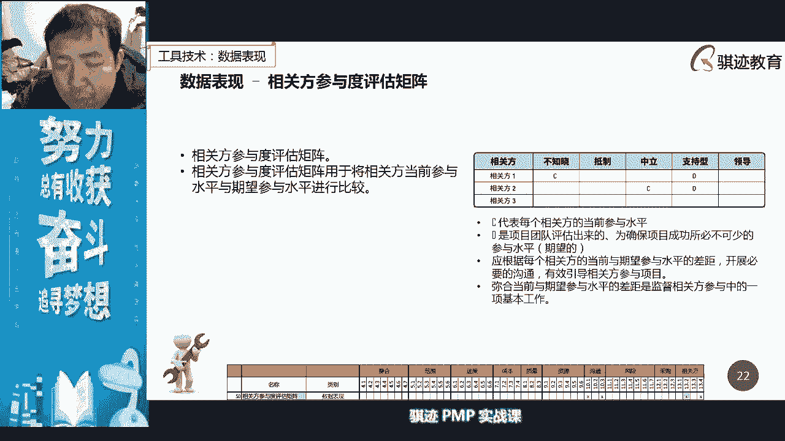

这个其实是相关方内容，所以这节课不讲啊，沟通当中有一个很重要的东西叫做会议，会议，或者面对面的会议，然后也可以邮件进行啊，开会啊，当然也可以啊，那么我们在会议当中呢会怎么样呢，会怎么样管理的呢。

来我来给你们讲一下啊，然后说啊，这我在这里罗列了一下，ok啊诶诶诶，嗯等等诶，我的pp酱，诶这当中的哦。

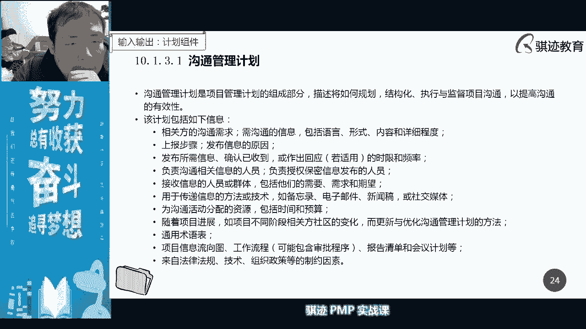

sorry，诶嗯嗯稍等啊，稍等诶，我的pp当中应该有罗列会一点，啊我那页ppt没有保存进去吗，啊sorry sorry。

我记得诶，但是我记得应该保存了进去，好吧，那么大家听大家听我扯，请大家听我扯啊，哎我那一页保存的怎么保存到哪里去了，那么大家听我扯，一个项目经理管理会议啊，我后面把这个ppt会更新一版，给你们更新版本。

我会记录下，我根据我的经验，一个会议该怎么开啊，我先语言上你们跟着我啊，你们可以理解一下，一个项目经理要管好会议，那么首先你的会议管理一定要是什么到位的啊，同意的，那么怎么好管理好一个会议呢。

怎么管理好一个会议呢，第一你的会议应该分为两类两大类啊，为主啊，第一类叫做定期会，第二类叫不定期会，定期会议应该是什么固定形式，固定时间召开的，那么你要形成一种纪律。

大家应该在固定形式固定时间呢进行语汇，不定期会议呢应该是什么，提前通一段时间，至少给大家足够的时间准备，提前时间通知大家开会啊，这是一点那么一个会议的通知，那么首先要什么。

你在确定会议时间的时候就开始有了，如果你的会议第一点，如果你的会议是需要邀请重要和关键相关方的，比较领导啊，客户啊，这些首先要和关键相关方确认时间，是否有要确认时间窗口啊，然后要有多种方案。

你的会议开始时间也有多种方案，这是第一个，那么确认好时间窗口之后呢，你就开始进行会议邀请，首先在会议准备的会议邀请当中，首先第一点，你要告诉所有看官方开会的主题是什么，注意主题只会有一个。

你要在主题上明确的告知我们做着，比如说你的会议主题是某某项目开工协调会，所以他就是个kick off meeting对吧，他是开我们讲规划结束启动，开始时候会这个会只会开一次，所以它是不定期的对吧。

等你准备好了就准备开始了，对吧好，你们只会主题曲会员，但是主题之下，如果这是一个相对比较复杂的会议，那么你会列出若干个会议的议题，入缸会议题，比如说第一个议题是什么，论日落实人员责任，第二个议题呢。

大家讨论若干关键问题的解决方法的意见，第三个议题是什么，大家总结经验经汇报，第四个议题，领导领导动员发言对吧，诸如此类，你会列若干个议题，同时你会对这个每一个议题所花的时间，进行一些描述。

比如第一个议题我们会准备花一小时，第二个议题呢准备花两小时，第三个议题呢准备画一小时，最后领导发言呢一小时，然后罗列一个议题时间，那么罗列完了议题之后呢，所有的议题组合在一起，就成为了什么一个异常啊。

那么那一题的排列组合和组合啊，管理当中呢它会有一些东西是什么，要注意注意一个东西叫劳逸结合和啊动静结合，什么叫劳逸结合，动静结合呢，首先议题当中，你要避免有些人连续的参加多个议题，然后那些人会很累啊。

然后呢也要避免大家什么都在都在什么，比如说一段时间都在那边听，人家都听，开会听会听的时间长，就为什么啊，对不对啊，就会打瞌睡，就会精神散乱啊，精神散乱，所以议题当中呢我们我我是比较鼓励什么啊。

有一个什么啊是听的广播性的议题，叫推式沟通，对吧啊，拉式沟通，sorry啊，拉屎沟通，拉式沟通的一种一种议题啊，然后接下来呢是互动式沟通，大家呢啊有一个什么互动讨论环节，然后可以把人调动起来。

然后呢我们可以有一个什么东西啊，比如说茶歇呀啊，中间穿插午饭啊，晚饭之类，然后呢将这些东西呢穿插起来，让人能让人呢在整个会议当中不至于过于疲乏，或者不愿意接呃，接下来一些讨论啊，这是一个议题的安排。

但是每个议题呢要有一个固定的时间，否则就会什么东西啊，斧子就会有什么一个锅里就开的过场啊，有时是有时会为什么开的没完没了，就是因为不注意不注重什么议题的控制，这是一个，那么接下来一个是什么呢。

就是说如果是一个比较大型的会议，那么要注意一个事情，就是说大型会议我们一般会备选一两个议题，那么我防止什么，比如说你邀请了一个很著名的专家，开会临时他有事情来不了了，那么你怎么不记得开空窗吗。

那你可以把备选议题呢放上去进行讨论，然后呢不失也不失为是一种好的方法啊，所以所以如果你有备选议题，那么你要告诉相关方有关的相关方，这是个备选一，但是你不用广播，但是你告诉我这涉及的相关方，你准备一下。

如果领导不来，那你就顶上去对吧啊，然后呢议题和安排还要注意一个什么呢，就是说一般重要相关方，关键相关方，比如领导啊啊，专家权威啊，这些人一般会留在最后让他们进行发言总结啊，发言总结啊，这是个议题安排。

那么一题安排好了之后呢，我们一般会预先将这个议题安排呢，成交给重要和关键相关方案进行预览，告诉他们这些议题是这样安排的，你看看你有没有什么议题要加进来，确保重要相关方和关键相关方。

对于我们的一体量没有大的意见，大家没有误解分歧，ok这就可以进行过啊，一题就可以发出去了，确保所有的相关方，能够有效的什么准备啊，有效或者有足够的时间去准备这个会议，然后去参加啊参加。

那么在邀请会议的相关方邀请的时候，要注意什么东西啊，有些人是可以参与的，有些人呢是可有些人是必须参与，有些人可参与不可参与，你要在邀请当中要注意，因为有些时候如果你邀请一个人开了一天会。

但可能他只需要在会上讲五分钟的时间，那么其他事情都是浪费人家时间吗，这个时候就造成什么，你浪费了别人时间，下次别人也会浪费你时间啊，这是一个恶性循环，所以很多时候开会的时候要确保有恰当的啊。

有效的恰当的就是说一个会议机制，比如说如果你做的比较到位的话，你可以一个在一个复杂的会议，当你会告诉湘科相关方啊，你这个你在会议的邀请发出去之后呢，有人告诉我们啊，你会在这个疫情当中呢参与进来。

那么这个医生是这个意思，是必须得参加的，如果你退会或临时退出去啊，或者怎么样就没有问题啊，这样就节省了彼此之间，对方对参与你这个会议呢，也会更有更高的积极性，不好意思，这是邀请邀请发出去之后呢。

然后你如果是复杂的会议，尤其是多天会，你就可以做会议安排准备，比如说会场布置，比如说行程安排，甚至酒店住宿吃饭等等等，这些东西都要准备好，还有呢有些很重要的有意义，比如说项目的庆祝会啊。

成功庆祝会啊等等之类啊，客户答谢会啊等等，这会呢可能要准备一些什么纪念品，小礼品，这东西啊要时间准备好好，一切准备妥当之后呢，我们就开始开会了，开会当中在开会之前，首先一点，如果你是项目经理。

如果这个会是你主持的，那么你是个主持人，如果这个会议又比较复杂，那么你记得要记住，你要安排一个人是吧，作为记录员去记录会议，因为主持人很有可能是在一个复杂的会议当中。

很有可能是没有精力去做什么做会议记录的，而我们讲开会很重要一点就是有会议纪要，所以你要额外安排一个人做会议纪要啊，有一个熟练工做会议纪要，记录会议的主要内容，和双多方或双方或多方达成了一致的。

一些主要达成一致的内容，结果啊，这个主意，那么作为一个主持人，你同时也是个引导员，要引导大家紧扣，这个当有人偏离一层的时候，你要使用各个语言技巧，拉回到你的异常啊，这个也很关键啊。

所以否则有些人就会开火车啊，火车越开越越离谱对吧，火车就脱轨了对吧啊，那么有些人呢虽然会紧扣医生，但是呢他容易什么，有些人最喜欢做我，我以前遇到一个人很牛叉了啊，他说我就说三点啊。

我们一定要听到他说我就说三点，我就开始头痛，为什么他说第一点是什么什么啊，第一点又分为三小点，第一个小点又分为三个方面，然后整个整个会议肯定就会抄，然后我就是这个表情啊，但是这种会议当中一般我不一。

我不会邀请他，第二如果我是会主持人，我就会想办法什么打断他，那么我就会控制他时间，然后时间要确认的时候，你应该让所有的发言人什么告诉他们，他们所拥有的发言时间，当他们需要发言的时候，占用大家所有时间。

精英这个群体发言的时候，你要有发言时间，比如说你可以规定他十分钟内讲完，或者15分钟讲完，那么关键跟相关方，比如说领领导权威，这种人呢时间可以比较久一点，然后呢，但是你要跟他说，我们规划给你多少时间啊。

是这样，那么这是一个啊，当然至于如何去有效的打断那些呃，浪费我们时间，或者是满嘴跑火车的人，后面会讲啊，结束时间减速，并且确保确保切题，如果超时的那个引导员，你应该紧扣的把这个会议呢。

围绕着你要开这个会的目的进行，比如我们前面说开工会，开工会，kick off meeting的最主要的目的是什么，记得吧，哎大家在公屏上打出来，kick off meeting的最主要的几个目的是什么。

都打在公屏上，啊不能光我说对吧，你们要跟着我，keep off meeting，我们讲开工会，kick off meeting，最主要的目的啊是哪几个，谁跟你说确认项目经理授权职权啊。

确认项目职权是项目章程啊，对获得相关方的承诺，对哎对后面的同学对的啊，规划结束正式启动，正式开始啊，执行正式开始，划分责任，取得明确的职责分工对吧，激励士起名啊对啊，消除分歧，ok对啊对，所以ok啊。

我看到大部分同学理解是正确的啊，所以这是kick off me的目的，所以你在kick off meeting当中，你要时刻作为一个节奏控制者，把握所有人的发言，围绕着这个主题进行。

千万不要让他们变成一个什么k和b，并变成一个死吗，撕逼会对吧，然后相互之间开始撕逼，然后那个长门就失控了，对吧好，所以这是开会在当中很多的需要注意的地方，一定要把我们会议当中所有的基调呢。

及时分发给所有相关方啊，这是开会的最后最后一步啊重要，那么既要当中要注意什么东西，一要把所有达成的共识要记住，第二要采取的行动记录下，第三要把会议当中所有相关方，相关的承诺要记录下来，这是重要的啊。

keep off，ok啊啊rk吧，这是后一张，那么我们最后讲在这这一小节当中，我们最后讲在一个会议当中，而不是恶意吞，就是无意中喜欢拖时间的一浪费，我们有效时间的打乱，会气氛节奏，让所有的所有人。

你想打啊，想想上去抽了两碗啊，嘴巴子的那些人呢即时终止掉，就算你告诉他只能发言15分钟，他讲了一小时，那么怎么办呢，比如说有一个人，你你知道，首先如果你知道他发言会时间很长的，那么你可以怎么办呢。

你可以将它的发言，这个时间安排在重要的相关方，关键比如领导和客户的发言之前，同时告诉他，你讲完之后就是领导或者客户讲，那么你其实就暗示他，如果你拖了领导和客户的说话，就会往后拖，你就会请抢领导风头。

那么他就会受到暗示和收敛，这是第一个方法，第二个方法是什么呢，你可以将他的发言时间安排在，吃午饭和吃晚饭的时候之前，那么这个会导致一个什么事情呢，如果他讲下去，他就会下面的人就会开始怨恨，他。

就会开始各种暗示，他不用你暗示下面的人就会暗示他啊，与会的参与者就会暗示他肚子饿了啊，他也自己会知道，他也自己会知道啊，那么如果有一个人，你是事先不知道他会开会很拖沓的，那么他突然开始在拖打别人。

本来说给他15分钟时间，然后十分钟之后到了20，已经到20分钟，已经20过他了，他与众于动无衷怎么办，不管你们方法，你悄悄的给你，马上就回来，哎呦你有个电话，那么你先处理一下啊，这样你的发言很精彩。

那么我们接下去有技术空间继续说，然后把他的话语权呢抢回来，然后呢把这个会呢节奏的进行下去，进下去，用可以用类似的方法去打断他，打断它，或者是说什么呢，或者说如果他不看手机，你可以在语会上直接提出一个啊。

非常非常比较复杂，或者他难以一下子一瞬间反应过来一个问题，突然间问他一下，他只要一愣，那么你就可以把话题讲回来了啊，这个问题呢是我们大家关切的，那么我们啊前面已经分享交流了很多了，然后我们关于这个问题。

我们稍后再讨论一下对吧，然后你就会发顺溜，这就溜下来，同时给他一点暗示啊，会有这样很多方法，凡是只要把这些拖延时间，影响大家讨论效率的这些这些人话啊，话筒的控制权啊，拿下去就可以。

但是千万不要直接粗暴的打断人家，这个是不礼貌，也不是不好的啊，也是会影响你的社交关系，对啊这点要注意，好那么我们继续讲沟通，我们规划沟通完成之后呢，就会制定出一个沟通管理计划。

沟通管理计划当中分分为什么，沟通是如何去上报的对吧，沟通的方式方法频率怎么样啊等等诸如此类，ok啊，这也没有什么特别好，它基本上就是一个方法论。

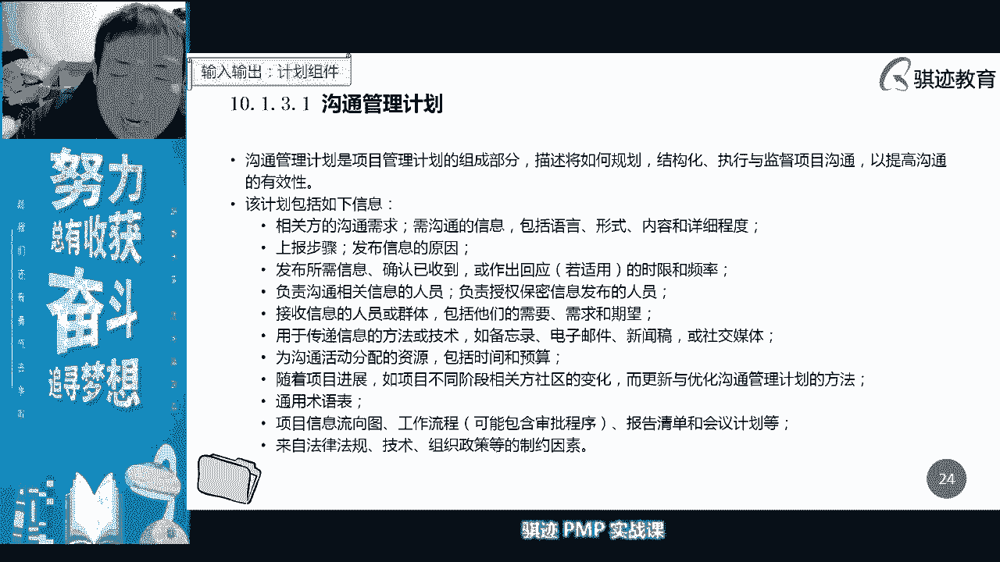

也是个做规矩的方法哦，这是个样例啊，这是给高通管理当中一个样例好。

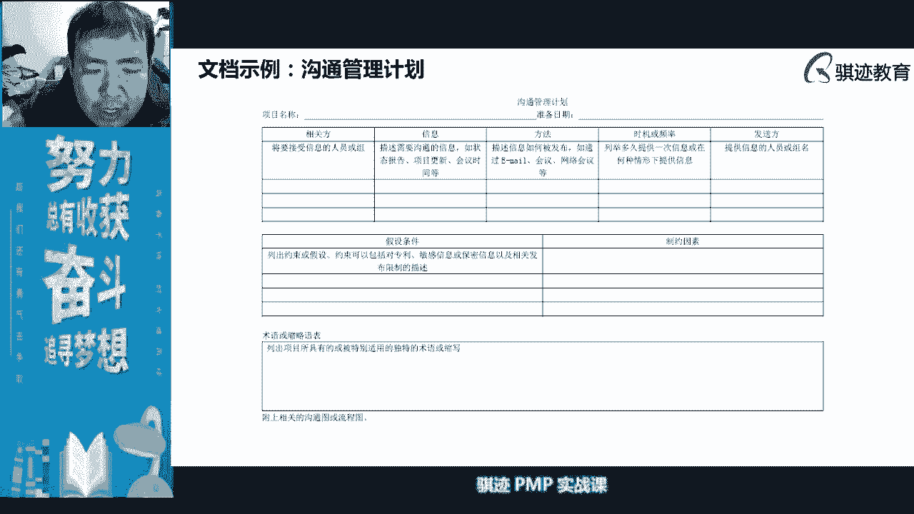

那么沟通管理当中有一个很重要，这一页很重要啊，同学们注意这一页，我当前的这一页很重要，这一为什么很重要，这一页讲的是沟通，是我给大家加出来的，沟通管理和相关方管理的边界在哪里，考试当中偏僻。

考试当中经常有大量的同学搞不清楚这道题，比如说在相关方，比如说他举个例子，相关方不满意，他搞不清楚到底应该从沟通方面去回答，还是从相关方方面回答，这个时候我给大家一个东西很重要，去判断叫五个w。

从五个w去判断什么叫国大兵呢，who和谁沟通，what沟通什么，how如何沟通，when什么时间点沟通，how often，沟通频率如何，你只要在一个题目，你看这五点，如果他这个五点全做到了。

他知道和谁沟通，他知道沟通什么样的东西，他知道用什么样的渠道去沟通时，沟通的时间点在哪里，然后呢沟通的频率如何，这五个事情都做到了，如果相关方还不满意，那么就相关方管理出问题，你肯定没有切中题。

虽然你的沟通是没有问题，但是你没有切中相关方的心理诉求，所以他也不会，如果这五个做不到，那么先不要考虑养老，因为你没有把沟通做好，全官方是不会满意的，所以这个时候呢仍然是沟通管理有问题。

所以看到底是相关方的问题，还是沟通管理的问题，就看这五个w没有做到，ok学到了没有，如果学到了，请把学到了三个字打在公屏上啊，这个东这个东西是非常重要的，是帮助大家在考试当中。

区分相关方的问题和沟通问题，避免大家十分啊，如果你不知道这两个知识领域怎么去切割的，考试当中很有可能就在会丢分啊，虽然占的比分分比不高，但是我们要每分必争，因为相关方和沟通管理呢都比较简单啊。

是很容易拿分的地方。

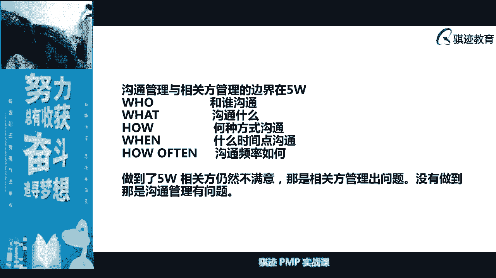

来看一下啊。

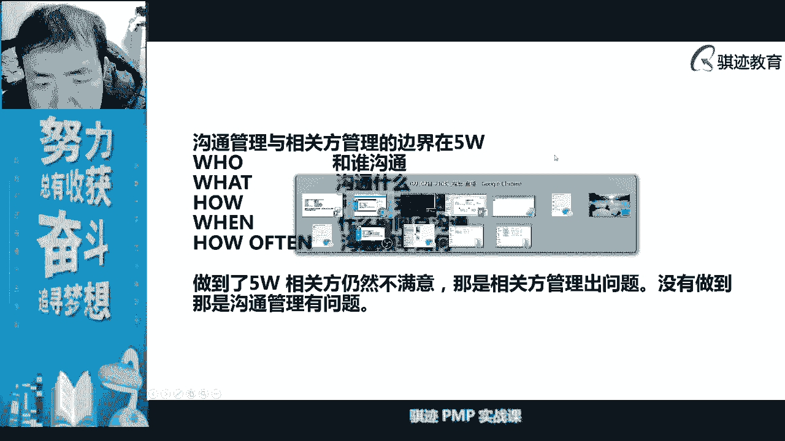

不卡啊，同学看啊，这里品质很正常啊，不卡，我这里开的是高清，不卡，学到了没有啊，学到了啊，很多同学有些同学已经说学到了对吧，好不卡，ok啊，今天真的不卡啊，今天是真的不卡，我这里延迟很低啊，延迟很低。

团稳定，q学友很稳定啊啊我们的平台很好很稳定啊。

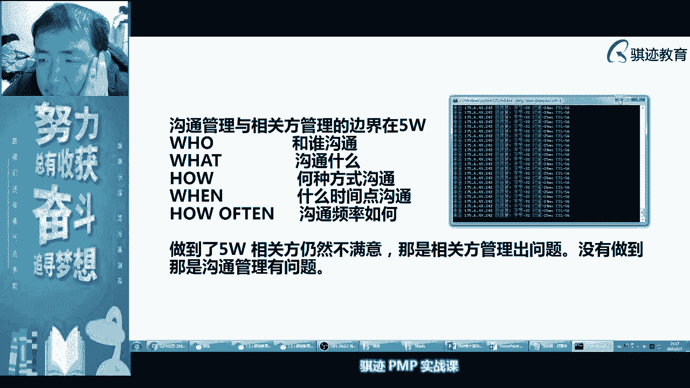

ok大家坚持一下自己的网络，ok啊好，那么这是规划沟通管理。

规划完沟通管理之，执行沟通了对吧，执行沟通呢就是我们注重什么沟通和反馈，沟通和反馈啊，要注重feedback，那么很多时候项目经理如果要及时收集反馈，要什么，要给沟通方以反馈的渠道，以反馈的渠道啊。

那么反馈渠道可以有很，很多时候呢作为一个项目经理，很多时候沟通当中你要给对方沟通留有余地，如果你很霸道的把有些事情就认定定性，在沟通当中，我们不会把事情说死，我们会把很多的患难留有余地。

期待对方和自己沟通，去寻找问题，我们的目的是通过沟通去消除误解，提高工作效率，提高产出对吧，然后达成项目完成。

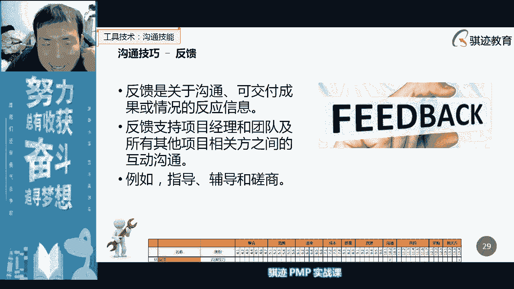

工作绩效报告是我们沟通，沟通当中一个非常重要的内容，我们之前讲过项目当中工作绩效报告，因为应该分为多个版本对吧，记得吧，project report，那个成本预算那一章里面的客户预算等。

不等于我们的我们的成本计算不等于啊，所以这个当中一定要当着你的project reports，肯定就不一样了对吧，给客户看的时候呢，可能是满足绩效，一个是成本基准，一个是预算，中间差了一块是利润。

我们的管理储备记得吧啊，所以沟通当中注意给不同人的内容，应该是有区分的，分圈子对吧，然后工作绩效报告为了能够适应不同圈子需要，应该也是什么，也应该也是有若干，会有不同的工作加报告，所以工作绩效发布。

工作绩效报告的发布呢，是我们一个定期的沟通内容，所以我们在项目管理当中，尤其是要注重什么定期的，按照什么啊，周指定行会刀，现在像里程碑这种呢，他可能出一些非定期的一些项目报告，也是有可能，多来瑞。

有助于我们的沟通的完成好，这是会议管理，大家看这里啊，我们看看会，那么沟通当中还注重人际交往，还注重人际交往，点对点的啊，也叫做点对角，对广东点对点交通智智商，范围呢应该用不同的沟通方式去解，ok啊。

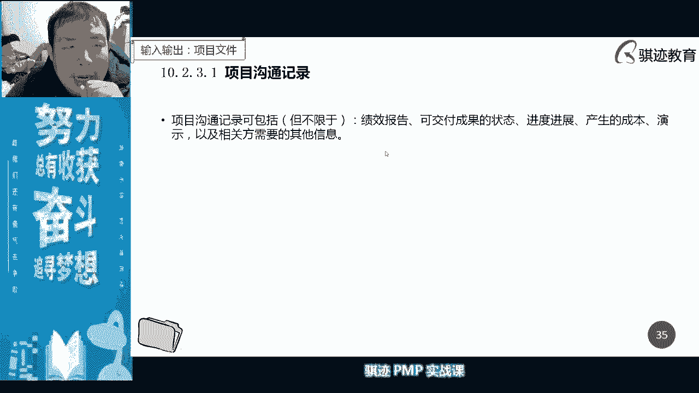

那么沟通之后呢，在管理沟通当中，我们每次进行完沟通就会，好大家现在看得看得见我画面吗，看得见我画面吗，我等一会儿了，今天还好，沟通的，沟通的内容没有那么的多，其实本来也就没有那么多，所以没关系。

我可以等一下大家，等一下啊，ok啊，现在可以了吗，现在如果可以了，我重新开启直播了，然后所有看得见我直播画面的同学，然后在公屏里如果觉得还流畅了，现在开始流畅了，请在公屏里打个流畅或者扣一个一啊。

如果还是卡的话，扣一个二或者打不流畅啊，我看一下我的直播平台还是可以的，ok ok流畅了，现在可以了，流畅了是吧，前面我觉得ok可以了对吧，那我觉得可能是前面的，是那个前面是平台的问题，我没有动啊。

我只是把我只是把我的直播平台关了，再开一下，没有问题啊，什么配置都没有，刚才不行，现在好了啊，好吧这样吧，那么同学们我们listen lear，我们listen lear，下一次我开始直播之前。

我把我把直播平台从几下再开，好吧啊，我就我估计有可能是这个这个有点小问题，直播平台的小问题，现在好，现在可以了是吧好，那我们就继续啊，好那么我们继续啊，还好那么我们将在监督沟通当中呢。

我们会使用观察和交流的方观察交流，这样工具呢去看实际沟通的效果如何哈，去挖掘潜在的需求啊，ok啊，所以沟通这这门课呢。

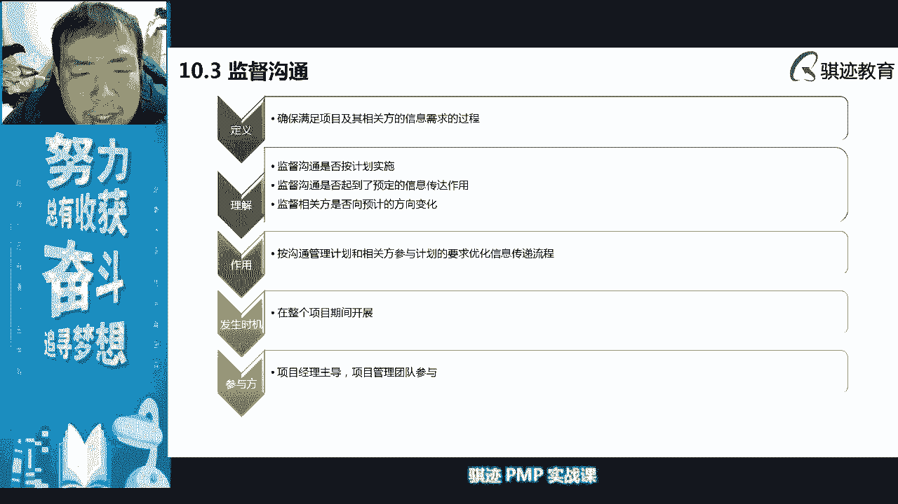

其实所以说上我觉得上一晚上呢，就是说其实没有特别大的意义啊，没有特别大的意义，其实一个小时就足矣了，一个小时左右，所以在很多啊。

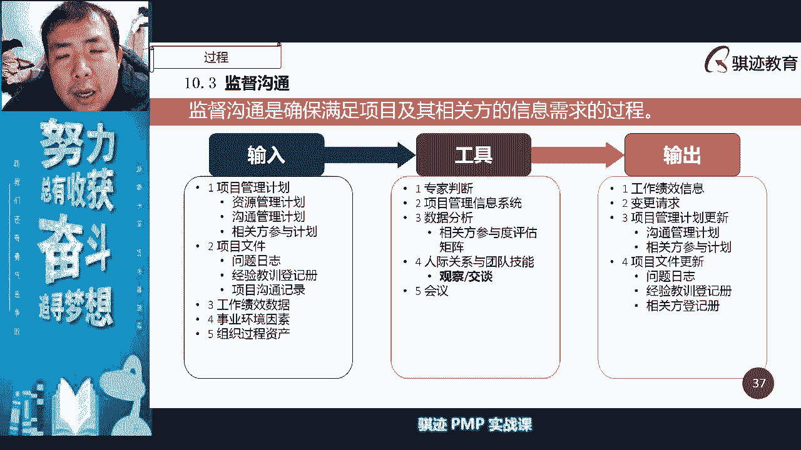

在很多的理论当中，其实沟通管理和相关方管理是合在一起的，知道吧，因为沟通管理就是为相关方服务的，知道吧，沟通对象就是相关方啊，ok啊啊，因为没有太多讲，但是有一点要注意，就是考试当中沟通虽然很少。

但是考试当中一定要注意沟通，我们首先就是说要知道沟通渠道，我们刚才说的沟通渠道，尤其注意项目经理算不算在里边啊，沟通渠道要会算，接下来我们知道沟通当中会产生沟通记录对吧，沟通记录可能考试会问一下啊。

然后知道沟通管理计划去管理一些什么东西，然后在实践当中呢，我们要记住一个什么东西啊，沟通沟通当中，我们是怎么样去做人和人之间沟通啊，人是怎么做通，怎么样去正式语言去沟通和非正式去沟通。

怎么用自带去表达啊，ok啊，那么这些东西因为当时上网络刚刚写，我就很难去用现场的演示方式，帮大家做更多的演示，所以只要大家记住，我教给大家怎么样去做会议管理，我就觉得那个生活挺好的啊，ok啊好。

那么接下来基本上就没有沟通，就没有太多的内容啊，所以我就不拖大家时间，因为大家年底来比较忙对吧，今天的课程就到此结束啊，结束其实我们刚才讲完题，内容已经不多了啊，那么做第一题，第一题。

对比基本的沟通模型，互动的沟通模型多了什么样的步骤，啊很好反馈和响应，反馈和响应啊，没关系，都没没错啊，都是敌对吧，有些逼的吧，相互传递没有，有种说法叫相互传递，反馈和响应对吧，对方正在输入中对啊。

反馈响应ok啊，所以第一道题目的答案是d，有没有一种东西叫相互传递，没有这种要传递这种说法的啊，我们要上课也没有讲到第二个第二道题啊，第二道题，以下哪种情况信息又接收方负责，以下哪种东西是有信息的。

接收方负责，这个很简单吧，对选d对吧，告知信息已经收到，信息的清晰度是由信息的发送方负责的，信息的完整信息是信息的发送方负责，信息的传递也是由信息的发送方负责的，除了什么，如果你是拉式沟通对吧。

只有信告知信息收到时，有信息的接收方负责对吧啊，这很简单啊，所以沟通那就没有什么特别复杂的难的问题啊，那么第三道第三道呢呃略有点重要啊，略有点重要，第三道你管管理在地理上分散的团队。

你希望为团队获取专家意见，那你可以用哪种技术去获取，第三道题目可能叫略微难一点点，其实也很简单啦，你看看就知道第三道选什么了，平安道选b对吧，哦非常好啊，都选b的话，那就非常好，ok啊。

我们叫德尔菲技术是什么，将专家隔绝开来，然后进行汇总以获取正确客观的意见，所以德尔菲恰好是符合这个体积，因为啥地理分散，就是德尔菲啊啊德尔菲，所以第三道选b，好，那么第四道，状态会议上。

项目经理将状态报告发给相关方，谁负责，信息信息清晰完整的被正确的理解啊，这个也很简单吧，课程里面没有看到第三大对吧，第三道题目其实是一个什么啊，考你工具技术了啊，德尔菲是一种什么东西啊。

啊是一种我们前面讲过的，就是说是决策技术啊，我们在很多的地方是决策技术，是之前课程讲过的对吧，只不过放在这里讲，因为沟通没有什么太好考的东西啊，啊c ok非常好啊，这个题目第四道也很简单对吧。

第四点很简单，也没有多，没什么好多说的啊，c，ok啊，第五道，你负责管理一个项目，你有12个团队成员，项目经理确定有多少个渠道，来算一下第五道，第三道是蒙的，哈哈啊，因为第三道只有德尔菲见过对吧啊。

好有12个团队成员，那么一共多少个团队成员啊，12+10 33x13-1是12，13x12÷2是多少啊，就是13x636 18 78，所以这道题选d啊，很简单对吧，对吧，所以知道为什么这道题是选d啊。

是因为你有12个团队谁呀，如果这句话改一改，如果这道题改成团队成员有12个，那么有多少沟通渠道，我问你们，如果团队成员有12个，项目经理算不算团队成员算的，所以如果这道题改成团队成员有12个。

那么答案就是选c的，明白吗，ok啊好，那么第六的，关键的项目设计信息，通过电子邮件传递给项目委托人，这导致委托人受到了不恰当的产品设计文档，出现这个问题的最主要原因是什么，李雷的，这道题有问题啊。

我知道知道我第五题你们觉得有问题，他们讲项目经理确定这道题，如果你觉得有问题，你应该看英文，英文应该是project management的啊，make sure。

this is how many potential communication channel，communication channel，所以这个这个什么潜在的沟通渠道，项目经理make sure。

他的确定是make sure，how many，先等下，所以他讲的是整个团队的啊，所以你跟你如果觉得中文翻译的不好，你去看一下英文啊，如果讲针对于项目经理有多少个沟通渠道，是多少个啊，是12个啊。

注他要讲究针对于项目经理有沟通，多少沟通渠道，那个是12个ok啊，第六道是选b没有问题吧，啊选b也没有问题对吧，好第七第八道最后两个项目的信息发送呢，针对不同相关方信息量巨大，哪种方式比较合适，第七道。

英文看不懂啊，所以同学考偏僻懂一点，因为你觉得中文翻译的狗屁不通的时候，你还可以看一下英文，第七道对啊，第七道信息量巨大，那么选拉屎沟通会更好对啊，拉屎沟通特点是什么，可以一次性传递大量的信息。

但是呢受众不确定推迟沟通了一次，可以一次可以指定受众方，但是呢发送的信息量受限，交互式沟通呢受众方极为受限，但是呢信息传递速度特别快，就是拉式沟通没有沟，是沟通啊，可以啊，好那么最后一道，题八道。

第八道选什么，选b和c，来来来来，第八道，我们上去看看啊，合同管理，沟通管理，语言我们的发布所需要的频率对吧，沟通负责沟通的人，接收信息的人群，用于传递这个方法，沟通的资源，通用术语表。

我们的清单等等等等东西对吧，项目管理软件不管理，项目管理人里面没有指定对会议模板有的对吧，相关方目录也有对吧，上报步骤里面也有对吧，是不是啊啊，所以应该选b啊，选b。

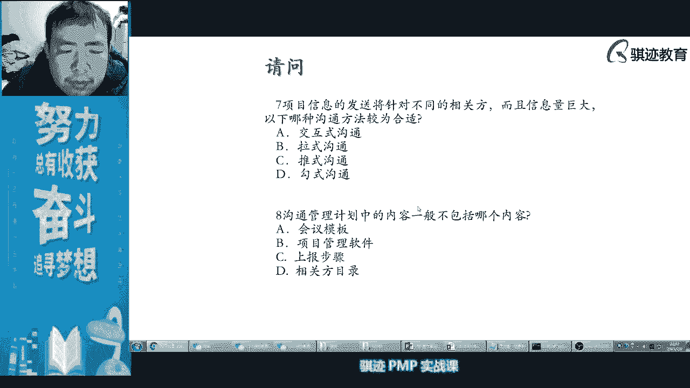

上报步骤当然有的啊，ok啊好，那么今天沟通管理就上到这里，沟通管理上的比较短，因为沟通本身就是比较短，然后呢但是和其他的内容呢拼起来呢，又显得那个呃比较比较比较难搭啊，所以在晚上的这个风格课程当中。

沟通管理单独上一天，但是略微略显时间浪费了一点，但是又没有办法啊。

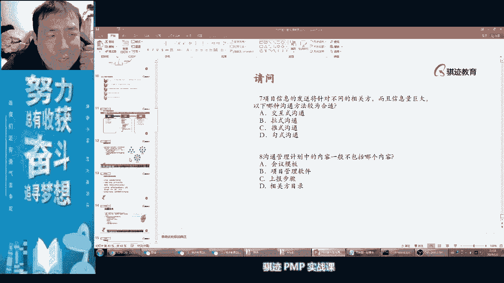

又很难跟其他搭起来，所以今天的课程呢基本上就到这里，那么我今天会早一点下课啊，所以还是希望大家能够嗯过滤到，顺利的过好春节对吧，也该陪客户去喝酒了，为客户去喝酒对吧，该收账去收账对吧。

该在最后项目结束冲刺，然后去啊，享受假期的，要冲刺一下对吧好，那么我们今天的课程就上到这里，然后我们周四还有节前的最后一次课啊，我们会开始讲后面的风险管理啊。

