# PMP认证考试课程最新完整免费课程零基础一次通过项目管理PMP考试 - P32：PMBOK第六版 第十一章项目风险管理-33 - 骐迹PMP - BV1Sb4y1f7Yt

晚饭都吃了吗？晚饭都吃了吗？我把话筒。没有听更清晰一下。有些说把前面的课程再讲一遍啊，再讲一遍。😊，嗯，大家可以看回放呀，有问题可以单独来群里问我OK啊。😊，总有一些同学很活跃了，对吧？嗯。

今天直播效果还行。吃了吃的窝头。有同学说他吃了窝头啊，是窝头嗯是什么样的窝头，对吧？我现在窝头算出来也是好东西的。OK啊，我们开始上课啊，同学们好啊，今天是我们嗯直播PNP直播课。

在春节前的最后一堂课了啊。😊，那么。大家有始有终啊，这一年来的学习都很辛苦的要有始有终啊。最后一节课呃大家也好好要学好啊。那么最后课一节开始之前呢，我们因为上节课有直播呃。

平台的那个那个那个有一点延迟啊问题，卡顿和延迟问题。我们稍微把上节课的讲主要重要内容过一下啊，沟通管理。😊，公放呢其实很简单。那我们跟考试有关的，我们就是再稍微提一下啊，跟考试有关的。

比如说我们讲沟通管理当中，我们的沟通渠道，潜在的沟通渠道啊，这是经常会考的一道题目。潜在沟通渠道的公式是N乘以N减1除以2啊。考试当中要注意呢项目经理有没有被算在里边啊，老师要注意。第二个呢是考试当中。

我们知道沟通当中有技术有5种依据啊。😊，紧迫性、可用性、易用性、项目环境适应性和呃敏感性、保密性啊，一般很难有一个沟通工具，能够所有的这5个都能满足的。😊。

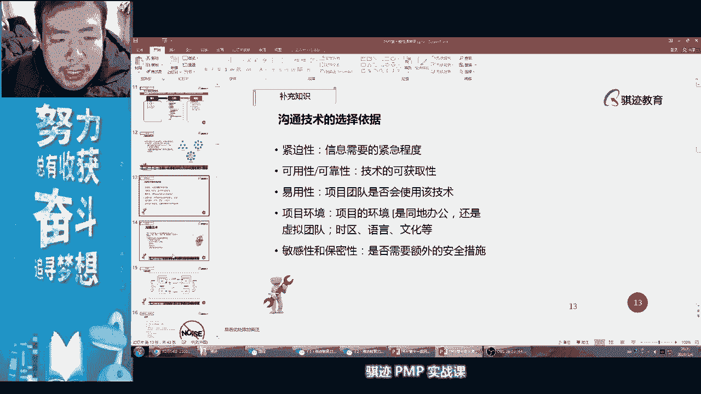

要根据不同的情况去使用。然后沟通模型当中呢，我们会分呃分为呃解码和编码。我们用语言作为解码和编码的工具，对吧？

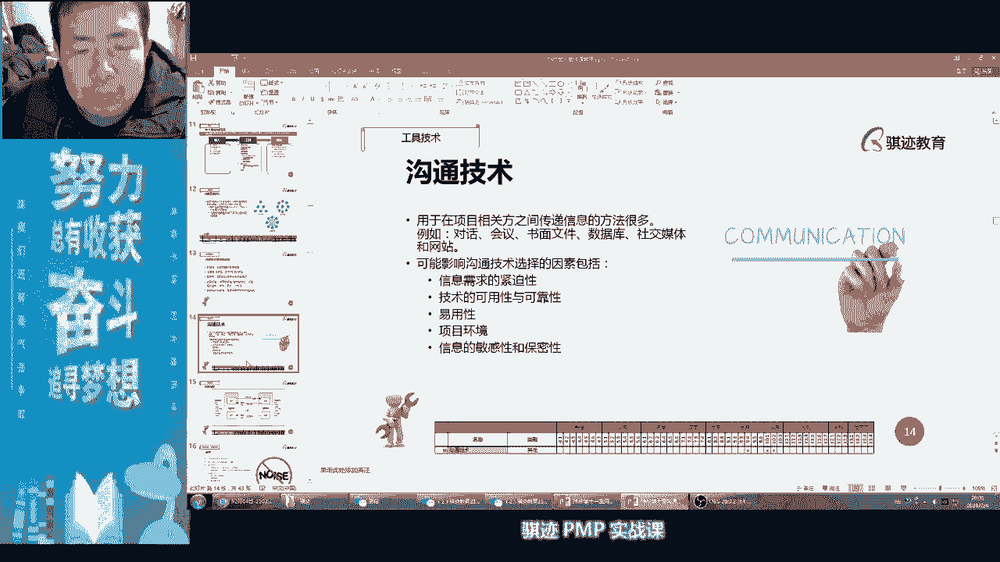

然后要注入一噪音。

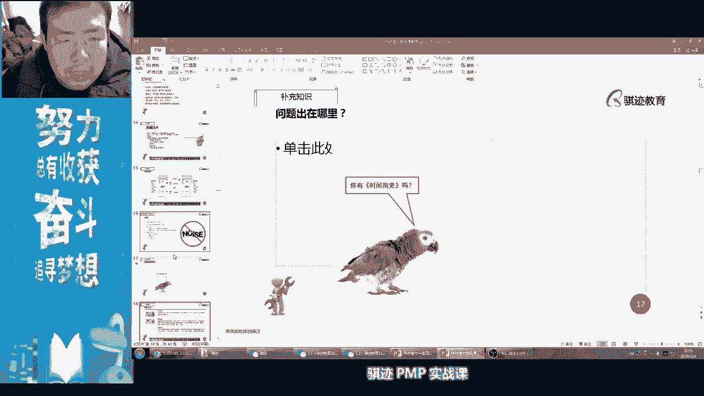

然后在沟通当中呢，我们会要注意到一个很重要的，我跟大家还是强调一遍啊，很重要的就是5个W沟通和相关方的边界。who和谁沟通what沟通什么东西，how如何去沟通呢。when什么时什么时间点去沟通。

how often沟通频率如何做到这5个W呢？沟通管理呢，就基本都做了做了就没有问题了。但是如果没有做到呢？那么就是沟通的问题，做到了以后，如果相关方还没有还没有满意，或者仍然有问题呢。

那么就是相关方管理出了问题啊，我们会在相关方继续讲。😊，OK这是很重点的啊，考试中要帮助大家区分的啊，考试当中这个就沟通和相关方经常会搞在一起。😊。

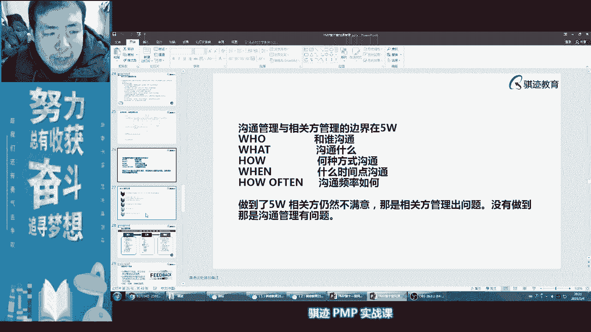

那么管理过程当中呢，我们讲啊有讲了一个怎么样进行会议管理啊。OK这就然后其他的话基本上就没有什么太重点的内容啊。呃，其中包含了一些我们讲会议管理是怎么去管的啊，这些东西呢考试不一定会考。

但是呢我们的实用工作中使用呢非常实用啊，这是上节课的主要内容啊，那么我们这节课继续啊，这节课的内容就比较多了，且比较量占的比重比较大啊，风险是占的比重是比较大的啊。除了范进成之外，占的比重比较大的一块。

😊。

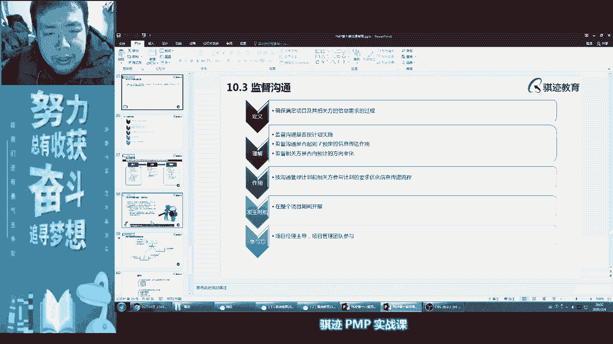

那么风险管理呢是一个什么概念呢？首先大家要知道什么叫做风险？风险是一种不确定的性事情。只要有件事情它存在不确定性，那么它就有风险。无论是向好还是向坏啊，注意就有一个有个概念就是无论是事情有可能变好。

有可能变坏，或者发生好的事情或者发生坏的事情都叫做风险啊，发生好的事情呢，我们称之为机会发生不好的事情呢，我们称之为威胁啊，所以风险呢就在于机会加威胁啊，所以风险是指的是一个事情还没有发生的时候。

它的可能性啊，称之为风险风险大风险小有可能性啊可能性小，对吧？一个事情，如果尤其是负面的事情，如果已经发生了，那么消极的风险已经发生了，负面的风险已经发生了，我们称之为问题一啊。

这个时候它就不再称之为风险。因为已经确定了。无论好和不好，它已经确定了啊，这个概念一定要注意，那么我们在会在问题管理当中呢，对它进行管理，而不是在风险管理当中啊。😊。

注意父性管理呢是指这个事情还没有发生，我们进行了一系列干预措施。是这样。

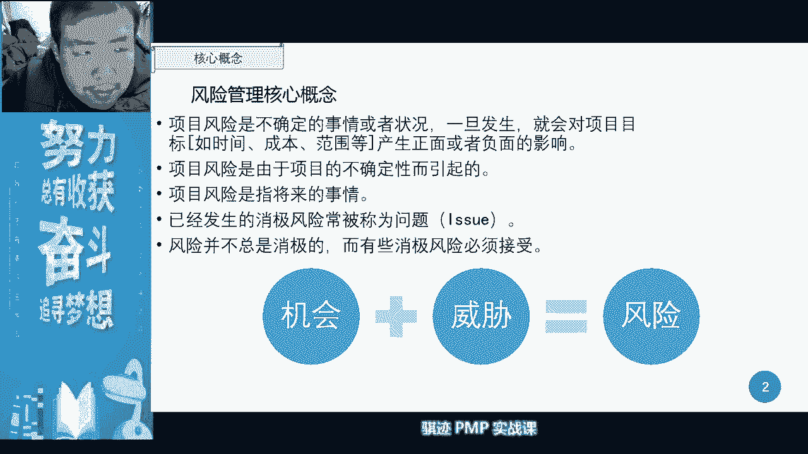

那么风险当中呢，瞄准风险会有三个要素啊，一个是风险的事件，一个风险的概率和风险造成影响啊，这是其实也是我们很多时候管理一件事情，管理一件事情的问题当中会一样的。我们管理很多事情会考虑到一两个维度因素。

一个是什么？这个事情的影响范围，一个事件的影响程度，对吧？然后呢，还有一个风险当中呢，我们还有一个叫做posibility啊啊，proability啊，posibility就是说它的发生的概率多大。😊。

所以我们就我们用风险期望值来描述风险的严重程度，它等于什么 probability加上乘以 impactO啊，这个公式只是一个抽象的啊，具体计算不是这么算的。😊。

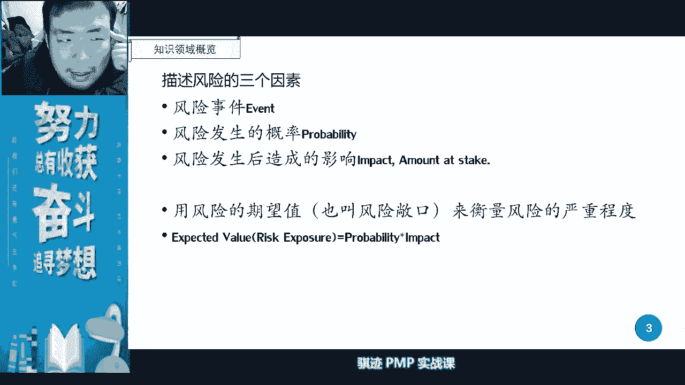

那么在PM博客的第五六版当中呢，我们将风险分为两大层次。第一大层次叫单个项目风险，它是指单一的某一件事情所引起的项目的正面和负面的影响。那么除在这个层次之上，我们还有一个叫什么？对于整体上的影响。

叫做整体项目风险。项目的整体风险是来源于项目当中的各个风险的集合组合。因为项目当中会有一些风险呢，它是正面的，也一有风险呢是负面的。😊，我们把它合起来看，看看这些事情，总体上来说是呃是朝着正面的方向。

而是朝着负面的方向，然后或者是既有朝着正面，也有朝着负面，然后看它的方向的区间有多大是这个意思。😊，啊，试一思。好，那么风险当中我们又分为已知风险未知风险这我们学过，对不对啊？我们在成本那一块就学过了。

应对已知风险是我们要经过努力，通过我们的识别，通过我们的努力去识别出来的。所以已知风险呢我们是通过自己努力的，然后是让甲方知道的。所以这种情况下呢，已知风险我们是算绩效的。

所以我们可以使用应急储备去解决而未知风险呢是我们没有办法预预见到的，或者是我们没有能够预见到的啊，我们没能没有主动能够预见到的。那么这些风险呢，甲方是不承认的。那么这个时候你作为乙方的。

你只能使用管理储备去应对啊，所以它是不计绩效的啊，所以就就已知风险未知风险。所以风险当它发生的时候，我们首先要看这个风险是已知的，如果它发生或者有征兆的，我们要看到是已知的是未知的啊。

有时候风险发生的时候，并不一定马上就发生，它也会有征兆。😊。

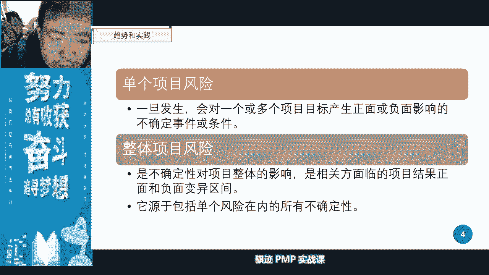

比如说下雨下雨的征兆什么？天黑了，对吧？啊，天暗了，然后刮刮大风，就是下雨的征兆，对吧啊？😊，等于下雨可能是我们做某些活动的一个风险，对吧？啊，所以风险会有这样的概念啊会有这样的概念。

会有已知和未知的概念，也会有什么啊？也会有我们的啊。😊，识别和不识别，还有会有什么？还有会有是有征兆和无征兆，我无有征兆和无征兆的这个概念啊啊发音还是准确，就是有没有征兆，有些风险是没有征兆的啊。

也有没有常，对吧？😊，比如说走在马路上被雷劈，对吧？啊，这说明没有征兆，有些风险呢是有征兆的对吧？我刚才说什么啊，刮风下雨啊，刮风先刮风，然后再下雨，对吧啊？😊。

所以我们针对于有征兆的风险和无征兆的风险呢，可能采取的应对措施呢可能不一样啊，我面会讲。😊，那么组织和相关方面有风险的呃态度呢，它分为三个方面，一个叫做风险偏好。

一个叫做风险承受容呃容忍程度或者风险承受里。第三个叫风险临界值。

所以风险呢要开诚布公的啊进行交流。然后呢，根据相关方对项目的，尤其是关键相关方对于项目的一些态度来来决定风险啊，就像这张图片一样，这旁边这张图片里边手上一摸摸起来啊，红桃顺是吧？缺张红心十，对吧？

那么你要不要要重住呢，万一上来一张红心市或者来一张十就是一个顺字，来到红心市就是红心红心同花顺，对吧？非常大的牌，但是如果我没有摸中呢，你就是一些散牌，对吧？对方只要有一对二啊。

一对二一对三就可以把你赢了啊，所以这就是风险，对吧？那么像这种牌呢，有些人就是会博，有些人就不会去赌博O啊，我们后不面会讲很有意思啊，所以风险当中，我们怎么样管理风险并不取决于项目经理。😊。

对于项目态度，而取决于项目的关键相关方，比如说发起人啊，项目的呃客户啊呃项目里面一些呃组织高层啊，一些关键人物，对于风险的呃诉求程度以及项目本身的特性。😊，啊，有些项目本身就存在高的呃风险性的。

所以它对风险的柔忍程度呢就会高一些啊就会高一些。😊，因为有些事情本身就存在于高失败率嘛，大家普遍能接受，所以对风险的承受呃容忍度呢就比较高啊。但是有些事情呢，比如说有些项目呢难度比较低。

所以大家对风险的容忍程度呢就比较低一点啊，会有这样的情况。我们慢慢来看什么叫风险偏好呢？指的是什么啊？未来预期的回报能不愿不愿意承担相应的不确定性啊，相应不定。

所以会有什么风险的逃避者、风险的中立者和风险的热衷者OK啊，其实。😊。

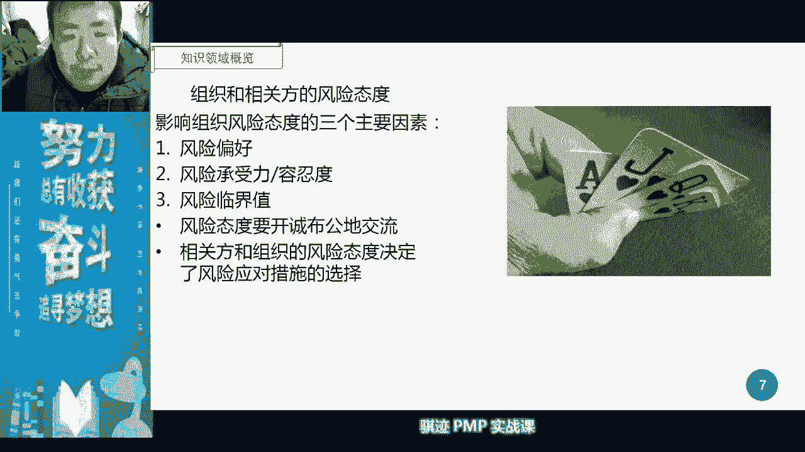

其实从呃金融学的经济学的角度来说，嗯不存在风险中立者啊。不存在风险中，因为中立只是一个参照系，中立只是个参照系啊，那我给你举个例子。😊，举个例子。啊，大家呢大家呃马上都过年了，对吧？

很多地方过年喜欢打麻将，对吧？啊，有这个习俗啊，很多地方都有这个习俗。😊，那么我问大家一句，大家过年打麻将打麻将呃，比如说我问你们打麻将呃，比如一个花多少钱，一共花多少钱？你们在公屏里告诉我。

你们打麻将一个花多少钱。😡，OK有人回答吗？今天直播室人人气这么差啊。😊，你们打那你们过年打麻将一个花多少钱啊？10百不会打麻将。我靠，哪位同学，那位叫宋江的同学，你这是梁山上打麻将的炒投算吧。

100ok啊，好，那么我我们我们以宋江这位同学为例啊，宋江这位同学为例。那么如果老师打麻将5块一个一个花5块钱的话，那么你相对我就是一个什么风险热衷者啊。

因为呃一个花100块和一个花5块钱你肯定是一个花100块钱风险的，对吧？那么老实打一个花5块钱的，那么我风险肯定比你小，所以你相对我是风险热衷者，我相对你是风险逃避者。😊，但是如果老师和啊村口对吧？

村口小区门口那些大爷的老大爷老奶奶去打麻将，他们是什么？一局牌最多输赢就一1块钱或者5块钱。😊，那么我相对他们是不是我就变成了风险的中呃热衷者，而他们就相对我成了风险的什么逃避者，对吧？

所以风险当中呃热衷和逃避其实是相对的。中立者呢，其实是以你设置的一个标杆。它是呢你认为是正正好好的那个尺尺度啊。所以一般来说，风险其实真正没有正正意义上呢，没有什么风险中立者啊，哎也OK啊。

但是这个没关系，你们就要知道有风险逃避者中立者和热衷者就行了啊。😊，OK啊，不会了。所以我们用打麻将这个例子跟跟大家说一下，过年嘛，很多人家里想洗庆的，就打麻将，打打打打打打打，对吧？😊，啊。

所以风险当中大家知道啊呃总是风险总是会伴随着一个效应。就比如说啊有件事情大家知道啊，就跟投资啊或者是做很多其他的事情都有一个效应，叫做高风险未必有高回报，但是高回报的东西一般都会伴随着高风险啊。

只是用各种不同的形式去体现啊，有没有高风险低回报的，有啊有啊，很多事情是高风险对但是这个事情上并不存在高回报低风险。注意啊，任何人向你承诺一件事情如果回报很大，而风险很小。

那么就意味什么他在欺骗或者是别人欺骗了他之后，他再来欺骗你啊，最典型的就是外面很多老头老太么P two P的那个诈骗，对吧？被人家骗骗光了本金，那些老头老太是怎么被骗的呢？他们不是被骗子骗的。

他他们是被身边的人骗他们身边的人被骗子骗子忽悠着，然后去主动为骗子去散播。😊，这种骗局啊，然后去派骗自己身边的人啊，很多的骗局都是这样的是吧？啊，所以风险永远是和他回报相伴随着风险越高。

一般不一定意味着回报越高。但回报一般越高，风险一定意味着同比例的会升高，甚至更高比例升高啊，注意这一点O啊，我们只是讲一个概念。😊。

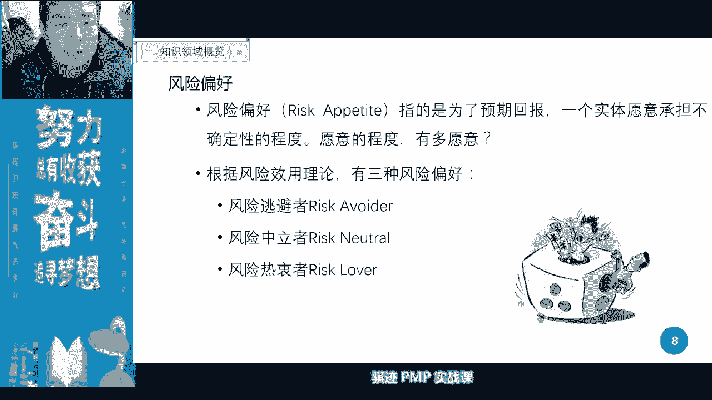

那么风险当中啊，这是一个风险效应系列，我觉得这个没什么大意义，PMP不会考啊。😊。

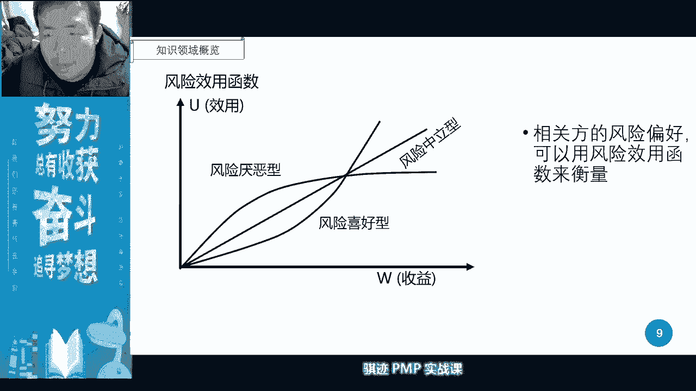

那么风险当中呢，我们会有两个东西，一个叫风险容忍度，一个叫做风险临界值啊。风险值风险容忍度是一个主观的相对主观的，由人不同的人，不同的主体来主观的判断自己能承受多大风险的一个主观值，主观值叫风险容忍度。

而风险临界值呢是一个客观的通过客观技术评价所得出的一个值啊，所得出的值。那么风险容忍度和风险临界值都是我们在管理一个项目的风险当中所要考虑的事情啊。😊。

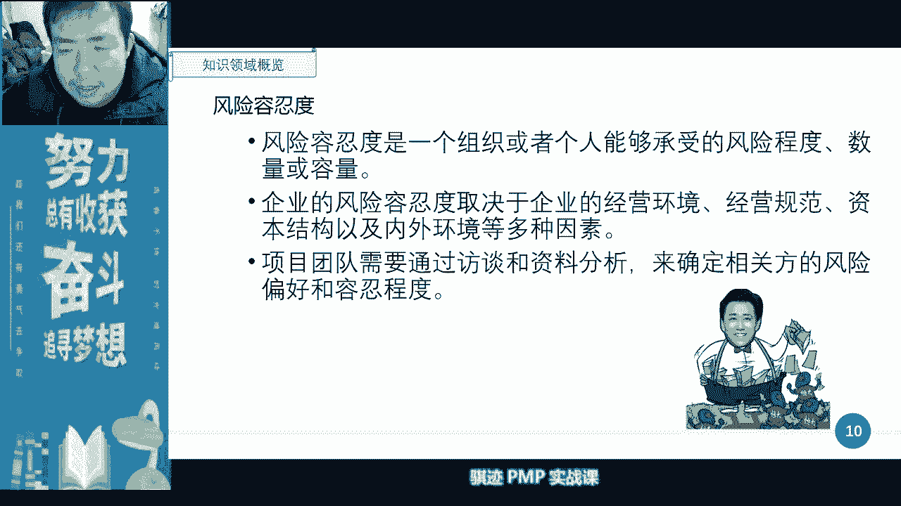

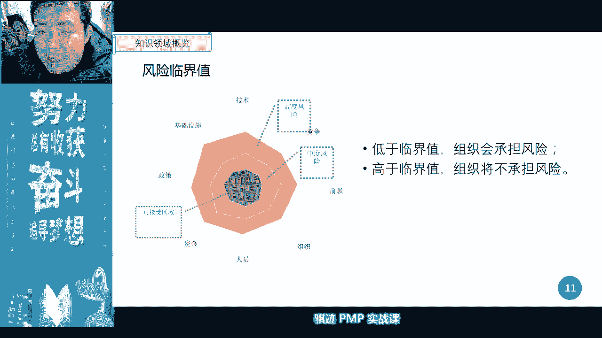

那么我问你们有没有什么例子，有没有什么例子，风险容忍程度很低，但是风险临界值很高呢。😊，有没有什么例子？风险容忍程度很低，风险临界值很高。哎，不对。不对。核战争哦，有位同学玩的很大，核战争放贷款不对啊。

你们回答的很大部分都是不对的啊。😊，那么你要知道股票这种东西大部分人都是风险容忍程度高而风险临界之地啊，反了啊。啊，我跟你说什么例子啊，我给你举例子啊，你们看过一一篇课文。

我们学校里以前学过一篇课文叫欧耶尼格朗台，看过吗？巴尔扎克写了一篇著名小说欧耶尼格朗台，欧耶尼格朗台里面有一个很经典的人物叫格老格浪台，记得吧？是个著名的吝啬鬼啊，吝啬鬼的一大特征就是什么？

风险忍忍容忍程度很低，老格浪台如果什么平时不小心掉了掉了一一两法郎，比如说掉了找不到了，他就会他就会到手骂娘，对吧？老格浪骂来一句台词叫爷爷的敲子，对吧？啊，这是一就很有名的台词啊。

他但是老格浪台其实很有钱，所以对于老格浪台这样一个人物来说，他的风险容忍程度很低，他只要是有受到一点点损失，承受一点点的风险，他就觉得承受不了，但是呢对他来说，他这么有家产，他损失一点。

比如损失个一00法郎，对他来说根本无所谓啊，但是他是个吝啬鬼，所以他的风险容忍容忍程度很低而风险。😊，临界值呢很高啊，那么反过来呢，那就很明显啊，比如说啊你们去到澳门赌钱啊，你们到拉斯维加斯监。

我相信大部分人都没去过拉斯拉斯维加组监，我也没去过啊，澳门我去过澳门去赌钱，大部分到澳门去赌钱，烂赌的那些人都是什么啊风险容忍身份很高，他觉得我肯定能翻本，甚至觉得我就是周润发复生赌神啊，高进复身。

对吧？所以。😊，往里面赌，把自己所有的钱都往里面赌，赌完了之后呢，还还问人家借钱去赌啊，最后存赌输入了怎么办呢？然后被人家关在笼子里用水冲是吧？O啊，这个是假的，这个是假的啊，O啊。😊，嗯。

所以赌场当中你会看到很常很常见的烂读鬼都是什么，容忍程度很低，而人肯高，而什么临界值很临界值不高啊啊啊就是说我们呃那个那个那个那。😊，呃，说说什么回来OK啊啊，那就不说。

就是当初那个绑架李嘉诚儿子的那个那个那个劫匪，他当年呃呃勒索了李嘉诚10亿，后来钱都哪里去了，全都到赌场里去赌光了啊，他也是容忍程度特别高，但其实临界度不高。最后呢赌输了再去捡绑绑了再去赌。

然后又输了再去绑，最后呢呃吃到了正义的花生米啊。OK啊，就是举个例子。😊。

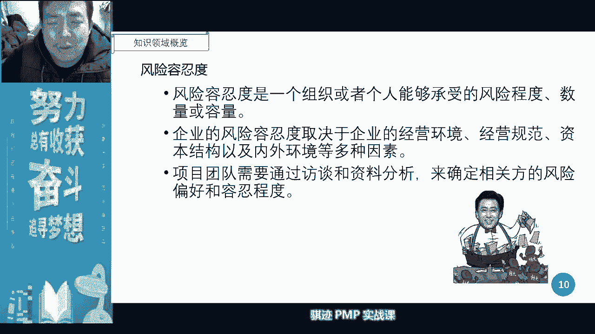

啊，那所以我们在规划一个项目当中呢，我们要考虑到风险容忍度。所以风险容忍度很多时候是我们在考虑相关方他们对于风险的态度时候，因为这是主观的，我们会有风险容忍程度。那么在项目当中，我们对于项目自身的评估。

😊。

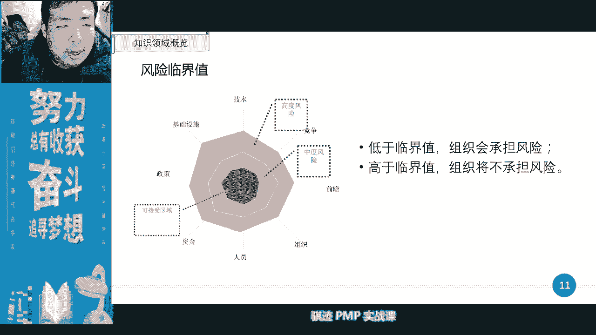

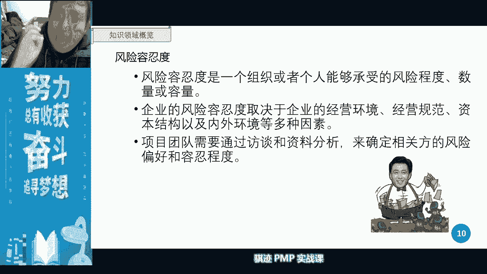

我们会用什么？会用风险零界值，因为这是客观的，你项目能承受多少承受了多少风险，它是一个客观存在的一个事实啊事实。😊，所以我们会用什么？会用比如说一个宏观框架PESTRE对吧？啊，politics啊。

economysoc等等等这些啊，以及比如像我们这个图当中的呃若干个维度，8个维度去进行评估风险的临界值在哪里？😊，临界数过高呢，我们就不会承担，我们就不会做，然后避免它。临界值低呢。

我们会想想尽一些办法呢去化解它啊。后面我们讲。😊，这是风险的一些概念啊。所以我们在这个一章对我们的工作其实是有指导。因为什么？项目经理，我们讲项目和普通的运营不一样的地方。

就是因为项目是一个独特的交付成果，它存在面临的始终面临的不确定性和风险。所以作为一个项目经理，你的职责就是把这些不确定性。😊，降到最小，把确定性提高到最高，让项目能够完成，这是你的使命职责。

所以项目经理的工作一定程度上也可以看作是什么去克服一个又一个的风险，克服又一个又一个的问题去把项目实现的这样过程啊，所以管理风险是一个项目经理应该主动承担的一个责任啊，一个项目管的好不好。

就看他什么他的风险管理管的是不是够好，他能不能未雨绸缪，对吧？啊，那句话叫未雨绸缪，对吧？未雨绸缪，对吧？未雨绸缪啊，就看这个未雨绸缪，这个绸缪绸缪，怎样啊。我们讲所以管的我一直跟大家呃之前讲嘛。

一个管理良好的一个项目，他的项目经理总事长不仅不慢的做了各种各样事情，看看平淡无起，然后事情就做完了，管的不好的项目经理呢，就是因为他的风险管理没有管好，所以他老师出事，一出事就裁股，对吧？

然后忙来忙去。😊，这就是个风险临界值，风险容忍程度风险的一些概念啊，一些管理啊，所以管理好风险对我们的学习好PMP当中管关于风险管理的一些方法、思路和手段，一些方法论。

对我们今后的项目当中管理风险是有好处的。😊。

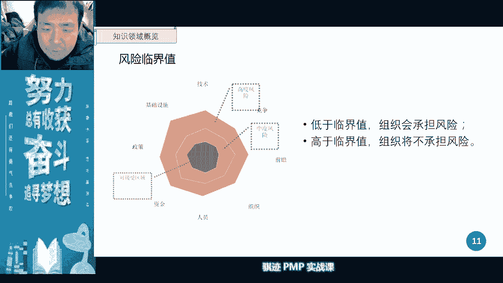

那么我们在项目管风险管理区当中有哪些新兴的事件呢？我们讲项目当中，除了一些突发事件所带来的风险之外，还有一些非突发事件所带来的风险，叫做变异性风险，什么叫变异性风险呢？就是说那我举个例子啊。

大家以前看过一部著名的上瘾上影场拍了一部著名的片子叫宝莲灯。大家看过没有啊，宝莲灯叫什么？那个叫沉相那部片子叫沉香救母，对吧？啊，很著名的很著名的老戏啊，当中呢，沉香的妈妈呢被抓起来了。

然后沉香呢要去救妈妈，但是他没有本事怎么办呢？他去找山神学本事，然后呢，山神先让他吃了一一龙的包子里边九牛二虎，对吧？吃了以后九牛二虎之力。然后呢，山神给他的第一个考验是什么呢？

山神背了沉叫沉香把他背上山，沉香吃了那个九牛二虎的包子，全身都是戾气，对吧？背一个小山神，毫不在废。然后呢，山神呢背着背着背着山神开以念咒，他偷偷的沉香背后念咒，他怎么念念什么咒啊。😊。

再重那么一丁点儿，再种那么一丁点儿，山神呢不知不觉当中就变成了一块石头。然后山神呢在随着沉香往山上爬过程呢，这个石头1。1。1。1点的越变越大，越变越沉，最后连吃了九牛二虎之力的沉香都坚持不住了。

怎么办？然后把这个石头哦，实在背不动，哗往了一扔把它扔到山下去。😊，那么其实管理项目这样一个项目我们要最终打到终点，就像城乡爬山一样，爬到顶峰。你所背负的东西越到山顶其实越复杂，越危险。这个过程当中。

有些很多的事情它不会突然发生，但是它会逐步逐步的进行异化变化。在异化变化过程当中，就会慢慢慢慢产生正面或者大部分是产生负面的一些因素，这种因素最终将可能对项目造成不利的影响，这就叫做变异性风险，明白吧？

它不是有一个世界。😊，突然间发生，而是吧通过一个什么量变到质变的这样过程。😡，OK啊，能不能理解沉香旧。😊，好，那么第二种呢叫做模糊性风险。什么叫模糊性风险呢？😊，啊，我一直跟你们说。

人能不能预测未来不能，对吧？所以未来对我们来说都是模糊的，这就叫模糊性风险。如果人能预测未来，为什5福中以后的未来，那么你们你们将望成为这个世界的神，对吧？所以模糊性风险是对未来不知道所产生的东西。

就比如说。😡，你们呢参加偏僻考试是存在模糊性风险，为什么你们不知道考试考哪些题目，只要你们知道了考试考哪些题目，那么对你来说就不存在模糊性风险是吧？你们可以通过查资料，把那些答案预先先背好。

然后你肯定考试通过，对吧？但是不存在这种事情。😡，所以模糊性风险对大家来说怎么克服啊？😊，就是把所有对于知识的模糊理清楚。那么随便来什么题目，我们都能确定能做的会，就不存在模糊性风险啊。

模糊性风险是对于未来的不可知所造成的一种风险啊。😊，那么我问你们买彩票风险大不大大的。如果你知道未来的彩票，比如说我们讲双色球，你知道如果你知道未来一期的双色球里边，哪怕你知道有10个数字是不会出现的。

只要你知道1个部子，那你去下注，那你就可能很快就成亿万富翁，对吧？😡，那么当然这是不可能的，所以这个是永远会存在模糊性风险。OK啊，我们举个例子，你就你就能明白。😊，有些东西只要有确定到一定程度。

它就不会存在模糊，但是很难。只要依据什么你的经验啊，依据科学的方法去消除模糊，消除模糊啊。所以我们后后面会有什么风险的量化分析，就是用于消除模糊，或者确确定它的量级到底在哪里啊，它的程度到底在哪里。😊。

那么我们的项目当中呢，我们会设计什么？项目韧性作为项目的一部分啊，那么什么叫项目的韧性呢？就是我们的项目当中存在resilence啊，英文叫resilence，就说弹性应对。

就是说我们的项目总归会有很强的适应性，哪怕有些事情发生了变化，或者达不到我们预期，这个项目依然可以往前走啊，这叫做项目韧性。😊，同时呢我们的项目呢欢迎变化，欢迎意料之外的事情。

我们可以根据情况随机而变啊随机而变啊随而变。😊，所以就像那个盗梦空间里说了，我们要inception给一个人植入意年。这个时候我们不会规划所有的植入的这个理念，而是什么一层一层去套路。

根据目标的情况去设计下一层去怎么做。所以这个时候项目就存在韧性，对吧？😊，所以大家记得把那个呃呃迪卡普利演的那个盗梦空间里面，对吧？它最后一层项目任性当中，虽然发生了很多意外。

所以他们设计当中就根据这些意外去设计项目的接下来一部分，最后成功的实现了inception，对吧？😊，好，那么项目当中我们讲最后一个实间上会有一个组合式风险，整合式风险。

也就是在项目的高层或者是在项目之上的层次会出现风险而影响到项目。这个时候呢，项目可能作为项目管理者本身可能无法做决定。但是你要考虑到这个因素啊，环境因素啊，事业环境因素。😊，好。

那么这是我们项目当中管理风险所要所要的面临的一些新兴趋势。所以风险管理当中呢会相对比较子过程相对比较复杂。从规划风险开始，到识别风险，到风险的定性分析，到风险的定量分析，到风险的规划风险应对。

到实施风险应对，到最后的监督风险啊，这个当中有很多的知识点，所以风险考的点是比较多的啊，因为项目经理我前面说了嘛，管理项目一定程度上你就得可以看作是管理风险。你的performance。

你的绩效表现一定的程度的表现就表现在怎么样去应对风险啊。😊。

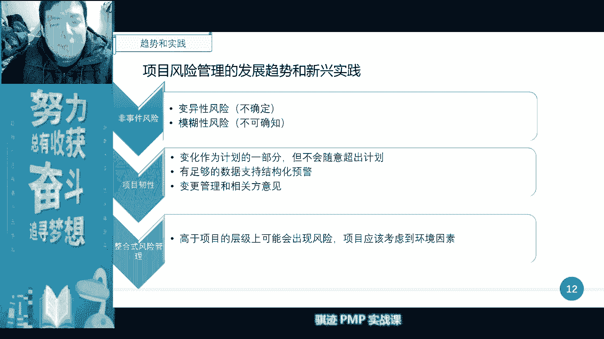

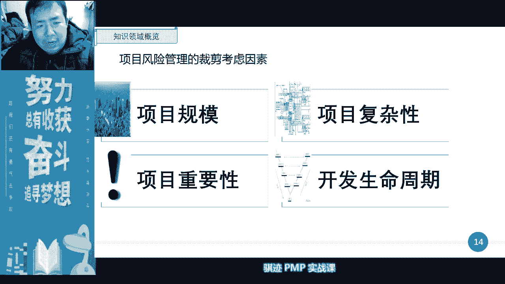

是很重要。好，我们一个一个看。所以风险管理的风险管理的它的过程就是先规划再识别，先定性再定量，然后规划应对，最后实施风险和监督风险啊，这个当中呢很重要有一点啊，这个这里个PPT当中呢做的很华丽。

但是没有体现出来这个当中很重要的一点是风险登记册的更新啊，风险登记册当当当中会存在若干次更新啊，注意啊，所以随着我们学习要注意一点，第一是每一次风险登记册的更新都更新一些什么东西。

你们要在后面的子过程学习当中时刻要跟着我啊，时刻要跟着我风险的子过程有哪些更新。啊，每个风险。第二，这这些子过程当中会有一些工具和产出输入输出是来回去使用的，要注意第三，风险当中会有三个会。啊。

一定要记住什么时候开什么会啊，我先跟你们说，后面我会提到风险一开始有风险规划会。😊。

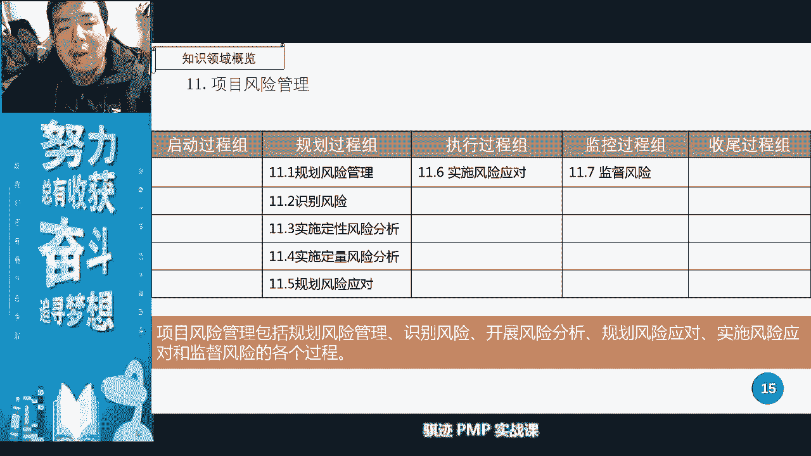

之后呢有一个叫风险研讨会，最后一个什么叫风险审查会，风险一共会开三个风险的专题会。在一个管理严谨的比较大的项目当中会开三个会啊，所以这个三个会是我们考试当中也是要注意。那么你要知道，每次开这个会。

我们会做些什么事情。然后会更新相应的更新哪些风险报告的哪方面，更新风险等记的哪方面，这些都是要记住，因为这些都有可能成为PMP的考点，明白了没有？明白的同学请把明白打在公屏上，我们继续讲解啊。

这个一定要先有一个概念。😊，所以这个这个知识领域当中的概念和要掌握的东西是比较多的啊。😊，O啊都记住了啊。ok啊好好，非常好。😊，嗯。好，所以所以后面的课程一定要紧跟着我的所诉说的东西啊。

我说每个东西你每每一个子过程到哪里会有产生什么东西，会有怎么样动作，一定要记住啊。😊，好，我们来一个来看庖丁解牛一个来看啊。

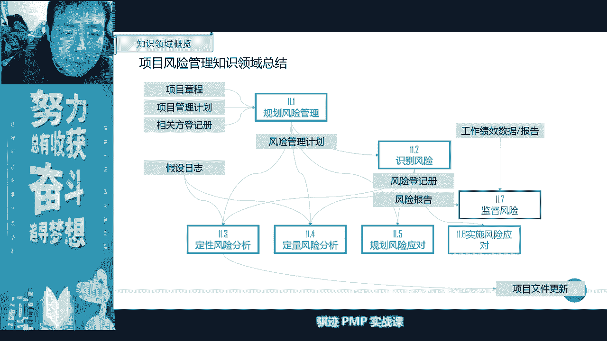

好，那么风险呃呃一样按惯例第一个子过程是什么？规划对吧？规划风险。那么规划风险当中呢，我们主要做什么事情啊？针对风险的管理方法和管理措施，我们制定一些我们的本项目的风险的规章制度。

以及一些我们所后面所需要后面的子过程需要的工具啊，概率影响定义和概率影响矩证，这个是我们用到的啊，后面会讲，虽然这在这里这个PP当中，因为今天改了急了，所以没有没有写上去啊，其实这个东西是很重要的。

在风险那么来了，在我们规划风险当中，我们会开第一个会议。第一个会叫做风险规划会。风险规划会是用来干什么的。记住风险规划会是用来制定风险管理计划的。

他他的参与者包括项目的经理项目团队成员和应该所有应该出席的各个相关方啊，组织中负负责风险规划的人啊，包括有很多时候在实际工作当中，我们会邀请什么风控。😊。

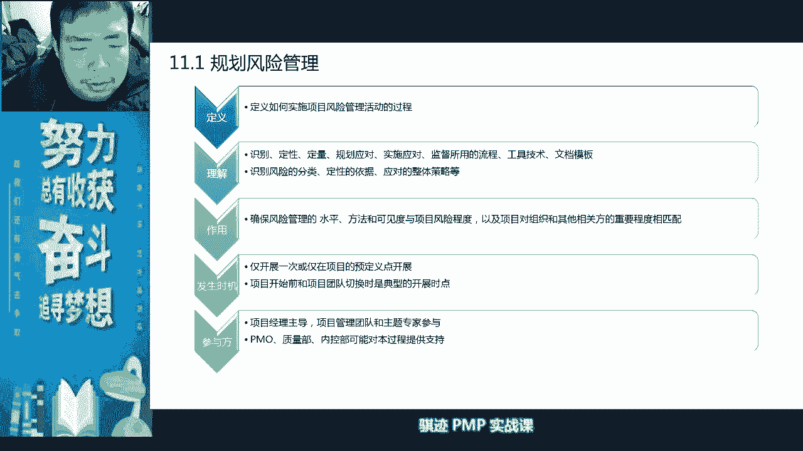

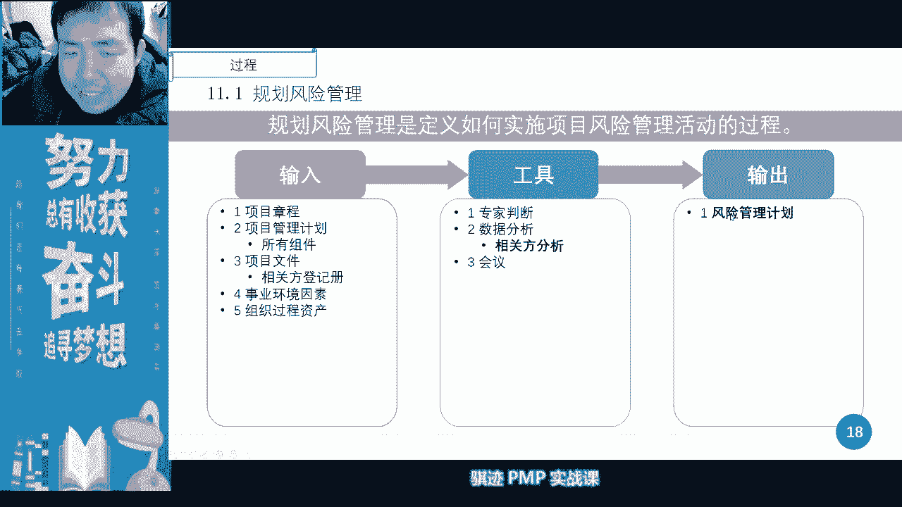

部门对吧？合规部门一起参加风险呃规划会，去制定风险管理计划啊，得到他们的认可，来到他们认可。好，那么这是风险规划会。那么风险规划会会产出什么东西呢？风险规划会会产出我们关于风险的一些定义啊定义。

那么这其中呢我们会用使用相关方分析。什么叫相关方法分析呢？是因为风险规划会当中，我们会有很多的出席风险规划的关键相关方，他们对风险的态度，我们前面讲了，对风险的容忍程度，对吧？对风险的偏好方向，对吧？

😊。

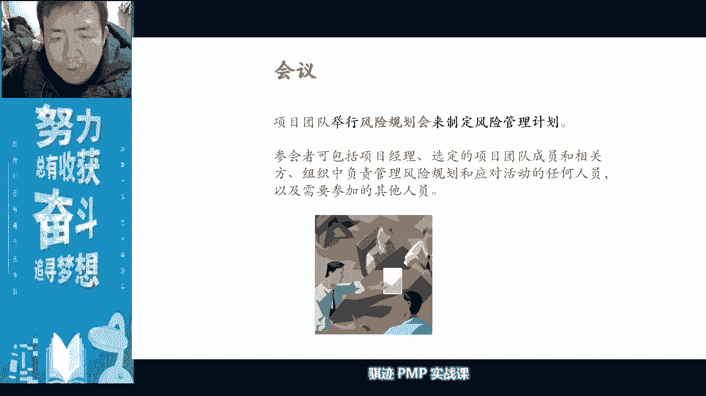

比如说有一个相关方，他对项目呢影响很大，他呢风险是风险偏好者，但是他呢风险认识程度又很低，对吧？😊，就属于那种呃呃如果我们讲赌钱就属于。如果刚才那个例子，我们赌钱就属于什么啊，赌嘛很喜欢赌的。

但是呃输嘛输不起的那种啊。那么那么这种相关方，那么你在设计项目的相关的风险偏好和风险的管理过措施的时候，就要满足他的期望，对吧？因为它对项目有很大影响，你要让他满意嘛，对吧啊。😊，会是这样。

所以不同的相关方对项目的风险的态度、期望和一些利益关系呢都不一样啊，所以你要在风险规划会当中呢平衡好各方关系，对吧？😊，因为每个人的利益诉求不一样，所以会产生冲突。在风险这一块的说会产生冲突。

所以你怎么样要管理好冲突啊，去解决好冲突啊，这是冲突管理，对吧？我们讲管理团队当中我们讲怎么样内部管理好冲突，对吧？还有外部环量要冲突啊。😊，好，那么我们规划风险风险规划会之后呢。

我们会制定出风险管理计划。风险管理计划呢中当中包含什么东西呢？风险风险管理战略方法论。然后很重要一个是角色和职责。注意啊，这里的角色和职责指的是整个项目管理的风险，但是角色是谁来担任管理者角色。

谁来担任执行者角色啊，职责，每个人的职责是怎么样。注意这个时候我们没有风险责任人啊，注意我们后面提到个角色职责叫做风险责任人。在规划风险管理输出的风险管理计划中，初始状态是没有风险责任人的。

这个一定要记住啊，一定要记住，但是他有角策职责是说我们团队当中谁是主要去风负责管管控整体风险的，就项目经理或者项目经理团队当中的若干个人，对吧？啊，然后呢，资金这个资金其实就是什么啊？我们的应急储备。

加上我们的什么管理储备。😊。

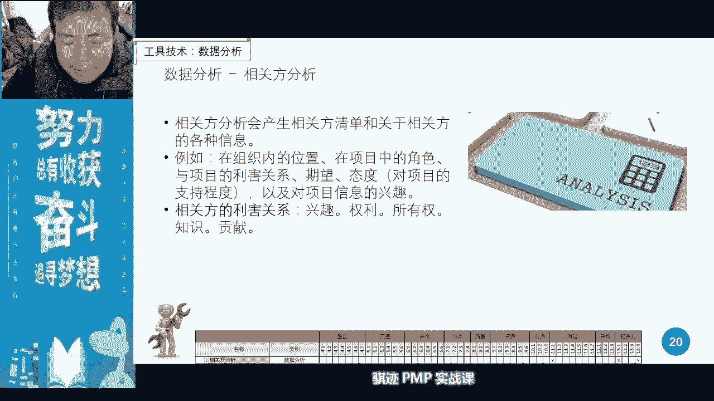

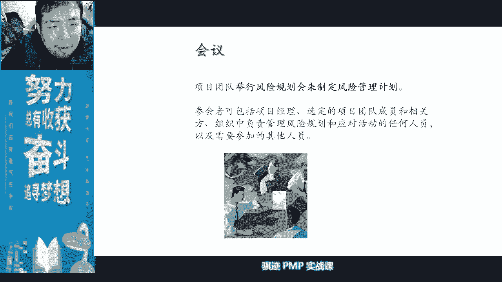

啊，应急被加过了吗？这是回。所以风险管理计划的制定其实也是伴随着什么制定的，我们的成本去制定的对吧？啊，说成本，但是这个资金只是一个框架性安排，它还不能成为成本基准的一部分，对吧？

因为成本基准一部分当中含有什么东西啊？😊，成本基准当中还成本基准这个当中含有哪一部分风险资金啊，请给我打在公屏上啊，我看看你们讲成本基准当中含有哪一部分跟风险有关的资金，请把我打在公屏上。啊。哎。

我就看到有人同意咱管理储备啊，错了啊。😊，成本基准当中是不含管理储备，只含应急储备。哪一部分哪一个块的资金是含有管理储备的？项目预算记得不记得啊。

我们正好回一下我们讲整个项目最大的最大的一个范围是项目预算，对吧？是报给甲方的，项目预算当中含有管理储备和应急储备，但是成本基准当中只含有应急储备，不含有管理储备，记不记得啊，概念一定要记清楚啊。

返工预算一个。我靠，这位同学，你这个偏差偏差大的，我们我们上课什么时候讲过返工预算呢啊，返工预算叫做不一致性成本，对吧？这是质量管理一块的啊，你这个差的有远了啊，O啊，所以还是没有明白的同学。

请回到成本那一张去看一看成本我们的项目的项目预算是由哪块组成的，是由管理储备，加上我们的成本基准成本基准什么组成的？是由我们的应急储。😊，加上活动成本组成活动成本当中又含有个什么活动的实际成本。

加上活动的储备，1一级对吧？好，一级一级这样分下来okK啊。😊，所以大家这个概念一定要搞清楚啊，所以这块的资金是一个框架性资金，包含了什么啊管理储备和应急储备。但是应急储备那一块。😊，是报给甲方。

然后说。管理储备这一块呢是我们自己知道就行了啊。😊，okK啊，然后呢时间安排对吧？我们怎么样去风安啊应对风险，有哪些时间安排，有哪些风险类别啊。

这里的风险类别就是我们后面有讲到的RBS risk break啊，注意和之前我们讲的。😊，resource breakdown sketch资源分解结构相分区分啊，相关方的偏好对吧？然后呢。

后面两个很重啊，就是风险概率影响定义和风险概率影响矩证啊。😊，最后呢风险报告的格式对啊，然后跟踪啊。那么首先大家可以看到这是1个RBS啊。

这个我们的原始PPT当中当中为什么不知道为什么写成了资源分解结构啊，资呃资源管规划资源管理计划，其实这是个RBS啊，资源分啊，风险分解结构，它分为四大类啊，然后呢分为二级啊。

所以我们讲一个风一个风险结构和我们WBS一样，一般都按照什么两级到三级很大的项目呢，后面再加1个RBS的第三级已经足够了啊，用用于识别什么风险，所以RBS当中有没有风险。记住啊，RBS当中没有风险。😊。

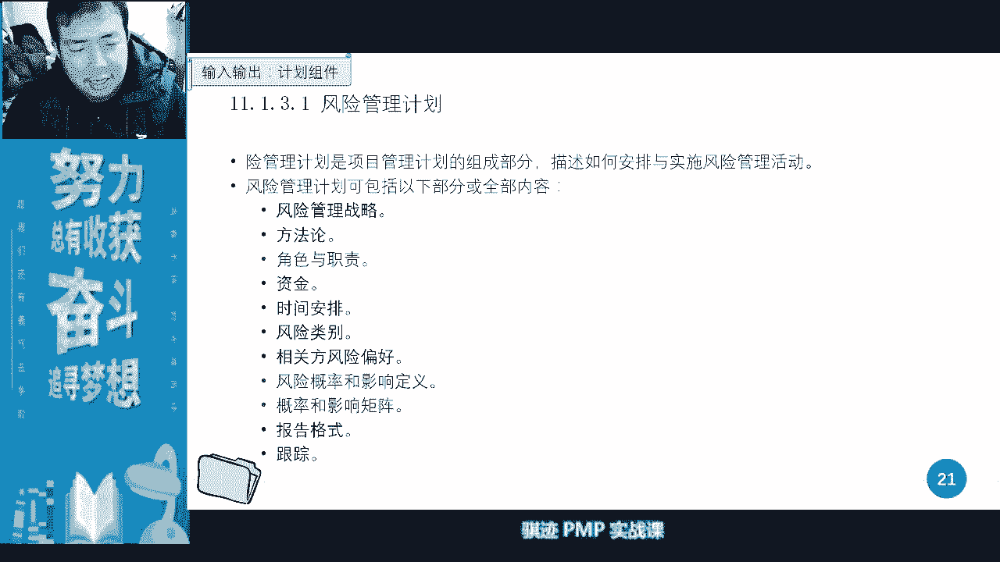

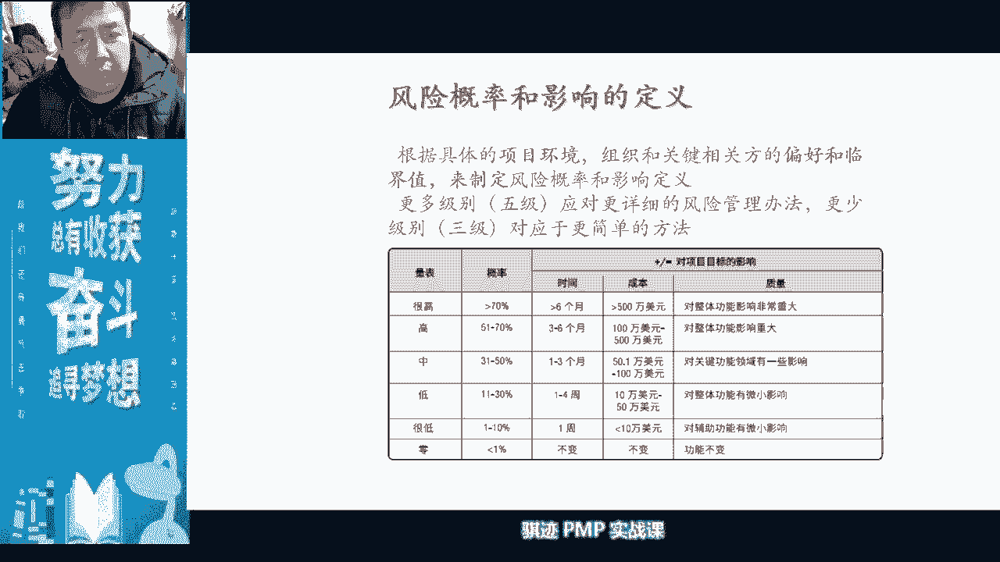

RBS resourcesource break structure当中有没有资源，没有资源啊，WBS当中有没有工作，有有啊，但是RBS里面没有OBS里面也没有另外1个RB也没有他们是为来干什么。

帮助你识别需要相应识别的。😡，一些资源啊、风险啊、组织啊等等情况，以帮助你获取那方面信息啊，它是个分类目录啊，分类目录啊，所以这个一定要注意啊一定要注意。好，那么接下来我们讲风险的概率和影响定义。

风险当中，我们一般大的项目，我们会用五级的风险去定义。小的项目呢我们用三级风险，小项目就会用高中低，对吧？大的项目呢有很高中低很低，对吧？零我们不考虑对吧？啊，所以这个是我们应该在项目当中事先定义好。

达到哪个级别达到一定条件，我们认知它认知它为低风险达到一定级别，我们认为中风险，达到一定级别，我们认为高风险啊，会是这样，但是中间的这些数值啊，这是树上的原图，但是中间的这些数值呢，大家可以不用看。

因为不同的项目数值是不一样的。因为项目有大有小，有长有短，所以这些东西呢都是可以不用都是可以参考或者是不用看，但是你知道项目大项目分5级，小项目分三级就可以了啊，是这样概念。好，这个呢还是比较容易理解。

对吧？用于这这个风格当家也根据我们的风险偏好就制定，对吧？如果我们风险偏。😊。

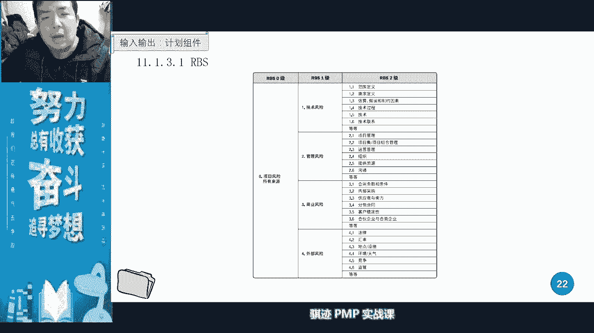

那我问个问题，如果风险偏好厌恶风险或者风险规避的，那么我们更多的风险会被分成高风险还是分成低风险？啊，如果我们的总体的项目的风险偏好是风险厌恶的，风险规避的。那么我们的风险当中管理当中。

更多的风险会分成高风险还是分成低风险？😊，对，非常好啊。呃，有一个同学照顾那位同学说错了啊，因为我们是风险厌恶，风险规避，所以我们会看更多的风险，看它视它为高风险。因为就像说就像比如说我们是风险呃。

就方打麻将，我举得们前面个例子打麻将，我们打麻将打的很小。所以我们觉得什么5块钱以上的花都是高风险，对吧？啊。😊，所以更多的风险呢会被论。如果我们说打麻将，我们的风险偏好很我们的风险融入程度很高。

我们是风险偏好者，我们希望用更多的风险去博取更多收益。所以我们什么可能打500块钱一个的话，对吧？这时候大部分风险呢都是低风险的对吧？😊，就是这样一个意思，能明白了吧啊。😡，好，那么这个时候呢。

我们根据临界值要根据偏号来进行不同的风险进行定义分级啊。OK有了这个定义分级之后呢，我们下面就开始定义一个东西，叫做风险的概率影响矩阵啊，所以概率影响矩阵呢，应该在项目开始前呢进行优先级排序规则制定好。

那么概率影响矩阵这个图很简单啊。首先记住第一，一般来说概率影响矩就是左边风险啊，左边危险右边机会，左边是负面的，右边是正面的。然后呢越往上面呢可能性越高，越往上面呢程度越严重。

越往中间呢就什么呃是程度越高，越往上面呢可能性越高啊。那么以此为依据，我们将它分割分割分割分割分割成这样一个呃框格图。那么我们将不同的风险先首先通过什么通过风险概率影响定义去去测算出它的概率。然后呢。

通过风险呃概率的定义呢去进行测算。😊。

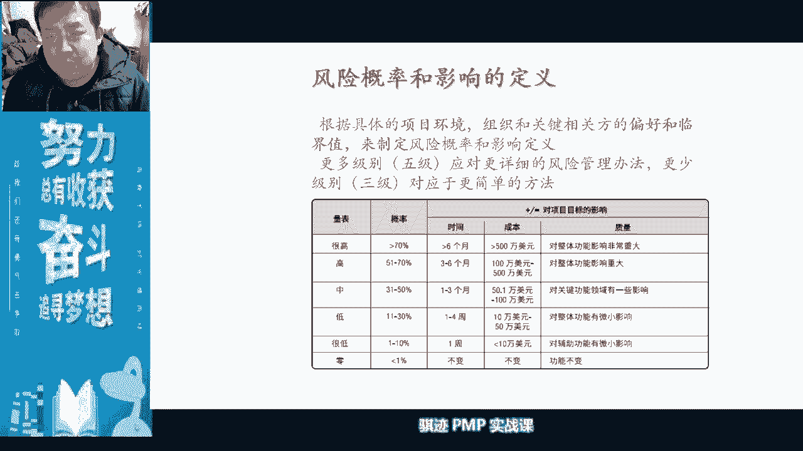

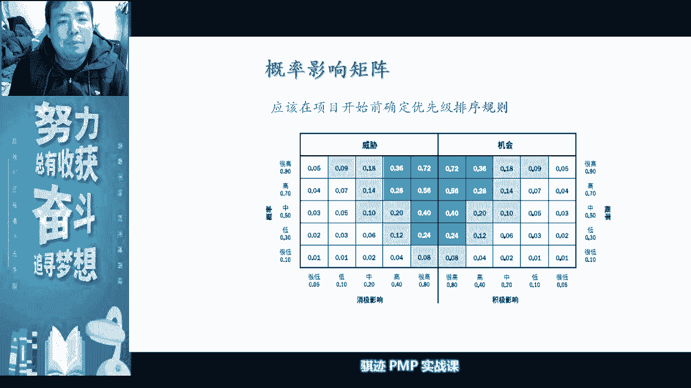

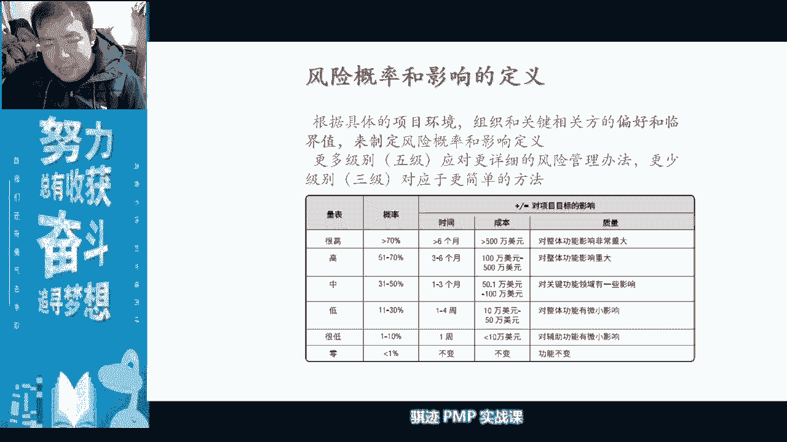

它的影响把它的概率和影响乘起来。比如它的影响呢，我们打分呢是打分打成0。4，我们的呃概率呢打分打成0。7。那么47二8就0。28。所以这个风险呢，就是一个什么高风险。如果它是负面的呢，我们就作为高威胁。

如果是正面呢，我们就成为高机会啊，是这样一个概念。😊，好，所以这是我们风险概率影响的举阵的一个定义和它的使用方法。注意这里是制定它的定义概念，而不是使用。所以考试当中一定要记住一点啊。

风险的概率影响矩阵是在规划风险当中是定义的，但是在哪里使用？😊，是在风险的。定性分析当中使用。哎，有些同西说。老师啊，为什么不是在风险的定量分析？这不是量化计算的吗？OK啊，我们讲到定性分析的再说啊。

所以记住风风险的概率影响矩阵是在风险的。😊，呃，规划风险当中去定义的。但是呢风险的定性分析当中使用的啊，这要记住啊，考试要知道哪个工具在哪里定义，哪个东具哪来使用。就像我们资源管理当中讲。

团队章程是在哪里定义啊？规划资源管理当中定义的。但是是在什么管理团队当中使用了啊，记住啊，也是个很重要的一个工具啊。O啊，我们那我们继续往上讲，这是一个我们讲风险管理的示意图，对吧？

风险管理计划的一个示意图啊，是一个样章啊，大家看一下就可以。😊。

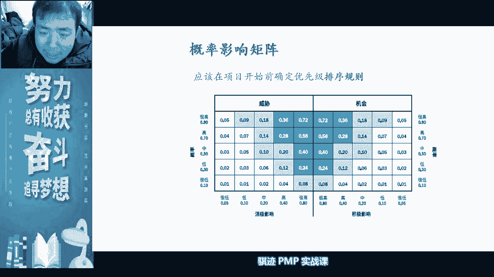

好，那么规划完风险之后，我们的风险管理计划制定出来之后，风险规划就结束了。我们的第一个会就开结束了。第一个会开完结束之后输出什么风险管理计划。😊。

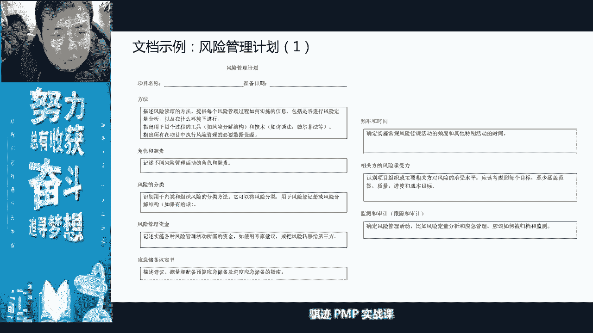

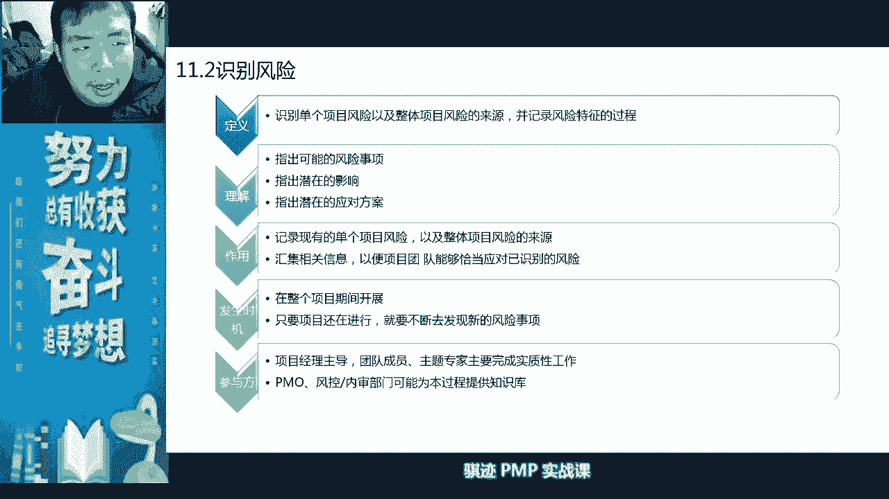

中信管理局。好，那么接下来我们进入第二个叫识别风险。当我们做好了风险的一系列规划准备之后，接下来我们就去做什么风险的识别了啊，风险的识别。那么在识别风险当中呢，我们会使用各种各样的方法去识别啊。

或首先讲识别的方法工具。第一，大家要注意啊，大家这是要注意啊，我们原始PPT没有，但是这要注意风险最初来源于哪里啊，来源于外部采购。因为你的偏僻的默认角度是什么？

是乙方所以你的风险最初最大量的来源其实来源一个地方叫做甲方给你的合同就是协议啊，这个协议当中，甲方怎么规定里程碑的奖惩措施如何，验收条款如何，合同类型如何，指定的资源如何。

他要求的呃要求的质量标准如何都成为了什么？有可能成为风险的来源啊，尤其是当甲方的要求。😊。

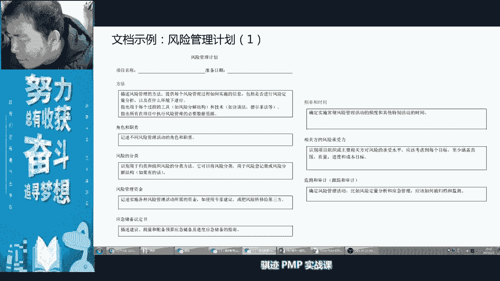

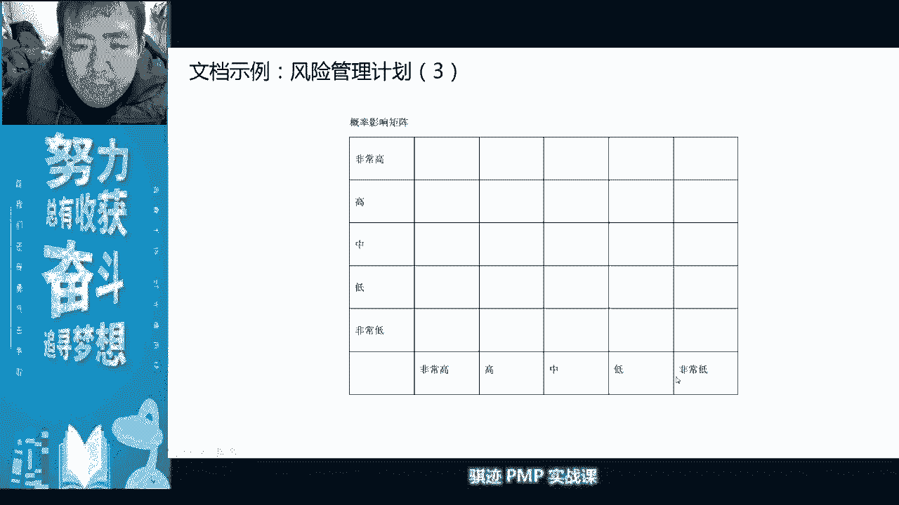

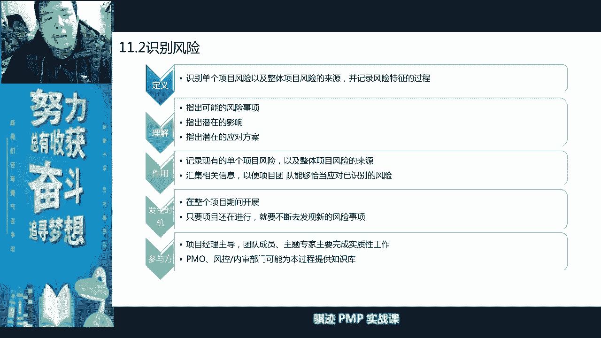

和你的能力存在差距的时候，这个差距就是一种是吧？风险有可能达不到甲方要求所产生的风险啊，这是第一种啊。第二种，你作为甲方，你也有供应商，对吧？你是甲方给你合同，你有供应商从供应商那边去采购。

这时候你从供应商那边采购也会有风险，对吧？也会有风险啊，所以采购呢有可能会提高风险，也有可能会降低风险啊，所以管理采购也是我们管控风险的一个方向啊，所以我们在最初识别和规划风险之后去识别风险当中。

也要注意什么啊？从采购文档当中去识别风险啊。😊，那么采购很多时候的风险来自于哪里的啊？你对采购的东西不够熟悉所导致的一系列风险啊，就是说你买的人没有卖的人精，对吧？然后被人家蒙了，对吧？啊。

这是实英中很经常有的啊。啊，这是采购文档当中来的风险。接下来呢我们要怎么样识别项目上风险呢？我们可以使用头脑风暴，对吧？😊，开脑洞开脑洞啊，这个大家都已经熟悉了，对吧？😊。

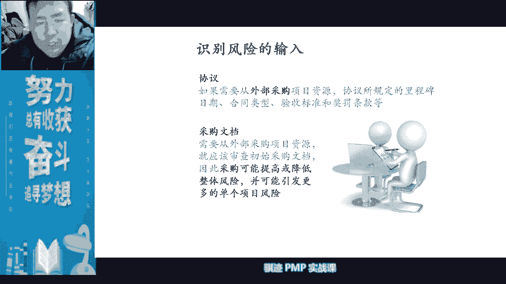

然后呢，我们会用核对单，核对单在哪里会使用的呢？如果啊他经常使用的一个场景是，如果本项目和以前组织上曾经做过的类似项目做过的曾经做过的有些项目非常的类似，非常类似。那么我们可能会什么啊？

使用历史上已经有项目的。他们的风险清单来对本项目进行核对，看看本是不是本项目适用，这是不是很好的做法，利用组织过程中资产利用历史经验教训进行风险的识别啊，这是一种很好的方法。所以。😊。

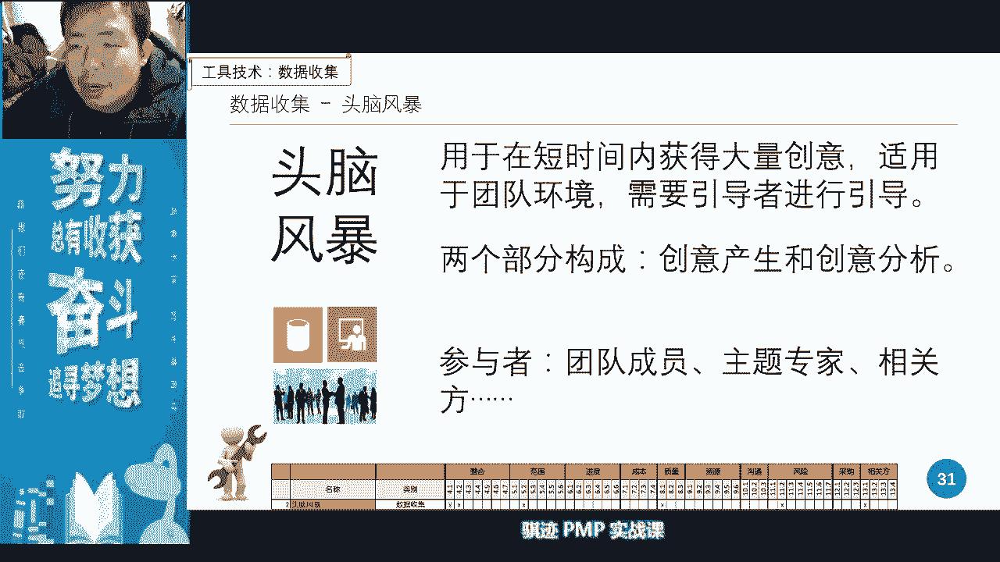

所以这就讲到了，核对单有些东西是不存在的，但核对端有些东西又是存在的，它不存在哪里呀？很很难说组织上一定做过类似的项目，对吧？但是它为什么存在？如果你是一个经验丰富的项目经理。

那么你的脑中或者的或者是你的自己保存的文档当中，肯定会有什么类似的项目，他们所存在的风险。😊，所以很多时候都是这样，都是根据类似项目所产生的风险，然后带到本项目来去进行识别的啊。

这种东西有时候带过来是通过组织构程资产带过来，有时候呢是从项目经理的脑子里带过来。😊，啊，所以这就是为什么项目经理是一个角色，是一个做的年纪大，然后反而很吃香的角色。因为什么？

他脑袋里装的资产经验特别丰富，有助于化解风险，知道吧？啊，僵尸老的辣就落在这里，对吧？😊，第三个叫做假设条件和制约因素。我们讲项目的假设条件和制约因素。

也是在一个项目当中会对我们产生一个风险提示的一个东西啊。那么我问你们。😊。

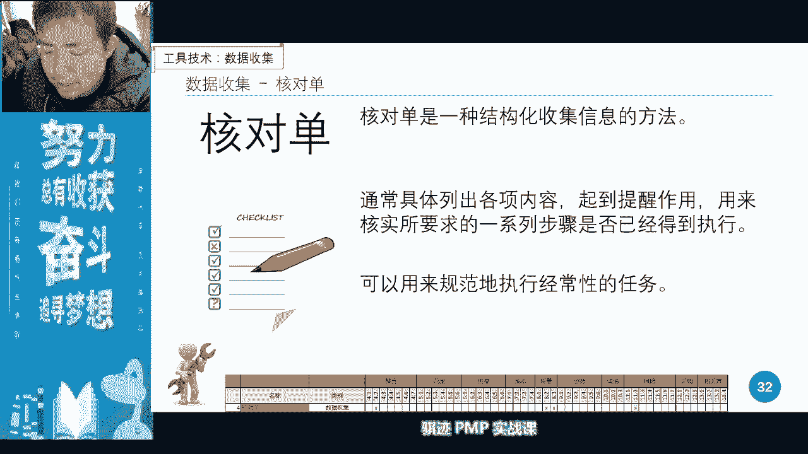

假设我们已经拥有项目章程了，那么项目的假设条件和制约因素会写在哪里？请告诉我，在公屏上告诉我们继续复习啊，这里就是复习。假设我们已经有项目，先有项目章程，对吧？😡，先启动有项目章程。

假设项目章程已经通过了。那么项目当中的假设条件和制约因素会写在哪里？请告诉我。OK啊，这是略有一点点难的啊。如果之呃同学对之前的学习的东西学习的很透彻的话，能够回答出这个问题。😊，哎。

有位同学居然说项目日志啊，像不不呃，项项目章程OK啊，你这个太傻了。我说假设已经有项目章程了，我我如果写在项目章程里，我还问你干嘛，那肯定不在项目章程里。😊，都错了啊，问题日志啊都错了。

那没有一个对的啊，项目管理计划都错了啊。OK啊，哎，我看到啊第一个答对的叫严丽芳啊，这位同学很好啊，非常好。这位同学严丽芳这位应该是看上去应该是女同学，对吧？这位女同学学的是很仔细的啊。

项目当章程通过之后，随着项目当中输出的我们的启动唯一一个启动的过程组当中输出过程子过程当输出了。随着项目当中输了，还有一个东西什么？叫做项假设日志。假设日志当中有来自于项目的商业分析。

可行研究商业分析所得出的项目的一系列的假设条件和制约因素O啊，是不是都记住了啊，你看你看大部分人都都都没有记住啊。😊，假设日志啊啊，松李强呀也答对了啊。OK啊，所以呃还有吴奇也答对了啊。

所以这个东西要记住，它是来最初是来自于项目。我们开说项目一开始要项目开始实施要可行研究，对吧？可行研究是看能不能做。然后呢要做商业论证，是看值不值得做。如果这两项都通过呢那，我们就开始做准备立项了。

正式立项开始做了，做的时候呢，我们立项目章程立完之后呢，我们就有一个假设条件和制约因素里边写的来自于可行研究和商业论证当中，我们对这个项目的一系列制约，只有满足这些制约才能有什么项目才能够正常进行下去。

才有价值去进进行下去，对吧？所以记得吧我们讲商业论证当中，我们讲什么MPVEIRR记得吧？BC呃BCA对吧？BCR还有那个叫什么ROROI对吧？😊，记不记得这些都是是不是都是假设条件和制约因素啊啊。

那么这些东西是不是都是一些风险啊？比如说呃比如说现在告诉你啊，我们的项目当中有个假设条件是什么？市场利率不高于8%，那么这是不是个假设条件。那反过来说，如果市场利率一直在往上升。

对我们项目来说是不是存在项目可能承受的利息超出原来假设条件，这样一个风险。所以是不是这也是一个风险来源？😊，对不对啊，OK啊，所以这个一定要记住啊。

这个其实是最终最初的来源是来源于我们的商业论证和核心研究。最终我们往会把它落到假设日志当中啊，千万不要忘记。😊，对不对？是当没有，所以风险这块会和很多东西联系起来，和你联系起来。😊，那么我们在风险当中。

有一些风险呢是没办法直接用文文件或者是文档当中去研究了，实际上对我们客观进行理性分析。所以我们会用到一个很很常见的一个很常见的一个工具，叫SWOT分析s s分析。😊。

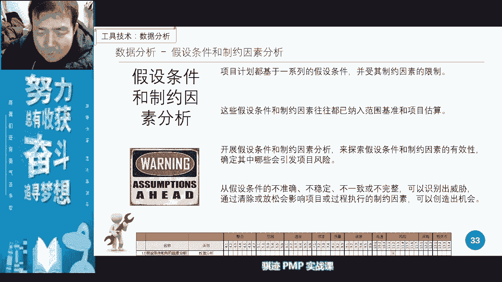

SOW分析里面分为strs weakness、opportunity and threat啊。😊，那么内在的因素是什么？内在的因素是你的优点和呃你的呃优点和弱点。你的优势和劣势、优点和弱点。😡。

那那那么我们来玩个啊我们来呃玩一个实力啊，以我实力啊，我们讲以我给你们上PMP课来做1个SWT分析，对吧？😊，那么我的S是什么？经验丰富，对吧？讲偏批课，经验丰富，是我的Sstr对吧？经验丰富，能力强。

能说会道，对吧？这是我的internal内在的一个能力优势，对吧？我的劣势是什么呢？劣势是什么？呃，可能呃工作繁忙，课程众多，所以可能精力没有那么旺盛，那么集中，是我内在的一个劣势，对不对啊？

内在的劣势。😊，所以这个都是针对我个人的和大家没有关系。那么external origin是什么？外在的那么SOT是怎么分析呢？比如说针对我们我来给你们上PP课这节课。那么我们un什么？

大家的课呢从考试呢从4月份延迟到了6月份，这是一个好事情吧，对吧？因为什么大家就更多的时间复习的，对不对？但是呢危是什么呢？大家可能就不认真学了，对不对啊？会有这样的危险。还有一个什opun呢。

大家学习呢都很认真学习态度积极性很高，这是个opportun对吧？然后那么还有什么劣势呢？劣士可能是什么？但因为是视频上课啊，我们是远程上课的关系，可能呢不能面对面，所以学习的印象呢可能不太好。

那么学习的印象不太深，印象可能没有那么深，然后容易遗忘，学习的感觉没有那么好，这个东西不并不是由我作为讲师，我的个人运行造成的对吧？这是种外部。😊，条件所造成的，所以这是什么是一种威胁，明白了吗？

SOWOT就是这样这样分析，从内部分析优势劣势，从外部分析什么机会和威胁啊，O很简单吧啊，所以SOWSWOT这个分析呢，我们会在工作中经常会使用的啊，我也很推荐大家干什么？大家在做一些复杂的工作的时候。

并不一定管理项目，做复杂的工作的时候，我们也可以使用SWOT分析s分析去分析客观的情况去找出区机会。那么s最关键是什么？分析完了之后要做一个事情。中国人老话叫趋利避害。

尽可能的往SO去靠呃将我们的状态往SO去靠近，而避免WT。😊，这是呃SO往SO靠避免WVA这是我们的一个之后对于SLD分析之后采采就行动一个方式，叫做中国古人四个字叫趋利避害啊。

所以它可以用于识别风险当中，从我们内在外在去寻各种角度去寻找我们的风险啊，拓宽了我们的视野。😊，最后呢我们就会用呃用到一个东西叫做提示清单啊，提示现的prom list。😊。

pro list啊 list当中呢它是用这种大的框架到中的框架，在小的框架去告诉我们从概念上会有哪些风险啊。

那么最大的那个框架叫pa PSTRE啊现在在很多的管理理论当中都作为一种大的框架去识别各种因素的一个一个最主要的框架啊，P是polis啊polis政治一是econ啊，经济S呢是sy啊。

社会L呢是 legal或者 law叫做法律啊，T呢techn啊，最后一个一呢叫ronment从我们会从这个6个大方面这个宏观方面去看风险，对吧？啊。

那么我们讲学习PMP我们今天讲分析考PMP证它的宏观风险。我们来做一个练习啊，玩玩一下练习。😊，嗯。好，我们讲如果我们从宏观方面来看，嗯政治上啊政治上。😊，呃，是不是是不是存在风险？有对吧？

如果中美关系恶化了，对吧？这个证书以后不认了，对吧？然后会考不到了会有风险，对吧？啊，这是考PNP的一个风险，对吧？😊，economy经济上对吧？有会有风险吗？啊也会有风险。好的风险是什么？

随着国家发展的深入，对吧？我们对项目管理的需求越来越多，所以这个经济上会带来很多好处，这是opportunity，对吧？但是呢也会有什么ss是吗？有可能偏MP的挣券越来越多的就不值钱了，对吧？😊。

那么社会sciety呢，社会从社会角度来讲呢，大家有了PMP证呢会有更多的社会认可和社会价值参与感啊。所以这是sciiety啊。那么从技术上来说呢，PPMP呢既可能是说什么啊很大家工作相关。

所以他会有优势啊。所以从技术这个方面来说，如果从事项目管理工作的，或者有类似管理管理工作经验的同学考PMP会更有优势。那么相对而言没有这些相应工作的同学呢就有劣势啊。

所以这我们从平时学习当中呢也可以看得出啊，有些同学为什么比较难以理解一些概念想法呢，就是因为他从来没有接触过项目管理工作。😊，明白啦。L那是 legalal法律啊法律啊法律当中呢偏MP更多的是什么啊。

一个法律上承认不承认，对吧？😊，啊，法律上承认不承。最后一个im环境环境好像和PMP没什么大关系啊，没什么大关系，那就忽略没有啊，这是一个宏观的一个框架。😊，所以提示清单当中是个红观框架啊。

peestto一定要记住啊，peestto在很多的领域当中会用也会用到啊。那么中关我们讲中关叫techco啊，tecoteco是technical，我们的technical，然后呢。呃。

Environment啊comcommerci operation and politics啊，那么它更接近于你运行这个商业环境的呃实际环境情况啊，实际环境情况okK啊这就不多举例子。

最后一个呢现在越来越提到越多了，叫网卡啊，无卡无卡乌卡。😊，我卡我家的网卡啊，那无所谓VUC。呃，V呢是variability的N呃C呢是uncertain。C呢是complex复杂性。A是啊啊。😊。

app啊 pro啊app是模糊性。所以VUCA这个东西呢是微观的一些属性特性，它会带来风险。但是这个特性恰恰是现在互联网数字时代的一个特性啊。什么所以人们现在说互联网数字时代。

人们永远要跟着VUC相共存，叫做易变性、不确定性、复杂性和模糊性。😊，variariable untainable啊 uncertaintainable，然后complex和什么啊呃appxiable。

😊，啊VUCAUCOK啊，这是提示清单，这些东西也可以帮助我们从不同的角度去寻找风险的来源。所以我们正在做风险识别。那么来了，风险识别这个子过程当中有没有会。😊，没有专门的会议。

但是你可以专门开一个会去进行什么头脑风暴或者怎样也可以安排一系列work session啊，workshop去进行。😡，风险识别都是可以的啊，但是我们没有专门的会来，所以风险识别是没有专门会。

但是它会有一个重要的输出啊，不要急，它会输出一个很重要的东西，叫做风险登记测，这是风险登记册的第一次出现。第一次出现。😊。

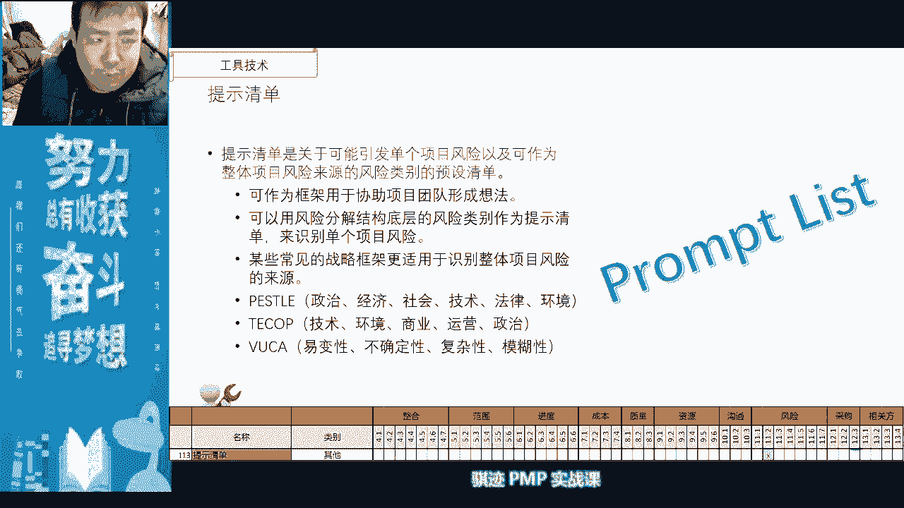

那么风险第一次登记册第一次出现的时候呢，我们会有什么东西啊，会有已经识别了风险情况，会有注意我的标红的字啊，叫潜在责任人和潜在风险应对措施啊，它是潜在的，所以它没有正式任命，也没有正式确定。

但是它会潜在，这些潜在呢，可能是我们在识别过程中伴随而来，我们主观的认为他可以用啊，但是没有进行确定。注意啊，那么风险登记册是不是在识别风险当中一定只会出现这三个呢？不一定啊。

那么有些同学说老哎老师你把我搞混了，为什么你前面说只会出现三个，又不是什呢？要分什么情况。😊，啊，我讲的慢一点啊，那么分什么情况？因为首先有个概念，风险的识别，风险的管理是一个迭代循环的过程。能明白吗？

就是说风险不是说在项目一开始识别一次就完了，它要伴随着项目的开展，做定期和不定期的识别，做定期和不定期识别。然后呢，针对于识别出来的风险呢。

要进行定期不定期的风险啊、定性啊、定量啊规划应对这些这些动作啊，才能让风险管理呢实施有效所以在这种情况下，只有在初始状态，第一次识别风险的时候呢，我们的风险登记册上才只有已经识别到风险。

风险责任人潜在的风险应对措施潜在的啊，这样三样东西。那么如果我们已经识别过一次风险的呢，在识别的时候，因为我们已经经过一个完整的风险管理的一一个流程了。

所以以前的那些风险可能是存在我们的风险呢正式责任人正式应对措施啊，一些风险的信号，一些风险的定量定序，它的优先级的。😊，这些都会有的，但是新识别的仍然没有。😡，明白我意思吧？😡，ok啊好，那么这样我们。

😊，听了是不是有点晕啊？OK啊，我们正好停在这里，大家休息一下，我们休息10分钟，我们休息1分钟。10分钟之后呢，我们继续回来讲。然后我再给你们讲一遍，但是一定要记住啊，风险登记册，因为会被更新很多次。

每一次更新都会可能出现新东西，也伴随着就出现考点，这是很多同学在以前历届考试当中很容易犯的错。😊，好吧，好，我们休息10分钟，现在是9点整，我们休息到9点10分，然后回来。😊。

