# PMP认证考试课程最新完整免费课程零基础一次通过项目管理PMP考试 - P35：PMBOK第六版 第十一章项目风险管理-36 - 骐迹PMP - BV1Sb4y1f7Yt

好同学们啊，我回来了，k老师是个很守时人啊，我们之前讲的这些风险应对措施的这些举例，大家是不是都理解了啊，那风险应对措施的这些举例是啊，是我们考试当中经常会出现啊，但是如果搞清楚是很容易拿到分的。

但搞不清楚也是很经常会容易丢分的啊，好这是我们风险应对，我们规划风险应对当中的一些主要的措施啊，有同学担心啊，我们后面很多课程都讲不完，没关系啊，因为你首先要把单个项目风险的应对的，应对办法搞清楚了。

后面的整体项目风险，用这个方法呢，其实就是照搬啊，就是他为了满足理论，所以他讲起来很快啊，我们应急应对策略我们讲过了对吧，这个已经讲过了，没关系啊，我们之前讲的应急计划，应对应对计划我们已经讲了对吧。

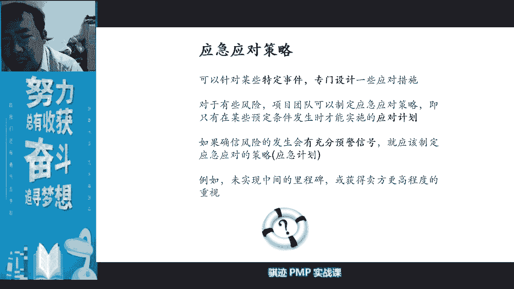

然后接下来我们开始讲o，好吧我看一下啊，有些同学在弹幕里评论，对吧啊，大家都回来了吧，ok啊先回来了，我们先扣个一吧，我们回来的同学扣个一吧，今天人其实还不是很多啊，我们班级群人很多的啊。

我们一个群满满当当的500个人都塞满了，塞不下啊，啊我们回来同学扣个一啊，你们在公屏里扣一啊，我继续讲课啊，好那么分单个项目风险的应对措施，讲完了之后，这个只要理解了，那么整体的就很简单。

整体的项目风险应对的时候有一个特点，它是没有上报的，为什么没有上榜，因为项目的整体风险是由项目经理负责的，这是你的职责，这是你的value，所以你不能够上榜，所以你看对整体应该你是一个最终负责人。

所以这个时候你是要自己去把控和管理的，单个项目风险呢，也有可能是嗯因为呃女职权范围外的事情啊，所引起的引发的啊等等这些东西你可以上报，但是整体项目风险你是最动作的人，你是不能上报，所以在不能商贸情况下。

其实我们就是把积极的和消极的合在一起，就是对吧，我们积极和消极都有的应对策略是什么，接受对吧，然后呢积极的呢就开拓啊，百分之百消极的呢规避0%，积极的呢提高消极的呢，减轻积极的呢分享消极的呢转移就行。

是不是都讲过啊，是不是都讲过好，我来看一看我们还有多少同学在直播间里，有不少，但是还不够多啊，说明还有很多同学没有回来啊。

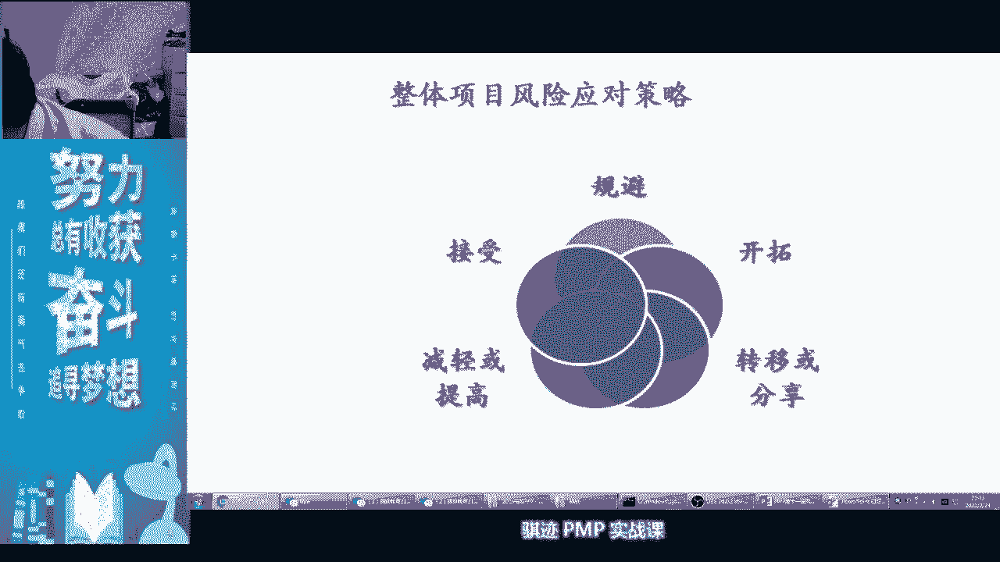

好东西都没回来啊，好那么这个讲过了之后呢。

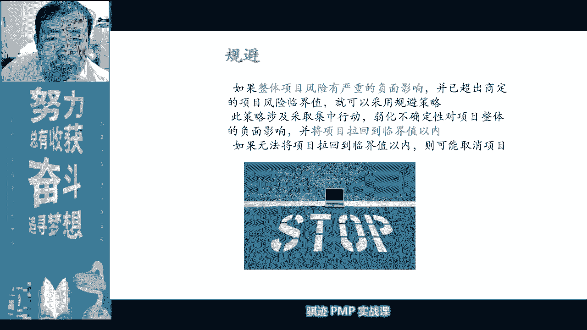

我们讲这些东西呢就不会再额外讲了啊，所以这几页可以很快的过去啊。

很快过去，那么但是有一个东西不会很快过去，就是什么，我们会在规划风险应对之后呢，对风险登记册进行第二次更新，所以风险登记册到这里会更新几次，两次风险登记的在这里到这里为止，有有几次出现一次出现对吧。

我们识别风险是第一次出现，然后有一次可选更新是什么定量分析对吧，但是有两次是必选必必定会出现的，更新必定需要的进行更新是吧，一个是风险的定性分析，一个是规划风险应对对吧，定性分析当中呢我们有了责任人。

然后呢我们的规划风险应对，最后怎么就有了我们什么我们的应对策略，我们的应对的具体行动，我们的应急计划，我们的弹回计划，我们的应对计划对吧，我们风险触发的触发条件，它的征兆预警信号，对不对。

我们会有可能产生的残余风险，自身风险这些东西是不是之前都讲过好，那么当风险登记册经过了第二次必选更新之后，它就完全了，那就完全了啊，所以风险登记册要经过一次出现两次更新。

必选更新有可能会经过一次可选更新之后呢，他才能完全完成之后，风险登记上有什么啊，这个是不是跟你的清楚啊，经过规划风险应对之后有什么，有第一有风险的内容和描述，第二有风险的征兆和预警。

第三有风险的优先级对吧，第五有风险的应对的措施，第，对不对，有了这些东西，是不是我们的风险登记的就完全了，ok啊ok是不能理解啊，所以风险登记在不同阶段，它还有什么内容一定要记住。

用了考试的时候有可能会抽取某一个阶段，问你上面有什么东西，或者他怎么运用上面的东西去做啊，这个是要当心要注意的，就是考试当中有可能会考到一种问法啊，所以风险当中，风险登记册的状态更新是会有很多的考点啊。

哪里啊好那么在规划完风险应对的之后呢，我们会更新什么，假设日志更新风险呢啊与风险相关的成本预测，然后甚至更新整个项目的成本预测对吧，因为我们制定的风险应对措施，我们讲啊钱就不一样了对吧。

钱就细化的不一样了，有可能会超支，我们可能要预算要扩大追加预算对吧，项目还没干就可以扩大预算了，也有可能的啊，还没开始开始啦，同学们，同学们开始了没有问题啊，ok啊。

啊大家看一下自己的屏幕是不是在播放状态啊。

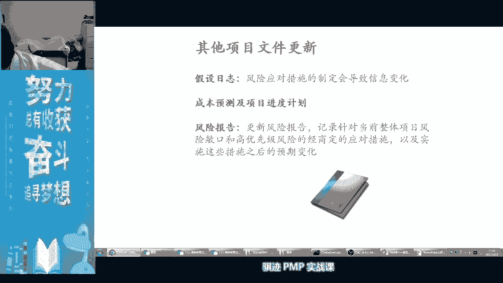

ok啊好，我们继续讲，接下来一个子过程呢，就是实施风险应对，顺风云缨队，那就没什么好说的。

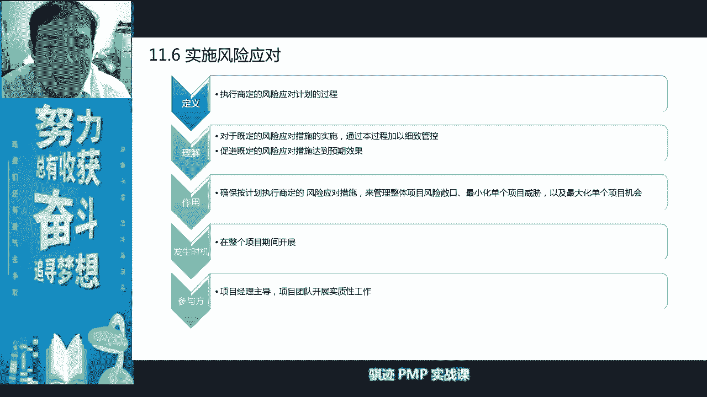

就是按照商定的既定的计划干活就行，其实没有什么，那么生命干活呢，我们还是按照这样一个原则，按照商定的应对措施来进行，然后呢最小化风险，趋利避害，最大化机会对吧，只有风险责任人以及必要的努力。

伤病的应对措施才能够获得有效的管理，所以在实施风险应对的时候，实施的负责人是谁，是风险的责任人，那么项目整体的风险的责任是谁啊，项目经理，但是单个项目风险的责任是谁啊，是我们在风险哎。

对风险研讨会当中所确定的风险责任啊。

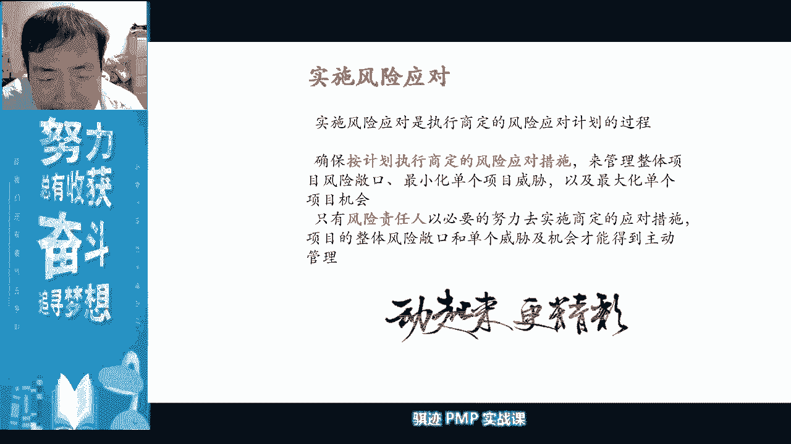

那么呢风险呢实施风险应对当中呢，我们会需要人际关系影响使用回，我们叫弹回计划的时候呢，风险已经实际发生了，它会变成一个问题，我们主要讲消极，消极的风险会变成一个问题，所以我们会更新问题日志，对不对。

会更新问题日志啊，因为它已经发生了，注意啊，风险当它发生的时候，那么我们就更新风险的问题日志啊，然后呢预开客户风险，应对风险的过程当中呢，我们会积累经验，所以要更新更新我们的经验教训登记册对吧。

经验教训登记册啊，我们稍微提一下，在经验教学中计算，在我们项目的各个阶段的时候，有可能在项目的各个阶段或者项目结束之后，我们会经过归档项目经验教程登记的，一旦经过归档就变成什么组织过程，资产记得吧。

然后呢我们应对风险是不是要派公啊，所以会有项目团队的派工单，那么项目团队的派工单，这这个输出是在哪个子过程当中输出的，好考你们的来了啊，请在公屏上打出项目团队派工单，是由哪个子过程输出的。

来请在公屏上打给我，诶怎么知道啦，哎呀记得吧，有一个东西叫做诶，诶诶资源管理计划里面有拍公单吗，就是做计划呀，有空单吗，没有拍公单执行哪来执行啊，你看你看你看看前学后忘，我们我们在分配资源的时候。

是执行哪个子过程的获取资源，接下来我们在资源管理计划当中，我们资源啊，资源管理那个知识领域当中我们讲过吧，获取资源这个领域呢，pmi的取名不太当不当，他其实应该叫获取并分配资源。

所以我们当需要资源去进行风险应对的时候，我们的派工单是通过什么获取并分配资源的，分配资源这部分呢派出来，对不对，耶哈哈识别还执行，哎呀呀，同学们啊，这个东西差异有点差距有点大啊。

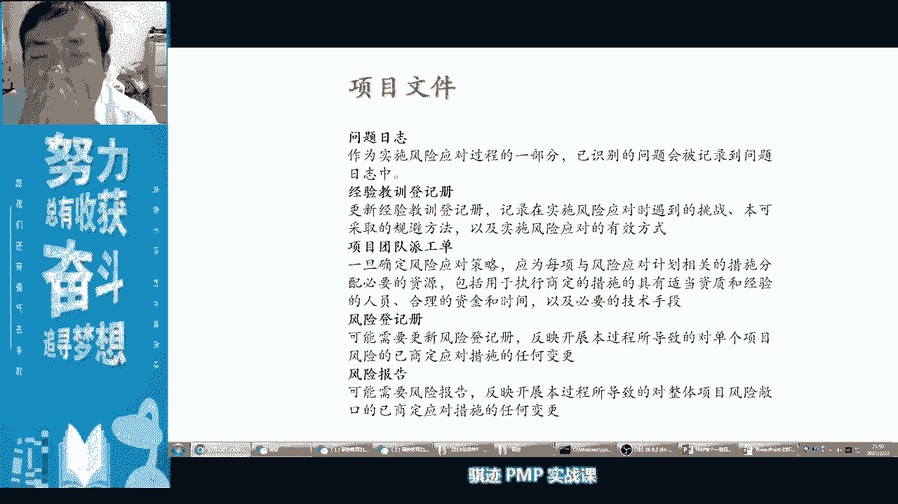

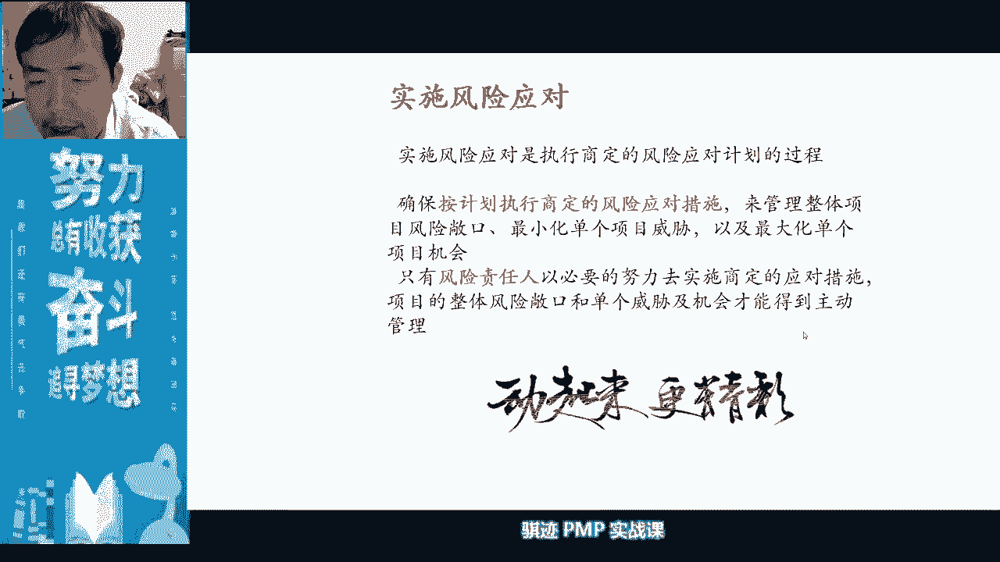

不要忘记啊。

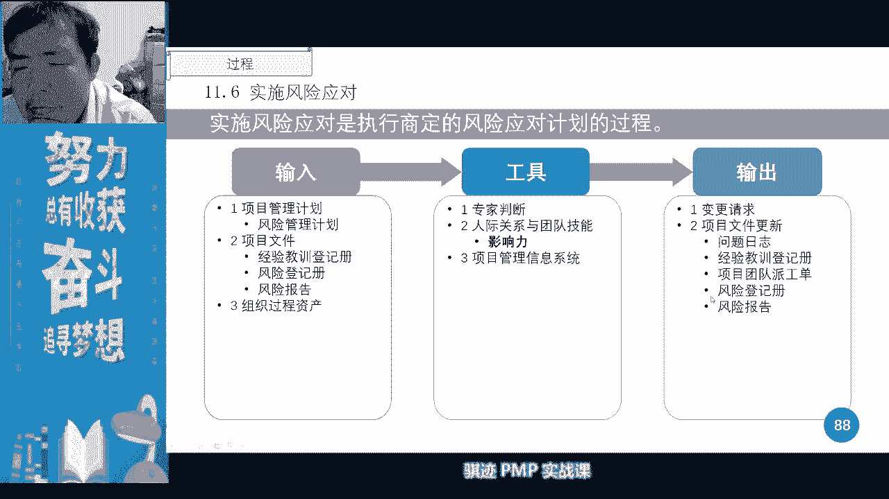

ok啊，实际的派工是由获取资源进行这个子过程，进行派派工的，但是拍完之后呢，我们会更新这个派公是为了什么，风险应对所产生的派公，记得吧啊不要忘记啊，然后呢我们会更新更新风险登记册。

为什么要更新风险登记册，有些风险一旦发生了之后呢，他以后可能就不再发生了，所以它可能发生之前呢是一个高高效信息风险，它发生之后我们应对完了之后呢，他有可能因为还有残余嘛，他可能变成一个低优先级风险。

或者是什么，他变了，他因为是什么次生风险，他就这个风险已经关掉，但是我们会多出一个什么次生风险来，或者说没有次生风险，也没有采访，他已经关闭了，那么这个风险呢，我们在风险登记上会把把它标注成以克服。

以解决的风险，或者不再发生啊，诸如此类啊，所以风险登记当中会更新这些东西，然后呢我们也会更新风险报告对吧，因为发生的风险就会可能要更新风险报告，因为发生的风险有可能会改变，我们的整体的风险状态。

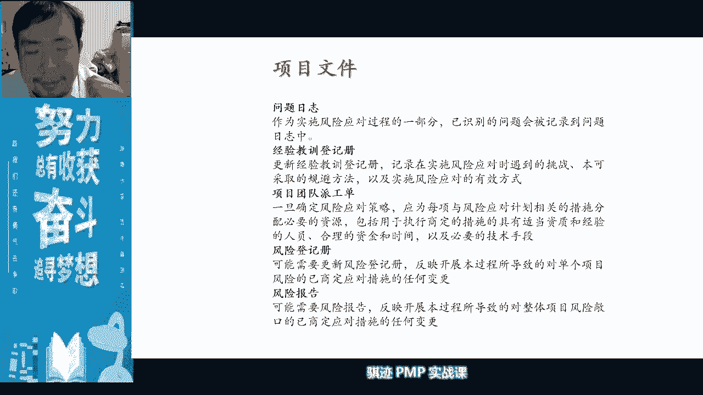

好那么最后一个就是监督风险。

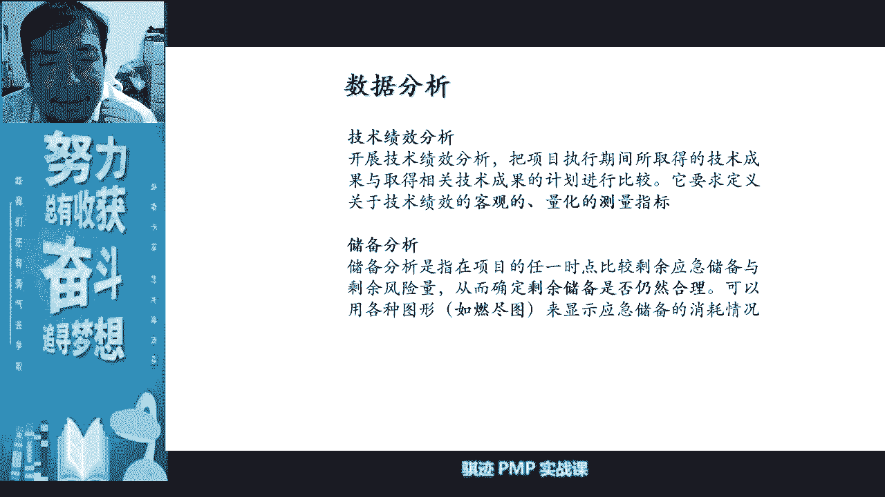

那么监督风险其实很简单啊，监督风险大家啊很简单。

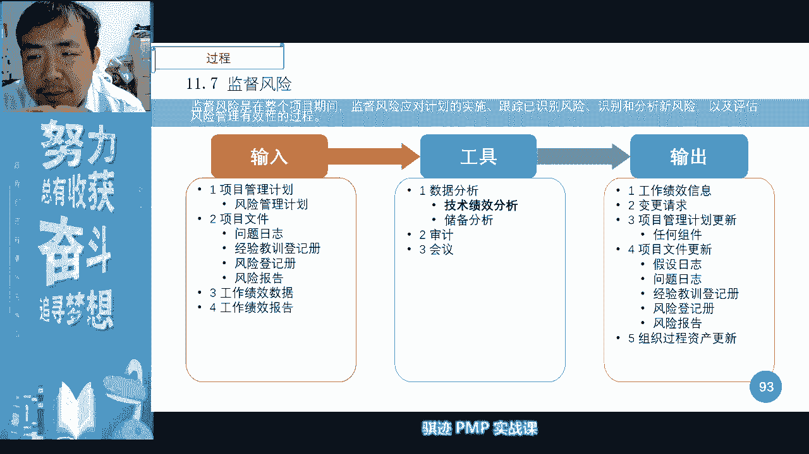

大家要记住监督风险是干什么事情的啊，监督管风险主要干三件事情。

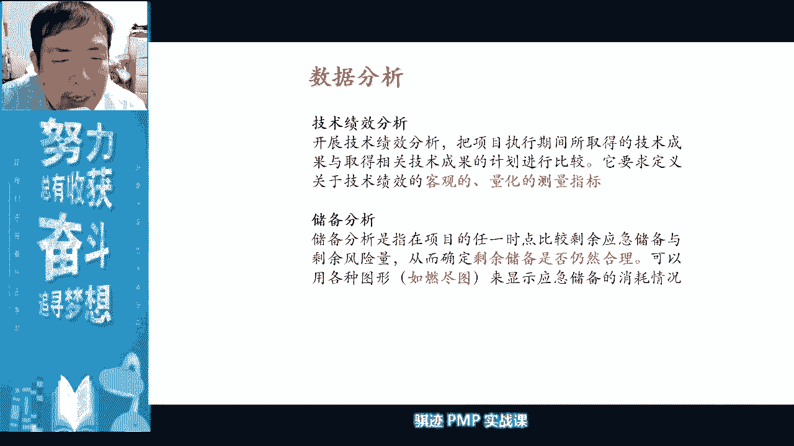

第一件事情呢是识别不是系统化的，是通过监督的过程，非系统化的，非流程化的去识别一些新风险，识别新风险，然后呢我们是跟踪已经识别了老风险啊，然后呢重新排序和评估现有风险，他在风险管理里面主要做这行。

当然他也做什么东西啊，绩效绩效分析啊，绩效分析，所以监督风险做的事情比较多，不像其他的的监督的子过程，控制子过程啊，只是出一个绩效分析，它主要的做的东西呢是识别新风险。

但是这个识别呢不是一个系统性的识别，所以他不会用系统性方法去识别，我们前面讲了用啊，用ibs啊对吧，用什么啊，pascal voca这些东西我们不会啊，我们只是说看到了就把它识别下来。

只是我们见到了就识别下来啊，所见即所得对吧，然后呢第二个呢是跟踪现有的风险，跟踪现有的风险，然后也有可能什么重新跟踪线路风险，对它进行重新排序，那么最后一个什么啊，关闭一些老的风险。

同时呢评估信用风险的一些有效性，关闭一些老东西，所以我们总结起来可以什么啊，识别性风险，跟踪老风险，然后关闭过期的，过时的风险，主要在风险领域做专项行，然后呢，再加上所有控制组过程都会做的绩效分析。

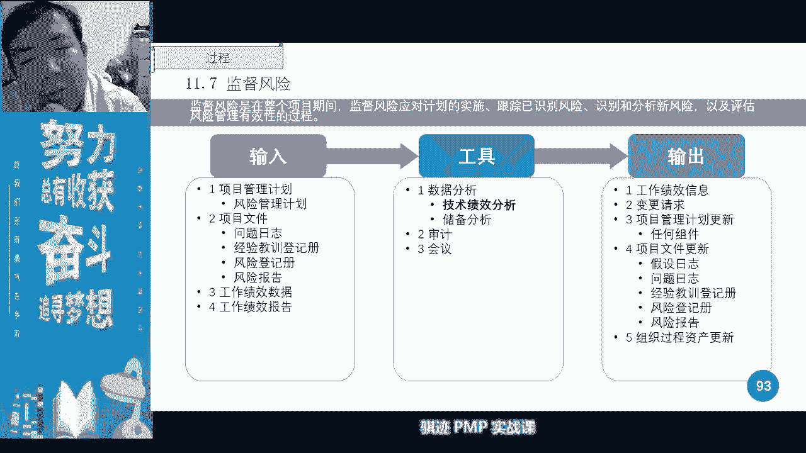

这是监督的主要事情，那么监督风险当中呢，我们会做一个事情是什么，我们会做一个东西叫做储备分析，这时候储物东西我们会用和用的啊，啊bend down chat啊。

我们的benchat bon chat当中叫燃尽图，记得吧啊，这个时候我们会用到一个东西叫做储备，燃尽图啊，记得我们进度当中讲过吧，进度软硬度当中，我们希望实际的曲线是在计划线之上，还是之下的。

我们是期望我们的实际曲线，在我们的计划的基准线的下面，因为越下面是不是进度越提前啊，我们总是希望进度提前啊对吧，但是储备分析当中，我们的储备原地图，我们是希望储备用的越慢越好。

应该希望在基准线的什么上面，那部分在计算机越上面好，表示我们花了钱比我们预计发生的什么啊，风险呢要实际发生，要花的钱要少越省钱，是不是当然也就好了对吧，所以这是储备分析，所以风险的储备分析当中。

我们会用储备燃尽图，来显示储应急储备的消耗情况。

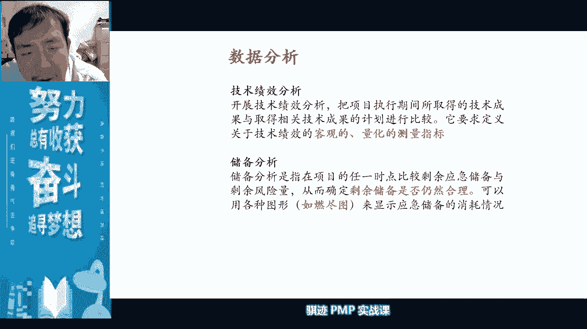

我们期望消耗的要比我们预计的要慢，我也好好。

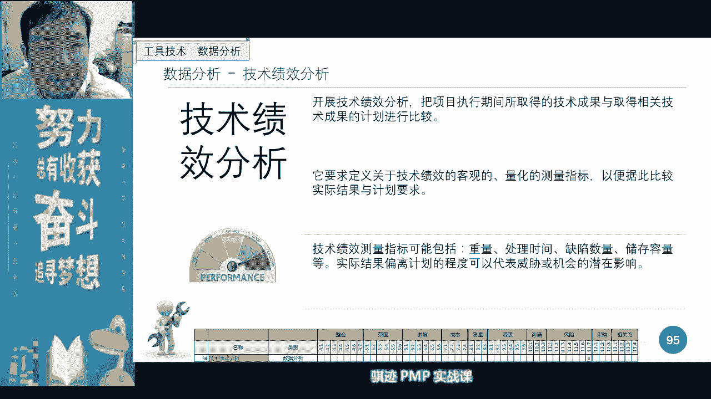

那么我们也会做绩效评估对吧，绩效评估，然后呢，在风险管理当中，我们质量当中有一个工具用的，记得吧，叫审计，叫质量审计，风险当中有一种审计，风险审计啊，风险审计审计的时候，我们的风险管理过程是否有效。

是否遵循了项目的风险管理计划，和组织的风险管理的相关政策，就是这种审计啊，所以风险当中要有风险审计，风险审计，现在越来越多的大组织的各个管理当中，会才使用啊，叫做风险审计，所以大家以后就知道了。

审计不仅仅只有财务审计，还有什么有风险审计，质量审计的对吧。

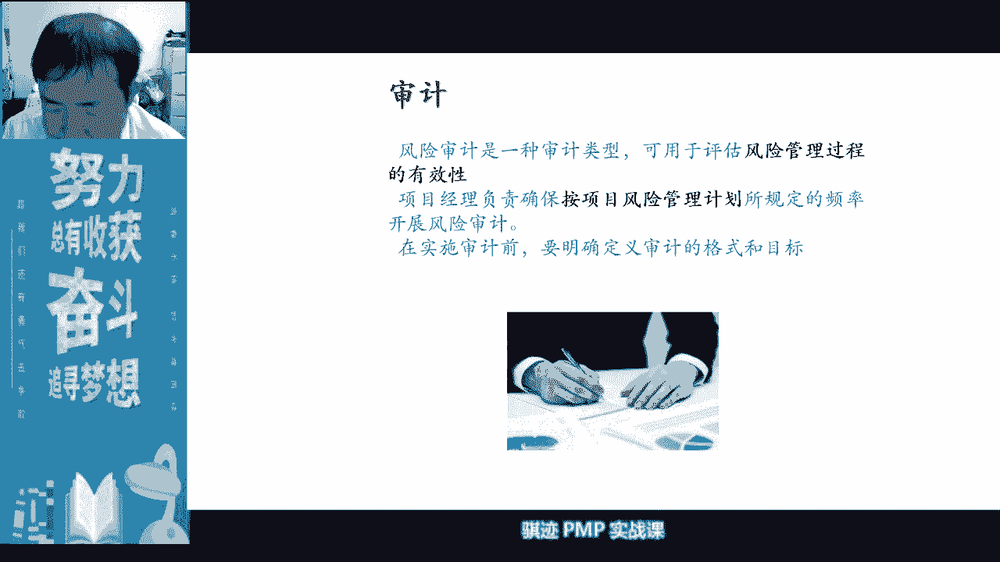

好那么我们在风险的监督风险当中，我们会开风险的最后一个会叫做风险审查会，那么丰县审查会就是做我们刚才讲的那个事情，我们讲识别出单个的项目性风险啊，也实行风险对吧，关闭过期风险，重新评估当前风险。

什么叫重庆民共安全风险，就是当前已经有这些风险还没发生，但是他在在册子上，我们风险登记册上，但是呢我们以前觉得是低风险，经过项目一个阶段，它有可能就变成什么高风险啊，有可能就会被高风险。

我们重新评估它有可能会提高他的级别对吧啊，所以这个时候呢我们会识别性风险，重新评估当前风险，关闭老风险，同时总结经啊，这是风险的三个会叫风险审查会，所以我们在规划风险的时候，我们来总结一下，回一下啊。

规划风险的时候，我们会开风险规划，会制定出风险管理计划，从中间最重要的是风险的概率影响，定义和概率影响矩阵对吧，第二个会呢叫做风险研讨会，在这个会上，我们会指我们在是在风险的定性分析当中做。

然后我们做什么事情呢，指定正式的风险责任人，然后呢我们会排定风险的优先级对吧，排定风险优先级，然后让风险责任人针对高优先级的风险进行，风险应对措施是对于低优先级的风险呢，有项目经理统一管理。

我们采取主要采取接受这种风险的管理措施，无论是正面负面的，都采取接受的方式，然后进行监督对吧，然后第三个会呢叫风险审查会，他是在这监督风险当中开，主要是什么识别新风险，关闭卧室的老风险。

重新评估当前风险，然后总结经验对吧，好风险的三个会是不是都掌握了，ok好大家看是不是其实很简单对吧好。

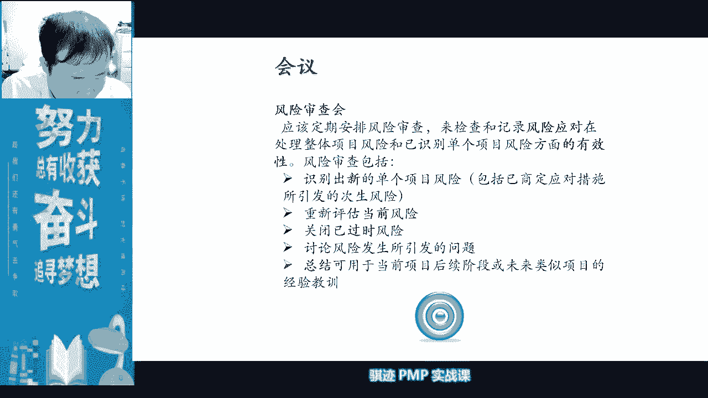

那么最后小结风险冬季色的各个迭代对吧，一步一步一步迭代啊，这个这个识别小节小节呢我们就啊不在啊，不在进行什么，不再进行讲解啊，因为我们在之前课当中已经讲了很多了啊，当然这段就要注意什么。

定量分析是可选的啊，更新，然后识别风险呢是第一次出现啊，识别风险第一次出现，那么控制风险呢，这个更新呢也是可选更新，因为控制风险不一定会更新风险登记册，因为它识别到新风险，排除老风险的时候。

重新排序原料风险才会更新，如果他没有做，发现没有什么要改动它就不一定，所以它是非可选的啊，ok但是定性分析和规划风险应对是必选更新啊。

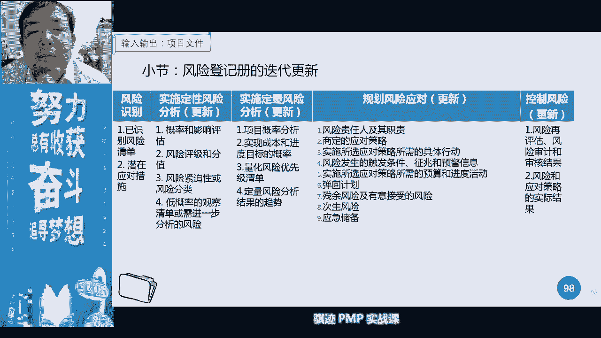

必选更新啊，注意这一点。

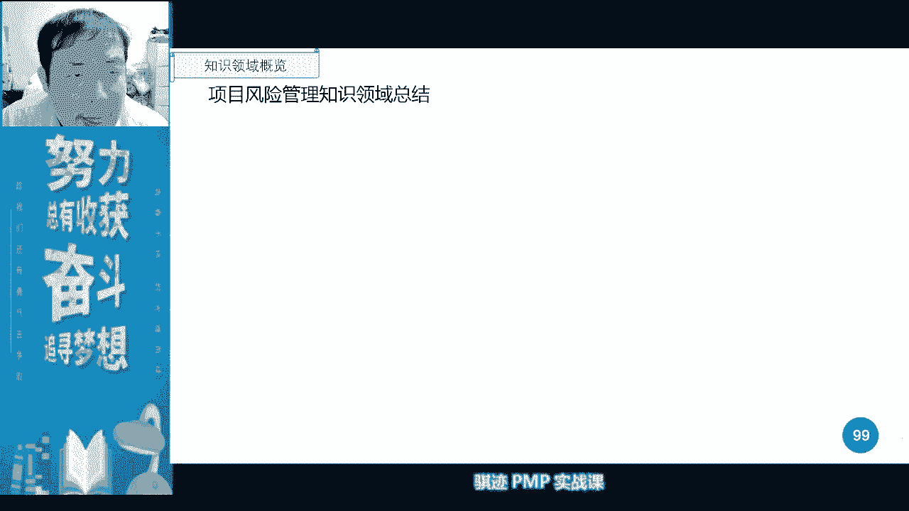

那么以上这些就是风险知识领域的所有内容，ok大家都听明白了没有啊，听明白了，听明白了，我们就进入本节课，我们在讲完课后练，就这节课结束对吧，差不多正好十点好。

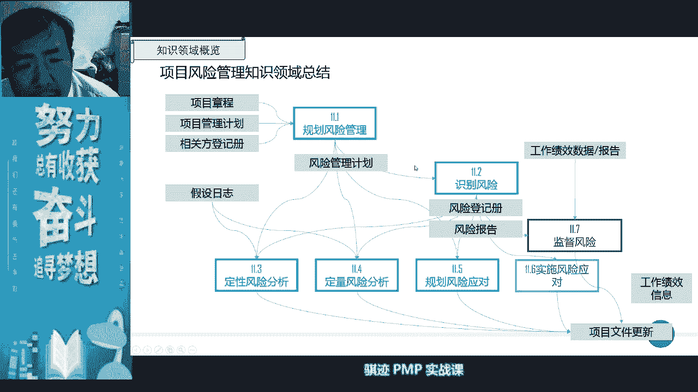

风险的责任人指的是谁啊，第一题，第一题风险的责任人指的是谁啊，负责人负责人就是责任人一样的啊，非常好啊，还有什么答案吧，都选d啊，原因都错了，ok非常好，风险责任人指的什么，规划风险应对措施的人。

那么为什么没有责任呢，这是个翻译问题，ok啊，所以don't c，所以这道题目如果遇到你看不懂，那么你应该看看英文，那么第一个监督风监督，观察风险清单的人是谁啊，项目经理向项目干系人解释风险的人是谁啊。

是项目经理让风险发生的人是什么人啊，是傻x傻叉傻叉傻叉傻老师对吧，傻叉啊，只有d规划风险应对措施的人，还是风险责任和风险负责任，ok所以这道题目应该选择的是d，监控项目风险清单的人是项目经理。

项目经理不一定是所有风险的风险责任啊，注意只有低优先级别的风险，列入风险观察清单的人啊，这利润工程方式，现在那些低由其风险，他的责任人才是项目经理，知道吧啊好第二道好，来抓紧一点啊。

上课的时间其实已经到了啊，第二道作为风险管理，风险管理的重要工具，概率影响的矩阵在哪里被定义完成，啊有个同学说项目经理也是责任，对啊，项目经理只是一部分，风险和风险观察清单的责任，但不是所有风险责任。

所以最正确解释责任人风险责任人是谁啊，负责人是谁啊，就是规划风险应对的那个人，这是最正确的解释，第二道题选第二单选什么，ok啊我看到还有很多同学答对啊，第二道题你们居然有人选c啊。

我就我就知道你们会有人选c，他写的是在哪里定义完成的啊，定义风险概率影响矩阵是在哪里定义完成的，第二道题当然应该是选择b呀，风险概率和影响矩阵是在规划，风险管理当中定义，在定性分析当中使用。

讲过了讲过了啊，ok啊还是给我选c啊，错了吧，是在定性分析当中使用，注意看啊，概率影响矩阵的定义在哪个过程完成，它是定义在哪里完成，它不知道在使在哪里使用，它是定义，看到了吧啊看题要仔细啊。

三建筑换建筑工程上使用马克换旧材料，不能在雨天施工，但是按照进度安排，这些材料刚好又在雨天施工，但是没法延期，你决定原计划施工，这是这种策略啊，第三题比较简单，第三题比较简单啊，应该选什么。

有人选a减轻，你怎么减轻啊，我请问你，你决定按原计划施工，怎么减轻啊，没法减，他又没有减轻措施了，这什么接受呀，c呀，还有人选b的开拓啊，这个瞎选嘛对吧，接受呀，来吧来吧啊。

冷冷的冰雨在脸上胡乱的拍对吧，就这个意思啊啊老师不小心唱起来对吧，柳豆啊啊，第三题选c啊，好我们第四题，第四题，布拉布拉布拉布拉布拉，这是哪种风险策略啊，啊迪士尼请你光速告给我，告诉给我减轻对吧。

诶嘿好销魂对吧，看到两个字吗，圆形及免轻一分到手下一个对吧啊，很简单对吧，所以你看到吗，所以很多时候偏僻考试，尤其在你们最后一次老板考试之前，你们在考试的所有经验是前人老师，学生通过不断总结出来。

所以我们教我教你上课，教你很多东西是考试当中最实用的，只要看到关键词就会选东西，所以这道题当然应该选a了，还有问题吗，四当然选a啦。

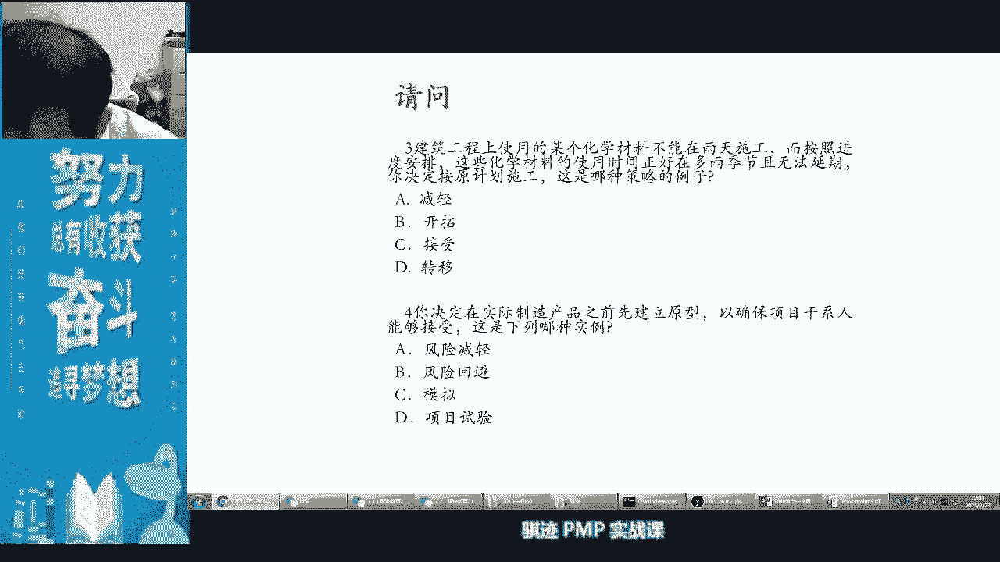

好我们抓紧一点啊，时间已经超了，我们抓紧点，第五道题目，第一个大题目，关于风险登记册，风险报告正确的说法是，风险登记册是单个风险的概述情况，比风险报告正呃记录整体风险的信息，c风险登记的应该逐步更新。

形成风险报告，第一风险报告应该记录单个风险的详细信息，应该选什么，啊有些同学有点卡是吧，有点卡是吧，好ok啊，你这个是网络问题啊，没有办法啊，所以刚才大家应该尝试一下啊，第五题应该选什么。

我们讲这是风险登记册，保险报告的关系对吧，我们要回忆一下风险登记册，是不是进入单个风险的详细信息啊，风险报告呢记录整个项目的一个整体风险状况，和，项目单个重大风险的，单个项目风险的概述信息对吧。

两者之间没有直接形成的关系，而是要什么通过一系列过程，所以根据我所上描述，哪个是正确的，a风险登记的记录，单个风险的概述情况显然是错的对吧，概述情况显然是错的，它是记录单个风险的详细情况对吧，a是错的。

比风险报告记录整体风险的项目信息对吧，对的啊，c风险登记册逐步更新型的风险报告，是错的对吧，风险报告记录单个风险相信也是错，所以答案选什么对吧，有些同学抢答啊，已经达到第六题去了啊，很溜的嘛，第二个。

风险管理应该在哪个阶段，就安排好风险责任人啊，ok啊，第六题，第一点你看简单啊，这个很简单啊对吧，有些东西已经会抢答了对吧，我们刚刚正好就学过是吧，哪个阶段啊，风险研讨会在哪里看啊。

定性分析指定正式的风险责任人对吧，所以第六题毫无疑问应该选a啊，抢答的同学叫郑汇丰的同学非常好啊，都会想学会抢答了啊，考试肯定能过，指定能过对吧，什么叫指定能过，就是穿一条紫色的裤子去考试。

叫指定能过对吧，好第七了，哪种方式最流于确定哪个风险，对项目有最大的潜在影响，好这个题目你们看到了关键词在哪里啊，第几题啊，关键词在哪里啊，第七关键词看最大的潜在影响是哪里啊，一看就知道是吗。

敏感性分析啊，模拟是看它的发生概率和可能性，敏感性分析是看哪个风险是概率最大的，影响最大的，我们注重寻找最大的东西，抓大头，决策树呢是不同的路径，我们看是哪个路径风险更大，收益更大啊。

影响图呢是讲我们的选择路径的过程，所以呢影响什么b，啊第七题选b，好第八题，无论机会和威胁都可以采取的措施是什么，这里讲了机会威胁的时候，有没有讲是整体和整体和单个的没有讲。

所以你可以看到是又可以整体和单个，那么无论是既会威胁都可以采取的措施是什么，那很明显呀，上报和接受呀对吧，回避是什么，第八题啊，回避是什么，回避是威胁的说法对吧，转移难是威胁的说法，分享的是机会的说法。

减轻的是威胁说法，开头和提高呢都是机会手法，只有上报和接受都可以采取，所以第八题很显然应该选择什么a啊，ok啊，但是这个概念大家只要记住啊。

那么今天的课程就结束了啊，风险这一章的知识点是比较多的，内容也是比较多的，我们年已经过掉了，牛年要大吉，我们考试也要啊过一关对吧，虽然考试时间有些同学觉得很远，在6月份，但是时间一晃就过去了啊。

所以为了我们考试能够什么开拓，那么今天的课就讲到这里，我们啊周四再见好吧，大家拜拜，周四开始讲第12章啊，倒数第二章了。

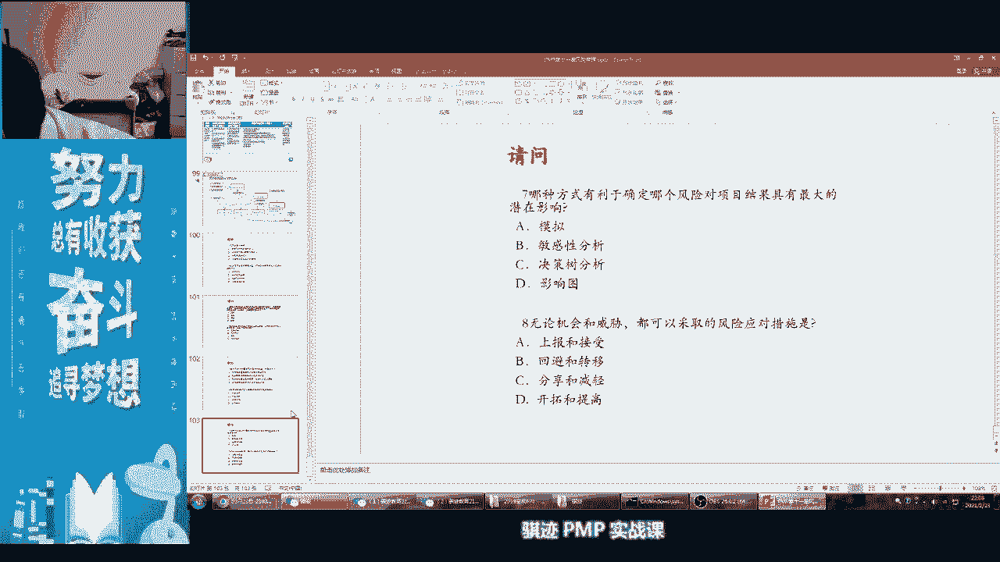