# PMP认证考试课程最新完整免费课程零基础一次通过项目管理PMP考试 - P36：PMBOK第六版 第十二章项目采购管理-37 - 骐迹PMP - BV1Sb4y1f7Yt

我也不知道这个你问一下技术，我就不知道了啊，好8。2开始啊，同学们好，我们一开始12张采购的采购管理，采购管理呢属于内容呢，相对我们的十大知识领域里，相对内容没有那么多大，采购管理呢实用性比较强。

而且才问那个综合性比较强啊，你这节课堂呢大家可以听我娓娓道来，采购管理是怎么做的啊，我们在项目的采购管理当中，很多很多时候扮演的角色就从乙方变成甲方，因为甲方向你进行项目的啊，教呃项目的就是说下单。

然后呢你的项目当中，你肯定也免不了对你的乙方进行项目的采购啊，所以你就变成了甲方，在这样一个关系当中，你就变成了甲方好，那么我们话不多说，进入正题啊，项目采购的采购的核心理念啊。

首先要知道我们在项目当中，一个项目当中，我们很多时候我们并不一定啊，听得出吗，我们说话吧，啊我来我来看一下，试一下音啊，我担心啊，喂喂喂，诶那应该没问题啊，话筒应该没问题好。

那么我们在项目当中很多时候呢，其实我们是啊是需要从外部去采购一些资源，或者采购一些材料去完成项目的啊，但是采购项目的采购，和我们组织日常采购不一样，组织市场采购当中呢，我们的各个职能经理啊。

但是在通常情况下，在项目当中，项目经理，因为项目经理所扮演的角色，除了项目型啊，除了项目型和强矩阵以外，大部分的项目的矩阵类型，是不支持项目经理拥有采购权的啊，对组织有协议的法律协议的啊。

像我们经理通常是没有权利去签这个字的，所以我们通常会使用组织的采购流程进行采购，进行采购，那么我们要遵循组织的采购流程啊，遵循组织了，那超出了其他的，超出了大多数项目管理范围的能力范围。

所以通常来说我们是没有权利去签署采购的啊，所以项目当中如果我们需要采购，很多时候当采购的量比较大，金额比较大或者是有敏感性的时候，我们一般会提将继续采购需求提出。

然后精油我们组织的采购流程进行实现采购啊，是这样，但是项目经理依然要参与到这些合，同和采购当中去，因为我们要对根据项目的实际需要，对我们的项目呢进行啊进行提供意见，采购的意见啊，和采购的技技术的要求啊。

这些东西啊，好那么呃说到这里。

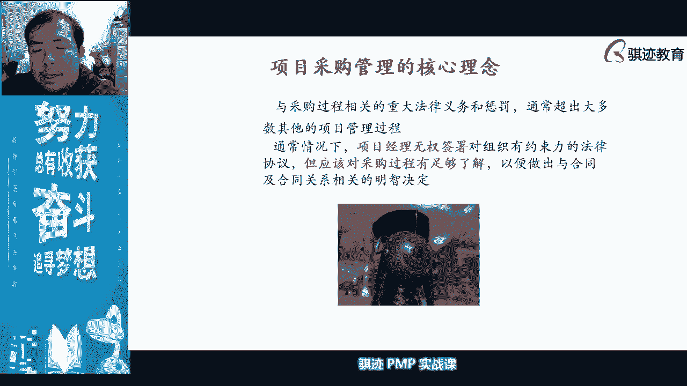

那么我们讲项目当中，如果我们要实时采购，最终我们采购所体现出的一个文件叫什么，叫做协议，协议是买卖双方之间的一个法律文件啊，协议呢有时候呢我们叫他合同啊，有时候呢如果他是个服务性的合同呢。

我们也可以叫他sr a服务水平协议，sel government啊，大家如果有有学过ito的话，知道这个词来源于ito啊，当然大家如果有兴趣的话，也可以跟着我学ito也可以啊，嗯啊打个小广告嗯。

然后呢谅解备忘录协议，备用协议，备忘录ma啊，或者叫订单po啊，都是可以的啊，那么他们呢各有不同啊，各有不同，合同呢是泛指一切有双方有法律约束性的，买卖的一个啊文件啊，一个法律文件啊。

那s la呢专专门指的是是服务性的合同啊，服务性的合同订单的po呢它有什么特性呢，它是合合同格式是固定的，买卖高度标准化的商品叫做po啊，就像呃就像你们去加啊，加油站去加油，那么你加完油之后拿到发票。

你和加油站之间执行的就是一个默认的po订单，因为加油站无论是什么加油站，他们加的油都是有默认标准的，比如92号，95号啊之类的啊，97号啊之类的啊，他有默认标准的啊。

所以这个这些东西呢都是由默认标准所构成的，合同呢不能修改的啊，比如说你去啊安装个宽带，安装个家庭宽带，那么它也是个po订单，这个订单是不能修改，以以这样为形式为基础的一些买卖合同呢。

我们称之为订购单订单啊。

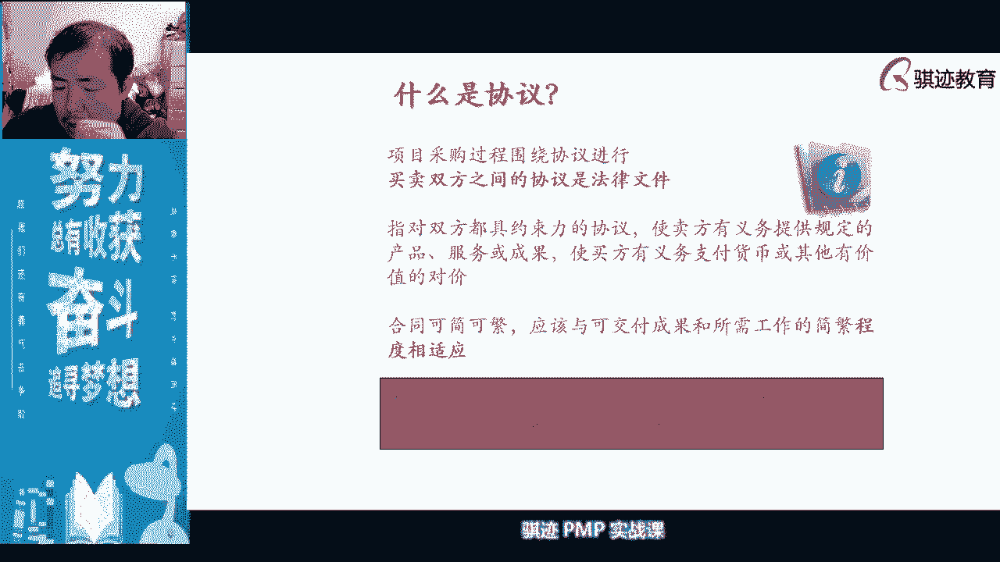

purchasing order啊，好那么协议的要点是什么呢，第一我们既然要通过合同协议这样的方式，然后呢是实现采购去获得，从卖方向买方转移东西，那么他肯定会有一个什么要预期的，可交付成果啊。

这时候预期可交付成果是你的乙方，向你作为甲方移交的可交付成果，就像你的甲方要求你完成独特的临时的啊啊，有不确定性的，那些产品成果服务的智能一样的啊，是一样的啊，那么合同中会有这样的规定。

就是说合同中没有约定的事情，都不具有法律效应，合同中未约定的任何事情都不具有法律权，所以你甲乙双方要签署合同，必须要在这个合同上有，相互相互平等的一个约定啊，这个注意这里注意大家以后在签合同时。

一定要注意合同当中有一个法律精神啊，中中国和大陆法系好像都有一个法律精，虽然我不是搞法律的啊，但是有合同建就是合同的双方必须地位平等，如果这个协议当中有明显的歧视性的，和单边约束的。

这个合同可以视为无效或者部分无效啊，会有这样的，会有这样的事，会有这样的一个法律的定义的啊，这是中国的法律体系所规定的啊，啊大部分的大陆法系的都都是这样规定的啊，买卖双方必须平等啊，买卖双方必须平等。

也就是我们说的如果合同当中，比如说出现霸王条款对吧，我们比如说去餐厅里吃饭啊，餐厅里规定坐下来点菜，必须要点满500块钱才才能下单啊，这个是不是霸王条款啊，是的啊，不允许自己带酒水对吧，这是霸王条款。

所以这些都是霸王条款，霸王条款呢现在呢都是他的买卖行为呢，都是法律不承认的，你可以进行啊，你可以进行，法律上可以进行起诉和法律申诉等等啊，仲裁好，那么文化和当地法律对合同均已有执行，均有影响啊。

所以不同国家的法律，对于整个一个合同的执行是会有影响啊，有定义的文化也会有定义的啊，啊，那么所以呢大多数组织都有书面的程序和文件，来规定如何去采购的啊，就是这里写的大多组织一般指的是有规范的。

然后有一定规模的组织，一般都有正式的采购流程和采购规则来规定，谁有权利代表组织签署合同啊，然后呢合同当中呢还会有附录啊，注意合同的很多时候我们讲合同当中，我们想要达成的描述服务产品成果的这些文件。

我们都不会放在河东的正文，一般一个合同的正文只有什么买卖双方的描述，买卖双方的法律的适用的法律范围，买卖双方的买卖的标的，买卖的金额以及买卖的条款方式，履行方式这些东西，而具体的我们买卖的产品服务成果。

一般会作为附录啊，作为附录，就像如果你们去买卖过房屋，就知道就说一个地区啊，一个地区它的买卖房屋的，房屋的买卖合同呢是格式是一模一样的，而且是不允许你改的，只有什么东西是不一样的。

是你买卖房屋这个房屋的合同的附录，合同是不一样，因为不同的房子，它就附入不同的买卖房屋的附录，这个附录是根据你的买卖的房产证序去定的啊，是这样，所以如果你们去交易过的话，你们就知道啊。

这个上面是它是写在附录上，好那么这是我们协议啊，协议啊，行，那么我们在签署协议时要注意要点是，大多数情况下，卖方是咒盛世合约的外部供应商，我们签合同的时候，但是呢在协议当中呢会有两种情况。

有时候呢项目经理也可以有采购权，比如说项目经理说啊，我们团队需要买几个文件夹对吧，然后啊我们团队需要买啊，买点什么办公平，这个时候需要做采购流程吧，啊这个时候呢是不需要走采购的，因为这就叫小额采购啊。

我们一般呢会什么或者叫分散式采购，那么或者是组织当中没有专门采购部门，这时候项目经理是有采购权的啊，我们一般是直接去谈判进行采购就可以了啊，是这样的，那么呃在一些大型的，在在一些大型的组织当中呢。

我们有专门的采购和采购和合同的组织，这个时候呢我们就用叫做集中式采购啊，这是两种采购方式，ok，好人好少啊，现在人多了啊。

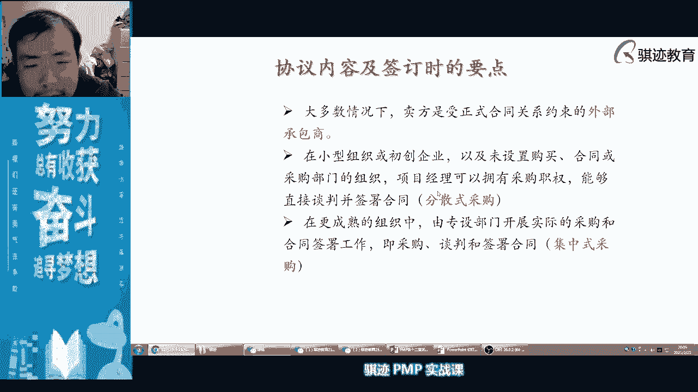

ok啊好，那么我们的采购当中呢会有这样一个特点啊，采购当中合同的生命证据当中会有投标人，中标人和供货人啊，投标人中国公货人去面对，那么投标人是个个来投标投标方，比如说，比如说我要招标采购什么。

我要采我要采购，我要采购什么啊，我不说我要采购1万吨汽油，那么投标人可能是谁啊，投标人可能是一个汽油的，一个汽油的啊，供应商啊，经销商经销商肯定若干个经销商，经销商a经销商比经销商c。

然后从a b c当中呢，选出了一家价格最好的品质最好的任务呢，然后他就中标了，比如说是b中标了，那么b中标之后，它是个经销商，他其实并不供货，他只是他只是中间进行销售的。

那么实际供货人呢可能就什么中石油，中石化对吧，还有中地沟油的，哈哈好开开玩笑啊，诸如此类啊，所以合同当中大家从这个例子当中，大家可以看到投标人啊，中标人往往是往往是投标人当中的一个，或者若干个。

也有的啊，然后最后供货呢是实际的生产商去供货的，所以在合同之际当中，卖方是会有变化的啊，这要注意有些合同呢他因为标的很大，比如我建个大工程，做几百亿的大工程，可能没有一家呃。

呃那投标投标人呢能够有实力全都做得下来，那怎么办呢，他们会进行联合投标，联合投票投完之后呢，然后呢，那么他们会分别向你进行供货，有可能甚至他由他们的供应商向进行供货啊，会有这样的情况。

那么在这种情况下呢，我们的我们的投标人，中标人和供应商呢也会发生一些变化啊，所以要注意，所以很多时候投标人中标人，供应商有可能三个都不是一个人啊，都是很正常。

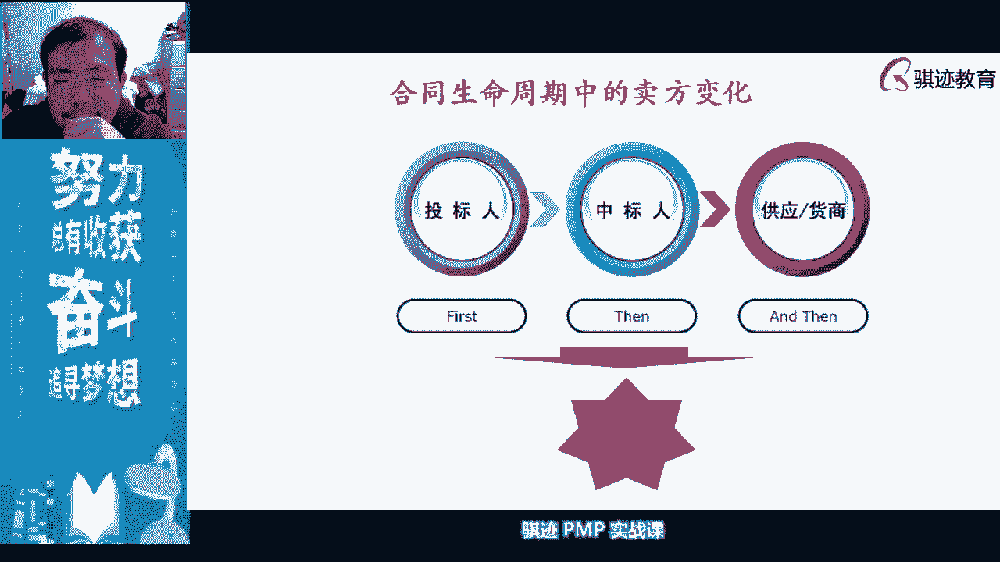

啊，那么采购管理当中有哪些新兴趋势，和我们的新实践呢，我们会使用b i m啊，商业管理，商业管理软件啊，会使用合同风险管理，那么在一些大的企业当中呢，我们会有法务部门进行合同风险管理啊。

所以大家有时候做过项目采购会发现什么，有时候麻烦的不是什么招投标，麻烦的是什么，是法务审核啊，什么法务会踢过来踢过去，把合同改过来改过去啊，然后这样特别的麻烦啊，联合投标不是围标啊，这位这位叫赵啊。

赵锦标的同学啊，也老熟练了，联合投标不是尾标，就是有一个工程，比如很大，比如说这是我们要做一个我们要招投标，招招标招一个什么建设一个，这是一个工业园区，那么这个工业园区里面它有土建，有基建对吧。

有电力建设对吧，有绿化建设对吧，还有什么呃一些其他的服务建设，网络建设等等建设，没有一家供应商可以做所有的建设工作，所以他呢会什么啊，然后我们组成一个投标题，然后中标了之后呢。

根据我们事先商定好的每一部分，有这个投标底的那一部分的供应商来做啊，会有这样，所以联合投标并不是围标啊，注意联合投标他们算一家实体，但它是它会告诉你，我们是有几家绑在一起的，我们通过我们绑在一起呢。

能够提高投标中标的能力和提供更好的服务，会有这样的情况，那是另外一种形式，这个这个呃投标的人呢，他实际上不生产任何东西，他是专门做什么做管理或者是什么做我的，有时候就是做相当于做阿道贩子。

它不实际生产这个东西，或者它是一个母公司，它下面有很多子公司，他中了标，他是专门来投票，他的资质很好，然后呢他的管理比较不错，或者规模很大，不容易赖账，信誉好，所以他一般中标了之后呢。

他会把他中的标拆成很多分标，然后分出去给他认为适合的供应商，再去进行什么执行这个标题，然后呢在这种情况下呢，它不生产任何东西啊，他不生产任何东西或者不创造任何东西，但是如果你有对这个标。

这个招投标当中有任何问题，为什么你只要找他啊，不用找他背后的供应商就可以了啊，为什么要采购，就是因为有些东西我们内部不能生产，或者我们内部生产没有外部采购来的核算，或者是说达不到一定要求。

比如外部外部采购更快或者质量更好，所以我们还采用外部采购，明白了吗，是不同不同性质的东西啊，什么叫陪标啊，陪标就很简单了吗，啊这里我相信我们的直播间里肯定有很多是啊，我们当然当然我们是圈子里自己细说啊。

然后让投标狗对吧啊啊当当然，这是我们特招投标人苦苦逼的，招投标人自自嘲的啊，叫投标狗，这是什么呢，就是说因为招投标法，中国的招投标法，很多国家交通法规定必须有三家以上去竞标，一定金额以上。

必须三家以上金额竞标，但是呢你和你你和比如说甲方关系好，但是呢形势要走，那怎么办呢，但是不会跟你抢的供应商呢，一起进行什么招投标，那么那两家呢，其实这故意投出一个比你差一点点标，让你来中。

这个叫叫叫做什么叫做为标啊，或者叫陪标啊，啊不是两家只有一家有金叉，是什么，只有一家会中，但是那两家是过来赔的啊，啊这个就说的就多了啊，当然你们愿意听听，最苦逼的是什么，最苦逼的不是陪标的。

最苦逼的是中标的那个，因为中标的那个呢做招投标的人，一家人可能要做三家的标书，知道吧啊很惨，男知道吧，所以做招投标最惨的不是写你自己的标识，你知道吧，你要做两三家甚至更多的标书哈。

ok啊这个给大家科普一下东西就知道，ok然后我们讲信息事件当中，还有公认的标准合同对吧，前面讲的购房合同就是标准合同，然后呢使用物流供应商，本地供应商，然后呢使用网络改善通啊，改善沟通啊。

用网络网络沟通的方式进行招投标啊，然后呢还有什么适用采购啊，这是一个现在很多真的什么叫适用采购呢，有一些甲方他一旦选择这个供应商，他会长期依赖这个供应商，给他某一方面经营供货。

所以如果这个供应商有潜在的问题，会得到造成长期影响，那么怎么办呢，它虽然可以中国招投标，可以可以知道这个工程的水平，但是我仅仅是一个演示，对不对，所以很多时候很多的甲方，他会采取适用采购方式。

就是一是选取一定期限，小批量的选取不同的乙方进行供货，然后通过试用采购的方式，从这些乙方当中选取他认为最符合他诉求的，或者是他认为最靠谱的，然后进行长期合作，这种叫做适用采购，所以比起招投标来。

产品品质啊等等一些列东西啊，还有一些东西呢可能不在产品上体现，比如说它的稳定供货能力，它的响服务响应能力啊，它的发生变故的应急能力对吧，比如说前啊，前两天不是说那个日本又地震了对吧。

日本地震很多电子零部件供应不到了，那么怎么办呢，就看你供应商的供应商的供货能力的对吧，这也是一种，啊所以啊这是我们在采购当中的信息趋势，ok啊然后呢招投标这个东西呢，我们pp讲的比较简单啊。

如果大家有兴趣的话，大家可以来学我们奇迹的软考，软考当中是有我们的招投标的啊，那位招都不会讲的更高，相对会更细一点点啊，啊再打一个小广告好。

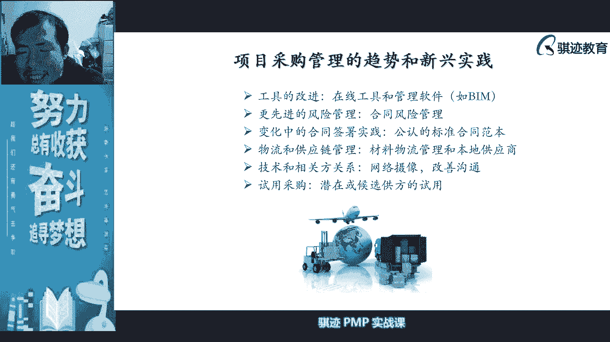

我们开始进入啊，进入后面的课程，那么招投标当中呢，我们一般会分为这样四个阶段啊，第四个阶段不一定有啊，是的投标招投标先先来讲那些投标，投标之后呢，我们选定选定选定买方就中标，中标了以后呢。

我们还给买方了，签合同，签完合同了，但是招招标中标和合同签签署合同是一定的啊。

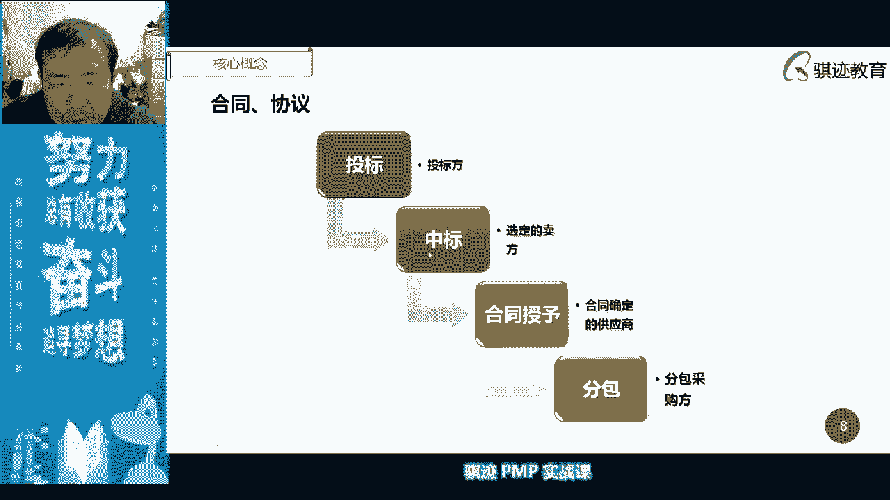

啊这是采购的经典步骤，大家可以看一下啊，首先作为甲方，所以作为甲方啊，这里注意啊，大部分情况下是作为甲方，你要写s o w啊，看到s o w大家想到什么东西没有啊，我们偏僻，一边讲。

s o w出现在哪个知识领域的哪个子过程啊，请在公屏上告诉我啊，这里来了啊，这是一个帮助你们理解的一个进阶知识啊，稍微进阶一点点的知识，当然也不是很理解啊，请在公屏告诉我，我们在之前学过的知识当中。

工作说明书，scope of work是出现在哪里的，是不是现在哪个知识领域的哪个子过程了，定义范围啊，非常好，非常好诶啊啊范陪同同学，你这个我们是讲的是范围啊，你怎么会扯到成本啊。

还有领满这个同学怎么会扯到资源的啊，你们这个就有点夸张了啊，啊那个雷超翔同学说的是对的啊，在定义范围当中，我们输出了soo w，那么这个的工作说明书和采购的过程说明书，是什么关系啊。

这是我要讲的验收标准，ok你们这个你们这个有点难，项目项目范围说明书啊，ok啊，那么我们讲我们p p课程当中，第一次出现是项目范围说明书，是在范围管理的知识领域当中的定义范围对吧。

收集需求定义范围记得吧，收集需求定义范围，然后制定w bs对吧，然后确认范围，然后进监控范围，记得吧，啊是不是前面课都忘记了啊啊啊，那么定义范围当中，我们制作了sw和这个sw有什么关系呢。

首先一点我们在做定义范围的时候，其实我们拿到的是什么，是拿到的是甲方给我们的项目需求，然后我们只根据甲方的需求制作出了整个项目，我们针对我们在做作为乙方角色，是作为整个项目的项目范围对吧。

然后制定出了一个sow，这个sow是项目的总sow，那么这个项目的总s单位里边肯定会很多，大部分情况下，会有一部分工作是你自己做不了的，或者你自己做不合算的，你会把这个这份工作的挖出来啊，挖出来。

间接或者直接挖出来，有一份工资你是直接可以做，但是你需要采购一些材料，或者采购一些资源才能做，这个时候你会把这些自己不能提供的，或者自己做不了不合算的挖出来，然后就扔给你的乙方。

当你需把这些东西扔挖出来，扔给你的乙方的时候，那么这部分东西就叫做采购工作说明书，听明白了没有好，所以采购工作说明书，是整个项目的s o w里面的一部分，你可以认为它是一个子集。

你会认为它是一个子集啊子鸡，所以一个项目我们在我们在项目范围管理上，好像提到过，就是说一个项目在做项项目定义的，我们会设计一个东西叫自制外购对吧，我们在采购里面就是这是自己生产的，进行采购啊，进行采购。

当然不是可能一个标，如果你项目比较大，你要采购的东西比较多，你可能会分好多标，可能把一个需要外购的s o w总范围，切成若干个合同进行招标都有可能的啊，好，这是采购工作说明书和我们的项目工作说明书。

都是sow的关系啊，采购工作说明书是项目工作说明书的子集，听懂了没有啊，ok啊，明白了，好那么这就是他们的关系，那么为什么说这个关系呢，是因为当你需要进行s o w的编写的时，候。

你采购的时候一般是由甲方编写的啊，那么这个时候就来了，老师，你为什么说在向范围管理时，说制定sw是乙方写的呢，是因为我们是乙方，对甲方不写，默认我们就乙方写，其实在实很多实践过程中。

如果你去采购一样东西，你写s o w，你作为甲方写s w要比乙方写s o w好，为什么你甲方写的sr w，能够最清楚的划清这个采购的边界，这个采购边界告诉你的乙方，你需要买什么东西，如果让你的乙方来写。

你告诉他你的需求，那么这个边界就会由乙方来控制，那么乙方会有更多的主动权，他会尽可能的把这个边界化成对乙方有利，他容易干，而且能挣钱的，他一般都会这么顶啊，所以如果你是一个有经验有能力的，甲方。

一般会自己去编写soo w，作为合同采购的这个采购标的的，很重要的一个评判部分，然后进行采购啊，当然如果你是一个，对这个采购领域没有经验的啊，乙方啊甲方，那么你只会提出一个需求，然后呢扔给乙方去做啊。

扔个乙方去写，让他们去写s o w反馈给你，去确认这是不是我需要的啊，明白这个关系吧，我讲的应该比较清楚的啊，那么接下来呢我们进行高层次的成本估算，预算估算对吧，这个成本和这个预算。

是从你的甲方给你的总预算里面，挖出来的部分对吧，甲方比如说要买1000万的啊，要做这个1000万的项目，你可能有300万是外面采购的，那么你要从这1000里面挖出300万，从外面去买对吧。

诶给甲方写示范围蔓延啊，也不算吧，毕竟甲方爸爸对吧，这个其实不算啊，这个属于双方皆可写，双方皆可，但是甲方写会更好，因为甲方血会更清楚，但是有一样东西肯定是乙方写的啊，说到这里就要记住一点。

有一样东西肯定是乙方写，w bs肯定是乙方写的，记住不要问我为什么问，肯定是乙方比甲方清楚啊对吧，这个时候你甲方出来做，是不是画蛇添足嘛对吧，啊啊然后第三部是发布招标广告进行招标。

然后确定合格卖方的短名单啊，第四步，什么叫合格卖方的短名单呢，就是入围名单，入围名单啊，招标入围名单，这时候招标文件呢你会有一个f i f p，f f q和f p啊，然后由卖方提交建议书。

那叫我们一般叫做fp的revise，revise叫做采购啊，招招标建议书，采购招标建议书，然后对建议书呢展开评估，然后再进行最终的评估，选出中标的哪一家中标了，然后签合同啊。

差不多采购就是这样一个过程啊，ok好，我无期同学啊，你重复了我的话对吧，ok啊，但是说的是非常对的啊，没有问题。

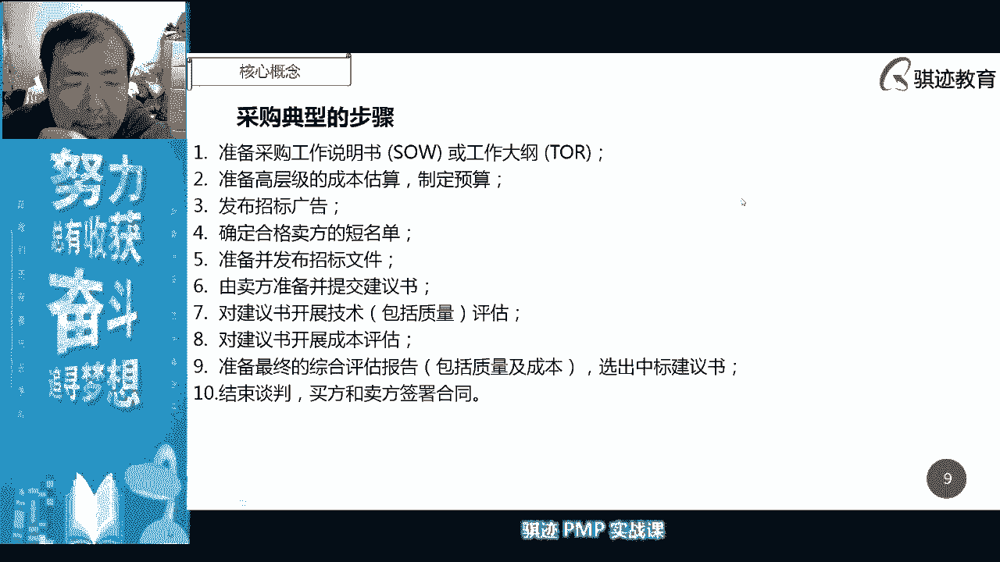

ok好我们继续讲啊，继续看，那么采购过程当中呢，我们新兴趋势这些东西前面已经讲过了对吧，啊是啊。

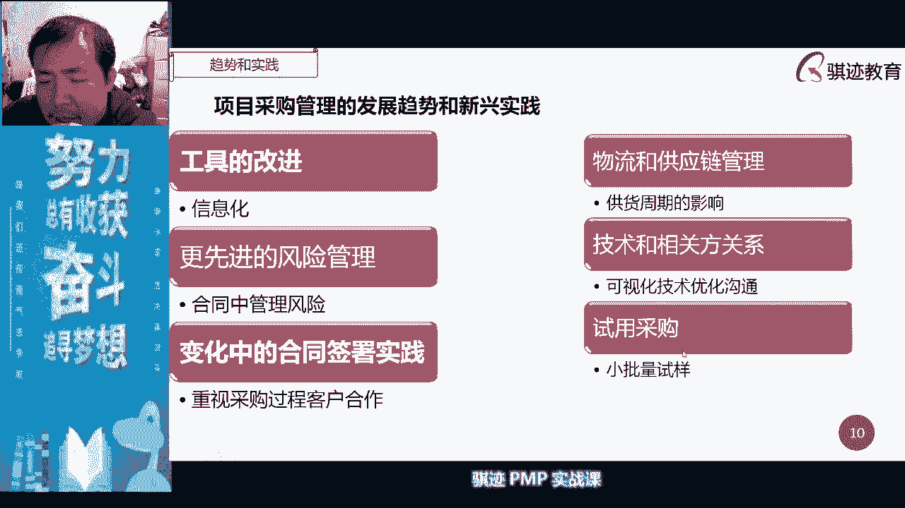

试用采购也讲过了啊，那么好，那么采购的子过程是比较简单的，就规划实施和和控制啊，但是采购当中的规划呢，要比我们其他的规划过程组呢啊要复杂一点啊，里面做的工作要多一点啊，实施的过程更丰富一点啊。

所以它的过程组很少，但是内容其实还是蛮多的啊。

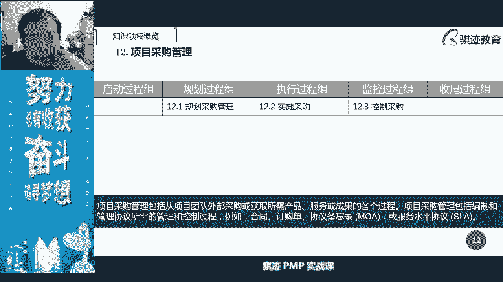

那么首先规划采购啊，规划采购当中呢，我们可以看啊，我们会输出什么东西啊，我们会输出我们的采购管理计划，自制外部决策，为什么这个东西要采购对吧，为什么小法采购不是自己做啊，然后呢会输出采购文档，采购招标。

采购工作说明书对吧，soo w采购招标文件啊，ok啊，我们后面会一一说这些东西都有啥用处，啊，还有其实这中间还有什么，还有采购策略，还有采购策略啊。

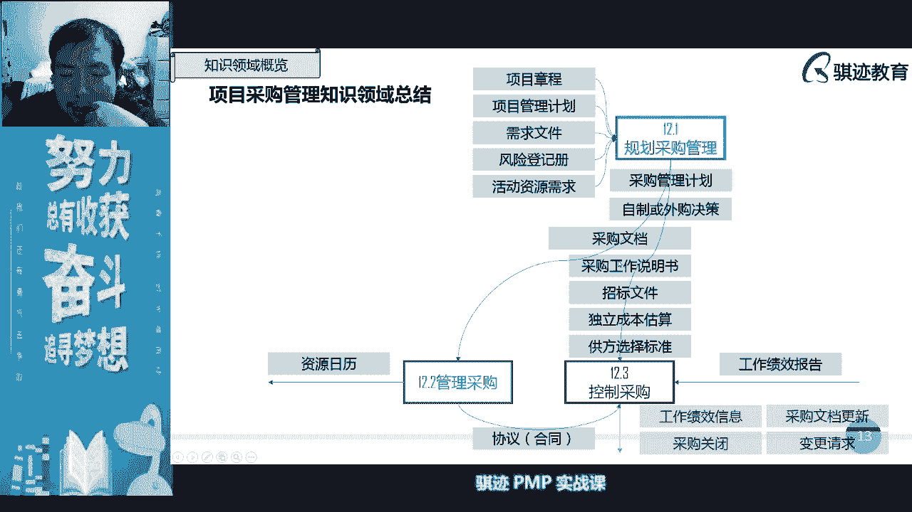

没有写到，还有采购策略，好那么规划采购。

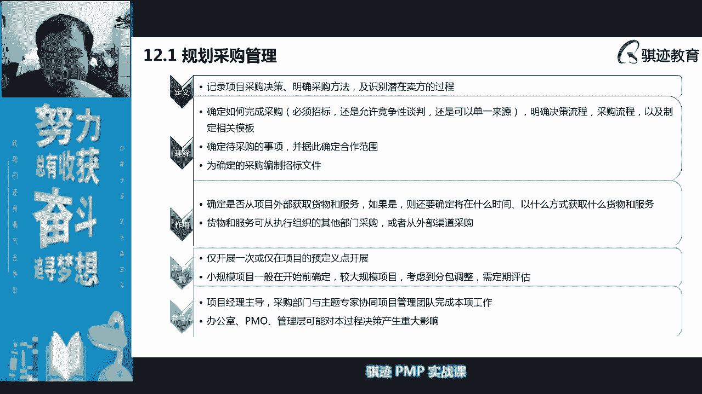

规划采购是在采购决定采购之前，我们做了一些准备工作啊，啊准备工作。

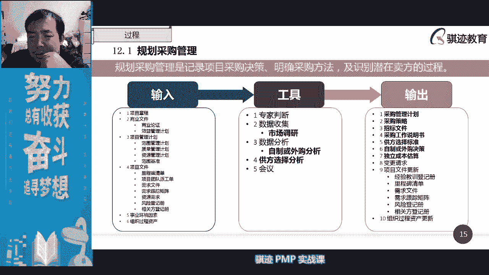

那么准备工作首先我们要做采购，那么首先我们要进行市场调查，我们要调查考察行业情况，具体的买方能力啊，权衡利弊啊。

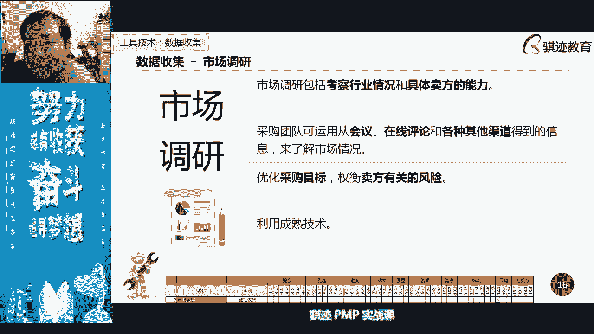

优化采购目标对吧，这个呢就不用说市场调研啊，记住啊，采购当中会有市场调研对吧。

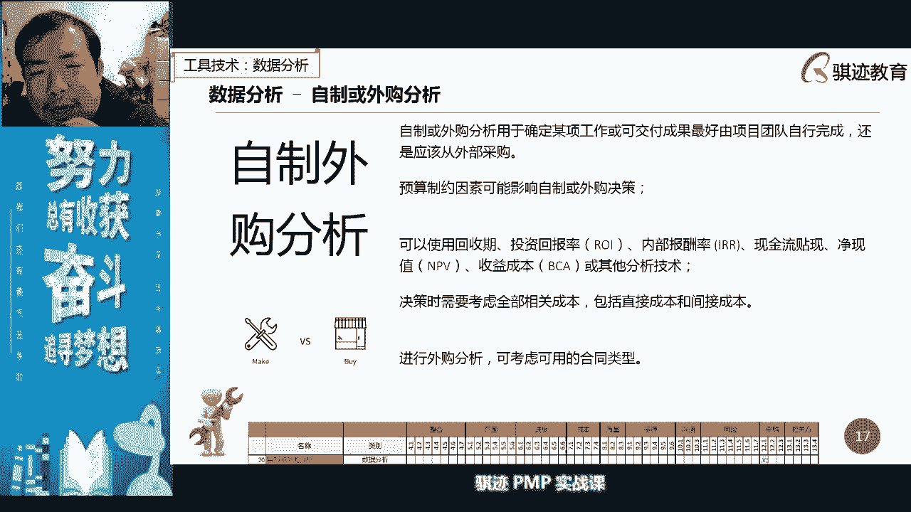

那么采购呢就相当于什么，你每天买菜对吧，你要去市场调研，在菜场里买菜转一圈是吧啊，我妈买菜啊，我我妈买菜就喜欢在菜场里逛一圈啊，那么经过市场调研，他经过常年的市场调研，告诉我一个结论啊。

一般来说去菜场买菜都是菜摊子，越靠菜场里边的越便宜啊，越靠门口的越贵，为什么菜摊子越靠门口的租金就越贵啊，所以他卖的菜就越贵一点，菜摊子越靠里边的租金越便宜啊，它的他的那个叫什么嗯，菜就容易越便宜。

同样的菜，同样的菜啊啊说说一个题外话啊懂吗，然后呢还有是什么上吊盐，就是还是以买菜举例，什么时候买菜最便宜，知道吧，早上九点半到十点以后啊，是一天当中最便宜的啊，然后早上七点钟之前也是最呃。

七点到七点半之前也是最便宜的，那么早上七八点的时候，为什么早上七八点是那些工作很忙的人啊，早上买完菜要直接做完后，直接要去上班的那些人，所以早上在七点半到九呃，呃九点半这段时间呢是相对不便宜的。

然后还有一段时间什么便宜啊，下午五点之前到中午到下午五点之前，这段时间大家都在工作，只有大爷大妈那才叫买菜啊，如果你不卖的便宜一点，大爷大妈是不会让你不会上你当的，一天当中卖菜买菜最贵的是什么时候啊。

就是你们下班的时候啊，所以所以不要介意你们的，你们的眼中的菜价，和大爷大妈眼中的菜价是两回事情，这就是市场调研啊，这个不是我说的，是这是这是我妈告诉我的啊。

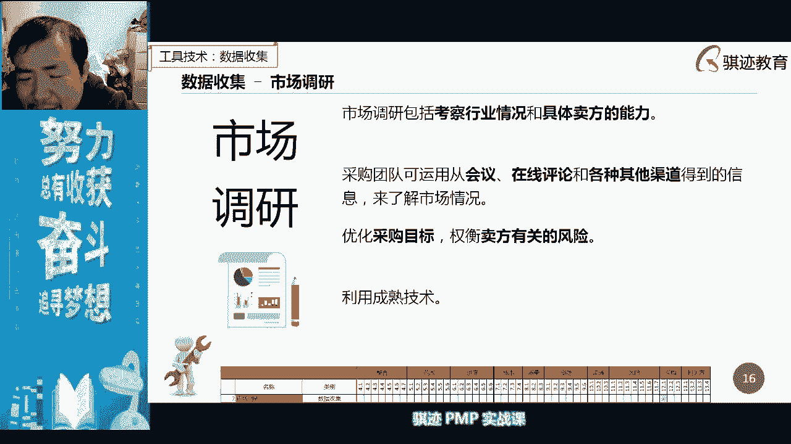

我也不怎么去菜场买菜啊，我也懒啊，那么第二个叫做自制外购分析对吧，自制外部分析说了啊，就是说我们在进行项目启动的时候，这个时候就像记得吧，我们看到我们在学的第一章的时候记得吧，我们一个项目当中。

我们讲项目的商业分析对吧，有什么i o i i i m p b b c a对吧，这些是不是都一样啊，你作为一个甲方，其实你在要进行采购的时候，你也要做分析分析什么啊，这个东西自己做好还是外面做好。

自己做的哪些力，外面要做些哪些哪些力啊，自己作用哪些b，外面做的哪些b啊，利弊权衡利弊，考虑成本啊，这是自制外购分析的一个重要方面，还有一个呢是考虑时间，是可能你自己来不及做，啊。

有同学问总价成本补偿和工料合同有什么区别，你不要急啊，五奇同学，你跳的太快了，等会儿听了你啊，欲仙欲死啊，不要急啊，这个东西会有点搞脑子的啊。

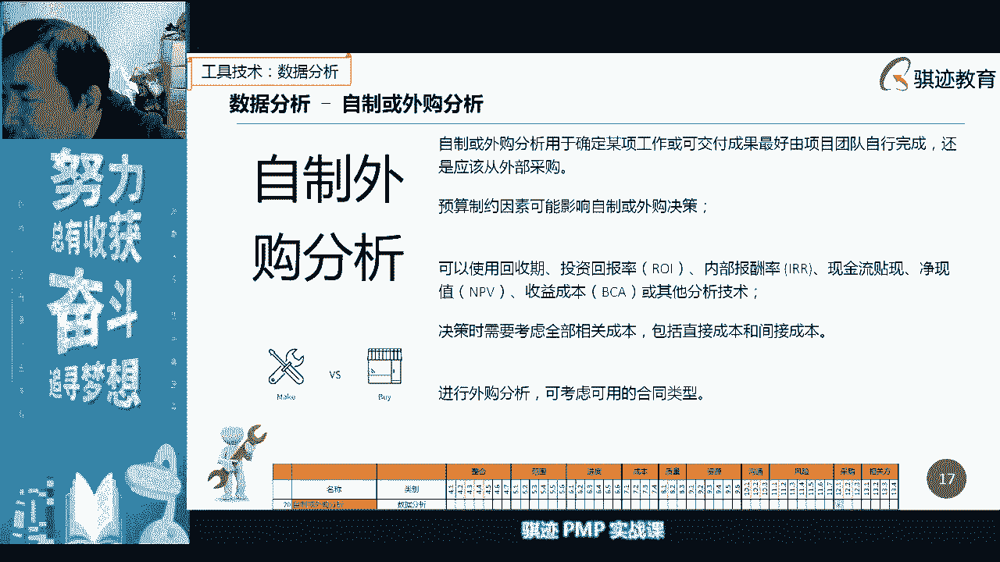

会有一点点搞脑子的啊。

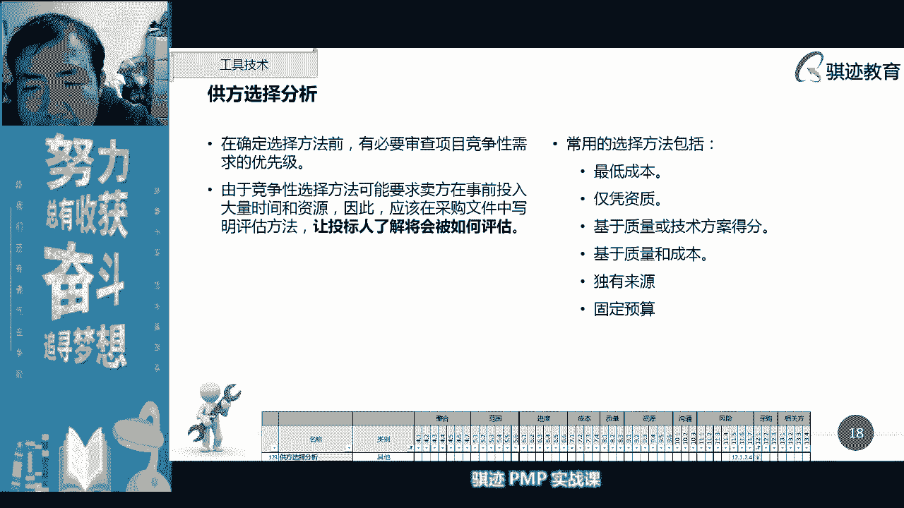

我们讲，所以采购当中我们相聚吧，进行市场调研。

自制外购分析，然后决定什么决定是否进行采购，然后呢采购当中呢我们还要进行采购，又进行攻方选择分析，我们在选择怎么样的能够入围，我们最后投标的供应商，因为你不可能放开阿猫阿狗都来投标。

你肯定要设置一定门槛对吧，我们一般会采取各种各样的工况选择标准，比如说什么最低成本对吧，凭凭资质，凭质量评方案，独有来源，固定固定预算等等方案啊，他就这样的方式，那么这个方式呢。

应该在采购文件当中写明啊，应该在采购文中写明，为什么我们要告诉我们，要明确的告诉所有潜在的卖方，我们是基于这个目的进行采购的，以便卖方金戈占据我的目的，在最优化他们的投标方案。

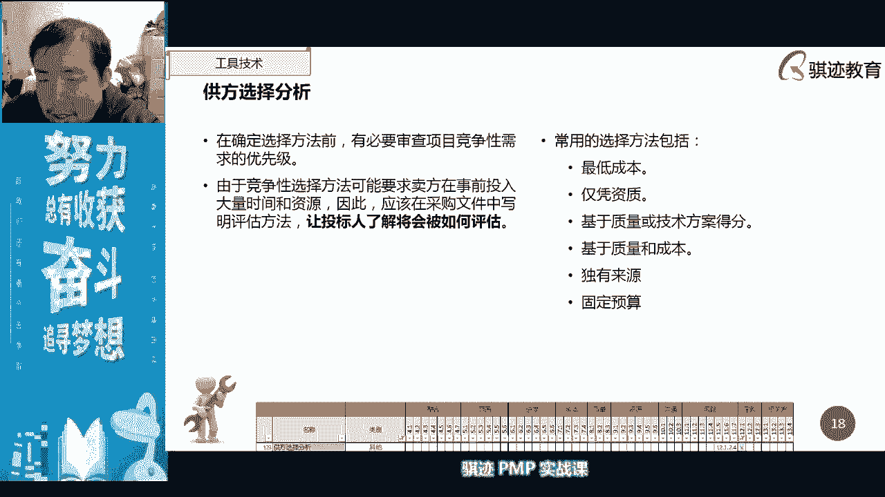

明白了吧啊好，那么来了，我们的采购当中呢会有三种合同，three kinds of contract啊，老师开始看英文对吧，the first kind of is the fixed price。

the signpost rebengeable contract，有三种合同，一叫宠价。

一定叫成本，应该叫公量，那么从字面上看，注意啊，从字面上看。

这个增三个什么意思呢，总价合同指的是什么，是有天花板的，所以任何的总价合同它会有一个天花板，叫做最高限价，控标控标啊，那么好，ok ok啊，你们这个说这个太专业，对空标是对的啊，就是控制住这个标对吧。

就作为甲方角色的我们对吧，好，我们回顾了总价合同，总价合同是指的什么，它有最高限价的，注意总价合同里都有最高限价，成本补偿呢是依据于成本，所以从这两个描述角度看，哪种合同对于对于作为甲方的你。

会会更有主动权，啊成总价合同全部不行，合同这两种合同对于作为甲方的你，哪一种更有主动权，ok啊陈铭同学说跟我们班的不一样，对的我做过一定的修改，做过一定的补充扩展啊，没问题啊。

ok那么请根据我的ppt来，没关系，我的ppt会讲的更细一点，但你们那用的材料纸质材料也是可以的啊，只不过讲的没有那么细，我又补充了一下啊，好成本补偿啊，一看林满洲和文佳这两位同学，就是没有搞过采购的。

对吧啊，你哪一种更有主动权啊，当然是总价合同，因为总价合同有天花板啊，知道吧，所以一般来说，如果我们迫不得已要和乙方签署成本补偿合同，往往意味着啊甲啊解放前，你往往意味着你的供应商。

相对于你处于更优势的更强势的地位啊，在整个合同的买卖当中处于更强，一般来说如果甲方处于更强势的地位，他尽可能的都会选择总价合同啊，总价合同除非一些特殊情况，那么什么情况呢，成本很难估算。

项目不确定范围也不确定，当不确定程度很高的时候呢，我们就会签署第三种合同，叫做公告合同啊，工量合同，什么叫公量合同呢，就是他不没有明确的项目范围，它只签署一个根据时间。

根据使用材料进行单价计费的计费单价，然后呢边做边看做多少算多少，甲乙双方都有可能会在做了项目一段时间之后，进行结算并终止项目的可能性，那么这种采购呢往往是什么啊，往往是一种风险比较大，不确定性比较高。

或者是临时性比较强的合同啊，啊会使用工料合同啊，工料合同好，明白了吧，这是三种合同，那么考试当中总价和成本补偿类合同呢，都会有一道，都会有一种类型是会要计算的，分别叫做总价加激励和成本加激励啊。

但是他两边的计算方式我几乎完全一模一样，所以我只讲一种公告，合同呢不会让你计算，但是你要明确一点，公告合同一般都是运用在范围，不能很快确定，然后呢项目不确定很大，风险很高，只能确定一个单价。

但是不知道什么时候做完，这个时候呢，我们会根据时间和使用材料的情况，进行单价和加上数量的项目执行方式啊。

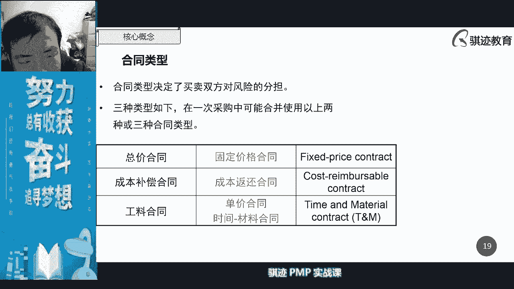

好那么我们先讲第一种总价合同，所谓的总价合同就是一个固定的总价，它有明确的定义，需求，明确的交付成果不会出现重大范围变更啊，那么总价合同，所以我们如果选择总价合同，对于甲方来说。

作为甲方的你来说要有什么要求啊，你对项目的范围要比较有把握，你对项目的范围内容比较有把握，并且在双方的价格博弈和合同的博弈当中，有较强的啊话语权，那么第一种大家是呃固定总价当f f p对吧啊。

英文物你可以不记啊，因为我们是中英文双语，你可以不用记，没关系，第一种叫做固定总价，固定总价呢是比较简单的，就是一口价对吧，一口价啊。

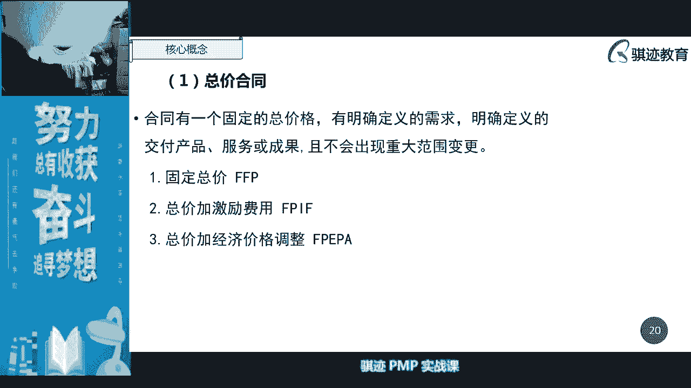

成本返还合同嗯啊这个不要急。

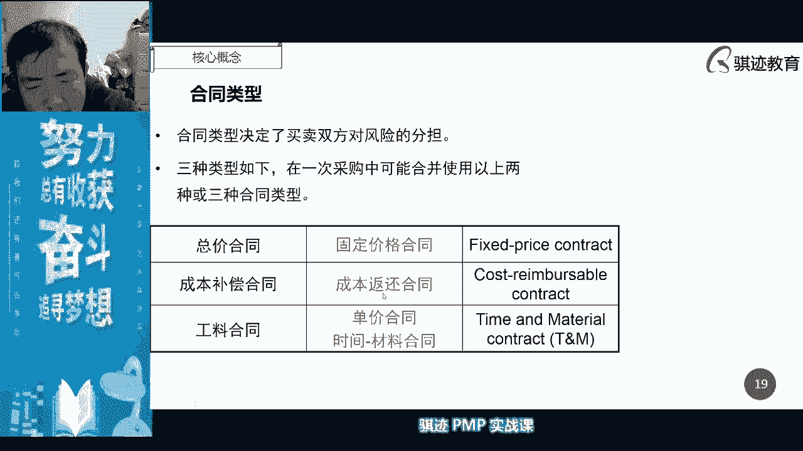

成本补偿合同不要急，等我涨到成本补偿再会再会说，不要急啊，王志佳同学不要急啊，我们会讲不要急，ok啊，那么呃总价合同呢，第一种呢叫固定合同价，我们叫一口价，这就是说说完了不溢价，那么这种合同一般是。

甲方对于项目范围内有很大确定把握，然后呢一般会只能会使用这东西啊，合同方式这种好处是什么呢，双方对于价格呢没有分歧啊，不会产生价格纠纷啊，那么在有一些情况当中，如果情环境情况比较多变。

但是甲方话语权比较强，那么甲方希望乙方在做的时候呢，希望乙方为甲方尽可能去节省成本，那么它就会使用第二种，我们会用计算的叫做总价加激励啊，注意来了。

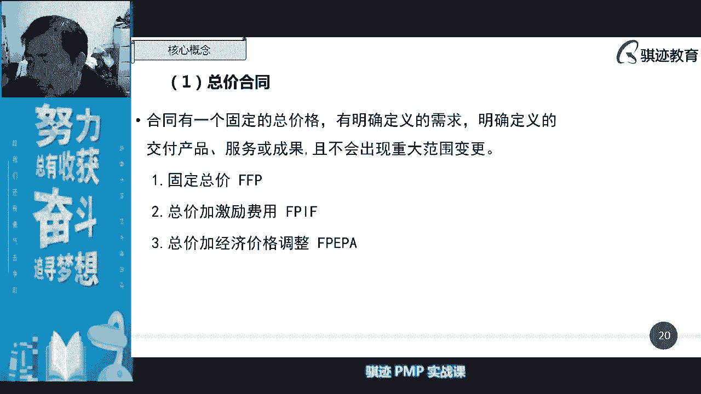

这是我们采购当中的唯一一个计算题啊，总价加基地，那么总价加基地呢是我们讲的是啊，允许有一定的偏差，允许有点灵活性，但是呢通过激励这种方式，将买卖双方的目标呢错的一致一致的去降低，用低成本去完成。

那么完成之后呢，我们可以什么啊，三七分二八分啊啊啊又又，然后这个又让我想到那个让子弹飞里吧，啊乡绅乡绅捐的，如数返还百姓卷的三七分账对吧，就这个意思啊，那么第三种是考试考概念，但是不考呢。

如果这个合同要做好几年，如果这个合同呢涉及到几个货币，涉及到外币对人民币和美元之间的货币兑换，涉及到涨价跌价的，那么我们会设定一个总价加经济调整啊，进行调整，那么他会采取一定的约束方式。

这些东西因素发生变化的时候，甲乙双方按照事先约定好的条款，对我们的总价价格呢进行一定的调整，以保证他的目的是什么啊，注意总价加上经济调整的目的，是以保证尽可能的让这个合同能够按约履行，而不是作废。

从签明白了吧，ok啊我们等会儿再继续讲这个东西，我都会举个例子，我们先把我们的第二种总价加激励啊，总价加激励这个合同讲一下怎么去计算啊，固定总价合同这个很简单啊，大家知道一口价就不要说了啊。

好这是一个总价加激励合同的计算方式，注意看啊，注意看这个计算方式，注意看他有四个要素啊，这里大家特别要注意跟着我的思路走啊，它有四个要素，第一个要素叫做最高限价，就叫做天花板最高限价，这个现在哪里来的。

是一般是请第三方的或是内部专业的，我们的审计部门财务本进行测算，认为这个项目的这项合同不无论怎么执行，不可能超过的一个价格啊，是合理合理的成本，但是上限极限啊是这个极限，第二个呢叫做评估成本。

评估成本呢你可以看作是什么啊，一般情况下它会按照什么样的成本去做完，一般情况下按照什么时候做完啊，那么第三个要素呢叫做酬金，就说只要你把活干完了，所以总价加几率和成本加激都是一样的，只要把活干完了。

我会给你一份固定的酬劳，叫做利润啊，叫做利润，这是第三个，第四个叫做分摊比率，注意了啊，分摊比率非考试的时候非常要注意啊，我在这里提醒你一下，这只有看视频，那叫分摊比例永远是什么，甲方在前，乙方在后。

比如说这里写的是八二，八二开的意思是什么，如果我们节省成本了，甲方拿80%，乙方拿20%，甲方也承担80%，乙方也承担20%，明白了，所以这个八二永远是甲在前，你在后，但是考试的时候呢。

有时候他题目会出的很快，他会把把甲方乙方的描述为，他说卖方和买方的分摊比率啊，卖他会叫卖方承担40%，买方承担60%，这时候你记得要把它倒过来，否则到时候计算就会算错啊，所以我们一般来说讲分摊比例。

一般都是写甲方在前，乙方在后啊，这是四个要素，最高限价成本酬金和分担比例，有了这四个要素之后，我们就可以计算总价加集体合同了啊，所以总价加集体合同，最后这个合同执行的金额是不定的，取决于乙方的完成情况。

就是供应商的完成情况啊，你作为甲方，你的最后的付款是取决于供应商完成情况，假设有一项有一项采购，我们预计呢一般情况下呢，花13万就可以做完了，最高呢我们觉得不会超过16万做完的，只要这个活干完呢。

我会付给你15000块钱的酬金，15000块钱，处境好了，有一个乙方接接单了，然后呢啊叮铃叮铃叮铃的，你的你的你的订单已经被某某快，某某骑手接了对吧，然后接单了，那么来了第一个简单的。

他以15万的成本做完了，我们本来预计是13万，做完了他15万做完了，是不是超了2万啊，别急啊，那么他做完了没有，做完了做完了，所以要给他酬金，完要给他，无论他有多少成本，做完了要给他酬金。

然后呢他总共要付给他多少，他因为成本要付给他，人家做完干完活的成本要付给人家，人家干完活之后的酬金要付给他，总共要付什么，150000+15000是165000对吧，总共付165000。

但是呢我们这个当中分摊八二什么意思啊，我原来预计是15万，13万做完的，你给我15万做完是不是超了2万，那么超了2万的情况下，我们根据八二开的约定原则，是不是要扣你4000块，这能算的过来吧。

两两万块钱的20%是多少，是4000块对吧，因为你超了2万，所以我要扣你4000块钱，你要承担20%，但是我承担80%更多了，所以我们原来要付给他16万啊，一个分呢165000。

但是呢要扣留他4000块钱的惩罚，那么最终要付给他多少161000啊，莫吉我们讲有一个最高限价，注意最高限价也是计算酬金的，我们讲任何情况下，这张合同我们最高只付16万，那么现在我们讲。

你最后算出来的金额是161000，对不起，你的1000块钱要抹零啊，1000块钱抹零，所以我最高只能付给你什么16万啊，10万，然后然后在这种情况下，乙方获利了多少啊，乙方获利了，因为乙方大家看到了啊。

本来应该拿到15000块钱酬金了，然后呢被罚了4000块钱对吧，然后呢又被抹零抹了1000块钱，最后他只赚到了1万块，在这种情况下，是不是乙方赚的少了，那么我们我们对他通过总价加激励的。

这样一个惩罚达措施，从而使他的吧得到惩罚，从而也保证了甲方呢一定的利益保证啊，ok那么这是第一种情况，所以注意啊，这是第一种情况，那么如果节省了呢，来第二种情况，乙方呢按照10万块钱的成本呢。

做完了10万酬金要付法要付的啊，要付的要1万块钱酬金，那么我既然那10万块钱做完了，相比13万的，我们的预期的心理成本是不是节约了3万，好，这个3万就是乡民捐的对吧，把乡绅的呃如数返回项目阶段呢。

我们八二分账对吧，相声分八对吧，1万块，3万块钱的八呢是什么，24000块钱，3万块钱呢就是6000块钱对吧，那么供应商额外获得了什么6000块钱的奖励啊，那么供应商最终拿到了多少钱啊。

拿到了10万块钱，加上15000块钱，拿到加到6000块钱，总共拿到了啊，121000块钱，12块钱块钱，超没超过最高限价16万，没有抄，没有抄就可以拿啊，那么供应商赚了多少钱啊。

因为供应商的实际成本给你付，垫付的成本，实际成本是10万块钱，那么他最终是赚了什么，21000，他原来的酬金是15000，因为给你节省了成本，他的赚的利润从15000变成了2万亿，他也赚到了。

那么你实际付出去的是121000，然后你心理预期那是13万，是不是你也省了9000块钱，你也省了，我也省了，you when i win，大家还有海边没海外or海外对吧好，这就是总价加激励，明白了好。

那么总价加基地讲完了可以秒懂成本加基地，为什么，成本加激励和总价加激励的方式是一模一样，唯一的区别是成本加激励没有最高限价，上面可以无限上去，明白了吧，所以你会看到成本加激励这样一种方式啊。

对对于甲方来说会更加的不安全，一点啊，风险更加大一点啊，风险更加大一点啊，可是这样，所以成本加利基地除了没有最高限价，其他的计算方式和总价加几率是一模一样的，明白了没有，ok啊。

如果明白了总价加击力的计算方式，和成本价低的计算方式，请在公屏上给我打一个明白，如果没有明白，还让我讲一遍呢，我们再讲一遍，哎有些人要再讲一遍，不明白，ok啊啊啊啊，来来来来，好好好好再来一次对吧。

再来一瓶对吧，ok啊那就再讲一遍啊，只讲一遍啊，因为我们时间也没有那么宽裕啊，好那么来总价加g和成本加基里，首先一点区别就是在于有没有一个最高限价啊，它的元素是四个，那么第一个是什么，有一个最高限价。

那么假设我们会有这样的情况，我要买一样东西啊，我们现在在更通俗的讲一遍，我们要买一样东西，我们心理预期是13万买到13万买到啊，比如说我们要买一部车，买一部车差不多13万差不多吧。

我们我们心理预期我们要买一部车，但是呢我们人比较懒对吧，我们找一家找一个人给我们代购一部车对吧，我们自己不买这部车呢，我们心理预期呢买到手13万，然后呢我们讲谁帮我把这部车买过来呢。

我给他15000块钱酬金，15000块钱酬金对吧啊，然后呢你给我，但是呢我希望什么，当然买到的东西越便宜越好了，那么这部车你如果在13万以下给我买到了呢，每省100块钱，我分你20块钱，分你20。

比如说你给我省了100块钱，我的分你20块钱，是这样的，这样的条款，但是我心理预期无论如何，我口袋里只有16万，我口袋里最高只有16万，总共就16万，如果超出16万部分，那我不付啊。

这就是总价加基地的总价总价限制啊，就这样好了，人家跑就跑过来两个小伙子，你说啊啊啊茶老师啊，来我我去给你买车，我去给你买车啊，小伙子a肯尼玛的屁颠屁颠回来了，乔老师，车，我给你买回来了啊，我一问多少钱。

15万嗯啊15万，你居然买了15万这么贵，ok可以，反正又买来了好，那么说啊，酬金是不是15000啊，15000啊，酬金给你，但是说我原来心理预期我告诉你啊，我的心理预期是13万对吧。

我要告诉你最高限价16万，你认不认啊，那么我现在你给15万给我买回来，是不是贵了2万块钱啊，对那么贵了2万块钱，我们讲是不是要惩罚，我们讲省100块钱，奖励你20块，贵100块钱罚20块。

那么现在我们超了2万块钱，是不是应该罚你4000块钱啊，是的，所以我本来应该付给你什么，一部车钱是15万，加上15000是165000，对不对，然后我罚你4000块钱，是不是要付你16万亿啊对啊。

但是我们讲161000，我只能付你10万，因为我兜里只有16万，我们说好最多把我兜里所有的钱都给你买一部，这部车我不会超过的，所以这11000块钱也要抹去抹去，然后这个小伙子呢很失望的走了对吧。

然后他给我p的，把车买来的呢挣了多少钱啊，只挣了1万块钱，为什么他本来能够达到15000块钱的酬金，对吧，但是被罚了4000块钱对吧，然后呢在付款的时候又被我磨，因为超过了最高限价。

又被我抹掉了1000块钱，最后他是不是只挣到了1000块，然后小伙子b来了，插到赛，我给你买了一部车，只要10万块啊，大好心理大远对吧，我心里成本是13万，你给我买了10万块钱称啊，很好。

那么我发给你的酬金啊，给不给给你啊，奖金先给你啊，我们说好了，活干完了，10015000块钱酬金给你，那么分摊比例也一样，我们说省1万块，省100块钱，分你20，现在省了3万块钱。

是不是要分你6000块钱对吧，中国人这个数据还能互动过来的啊，所以我还额外再奖励你6000块钱啊，那么我总共应该付给你多少啊，1万块钱的车钱啊，10万块钱的车钱加上15000块钱的酬金，加上6万块。

6000块钱的奖励，总共付你121000对吧，然后呢你帮我付给他12万亿，然后呢他走掉了，然后他们帮我买这部车呢花了10万块钱，然后呢给我省了啊，省的钱拿到了奖励了6000块钱。

然后呢这样筹进15000，他最终赚了啥，2万亿，这样一个过程，就是我们讲成本加激励的两种情况是，无论是超过了估算成本还是低于的估算成本，是不是都有办法去计算，对吧好，这就是总价加激励的计算方式。

成本加激励，只不过最后没有那个最高限价而已，成本加低的情况下，我的兜里的钱是无限的，你就这么认为就行好吧，你懂了懂了懂了吧，懂了啊，好等会我们继续往下讲啊，老师已经讲的非常的通俗了，对吧啊。

正好我最近要买车啊，真的想买车啊，可以啊，好那么这是总价类的合同的一个计算的。

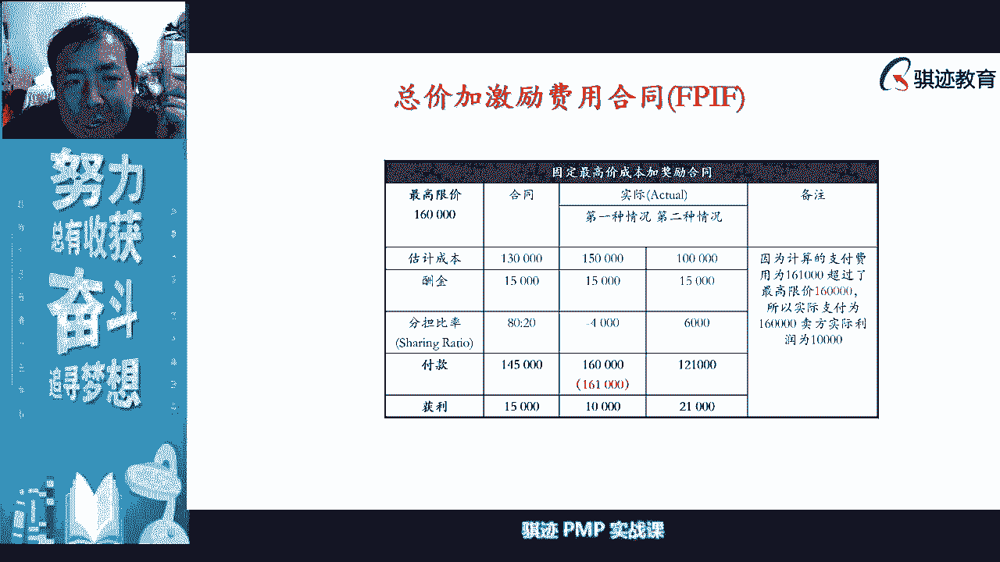

叫总价加激励，总价的最后一种叫总价加经济调整，是什么意思啊，那我给你举个例子啊，我以前有个同学正式上完课以后问我啊，老师老师我们他这两天又来了，最近又来了啊，最近那个大家知道吧，那个家电电器狂涨。

知道吧，长期供货合同不适合总价适合的呀，长见呢，你听我说啊，这个就真的是适合的呀，啊那听我说你有一个同学说，老师老师我们是做家电电器的啊，最近家电器是不是膨胀，那么为什么要涨，是因为最近有色金属铜啊。

铝啊都涨得很厉害，因为美元跌了嘛，所以很多童话旅游都是按照美元计价进口的嘛，它的原材料进口最终都都体现在消费者，所以第二天天气又涨价了好那么在这种情况下，老师那个那个同学说。

正好当年的时候他也是那个时候，周期也是在有色金属涨的时候，老师老师，我们现在是什么，我们更遇到一个情况，就是说他是做家电进器里面采购那一部分的啊，然后呢他们跟那原材料供应商，比如卖钢铁的，卖铜的。

卖铝单的一些供应商呢，经销商签订合同，因为他这种大众商品呢，都是跟经销商签合同的啊，不是跟厂家直接签的，我们跟经销商签合同，但是经商，但是经销商呢最近价格涨的很厉害，我们合同签了之后。

估计我们是按照总价合同签的，然后呢经销商一看，那价格涨那么高，不愿意卖给我们了，撕毁合同，他宁可赔我们点钱嗯，那么有些同学想啊，赔点钱就赔点钱，不是赚到了吗，但是人很多的时候，企业你赔这点钱是没用的。

很多企业如果原材料停了，整个生产线就停了，生产线一停就会产品卖不出去，你就要违约，要赔钱，工人就发不出工资，会产生一系列恶劣反应，所以有时候呢生产厂家也不是不说，不能够接受涨价，那时他问我老师。

你怎么这个怎么办啊，那我说很简单，那你就用你学过的p m p知识去做，你可以使用总价加经济调整，你和供应商说啊，我们知道，因为大宗商品的特点就是价格波动比较大，那么你在和供应商签合同的时候。

我们我们签一个总价加经济调整合同，怎么怎么签呢，首先我们固定一个总价对吧，然后呢我们约定在这个产品交付的旅行期间，如果价格发生了波动，比如价格上涨了，价格涨了，你原来相当于你的签合同时候。

买的价格就便宜了，是不是啊，这时候经销商是不是不愿意卖给你啊，那么你可以说我们可以根据价，市场价格涨的幅度，我们在最后履行的合同的时候呢，以调整一部分，调高一部分买家买价。

但是你经销商也要承担一部分买家对吧，那么因为机会是相等的嘛，万一跌下来的呢，我们讲也要相应的调低一点，然后呢，接下来的呢就是我们啊啊，家电生产商的吃点亏啊，买鱼买的原价要高一点，那么涨上去了呢。

你们经销商吃点会高点，但是相互之间呢大家都均摊，然后呢我们设定一个比较高的惩罚措施，惩罚措施，然后呢双方呢在这个条款上呢，我们建立一个长期合同，这样的情况下呢，双方更愿意依据于老合同进行执行。

因为有价格调整条款，我们可以根据随行就市进行价格调整，这种调整情况下，大家更愿意进行长期合作，从而保证了生产商的啊，生产原材料不至于中断，也保证了供应商不至于什么赔的血本无归对吧，所以这样一种情况。

所以我说就很建议你们进行总价加经济调整，合同调整，通过合同管理保护双方的利益啊，保护双方建立起长期合作关系，ok现在明白了吧，总价加经济调整的作用啊，这是一例一例，还有很多，比如说有些公司。

比如说啊航空公司买飞机，大家知道航空公司买飞机都是什么，航空公司买飞机的时候呢，飞机都是贷款买的，抵押贷款买的啊，航空公司除了啊还没听懂嗯，能不能我给你举个例子哈，比如说比如说我们说钢铁嗯。

让我想想看啊，啊比如说螺纹钢，比如说螺纹钢现在不着急啊，比如5000块1。1吨螺纹钢，比如说我们的我们的啊不热全版，比如说我们需要热卷板，热卷版，比如说呃6000块钱1吨，比如说我们需要生产需要螺纹。

生产家电需要螺纹钢6000块钱1吨，那么我们跟经销商签订的合同是6000块对吧，然后呢，但是呢我们需要供货是在1年当中分12个月，每个月向我们供货工一批工一批工一批的对吧，然后约定好是6000块1吨。

那么在市场发生波动的时候，如果价格跌下来，我们原来买买买入价格是6000，然后呢价格跌跌到5000，经销商是不是很愿意卖给我啊，对啊，市场价市场价格已经跌到5000了，我卖给你6000。

我当然愿意去执行合同对吧，但是如果市场价格涨到7000 8000，你原来合同是6000，经销商是不是吃亏了，那么他如果觉得他不想吃，为什么他宁可撕毁合同，赔偿了违约金，是不是啊，那么在这种情况。

有人说老师把违约金调高不就行了吗，那么你调高违约金之后，人家是不是就不敢跟你签这个合同了对吧，那么怎么办呢，我们设置一个叫总价加经济，怎么经济条件，比如说市场价格，比如涨到我们原来签订价格是6000。

如果规定市场价格，比如涨到7000，那么你卖给我的价格可以从6000调整到，比如说6500 6700，你比市场价格略低的价格可以卖给我，但是这个价格平均价格呢，要大家有一定的计算方式进行经济调整。

要一个平均价格的方式进行调整，那么这样情况下呢，经销商少赚一点，你呢啊也承担经销商涨价那一部分涨价一点，双方呢就有可能继续执行这个合同，从而保证生产经营呢能够稳定啊。

