# PMP认证考试课程最新完整免费课程零基础一次通过项目管理PMP考试 - P48：PMBOk第七版 第五章 开发方法和生命周期绩效域-1 - 骐迹PMP - BV1Sb4y1f7Yt

很好。

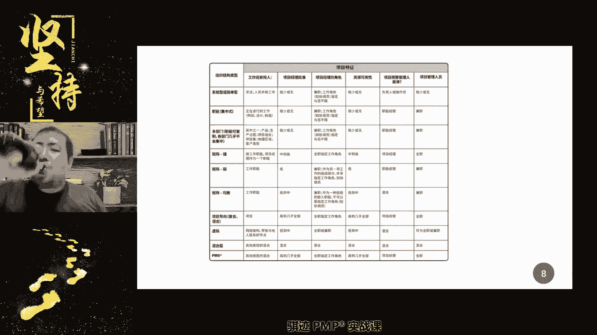

好我们开始今天的课程好，那么今天上课之前呢，先给大家补一样的东西啊，那相应的PPT我到时候会啊，发到群里发给大家，今天这部分是原来偏播客的第二章，为了上课狂飙一路点赞啊，哈哈是拼搏后的第二章。

然后拼搏过的，原来的第六版的，第二章呢是有讲组织结构理论的，然后呢在PO的第七版当中呢，这部分去掉了，但是根据上周末，就是说你们的前辈考的5月份的考试来看，还是会考组织结构，比如说我们后面讲的矩阵型啊。

职能型啊，和职能型和项目型这些矩阵，组织矩阵的组织结构，所以为了稳妥起见，就是你们用的第七版教材，第七版教材里面已经没有组织结构，这个特别的说明了，但是为了稳妥起见，万一你们考试遇到了啊。

万一你们考试遇到了没有教过，这是我的失职对吧，我教了你们没有学会，你们要自己反省对吧，所以我们还是学一下组织啊，组织结构啊，我们的组织结构，那么项目中会有许多的组织结构啊。

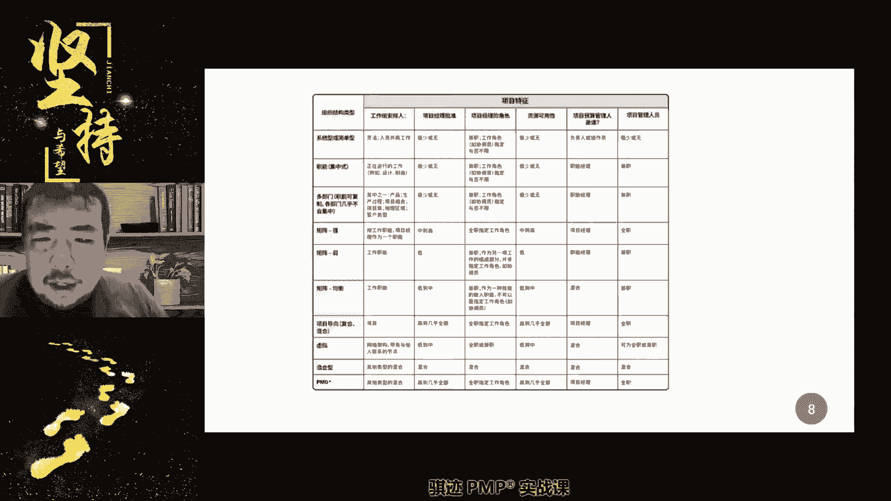

这是第六版，当原版当中一张图，项目东西有很多的组织结构。

那么我们在诶平时最常用到的是三种组织结构，一种是职能型组织结构，一种是矩阵型组织结构啊。

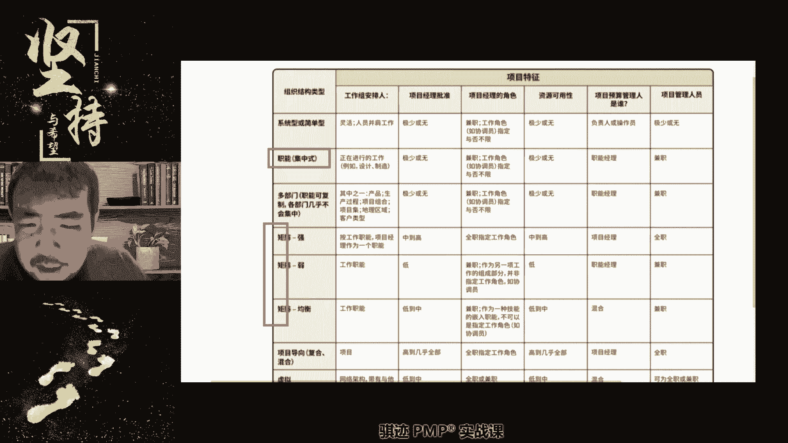

还有一种是项目导向型的组织结构，这三种是我们项目中最常见的组织结构，当然还有混合型PMO型这种啊，那么这个就不说了，PO型呢基本上就是以PO来作为项目部，它可以看作是pm管理的项目导向型。

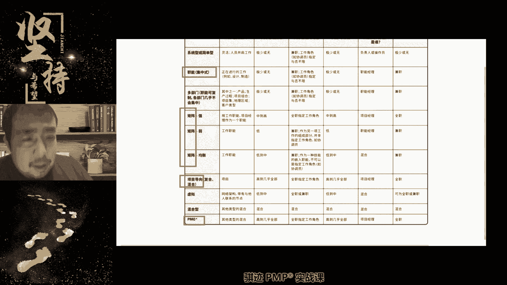

类似于中好，那么嗯那么我们项目中。

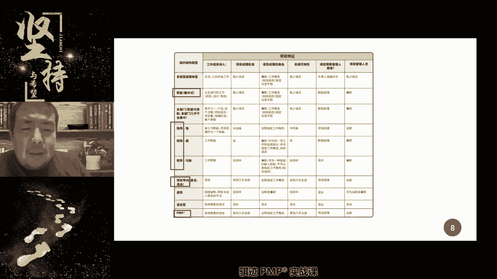

为什么要讲项目组织结构呢，是因为项目的组成方式。

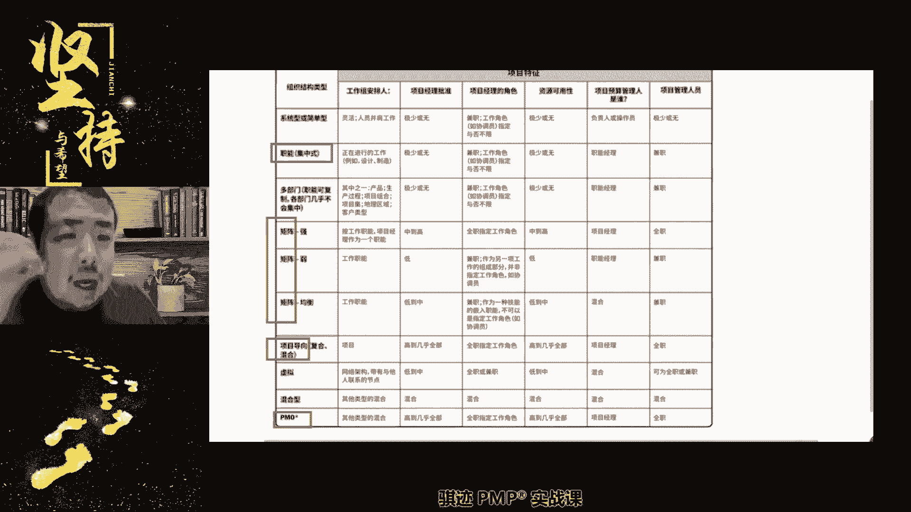

与组织的组成方式息息相关，这个我们之前的课讲过，对不对，因为组织是怎么样组成的，那么项目也会按照类似的方式去组成，并且受到组织的组成方式的影响啊，就比如说如果我们的公司是扁平化的，比如说只有这样几句。

比如说只有总经理下面各个经理经理，下面就是各个呃小呃小兵对吧啊，干活的，那么它的组织结构扁平，它所组成的项目团队也一定是扁平的啊，如果公司成绩很多是吧，总总经理对吧，总裁副总，高级副总裁。

总裁啊啊高级总裁总裁怎么高级副总裁副总裁，然后下面还是不高级的总监，高级总监等等等等，下面789成这样一层层层层下来。

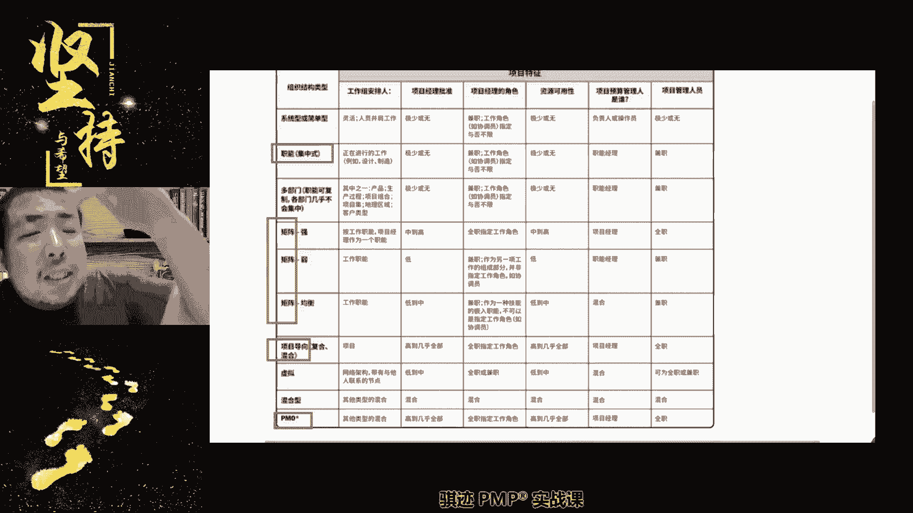

那么它带来的结果也必然是什么，你的项目组成组加工厂也比较复杂啊，这是正常的啊，这不是说这个就不对啊，这是正常的，不同的组织，不同的公司，它们的组成形式本来就不同啊，所以我们会将它们对项目的一。

按照对项目的依赖程度以及对啊，我们的叫什么，我们的对于项目的，就说是支持程度和管理权限程度，来分为这三大类，是职能型，矩阵型和项目导向型，那么其他的这类型呢大家简单了解一下就行啊。

那么接下来就开始讲第一种叫做职能型。

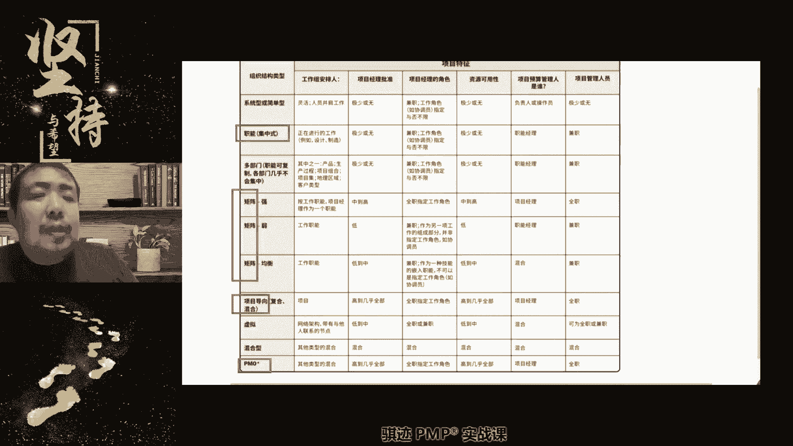

什么叫做职能型的项目组织架构啊。

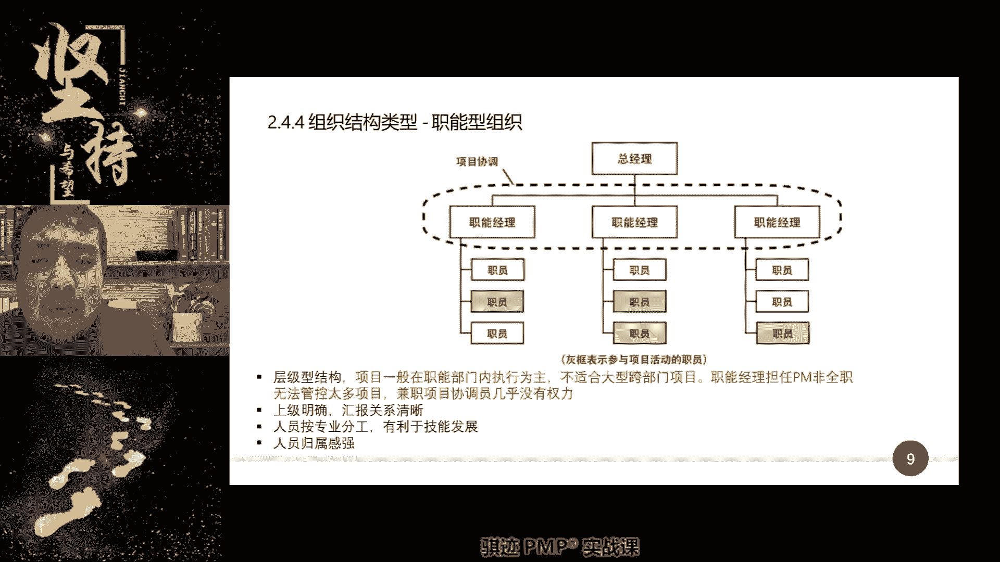

在这个组织架构中，我们有没有项目部啊，你看看这张组织架构图里面。

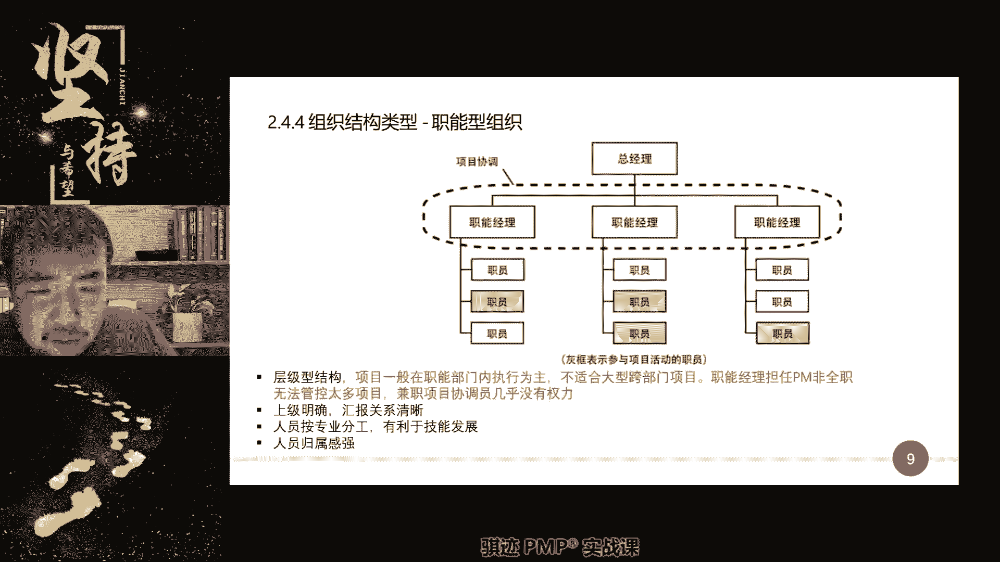

我们有没有项目部啊，没有专门的项目部，我们有没有没有叫项目经理的人啊，没有项目经理，那么我们只有谁来管理项目。

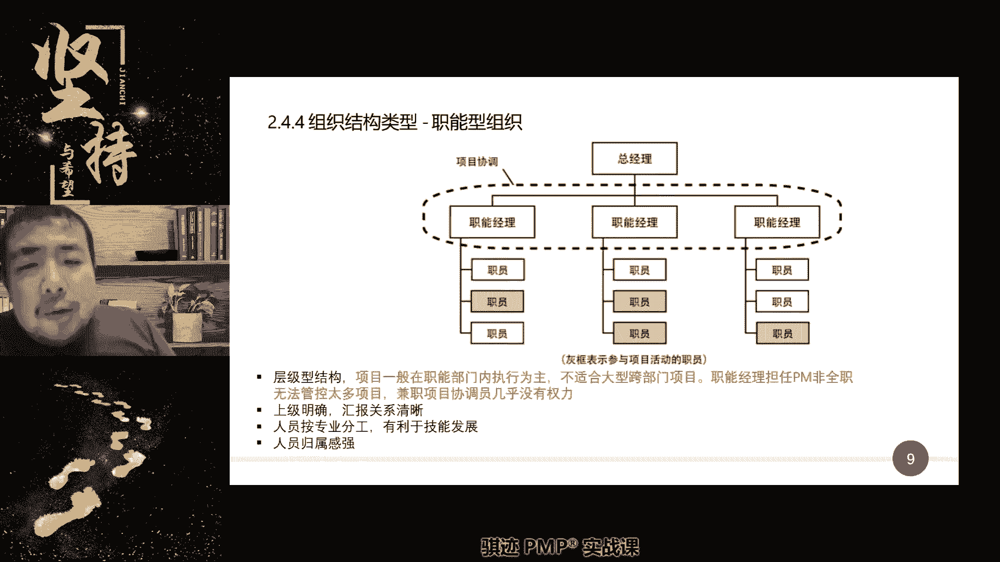

叫做职能经理啊。

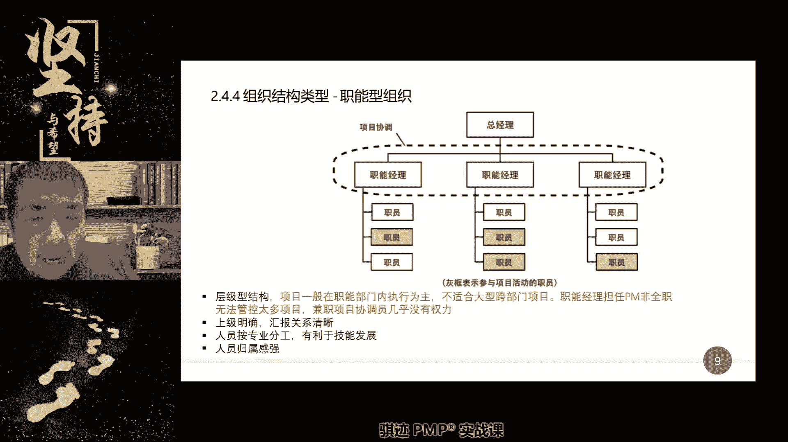

在职能型项目组织当中，而不是项目职能型组织当中，他没有项目部，也没有专业的项目经理，由职能经理担任项目经理，那么有同学问老师啊，什么叫职能经理。

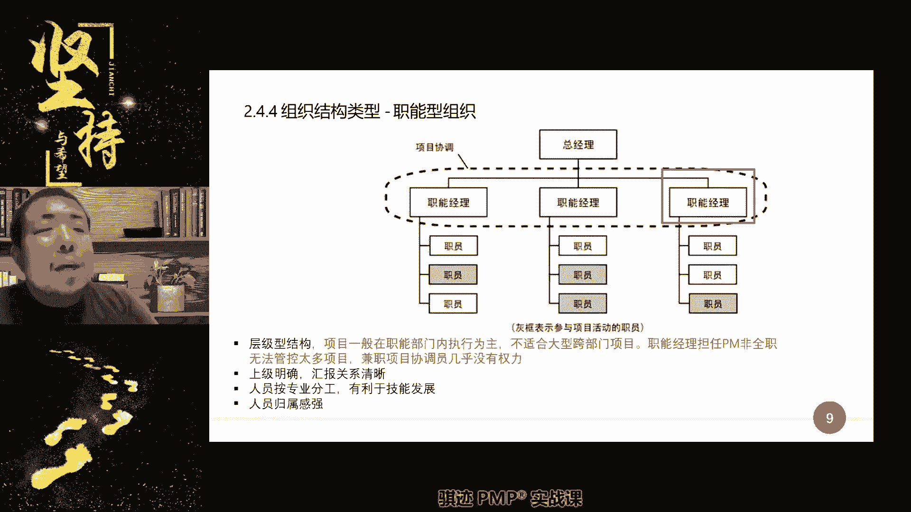

职能经理就是啊啊通俗点就相当于部门经理啊。

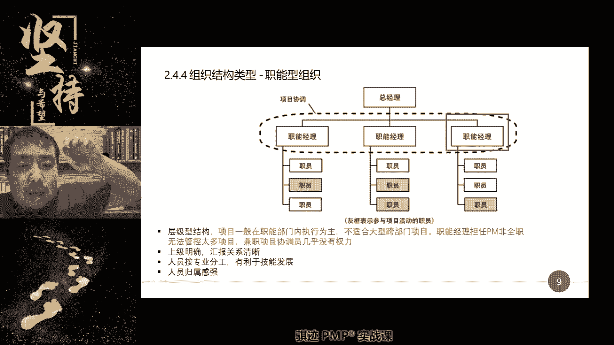

部门经理，比如说生产部叫生产经理对吧啊。

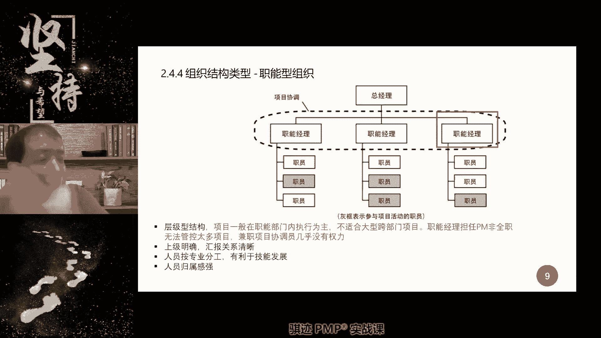

人力资源部门叫人力资源经理对吧，比如说是市场部，市场部经理这种职能带有专门职责的功能的，这些部门的经理啊，manager英文叫manager。

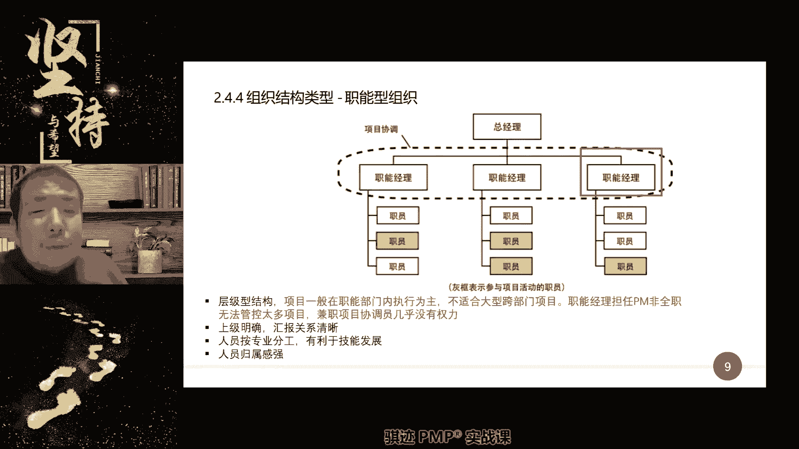

管理者叫做啊，叫做职能经理，职能经理，那么职能经理他身在这种情况下，身兼职能部门的管理运营职责，也兼项目管理职责啊，那么这种时候，职能经理他对于项目一般是投入精力较少，它的主要职能职能经理。

职能经理他的主要职责是干什么，管职能部门对吧，我生产不会管好生产啊，市场不要管好市场推广对吧，然后呢我们的那个叫什么人力资源部门，要管好什么员工福利对吧，工资这些东西对吧，所以他只会留少量的精力。

来解决部门内的项目问题啊，而且通常不会在项目上，发放很多的权力和精力去做，而且大家知道职能部门经理一般都比较忙碌嘛，对吧，一般来说就比较忙碌，他的精力有限啊，所以他也会在项目内的安排兼职的项目协调员。

但是这种如果是兼职的项目协调人，他不是项目经理，他没有任何项目经理的权限，只是帮助职能经理做一些呃沟通协调的事情，那么这会导致什么呢，职项目协调员没有任何权利，他只是一个跑腿啊，那么在这种情况下。

你们猜一下这个项目能做的规模大吗，能做的难度高吗，能做到跨职能部门吗，可不可以，可以还是不可以啊啊啊，晚来的同学请签到，然后呃谅解一下，今天的喉咙比较不舒服，所以嗓子有点哑，音调会低一点啊，嗯对的。

所以这种情况下是搞不到的，也有同学回答的很奥妙，可以很难，你应该说不可能啊，这种情况下做不出复杂的事情，肯定是做不算复杂的事情啊，那么所以以前有个段子啊，讲到这里就想到以前有个段子。

就说怎么样把一个项目搞砸啊，啊怎么样把一个项目搞砸，那么很容易找三个以上职能部门参与进来。

嘿嘿嘿，这是什么意思啊，当参与的职能部门多的时候。

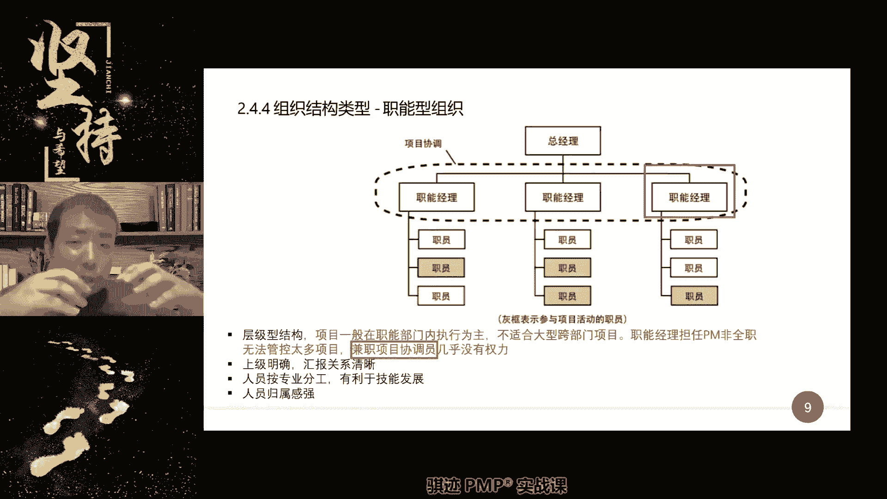

而你的公司又没有专门的项目部，去统筹协调的时候，这个项目很容易搞砸。

这叫做职能型，那么职能性有什么好处啊，他不用专职的人去管。

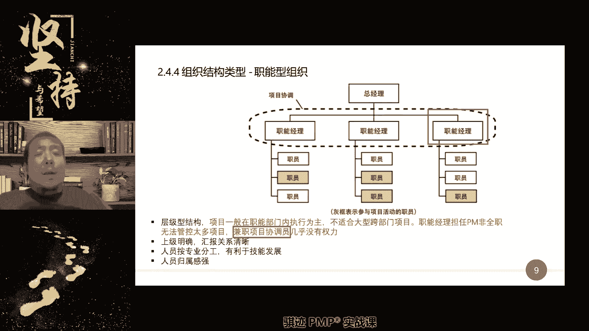

也不用专职的人去干活。

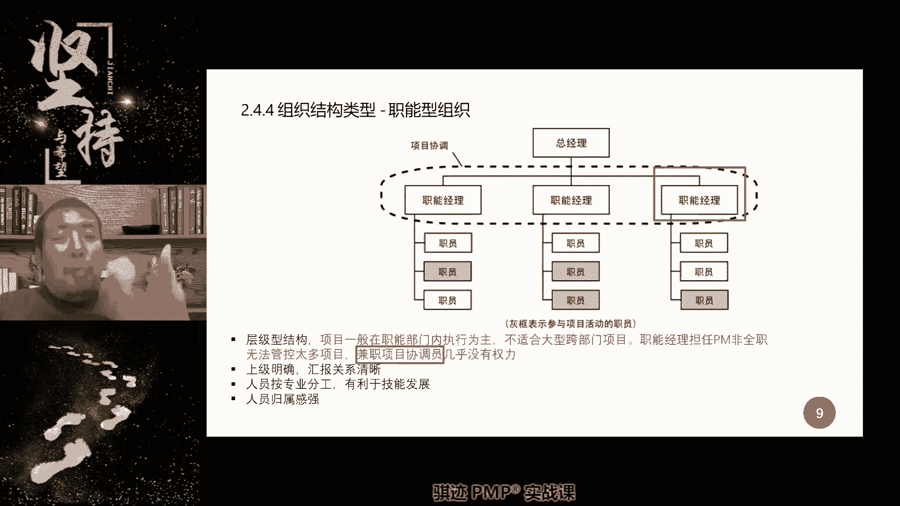

所以呢他成本谁呀，但是组织对于啊项目的依赖程度很低。

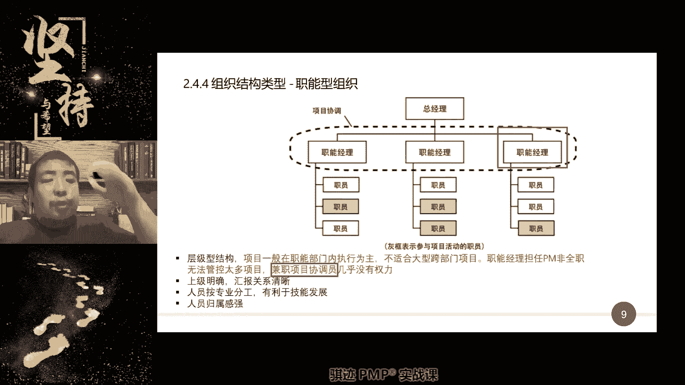

项反过来我们前面讲项目可以推动组织变革，推足足改变所组织进步，这种推动力呢也非常的小，对不对啊，所以这就是职能性的特点，但是职能性也有其他的好处，就是什么团队，我们这里写的团队有归属感。

因为所有的人都在职能部门里干活，那就有归属感啊，不是临时工，我们是正式工啊，有利于技能发展等等这些东西啊。

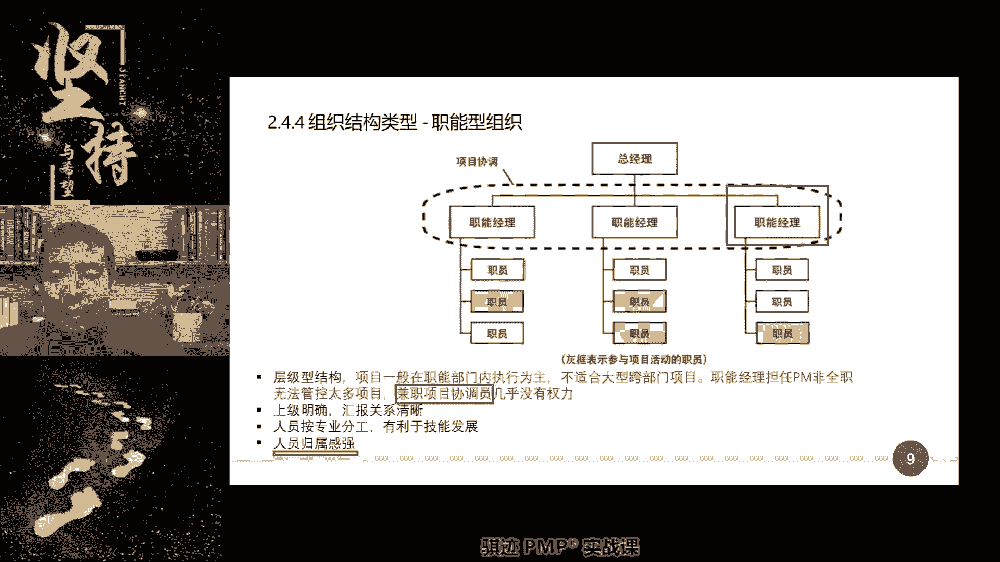

那么这是职能型，那么一般来说是什么，一个公司，一个组织一般在发展的初期，或者是规模不到一定程度的时候。

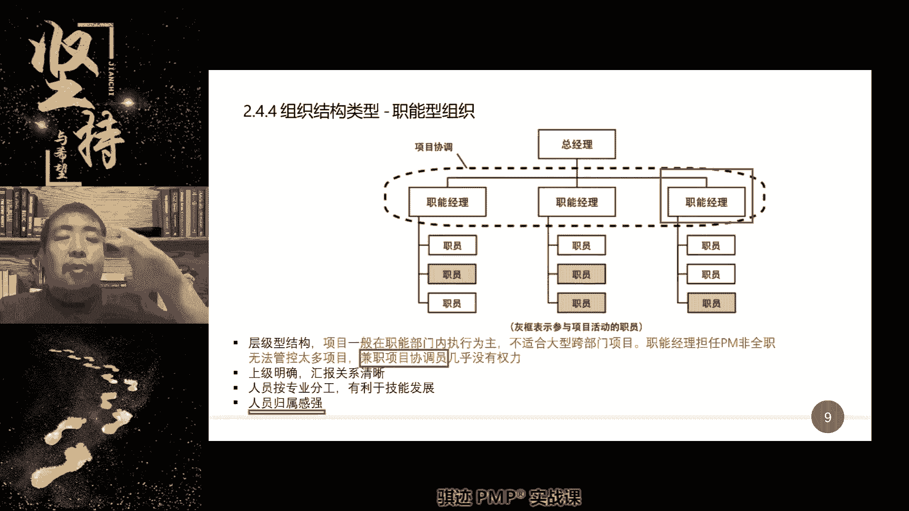

更倾向于职能性，因为职能工作是一个中小型企业，或者发展不完全的企业，在主要工作中心，因为通过职能工作，通过运营才能赚取利润，来维持整个企业的运转对吧，先要生存对吧，小企业先生存啊，不做项目，做大做强。

做什么东西，那是以后再考虑事情，先要活下去。

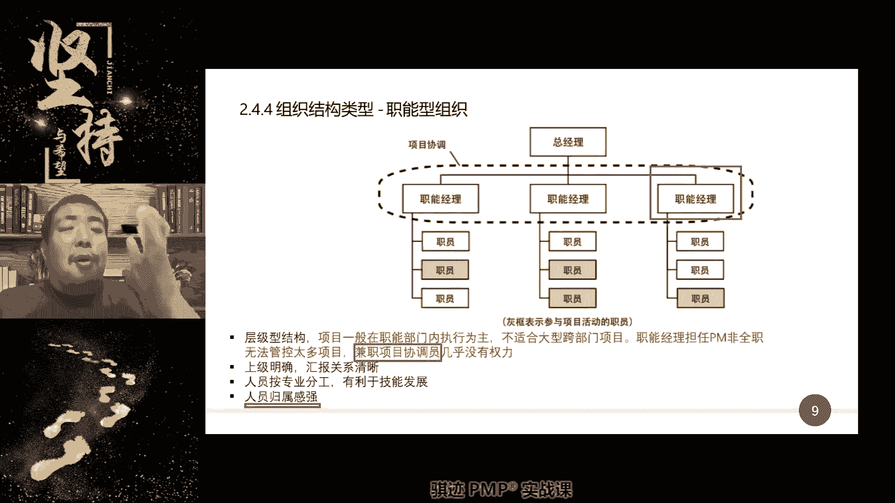

明白吗啊，这是第一种职能型啊，职能经理担任特征，职能经理担任项目经理，没有专职的项目经理，协调与项目，协调员几乎没有权利啊，也没有项目部啊，这个特征。

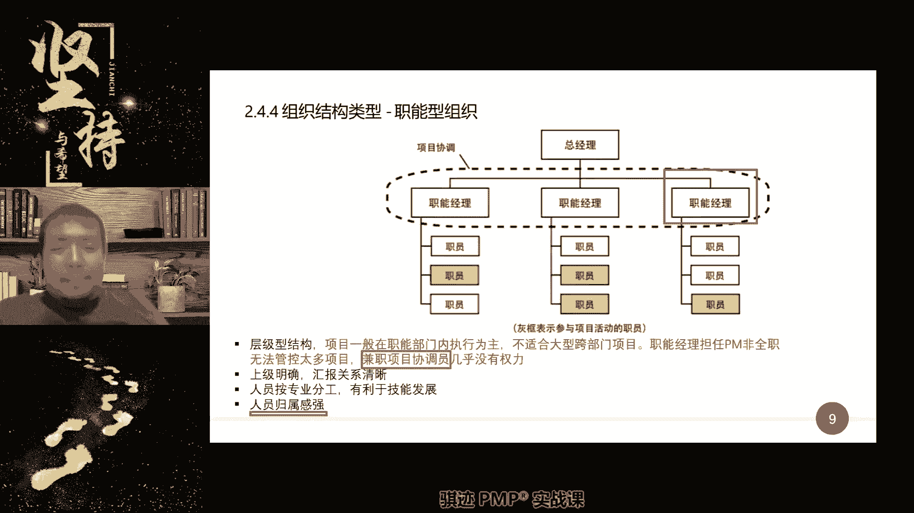

第二种弱矩阵型，那么看到弱矩阵类型的矩阵类型。

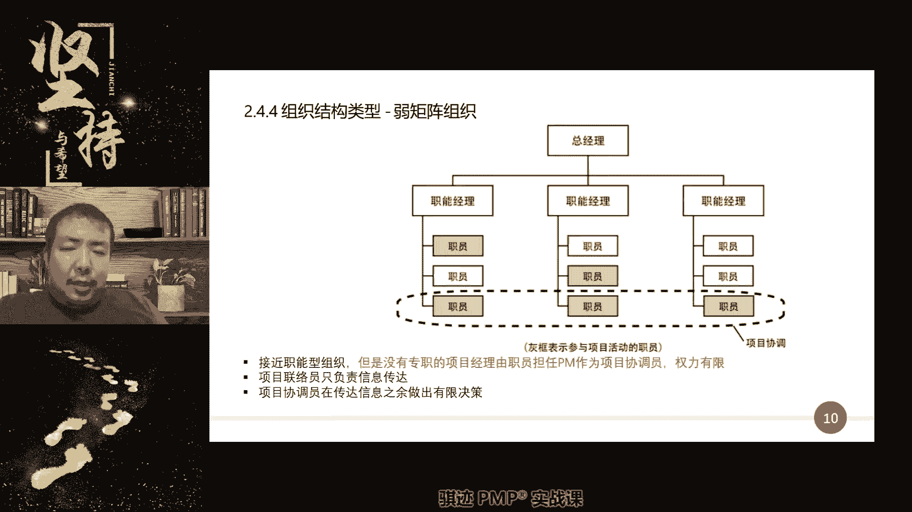

在这个当中呢就开始慢慢开始演化了啊。

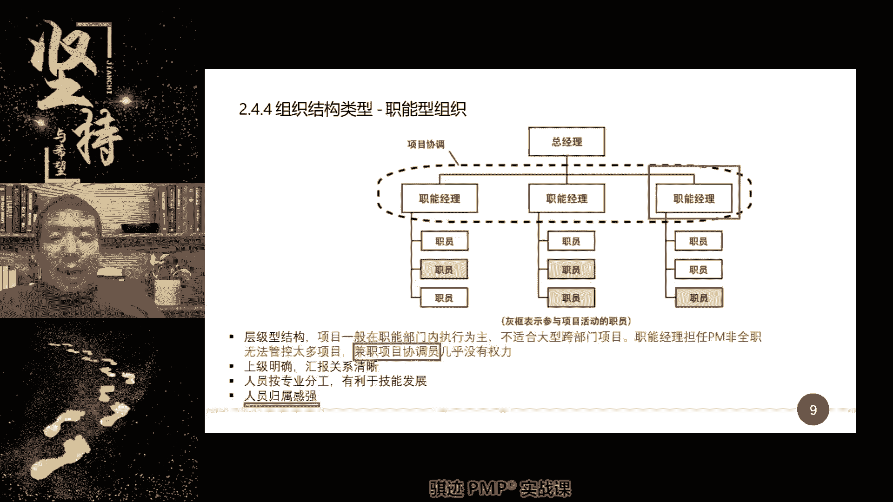

你看到职能型和弱矩阵，你看这两个的区别是什么，区别是什么，区别是，区别是一个是项目职能经理担任项目经理，一个是我们的职员担任项目经理啊，你知道吧，在弱矩阵当中参与的人其实是可以一样的，但是项目经理不同。

职员担任项目经理有什么好处啊，就是他的精力可以完全，或者大部分投入到项目中，但是呢他是因为是职员，所以他必然还是有部分精力要做职能部门工作，不能完全投入到项目当中去，权力下放对哎这个表达不错哎。

对权力下放，对的明白了吧，但是呢他在职能经理之下，而且不是专业的项目经理，所以他管理项目的能力有限，权限也有限，受到本部门的职能经理制约，也受到其他部门的职能经理制约，那么为什么要这么做，不用智能型。

而用弱矩阵呢，是因为随着我们的企业发展，其实这是企业发展当中一个呃，很常见的一种过渡过渡状态，就是随着我们企业发展逐渐逐渐需要项目啊。

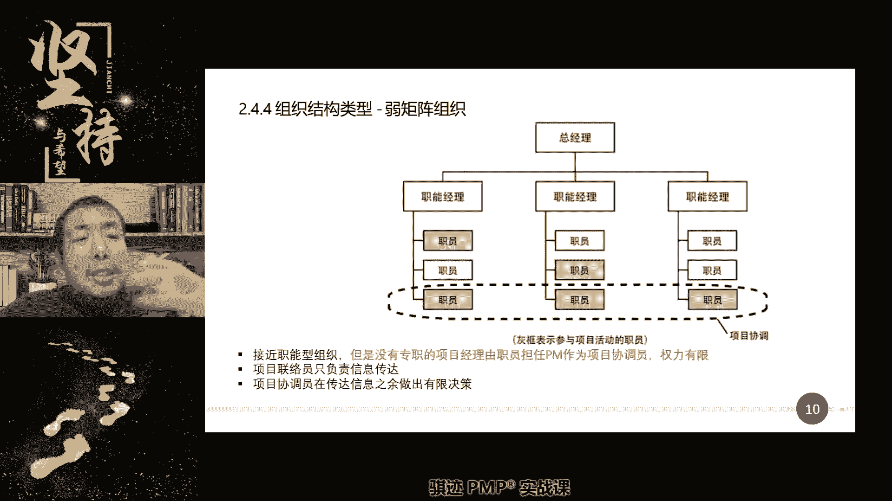

我们已经能生存了，但是我们坚持继续考虑发展，但是呢我们钱不多。

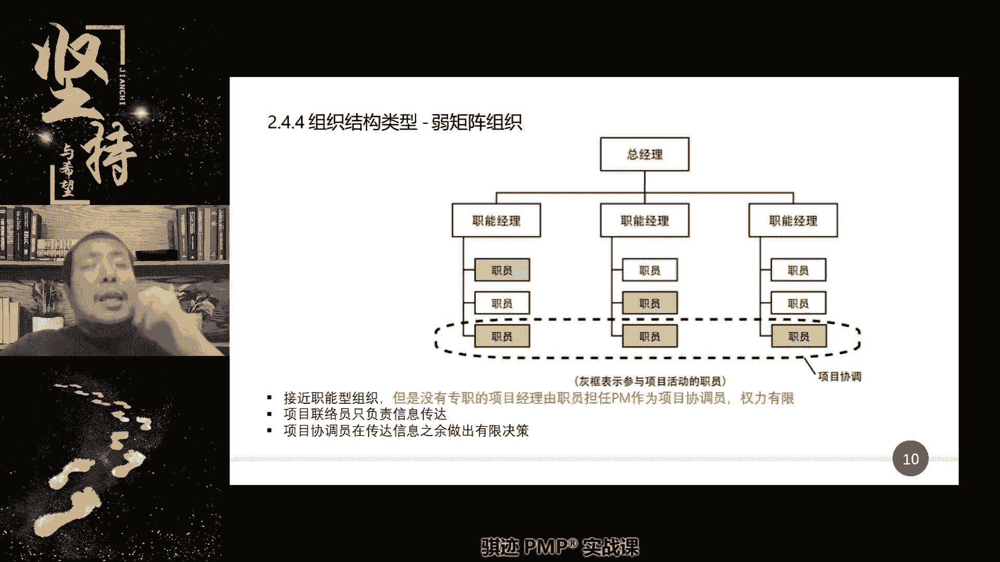

请不起各位这种未来的PMP，持证的高新p mp啊啊顺便说一句，在国外有偏僻症，确实属于薪水反正不低的那种啊。

在国外来说是属于不低的那种，不能算很高，但绝对不是低收入者。

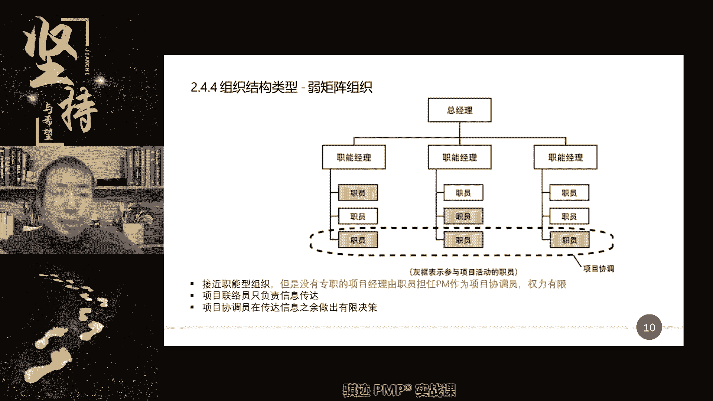

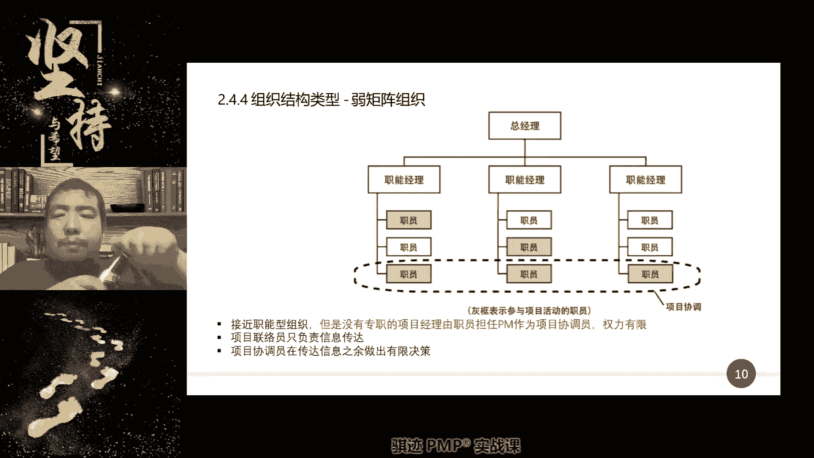

啊那么请不请专业的项目经理，那么就叫团队成员呢，大家兼职做一做项目经理，分一部分经理出来去带项目啊，那么这种项目你们觉得能带很复杂的项目吗，能不能带规模很大的项目，能不能，对不能对，也不能。

因为他的权力有限，能力也有限，带不起大型复杂项目啊，好这是弱矩阵的特征，组织架构跟我们的职能性是一样的，没有项目部，也没有专职的项目经理，专业的项目，那么只有什么东西啊，只有职员担任项目经理啊。

他的权利来自于职能经理的授予啊，那么很少有组织的值，就是规则制度的保障啊，为什么提这一点，你后面就知道是他特征，然后随着我们企业对大型复杂项目的诉求提升，那么来了。

这种业余项目经理就逐渐不适应我们的要求。

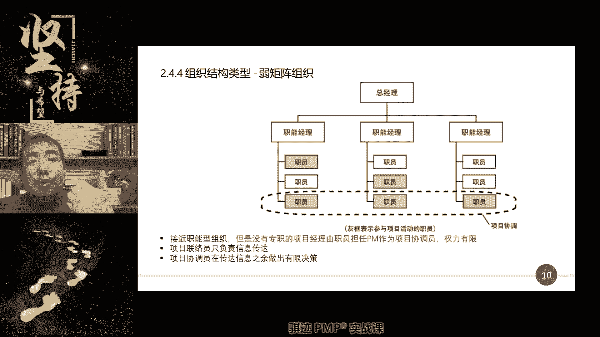

那怎么办。

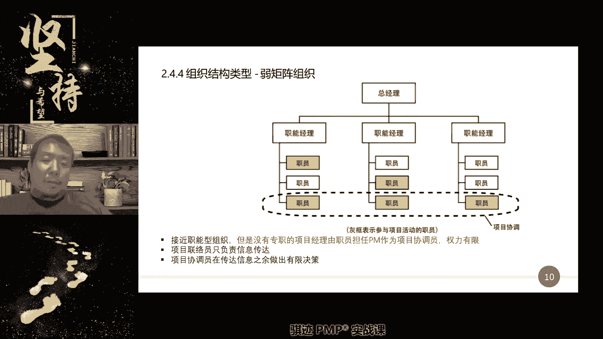

我们接下去就要请专业的项目经理了，来了这就进入什么平衡型矩阵，平衡型矩阵与之前的弱矩阵的最大区别是什么，它的组织架构上还是一样的，职能经理下面有的，但是他开始有开始有全职项目经理。

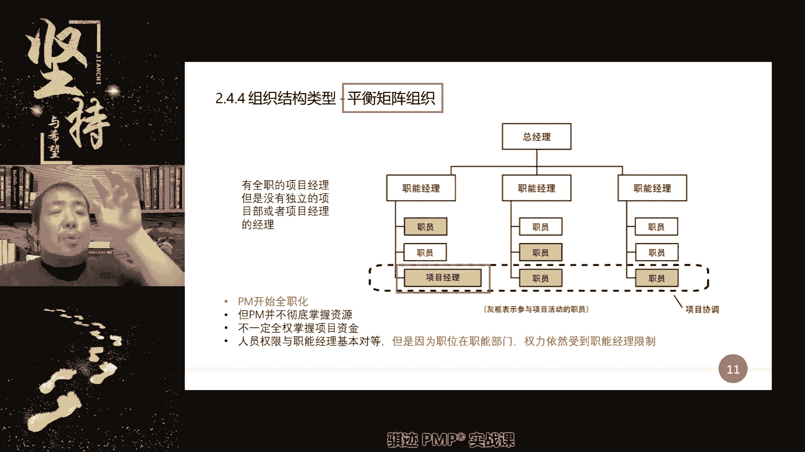

这种项目经理只管项目，不管其他直管项目。

它是专业的持证的啊，就是按PMI说法，就是有偏僻执照。

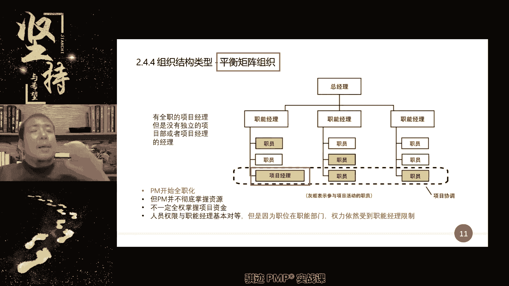

这种项目经理能力强，可以管理大型复杂项目，而且因为有专职的项目经理，往往组织也会有专门的政策，配套授予项目经理一定的权限，可以进行什么开展项目活动啊，有组织的过程，政策程序的保证啊。

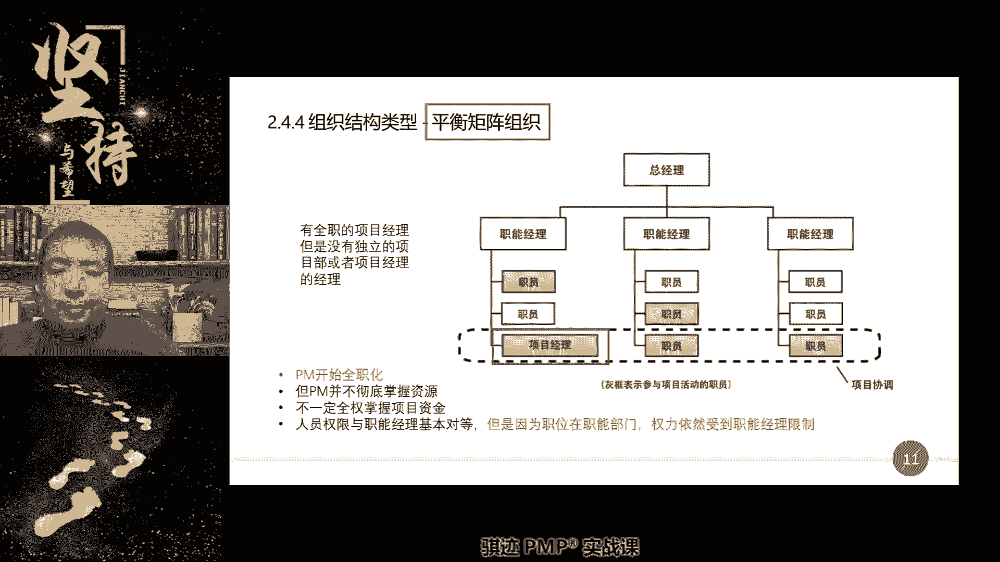

但是呢你们看到项目经理的顶头上司是什，项目经理的顶头上司是谁。

项目经理顶头上司是谁啊，职能经理对记住平衡矩阵的特征，有专职的项目经理，但他的顶头上司南是职能经理，他在职能部门之下担任项目经理，所以他的权限仍然受到职能经理的限制。

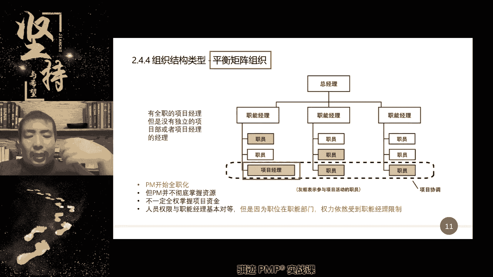

但是已经有较多权限，但是仍然受到职能经理节制啊，他有组织的一系列政策过程，保证能够获取资源，但是这些资源仍然要从职能部门当中去抽取，去争取，明白了吧啊，而且他的预算也不是完全独立的。

也可能需要从职能部门的预算当中挖出一块，来作为项目资金啊。

他不一定有完全的项目资金掌控权，因为在他职能部门下面。

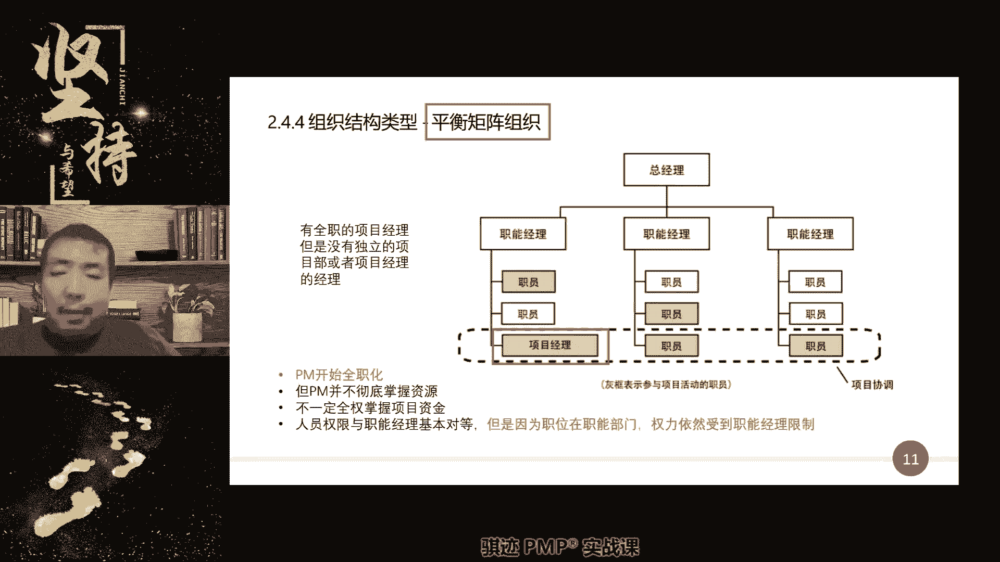

这是它的特征，但是已经开始有专业的人做专业的事情啊，项目经理开始全职化，并且拥有偏僻执政啊，所以这个时候一定是组织，因为项目经理按照PY设定，项目经理的薪水是不低的。

公司请得起项目经理一定是要做什么大型的。

复杂的，有难度，有管理要求的那种项目。

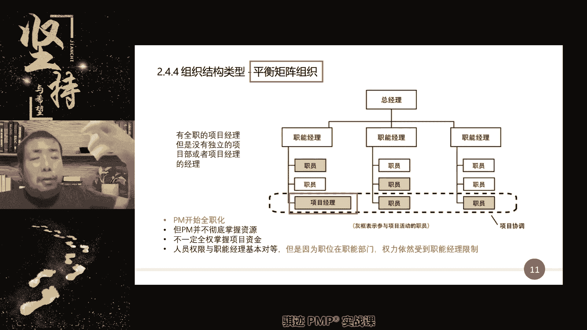

这个时候公司一定是什么啊，啊对于项目非常重视啊，或者较为重视啊，然后愿意在项目中投入较多的资金去做，对组织具有影响力的项目，这种时候才会出现全职项目，所以明白吗，以后如果你们要做职业项目经理的话。

你们的公司的举证类型，至少是应该是什么平衡型或者以上啊，好继续走。

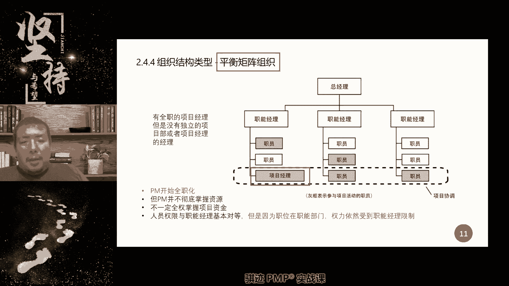

接下去这种矩阵类型呢叫做强矩阵，注意强矩阵跟前面的就有组织结构不一样，它在职能部门之外呢。

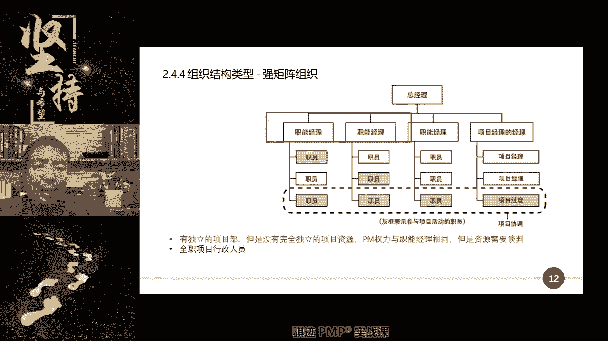

又多了一个叫做项目经理的经理，其实就是什么项目部啊，项目经理不再隶属于职能部门了。

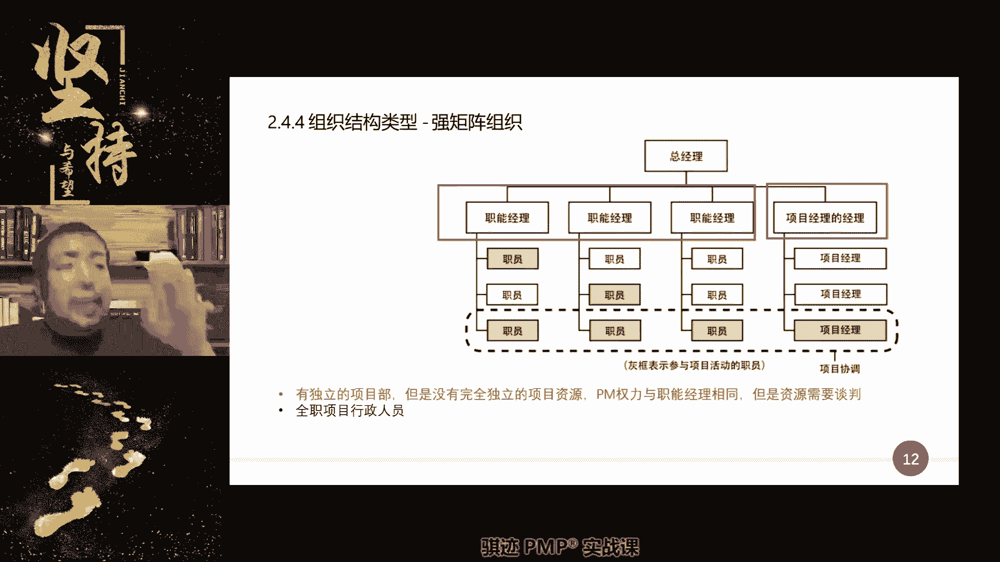

那你们想想，项目经理如果不再隶属于职能部门了，那么他的权利，是不是就不受到职能部门的制约了，不一定是PO，注意啊，项目部不一定是PO，PO是PO项目项目部，我们之后我们这个后面还再给你讲一讲啊。

但是其实我们之前也提过，跟PO不是直接关系啊，项目经理的经理，有时候呢我们称之为项目部门经理，有时候称之为项目总监，是这样一个人，项目经理不再受到直播文制约。

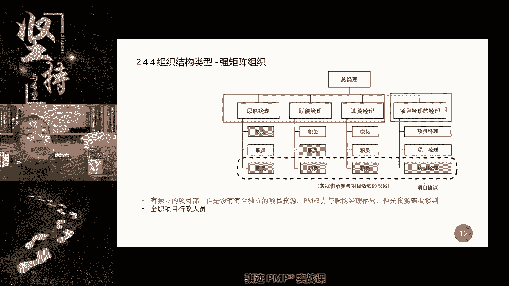

项目经理和职能经理。

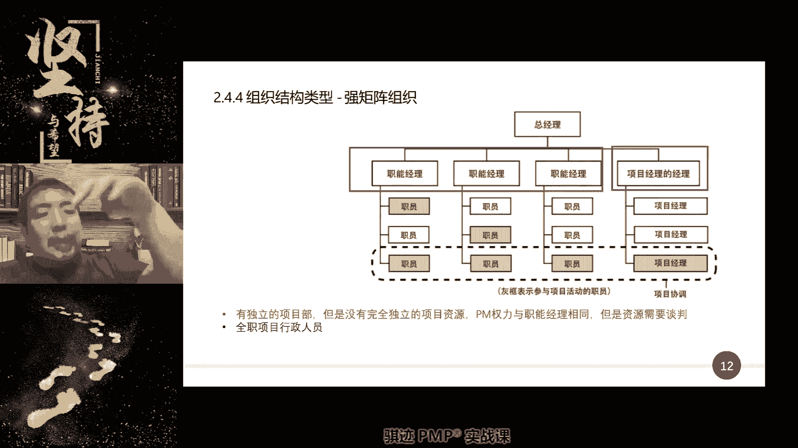

基本上可以看作是同等大小权利的，对自立门户了，你管不到我了，这个时候权利得到了什么充分保障啊，但是有一点，项目经理的手下是没有资源，这种情况下，项目经理手下是没有资源。

对这是按照PMBOK第六版体系来讲啊，首先是没有资源，他要去用动用资源。

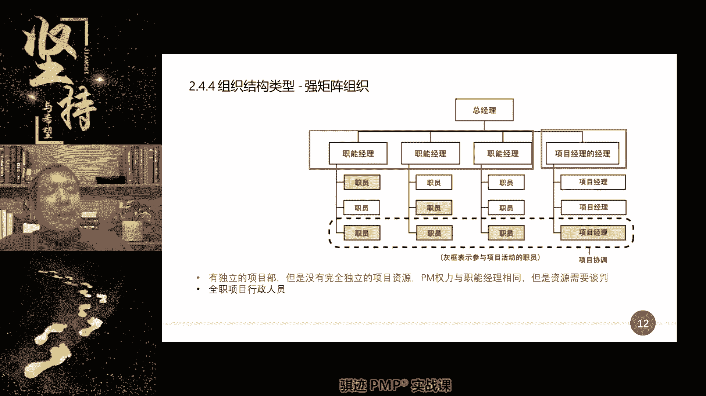

在项目中干活的时候，仍然需要找职能经理去商量。

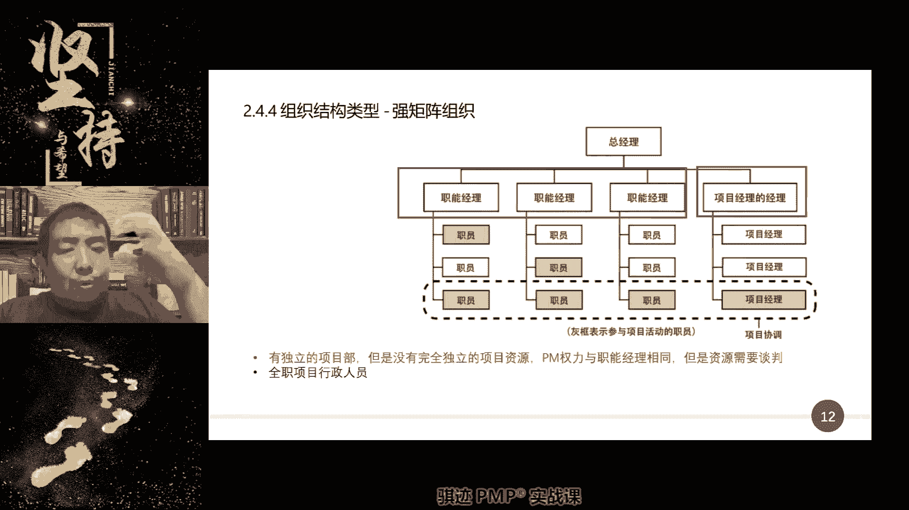

注意这个时候项目经理手里有武器。

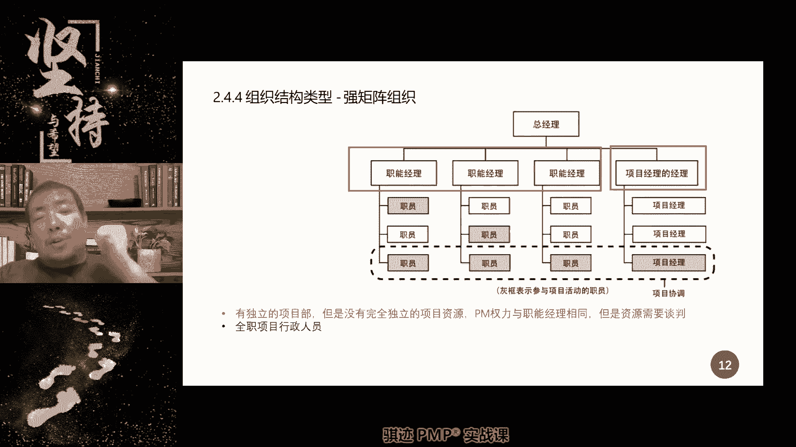

为什么像这种有项目部的组织架构，往往都是有什么公司的相关的项目政策保证，职能经理是一定得给项目经理提供资源，只是提供多少呢，要去你去争取好坏呢，要真正去，但是一定得救，这是他的职责和义务，明白了吧。

所以要一个公司要想成立项目部，不是说成立就成立，你没有人，光有光有将，没有冰，光有将，没有兵，就是没有用的啊，所以一定得什么东西啊，一一定得有啊资源啊，这种资源要什么来保证。

要有我们的公司的相关的政策制度来保证好，有同学说你们公司就是这个州啊，你们那就属于强矩阵，如果是强举证，就意味着公司非常依赖项目来进行生存。

或者非常依赖项目来进行发展。

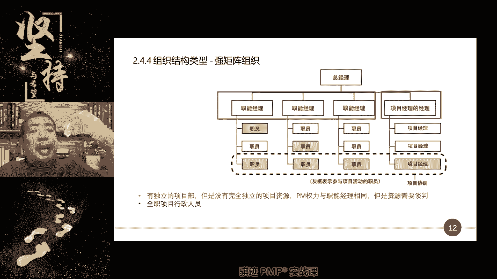

一定是对项目非常重视啊，非常的重视才会有这种事情，明白了吧啊。

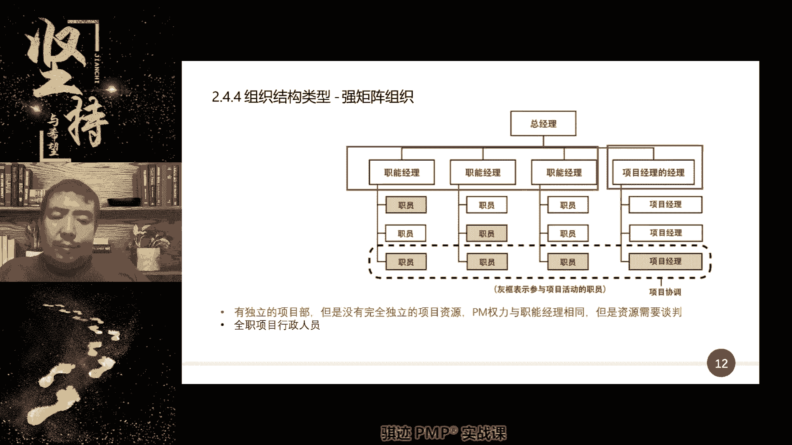

嗯嗯啊好，这就是强矩阵啊，那么强矩阵中自不必多说，它的里面的所有项职项目经理，都是专职的项目经理，并且在职能部门不在职能部门之下啊，有对项目不重视的公司吗，哎同学，这个就是差异的。

如果我们是一家夫妻老婆店。

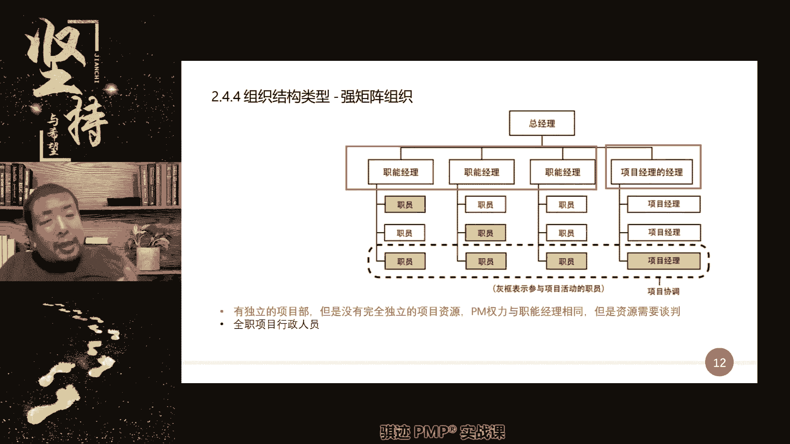

靠卖早饭为生的，我需要什么项目吗，不需要啊，如果我是一家小型制造企业，我每年只要出一个新产品，就能够在市场上卖出去，有好的反响，我就可以生存下来，我需要项目部门不需要。

但是我可能需要职能经理或者什么经理牵头，每年去搞一个项目，来给我们的公司提供竞争力，对不对，如果我是一家啊，注重研发和科技的这种项目公司，我可能就使用什么专职的项目经理去搞，如果我的研发项目。

市场项目生产项目比较多，那我可能把这些项目呢，通过集中在项目部进行管理来提高管理效率，我就可能会变成强制的，这是取决于组织形态的需要唉，所以这个问题问得很好，但是我就像我说的。

取决于组织在世某处在某一个阶段，对于项目的需求不同啊，明白了吧啊等我讲完啊，当然大家可以提问啊，好。

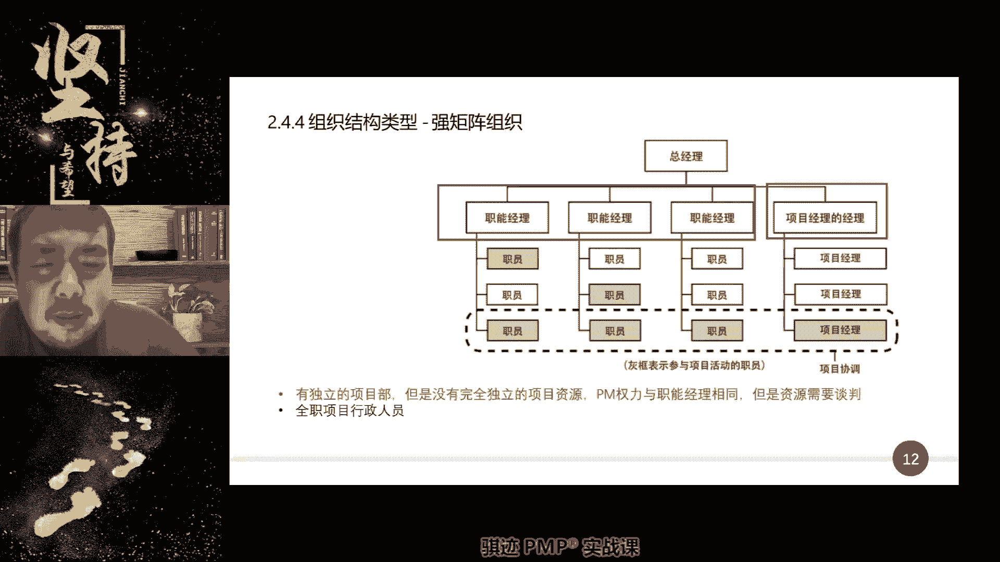

那么接下去我们会讲一种对项目，完全依赖的形态。


叫做项目型组织，在这种组织当中呢。


我们没有日常运营部门，它不存在日常稳定生产制造。


加工交付的这种过程。


他都是要通过一个又一个的项目来赚钱。


当项目结束了，这个钱就赚完了，要依靠另外一个项目来赚钱啊，它的商业模式可能是一套的，但是它的运营内容是不可持续的啊，那么这个东西呢我们先给大家讲个例子，这就很正常了啊，房地产公司就是项目型。

房地产公司就是项目经理，为什么，因为项目房地产公司都是一个地块，一块地皮就是会成立一家公司，然后由这家公司在运营运营之后赚了钱呢，交给母公司地盘，地块开发完了没有东西好开。

拉了公司注销，然后那边再拍到一个地块，再成立一家公司，然后再去有一个项目经理，一家房地产子公司就是一个项目啊，所以房地产公司都是这种构成，对建筑公司很多也是这样，明白。

那么这种情况下呢，我们会有全职的项目经理，并且没有运营经理。

而且对于项目经理更好的，什么项目经理之下会有全套的人员班子。


全套的人员班子啊，所有人都给你配备好啊，在你项目下面干活，权力达到了最大，权力达到最大啊，好那么这种情况下，我们的项目经理啊拥有很大的自主权和权利啊，但是也承担了最多的职责。

公司对这种项目经理必然是有呃，较为完全的业绩考核要求，因为公司就依赖着你的项目来赚钱生存和发展，所以你必须得给公司赚钱，明白了吧啊，那么这种类型的项目类型是不是矩阵型，它叫项目型，项目型有什么好处呢。

啊就是呃资源充分向项目倾斜啊，我们没有职能部门的制约啊，我们可以充分的开展项目去赚钱，缺点是什么，人员利用效率不高，而且成员缺乏归属感，一旦项目解散了，可能下一个项目就没有你了啊。

很多房地产公司就是这样的，他没有明确的啊，注意他没有明确的，就是说那个啊啊说你是永远属于什么工资，你可能今天是在这家公司干活，明天这家公司业务做完了，清算了，其他公司其他的项目里面不要你。

就是其他的项目公司里不要你，你就失业了，房地产房地产公司就是这样，那你就失业。


甚至有时候你连赔偿金都捞不到，宣传你那边为什么能叫公司清算的呀。


你清算的人家都已经清算关门了，他恶心你一点，他清算关门了，你来赔偿金都拿不。


好这是我们讲的呃。

项目型组织，项目型组织。


好那么最后我们讲一种组织类型啊。


最后一种呢叫做复合型组织，那复合型组织呢很简单，我给大家总结一下，就是强矩阵的组织架构，但是有强弱矩阵两种表现形式啊。


那么什么意思啊，很多的公司，其实是介于强矩阵和复合型组织之间的，那么什么意思啊，它有项目部，但是不是所有的项目经理都是从项目部里出来，因为项目部里的项目经理成本代价比较高啊。

所以呢它一般是什么大型复杂项目。

由项目部牵头，小型职能部门内的项目由职能部门内卷到。


所以当做小项目的时候呢，它更像弱矩阵，当做大项目呢，它就更像什么强拒绝，这种形态下呢就形成了叫做复合型组织，好强矩阵也有考核指标，对也有的啊，一般来说从强举证到项目型都会有考核指标，弱矩阵和平衡性。

一般项目经理很少有考核指标，就完成工作就可以了啊，好那么这就是我们讲的各种组织结构类型啊，接下来回答一下提问，哎，呃有同学说这样的模式很像互联网开发那种，项目信息中有产品经理吧。

或者产品经理就是项目经理啊，一般来说产品经理和项目经理是分开的啊，那么如果是互联网开发这种呢，他们里边可能有虚拟的所谓的啊，虚拟的这种这种这种这种这种项目型架构，或者是强制人家暴啊，他一般是虚拟的。

就相当于在公司内部虚拟创业一种这种意思，它里面是会有项目，团队当中是会有产品经理的啊，但是项目经理不一定是产品，不一定有可能是项目经理，也有可能不是项目经理啊，这个取决于具体情况不一定好。


那么这是组织架构类型啊，这个我给大家总结一下。


这个PPT我们课后会发给大家啊，大家需要的，那么它的各个优点大家可以看一下啊。

职能性呢利于专业技能培养，但是呢往往项目经理缺乏权限。


因为在职项目经理在职能性当中都是带什么啊，都是没有专业的项目经理的职能经理，担任项目经理，所以项目经理他所谓的项目经理。


就是项目沟通员，几乎没有权利，缺乏跨部门沟通的能力啊。


只能做小型项目的缺点，那么矩阵型呢，多头领导汇报，那么举证性有什么最大，融人力资源上有什么好处啊，矩阵型可以增加人力的利用效率。


员工既可以为项目干活，也可以为职能部门干活。


可以啊，可以提高利用率，但是缺点就在于这样的情况下，同时对项目经理和职能经理负责，那么他的管理就需要沟通会较为复杂啊，而项目型呢所有的资源都归于项目，那么项目经理权利很高，开展项目较为方便。

但是呢因为我们前面讲的圆融。


员工容易缺乏归属感，也不至于也不利于什么职业技能的培养，和员工的职业发展啊，资源效率利润低，那么为什么项目型资源资源要效率的利用。


你知道吧，是因为在如果人仅仅服务于一个项目。


那么项目中总会有些工作会有忙有闲，或者有些工作总归会有分工，你先做我再做，那么如果我只为一个项目工作，你先做我再做。


但你当你先做的时候，是不是我就闲着，等到我做的时候呢。


你就写，所以很容易造成盲显不均啊，从而导致什么资源利用一下啊，明白了吧，所以我们刚才讲的几个特征都记清楚了。


我们再复述一遍啊，忠诚度高和归属度低，哪有这员工对项目忠诚度高。


看清楚自己啊，尾号1152同学，项目型是员工对项目重视，因为他只为项目干活，是不是忠诚度最高，矩阵型来又为项目干活，又为职能部门干活，所以在忠诚度对项目的忠诚度低，因为他在KPI考核里面。

很有可能一大部分都是在职能部门里啊，所以他当然是更愿意为职能，很多时候更愿意为职能部门干活，所以项目经理呢就会经常面临，资源利用率不足的问题。


明白了吧。


那么前面有同学提到了PO啊，PO我们之前讲过这项目管理办公室。


我们之前其实上课也讲过了，就不再赘述，屏幕我讲过，我们分为知识型，智力型和管理，知识型智力型和管理型啊，也叫做知识型，管理型和指令型啊，那么知识性我们前面讲过啊，提供文档啊，提供模板啊等等这些东西。

控制型呢要求进行服从，然后他会进行绩效考核，管理型呢也就是指令型呢，它会直接下达命令。


我们之前在之前的课程都讲过啊，那么PO讲到PO就是一种偏O型。


所谓的PO型其实很简单，就是项目部不是由项目经理经理管。


而是由什么由PO来管，这里其实是PO来管啊，它是由pm来管理的。


这个种族就是pm型，明白了好，来回答一下大家的问题，职能部门是利润部门吗，啊不一定是你想，比如说人力资源部门就不一定是利润部门对吧，比如说it部也不是利润部门对吧，我们都知道it部门都是花钱的对吧。

职能部门不一定利润嘛，但是他肯定有特定的工作职责的。


所以我们才称之为智能，好吧好，那么这是我们讲的组织架构的相关的内容啊。


那么我们今天补一下。


那么我们这些课后，有一些关于组织架构类型的题目，我们课后到稍后再练一下啊。


然后再练一下好，那么我们今天继续讲，我们的第七章的相关内容啊，第七篇和第七版的相关内容，今天我们要讲的是啊，本来准备这个整理一下，但是今呃今天确实有点啊，我们今天开始讲我们的生命周期和绩效的。

生命周期和呃绩效的那个交互，不好意思，新版的这个PPT。


不好意思，因为呃。


因为呃我们当然因为那个教材更新的比较多的，比较匆忙。

所以我们其实合在一个PPT不太好。

呃所以后续，那么今天我们开始讲开发方法和生命周期的。


那个那个那个绩效率啊，那么讲到这里，所谓的绩效率，这是pm bok的第七版的一种新说法啊，我们讲叫新说法，从这里开始，大家注意啊，开发方法和生命周期的纪效益，不是我们在书上讲的第一个顺位。

这是我特意调整过的，因为各个绩效率之间没有必然的先后顺序，请记住项目管理当中的知识领域，我们讲十大知识领域是有绩效率的，但是现在不怎么讲十大知识领域了是吧，这这这件事情也是p mi现在做个改革。

好像步子有点大，它是有一定顺序，我们总是讲项目管理先管好什么东西啊，范围进度成本啊，然后再管好，其他是以范围绕范围技术成本进行管理的对吧，他就是有个前后适用数据啊，所以在项目管理的呃。

这知识领域当中管理的时候呢，我们是以啊范进成为主体的，但是在P波和第七版当中呢，它是以绩效率来描述，那么什么叫做绩效率，混合型的再图再看一下，诶同学，你这个我刚刚翻过来，你说混合运行的图的人。

混合性的这个图就是啊啊我们上课讲过，要么我们课间休，等我休息之前再给你看一下，好吧，你们不要打乱节奏，那么我们回到这开发方法和生命周期的绩效率，这个所谓的绩效率是什么，是一种结果导向的领域。

就是说特定结果导向会归在这一类啊，比如这个结构导向什么，我们如何去确定和运用什么样的开发方法，运用什么样的项目生命周期啊，那么它是一个结果导向啊，在PMBOK第七版的描述当中，它不再描述过程。

而只描述要达到的结果，过程怎么办，交给你啊，这是PMBOK第七版的一个最大改变，我不再描述过程了，过程你自己掌控，自己裁剪，我们之前讲过裁剪，自己裁剪，自己琢磨，我只讲我们要达到的目的。

这个呢听起来其实有点耍流氓啊，耍流氓就告诉你什么，我不知道我我不知道这个题怎么做，但是我只想要结果，对不对，有没得耍流氓啊，别人少，所以我觉得这个东西就是七开始，从这里开始，就是呃包括前几节课。

其实也是很多同学都觉得听了大家听不懂，为什么他的描述就是理论化和结，果导向的描述啊，而没有告诉你莱茵莱茵和前因后果来龙去脉，所以导致我们很多同学很难理解，尤其是尤其是没有经验的同学啊。

所以我们在上课的时候呢啊大家跟着我，我是特别为了大家能够理解嗯，我是为特别为了大家理解，调整了授课顺序，不会少掉内容，但是以大家最能理解的授课顺序进行授课，同时穿插了我们考试所必须要的知识点啊。

知识点啊，是这样，那么为什么上来先讲开发方法和生命周期的，因为我们接下来就会就会看到什么，开发方法和生命周期，直接决定了我们后续如何去管理范围，进度成本预测型是怎么管理的。

敏捷型或者叫适应性是怎么管理的，混合型又是怎么管理的，在这个当中，首先我们先起个头，然后他又是一个绩效玉啊，明白了吧，所以这是我们的一个授课思路啊，注意所以如果你拿着书去看我们的内容的话。

你会发现什么诶，老师你怎么按不按顺序讲，因为按照顺序讲，对你的理解，其实我从我的角度来反而更反而更难理解，因为他讲的是没有逻辑顺序，只告诉你这要注意这一点，这一点这一点这一点至于怎么注意这一点，对不起。

我们不提供。


好那么既效率啊，注意纪效率这个东西呢总共有八大纪效率啊。


我们会有开发分析方法，团队干系人不确定性，测量交付这项目工作和规划及效率啊。


那么我们会先讲的不是书上的第一个绩效益，但是我们先讲。


这叫做开发方法和生命周期极效益，那么它我们的所有的绩效率。


都会遵循我们之前讲的什么管理原则，我们会遵循12个项目管理原则，去进行绩效与管理啊，注意如果我没有猜错的话啊，虽然你们啊，我觉得啊你们如果8月份去考试的话，大概率这个问题还不大。

但是以后的PMI的考试出题，我估计就大致会往12个管理原则，加八个绩效益这种方式去考，而不会像现在这样的考法啊，当然你们不用担心啊，我们学校卫生间调整，而且你们来说啊，从我们学校得到消息来说。


我们现在的考试方法和题目不会做大的改变啊，我们还是按照我们的既有节奏去教啊。


这就是我们的管理原则与绩效率之间的关系，请记住我们有八大绩效域啊。


而不是原来的十大知识领域啊。


其实我觉得讲知识领域大家更容易理解，对知识领域当中，我们一直我一直提到范进成，范进程范围进度成对吧，好废话不多说。


继续啊，那么先讲第一个开发方法。


绩效于，啊开发方法和生命就积极而已。

那么开发方法生命就要去干什么，就是开发方法，涉及我们项目用何种开发法去开发。


节奏如何，什么叫节奏，节奏指的是以什么样的时间规律去做啊，以及生命周期的相关活动啊，那么它会产生什么，我们指定的开发方法，这个开发方法与我们的交付物和交付节奏。


有关啊，啊他会从项目开始到结束。


将各个阶段与干线价值来联系起来啊，促进我们的形成啊。


这个就不多说了啊，这个其实概念呢也没啥好多说，那么开发方法手机当中我们会确定一个东西。


我们会在开发啊。


开发方法交付啊，生命周期这个这样一个绩效域内。


会确定几个东西，第一个是可交付，你准备交出什么东西，注意不要以为可交付成果是一成不变的啊，就是说不同项目的开发方法，它的开发生命周期，可能交出去的交付物是不完全一样，或者是内容是一样的。

但是过程是不一样的，那我们给你举个很很明显的例子啊，很明显的例子啊，就是现在大家我又举我有举造车例子，现在有越来越多的造车新势力喜欢怎么玩啊，先帮你把车子造出来，然后呢车子里的各种功能，对不起。

我们先开发基本功能，可以让你上路，我们就先卖出来，后续我给你许诺很多很多的好玩的新功能，但是等我开发出来再用OTA推给，这是不是一种可交付成果的设计啊，是的，但是这个与我们传统的认为。

车一卖出来就可以进行什么，就可以进行完全功能的使用是完全不一样的，对不对，所以现在很多时候买个车，买到手的可能是个半成品，他要通过OTOGA，甚至要通过返场对吧。

前两年大家知道因为疫情关系引起了芯片短缺，芯片短缺就导致了什么东西啊，很多的车缺乏芯片，不能实现某些功能，车长说不要紧，你们先拿去，我先把车卖出去，你们先拿去，然后等到我们有芯片了，你在车再返厂回来。

我们再帮你把芯片安装上去，然后呢你就有这个功能哎，还能这么玩对吧。

OTAOT是什么东西啊，有些同学可能就不知道了吧，所谓的OTA就是呃我们叫做呃在线升级啊。


OT是哪三个塑形啊，就相当于什么你不用厂家干涉，直接通过网络，然后来进行远程。

对汽车进行远程控制和远程的升级啊，可以升级软件，车机系统的软件对，就是这个意思，意思啊啊就这我给你们讲的就是这个意思，所以我们的可交付既可以是一次交付的成品。

也可以是什么一个半成品啊，甚至是一个什么东西啊，甚至是一个啊啊啊。


根本不成熟的好玩的一个概念，我通过后期的迭代，可以让它变成另外一个完全不一样的东西啊，不一定是特斯拉，老是老老是那台传统燃油车，是那个叫什么，我开的是别克君威的，不是什么好车对吧。

就很普通的一个合资车对吧，它也可以，OTA有一次OTI很有意思，我在停车的时候，提醒我要OTAOTA的时候呢，车机会关闭门窗，不能打开升降，然后要持续5分钟，然后我一个脑抽点了一下OTA。

结果我门打不开了啊，你别笑啊。


门打不开了，我被关在自己的车里关了5分钟，然后直到OG结束，车机重新重启完，然后才能出门啊。


很有意思，啊所以这就是用汽车作为一个例子，为什么汽车人文人文走路怎么生产出来，就能开的上门跑路，他现在也可以用这种分阶段交付，或者是分开分拆交付的方式来设计，那么这个跟我们的开发方法和生命周期。

有什么关系啊，所以越来越多的新能源车新型造车方式，它的开发方法也开始向西，更加现代化的生命周期靠拢，比如用敏捷的开发方法，用迭代的开发思路啊。

用混合型的方法来开发产品，所以做出来的东西是混合性，比如说他尽可能做出什么软件硬件分离，机械部分是机械部分一次成型。

软件部分呢通过不断的改进。


来进行更好的用户服务和体验，然后硬件部分呢事先做好规划和设计。


使得它无论软件怎么升级。

都能用硬件去支持它，这个就是一种全新的交付产品交付的思路啊。


先把钱呢这个就明白了，所以我们的开发方法和我们的生命周期，也会影响到我们可交付成果，明白了啊，好而所谓的开发方法呢，我们在呃pp里我们主要讲的是什么，就是我们的三种类型啊。


我们现在归类以前有很多种归类，我们现在归为三类啊。


瀑布型爆炸式交付。


瀑布型预测型我们都称之为预测型的开发，生命文化统一啊，当然这几个词是一个意思，预测性，第二种是敏捷型或者叫适应型的开发方法，敏捷或者适应，然后最大的改变篇目和第七版最大改变，但是他考试应该不会这么稳。

但最大改变什么，将我们的啊，迭代型和增量型归为混合型的方法啊，所以混合性的方法可以什么预测加敏捷。

也可以是迭代，也可以是增量啊，但你不能这样说错啊。

这就是概念规律改变，一共就三大类开发方法，但是预测性基本上都是一致的，对吧，我们之前讲过谋定而后动。

但是敏捷呢就有各种敏捷方法论啊，我们后续会在敏捷专题中讲到，而且大家后面敏捷专题要好好学，因为现在敏捷题目很多啊，啊第三种叫做节奏，什么叫做节奏，说出来这个词来自于你运用敏捷啊。

你运用敏捷的这个概念之后，才会有什么叫做节奏啊，就是固定的工作间隙和时间规律叫做节奏。


比如说我们每两周交付一次产品。


比如说这是一种叫，比如说我们每年都在这个季节，这个时候去发布新产品，这就是一种节奏，因为这个符合客观商业环境当中最佳规律，知道吧，你们知道吗，苹果每年是几月开发布会的。


同学们，苹果发布会是每年几月份开的。

苹那么问题来了，苹果为什么每年固定在每年9月份开发布会。


为什么，为什么对他就是一个节奏，因为每年在9月份发布会，就可以在圣诞节前上射，圣诞节和黑五之前上市，苹果的新产品可以达到最好的销量，因为苹果算过，从9月份开始，中国人的消费旺季，11国庆。

美国人的消费旺季，黑五圣诞节对吧啊，西方人和东方人，消费电子产品最密集的一段时间。


就是从9月到12月，而而且按照一般的习惯，在圣诞节呀啊年底呀等等，这些人呢还会得到一笔额外的奖金，所以我当9月开发布会。


告诉你有新东西买的时候，你就会默默的把钱攒好。


我新东西上是有赶着你们的节日，你兜里又有钱了，对不起，你就会来买我的苹果。


这就是节奏，明白了吧，这就是节奏，人家都是算计好的，对你们的钱包都是算计好的，知道你们一年，尤其是上半年辛辛苦苦扣扣巴巴攒了点钱，哎到了那个时候呢，就跟新娘看看苹果的时候，新闻发布会，哎呀这个好赞啊。

不一定要买一个对吧啊，然后呢到了到了一发布的时候呢，正好呢该发钱的发了，该奖金奖金发了啊，该节日节假日有了啊，想想要到国庆了，唉累了一年了，辛苦了一年来犒劳自己一下啊，然后那钱就钱就尽归苹果对吧。

那么节奏和阶段什么，你注意啊，阶段是较大的一个分类，它指的是什么，我们将项目不视作一个整体。

而是做每一个一个阶段，根据一个一个一个阶段来进行，那么这个时候呢为什么要有阶段注意它，最关键目的是进行阶段的观看判断啊，这是一个知识点，叫阶段关卡，阶段方法有什么用啊，我判断上一阶段有没有达成。

我想要达到目的，下一阶段适不适合继续啊，因为做很多事，有些事情它是有很大风险的，或者有很多难度的，我为了能够及时的把控风险，我就将一个一口气做完的事情，分阶段去做。

如果任意阶段有问题，我就不会继续下一阶段，来避免更大的损失或者更大的风险发生啊。


所以很多的企业投资的时候，它分也是分阶段投资啊，第一阶段我们生产我认为我最看重的产品，然后成功之后呢，再评价一下有没有必要去扩充产品线，或者扩充产能，那么就变成二阶段项目，二阶段做完了。

看看还有没有市场需求，要不要再扩充一下，就变三阶段项目，四阶段项目，明白了吧，所以阶段就是一个用于判断的，一个一个一个段落的一个作用啊，那么我们如果设置项目阶段，他一定会有什么阶段判断标准。


我们这个阶段什么时候可以说，这个阶段会告一段落，他的判断标准是什，适不适合进入下一阶段，要不要继续开展，下一阶段我们会有一个阶段判断，而节奏呢是一个项目，应该在某些时间点做出某些东西。

然后才能达到最佳商业利益啊，最佳的项目效益呀，等等的一个什么一个时间安排。

它不一定是固定节奏，但是它会有特定的节奏啊。


就像什么东西啊啊我们再举个例子啊，不一定是讲苹果，这不一定的，比如说大家知道，如果我们想要一个项目做的顺利，中间涉及到中国人和外国人合作。


那么每年的第四季度总是最难安排的。

你要把控好节奏是什么。


第四季度因为什么圣诞节元旦啊，这个就是项目实践了啊。


有圣诞节元旦啊，春节元宵节对吧，不是中国人过节，就是外国人过节，那么应该怎么办，你应该充分把关好节奏，在老外休息的时候呢，让中国人干活，然后呢老外休息结束，中国人要干活的呢，要及时让中国。

要让要让中国人干完的活呢要移交给老外，然后让中国人劝活，然后要安排老外来及时的中国人，休息的时候把老外干活再干完，再离毁中国人，那么对于整个项目来说，你就把控好了节奏，否则如果一个环节落下来了。

就会每个环节都下来，明白吧，形成马太效应对吧啊就叫一步错，步步错，这就是节奏错，一步对，步步对，这就是节奏的啊，所以节奏啊。


我又想开车了，大家有时候路上开车遇到过那种那种路，叫做呃滤波呃，通道，知道吧，就是你按照固定速度开，你永远遇到绿灯，你超过了那个固定速度，你肯定会遇到红灯，这个叫做绿波道路啊，那你看一下。

一般绿波道路在城市道路里，一般是要求你50码左右开。


那么就一直是绿灯啊，他是故意设置成这种模式，那么这种模式有什么好处呢，提高城市通行效率啊，让你既不要开的太快，也不要在路上啊，磨叽磨叽啊，当乌龟车堵住路，这就是节奏，明白了吧。

好那么项目的生命周期呢就跟人的证明收集啊，人有什么生命周期啊，啊幼年少年青年壮年中年老年对吧。

项目有什么啊，启动前启动规划执行啊，检查多阶段继续执行，然后慢慢收尾结束也有这样一个过过生命中，其过程。


好那么这就是我们前面讲的啊，我们因为一课一口气连贯啊，讲项目的可交付成果的类型决定如何去开发啊，我们的这个类型决定如何开发，但类型是我们可以去决定的。


可交付成果的开发，开发方法会影响项目的交付次数和节奏，可交付成果的开发方法和所期望的结构。


决定项目周期啊，这是他们之间的关联类型，可交付成果类型决定如何开发，那么开发的我们的交付频率和我们的啊，交付频率和我们的交付类型，会决定我们的开发次数和我们的节奏，可交付成果的开发。

交付的交付节奏决定了我们项目生命周期。

就是这么一个关系，我刚才给大家也讲了啊，那么节奏和我们的生命周期啊。


就是小的，更微观的是节奏。


那么节奏之上呢就是阶段和整个生命周期啊。


生命周期是最大的啊，生命周期呢可以分为一串不分段。


也可以是分成多段，那么就多个阶段，好那么以下这个呢是我给大家分享的啊。


注意啊，这是呃一般规律。


但不是绝对，但一般都是这样的啊，就是项目中我们的可交付成果。


如果是无形的，我们知道什么叫无形的吧。

就是你交付出去的东西，是看不见摸不着的一样东西啊。


有东西比如说什么交付一个呃状态对吧。

比如说比如说最最近新闻看吧，中国人发射火箭有什么长征几号16对吧啊。


不是又发射成功吗，恕恕我文盲和记性不好啊，不是又发射成功吗，火箭发射是一种项目交付吧。

是的，但是他们是无形的，而不是有形的，因为火箭很早就找出来了。


火箭有没有用，取决于它能不能发射成功，发射成功是一种无形的。

你你摸不到这个东西，但是你拿到了那个结果，就是把人送上了太空对吧。


中国人现在又把三名宇航员送上太空，还有一名是教授对吧，然后在空间站会待好久对吧，到年底再回来啊，这个出差补贴不知道多少钱。

开玩笑啊，那么如果可交付成果是无形的，那么它重置成本较低对吧啊，就一般来说呢，我们就可以进行什么较频繁的改进啊。


所以为什么马斯克你知道吧。


为什么发射space x猎鹰发射，为什么他不断的进行改进啊，就是它的重置成本比较低呀。


为什么马斯克发射火箭一定要什么。

一定要进行回收，这个健身的第一节啊，因为那个东西最贵啊，而且他用不锈钢去做，然后成本更低啊，又又能回收，成本又低。


所以它能够重置成本够低，所以连航空，航天上也可以使用敏捷的开发方法啊。


也可以使用高频交付啊，所以高频交付一般都倾向于敏捷的开发网盘啊，那么如果啊平交付的频率越快，节奏越快，那么它一定是交付的间隔就越难对吧。


就像打拳啊，打拳一记拳头挥过来，他的挥舞的动作越时间越长。


一般来说力力量越大越实诚。


一个拳头挥过来的动作越慢啊，在同样一个人的话。


他的力气就相对越小对吧，所以交付节奏越快。

它的交付内容就越少，但是间间隔就越短，交付内容越多。

它的间隔就节奏就越什么啊，越长。


明白了吧啊啊有同学有同学说啊。

可以理解为节奏是更多的行为阶段是成果嘛。


节奏是一种，更多的是一种在阶段之下的一个时间间隔。


它不是一个啊，不是一个必然要做，但是最好能做到的一种固定时间间隔的东西。


或者非固定的，就是要特定时间点，比如说苹果在10月开发布会。


可不可以，当然也可以啊，当然也可以。

但是苹果每年都会有一个项目，什么开发一款新的IPHONE对吧，无论怎么样也要骗到你的钱，所以他肯定会开发新IPHONE对吧，所以苹果的节奏就是每年9月开始发布会，但是也有可能会10月开。

但是他必须每年开发布开发一个新新的IPHONE，这就是项目阶段啊。


哎有同学尾号7616的同学问啊，为什么可交付一般来说是无形的呢。


哎你看清楚，一般来说可交付成果是无情的，同志们，我说的是。


如果可交付成果是无形的重置，这么牛，我没说可交不成果一定都是五星的啊。


看清楚这句话的意思，一般来说可交付成果是无形的，重置成本就相对较低，可交付成果是有限，我后面半句只是没说呀。


可交付成果是有形的，那么重置成本一般都比较高。


我就没说这一句而已，Ok。


对吧，短距离也错啊。


OK没关系，那我在这里写了，可交付成果是有形的。


那么重沉没成本就比较高，就是说我们投入不能就投入了。


收不回来的成本就比较高对吧，我制造了一台机器。


重新推翻再造，这台机器的制造成本是不是都浪费了对吧，那么如果可交付成果是有形的，一般会更倾向于完美交付或者爆炸交付。


什么叫完美交付啊，就是做到尽善尽美了。


再交给用户，或者一口气全都交给用户。

