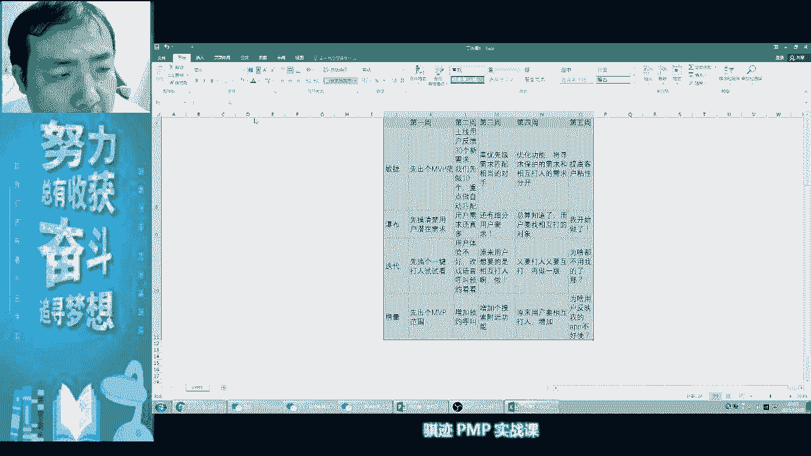
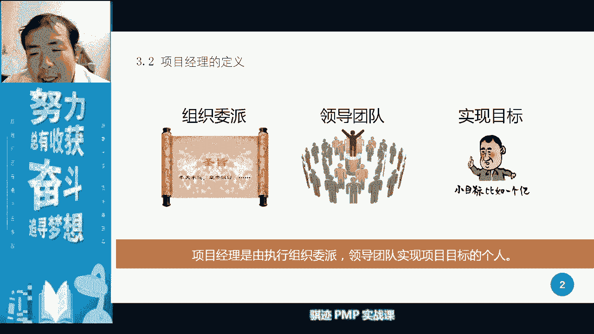
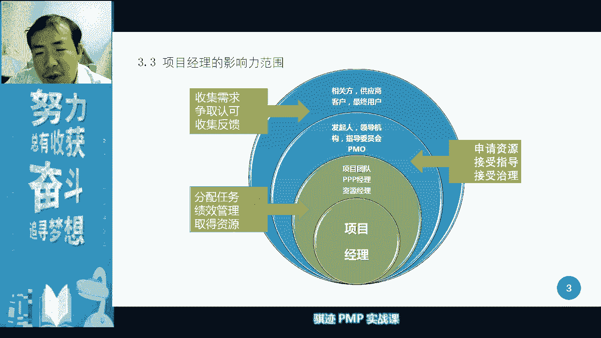
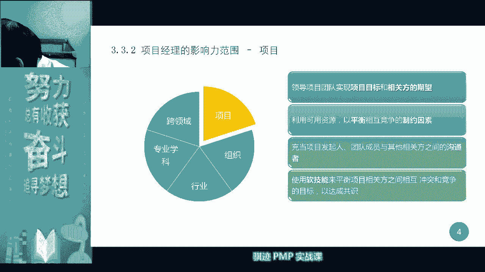
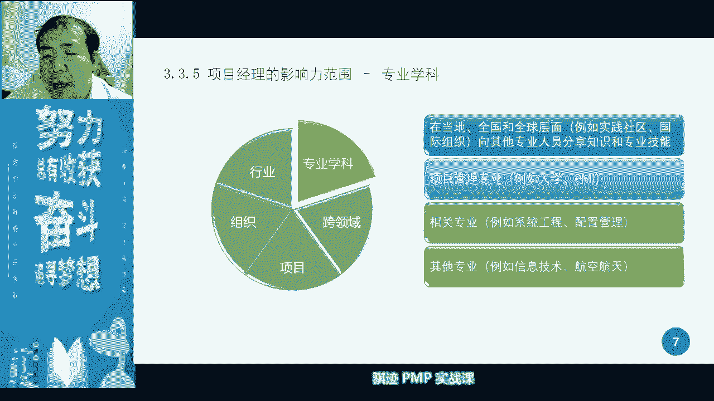
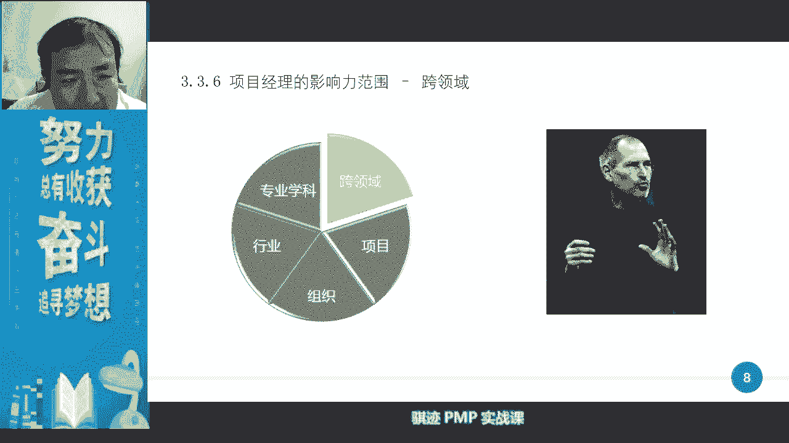
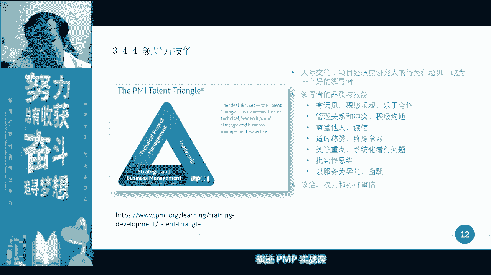
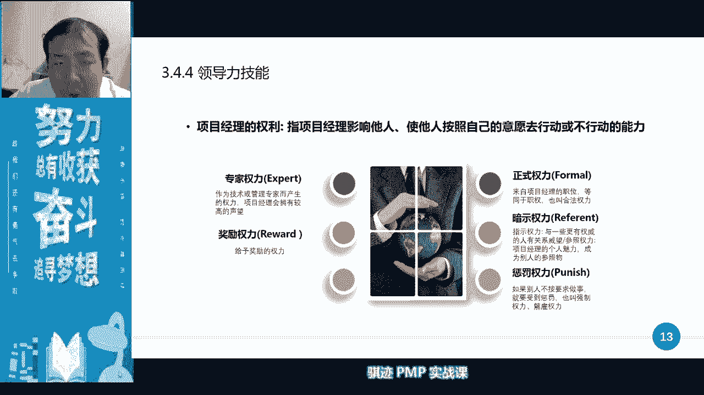
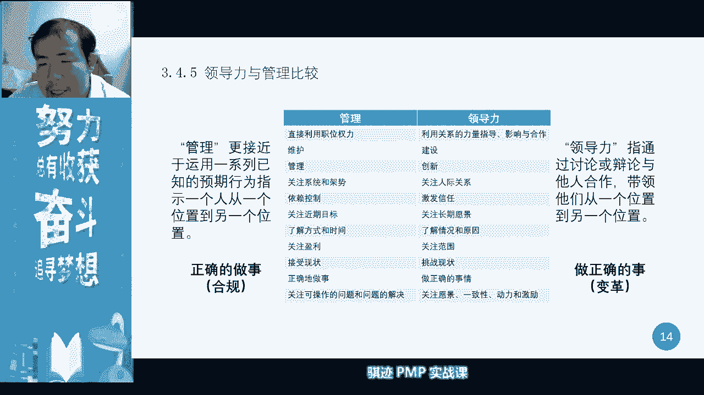
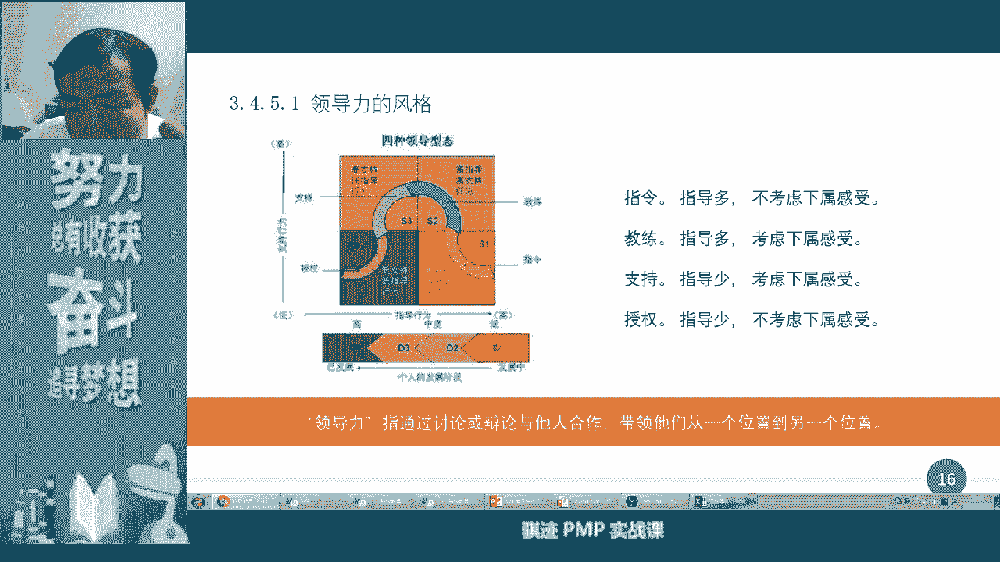

# PMP认证考试课程最新完整免费课程零基础一次通过项目管理PMP考试 - P5：PMBOK第六版 第三章项目经理的角色-5 - 骐迹PMP - BV1Sb4y1f7Yt

14好可啊。

这就行了，好我们来举个小例子，有很多同学啊，开始之前我们稍微等一下，其他同学，现在就100多个人进来啊，只有100多个人进来，ok大家要抓紧啊，你要抓紧，ok我的声音都听得清楚吗，同学们啊，ok啊。

我们先试一下音，啊我问一下子群里发现大家声音和画面都有吗，啊，啊抓紧进来了啊，好好好，我们有对吧啊，那么这样啊，新来的同学呢，我们稍事等一下其他同学啊，我们我们来搞一个很别开生面的加深。

对于敏捷管理的一个体验，了一个这样一个小互动啊，我们来玩一个叫滴滴打人开发啊，我们用不同的开发方式看，就是开发方式对于我们产品的软件，产品的影响对吧，然后我们用四种开发方式，我们就是正好我们学过的敏捷。

瀑布迭代和增量对吧，好看一下这是怎么玩的啊，当然这是个比较粗糙的一个例子方法，但是帮有助于大家进行分辨和记忆，那么首先在初始状态呢，用户反应啊，我我们想要一个一键打人的功能啊。

然后公司的啊a b c d4 家公司，然后就然后就各自推出了自己产品啊，a公司又使用敏捷方法，b公司那瀑布c公司是迭代，b公司是增量，啊是这样，然后那么第一周呢我们敏捷先出了一个。

然后敏捷我们说先出一个mvp的方法范围，mp的范围，意思就是说我们最小可用产品，我们讲敏捷里面我们是有初始详细定义的，好产品范围的啊，我们先看看用户要什么啊，我们想用户要一键打人，用户想要一键打人。

但是呢用户其实没表明清楚，一键打人是什么意思，他打谁还是被谁打还是怎么打对吧，用户指向我想要啊，这这就是很多我们市场所面临的很多的问题，就是说一开始用户是表述不清楚他要什么，甚至他自己都不知道要什么了。

那么这个时候你只要去探索，那么敏捷，我们说我们敏捷的方法就是我们敏捷的方法，敏捷的方法就是说先出一个mvp范围，然后呢，瀑布呢我们肯定是要，因为瀑布要尽量在初始状态下，要了解清楚我们的呃。

用户需求不明确分要了解用户需求，那么我们瀑布瀑布放瀑布的情况下呢，我们首先需求外尽量去排名用户的需求，而不是先动手对吧，迭代呢我们先试做一个迭代的状态呢，我们是探索，所以我们先试做一个。

我们直接就做一个一键打人，那么他可能一下打人的定义，兵的定义呢并不太好啊，兵呢不一定非常精确，增量呢我们也是增量，其实也有一个初始的最小范围对吧，我们上课讲过，第一个做完之后呢，我们上线了。

那么谁上线了呢，敏捷线上线了对吧，瀑布呢没上线，别的呢上线了啊，增量呢也上线了，好我们大家都上线，然后呢其实在第一周的体验当中，敏捷和增量是差不多的，敏捷和增量是差不多的对吧。

因为大家都是出一个mp范围嘛，假设大家的技术水平一致对吧，理解没有偏差，技术水平一致，能力也一样，那么呢迭代呢直接出了一个自己认为的产品，那么真是迭代的好处，它出产品快，但是呢不一定准。

那么在第二周呢就来了call，用户就反诶这个东西不好使，差评就是很多，很多我们在推出市产品，推出市场，用户经常会有的一种反应，因为你没有精确反映到用户的模糊的潜在需求，的真实反应，这是很正常。

那么敏捷会怎么做呢，第二周敏捷说用我们从用户的反馈当中，我们讲敏捷有个特征，需求来自用户的反馈对吧，那么我们先会去做用户的反馈的收集，那么我们会收集30个新需求，然后呢我们的能力呢只能先做十个。

还有十个，那么重点做什么，做自动匹配，为什么用户说啊一件一件打一件打人，做的不好呢，是因为他这个匹配一箭打人呢用时间太短促，太粗糙了，但是呢我们讲互联网时代就是快鱼吃鳗鱼，所以呢我们只能说啊先做出来。

所以大家仔细看这版本都会很粗糙，都会很粗糙，所以我们后面的重点制作呢是来自于用户反馈，最多了，能不能有一个自动匹配，但是匹配一个合适的相当的东西，然后从这个当中呢，我们其实已经慢慢摸索出了用户的思路啊。

他不一定说要去打谁对吧，他可能说我们也想相互打一打的手痒，那么瀑布在瀑布的状态下呢，啊在瀑布的状态，在瀑布的状态下呢，啊我们还在学需求，一需用户需求怎么多了好多，对吧啊，还没收集完需求，在迭代状态下呢。

我们讲啊，原来那个东西人家一键一剑的打人呢，不好使哦，不要了，推倒迭代，我们讲不一定就是说他获得市场反馈以后，它不一定是通过持续的货车市场反馈，去做改进的，这一点注意啊，你要取决于迭代的形式，当然了。

迭代如果他反馈收集的越好，根据反馈再做后面的开发做越好，其实它就越接近临界啊，我们假设这是一个很普通的反馈的开发模式，他的反馈呢只是一次性的啊，市场反应不佳啊，但是市场上我们想要做做成语音。

呼叫和语音这种方式啊，他们拿到了这种方式啊，那我们就做做看，然后呢增量里面呢，我们这他们也发现用户喜欢的做匹配，用户呢啊增量呢也做了一个增量啊，增加预约匹配的功能，然后又上线了，那么在第二周上线了。

大家看啊，敏在第一周当中，瀑布这一类型在第一周当中呢，先失去了主要的啊市场被迭代，增量和敏捷占据了，其中呢迭代呢，因为一上来呢他太过他的策略太过激进，往往呢是指实际上体验不好了。

所以现在领先的是增量和敏捷，那么第二周呢敏捷呢上线了用户所需要的需求，所以敏捷呢第二周呢做的产品呢，更符合市场需求，增量的增加了一份功能啊，但是呢增量增加了功能呢，它一般我们在增量的开发当中。

一般不会剧烈去增量，我们讲增量都是小步慢慢慢加1。1加一点，所以它跟上市场需求慢，所以在第二周结束的时候呢，通过用户的满意度和功能的跟踪呢，敏捷呢占据市场领先，其次是增量。

然后呢迭代呢啊重新摸索了一遍啊，他排第三啊，瀑布那东西还没有发布，那么到第三周了，第三招呢，我们用户呢终于明确了，我们想要一个自动跟踪匹配，旗鼓相当，对手用户总能明确一件是什么事情啊。

大部分用户需求其实不是去打人，他们需要相互打一打啊，发泄一下呃，呃顺便说一句，这个软件是真实存在的，但是在中国当然是违法，这个软件真的存在，这种人真的存在在哪里啊，我们的北边的邻居啊。

俄罗斯真的有这个软件，我真不，这真不是开玩笑，俄罗斯真的有打人啊，约约架软件啊，但中国这个很心违法了，我们上线就等着进进去喝咖啡了啊，啊第三周敏捷呢我们讲啊用户需求明确了啊，我们原来是自动匹配的。

我们现在自动匹配呢匹配什么东西啊，旗鼓相当的对手啊，匹配一个旗鼓相当的差不多的对吧啊，这样才打的有来有回比较好嘛，而且如果你跟对手旗鼓相当的话，打来打架，打蜡去相相对来说不容易啊，相互伤害严重对吧。

如果大家差别太大的话，很容易一个一个对方一个射手把他给打死，打伤了，这就不好玩了，对吧啊，所以这是我们优先的发展需要啊，那么看瀑布呢，哎呀又空又虚又又细分了啊，我们继续来调研助手瀑布仍然没有发布它。

它的市场还是为零，看别的呢，原来要用户想要相互打人啊，啊用户是想要预约，但用户的目的是相相互打人，那么我们再再迭代一遍，把前面三个功能全都加起来啊，去做一遍，而增量增量觉得我有预约功能了。

我要去丰富功能，增量的目的，并很多时候的功能并不是去改进原有的功能，而是什么，我们原有的功能机里面已经做了预约和匹配了，但是但是呢敏捷当中呢是把这个功能去细化，去做改进，增量更多的是什么啊。

我们要增加功能，所以说增量上我们车作一个本地附近功能吧，哦有可能也会很好对吧啊，这个时候我们增加了功能之后，我们看第三周，第三周呢敏捷依然正确了，领先啊，这个在这个例子当中，敏捷就占尽了先机对吧。

然后他的方向始终呢在小步迈快速往前走，瀑布呢仍然为零啊，迭代呢原来迭代呢，然后呢赶上来啊，在这个例子当中，可能跟自然的互有胜负，增长呢现在呢呃胜在什么功能丰富，但是呢他没有切中用户。

很有可能在增量的过程中，它并不一定切中用户的最需要的point，但是呢它增加增加了很多非必要功能，这是增加增加了弊端啊，所以这是增量开发的一个弊端，好我们在第四周，第四周呢用户的需求呢总在细化。

我们就不代替用户需求，但是我们看接下来大家会怎么做，敏捷接下来呢就会开始优化功能，寻找保护的需求和分开，打针功能的需求的进一步细化和细致，所以敏捷有敏捷的运转当中，不仅仅有迭代啊，有增量啊。

它还有一个优化，有一个不断提高，有一个重新自我认识的过程，会有这样一个过程啊，这个这个过程让敏捷呢，能够更好的满足用户的需求，有得到用户的市场反馈啊，这时候瀑布怎么说呢，哎呀我总算知道大家相互打架了。

我们要开，我要准备开始做了，然后呢迭代呢又要打人，要相互打，那么我们是不是要再改一版，再改吧，再做一把，把这个又打人又相互打呢做好，然后呢增量呢原来用户呢要相互打人，他真正的核心是相互打人。

我们几个功能虽然都能实行，相实际相互打人的功能，但是呢比较弱，没有直接切中用户的需求核心啊，我们再加增加一个相互打人，然后呢第四周结束，在第五周开始，我就看那个结果是吧，是从需求的定义的不明确，不准确。

到慢慢慢慢越来越贴近需求，增加用户粘性，所以你敏捷逐渐逐渐的就获得了我们的什么呢，获得了我们的用户的认可，所以他肯很自然的就会获得市场份额，而瀑布呢啊目前为止仍然为零，所以这就是为什么在互联网时代了。

很多我们的轻量化的项目的运用当中呢，瀑布越来越力不从心，就是道理大家看目前为止是瀑布，是唯一一个什么都没有做的，要开始做，但是它基金就来不及了对吧，在这个虚拟的例子当中啊，迭代呢一步一步走到这里之后呢。

他一步一步推翻了他，每一次推翻其实就会什么损失，老用户，因为老用户固有的体验被打破掉了，然后就去开发新用户，集资呢，万一推啊一推翻再来一推翻，再来之后呢，我们发现了什么东西呢，市场已经不存在。

大家都有对我们公司，我们的产品已经失去耐心了，那么都为什么都不用我们的呢，啊这就是结果，那么增量增量呢，它功能一个一步一个脚进去增加了，但你会发现它增加了这些功能，都没有直接切入到用户的核心需求。

但是呢增量往往也不会去修改原来的功能，而是换上面，在原来功能上去增加功能，所以在这样的环境下，增量其实也不是最适合，所以到最后你会发现你拥有一个什么，各种功能都有，但每种功能都不精的一样app软件。

叫这种滴滴打人软件，那么用户就反应这个东西不好使了，为什么一下子要我用这个，一下子那个人家叫我自己去理解软件对吧，应该是软件要适应，我不是我去适应软件好，那么经过这样五周的这样一个虚拟的各项过程。

大家看敏捷的开发方式，就在这样一个环境中胜出了，这就是为什么敏捷在互联网时代，高速市场高速变化的时候，能够占得先机的一个方式啊，ok啊这是我们今天上课上来，先给大家做了一个啊很虚拟的，但是很有意思。

我觉得这个这个这个段子很有意思的，这样一个虚拟的例子给大家说一下，为什么啊敏捷会在很多情况下更好用啊，以及敏捷到底是怎么用的，举了这样一个例子，当然这个例子中带有很多，我们啊啊相当于开玩笑这种成分啊。

那就不要当真，只是说用这样的例子来让大家加深，进一步的加深印象好，那么这是我们在上一节课结束之后呢，有些同学反，有些很多同学反馈的一个主要的诉求点，我们这节课呢正好等了一些同学。

那么我们就顺便把这个例子给哎讲调，那么我们今天正式进入我们今天的课程。

正式进入今天的课程，那么我们今天的课程是第三章，项目经理的角色啊，我希望大家都已经，这时候都已经在自己的电脑前和手机前准备好，ok啊很多同学现在有个感官印象吗，主要给大家有个感官印象啊，ok啊。

等一下大家，我们先开始第三章的内容呢不是很多啊，不是很多，然后在pmp的考试当中呢占的比例比较小，但是呢第三章在大家实践当中啊，很多东西还是有用的啊，我更多的会在第三章的课程当中呢。

给大家分享很多实践内容啊，这是实践内容，那么第三章讲的是项目经理的定义和角色啊，角色那么我们讲前三章，第一章讲的是什么，天使项目为什么产生，第二章讲的是地理项目的影响环境因素，那那些第三章讲的是人和。

项目经理应该扮演怎样的角色，把大家凝聚在一起，把项目做成功啊，这个天时地利人和的第三部分，人和那么一个项目其实最主要的决定因素，我觉得还是人和，人是一个项目中最主要的驱动因素啊。

这个那么我先来讲一下项目经理定义啊，项目经理呢是组织委派的啊，在项目管管理的范畴里面指的是什么啊，他的代表的是什么，大家可以在公屏里跟我说一下啊，啊目前为止只有370多个同学上线了啊。

今天的出勤率还是有点低啊，同学们呃，授权战略ok啊，非常好啊，我看到很多同学都回答了对吧，项目章程啊，因为我们前面之前学过项目章程，是授权项目经理的正式文件，一个项目要怎么样才能够证实有效的产生啊。

成立和产生呢是项目章程的，要通过项目章程图，通过有两个含义，第一个含义呢是我们当然后面也会再讲，第一个含义是啊，项目已经正式确定要做了，第二个呢是项目经理已经被正式授权了，还有这样的还啊，啊组织委派啊。

所以我们讲这是项目的开始的边界，那么项目经理的主要工作是什么啊，领导团队注意啊，注意领导团队，领导团队实现目标，那么项目经理在工作中，是不是要直接参与项目工作呢，取决于各位的定位资源和各种情况啊。

并不一定在偏偏卖的定义当中，项目经理一般是不直接参与项目的具体工作的，项目经理主要负责的是管理处管理，当然也不是治理啊，是管理项目管理，那么项目治理是谁啊，想一想啊，想一想啊，谁啊啊，很好啊。

我相信很多同学也是能反应过来啊，po对吧，po那么项目的目标呢是什么，项目的目标呢，是实现我们的项目的一些利益对吧，比如说这个什么先赚他个三五亿对吧，实现赚他个1亿小目标之类的啊。

啊这是我们家p p p t当中的一个小动图对吧，这是项目的一个目标，所以项目经理的定义当中呢。

就是由这三部分组成对吧，那么具体我们一点点来看啊，首先我们讲项目经理它又会有一个影响范围，影响范围从内到外，离项目最近的人，离项目经理最近的人，项目经理越能够什么越能够影响到，也能影响到啊。

所以理想目经理最近的是谁呢，项目团队资源经理p p p经理啊，p p p经理是pm pm，他我也不知道为什么他不要加，这叫呃公对公对私的一个经理啊，主主要负责什么公司啊，公价对四人的业务的管理啊。

ok啊p p p你们可以自己搜一下好，这是我们的经理，那么在这个当中呢，我们讲项目经理，当然取决于不同的项目的组织形式，项目经理肯定会有权利大小，但是项目经理肯定能够管道的人是谁呢。

已经明确被分配到项目当中，听项目经理指挥的那些人叫项目团队啊，那么其他至于一些啊资资源经理呀，职能经理啊，这些东西呢，他们更多的是什么呢，他们更多的是可能要对他们进行一些影响影响，但是他离你比较近对吧。

那么就初期来说，在一个项目的初期来说，一个项目当中，在项目初期谁是项目经理的天然盟友，你们想想谁是项目经理的天然盟友啊，这句话其实不是随便问的啊，不是随便一个项目在开始的时候，最初始阶段，起始阶段。

谁是项目经理的天然盟友，啊公屏上告诉我，啊公屏上告诉ok啊，非常好啊，很多同学还是概念还是相当清楚的，概念还是相当清楚，嗯对项目经理的在项目初期的天然盟友是发现，为什么不是团队，因为团队里面的有些人。

可能不一定愿意到你项目上干活，被你硬拉过来，有可能的对吧，或者是对你心怀不满的，也有可能，但是发起人肯定是你天然盟友，为什么知道在初期，因为项目是他发起的，由他提供资源站资助的，所以他必然是要支持你。

否则就要打自己脸对吧，所以发起人肯定是一个项目，你的在初期的天然文，但后面就不一定了，可能在后期呢发起人更换了，或者是发起人呢对你的态度转变了等等，一些复杂因素有可能导致发起的态度变化啊。

有可能大家知道初期发起人是你听了，所以在初期我们将要获获取一些高层次的支持，高层次的帮助的时候，要通过一些高层次的动议和修改的时候呢，我们会去找发起，注意啊，找发起人一般只有两件事情，第一要钱。

第二改章程，一般来说一般来说只有这样一件事情，除非一些影影响到项目成败，非常重大的一些事，一些事件的应对和处理啊，选择有可能会我们也会去找发钱，除此之外，我们一般是不会涨发钱啊，这点要明白。

发起人很忙啊啊ok啊，这是所以在项目经理的那个这个三个圈当中的，第二个圈当中呢，和和c g b对吧，和po这些人呢会帮助我们的申请资源，会指导我们要求我们接受质疑，这是帮我们协调的第三种人。

第三类人呢就是离我们最远的，各种的相关方客户，最终用户对吧，这些人呢我们可能很难影响到他对吧，pmp的默认角度是乙方，那么我们在面对甲方爸爸的时候，只能什么啊，跪舔对吧啊ok啊，这个是错的啊。

但是我们很难影响到甲方，这是这是肯定的对吧，跪舔就不要了啊，人还是要尊严，这是项目经理影响范围，所以你要明白，成为一名项目经理之后，你对谁影响最大。

谁可以争取谁呢，影响比较小，但是呢要积极的去争取好，那么项目经理就是项目经理影响范围，那么在项目经理的影响范围，在不同的领域当中呢，在项目当中呢，项目经理呢是发言权很强的。

项目经理呢会使用团队的领导技能对吧，来实现我们的项目标和项目方，期望领导团队的领导力对吧，然后可以利用可以利用的资源，平衡竞争的制约因素，充当项目的发起人，团队成员，其他相关方的沟通者啊。

以及使用软技能来平衡啊，这中间的软技能呢会很多，我们后面在啊团队啊，资源管理当中呢会讲到啊团队管理，团队建设当中会讲到很多软件的，在这里呢我们先跟他跟其实大家沟通一下啊，这样有这样一个概念啊，我问你们。

你们从内心里跟我说啊，问你你们每一个人愿不愿意被别人管理，愿不愿意被别人管理，有人说不愿意，不是每个人都愿意不愿意太阳，我有人说我愿意管别人，哈哈哈哈啊，这位同学也挺有意思的啊，啊如果从呃一般意义上说。

这个世界上的所有人，从内心深处的根本来说，几乎所有人都是一样的，不愿意被别人管理哦，那我们再换一个话说，你愿不愿意被别人领导，愿不愿意被别人影响，愿不愿意被别人感染啊，愿不愿意啊，那肯定是要好于这个的。

所以项目经理在管理一个项目当中，在管理人的当中更多的是应用于管理，还是应用于其他，我说的后者啊，不言自明对吧，肯定是管理是不可避免的需要用到的，但是呢我们更多的是运用管理以外的东西。

这些管理以外的东西都叫做软技能，二技能，明白了吗啊，啊。

有些人就要说愿意啊啊你们，我懂了，啊，那么项目经理对组织呢它的影响呢就比较小了，但是呢我们对组织可以提出哪些要求呢，要求组织啊多给点资源对吧，组织他多分点钱给我们对吧，然后呢。

组织大家看看能不能接受我们的，做出来的成果对吧，然后呢和组织保持一致，合作是保持一致，所以项目经理对组织影响力量非常小，非常小，非常对于行业呢基本上是受行业影响。

因为行业背景其实已经是一个事业环境因素了，对吧对吧，事业环境而且是一个什么事呢，是一个外部的事业环境因素啊，要居住外部的事业环境，因素，然后产品呢开发呢，然后呢市场呢这技术的标准呢。

这些东西呢都是受行业影响的，不是说你项目当前的影响啊，它是影响项目当前的很重要的一股力量对吧，而且能够影响我们的学科啊，一些东西，项目经理影响范围当中，在当地呢，全球呢有人呢像其他专业人分享这些知识啊。

比如说项目管理，项目管理专业，比如说大学pmi这些东西，这些东西也会对我们产生影响，比如说pm明年把我们的pm box的定义改了，说是项目经理就是比职能经理大啊，对我们有没有影响，当然有影响。

我们以后就可以拿着pm说啊，我就是比你们大对吧，然后然后被人家怼回来对吧，ok当然不可否认的，学术界是会对行业，甚至都有项项目是会有影响的啊。

无论是在技术上还是在管理上，会对我们会有影响啊，消灭零有时候还会产生一些跨跨领域的影响，这里放了个乔布斯啊，严格意义上来说啊，很多人把乔布斯定义为产品经理，我觉得对的啊。

那么这里要提到一个产品经理和项目经理啊，因为这节课呢其实很多的内容呢，其实更加的是大家以理理解理念为主了啊，所以我帮助大家变性，产品经理和项目经理的区别是什么，我们会有一个很通俗的解释啊。

一开始可以有很通俗解释，产品经理呢是把产品做好，项目经理呢是把东西做对啊，做对完成，那么产品经理和项目经理冲突不冲突，在很多角色上，你们想想其实是会有冲突的，因为很多时候你觉得是一个好产品。

但是它在项目完成上并不容易完成，甚至是可以说认为可以说几乎不可能完成，但它这可能就是一个好产品，所以产品经理往往要设计出一个非常好的产品，要什么呢，都要可能要挑战一个项目，能够实现的一个极限啊。

他才可能做出好的，所以乔布斯总是喜欢设计出一些啊，难度非常大的产品啊，比如说尤其是iphone对吧，前几代iphone，尤其是乔布斯设计的几台iphone，他的挑战性，但是跨越性都是非常强的啊。

对工程技术啊等等，产品研发以及产品的生产实现，都提出了非常高的挑战啊，所以安丰当年一直生产磕磕绊绊，所以才会伟大，但是做乔布斯这样一个伟大的啊，乔布斯更多的被认为是产品经理，伟大的产品经理。

背后的项目经理的人是很苦逼的，尤其是苹果的啊，下游的供供应商，那就更苦逼对吧，那个甲方爸爸更惹不起，要求更多，所以在这种情况下，你明白了啊，产品经理和项目经理有时候是会冲突。

那么更多的我们认为产品经理呢是对外的，是向外去负责的，为市场负责，为组织向市场负责的，而项目经理呢更说对的不对内的啊，他是对什么呢，对团队向团队和自己的内部的相关方负责，为了把这个项目能够做成功。

产品年龄，有时候他可以甚至可以不在意项目成功与否，他只要他专注的某些产品成功，就可以，因为有时候整个项目失败而产品成功的例子，有没有有啊，因为这个产品可能不是项目的主要目的，啊可能不是像我这种目的。

啊要不要我给你举个举个小例子，很有意思啊，就是说啊现在可能大家都知道了啊，辉瑞公司最有名的是省是什么呀，啊啊如果如果你比较熟悉的话，空姐啊啊嗯呐大家懂的对吧啊，辉瑞公司当年研究那个蓝色小药丸的时候。

他的目的其实项目目的是什么呢，他的目的是治疗心脏病药，所以那个药，其实到现在也有1%到二的使用者，是不是用来啊解决男性的难言之隐，而是用来解用来进行什么心脏治疗的，因为它可以扩大心脏心血管。

然后扩大心血管供应，然后改善心血管供血状况啊，是这样，但是呢他整个项目最后的心血管领域呢，是失败的，他的项目目标没有达成，但是它的产品却成功了啊，非常的成功，给辉瑞带来的巨大收益啊。

所以这就是典型的一个什么项目失败，而产品成功的例子，ok啊好，那么我们继续看，那么我们讲了。

前面讲的是第一部分，讲的是项目经理的影响范围，那么接下来讲这个东西呢，是本章节当中呢最喜欢考的是吧，相对来说最喜欢考的是第六pmbok，第六版新提出来的啊。

项目经理的能力三角的pmi talent triangle，项目经理能力三角它分为三个部分，第一点技术，项目管理，啊所以这个这个我们分三部分讲啊，这个这一部分上来很多的人呢就会有误解啊。

技术项目管理就是说管项目一定要有技术对吧，要懂项目的相关的技术对吧，ok其实不是，其实不是技术，项目管理更多的是什么呢，就是说不用你项目经理知道很具体的技术，但是你要知道运用特定的技术。

能够实现我们项目的技术需求角色，如或者说是识别我们人，项目当中人所具有的技术的方方面面，看看他是不是能够履行在项目当中角色的，一些技术能力，是这样，所以你是管好技术，而不是去懂技术，但是懂技术更好。

所以这是pmi和啊，怎么说呢，实践的一种妥协啊，总结那真要讲点历史，pmi在pmbok的之前，基本的定义当中是这么认为的啊，他的但是他没有直说，但是他默认是认为，项目经理是可以不用懂能力的。

他只要有一种技术，什么项目管理技术就能管好项目，这是偏慢一职的，认为认为项目管理也是一种专业技术啊，不是一般人的会，然后呢第六版，当他终于承认了，光有项目技术的项目的技术管理的啊。

像有管理项目的技术能力测试啊，这表达有点问题啊，但是如果没有专业背景的技术背景知识啊，一定被一些专业的背景，那个技术的能力，他也很难把项目管得非常好，这是pmi经过多年的时间之后，向时间妥协的一个结果。

所以这一条是其实向时间妥协的结果，但他仍然认为是项目经理不用很强的技术背景，他只要知道识别哪些地方要用到哪些技术，至于用什么技术对吧，这是由技术工程师解决的对吧，项目经理只要知道啊，我们开发。

比如说开发应用程序，我们要用到java和p h p对吧，然后让程序员去查java和ph p到底哪个是最好的，世界上最好的语言对吧，这是个啊i t界已经讲讲烂的端，但是依然依然有依然有意义对吧啊。

现在已经不用争了，现在说有人说了，python才是最好的语言啊，一代一代新阳胜就换对吧，ok啊，第二部分呢叫做战略和商务管，零零战略和商务管理呢是什么呢，就是去识别啊组织的战略。

然后呢去对接客户关于商务方面的东西，因为组织对接组织战略，可以把我们的项目沿着组织的发展方向去做，你要知道，如果一个项目往组织最希望的方向方向去发展，去走，最容易得到组织支持，最大的组织哪个层次支持啊。

组织关于项目的哪个层次支持啊，来来来回答一下，来公平上回答一下，有没有人回答，组织从项目的哪个层次上是去管战略，然后对项目进行战略层面的管理的是哪个呃，发起了po啊，我说项目的层次是我们说的是项目层次。

项目层次啊，po是一个组织这个组织机构啊，啊我们还记得吗，呃项目组合，项目及项目对吧啊，决定组织战略的是项目组合，这个层次还记得吗，ok啊不要忘记啊，所以往组织的向量方向靠。

最容易得到什么项目组合的支持，也就会拿到更好的资源，所谓的会哭的孩子有奶吃对吧，你要会哭，什么叫哭呢，哇酷炫说我和组织的交流是很符合的呀，我为什么拿不到资源，我的项目做不下去了对吧，好好好ok啊。

这个其实是一个很实用的技巧，当你们以后管项目，你会发现项目当中很多时候，资源就是要去争抢了，怎么去争抢，你要表达出你是最符合组织战略需求的啊，那么你就能拿到资源啊，商务呢这就是客户那方面对吧。

嗯甲方爸爸的自然要伺候好对吧，然后呢商务管理方面管得好呢，还可以什么管理好需求，我们讲需求是直接影响范围，范围是一个项目的字母，它是它的基础对吧，所以商务管理其实很重要。

商务管理就是知道很多商务的一些啊，必要的环节，必要的规则啊，这样能更帮助我们更有效地去管理项目的范围，最后一个是领导力啊，这直到记忆团队所需要的知识啊，领导力是什么呢，领导力各个跟每个人的解释不一样啊。

这是我们后面会继续看啊，我认为领导力是一种什么能力，我认为领导力是一种，带领大家往正确和成功方向走那种能力啊，这叫领导好，那么我们先看一下p p t啊，技术项目管理能力，我们讲是指项目项目。

项目组合管理向特定光知识及角色履行能力啊，它帮助我们的识别项目的关键成功因素，完成这完成制定完整的计划，并执行优先级，指定的财务报表风险等等，然后管理项目要素啊，然后这这一部分呢解释呢我们的ppt解释。

那啊可以，这是官方的解释，那么但是我们实际当中呢我们讲更多的认为啊，技术项目管理，技术项目管理的呢，tp m呢更多的是什么，是把技术和管理难融合在一起，以管理带技术啊，你看就明白这个意思就可以了。

那么第二部分战略和商务管理能力，我们讲什么，了解企业的使命愿景，战略目的目标，ok啊，记得吧，使命是什么，使命是mission，愿景呢是vision教练的strategy。

了解组织一系列这样一些背景知识，更好的有助于我们什么服务组织提高绩效对吧，然后呢争取资源，然后以及专业专业知识技能对吧，然后了解到市场竞争，了解到市场环境，这些市场环境。

市场竞争也是我们商务的一部分东西，那么第三部分呢就是领导力，领导力是纯的一种人的能力啊，领导力这部分呢其实在项目管理当中非常重要，但是呢我们考试没办法考啊，没办法考，考试当中呢你也能考。

但是他问出了问题，对于我相信对于在座的所有各位来说，都是非常简单的，作为一个呃从考试中出生，在考试中长大，在工作中还要经过不断考验的中国人来说，这些题目太小儿科了啊，那么领导力有哪些呢，什么有远见啊。

积极乐观啊，乐于合作啊等等等等，这些东西都是值得称赞的啊，那么我只是我们只是谈一些个人的观点啊，当时也当然也说也是，当然说也是给大家提个醒啊，我认为啊有时候领导力来自于哪里啊。

领导力来自于别人对你的信任啊，如果别人不相信你，领导力是没用的啊，如何体现，对不对，你可能是一个很有很强的领导力的人，但是别人不相信信任来自于哪里啊，新人来自于做出自己的行为规范模范。

个人的行为模仿又最后来自于哪里呢，我认为第一个啊，就是就是我要批评很多今天来的晚的同学啊，有一个素质是一个项目经理必须要有的，叫做守时，守时啊，是是最少时间，你看我们课程已经开了多长时间了。

还有很多同学没有来，很多同学是开课之后很长一段时间才进来，这不是一个手势，手势，因为如果两个人初次见面，我们彼此初次见面啊，那么我们相互不了解，那么我给对方的第1年或第一对方给我的印象。

如果我们俩不是相亲谈朋友的话，那么不用看外表，那么我怎么了解你第一反应是什么，你有没有准时，如果你能够准时遵守时间的话，我初步印象就会对你有什么呀，你是一个诚实守信的人，你是一个遵守契约的人。

这会是给人第一印象好印象，所以很多很多很多的理论方面，我们都强调什么，守时是人的给人第一好印象的一个基础，以此为基础，你可以给别人持续的留下好印象，那么自然而然，你容易对别人产生有影响力的这种感觉。

所以作为一个比较好的称职的优秀项目经理啊，他们会非常注重首饰，非常注重手势，所以项目经理，所以很多人说项目经理，尤其是有好的项目经理会有个特征，一天到晚不是看手表，就是看手机，他们不是在玩手机。

而是说要看时间，他们要安排好时间，同时说要尽可能的在繁忙的工作中要守时，只有你守时了，别人才会守时，然后呢项目才能按时就绪地去做完，明白吗，这是一个很小的行为，很小的品质。

但是它会逐渐逐渐影响到很多东西，不知道已经来参加课的同学明白了没有，如果你今天如果是因为啊，有工作情况不能来的话，ok那没有关系，如果是因为一些其他情况拖沓了，早晨没有赶上课，如果你回看的时候。

我希望那些同学啊也要做，也要做好，这一点就是守时啊，是是ok啊，这是领导力，那么这个三角是在我们pm的呃，人呃人的能力，人才三角当中的是三个支柱，但是注意一点就是，项目经理最主要的能力是什么啊。

其实很多人说项目经理呢是沟通对吧，但沟通不在里边，为什么沟通不仅仅是个人能力，在一个项目当中，项目经理一个人会沟通是没用的，要所有人都会沟通啊，所以一个项目的沟通管理好坏，不仅仅取决于项目经理自身。

还取决于他的管理和这个团队啊，所以他没有把它放在这个人才三角里边，人才三角里面。

但是你们只要知道这一点就行好，那么按照传统来说，那么pmi就会讲项目经理要有领导力，那么怎么样展现他的领导力呢，会通过以下五种权利啊，权利西方人觉得权力会写，会显示出你的领导力对吧。

要power离大学的啊，离得学啊，游戏啊，通过什么展示啊，抛我来展示，那么项目经理哪哪些power呢，专家权利啊，那么项目经理呢可以是什么，被认为是一一种一个专家，一名专家啊。

那么他可以被认为是一个什么技术管理，技术管家或者管理专家，所以他会终老，但是有时候项目经理其实并不懂，但是因为他的title是什么，是项目经理，所以很多人认为他应该懂啊，所以项目经理有时候比较苦逼。

就说你比如说你是某软件开发的项目经理，其实你不懂软件开发，你不是写代码出身的，你可能是什么啊，做产品出身的，你可能不不懂起来嘛，但是呢别人觉得你是软件项目的项目经理啊，那么你应该懂软件开发。

那么你应该懂具体怎么解决技术问题啊，这是很无辜啊，这是专家权力带来的负面一种印象啊，别人觉得你既然是管这个项目的，那你应该什么东西都懂，其实不是啊，这些人是对项目有误解。

项目呢是要每个人发挥自己正常的一种事情，第二种权利呢叫奖奖励啊，奖励权利与之相对应的呢就是惩罚权，奖惩奖惩对吧，奖励与惩罚是应该是并重的，那么你们想一想，在管理一个项目当中啊，这个我们后面也会提到。

在资源管理当中也会提到，在一管理一个项目当中，奖励和惩罚能不能偏重一个，或者是能不能没有一个啊，你想想有没有答案是没有，不能没有，但是你可以在可能的情况下让他尽量不去运用，是可以尽量不去用惩罚的权利。

因为惩罚虽然能够达到底线的作用，但是惩罚并不会直接，大部分情况下并不会直接提高生产率，毕竟也更加不会提高士气啊，会会有这样的情况，所以惩罚是不会让别人去啊，什么执行性吧。

大部分人在面对惩罚的时候只会有不满，但是呢因为你有惩罚的权利，所以他就服了你，所以惩罚有时候是不得不运用的来用，所以你看一个好的领导一般都是什么，不会轻易去惩罚别人的啊，相反运用惩罚啊。

有些事情是很蠢的，运用惩罚去显示你自己有权利的，这样一种行为是最愚蠢的，一个领导者，永远不会是运用惩罚这种方式去显示有权利，一个领导者可以去运用奖励的方式去显示自己，有权利，可以的，我可以给你奖励。

我可以给你表扬，我可以给你奖金，然后呢但是呢这是我的，这是我的管理意愿造成，然后这是取决于我的权利与权力，带来的一个人的影响啊，你可以通过这个方式去彰显啊，所以从某种意义上来说，比如说大赦天下。

这是一种奖励吧对吧，你本来坐牢了，我大失天下，体现出你的权威啊，体现出这种领导力，比如说重赏群臣对吧，这是一种奖励，他要表现权利什么啊，这种都是不好的显示器啊，短期内可能别人会怕你。

其实不不等于说你有领导力，或者并不等于说人家这人家真正幸福你，所以惩罚权利要谨慎使用，相反当然奖励也要谨慎使用，奖励的过度奖励会带来一些很负面的作用啊，我们在资源管理当中会详细讲啊，这里就不多说了啊。

那么项目经理还有两种权利叫正式权利，叫做合法授权，因为他是因为你是项目经理嘛，对吧啊，有些项目就是说甚至说有些管理好，甚至说有些说法啊，给啊千条狗过来，坐在项目经理的位置上，这事情也能办成。

那么那条狗就叫项目经理，但其实他只是因为职权叫项目经理啊，当然这是这是个笑话，那么很多时候项目经理，很多时候的你的权利呢也来自于正式授权对吧，所以项目章程是很重要的，这有时候呢有些人呢服从于组织的权威。

但不一定服从个人，那么上来你要让整个项目团队的运作起来，那你只有依靠什么组织权威，然后慢慢慢慢培养自己的个人影响力和领导力，对吧，所以真实权利也是必须的啊，这不可或缺，最后一种暗示权利对吧。

暗示权利呢看上去更像什么狐假虎威对吧，和和更有权威的人呢啊，想参照或者说有关联对吧，有关系啊，那么这个时候呢，项目经理的个人魅力呢就被联系上了，对吧啊你们快说啊，我和国家领导人是老乡啊，哈哈啊。

其实国家领导人根本不认识你啊，你认识他，他不认识你对吧，ok啊那你说明家境还不错，你也这样，但是人家可能根本不care你对吧，但是这种暗示会让别人觉得你有幸福感对吧，相信或者说啊。

我和行业的某某技术权威呢是同学，那么人家也觉得哦，你你你这个人可能也是什么，也是权威对吧，或者权威的沾边的对吧，所以这种叫做暗示权利，所以项目经理呢要运用这五种权利呢，去做好事情。

这五种权利都会帮助我们啊，按照使他人按照自己的意愿去做或者不做啊。

知识项目经理的一种啊领导力技能的体现啊，那么领导力和管理我们讲怎么样呢，啊这个是我们经常做辨析的，如果你运用领导力呢，那么我们就在什么，是利用你利用一些软件的软件。

大家可以看一个叫的管理呢是直接使用权力，我们前面讲了管理都是冷冰冰的，如果我们讲到管理，直接讲管理都是冷冰冰的，冷冰冰的东西，人们都不喜欢啊，就没有新来改对吧，我服你，只是因为你是项目经理。

你哪天没有权利的，我我正眼都不强硬一下也可以对吧，但是有领导力就不一样，所以领导力的很重要一条啊，大家中间大家可以看到有一条很重要，一条叫激发信任啊，考试当中经常会问啊，领导力的体现体现在哪里啊。

很重要的是激发信任啊，那么领导力呢很注重什么，要做正确的事，注重正确的事，做正确的事，做正确的事，有时候领导力会带领大家走向一个，大家都认为不应该做的事情，但是如果真的走出来了，走对了。

那么你会产生巨大的领导力啊，这领导力作用，领导力总是带大家，你如果有领导力，你总是会大家往做正确的事情的方向走，这叫做领导力，而管理呢不一样，管理反而是什么，正确的做事情循规蹈矩，管理永远如果依靠管理。

永远是不会创，单纯的依靠纯粹的管理是不会创新的，他也不会突破的东西，它是循规守旧，依靠组织赋予的权利，去维系我们整个体系的运作啊，所以如果单纯依靠管理去管理一个项目呢，这个项目的活力生命力是不会很高的。

这是领导理科的我们的管理的一些区别啊，啊大家注意辨析一下，考试呢也有可能考到，但是这个呢相对比较简单啊。

我给大家讲明概念会比较简单，那么我们看在一个项目管理当中啊，一个在一个项目管理中，那么啊管理呢总是向合规的x方向走，那么x和方向和y方向呢，x方向和y方向如果都有的呢，那么就又有管理能力，又有领导能力。

又有管理到应有领导能力，这是一个什么出色优秀的管理者，那么如果来了，如果有一个人有领导能力，但是没有管理能力呢，这个人呢啊我们可以叫他什么啊啊莽夫啊，莽夫就会鲁莽的做事情，莽夫啊他可能呢可以做做什么啊。

可以做一个啊技术探索者啊，技术专家啊之类，因为他可以带领大家去做事情啊，找到方向，但是他他不会管人，不会运用权力，那么如果一个人没有领导能力，但是有管理能力呢，他只会守住家业，但是不会创造机啊。

创造业绩，他只会守住业绩，不会创造业绩，那么最惨的当然是又没有管理能力，又没有领导能力啊，这种人呢就不太适合做管理岗位啊，如果要做管理岗位，你至少要做到234啊，不能做到一啊。

但是从我们的管理的要求来说，管理管理要求来说，二和四会更好一些，二和四三的话，其实也不太符合现代企业的诉求啊，你现在企业诉求呢当中，如果你有领导力啊，没有管理能力的话，啊是这样啊。

不知道大家理解了没有啊，我们继续讲继续讲，那么领导力当中，我们讲领导力当中会有领导力的各种风格形态，风格形态啊，有些人呢喜欢什么啊，做指令，做指令，下指令，有些人喜欢下指令，下指令多的呢。

一般来说呢比较怎么说呢，不考虑别人感受，有些人呢喜欢下指令，但是呢他会考顾及到别人的反馈，顾及到别人的反馈，那么这种呢叫做教练教练，那么有些人呢他指令下的少，同时呢又会照顾别人的感受。

这种这种方式呢叫做支持支持的领导力类型，最后一种领导力类型呢是知道的越少，也不敢下手啊，这种就是充分授权叫放养，那么这四种领导力的，你们觉得哪一种更好一些，啊有人说啊，文臣是二文，五官是五成是三。

好好ok啊好，你们看领导力风格，我先问你们这四种领导风格里面，或者说你们更觉得更喜欢哪一种，你们更喜欢哪种，教练型啊，有些人看情况没关系啊，我们现在是互动时间，这节课的时间比较充裕啊，时间比较充裕。

杰哥的内容不太多对吧，但是他和别的内容合在一起呢，又觉得太尴尬，所以今天这个不会上的时间很长啊，老人支持，ok还有互动的吗，这样练知识ok啊，从个人的感情上说，每个人会选择不一样，但是说从理论上来说。

不是都不可取的啊，第一种迟早得多，不考虑下手感受，偏向于指令性，是不是大家第一感觉是什么啊，不讲道理呃，受文化，受文化体系，文化体系的影响啊，很多时候大家就觉得是个负面词汇啊，但是在项目管理当中。

它是个中性词汇，它是个中性词嗯，啊个人项目经理个人说了算啊，然后呢也有很多指导，而且不考虑感受，那么这种时候其实都是适用的，那么它适用在什么场景，第一它是用什么，有一些项目他要快速的做出结果。

但是呢项目团队呢可能面临很多困难，它需要很强的执行力，当去选择需要很强执行力的时候呢，你会选择更多的项目经理，你会选择什么，他就读才行，你得用指令的方式去管理项目，产生这种领导力风格啊。

还有一种形式是什么呢，比如说你的项目团队啊，比如说你的项目团队，你的团队当中很多的人呢，或者说呢啊自我觉悟比较低的啊，那么最正常的，比如说你的项目当中，比如说你是一个工地的，比如说我们像工地的。

你下面很多呢是普通的施工的是农民工，那么这个时候你不能做什么事情，都听着农民工的，对他们有些技术意见，你可以略微听一下，但大部分情况下，他们都要等待你的指令去做啊，你只能指挥他去做什么，他就做什么。

他不会有自己自主的意见去做啊，应该做什么，应该做什么啊，你们试想一下这些场景啊，或者说像很多餐饮企业管理名言，是的啊，或者服务型企业里面，因为所管理的人呢，他们处的是比较初级的岗位。

这些人的人员素质呢不会特别高，这种情况下，他们更多是等待指令，等待指令去干活，而不会有很多的主观能动性，更加不会有很多思考，所以这个时候你给他思考反而要出乱子，你给他指令，你给他命令反而能做得好啊。

所以在一些很多劳动密集型的企业当中呢，他们很注重什么听命，很注重听力，一个人的是技术能力水平高与否并不重要，最主要的是把听力，这是很多劳这是很多劳动密集企业的特点啊，也就很多劳动密集型项目。

劳动力资源密集项目会有特点，所以不要说第一，领导力风格他其实是有动的啊，只不过他是在，只不过它是在特定的环境下会有一轮啊，会对上第二种指导多，但是考虑下属感受啊，第二种教练型对吧。

那么教练型的教练型的领导力，领导力风格呢这种呢他一样是用，但是他会他会跟他商量，那么他一般会是怎么样呢，领导一些比较风险高的项目，因为风险高的项目一定要什么，大家进行合理，所以这时候要要求大家行动一致。

但是风险高的项目绝对不能说考虑风险，很多的风险绝对不能依靠项目经理，自己一个人，不能靠医院项目，他要团队的力量去克服各种各样的风险，那么在这种设定下的话，那么教练这种形态就比较好。

