# PMP认证考试课程最新完整免费课程零基础一次通过项目管理PMP考试 - P6：PMBOK第六版 第四章项目整合管理-7 - 骐迹PMP - BV1Sb4y1f7Yt

反正教学时间啊，整我们开始第四章项目整合管理啊，项目整合管理，那么第四章开始是p m p的十大领域，知识领域的开始，那么为什么要把整合放在第一章呢，因为整合的工作都是项目经理负责的。

整合的所有的工作都是项目经理负责，是不能推卸的，但是项目经理呢在管一些比较大的项目的时候，很复杂，项目的时候可以有项目管理团队，可以有一个团队，比如他可以有一个有几个助手啊。

或者甚至有一个专业团队帮他进行统一管理啊，统一管理，但责任是不能推卸的，就是整合的特征，所以项目经理工作的这个知识领域，主要工作知识领域，就是整合管理的这个知识领域啊，所以我们放在第一个讲，这是你们的。

作为现在的项目经理和未来的项目经理，要做的一个事情啊，就是整合，那我们先看什么叫做整合呢，什么叫做整合呢，啊我们理论上讲pmbok的理论上讲叫识别定义，组合协调，其实说穿了整合就是把方方面面的事情。

你们可以用很通俗理解，就把方方面面的事情呢放在一起协调统一啊，不出矛盾，不出岔子，能够1+1=2，这就叫整合啊，这叫整合，就好比说你们要盖个房子对吧，我们讲盖房子是个很很典型的一个项目对吧。

项目管理在工程领域啊，建筑工程领域是应用的，是很多理论是非常非常的非常非常的深入啊，非常熟，那么我们举个叫建筑的房间内，那么建个造个房子，那么它有很多方面要房子要有我们造房的房，房屋的范围了。

造多多高对吧，多少层对吧，层高什么等等，这一些东西有范围有进度对吧，我们要多久造完，有成本对吧，我们要花多少钱去造，那么还有工程质量，我们的房子要要达到什么样的工程质量标准，是不是啊。

那么楼都倒楼塌塌楼歪歪这种对吧，要避免对吧，还要克服风险，比如说我们项目当中有什么原材料涨了，涨价的风险啊，比如现在疫情期间，都有可能有什么有疫情的风险啊对吧，诸如十连啊这些东西都会有啊。

所以这些都会有风险，那么还有还会有采购项目当中，我们项目的很多的啊，工作过程中是不是我们要采购原材料，水泥黄沙对吧，这个猪嘴啊最诸多丰富方面，还有比如说劳动力资源。

劳动力建筑项目工程是一个劳动密集型的项目，对吧，我们安排好各种各样不同层次的人去工作，农民工干农民工的活，工程师干工程师的活对吧，技术工，技术人员，技术员干技术员的活对吧，那么这些方方面面要协调在一起。

就需要项目经理做一个总体统筹，协调，他这个总体统筹协的过程当中，就会遇到各种各样的困难矛盾对吧，有些矛盾会很尖锐对吧，嗯你要进度有可能就不能要质量了，要质量可能要牺牲进度的诸如此类。

这是很典型的一个例子，那么他要把方方面面都协调好，能够做到各个方面能够协调协调，能够一致的去把工作做完，让整个项目来能够最大可能性最成功的做完啊，这就是整合整合，所以当然你也可以认为。

项目经理很多时候不干什么事就和稀泥对吧啊，和稀泥哎也有道理对吧，和稀泥不是件坏事，您在项目当中啊，我们首先讲项目经理在实际工作当中啊，和悉尼并不总是啊不并不总是一件坏事。

有时候有些事情是自古难两难两全的对吧，忠孝难两全，自古难两全，那么有时候嗯在项目当中呢，你那你两个都必须做到怎么办呢，那你有时候确实需要核心啊，至于怎么合法呢，我们后面会继续讲啊，后面的课程当中会有啊。

其实这个中间是有交替的对吧，我们就讲项目有很多阶段，项目呢还可以多个阶段呢可以并行动，我们可以有什么高度呃，适应型的，我们的项目的类型对吧，项目当中还有很多的工作呢，可以多线程一起做啊。

然后我们后面会学到进度管理当中，我们可以很多活动一起做，那么很多一起做的活动，这些活动要做得好，那么就需要整合在一起，要项目经理协调对吧，啊就比如说有一个人要拖地板，有一个人要扫地，拖地板。

扫地显然是不能啊，一起做的对吧，那是不可能实现，所以我们要协调谁先拖地板，你先拖地板还是先扫地对吧，一般来说啊，规律自然规律肯定是先扫地再拖地板对吧，所以要项目经理去协调好这些工作。

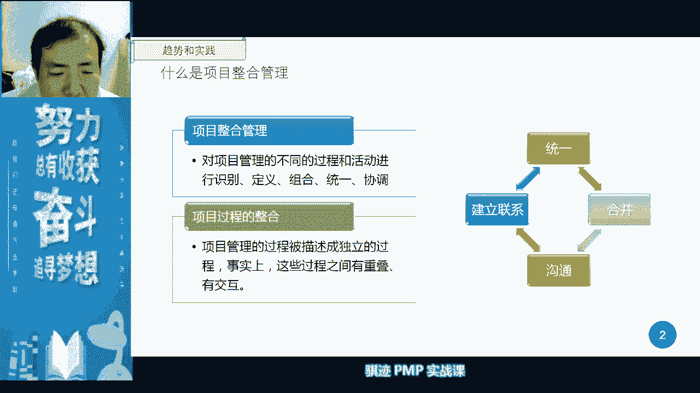

所以这是整合管理，当项目经理应该扮演的角色要做的事情，那么像整合管理是由项目经理负责，大家可以看到ppt，那并且呢这个责任不能被转移，那么如果这个技能能转移的话，那么就是要你何用对吧，你何用啊。

我们经常有句话叫讲啊，搞运维的啊，我们搞什么啊，设备运维的it运维的那些人，平时呢啊不出事情啊，要你何用啊，就在那里吃干饭，出了事情又修不好，要你何用对吧，炒鱿鱼啊，ok啊。

那项目经理呢平时你看着不干活，要你何用啊，出了事情呢你摆不平，要你何用啊苦难，所以项目经理在一个项目上，是一个最终的背锅侠啊，当然这个考试不会考一个项目，最终的成败的最大责任是谁啊，是项目经理啊。

这个职权是不能被转移的，所以你拿了钱你就要背锅啊，o那么我们看啊，项目整合发展，当中的一些趋势，那么项目整合管理方案是什么，使用自动化的工具啊，自动化的工具就是指什么呢，我们项目管理软件我们讲pm啊。

后面会讲到pm，他会使用到我们之前课也讲过，pm会使用到我们的啊自动化工具，然后去进行工作任务的分配，然后呢，帮助项目经理从繁杂的机械劳动中解脱出来，使用可视化的工具，我们就会使用看板啊。

很多同学可能已经知道看板好，看板，原先呢是在精益管理和敏捷管理当中使用的，那么现在越来越多呢，在各种各样的项目管理当中也使用了，当看板不是一种高大上啊，商场门口，经常有商场门口会有个牌子。

本商场停车位还剩多少个对吧，那个那个那个多少个，那个那个那个框架是个电子屏，是会数字会实时会更新跳动的啊，那么那个东西呢就是个看板，很简单，看板就是给大家看自己想要关心看的东西对吧，这就是可视化工具啊。

没有什么太不高大上，然后呢，项目管理呢，整合管理呢要用我们的项目管理知识管理对吧，要专业对吧，不能野路子啊，项目管理呢我们学过拼之后就更加不能野路子，管理，要用正规路子管理，当然了，野路子是用来对付啊。

实际当中是用来对付野路子的人对吧，但是我们的管理整体上是不能野路子啊，然后呢我们要增加项目经理的职责啊，这是个趋势，项目经理在管理一个项目当中的职责呢，变得越来越的重啊，越来越大，身上的担子越来越重。

使用混合性的方法呢，就是它使用多种的管理方式，有种是间接管理，有一种是直接管理呃，是用混合型的，我们讲前面我们讲混合型的，我们的生命周期对吧，进行管理啊，多种方法将结合的去管理一个项目啊。

因为项目的形态以及项目的变化程度，现在这个社会当中会越来越高，所以我们需要用啊更丰富的手段啊，更火综合性的手段，去解决很多项目上的实际问题，好这是项目管理的发展趋势和新兴实践啊，那么从这一段开始。

大家可以看到，我们后面每一个章节，都会有个什么发展趋势和新兴实践啊，这是pmi的第六版当中所推出一个新的东西啊，那么这个东西其实目的就是pmi觉得改个书，那么要花钱对吧，花钱给大家买了本新书要买。

那么总归要加点东西吧，没东西，老东西重新应用，大家不买账啊，所以大家的新兴趋势，当然啦出发点是好的，告诉大家有哪些现在新的东西，和我们传统的项目管理不一样的啊，有些新方法新工具新方法啊，是这样意思好。

那么这些信息趋势呢大家看一下就可以，考试呢有可能会考到，但是只要知道它的大致概念就行。

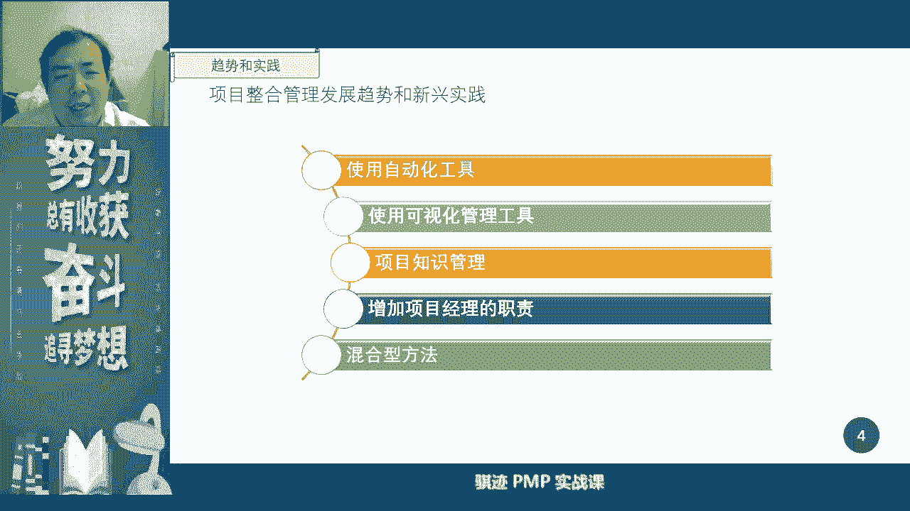

我们讲项目的整合管理中要考虑的要素啊，这一点呢是我们要知道的，那么整个管理当中管什么东西，第一个是资源分配啊，资源分配，那么讲我们在项目组合管理当中，我们讲是在整个组织层面进行资源分配对吧。

项目集管理当中呢，也有一小部分的工作职能是资源分配，那么仅限是两个项目之间进行资源的竞争协调，而此处的资源分配是指一个项目之内，项目经理通过各种渠道去获取的，项目资源怎么分配。

在项目的各个工作当中是这样的，项目内分配的，所以项目整合管理都是只考虑项目内的，其他项目跟我们有关系对吧，个人自扫门前雪，因为你是项目经理，不是项目及经理，也不是项目组合经理，个人自扫门前雪啊。

所以你先把自己的事情搞定，所以资源分配是讲自己内部的资源分配，那么第二个是平衡竞争性需求啊，竞争需求，那么有的同学今天在白天和，好像是昨天晚上问了我老师，什么叫平衡竞争需求，平均竞争需求嘛很简单啊。

一个项目当中，比如说你有两个团队，一个团队呢有十个人，一个团队呢有五个人，你让他们两个团队去干活，那么在管理得当的情况下，肯定是十个人，那个团队干的多了，那么根据多拉多的那十个人团队是不是啊。

那个团队的团队主管，是不是他的kpi就高了呢对吧，那么另外团队说啊，他们人比我多，那么你要多分几个人给我干，那么但是实际上有可能他们的工作值呢，是不一样的，但是呢我们想人和人之间。

就是会有这样的竞争差异啊，竞争需求，比如说不同的工作之间也有竞争需求，每个人总是从自己的角度啊，去考虑自己，工作的角度和职责的角度去考虑资源，这么喜欢拿到资啊啊，最好的资源对吧，最好的条件啊。

那么你作为一个项目经理，你就要在整体上你要把控啊，我是怎么样去平衡各个各个部分的，对吧啊，所以这叫平衡竞争需求，这种平衡是在项目内的，主要是在项目各个团队内，或者项目各个工作缓解那个啊。

这种竞争需求资源总是有限的对吧，资源总有限，然后呢研究各种备选方案啊，备选方案，所谓的备选方案就是备胎对吧，那么呃比如说呃比如说你是刘备，那么你的你的选择方案说你要找一个军师。

那你的选择选择方案是什么啊，诸葛亮啊对吧，如果没有诸葛亮呢啊，如果没有诸葛亮怎么办啊，你公屏上说如果没有诸葛亮怎么办，唉如果没有诸葛亮怎么办，刘备如果没有诸葛亮怎么办，来了公屏上打给我。

庞统啊很好啊啊很多同学很好说庞统对呀啊，我还以为很担心大家都会直接直接跳进我的，我给你们挖的坑里啊，很多同学会说哎喜欢臭皮匠呀，臭皮匠是个不得已最后的备选方案对吧，很好对吧，如果我啊凤雏对吧。

法阵啊都可以啊，三个臭皮，三个臭皮匠也是被全方，三个臭皮匠是实在没有办法的，我们用臭皮匠上对吧，你有没有诸葛亮，你可以有法阵啊，你可以用庞统啊，对不对，这些都是被选方案，可能啊凤雏呢因为挂得太早了的。

死得太早了对吧，法正呢可能因为有其他原因对吧，也也也死的挺早的，所以诸葛亮最后脱颖而出，但是无论如何对吧，那么诸葛亮肯定首选，那么其他的其实也不差的，所以项目经理在项目的工作中就是一定要考虑。

我现在肯定是用最优方案去做，我肯定是用最优方案去做啊，但是我可能很多时候条件的外部条件变化，我们叫外部条件，叫事业环境因素的变化对吧，然后各种内部的实验环境，文章外部的世界环境，适应环境。

内部的事情还能发生变化，那我怎么办，我用不到最好的条件，那么我只能使用备选次优的，甚至更持有了最无奈的总要有一个保底，那么项目经理脑中一直就有这种方案，会怎么样会怎么样会怎么样，我有各种各样的方案。

永远不会说是什么，只有一种方案啊，做事情只有一种方案的，项目经理叫做什么东西呢，啊叫做莽夫，叫做莽夫啊，我觉得叫做莽夫，管一个项目，记住任何重要的事情上，重要的事情啊，不是所有的事情。

重要的事情上一定要有备选方案，或者是你的决定采用暖通方案，做的时候已经想好了备选方案，你可以不用，但是呢它可以很容易地实现，但是一定要有啊，人有不测风云，天有旦夕祸福啊，我是不是又说错什么东西了。

对吧啊，明白我意思吗啊，备选方案一定要有啊，所以呃作为一个带有职业偏好癖好，或者是倾向的项目经理，他会做一件什么事情啊，比如说我出门，那么出门我带上交通卡对吧，我永远什么呢，出门除了带好交通卡。

永远什么手机也要考虑什么，有有一个什么手机app对吧，然后再比如交通卡掉了，交通卡里没钱了，那时候我可以用手机也可以刷卡，对吧啊，这就是备选方案对吧，所以项目经理做多了。

有时候在工作生活当中会不自觉的做任何事情，都会有一个备选方案，当然人生也不是所有的东西都能有备选方案，比如你有个老婆，你能有备选方案吗，当然是不行的，对吧啊，这个是不行。

因为这个是违反项目经理的伦理道德，法律要求，社会责任要求的啊，ok记住啊，老博士不能有备选方案对吧，嗯当然你可以闺蜜，好啊我们在啊扯多了，当然活跃下大家气氛，是不是大家现在网上精神来了，对吧好。

那么下一个呢为了实现项目的目标，在裁剪这个过程，裁剪这个过程，太牛了，神裁剪过程什么意思呢，我要看一下，刚才看一下公屏，什么叫裁剪过程，裁剪过程就是说根据项目的需要，将某些过程，某些流程进行加长缩短。

增加甚至是抛弃啊，所以裁剪并不一定是只是增加啊，而且不正确是减少裁剪，裁剪并不值介绍，他也可能会增加，也会调整，总之是为了一个美好的目的，为了一个实现项目目标的一个美好的目的。

而在过程当中进行调整控制啊，调整控制，但他用词用的是裁剪啊，让人很容易认为啊这个东西只是解，所以考试当中记住啊，如果看到裁剪，一定要脑子记住，不仅仅是检验，很有可能会加，甚至会改，这都是裁剪过程啊。

ok这也是你管理项目当中要考虑对吧，所以管理一个项目当中，你会发现有一个我们后面会讲有一个定律啊，叫帕金森定律啊，我们叫帕金森定律啊，这是在很后面会讲什么叫帕金森定律呢，就是说呃当你就说项目工作很充裕。

比如资源很重要，时间很充裕的时候，你会发现有各种各样的额外的需求啊，要求就加进来，一直加到什么东西呢，加到你实现不了为止，就像你平时干活，如果你平时干两个小时活，闲六个小时，领导肯定会给你加各种各样。

我一直把你把你的上班八个小时全占满啊，这就叫帕金森定律啊，ok明白意思吗，所以项目当中呢我们总归是要进行裁剪，以保证项目呢最能够达成我的目标去实施啊，那么管理当中呃，我们还会遇到什么呢。

各个知识领域之间依赖关系啊，我们讲后面会讲到，我们项目最主要的三个要素对吧，三个知识领域范围，进度成本相互之间是牵扯了对吧，范围只要一扩大，那么进成本肯定会上升，进度呢肯定会延迟对吧。

那么我们如果保证要保证范围，比如说扩大，但是进度呢不延迟，肯定要多投钱，那我干嘛加班对吧，如果我们又想扩大范围，又不想增加沉稳，那么怎么办呢，我们只能慢慢走的，然后进度，所以又想马儿好。

又要马儿不吃草呢，这个事情呢在当前的叙述条件就是不存在的，但是后面我跟你讲，我会跟你们讲怎么样让又要马儿好，又要马儿不吃草啊，ok啊这是后面的故事，预知后事如何，请听下回分享啊，所以ok啊。

我们扯了一圈，但是多少啊，让你们先把自己的脑子活跃起来，然后呢记住啊，项目管理整合管理考虑的要素这五个方面，一资源分配，二竞争性的需求平衡，竞争性是有，三研究各种备选方案，四为了实现目标呢而裁剪过程。

五管理项目知识领域之间的相互的依赖关系，并把他们矛盾和约束呢解除掉啊，这是项目整合管理考虑的要素，所以你不要看这个五个东西讲的很简单，其实这就是项目经理在管理项目当中，考虑到很大的五个方面啊。

五个方面很大要素五的方面好，那么我们讲下下一部分啊，项目当中我们讲要完成一个项目，那么在完成一个项目的过程中，我们就会有什么可交付成果的一个阶梯，这个呢我们再讲一遍啊，之前我们可能看到过。

那么项目一开始是没有可交付成果，但是我们会再进行定义，就是我们的成果，我们将定义一开始定义的来自于什么呢，范围管理当中的我们的范围说明书对吧，然后就要经过什么啊，指导和管理项目工作啊，老实说项目的工作。

项目经理你又不直接参与项目的生产，那你为什么是说是从你的指导，管理项目工作来呢，就要记住项目的可交付成果，是各个知识领域方方面面的人，大家努力的结果，但是每一个人，每一组人。

每一个团队可能只负责一个专业方面，而其他的方面呢都是由谁来负责的，是其他人负责，但是只有一个人统领全局，把大家的东西捏合起来，才能做出我们的客户想要的东西，那么谁是这个捏合的呢，项目经理。

所以要在他的捏合的工作里面，把这个东西给我捏起来，怎么捏的呢，就在指导和管理项目当中去把它捏起来了，注意啊，有钱，那么指导管理项目工作就会暂时得出，我们的叫可交付成果，注意这里的定义啊。

考试是很喜欢考这个定义的，注意可交付成果前面有没有定语，没有定语，当可交付成果前面没有定语，就意味着什么呢，通过内部的质量控制，如果他通过了内部质量控制，那么他就从我们的可交付成果状态。

变成什么核实的可交付成果啊，这也算达成重要的概念，内部验收验收完了，我们要跟客户验收，完客户验收哪里验呢，又回到了范围管理者领域啊，有个叫确认范围啊，还有一个呃子过程叫确认范围。

其实就是验收和客户一起验收东西叫确认范围，确认范围之后呢，我们的可交付成果呢又变了性质，它叫验收的可交不成功，所以在p n p考试当中一定要注意可交付成果，verified deliverable啊。

我们呢是验收的deliable都一样，什么有前面有定语，当你看到验收和交互中意味着什么，它已经被客户验收了，那么一个产品如果它被验收了之后，就一定就一定啊，ok了吗。

不是他还要最终纳入到客户的生产环境当中去，去发挥作用，才能够说什么，通过了验收，那么他最后需要什么，最终的可交付成果呢，要进行成果的移交，把它放入到客户的生产环境当中去，并让它产生价值啊，产生价值。

那么这叫可交付成果的，最终产品的服务的成果的一种移交啊，这种时候最后它产生价值了，我们的可交付成果呢才算是到告一段落啊，所以这个过程大家一定要啊脑子里很清晰，这里面的啊。

这里面的定义范围和确认范围这两个东西呢，我们在整合管理当中讲完之后，讲范围管理当中马上就会提到，马上就会提到好，所以啊这个这一条我们生生产呃，项目的独特的呃独特的可交付成果，这样一个流程。

纯木结构的流程，一定要脑子的基础啊啊大的基础。

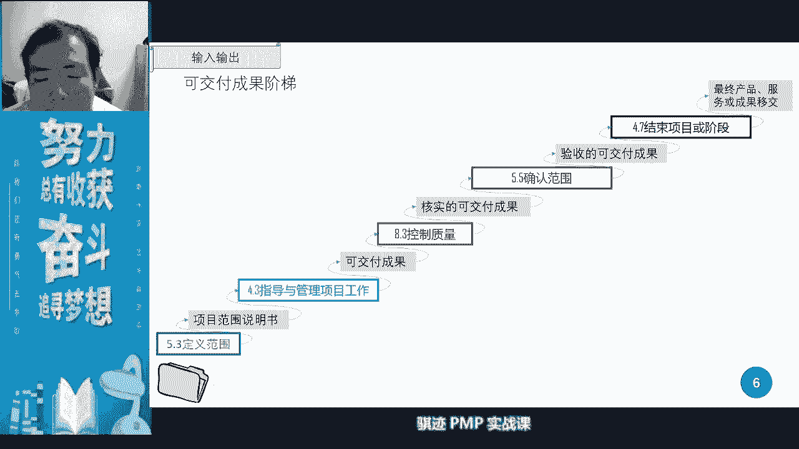

好，那么这是我们管理整合，整合管理当中的一条另外一条线啊，另外一条线这条线呢我们后面也会讲，就是说我们在管理工作当中怎么样去管呢，肯定看绩效对吧，看绩效，因为有些项目它并不是以可交付成果。

作为我们的考量，变为可交付成果，可能在最后的最后才能出来，这个过程当中是没有直接出轨交互的，那我们怎么样评估这个我们项目管理的结果呢，那么要通过绩效管理啊，绩效管理是通过我们指导管理项目工作，得到数据。

数据呢经过我们的各个的监控过程组啊，这里监控过程组主要是监控过程组，然后变成了什么工作绩效的工作，绩效的信息信息呢，怎么在监控项目工作，这又是整合里面，注意这又是整合里面我们的项目经理的写报告。

写报告就变成什么工作绩效报告，工作绩效报告，然后通过沟通管理呢再分发出去，然后跟他沟通，如果有问题呢，项目经理在管理层啊，管理这个层面上呢，就要进行开始管理了，要对团队加强督促对吧，要叫他们提高绩效。

让他们好好管理，或者说什么风险很多，我们要管理风险啊，各种各样的就是工作绩效管理线，ok工作绩效管理线，这东西呢我们后面还会提到这里，先大家有个概念啊，这是有概念，这是我们整合管理当中。

会有一个输入和输出的东西啊。

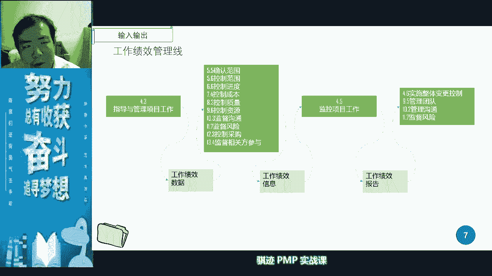

然后后面呢我们会有一个变更管理环，变更管理环这当中的这些内容呢，我们会在变更管理当中知道啊，讲一下知道，但是有一点概念先，这里要知道变更呢我们可能会在下一节课啊，下周二的话会详细更详细的讲变更有个概念。

知道变更一定要走流程，不走流程的变更都是刷流氓啊，明白了都是刷流氓，说什么，所以你一定要知道变更管理的，我们的一些步骤啊，那么我后面会给他总结的一些步骤，大家记住这些步骤就行。

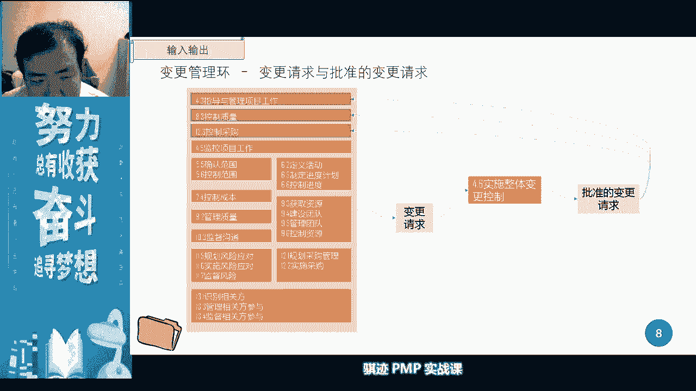

所以啊啊这是我们后面会讲到了，那么这是pm bob的管理过程的框架啊，这可能大家可以看到，这就是我们pm里所有的子过程，ok那么这些子过程要不要背出来，答案是一样的，但是不用现在背我的我的个人观点。

我的教学观点都认为，一开始你背出来死记没有意义啊，这些东西呢会在后面的我们的课程当中，逐一讲到，但是等到我们最后一章讲了结束了之后，你应该能够通过逻辑推理的方式，一个一个一个把它写出来。

这个过程是不用刻意去背的，只要你认真学，自然而然的就记住了，对吧啊，那么这样一个过程其实有时也有点像，两仪生四象，四象生八卦，八卦生万物，比如说一个项目，它是来自于什么项目章程，项目管理计划。

那么项目管理的十个知识领域，都依赖于什么范围进度成本，然后呢我们的质量啊，风险啊，资源啊，采购啊这些东西呢啊相关方啊，沟通啊，这些东西呢，都是围绕着我们的啊范进程去进行的。

然后呢他每个过程是怎么样一步步去进行的，然后根据逻辑推理过程把它推出来，有个脉络，这样推出来就行了啊，所以背是肯定要背出来了，这对你们考试绝对有好处，但是不用死背，ok这里呢也不用太多讲啊。

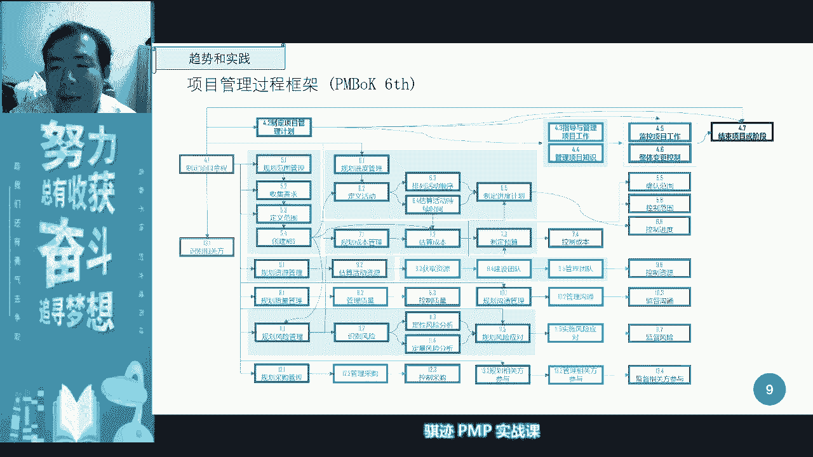

因为现在这些跟你讲，其实对你们来说，没有太那太过那个那个那个那个大的意义，太过要感官的认识好，那么我们讲现在接下来讲项目管理过程的整合，管理过程的过程组分布在哪里啊，一共有七个过程组啊。

但是这个七个过程只是不要记住背出来呀，但是他不用死记，它很简单，整合管理是管理什么东西啊，所以它必然会管什么东西，启动执行给我规划啊，几动规划执行监控收尾对吧，还有两个东西呢是单独拿出来管的。

是什么知识和和整体变更啊，前面五个其实很很容易理解对吧，启动过程组就把制定项目章程，规划过程组的就是制定项目管理计划，执行呢就是指导管理项目工作，监控呢就是监控项目。

收尾呢就是减速项目和项目阶段主阶段啊，但是项目的知识管理和整体变更控制，为什么项目经理还管啊，那么好有很很多同学就问问题，老师这个东西怎么记，为什么多这两个，ok，对，这两个正好是。

因为这两个东西特性只适合项目经理管，你想想看一个项目的知识，如果要在整个项目范围内进行共享提高啊，增加认知，那么他只有项目经理可以是吧，管得好，一个项目当中，你想想除了项目经理。

有任何一个人能够扮演这样的角色，将某一部分知识或者某一点的知识，在整个项目全局当中去拓展开展普及，让大家了解，或者是进行收集统一规定整理，有没有这样的角色，第二个角色没有，所以这只能有项目经理款。

明白了吧，所以这就是为什么项目经理要在整合这个层次，去整合我们的项目管理的知识，管理项目的执照不是项目管理知识啊，说错项目知识，就项目里边我们的一些隐性和显性知识，后面有讲的啊，第二个啊。

实施整体变更控制，为什么实施整体变更控制要在那个里面管呢，是因为变更你们记住啊，很少有变更，只影响一个知识领域，比如说我要变更一个范围，那么变更范围很有可能在变更的时候就变更，能影响什么，影响的进度啦。

影响到影响的成本啦，影响到质量啦，影响到风险，对不对，比如说我要变更一个资源，那变更资源有可能就导致我的进度变化了，对不对，进度变化就有可能什么间接牵扯到什么啊，我的我的项目呢可能质量会有变化对吧。

然后或者风险会有变化，所以变更往往是，一旦某一个知识领域的某一个变更执行了，会影响到其他领域，那么只有一个人在一个全局上，能够把控所有的变更，那么这个人就是项目经理，他做的是一叫整体变更控制可以看到吧。

所以变更不但是变更都要注意变形啊，变更不会存在局部变更，变更只是说变更就是变更，但是整体变更控制，它是讲究在整体上对变更进行管理，因为你要在全局角度，我们去考虑所谓的各方面关系啊。

有句话叫牵一发而动全身啊，所以项目经理就是管那个牵头发的过程啊，看看这个头发会不会跟全身相关的，所以这是两个知识领域是必须啊，这个这个两个子过程是必须，再加上五个过程组里面，相对应的整合管理的工作。

那么就构成了整合管理的七个子过程啊，所以今天这今天这堂课和下周二堂课学完之后，整合管理的七个子过程，应该你们应该非常熟悉的啊，尤其至少名字应该知道啊，就是五大过程组的整合管理工作。

再加上知识管理和整体变更控制，ok明白了吧，ok明白了，请把明白两个字打在公屏上，啊我们讲到现在还只有400个人啊，啊我理解有部分同学可能设施回家网啊，工作忙啊，啊明白了啊，好明白，很多同学已经明白了。

ok明白了，我们继续。

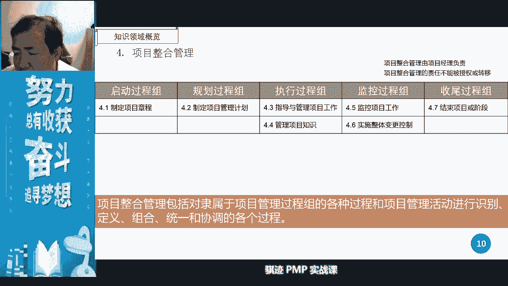

好这是我们的整合的过程组的一些内容啊，具体想定义的那些内容，大家可以看一下，我这里刚才都已经给他解释过了，所以我们就不再赘述了啊，我们会后面一个一个详细定义解释之后再讲，ok啊。

大家可以自己可以翻ppt或者回看视频都再看啊，我们就不单独讲，那么整合当中，我们将整合知识当中有哪些东西呢，啊这里做了一个我们的原始的pp当中呢，做了一个定义啊，定义你讲项目整合管理当中呢。

我们是通过商业文件和协议呢去制定项目章程，然后呢有账目章程来制定出项目管理计划，它有12个子计划，四个基准对吧，然后呢变成了我们的管理项目啊，然后呢在房东不是变成了我们的这指导管理。

项目工作的具体工作和监控工作呃，合变更控制工作以及接受项目的工作，同时管理我们的项目管理知识啊，这是整体的一个结构，大家看一下啊，有一个感性的认识啊，他是怎么一个逻辑关系。

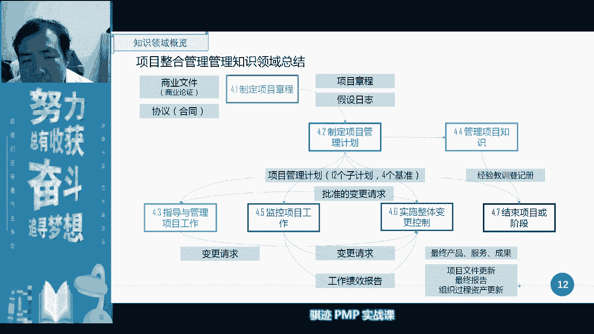

啊ok啊，这个不是太重要，那么接下来我们讲的东西内容就很重要啊，项目章程内容这个东西就很重要，项目章程是我们在开展一个项目当中，第一个做的子过程，子过程啊，第一个做的子过程，那么项目章程。

很多同学可能已经有了解什么是项目章程呢，就是授权项目经理啊开展项目，然后呢承诺给项目呢提供资源，并且呢指明项目的要求和目的计划，以及它的效应这样一份文件啊，所以他是要撰写并批准授权项目经理的。

然后能够使用组织资源的一个文件的一个过程，那么制定项目章程那是谁的责任，那我先问你们，你们知道制定项目经理的章程是谁的责任，制定项目章程理论上是发起人责任啊，注意不是项目经理的责任啊。

理论上是发起人责任，但是实践当中呢发起人会和项目经理一起做，因为要让项目经理对整个项目的高层次定义呢，有所了解，所以一个项目如果项目经理，这个项目经理是从项目一开始去，就去负责这个项目了。

那么他肯定会去参与的事情，制定项目章程，今天我张晨，那么它的作用呢是明确项目与组织间关系，确定项目正式地位，组织展现组织对项目的承诺啊，那么项目经理在制定项目章程的过程中，他是什么抬头，什么态度，它是。

项目经理在制定项目的章程的过程当中呢，呃，它是一个拟任，我刚才看了一下六点，它是一个叫拟任项目经理啊，直到项目章程得到通过，它才是正式项目经理，所以项目章程在批准之前呢，他只是一个拟任项目经理。

那么项目经理在拟定项目章程过程中，他要参考什么东西啊，我们前面就讲了对吧啊。

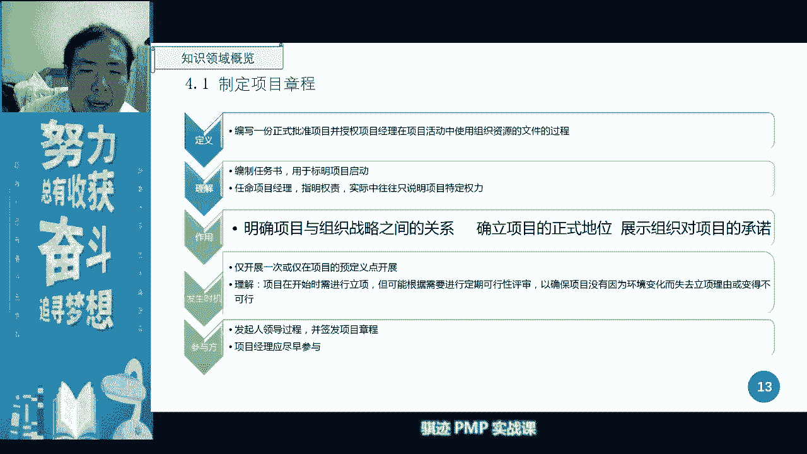

商业文件，商业论证协议，合同计划，还有一个东西叫做效益管理计划啊。

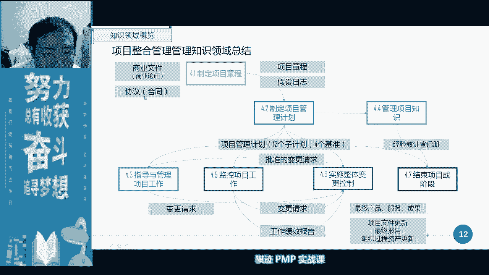

我们之前提到过，后面会再提一下来参考这些东西，所以项目经理如果对项目来了解更深刻一点，他甚至会参与到项目论证的，商业论证的这个工程当中去，所以那么在讲到这个的时候呢，考试会考一个概念。

什么时候最早有项目经理，什么时候最早的项目经理啊，商业论证开始做的时候就可以有项目经理，项目经理最早开始有，是从商业论证这个事还是有的，但是他的抬头虽然叫项目经理，其实实际上他性质叫你任项目经理。

你任项目经理啊，但其实我们就有已经有了项目经理，有了啊，那么什么时候最晚必须有项目经理啊，当商啊，我们的商业啊，商业论证，商业啊，商业文件全做好，商呃，项目章程已经做好。

最后项目章程批准之前必须有项目经理，一个项目章程，如果没有项目经理，那么谁来负责呢，啊空气负责，对吧啊啊，这显然是不对啊，所以项目经理最早啊，最早应该是在项目论的商业论证当中，就应该出现。

最晚呢必须在项目章程的签署之前啊，这个概念要有项目章程签署之前就必须要有啊，或者签署那一刻也可以有啊，倾向拒绝了也有，啊这才是一个正常的一个项目啊，一个一个特征啊，当然其实真的是会有野路子对吧。

先有项目章程，再有项目也会有这种野路子啊。

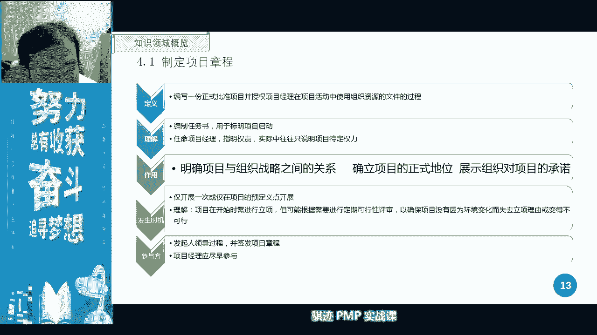

啊这野路子不在考虑之列啊，那么我们签订项目当中之后呢，我们会用i t t的方式来描述整个子过程，从现在开始啊，因为之前我们讲了三张是没有i t t o的，它是我们的项目的天时地利人和。

那么从第四章开始呢，我们会有啊各个子过程的介绍，项目里面会做哪些过程，那么每个子过程的描述方式，我们就讲了要有输入输出和他的工具技术对吧，所以我们会用这种方式来描述一个子过程。

那么我们第一个描述子过程就是项目章程，项目章程，那么项目章程的输入是来自哪里呢，大家可以看到啊，左边可以看到是商业论证效益管理计划和协议，注意我协议给大家加到了四个字，叫来自甲方，为什么要提这个东西啊。

这位pm当中的协议呢，有时候呢会让你产生一些误解啊，你要看清楚体质和环境，有时候我们提到协议是什么协议啊，我们作为甲方给我们的供应商，这时候的协议是我们给他们的，那么有时候呢协议算是我们的甲方。

把这个合同给我们啊，合同或者备案谅解备忘录啊，或者指a c r a这类东西给我们，这时候协议是我们拿到协议啊，所以你要记住它的设定环境，在项目章程当中，我们肯定是因为有了这个项目。

所以我们才会有有有了这个协议，才会有这个项目，所以偏僻，当然默认的描述角度是乙方角度，ok啊，大家也记住pvp默认的角度，乙方角度，你有一个甲方爸爸啊，乙方角度，那么他的协议自然来自于甲方了，甲方爸爸。

那么在有些项目当中，他但是他可能是什么，有有相当于甲方乙方，比如这是个内部项目，那么你们可能是这个部门和另外一个部门，签出来的协议，是一个内部项目，也有可能，那么他的协议就来自于另外一个部门。

也有可能好，那么这些是我们制定项目章程的主要输入啊，主要输，那么后面呢我们会用各种什么专家判断啊，头脑风暴啊，焦点小组啊，这些方式去对项目章程来进行识别啊，分析收集决定，最后呢写出项目章程。

注意这里输出有一个很重要的东西，叫做假设日志，假设日志啊，ok大家看到了吗，这个右上右上这个地方有个假设日志，所以项目章程的制定完成之后，输出的东西并不仅仅只有项目章程，这一点一定要注意啊。

有一个很重要的文件叫做假设日志，他这里面罗列了来自他的来自来自哪里，来自于商业论证的，各种项目的假设条件和制约因素啊，这个东西呢是给你用来进行备忘录的啊，那叫reminder啊，给你进行提醒的。

那么这个东西最后会被归档到哪里啊，会归档到项目的管理计划的项目文件当中去，会放在项目文件当中去，项目经理呢会定期呢看一下假设日志，确定我们的假设条件是不是已经改变。

或者是要重新去衡量定义会有这样一个过程好。

那么我们细看啊，在项目当中，我们可以看到项项目的商业论证，是指项目文档化的经济可行性研究啊，经济可言，那么是在这之前，肯定我们也研究过知识金要不要做，要做，那么项目的商业论证是什么。

这个项目用怎样的方式做是最经济的，或者有没有经济可行的方式去做，你要明白商业论是这样一个东西就行了啊，商业论证当中呢，我们pmi呢有一个这样的证书啊。

有一个叫p p a叫做project of a professional in business，p b a这样一个人证书啊，这个这个也是我们很多机构会开展，开了一项培训啊，怎么样做商业分析。

怎样做商业分析，那么商业分析主要什么，有什么动机啊，战略啊，推荐方法等等等等之类的啊，ok但是这个东西呢在偏僻的考试呢不太重要，明白就行啊，我们在我们在我们的第一节课当中，都已经讲到过了对吧。

上一轮的时大致讲什么东西，他一般会推荐三种方法对吧，p bp bcr对吧啊，主要bca的呀，主要诸如此类这些东西。

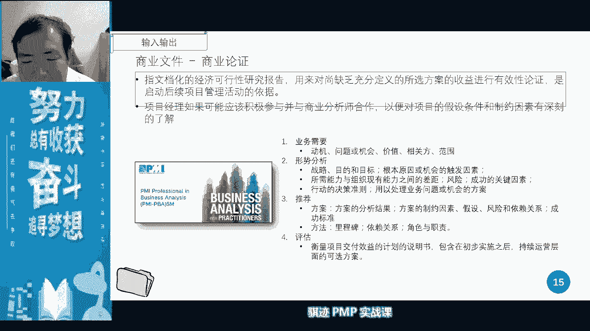

ok好，这是我们已经讲过了，商业论证，我们就不再追求，那么商业论证之后呢，我们会出一个东西，这个东西很重要啊，商业论证之后会出个东西叫效益管理计划，效益管理计划是描述了什么呢，为发起人。

组织和项目预期受益的方式来创造，我们进行创造行为啊，进行创造价的行为啊，行动产品服务的成果结果啊，这个结果定义有点热，就是这个这个计划其实主要是什么意思呢，这是我写的啊，这是帮助你的。

尤其是发起人制定的用于保证组织，尤其是发起人的另一个计划，他制定了什么东西啊，他制定了组织在这个项目当中的目标，利益的条条件啊，受益的方式以及这个项目达到的，对于这个组织，往往这个组织指的是什么。

是乙方应该要达到一个什么收益结果，比如说我的有一个项目效益的管理计划，规定这个项目无论最后最后做的怎么样，我们要实现哪几个目标，第一个目标，项目的净利润率不低于10%，第二个目标。

新项目净利润总额不能低于100万，第三个目标，我们的市场占有率不能低于20%对吧，这是可以是项目效益管理计划当中的啊，这些目标，那么具体的你怎项目经理怎么做，不是效益管理计划负责的，但是这个计划注意啊。

这是我帮你们写了，一定要记住啊，项目经理通常无权修改，无权修改，项目经理是无权修改的，注意啊，注意这事虽然是一个项目的管理管理计划，但它不是由项目经理制定的，和后面的制定项目管理情况不一样。

它不是由项目经理制定的啊，这一点要注意注意，那么它会被纳入当地啊，也会被纳入到项目章程当中去，然后依据项目章程，我们去做项目管理计划，自然而然，它里边的很多的设定也变。

变成了项目管理计划当中的一些设定啊设定，有我们的目标效益啊，战略一致性啊，效益的实现啊，负责人啊，测量指标，假设风险等等等等啊，但他主要的意义和内容呢，我们刚才已经跟大家讲过了啊，这个一定要记住考试。

记住他是一个特别的一个管理计划，不由项目经理制定，项目经理通常无权修改，那么讲到这里，我们讲如果假设一if啊，注意是i f if啊，项目经理可以制定项目效益管理计划，那么你们觉得把效益的目标和啊。

战略的那个一致性定得高好还是定的低好啊，请在公屏上告诉我，如果或者说如果你是一个项目经理，你希望发起人把这个消息计划定得高大上好，还是呃低矮搓好，啊请到公平，你告诉我，低一点。

然后把它做高高低高大上低低压，ok啊ok啊，我看了很多东西啊，好我们我们讲这是讲实践当中啊，实践当中当然是第一好啊，为什么我问你项目经理负不负责挣钱，当然不负责，证券，项目经理在乙方的角色定义当中。

是不负责挣钱的，他是负责什么把这个项目完成啊，有些乙方苦逼的乙方项目经理来说，当然不负责挣钱，但是负责讨钱啊，难道你比较苦逼对吧，有些乙方会负责回款啊，但大部分的项目经理。

项目经理大部分角色的职责是什么，保证项目能成功，那么项目成功之后，到底能获取多少收益，而不是项目经的首要目标，项目经理使用目标是项目成功啊，明白了吧，所以这个时候当然是目标定的低一点好了，目标定的高。

是不是脑袋上脖子上掏了个夹子，快被你勒死了，对吧啊啊这个要注意啊，所以领导如果你是一个项目的领导问你啊，这个项目能开就开始了，你可以自己定多少目标的时候，千万不要把目标抬得太高，记住你不负责挣钱。

负责挣钱的是谁，哪一种经理，产品经理，产品经理是脑袋上有指标，他是负责挣钱的，他是希望目标定的高一点，然后实现了之后呢，能获取更大的收益啊，项目经理不负责证明，他只负责把事情做好，做成功啊，注意啊。

这是在一般情况下，但是有些企业的项目经理呢也也有指标啊，这是另外一回事。

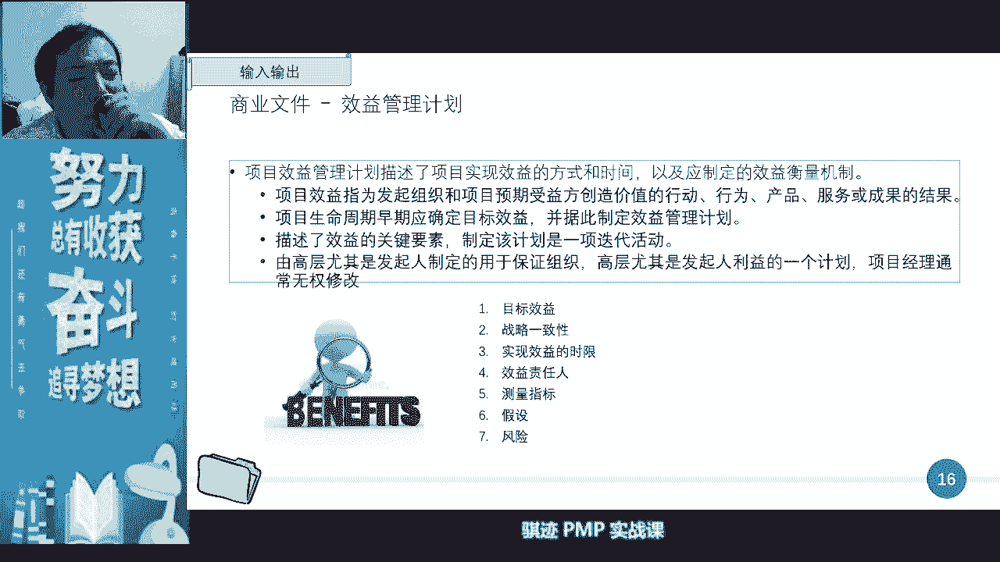

ok好，那么我们讲项目的项目章程制定当中，输入还会有什么协议协议，就是合同对吧，大家可以看到啊，合同的那些都已经知道，买卖双方以正式方式形式啊，有受法律保护的合同协议呢，在这个说法呢。

在之前在我们的pmbok第五版当中呢，会用soo w来代替啊，呃scope of work啊，项目范围说明书，那么这个项目范围书呢是啊我们甲方给的，但是呢这个这个说法呢啊不太嗯，现在已经不太适用。

因为现在一个项目当中，甲方给你的一个像和协议这样形式的东西呢，越来越多了啊，各种各样的形式，大家可以看到下面会有，那么在这种情况下，a s o w已经不太适合当下的版本了。

所以我们只能使用一个新的词去概括，那么协议啊，agreement是适用于所有的东西的那agreement，所以我们会使用协议来代表甲乙双方，对于这个买卖的一个达成啊，一个达成，那么协议也会有很多种形式。

第一种叫contract的活动对吧，我们谅解备忘录对吧，m o w对吧，meo对吧，如果是服务合同呢，会有什么sla对吧，server level agreement啊，协议书意向书，口头协议。

电子协议，书面协议啊，注意这个当中意向书口头协议和电子邮件，理论上来说是不具备强制法律约束条件的啊，注意啊，有些同学说啊，电子邮件不是也行啊，注意电子邮件没有强制法律要求，小艺啊。

所以我们那些一般都是什么啊，都是什么书面协议啊，书面盖章，当当双方盖章，合同当当双方盖章，这种以纸质的东西为主的啊，电子呢可以是一个是一个手段，但最终肯定是要以纸质的啊，我给你意向书考的也这样。

但是协议书谅解备忘录和服务水平协议，这些东西呢是有强制法律效益的啊，注意这两个注意，那么就呃这一点呢，这些东西呢是大家说辨析一下就行了。

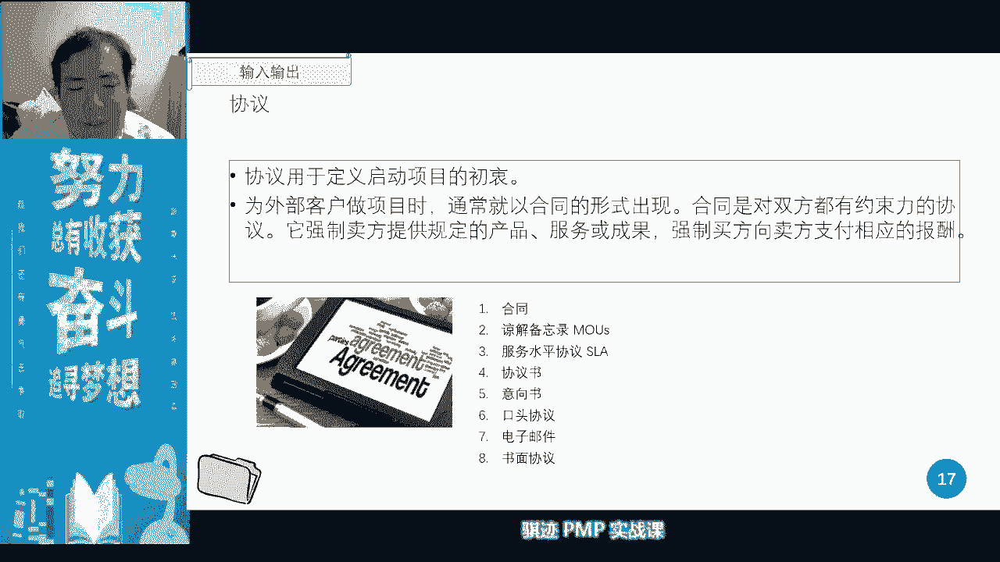

不是我们考试重点啊，那么在工具计算当中，我们会要用哪个哪些工具来用专家判断，什么叫专家判断啊，我给大家演示一个动作，大家知道什么叫专业发展行，行，是不是很形象啊，是不是很形象。

所谓的专家判断就是根据专家自己的经验知识，巴拉巴拉巴拉巴拉这些东西，主观判断这个东西的结果，就是专家判断就拍脑袋啊，所以我一直跟他们形象说啊，一个公司如果决策比较啊不科学化，那么它是什么东西啊。

什么叫三拍呢，第一拍拍脑袋决策，第二拍拍胸脯保证，第三拍卖什么，明白拍什么，拍屁股走人啊，对啊是的，所以专家判断就是那三排里面，第一排，很多时候是根据专家自己主观的认知来的。

但专家会有就是说很专业的技能去判断，你也不知道这个错，这个技能往往应用在什么东西呢，没有很科学的客观方法的时候，我们会用专专家判断来做，会更或者说对于效率啊什么的很讲究的时候，我们会用专家判断来做。

因为专家换到呢，根据专家一分析不就来了，他速度比较快，有准确性还相对比较有保证，是这样，这叫专家判断，ok啊，大家知道，那专家判断在后面很多的我们的子过程当中，都会用到这个工具技术啊，当然了。

很容易理解，然后呢我们会去收集各个呃，应该纳入到项目章程当中的内容，那么收集工具来，第一个叫brainstorm，头脑风暴不知道大家玩过吗啊，很多的企业应该都玩过，很多的企业都玩过头脑风暴是怎么玩的呢。

就是大家首先有一个时间限定，有一个时间在这个时间内呢，首先给大家一个主题，我们要做啥，或者我们需要什么东西，然后呢让大家畅所欲言，脑洞开得越大越好，然后就收集各种各样的点子，收集过来之后呢，再进行分析。

它会变成创意的产生和创业分析，然后进行归类，把一些东西抛弃掉，差不多这是头脑风暴的一个过程，所以头脑风暴呢，我这里呢是我们常用的一个工具，但是p m考试不会考太太深。

但是呢我们在实际的工作应用当中注意啊，头脑风暴要注意几点，第一头脑风暴呢不能玩太长，太长，大家会疲倦啊，所以他要控制节奏，要节奏快，要效率高，有什么点子马上就记录下来。

第二头脑风暴在玩的过程中一定要记住，不要轻易的否定别人，不要轻易的否定，因为如果你轻易的否定了一个点子，所以虽然可能这个点有可能，这个点子确实是不是好点子，但是你否定这点子就会压抑别人的开放性思维。

导致很多别人能够本来想出的好点子，或者想好想法呢没有了没有了，所以头脑风暴不论是怎么歪的点子，我们先把它记录下来，然后等到大家头脑风暴风暴席卷了，所有能够想到的点子都已经想出来了。

然后再一个一个进行辨析啊，进行归类辨析，这是一个，那么第二个呢，第二个注意什么，头脑风暴要有一个引导员，要有一个引导进行引导，因为头脑风暴当中，大家很容易被某一个影响力比较高的，或者话语权比较强的。

或者比较强势的人呢把话题带歪了，这时候引导员呢，要把大家带入到一个中立的位置，去想创意啊，天马行空的去想，这个时候才能够想出足够多的好点子，或者足够多的点子，一共筛选出真正的好点。

所以引导员要注意给大家一个中立的环境，不要带有某种倾向，这是头脑风暴中要注意的，那么头脑风暴呢最后呢还要进行归类总结，所以头脑风暴出来的东西一定要进行归类总结，分类啊和各种后面各种各样的技术。

然后后面我讲的清河图也是一种头脑风暴方式，啊，啊这是我们头脑风暴当中要注意的东西，当然考试当中，大家知道知道头脑风暴是一种，大家脑洞赛黑洞啊，我经常喜欢说个紫甲脑洞晒黑洞的一种方式，把脑袋胯打开。

然后哇吸收大量的呃，呃吸收大量的大家的集资款的意见，集成了很多很多很多的啊点子，然后在这个点子当中呢，然后我们就选取我们想要的一些有用信息，然后呢，有些东西呢，可能大部分东西呢可能都是抛弃不用。

但是通过头脑这种风暴形式，大家可以畅所欲言啊，这就是头脑风暴的玩法，头脑风暴后面就会有个先初步头脑风暴，然后进行分类讨论的叫思维导图啊，这是我们常用的工具，甚至还有头脑写作对吧，诸如此类好。

这是我们一个很常用的数据收集工具，在这这个子过程当中，我们会把最常用的几个数据工具先给大家讲，后面呢会继续用到，但是呢我们就不会细讲了啊，所以注意这一遍就要听明白。

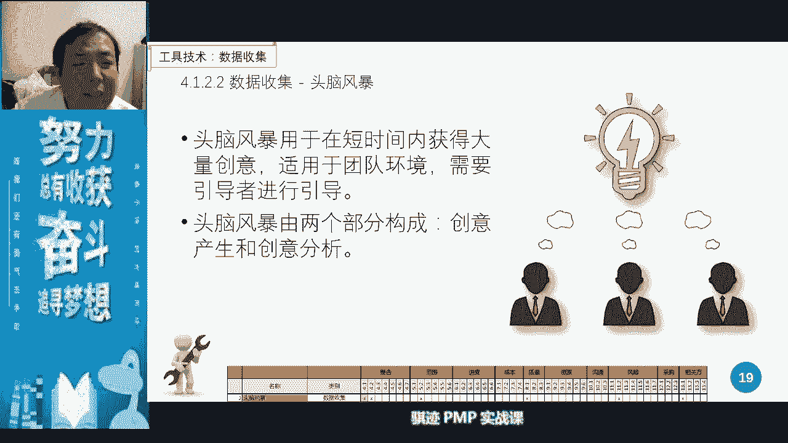

接下来一个焦点小组啊，焦点小组很有意思，焦点小组我们在p p t上所想讲的这个东西呢，所以你们以为原来的p讲的东西呢，是相对有一点不太直观啊，所以你们听我讲焦点强度怎么。

焦点小组首先它一般是八到12个人，这是对的，不用太多人啊，它是用来进行数据收集，第2焦点小组要有一个提示环，要有一个设定环境，就是大家的讨论是在自然状态下，没有事先设定条件。

或者是有一个强加的外部条件组成，所以焦点小组一定要是一个什么呢，自然环境，自然环境下来啊，就是没有预设条件，甚至是带有一些欺骗性的，比如说我一个企业不要，比如说要通过焦点小组。

了解消费者对他的产品的一个想法，那么他不可能直接去邀请消费者到他这里，某个地方来，然后对某个产品谈香了，这时候消费者会被心理暗示啊，就我总是希望这个对这个产品呢说点好话，但是企业恰恰希望听到什么。

你对这个产品的中肯意见是什么，那么这个时候呢他就会使用教练小组这种方式，首先创造一个啊自然的环境，比如说我们并不是一个呃告诉大家过来聚会，可能说喝个下午茶，我们的目的目标是收集产品一点。

但是呢可能呢我们是向往，我们以喝下午茶的方式召集一群人，这群人恰好是我们事先挑选好的，我们的客户，然后呢有一个引导员，这个引导员呢也跟客户一样参加这个活动，但其实他是我们的托啊托啊，二五仔卧底对吧。

别人忍啊啊，那都可以的啊啊这个人混到大家里面去，混到哪里去，然后呢在后下午茶过程当中呢，这个经验丰富的托叫做引导员呢，会不自觉的把带领大家进行互动式聊啊聊啊聊，一开始呢不会聊你的产品，现在大家有个暖身。

然后慢慢聊啊聊啊聊，聊着聊着聊着聊着就聊到你的产品上去了，然后大家呢在这个过程中是很自然的对吧，你听我的描述过程是不是很自然，那么你就很自然的发表一下意见啊，这个东西产品太烂了啊。

跟某某某某产品比根本不是一个档次对吧，这个产品我买它的主要目的是便宜，对吧啊，就是有人骗我，被人家忽悠，诸有此类，让大家自由的环境下畅所欲言，然后呢我们再把这些意见呢收集记录起来，这些意见呢是很宝贵的。

因为它是在自然状态获得交换点，小组就是通过这样一种形式，帮助大家了解对于产品服务的期待和态度，所以大家明白了啊，我们的pp当中没有写啊，我们原始的pp当中没有写，这是我给他加上去。

但这个确实是焦点小组的一种玩法，一种玩法好，那么了解了焦点小组，它的作用，是对于产品服务成果的一种期待和态度之后，那么我们讲下一个工具啊，那么在想下一同学讲我，我给大家讲个例子啊。

这个例子呢是我上p课必讲啊，什么样的叫焦点小组，一个玩什么玩法呢，上个世纪啊，这个很多人已经可能也听过这个故事，上个世纪呢啊在676 70年代啊，六七十年代美国是属于黄金时期对吧。

然后美国人呢是可以一个工人家养活大家子的，六七个人，那么家里的女人那是不干活的啊，女人是不干活的，那么女人再去家里做全职主妇，那么做全职指挥的时候，美国人烧不来菜啊，只说了菜，他们最多的最喜欢做的什么。

什么烤茄层饼啊，烤蛋糕啊，做这种这种东西叫烤香菜，美国人很喜欢做这种烤香菜，然后呢大家知道烤蛋糕挺挺麻烦的，对吧啊，那个面粉调来调去，然后加上什么泡打粉啊，加上什么鸡蛋啊，还要加黄油，黄油还要加两次。

还打搅，还要加，还要加那个叫什么呃，那个那个那个奶油啊，这些东西超级烦啊，大家如果做我做过这个东西就知道了啊，我以前当年早早些年都挺喜欢玩这个东西啊，和现在不玩太烦了，没没经历。

那么女人或家庭主妇呢做这个东西挺烦的，然后有一家公司呢，他呢发发明的产品，这个产品到现在就有很多地方就有人卖啊，到现在很多卖叫做方便蛋糕粉啊，或者叫做玉佩蛋糕粉，这个东西很简单，你把它倒下来。

倒到模具里面，然后呢倒上水调一调，调一调，调成糊状啊，调成一定的糊状，然后呢直接扔进烤箱就可以烤了，烤出来呢喷香啊，这个公司呢他在研发出这个产品之后呢，做过市场实验，大家把眼睛蒙起来。

然后去吃各种各样的产品，然后呢问他大家的感受，结果呢大家在盲测的情况下呢，烤箱的速成蛋糕和普通主妇做的蛋糕呢，几无差别，几乎没有差别，那么这个公司很开心啊，这不是节省主妇的工作的啊，工作时间了吗啊。

大家很开心，那么推出市场肯定大卖对吧，这就懵逼了对吧，诶为什么我这东西节省大家时间，又省精力，又时间，味道又好，为什么你不买呢，那么你的客户群体是什么，那帮主妇对吧，你不可能问老爷们啊。

这个东西为什么我们不管我了，预制蛋糕粉，老爷们说不管啊，这是家里女人管的事情，我不管，我只是往外面干活对吧，所以呢这个呃这个公司呢他就请了一帮人啊，请那帮人请那帮人呢，他们就搞了一次焦点小组。

找了一个很惊艳，很富的托，然后呢以啊以各种各样座谈会的名义呢，或者喝茶的种，类似于这种名义呢，把一群家庭主妇呢吸引过来，然后呢大家做了一个呃，比如说呃小会议室，然后呢大家开始聊天，聊着聊着聊着呢。

那个托呢就把话题引到了，哎你们家用不用预制蛋糕粉啊，用不用这个东西做蛋糕，然后呢，大家那那群主妇呢就讲出了，大家为什么不热衷于买预制蛋糕粉的一个原因，大家知道什么原因吗，我给大家几秒钟知道原因的。

可以打在公屏上，不知道原因，我啊继续往下讲啊，也给他几秒钟，没钱啊，那有有些人说没钱，我告诉你预知蛋糕粉，比你自己去做蛋糕要便宜啊，同学一看就没有生活经验啊，打发时间太贵啊，便宜只有便宜。

那么这些东西都是不对的啊，啊都不对，创造的乐趣体现自我价值啊，周三有同学答对了，真正的原因是什么，是那些主妇在做这个东西的时候，他们会有这种感觉啊，我是一个全职家庭主妇，理论上来说我应该做家务很在行。

结果我拿了一个速成品，他觉得对自己的value是一种否定，den点赞阿福myself value对吧，他否认了自己价值啊，人就是这么有意思的一种动物对吧，然后那么这个公司想出了一个什么办法啊。

有一个天才相有办法，后来他的蛋糕粉的配方几乎没有改，但是他在那个蛋糕粉卖出的时候，上面写着做本蛋糕的手，请大如打入一个或两个鸡蛋啊，味道更好，然后这个蛋糕粉就可以大卖。

然后呢预知蛋糕粉这个行业就创造出来了，到现在也是大家可以去大卖场啊，很多种啊啊超市啊，大家看到很多地方卖蛋糕粉呢，会有预知蛋糕粉啊，那种预制蛋糕粉就是里面的各种成分把你配好，你倒下去水一条就可以。

但是它依然会保留着当年的那个方法，结果就是很多的配方浪费钱，打入一个或者几个鸡蛋，其实是不用的，但是打入一个或几个鸡蛋，就是当年通过焦点小组所挖掘出来，这是一个非常经典的。

用焦点小组挖掘人们对于产品的真实，怠惰和期望的例子，ok啊，大家以后有兴趣可以去大卖场去看一下啊，自己可以算一下，实际上就知道我不是吹牛啊，编都编出来过，这是真实故事，你们网上可以搜得到好。

那么我们继续往下讲啊，我们花了点时间加上对这个认识，后面有后面有一种数据，数据的收集技术叫做访谈，访谈，啊访谈访谈有一访谈有一种形式对吧啊，任何啊出名的名人，有钱人都不喜欢叫做鲁豫有约啊。

好像基本上上过鲁豫有约的人都进去喝咖啡，要不进去喝咖啡，最近也也也也有一点对吧啊，损失了无数个小目标内容，啊那么那么从过来我们在描述的访谈有个特征，就是一对一啊，所以pmp考试呢我们先说考试。

pmp的考试当中，或者是单独的环境当中交谈去获取信息的，那么这个工具毫无疑问只在p的领域里，只有一个叫做访谈，一对一用于收集高阶，针对于关键相关方收集高阶的或者机密的信息，你要记住这点就行啊。

访谈这是p n p当中常用的一种工具啊，访谈，ok啊那么这个定义呢我就不多说了对吧，那么其实数据还有很多数据收集的工具啊，我们后面会继续学到啊，你就说德尔菲对吧啊，我同学说了，德尔菲是个高频考词。

对吧好，那么就在项目管理中，我们还会用到人际关系技术，那么冲突管理，冲突管理的最详细的描述，是在我们的人力资源管理当中啊，在管理团队当中，这里呢我们就讲讲什么叫冲突管理。

只是我们产项目中产生的矛盾难以协调，导致矛盾和对抗的这种行为啊，就冲突我们处理这些冲突，那叫冲突管理，ok这就显示这里就简单讲一讲就行了。

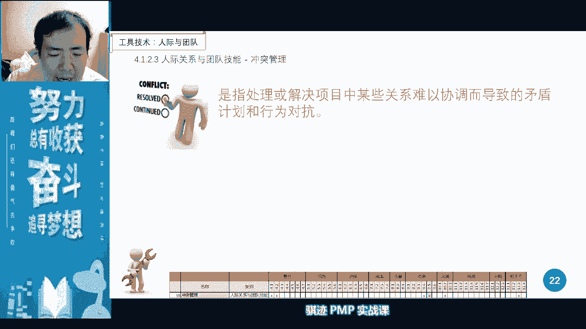

出入管理的五种方式，这五种方式我们会在团队管理或者团队管理，团队当中呢我们会讲啊，这里呢我们就不细讲了，就不是我们这个章节主要讲的重点，然后呢我们会使用到人际关系，就叫引导。

引导呢我们很常见就是有一个人啊，我们在前面向焦点小组里面引导呢，引导员呢是一种托对吧，但是在很多会议当中，引导呢是一个呃带领大家去的导向的活动，成功的一样，这样一个角色，他有一套方法论啊。

在我们偏僻格当中呢，我们会有一个东西跟引导要求，引导式讨论会就会有这样一个引导员，带领大家逐步的向我们要讨论的方向前进，去讨论啊，不要啊，辉月开y会，这样叫引导式讨论会啊，这是我们考试常考的。

有一个这样一个词，引导师讨论会好，那么引导就是这样，引导者就是这样这样角色确保大家有效参与，相互理解，是这样一个角色好，那么我们在工具基础上还有个东西叫会议，会议会议呢我们会在沟通管理当中呢。

会详细讲啊，还细讲一个项目经理很重的啊，大家可以看到啊，在项目下面我们的分类当中可以看到，会在整个项目管理当中，在各个知识领域都用得到，都用的啊，所以会这样一项东西啊。

是一个非常重要的项目管理的一个技能，所以项目经理要管好项目，开一个家心目经理是不是很有经验观上讲，就看他会不会开会，但是开会并不是简单就这么开的，开会有各种各样形式，开小会，开战会，开庆功会。

开开工会啊，会有各种各样的，还会不同的会有不同的开法啊，我们会在后面的内容当中详细讲怎么开，这里只要了解一下啊，开会是一种我也是我们一种制定项目章程啊。

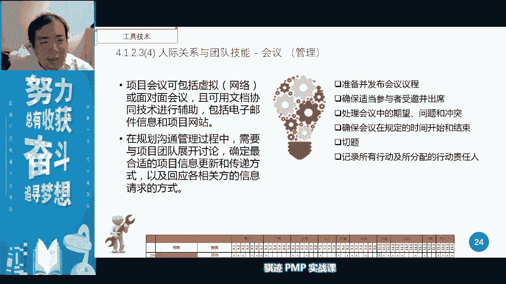

开会好，那么然后呢，我们会就输出一个我们重要的项目当中。

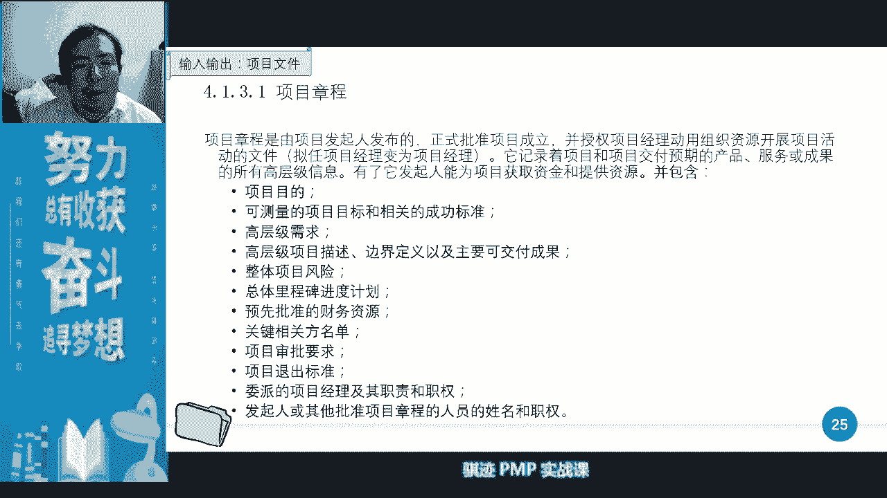