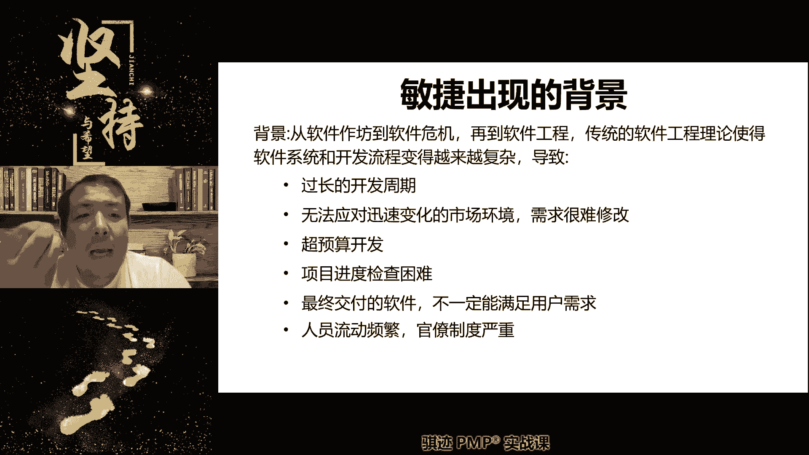
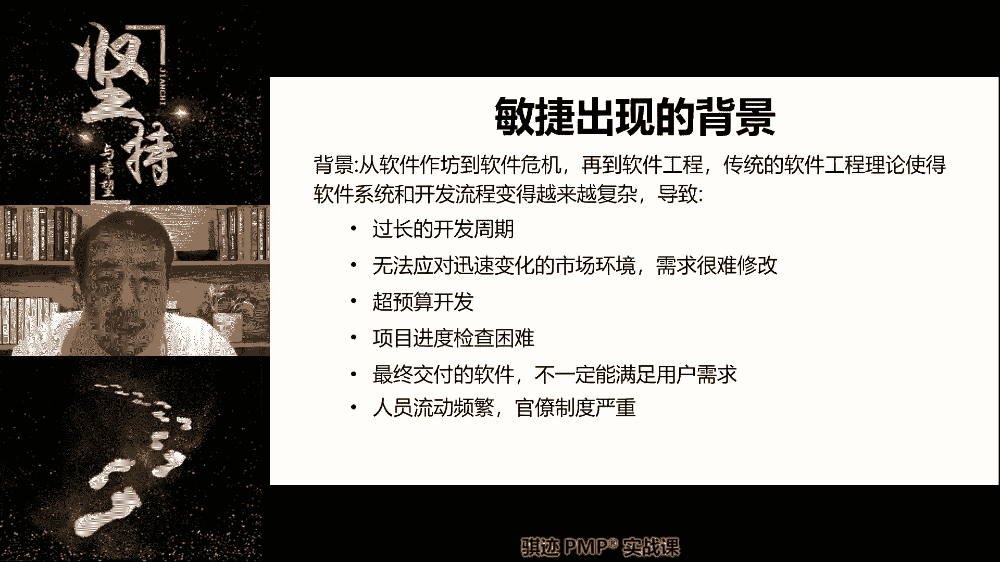
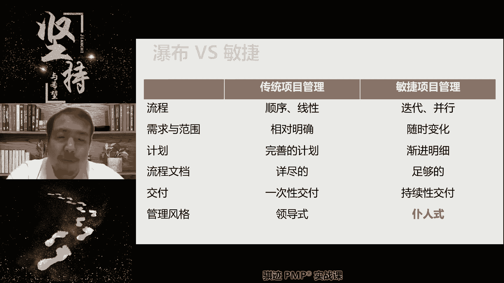
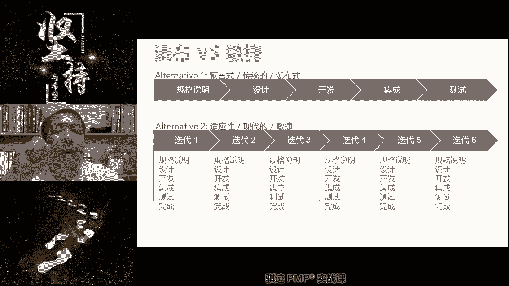
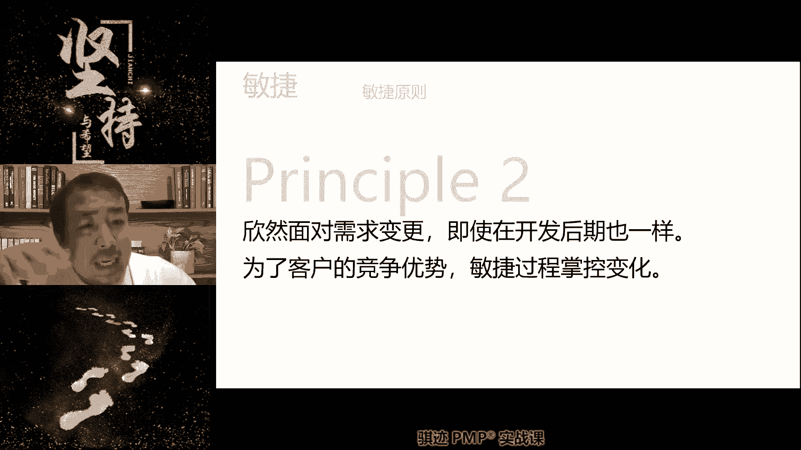
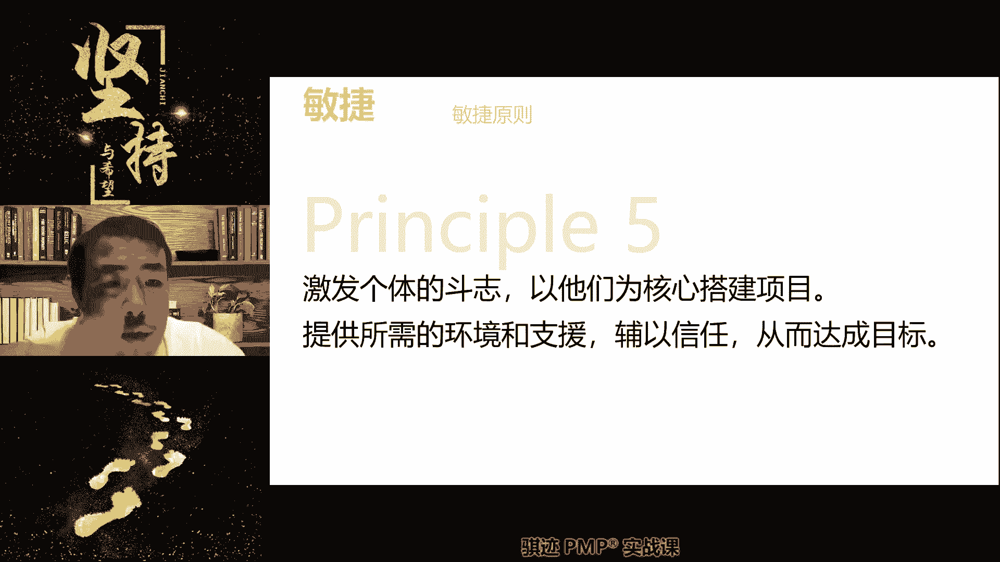

# PMP认证考试课程最新完整免费课程零基础一次通过项目管理PMP考试 - P62：PMBOK第七版 第十二章 敏捷专题中 -1 - 骐迹PMP - BV1Sb4y1f7Yt

这堂课我们首先先快速的，我知道很多同学节前讲的东西都已经忘记了，我们快速讲一遍，把节前的内容全部复述起来啊，但是有些同学你节前加班是可以，你过节的时候不能回看一下我的课吗，两个小时也抽不出来吗。

好那么我们开始讲啊，那么我们节前讲了，为什么会有敏捷这种形式的出现。

因为敏捷这种形式是为了解决什么。

项目过程中变化特别快速，改变特别频繁和剧烈所导致的啊。

我们原先的项目管理模式失效或者效率很低，甚至是无效这种情况而产生的啊。

敏捷的原则就变成了要事先先做计划再去行动。

变成什么依据市场反馈来做出反应，这样一种工作模式的改变啊，这就是敏捷，那么敏捷当中呢。

我们不再做预过多的预测，我们更依赖的是什么，人的主观能动性，随机应变，遇到什么情况啊。

解决什么情况，遇山开山，遇水架桥啊。

那么所以我们在呃多变的环境当中。

应用敏捷的主要依赖点是什么，依赖于我们的人啊。

所以敏捷的管理思路当中，我们原先依赖我们的项目经理来安排一些东西。

现在变为依赖团队成员来安排的东西，项目经理从一个项目的安排者。

变成了一个项目的支持者，项目的服务者，这样的角色转变，让渡了一部分管理职能和职责，给我们的团队成员，但实际上大家知道。

对整个项目最终负最终责任的，仍然是项目阶段啊。

仍然是项目经理，敏捷是一种为了适应不断变化，以人为本的这种方式，那么敏捷的交付方式呢也发生改变，我们原来预测型当中敏捷是怎么交付的，是一口气交付的，或者分阶段交付的。

我们可能会开发啊呃很长一段时间的项目内容，然后做一次交付，那么在敏捷当中呢，这不符合我们迅速适应环境改变的要求，所以我们会改变成什么频繁的交付，使用交付方式，表现为迭代加增量的方式进行交付。

那么什么叫迭代加增量，我们上节课其实也讲过，就是有每次交付的周期内有完整小而完整，麻雀虽小，五脏俱全，小而完整的一个开发小周期，这个小说集并不开发完全的产品，只开发增加的。

改善的或者是重做的相应的一小部分内容。

然后将这个周期呢做得尽可能短，使得它的交付频率尽可能高。

或者是啊多次交付变为频繁交付啊，所以它最终的交付形式就是迭代加增量，从整体上看，所谓的增量就是慢慢慢慢慢慢，我们的内容总是越做包含的内容和结果，从就做的多了，而交付的过程呢是通过交付一次拿到一次反馈。

再交付，下一次再拿到反馈这样的方式去进行，这是迭代，但是敏捷的实质其实为什么，使用敏捷实质是什么。

是通过以人为核心，通过不断的提升，不断的改进。

提高生产效率，寻找最佳的方法，或者寻找最创新的更好的方法，来不断的提高生产率和适应环境，然后能够做出更好的项目表现啊，其实它的内核敏捷的内核并不是迭代加增量啊，这么简单，真明白啊。

所以我们讲有时候讲敏捷就是迭代加增量。

这指的是什么，它的交付方式啊。

内核完全不一样啊，那么有一点请注啊，我们上节课讲过敏捷不依赖预测。

他对未来是不预测，因为未来不可知，无法预测。

我们已经对有最多最最最最即将要做的事情，做一个详细规划，而对而对未来比较远的事情呢，不做详细规划，依据反馈来逐步渐进明细啊，民间一些经验的，过去已经发生的事情能够指导我，但是未来怎么样，我们不知道。

我们也不做啊。

事先的啊，先入为主的判断。

名将中的项目经理呢是仆人式的仆人，是我们之前讲过，就和我们偏僻的，我们偏僻的项目管理原则当中的什么管家式的，其实是一致的啊。

提供管家式的啊，支持型的，然后啊以指导为主，并不直接干涉，但是背后呢暗中影响的那种管理类型啊，这叫仆人士。

啊敏捷和铺，那这个里面的区别。

我们上节课讲过，这瀑布呢是一个阶段只做一次领结的时候。

每次迭代都做各个阶段的事情，但他都做的很简单，很有效率。

多做多次的交付啊，就是敏捷加五诺。

敏捷呢没有啊，没有初始的最大的完整范范围，敏捷具有最详细的，但是最小的初始范围，我们后面会讲到叫做MVP minimize，Viable product，最小可用产品，敏捷的每次迭代遵循的是什么。

尽可能多，但是尽可能交付的是什么，最小可售功能，M f uh minimum marketball feature，所以敏捷的交付的结果角度来看是什么，MVP加mm f，就是这什么叫MMF。

那我们后面当然也会还会再提到，就是说如果我们做的比他这个东西还要简单，就没有价值，做到最简单，但是是有价值的功能，叫做mm f最小可售功能啊。

所以敏捷的定义呢是通过迭代，不断不断不断不断的去完整，所以他的这个范围定义的过程更加科学。

更能体现不断变化的市场需求啊。

好敏捷的交付形式是迭代加增量啊，它的结果表现是MVP加MMF啊。

这个都都挺近的，那么我们上节课讲过了。

什么是迭代，什么是增量，迭代增量怎么结合，这些我就不说了，那么敏捷开发宣言，我们上节课讲过了，敏捷开发宣言是什么，个体的互动生育流程工具，能够直接沟通的，不要选择间接沟通啊，能够用于开发的时间。

我们不会用于写文档，文档够用就好，不是说没有文档啊，敏捷当中如果考题当中问，要跟你说，我们敏捷不用问答，那也是错啊，那么敏捷当中客户合作，剩余合同谈判就是敏捷，我们签的合同一般是什么敏捷类的。

这种工料合同之类的，那么我们不拘泥于范围，仅仅在那合同会约定在有限的时间内啊，以有限的方式去完成这个客户的目标啊，我们没有会特有特别的特别的呃，项目范围的约定作为我们的合同标的。

所以这种时候呢我们更容易和合伙进行合作啊，我们约定比迭代次数，迭代次数，迭代方，迭代内容啊，迭代方式作为我们的合同的一个计价方式吧，最后是什么敏捷当中我们讲什么要响应变化。

我们积极的和积极的响应外部的反馈，来进行工作，而不是依靠计划啊，当然敏捷当中我们也不是没有计划，敏捷是有计划的啊，我们后面会学到敏捷，会有各个层次的计划，但是它的这个计划是遵循渐进明细和从高到低。

越底层的详细的工作内容，计划的越少，反而越高层次的东西呢计划的就尤其越长啊，来进行间接明细，好敏捷的12个原则，我们先讲了六个对吧啊，第一个原则是什么啊，能早交的尽量早交付啊。

东西敏捷当中的价值是什么，只有交出去的才是有价值的，捏在手里的东西是没有价值对吧，尽早持续交付，使客户满意啊，敏捷需要做甘特图吗，敏捷一般不需要做甘特啊。

这个问题问的非常好啊，敏捷一般不需要干燥度，敏捷我们会做燃尽图。

燃起图我们后面会讲，但是不会做干特的，因为甘特图是一种很详细的安排工作步骤的，这样一种啊，预测型的一种经典工具，但是他对敏捷的多个工作的，节奏的约束会比较大，所以敏捷一般是不做感叹。

Principal number two，原则二敏捷过程掌控变化，那么什么意思啊，我们上节课讲过记还记得吧，就是敏捷当中，其实我们的开发因为遵循了MVP加mm f，所以我们的开发结果是尽可能解耦。

相互之间需求关联不大或者没有关联，所以任何的需求改变都不会产生大规模的影响，从而使得我们方便的适应这种需求改变，然后给客户交付结果啊，那么从而拥抱变更，拥抱改变和变化，明白了我上节课讲过啊。

所以敏捷并不是说需求变更就没有代价，没有成本，不是这样的，它也是有代价，成本只是敏捷的这种形式以及敏捷项目特征，他交付的往往是推导改变，从来成本比较低的那些项目，那么它更适应敏捷。

因为他的项目特征和它的工作原理，导致了敏捷的变更，成本相对较低，较为容易。

所以他更拥抱变革啊，三敏捷呢应该经常性的去交付给招聘，我们讲交付频率越短，在符合客观实际和高效工作的前提下，越短越好对吧，我们上节课讲过啊。

好敏捷当中呢我们要和市场紧密合作，不能闭门造车对吧。

这是第四第四个原则，第五个原则呢是敏捷，以团队为中心，以人为本，传统的预测型项目呢是以项目经理为中心。

以项目经理的啊。

把决策为主啊，举行的第六敏捷当中提倡面对面直接沟通，预测型当中呢，沟通往往是以什么项目经理为核心，但是这个有前提，敏捷的团队比较小，所以它可以通过直接沟通，面对面沟通来达到最高效信息传递。

预测性项目当中往往人员较多啊，人员数量较多，参与人数比较多。

所以呢它都是什么，通过项目经理来沟通，虽然效率会差一点。

但是呢啊整体的可控性和资源的消耗呢。

会下降啊，所以这是两种不同形式，各有优劣，所以敏捷当中适合面对面，但是预测型的就适合以项目经理为中心，或者是以啊层级沟通为中心，大型项目啊，不是很理解。

有同学说不是很理解四的意思，是的意思，我们上节课正好讲过嗯，就是什么敏捷当中，我们讲要依据反馈来进行开发，就是我东西不会一下子全做出来，我会做出来一部分，然后扔给你，然后扔给业务人员。

然后业务人员根据市场反馈告诉开发人员。

你哪些东西做得好，哪些东西做的不好，哪些东西我还想要更深入的或者更扩展的，然后才进去进一步的去开发和啊发展啊。

进进进行进一步的开发完成啊。

所以敏捷当中我们讲究什么，要和市场合作，要和业务人员合作，就是这个道理，啊很多同学可能不太理解这种工作模式，其实这种工作模式是非常健康的啊，因为你不会闭门造车，你不会以为市场需要什么。

实际上你以为的并不一定市场认可买单对吧，所以这个思想其实我觉得不仅仅用在民间。

你们在日常工作当中其实也是一样好。

那么这是我们上节课讲到的，敏捷的12个原则的前六。

我们今天接下去正好花了十几分钟讲一下，那么接下去我们可以讲第七个可工作的软件，是进度的手要度量标准，这句话怎么理解，来来上来就跟你们互动一下，你们你们告诉我这句话怎么理解，是是科学的理解方式。

这句话怎么理解啊，接下来我会用我的另外一只手，不受伤的时候来点鼠标，结果的标准，那么敏捷当中我们完成与否，是以能不能为用户创造价值，能不能跑起来，能不能真实的运作起来为标准的，所以敏捷是以这句话的。

其实真实的含义是什么，是以结果论成绩，没有结果就是零。

有结果，多少结果论多少成绩，当做不出结果的时候，你的成你的绩效就是，明白了吧，所以敏捷当中我们的绩效考核，获得我们的进度跟进。

其实还是比较简单的，就看你做没做出东西，啊你做出的东西那就是有迹象，你有就是有进展，就是有进度，没有做出东西，对不起，一切都是假的，明白了吧，可工作的软件就是我们他在这里面讲的，因为它是来自于IT领域。

那么其实我们很多同学不是来自IT领域，其实你可以这么理解，能不能交出可以用的结果，可以给客户创造价值的结果，是我们衡量经过手段，你做不做得出结果，没有结果都是假的，所以敏捷当中存不存在99%完成。

不存在99%完成，就和没有完成是一样的，明白了，不考虑质量吗，质量是另外一块中心法律啊。

敏捷当中我们讲什么叫可工作，他一定是得通过。

有一个环节叫做迪迪，我们后面会讲啊，这是个非常重要的关键词啊，我们在考试当中肯定肯定会考的，就是dio d definition of them the remission，啊啊啊啊，不好意思啊。

因为我手受伤了，所以我只能单手打字，大家随便看一下啊，就是他会有完成定义来控制质量，那么注意点呢，大家大家对于质量这个认知，但是这个多提了点啊，对于质量这个认知，在敏捷的项目当中没有传统制造业那么重要。

因为敏捷项目当中的啊，可交付成果往往都是轻易可以修改的，无形的啊修改成本很低的，这些东西的质量重视程度不如有形的工业产品，建筑建筑行业的人，可交付成果这些来的这么至关重要，没有那么的重要，也很重要。

但是没有那么的重要，所以敏捷当中的质量的地位其实没有预测性，怎么考啊，你们只要只要意思，但是不这个理论是不会这么考，你会问你们的啊，敏捷是有质量管理，但是它的质量管理比较轻量化啊。

实用主义就是能用和不能用，敏捷对敏捷来说没有质量高到什么程度，缺陷率低到什么程度，敏捷的就是很简单，就是能用还是不能用，只要能用就是合格的，不能用就是不合格，就这么简单，因为无形的可交付成果嗯。

往往也就是能用或者可以用和不可以用，两种状态，它不会存在，传统的工业产品和工业制造的建筑产品等等，一些其他的项目，这种有用叫它会存在什么程度的，好对吧，可能很难存在这种东西。

好这是我们讲的敏捷的第七个第七条原则期。

可用的工作软件是静坐手标的，你就要记住，99%等于零，100%等于一。

好第八，敏捷过程可能可持续发展责任。

开发商维护人要共同维护自己稳定不掉持续啊，这句话就很有意思了，这句话隐含什么含义，请你们记住，Principle number，Eight extension kernel，不好意思。

不是故意形容啊，它的真实核心什么，敏捷不提倡使用加班家人的方式来完成工作，所谓的可持续开发可持续发展，它的意思是通过提高效率，通过寻找创新的方法来完成工作。

而非加班加人来，简单的加班加人来完成工作目标，明白了吧，所以敏捷不提倡加班，但是但是很多同学老师，我们公司就是敏捷，但是我们公司一天到晚加班，你们公司的加班比赛，玩家敏敏捷的加班不是一种真正的敏捷啊。

那么当然啦现实比人强对吧，理论上来说是不用加班的，但现实大家知道，这是理论和现实就是这样一个差距啊，但是理论上来说，敏捷是不提倡加班的啊，我们提倡如果我们需要加班才能完成工作，那么我们宁可不加班。

但是我们要找出，为什么不能够在约定的时间和约承诺的，约定的范围时间内能够完成这个工作，我们要找出这个原因，然后去进行改善啊，这是敏捷管理和工作的，一个一个一个一个思路思路，好敏捷过程可能是看法。

那么后面一句责任人，开发人员和用户共同或什么意思啊，敏捷项目经理，敏捷大师，敏捷教练有责任保护开发人员免遭过度剥削啊，避免剥削这个东西是很难避免过度剥削，敏捷教练，敏捷项目经理是开发人员的保护者。

他们应该保护开发人员啊免遭剥削，那么但是项目中的其他人呢也应该什么，积极的配合我们的敏捷大师，来维护整个敏捷的步调和敏捷的开发机构，不要一味的追求啊，短期内的交付结果等等这些东西啊。

这是我们的敏捷的定义啊，但实际上呢外国人可能很难做到，那么谁是防火墙，谁是保护者，就是敏捷项目经理，明白了，那么谁最容易在敏捷项目当中剥削开发人员，请告诉我，有经验的同学，请告诉我。

谁最容易在敏捷项目当中剥削开发人员，让开发人员加班，must p a p a不是PO对的，PO是啊，那么敏捷项目经理应该用挺身而出，向高层解释啊，为什么我们不能自爆，但是如果高层有他商业目的呢。

那么来了敏捷项目经理应该有责任。

PO是产品负责人，产品经理，产品负责人啊，产品经理。

产品负责人是开发人员的敌人啊，项目经理敏捷，项目经理，敏捷大师是开发人员的守护神啊，所以作为我们应该和开发人员成为好朋友啊。

那有些同学说高层就要三天完成怎么办，那么来了。

要让高层付出代价，你要告诉他三天完成也可以，那么你要付出相应的代价对吧。

我们不是无限可以压榨的劳动力啊，我们是有尊严的人，respect对吧，当然这个product owner就是产品负责人，产品拥有者，产品负责人，钱就知道钱啊。

完全少开啊，我们继续啊，Principle number nine，第九条，敏捷的能力来自于坚持不懈的技术，卓越和良好设计，那么敏捷的提升来自于什么，我们不断的精益求精，注意我们为什么用敏捷这种形式。

一能够更好的适应环境，二通过多次的迭代来实现一个精益求精的过程，所以敏捷在实践当中，并不是我们每次完成迭代目标，就能视为我们敏捷状态良好，而应该是要敏捷项目经理，敏捷大师应该是怎么样。

要经常的检视项目的状态，看看我们的项目，各方面是不是在不断的提升和提高，只有在不断提升提高的那些团队，所执行的敏捷项目才是处于良好状态，如果你在敏捷当中没有提升和提高，那么它敏捷也是有问题啊。

那么其中提到包括什么东西啊，人的效率啊，出错的频率啊，啊使用方法的改进啊，受市场欢迎的程度等等等等，这些都可以视作为提高，那么对于我们来说，坚持不懈的追求技术卓越良好实践啊，这是对于团队来说啊。

能不能更好的赢得市场，那么这一部分一部分成长是取决于开发人员，另一部分也是取决于PO啊，请记住，再强的开发人员，也捧不起一个猪一样的产品经理，请记住这一点啊，当产品经理不能很好地把握市场脉络的时候。

开发人员哪怕是开发之神，他也做不出好产品。

啊所以啊市场那一面呢并不仅仅缺缺缺团队，所以我们作为团队，作为敏捷项目经理，你能掌控的是什么，不断地在内部追求技术卓越和良好设计啊，这是我们敏捷能力的提升啊，所以敏捷应该是有一个什么。

在迭代和迭代之间有一个不断的提升过程，那么这个提升要通过什么东西来进行，促进和巩固啊，我们会不会学到回顾，retrospective回顾啊。

好principal number k以简洁为本，努力减少不必要的工作量的意思啊，这句话呢这就是什么意思啊，我能就是说如果项目回顾会不迭代，回顾会不一定是项目迭代回归也是啊，稍微等一下，我打个来一个电。

就是啊什么啊，我的笔记本垫下啊，这手不方便，那么这句话什么意思呢，敏捷当中我们能用简单的，但是有效的方法完成的事情，我们不会用复杂的，浪费更多时间和人工量的方法来去完成，这不是偷懒。

而是一种什么一种有效率的工作方法，那么我们省下来的时间是干什么的，不是用来摸鱼，请注意啊，我们在工作中使用简洁的方法，节省下不必要的工作量，所节省的时间是用于能够为客户创造，更有价值的产品功能。

或者去改善已有的功能，或者去提升自身的技术和交付能力，这个才是我们以简洁为本的目的，以简洁为本，不是为了尽快东西把它交出去，然后接下来就可以摸鱼啊，玩王者荣耀啊，不是这个意思，明白了吧。

所以我们在后面当中也会讲到啊，在这里给大家讲一讲，就说明进到啊，我们原计划用两周时间把这一期的迭代做完，结果团队成员呢工作效率很高，两周是十个工作日对吧，我们只用八个工作日就把所有的做完。

那么剩下两个工作日，团队可以自行决定，如果PO没有额外的要求，PO在这个迭代周期内，没有要求求你们继续做需求的话，团队可以自行决定需要做什么，那么我们往往会选择，团队最感兴趣的东西去做啊。

可以去进行提高培训，完善产品，或者甚至说是进行重构，进行架架构重新设计等等，这些工作都可以在这个，他们自己省下来的时间内去做，这个是有必要也是有好处的啊，但是不是给你摸鱼省下来的时间。

我们出去团建摸鱼打撸啊撸对吧，不是这个意思啊，好这是principal number ten，以简洁为本，努力成不必要工作量啊，那么这个再次强调一遍啊，减少不必要工作量不等于偷工减料，粗制滥造。

它是要达到我们项目的品质要求，和工作范围内的要求。

好principal number eleven啊，最好的架构需求和设计出自自组织团队，那么这句话怎么解释啊，那么有同学看到这句话，我相信有同学肯定会有个疑问，老师需求不是PO管的吗。

对的需求是PO管的，但是怎么实现需求是由团队自行决定的，P5会给个标准，你要达到我的标准就行，但是你如果能做的比这个标准更好，那自然是极好的，对不对，所以原则11告诉我们的是什么，拥有主观能动性。

能自发的自我驱动的团队，才能做出最好的架构需求和设计，什么叫架构啊，叫英文叫architecture啊，就是框架结构，我们知道就是说制作一样产品，设计一样啊，设计一样一款软件，或者制作一一个机器。

或者是建造一座建筑，它都是先要进行架构设计，是框架设计和大的方向设计，这种设计应该让专业的人做专业的事情，并且专业人在有专业驱动下去做这个事情，才能做到最好，那么在敏捷当中。

架构的设计需求的实现来自于我们自主的团队，让团队当具有自我驱动力的时候去做这个设计，是最好的，基于这个架构设计，然后呢，我们再去做详细的设计和用户需求的实现，做出来的东西才是最完美的，明白吧。

所以为什么敏捷项目相比传统预测型项目，在多变的环境当中做出来的东西更适应市场，就是一个是项目经理让你做啥，你做啥，一个是我们认为做啥是最好的，我们做啥，这句话能理解吧，11就突出了这一点。

就是我们认为是什么东西是最好的，我们主动去做，而预测型做不到这点，或者是很难实现这一点和做很好的，什么项目经理要我做什么，我才去做什么，一个是主动的，一个是被动的，你觉得哪一种更能做出对吧。

这个东西让我想起个段子啊，我们讲了半天，理论有点让我想起个段子啊，呃前段时间网上出了个招聘，招公司老板，公司老板突然跑路了，但是整个公司呢人员结构呢非常完整，然后大家心也很齐，就想重新找一个老板。

然后大家呢继续团结在这个老板之下，继续好好干活，那么这种团队啊，我们我不具体不了解，但是这种团队某种意义上它就是一种自主权的，能够自发形成驱动力，只是他没有遇到一个好的老板。

他一所运用的模式是什么预测性模式，所以他需要一个像项目经理这样的老板，来带领大家干活，当老板不在的时候，大家觉得呢怎么缺点啥，他们如果运用敏捷模式，甚至可以不用老板，我们每个人都是老板。

我们每个人都可以自己的管好，自己，推动这个工作，没有老板知道我们也可以干活对吧，没有老板，没有项目经理，也能每个人管好自己，协助别人一起管好工作和项目，这才是最高效的管理境界，有人问钱从哪里来。

666666666啊，钱不用担心，保洁大妈家里好几栋楼对吧，你们那个段子肯定听过对吧，找保洁大妈融资，保安大叔，保洁大妈都很有钱的，找他们融资。

好话不多说啊，我们开个玩笑，但但但是大家明白了，自主的团队的对团，就是对整个项目所起的推进作用，和它的和它的促进作用对吧，我们公司是司机大哥，66666啊。

好最后一个principal number twelve，团队定期反思如何能提高成效，并依据据此来调整句子，团队会定期进行反思，这个其实也是讲我们什么利用回顾，我们要定期的，无论有啊，就这句话。

当然有一个事情，就是说我们不是有了问题才会去回顾总结，哪怕没有问题，我们也会定期的去回顾，总结，目的是干什么，把好的东西固化下来发扬光大啊，如果我们在一个人身上发现了一个好的东西。

那么我们就会尽力的把这个好的东西，推广到所有人身上，这是敏捷的一个啊基本原则啊，我们的回顾不仅仅是为了有了问题才回顾的啊，所以敏捷的回顾会不一定是问题啊，这叫什么研，研讨会说什么。

那个根本问题的追查会不是为了针对问题，我们也可以是什么，发现了一种好的做法，发现了一个好的现象啊，那么我们把它啊总结出来，提炼出来，能够推广出来，这也是可以的，明白了吧，所以啊敏捷当中。

所以我们并不是说一开会误会啊，他就又要有人讨论讨伐谁的啊，要批判谁的，批斗谁的，不是这个东西啊，我们后面会讲到回顾会，它是有一定规则的，不是不是针对人，而是针对事，也不一定是只仅仅针对于坏的事情啊。

好的事情我们也会回复啊，回顾会是不是不允许追责和定则设，当然必须是敏捷的，回顾会是不允许对人，只允许对事啊，对事不对人，不允许指责责任，因为什么我们是自主的团队，每个人都是责任人的一份子。

We are family，好那么这是我们的敏捷的12个原则，那么我们回顾了一下啊，我们后半后半个后半截的一些原则回顾下，那么这些敏捷原则呢大家都领会一下，不一定要背出来，但是理解领会一下。

对于考试很有帮助，因为考试的时候，你贯彻这些精神去回答题目会比较有好处啊，这是敏捷的12个敏捷原则。

那么接下来我们讲敏捷当中的MF啊，我们这个我们之前讲过MMF啊。

这里当时全英文啊，什么叫mina minimal。

什么最小的minimal的意思是最小的哎呀，我这个手哎呀，还是这个这个这个这个还是得用这只手，得得得用真伤到的手啊。

最小的marketable是什么，能够卖钱的feature，什么功能特性，这是做的最简单的，但是却能卖钱，那个功能特性称之为最小mm f啊，我们尽可能在敏捷当中，将各种功能特性结果分解的尽可能细化。

细化到最小，颗粒度最小的那个单位单元是什么mm f啊，那么有什么好处啊。

就我们前面讲的可以解耦，可以更细化的制定标准，因为我们就会制定一个什么东西呢，这里就写了d o d definition of the啊，这个我们后面也会讲制定呃。

呃验收合格标准。

你可以认为是验收合格标准啊，好，那么接下来我们会介绍几种敏捷的排序法则啊。

不仅仅是这几个啊，啊我们会介绍若干种敏捷当中的排序法则。

那么首先我们问你们。

敏捷当中为什么要进行排序。

它的作用意义是什么，有没有人能告诉我，敏捷当中我们为什么要对用户的需求进行排序，它的作用意义是什么，价值最大化哎这个表述有点对啊，提高效率，这个跟效率没关系啊，注意需求排序和提高效率没关系。

分清主次也没有主次，需求没有所谓的主次，那么注意，敏捷当中的需求排序是无时无刻都是存在的，它的主要目的是什么，我们要确保我们始终是在做和即将做，最有价值的需求，无论是PO也罢，团队也罢。

当前做的和未来做的总是在做的，都是最有价值的东西，当这个东西不足够有价值高的时候，他就应该往后面扔，我们当前做的永远是在做最有价值的事情，对，因为只有最先完成了最有价值的需求。

才能将最有价值的东西尽快的扔给市场。

使得我们敏捷项目所产生的价值达到最高，明白了吧，所以客户的价值排序这种方法，其实很多时候也是我们生活和工作当中，需要做的事情，唉你们生活当中，我知道你们很多的同学，可能就无不太会用这种方法啊。

我们接下来介绍几种客户价值的排序方法，其实也适合运用于生活当中，你生活当中经常会遇到很多的事情，要做很多很多的任务要完成，有很多的事情，你怎么科学有效的把排序好，按照轻重缓急，按照价值高低将它进行排序。

这也是一门啊生活的艺术和生活的技巧，所以项目管理也可以指导你生活啊，虽然生活当中很多时候是讲究感性的，他并不一定理性啊，所以我们的排序方法是尽可能的都是理性的啊，生活当中很多东西都是感性的。

但是也可以给你的生活提供一些指导帮助。

对吧好，我们一个一个的介绍，第一种是最简单的叫做simple scheme啊。

simple scheme是什么意思啊，我们将优先级设为123。

一般来说数字越小，优先级越高啊，那么每一个需求来的时候呢。

我们都会对它进行优先级定义123，那么这个定义一般是以PO定义的为准啊。

注意我们所有的客户需求呢，一般都是以PO定义的为准啊，一般都是以PO定义的为准，所以1231般是POD。

但是团队也看，也可以参与评级，但是这种评级必须有什么有明确的标准。

有明确的标准对吧。

那么我们来举个例子，人生当中优先级最高的需求是什么。

抽象一点，人生当中优先级最高的东西是什么。

人生当中的各种需求，优先级最高的是什么，对生死生存对的吃饭有个吃货暴露了吃饭喝水。

我们应该讲是生存。

人类生活的生活当中，优先级的第一位是生存。

我叫生死，一切需求在生死面前都是后面的啊，先有生存才能谈其他啊，有了生存之后呢，才会有什么东西啊，接下来会有分歧啊，接下来会有什么啊，有些需求是盖需要，有感觉这个就涉及到马斯洛了啊。

我们涉及到马斯洛层次了，我们后面会课程会讲到，就是有些人会追求什么啊，感情有些人会追求什么啊，金钱有些人会追求什么地位对吧。

有些人会追求一些低级原始的欲望等等等对吧，所以这是人生当中对于不同需求的优先级对吧。

但是我们有一点，如果你饿着肚子渴的厉害。

其他的一切需求都要让位于先吃饱喝足对吧，马斯克金字塔，这是谁写的啊，马斯洛层次理论好吧，啊后面会讲到了马谡的层次理论是什么，第一个是什么生理，第二个是安全，第一个，第三个社会交往，第四个是容易自责。

第五是自我实现，对啊，但是这种分级方法的缺点是什么，不容在一些啊不容易区分的情况下，往往会变成什么，什么都是最优先的啊，我们在工作中经常会听到哎呀，经常帮忙帮忙，先把这东西先完成了，又心情很棒。

你又过来了，哎呀这个东西很重要重要帮忙一定要先做，每个人都自称优先级是最高的时候，就没有人是高原机，当所有的优先需求的优先级都是最高，一年级的时候，就没有所谓的优先级，这个大家很能体会吧，是不是啊。

所以只有在优有。

可以参与优先级评定的整个体系当中，每一个人参与者都是理性的，客观的，并且能够较为容易的区分需求的优先级的时候。

simple scheme这种方法才是简单有效。

它呢分级速度快，简单明了，但是啊就像我们上面写的。

容易出现全是优先级对吧。

所以像老师这种人，有时候跟别人打架，尤其是我在提一些需求啊。

提一些要求啊等等的时候，我会很明确的告诉对方。

我的优先级是多高，我不会每次都问题啊，你们这个当然这个就讲的稍微哎呀。

这你们以后注意啊，作为项目经理或者以后作为产品经理。

或者作为一些管理人员，你们向其他人提需求。

提要求的时候，不但要明确的表达自己的需求和要求，还要告诉对方，你的优先级是多高，期望的时间是什么时候完成，注意这个东西一定得合理，而且你不能每次都是对方提的，都是我的优先级很高的东西，10万火急。

一定要优先完成，如果你每次都这跟别人这么亲，那么就没有人重视明白，一定得是告诉对方。

像我提的是优先级不高，你可以慢慢做，我的期限较为宽裕，那你就慢慢做，但是我要求优先级高的时候，你一定优先高的给我，当你有自觉去维护你所表达的优先级的时候。

别人才愿意配合你的优先级分类。

去帮助你完成啊，所以我工作中经常会遇到这种情况。

我优先级不告诉别人说啊，这个事情两周之内给我做完就行，没关系。

优先级是普通，我跟他说，优先级是普通，有时候有些事情比较急的啊，这个事情又呃优先级高一点啊，啊一周之内完成，又差不多一周之内能交给我都是满足的啊，那么只有当很紧急的时候。

注意项目经理一般不会提特别紧急的需求。

因为这显得你什么管理的时候没有预判性。

我只有极少数情况，我说哎呀这个事情江湖救急特别急。

能不能一天之内给我做出来，我提这种需求，一般都是在极少情况才会有别人提，这个时候你从对方的角度，我们换位思考，你从对方的角度看。

叉老师提出要求的时候，你会觉得诶叉老师这个人很靠谱对吧，跟我提需求的时候，有时候呢很宽松，有时候呢稍微紧一点，只有真的很重要的时候才会融资。

那么我觉得这个人给我提要求靠谱靠谱的人。

每个人都会有一个什么反馈，对方如果是靠谱的，我也得靠对吧，人家真诚待我，不不每个事情都说这个游戏就很高。

那么我应该也尽可能的满足他的要求，这个时候你的需求的实现就有保障，相反如果我们换一种情况啊，这是就是讲管理实践的，相反我们换一种情况，每次你提需求都说哎呀，兄弟这个食堂伙计明天就交给我是不行。

结果呢每次你交给他的时候呢，哎交给你，你后面继续后续后道工序做了没有，他说哎呀，这后备工序还不急，还在那等两天，别人如果知道这种情况，他就很容易觉得是吧。

你辜负了我对你信任，你说10万火急，我把你赶出来了，结果你又不珍惜时间，你不是拿我的时间，往往我可能也有同学，很多东西做，我重视你对我的表达和诉求，我帮你完成了。

缺你缺不当，我给我当回事，我下次还会重视你的需求吗，不会对不起，排队去，明白了，这个有就有一点像什么东西啊，就像烽火戏诸侯那种感觉，狼来了和烽火戏诸侯就有点像那种感觉，明白了吧，所以优先级的设定。

对于我们每个提需求的人来说，这个自我管理其实也很重要，当你能够有效的去表达这种优先级的，这种排序的时候呢，别人自然而然的会非常真实，和你的约定，满足你的个性要求啊。

好我们不多，其他东西跟课程无关的东西，不要扯太多啊，我们继续。

第二种叫做莫斯科法则。

注意莫斯科法则和很多同学会跟后面的ko ko model。

古科诺模型啊相混淆。

那么请注意，莫斯科法则是从客观角度去评判需求的级别。

那么conor model呢是从主观角度去评判。

这个需求的分类，它使用区别。

但是两者都都会在适用的场合有效注意啊，需求不是说你认为它重要，它就重要了，很多时候，需求的重要度，也来自于需求提出方的主观诉求和感受，这一点请注意，所以不是所有的东西，作为开发团队和项目经理的。

你能够从客观决定它的，很多时候你的管理还要遵从于主观意愿啊。

这个我们刚刚讲到再说啊，我们先讲莫斯科法则。

客观的就是你客观看待用户提出的需求。

你会把它分为四层，第一层must have。

必须得有没有这些功能系统就没有价值啊。

我们来举个例子，微信的各个功能当中什么功能是must have，请告诉我，微信的功能当中哪些功能是must have，聊天，文字沟通和语音沟通支付，不是有很多人是不用微信支付的啊，扫码加好友。

微信的must have。

它的核心点其实很简单，文字和语音视频。

有时候甚至都不是文字和语音沟通，是微信的master key。

对信息接收，信息收发，微信功能当中什么功能是，什么叫吧，应该要有，如果没有这个功能，微信就会变得可有可无，价值大幅度降低，或者使用微信其实也没有那么好，那是什么，微信支付朋友圈对吧。

现在还有什么微信视频号小程序，这些都是微信的SHADER，开没有这些功能。

微摇一摇，哪位同学摇一摇的啊。

啊这些功能啊都是什么。

都是呃让人们更喜欢使用微信，而不是说他必为了这些功能而使用微信，明白啊，should have的意思就是，不是你选择这个功能的必然理由，但是是什么，你喜欢他的理由对吧，哎对对的啊，漂流瓶和摇一摇。

现在变成时代的眼泪了，大家玩的越来越少了对吧，因为这个东西就是不可能被取代，所以它是可以被取代，但是这个东西呢依然是它的重要的功能的卖点，对不对啊，所以这是很啊，所以对老师来说，微信支付很重要。

因为微信支付对我来说很方便，因为我不用支付宝，所以微信支付是一个什么。

当然我还会有备用手段，用用用闪云闪付，银联云闪付对吧，那么微信有什么功能是could have可以有，但是就是可有可无的那种微信上面的购物对吧，大家大家打开哎。

拍一拍撤回来，拍一拍撤回来，不至于不至于我觉得最可有可无。

我相信大部分同学都觉得可有可什么，微信的第三页发现里面的那个什么，那么微信里面发现第三页里面那个什么购物啊，那个什么什么搜一搜看一看啊，这些东西是不是啊，我相信大部分人使用的频率和对他的。

依赖程度都很低，对不对，小程序都是血的开播，我觉得小程序越来越多都是虚的开，因为小程序确实很方便，但是微信购物你们多少人经常会使用的，我相信这个比例不高吧，你们多少人会经常使用微信的，搜一搜啊对吧。

看一看啊，这些东西也是很少了吧，这就属于真的属于锦上添花的东西。

微信借贷啊，微信借贷到不一定是。

但是你属于这两者之间啊，大致明白这意思啊，大致明白明白，我们用微信举例，大家都能都能理解对吧，最后一种呢是what have but not this time，就是对微信来说。

这个东西是实则没有必要的，可以强行加上去，但是没有必要，你们想想看，微信上面强行加上去什么功能是可以有，但是没有必要，想一想，开机动画，哈哈嗯有道理，微信的开机动画其实是有的。

开机画面没有动画也是有的啊，还有呢广告。

那就错了，广告是必须的对吧，腾讯套广告要赚很多钱呢，这倒是必须的，还有哪些，想想看，行程码66666666666666啊，对啊，有同学有一位同学尾号5428的同学说了，已读已读，已回。

这些功能都是什么啊，钉钉啊，那些什么，那么微信为什么可以有，但是它放在企业微信当中，是因为这些东西严重影响了微信的社交属性，它可以做的，这是非常简单，但是它会严重威胁这，微信给人们创造的自由社交属性。

所以你看到微信当中，它会显示对方正在输入对吧，但是它不会显示对方这条读了还是没有读，就是因为为什么，这会使得人们认为啊沟通被干涉，被监控，从而放弃使用威胁，所以它是可以有的，但是其实它不会增加。

我微信通过什么在企业微信啊，在那个叫什么的其他的产品当中实现啊，腾讯那么阿里来的钉钉当中实现对吧，对的呀，所以它就不会放在微信的，我们没有说企业微信对吧啊，这是一个很典型的例子啊。

这个例子就举得非常好啊，所以通过这样的排序，我们其实就知道了，我们做一个微信哪些是必要的功能，哪些这个必要功能至上的，我们重要的功能啊，卖点啊，重要的功能的卖点，那么接下来哪些功能呢是可有可无的啊。

锦上添花的，而哪些东西我们是绝对不会做的对吧。

然后这呃接下来这个这个100点法则。

我们介绍啊，100点法则其实比较简单，100点法则呢则是认为什么呃，用一个人的判断或者少数人判断啊。

一个需求的级别呢是不科学的，所以100条法则运用的是什么，是投票决定，当出现一个需求的时候，所有和这个需求相关的人都是该系。

然后他们可以将这100点点数呢，分配在一个需求，一堆需求或者若干个需求上进行分配，也就是说我们这里有一堆需求，然后呢然后呢我们这一堆需求当中呢，我们会对这对需求当中的若干个需求。

来进行投票，我认为这个需求对我来说价值高，投50分，我们就投50点，那个需求呢对我们价值比较高，不不怎么高，我们就不投啊，这个需求呢可有可无，我就投个五点，然后呢我们可以既投完。

也可以不投完，也可以把100点都投在一个需求上，也可以把100点分配在若干个需求上，进行这种投票，然后当所有的干系人把这些投票投完之后，我们对所有需求的得票进行统计。

选出得票最高的纳入实现这种方式，是不是像那那那那那我们网上玩投票。

然后什么海选，什么先海选，然后纳入了什么什么线下对吧，这种前几年很多那种那种那种综艺的，那种那种那种选秀节目对吧。

是不是经常有啊对吧啊，这个就是什么100点法则啊，100点法则好，所以这个方法其实是比较简单的，那这种方法可以避免个别人，对于个别需求的偏见，可以使得需求在呃所有人当中形成一种啊。

公平的投票是决定的一种啊，优先级高低啊。

但是这种方法呢也有其缺点，什么缺点啊，相对来说投票的效率比较低。

然后频繁地组织很多人投票呢，啊这个事情也不太经济啊，这是他的缺点，这就是所谓的100点法则。

100点，One hundred pointer，Ne，OK这个也能理解吧，所以莫斯科法则是根据必要性与否。

一个一个来啊。

它的缩写是故意错的，叫莫斯科卡子啊，must should可以问。

100点法则，那么我们把这个讲完吧，最后我们两个卡color model。

卡科诺模型，Color model。

它的定义是定义，将需求从主观角度去定义三层需求，注意他的角度是主观的啊，不不需要客观的去衡量这个东西的重要性，因为一件事情，他的主观重要性和客观重要性，可能是不一样的啊。

比如说我们举个例子啊，当然不带有对任何人带有恶意啊，某些对于某些爱美的女生来说，吃饭不是一件重要的需求，但是美颜打扮自己是一个重要的需求对吧，所以在KO模组当中，基本需求是什么。

我要变得漂亮是我的基本需求，吃饭呢是一种基本需求，甚至是治很多对女生来说，很多女生来说是一种基本需求之外的什么，这种期望需求能稍微吃一点就可以，我不希望吃多少或者吃多少。

我只要能够让我自己变得漂亮的人对吧，但是你用莫斯科法则去进行分类的时候，那就不是了，吃饭是必须的，如果不吃饭，人就会饿死，死了就什么都没有了，对吧啊，一个漂漂亮亮的呃死人生没有意义对吧，明白我的意思吧。

所以科的模型是从主观角度去区分需求，它是看需求，对于客户而言，对客户而言。

他的满提高他的满意程度最高的那些需求。

我们称之为基本需求，只有达成了那些需求，客户才会满意对吧，所以对爱美的女孩子来说，她的基本需求是什么，我一定得漂亮，我不允许在任何的社交场合场景当中出现，不美丽的我，那么对于叉老师来说，基本需求是什么。

我的基本需求是，我希望你们每个人都考过PMP，然后骄傲的出去跟大家说啊，我是超老师教的，哈哈哈啊啊，这开个玩笑啊，这就是基本需求啊，那么呃是客户达成满意的必要条件啊，达成每一个必要条件。

那么什么是期望需求啊，来了期望需求，如果我们以以查老师举例的话，我希望你们在考出PNP在基础上能够学会，但如果对于基础不深或者是经验不是很丰富，同学能够学会一些，项目管理的原理。

道理能够帮助大家从做技术做事情变为做管理，那么这个我会觉得什么有一种锦上添花的感觉，这叫期望需求啊，我我所以我在上课的时候会不仅仅讲理论知识，也不仅仅讲考试会考什么东西，我会讲一些实践当中的道理。

希望大家不仅仅通过我的课程学到怎么考过pp，也希望大家通过我的课程学到怎么去做管理，当然是比较基础的管理啊，这是我的期望需求，那我的兴奋需求是什么，100个学生当中，能有一个学生在学完我的课程之后以后。

见到别人就说我是查老师教出来的，那我就很开心，这是一种我不抱期望，不抱期许，但是如果有会让我很兴奋。

很意外的那种意外之喜的那种东西。

叫做兴奋需求，你可以称之为认知为意外，只是意外的收获，这种感觉是因为虽然你们在现在，我看听听我的课很热闹，但其实啊，我的很多的学生在听完我这个循环之后，可能若干年之后呢，可能会就会淡淡忘记了。

曾经听过这个啊，这个这个糟老头子讲了讲了很多故事，段子啊，是上课的很多很多剧情都淡忘，我们都是彼此人生当中的一个匆匆过客对吧，但是100个人里面，如果有一个人能够记着我，甚至是在啊嗯很多场景当中。

能够比其他的场景当中能够提到，我肯定会一句，如果现在更进一步是如何能够让我知道一下，那我会觉得很开心，好我们以我这个举例子，大家明白了什么是基本需求，期望需求和兴奋需求，所以兴奋需求是一种什么，兴奋。

有同学说有同学在公屏里说的那个黑子啊，有点兴奋，需求是什么，我们认为这个东西是不太可能做得到的，或者说是不抱期望，但是如果能做到，会让我们有种惊喜感觉，就是一种兴奋惊喜感觉，这种叫心态需求。

那么期望需求和兴奋剂有区别了，期望需求我们认为是能做到的，但是并不太容易做到，但是如果做到会有一种锦上添花的感觉，这种需求，而基本需求的只是我们认为必须得做到，这个事情，如果不做到，我们是不满意。

就像你们如果你们没有考出PMP，没有拿到P证书，我觉得就没有满足我给你们教上课的，我的基本需求，无论我教的在天花乱坠，没有人能带领大家通过考试，对我来说，这个也总的来说也是老师教的不够好对吧。

我只能从自身认为说啊，这是我们家，这是没有满足我对于自身的一种期许对吧，这就是解放区，明白了吗，所以这些都是从主观角度去进行判断啊，那么我们学了color model，它主要作用是什么。

我们就可以在今后的工作当中，可以通过这个模型来分析客户角度，从他的主观角度来分析他的需求，处于哪一类需求，那么我们肯定会着重于先实现基本需求，然后努力去实现期望需求，在有余力的情况下再去实现新的需求。

也就是说考试先要考60分，然后再努力考到考个80分，然后是不是能不能考到90分以上呢，没把握，但是尽人事听天命，好好，那么这就是我们这讲的一些需求排序，那么呃呃我们稍事休息啊，现在是21。05分。

我们休息到21。20分。

继续啊，休息10分钟好吧，隔壁同学现在才来，有点晚了啊。

