# PMP认证考试课程最新完整免费课程零基础一次通过项目管理PMP考试 - P68：PMBOK第七版 第十五章 团队绩效域上-1 - 骐迹PMP - BV1Sb4y1f7Yt

训练课程啊，那么今天我们开始讲团队绩效与团队技巧，讲的什么，是对于团队的啊，建设，并且使得团队能够产生生产力的这样一个，管理的绩效的领域啊，那么团队绩效率的绩效，主要表现为团队的生产能力。

团队的执行能力和创造能力的这样一种结果，是团队绩效遇到主要的绩效目标啊，因为什么东西呢，就是说呃在原来的篇幅和第六版体系当中，团队提效率其实是属于资源管理，在平安博和第五版当中。

其实团队的绩效育是属于什么啊。

人力资源管理啊，第六版呢增加了这资源食物资源观。

但是内容比较少，第六版呢又增加了啊，第六版呢又增加了实物资源，那么第七版呢它改为修改为啊，我们的团队绩效率啊，就是说呃因为在团队的管理过程当中，因为呃版本的更替啊，大家知道一代版本一代神对吧啊。

所以在第七版当中大量引入了敏捷的相关概念。

所以使得团队绩效益当中的内容空前丰富了啊。

版本之子它是真版本之子。

是第七版当中比率增加最多的一个知识领域啊，所以我们会花两节课的时间去讲，在第六版的老考纲以前。

我们的成本那一章是会花两节课去讲，因为那一章当中有我们的政治分析。

政治政治管理计算啊，这是必须要掌握的，考试必考的，然后那个那个被大刀一砍给砍掉了啊，时代的眼泪对吧，然后砍掉置换下来的课时。

我们就放在了团队绩效与上啊。

团队绩效从原来的一节课变为两节课啊，因为这个理啊原来是一阶或者一阶半相变两球。

因为这个季效率变得考题更多。

而且分为敏捷环境当中的和预测环境当中的，团队的不同的组织方式，管理方式。

管理思维形式，组织形式等等一些东西都有所区别啊，都有所区别，所以注意啊，所以我们这两节课，今天的这节课，下周这节课都非常的重要。

请大家一定要认真听好吧，那么团队计划。

在这个计划当中，我们要创造文化和环境，这第一句告诉你什么，在项目管理当中，物的管理是相对比较简单的。

只要花钱哪拿来买来就行，像采购我们都没有独立的绩效啊，这知识领域了也没有独立的绩效率，没有采购绩效率。

对不对，因为什么这个东西已经被集成到了规划当中，成为规划的一部分了。

因为什么我们采购说差的就是一手交钱，一手交货。

对项目管理来说啊，就是一手交钱一手交货，这个过程变得什么简单和易于管理啊。

实践当中其实没有那么简单，但是我们是花钱就可以拿到我们想要的东西，对吧，如果我们花钱没有拿到想要的东西来。

我们按照按照合同，按照流程去办事，但是团队不行，为什么团队是不是一个你花了钱雇了人，请的人就可以产生生产力的这样一个场景，他需要进行团队的组建建设管理。

不断的提高，不断的啊加强才能达到一个。

或者是说一直在保持一个高效。

或者不断地提高绩效的这样一个状态，所以管理团队是项目经理的，现在现代啊最新的项目经理管理。

项目管理趋势当中，项目经理的一个必须要具备的一个一方面能力，能够带团队啊，我们在外面呢，很多的大家看到什么这种猎头招聘啊。

机会啊，这种很多的这种比较好的工作机会当中，都看到了吧。

能不能带好团队也是一个核心关键点啊。

所以项目经理是他是一个初级管理者。

但是他是走向高级管理当中呃，可以培养出一个能力，就是什么能够不能带团队，能不能从带小团队变成带大团队，这个团队怎么带，我们在团队绩效率的这两节课当中会讲啊，会讲会给大家介绍，所以啊我们。

所以我们呃话转回来啊。

要想创造啊，要想创造高效的。

有效能的，能够高效产出的团队，那么首先一点啊。

我们首先一点就要知道什么，先要给团队创造文化和环境，文化和环境啊，不好意思，这时候还是不太还是不太方便啊，画圈圈画什么东西不太方便，我把它擦掉，就框框可能会好一点，首先创造文化和环境，那么什么意思呢。

不同的文化适用于不同的项目，注意文化并没有优绝对的优劣之分啊，比如说有一些项目当中，我们会建立什么文化，绝对服从，就是下级绝对要服从上级，那么有同学说这个文化不如什么，我们畅所欲言。

每个人发挥自由的想象力和啊。

自己自由执行会更好，是不是不一定是啊，比如说打仗的时候就是要军队什么要绝对服从。

这是因为这个环境要求啊，在项目当中也是一样的。

有一些项目就要求团队成员必须高度的服从。

项目经理和项目管理团队的安排，因为有些有些项目尤其是传统工业项目啊。

我们的呃呃高风险的一些制造业，研发等等一些啊，不是研发制造业啊，呃一些呃执行一些高风险的任务的那些项目。

他们一定要有良好的纪律和执行力，保证保证能够过高风险的过程。

能够尽可能不出错，那么这个呢就需要什么绝对服从的文化。

而另外一些项目呢可能是吧是艺术创造啊，啊开开拓创新的那些项目呢，就需要有自由的啊包容的。

开放的文化，所以不同的项目它需要的文化是不一样的啊。

我们这里当然要多说一点，为什么要多说一点，因为你们要了解这个东西的本源和过程啊。

同时项目的文化小环境，是受到大的组织乃至社会环境的影响。

啊啊我今天刚刚看到一篇文章啊，大家那个教父看过吧，教父阿尔帕西诺演的啊，啊，马龙白兰度和阿尔帕西诺演的那个，经典的教父三部曲里面，在教父一当中，马龙白兰度演的老教父，为什么一代教父为什么拒绝了毒贩呃。

就是说呃索拉索要求那第一代教父说，你只要资助我们一个启动资金200万，然后呢提供政治和警察的庇护，我们第一年就能给你产出几倍的这个投入啊，每年都能产产出对吧，这是一看就是一个弘扬赚钱的生意。

但是那个教父为什么为什么拒绝了，这个背后其实是有深刻道理的啊，我今天看到的觉得有道理。

黑帮要维护的是黑帮文化，这种文化是等级森严，但是有秩序，但是这种等级层的秩序是建立在什么可控，太来钱了，他会使那么马克思马克思这收获对吧，300%的利润，人们可以罔顾一切法律等等吧。

对不对，所以人们可以罔顾一切法律，道德秩序，良知啊，伦理这些都是可以抛弃的，因为利润实在太高，这会导致组织无法有效去运行。

反而会导致组织的瓦解，所以在教父当中啊，在教父当中。

就是他知道能赚到钱，但是这会导致组织的崩溃啊，不符合我们组织的文化，所以他放弃了这啊，但是对于那些活的那些，就是说见不得光的那个这个社会的一面，像像黑手党，毕竟也是见不得光了嘛对吧，对他们来说。

这些东西你能受到这个环境抵抗影响吗，不能，所以最终一代教父所创建的啊啊保守的西西里，西西里人的这个黑人文化，这个圈子最后就被毒贩给打破掉，所以二代教父接受一代教父的生意之后呢。

他就把家族从东海岸迁到了西海岸。

去做赌博生意，因为这样可以远离赌，赌博也是挺赚钱的，利润率高点，这个对组织带来的破坏，可以把家族延续下来，所以我讲的这么复杂的一个故事。

是告诉大家一个组织和环境当中的各种因素。

会影响到你项目当中团队的文化环境啊。

你是很难完全屏蔽和避免的。

如果你们的组织是一种什么保守的啊，求稳的，稳健的，不愿意犯错的组织，那么你的团队必然会受到这种文化的影响。

也不愿意犯错和冒险啊，所以在一个保守的组织当中。

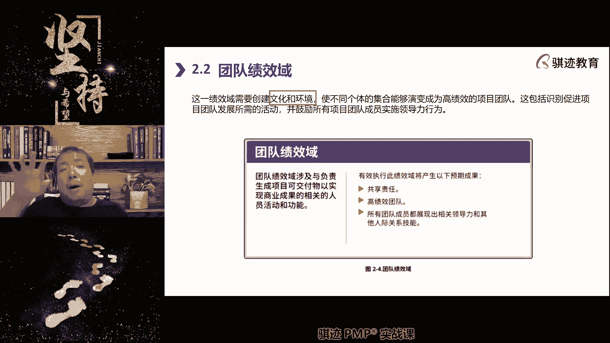

去做创新的前沿的探索，项目必然遇到的阻力之一就是文化阻力，人们可能很难接受，或者他的文化。

或者他的环境很难让他，很难让他接受这种文化设定啊，所以一定程度上团队的文化也是受到组织影响，但是项目经理可以建立起一个相对呃。

对项目有利的项目内的小文化圈子。

比如说我们的公司做事情挺挺拖沓的，挺官僚的，但是我们可以在项目团队的呢，尽可能的效率高一点。

大家畅所欲言，开放一点啊，可以可以自由一点啊，这是相对可以做到，但是没有办法绝对摆脱环境的影响，明白吧，所以团队的建设脱离不开环境啊。

所以你带领团队，比如说去赚钱，结果呢你的团队有一个外部和环境影响，比如说有个什么十倍五倍十倍的利润，那么你的团队自然就带不好对吧，所以这个故事告诉我们什么，有时候不是你不够强，而是环境改变人对吧。

像N多年前啊，N多年前互联网潮起的时候，很多传统行业就受到了冲击，为什么传统行业雇一个人，工资开五千八千就够了，结果互联网过来啪，从传统挖人一挖的嘛，就是年薪三五十万甚至七八十万。

100多万，200多万，这么挖人嗯，这个工资成倍的往上翻，谁抵挡的了对吧，你再好的文化也抵挡不过金钱的诱惑对吧。

OK啊这个大家都明白了啊，所以我们继续往下讲啊，这这都不动，咱给他，让他明白一下文化环境的一样，那么使不同的个体能够演变为高绩效团队啊。

把大家捏合在一起。

团队管理最主要是什么，把大家从各自为政捏成一个整体。

捏成一个相对整体啊。

来提高效的好，那么团队绩效应当中谁负责去提高团队绩效，首当其冲责任人就是项目经理，那么谁帮助项目经理一同去参与管理，团队成员是项目管理团队啊，这里就谈谈到了一个角色叫项目管理团队，在大型的项目当中。

项目经理一个人的精力和能力和时间是有限的，所以他会组建起一个项目管理团队，由这个团队来管理大的项目团，整个项目团队啊，这老师以前带的项目就是这样，就说我是项目经理，我还会有副项目经理。

我还有项目经理助理，然后呢我还会有啊几名高级工程师啊，担任的就是项目的技术工会。

然后我们组成一个项目团队，然后去带着很多的普通的工程师啊。

技术人员啊等等等去做，做一个项目啊，人会非常的庞大，这个时候呢就会有核心管理团队，项目核心管理的团队，会协助项目经理一起去提高团队的绩效。

好那么要提高团队的绩效，首先就要注重什么东西啊。

我们使用的管理方法和我们的领导力，注意领导力是我们优先会考虑管理的一个方法，但是项目经理要提要要体现领导力，最终体现什么，你的管理手段和方法，比如说什么，你能不能有效地做出合理的规划和安排。

你能不能找准项目的关键点，然后有效地控制项目的风险，设计出整个项目行之有效的啊实现路径，这些都是领导能力的体现啊，你看不穿，安排不了。

无法洞穿，那么你就无法体现领导啊，至于管理则是你在做出体现出领导力之后。

做出有效的安排之后，如何去落实啊。

如何去啊推进啊等等。

那么领导力还包括什么，能够影响激励倾听团队，使得他们能够遵从于你的安排啊。

那么你光会激励别人，而无法做出有效安排，这个是什么，这个仅仅是影响力啊，你又会激励别人，又会影响别人，又会能够做出合理的安排，那么这就是领导啊。

好当然这个是个人看法啊，这个跟考试无关啊，但一般也不会PP考试，一般也不会去考领导力和影响力的，那个细致区别啊，这不是我们考试重点好。

那么在项目管理当中，我们会分为两大类型的管理方法。

第一种就是预测性，我们之前讲过预测型的管理特点是什么，项目经理和项目管理团队手中，所有的人呢。

在项目中扮演类似木头人这样的角色，受到管理，受到安排。

根据安排来干活，这是集中式的管理，那么他这种管理方式。

更适合预测型的项目生命周期啊，那么在这种情况下，我们会制定什么项目章程，项目管理计划啊，来去安排，那么在这种模式之中呢，项目经理看每个人是什么，你们是木头人啊，张三啊，你今天去干这个活啊。

李四你明天去干那个活，项目经理是这么干活啊，这个适合于什么，不需要集思广益，不需要充分挖掘个体的主观能动性，这样的情况啊，中国人的管理更多的中国人的传统管理，更多的都是倾向于集中式管理。

因为中国的国家文化，有几千年的封建那种，大一统的这种文化背景基础。

所以中国人更习惯于集中式管理，但是集中式管理的缺点就是什么。

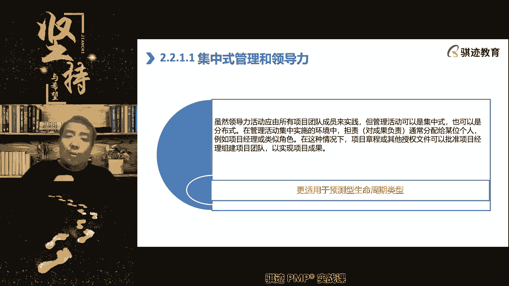

个人的主观能动力很难被激发出来。

所以中国社会有一个特别的现象啊，那我们就谈实践，就说一抓就死，一放就乱啊，这是中国社会特有的现象，一抓就死，一放就乱，所以拿捏这个抓和放的尺度，一直是中国社会管理者。

治理者不断的在调整和考量的一个动词啊，管到什么程度。

放到什么程度，什么时候抓，什么时候放啊，这个不仅仅是对国家层面的。

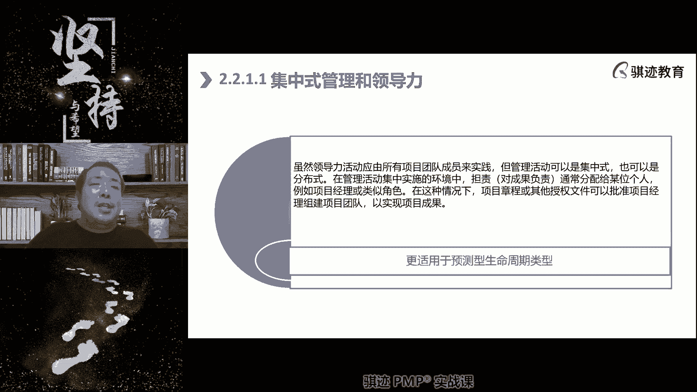

所以我们很多的企业层面啊，管理层面也是会面临这样一个问题啊，这是集中式管理的一个问题的所在，和它的缺点。

那么相对应的我们使用呃分布式管理。

在这种模式下来，我们将全力适度的下放给项目中。

团队中的每一个人，让他们自行来确定自我管理。

你不再是一个啊。

就相当于我们足球比赛当中，你原来在集中式管理。

你又是裁判，又是教练啊，那么在分布式管理当中呢。

你只担任裁判，不担任教练，那么让团队的每个人都是教练。

让他们自己去管好比赛。

你作为裁判只是维持秩序，当有人犯规的时候，你要吹哨暂停，有人犯规到底的时候，你也给他红牌黄牌对吧，这个就是裁判的作用。

那平时的时候呢，只要不予于禁，只要没有发生严重的偏差。

你都是在旁边看着啊，你看但是呢当然了。

这种旁边看着也不是单纯的看着啊，我们也是会有一定方式去侧面促促进激励团队。

这个我们称之为仆人，是管理，也是我们之前讲的那个项目管理原则当中的，什么管家是管理啊。

勤勉的管家的那个角色啊，这是相通的。

但是勤勉管家角色呢，要比普瑞士管理呢还比较深刻一点，类似于这个意思。

在这个体系当中呢，啊这个体系就是我们前面讲的敏捷。

这个体系当中呢，中国人很大程度就不太适应，为什么作为管理者，事实上啊，在敏捷环境当中的管理者仍然是管理者。

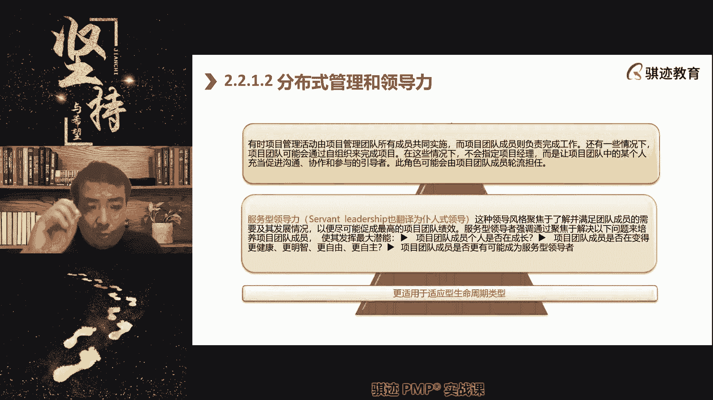

他仍然对最终的项目成败负有责任对吧，我们讲敏捷大师敏捷教练SCHOMASTER。

是不是对最终结果是要负责任的，sh但是你不能直接的去插手干预。

你要去对他进行影响。

去进行诱导，去进行引导啊，但是具体的事物要让团队自行去完成。

来发挥他们的主观能动性，这样一种模式。

中国人是与中国人几千年的集中式的，大一统的这种文化风格呢是比较不相吻合的，所以中国人一开始就很难，比较难接受这个东西啊，但是事实证明，这个模式在很多需要创新和自由度。

以及激发个人能力的那个这些项目环境能，确实是行之有效的，所以敏捷为什么在十多年来啊，越来越在中国的很多的项目管理方面流行起来。

就是这个道理。

好那么所以我们有两种管理模式，团队两种管理模式。

一种是集中式的，你就是个家长，什么都要管，那种是仆人式的。

团队自己做决定，我们提供辅助指导和帮助。

那么在仆人式的分布式的管理当中。

我们更倾向于像敏捷一样的帮助团队消除障碍。

那么这个我们又提到了之前那个词，什么是障碍啊。

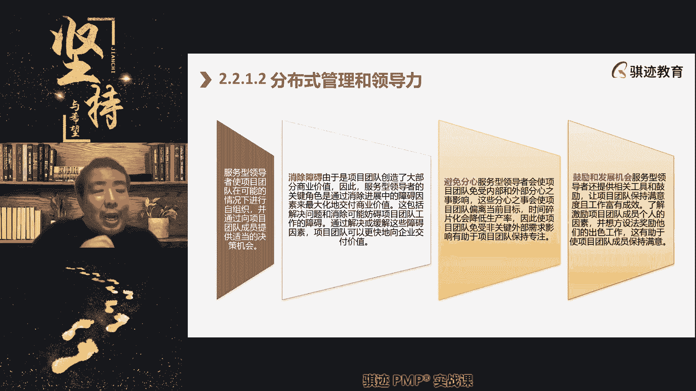

过程出现了问题，我们达成价值实现和交付这个过程出现了问题。

我们没有办法正常顺利的去创造价值的。

这个时候就称之为状态，而障碍对吧。

比如说团队在我们这样的团队阶段，比如说什么团队士气不高。

是不是这种障碍的，团队技术能力不足。

是不是渣渣，是的啊，好团队不被外界理解输出方案是吧啊。

这些都是称之为是障碍啊，那么注意这个是要我们的团队领导者。

在分布式管理当中的团队领导，光master的敏捷项目经理。

敏捷倡导者名声等等，这些人去进行障碍消除。

用的运用的方法就是通过引导，通过啊帮助分析解决根本的根本的原因，然后直呃带领大家去进行。

认识事物的本质等等这些方法来分析商业价值。

寻找可能的解决途径，然后让团队自行去找到最终的解决方案。

这个是最好的。

这叫授人以鱼，三点水的那个鱼啊，授人鱼什么，分布式管理者的第二块东西呢，就是做团队的保护者，我们在敏捷当中也讲过什么。

避免团队分心，我们保护团队，让团队专注于创造价值。

创造价值以外的事情，尽可能少的打扰到团队。

比如什么参加会议对吧。

会不是说不开，而是说是有限度最低限度。

有必要的会才开，没必要，我也不开啊，无意义的沟通啊。

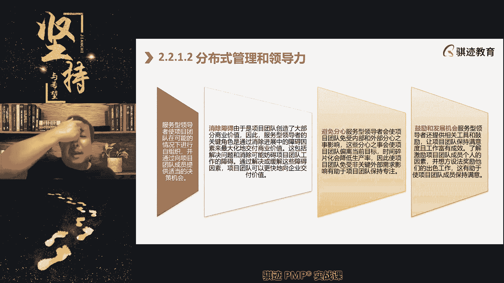

无意义的沟通啊。

啊嗯满足一些什么非必要的需求，这些都是会让团队分心的事情。

要有光master帮团队挡在外面好。

然后呢团分布式管理也注重一个什么池。

不断提高，就是我们敏捷里面讲的，敏捷的优势在于，能够让团队通过自我激发来不断提高。

所以作为管理者，我们应该鼓励团队也不断自我发展提高啊。

所以从这个描述角度。

大家可以看到什么，pm和第七版，它的描述更倾向于鼓励使用仆人。

是领导分布式管理啊。

勤勉的管家这样一系列一套线路设定，当然了，理论懂得一点新东西。

但是不是不等于预测型。

在很多场景当人们是有效的啊，只是说越来越多的环境啊。

适用于分布式管理的这样一套管理模式啊。

OK明白了，好接下来我们来讲一个工具啊。

这个工具是我们考试的，这个工具是我们考试当中啊。

呃考试当中我们经常会考到的一个东西，叫做obvious obs，叫organization breakdown structure啊。

那么tax breakdown structure我们之前学过哪个BS啊，来大家想一想我们之前学过哪个BS啊。

我们之前也学过另外一个BS，什么BS对WBS工作分解结构。

工作分解结构是叫什么，项目范围说明书，分解分解分解分解分解为最底层的工作包。

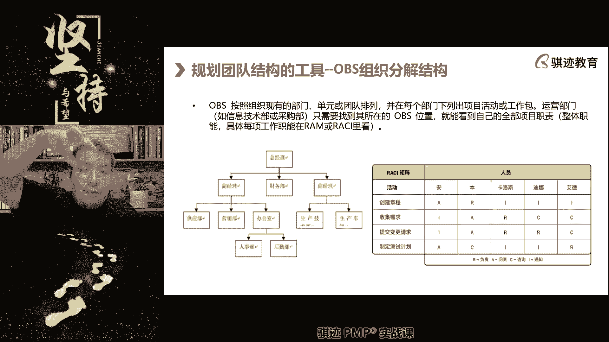

对吧，好非常好啊，学的同学大部分同学学的非常好，那么OBS干什么，将我们的组织。

将我们的组织分解分解分解分解分解，为什么每一个具体的岗位这种叫做OBS，那么在组织当中存在组织的OBS，在项目中也存在项目的OBS，比如说在项目中我们是什么OBS啊，最顶端的人是什么。

项目经理，项目经理下面呢可能有若干个团队主管，若干个团队主管下面什么，由他的团队成员构成一个项目的，什么OBS构成一个项目，而我们这边左边的图大家可以看到啊，等啊等我手动一下啊。

还不是很方便，我们左边这个图你看到了吗，我们从顶端的总经理开始，可以分解，为什么若干个我们的什么组织职能当中的BS，那他有若干个什么副经理啊。

副经理副经理下面可能还有什么主管啊，主管部门，部门里面还有各种各样子部门等等等等啊，这是组织的分解结构啊，那么有了分解结构，我们就可以得到什么汇报关系，向责任关系啊，谁的上级是谁。

向谁负责，谁的上级是谁向上负责，最终一级一级找到最高的最大的那个在项目中。

谁是最大的最高的项目经理啊，理论上是虽然我们讲的是分布式管理，但理论上roll master啊，敏捷项目经理，仍然是敏捷项目中最高的那个负责人，只不过他把权力下放给了团队了。

所以可制定OBS。

我们可以让所有人定位出什么在组织内的定位，或者是在项目中的定位，你是一个工程师，那么你是哪个团队的工程师，你的团队主管是谁。

你的主管是向项目经理汇报还是向谁汇报的，是有这样一个关系，那么制定这个东西有什么用呢，那么这个就讲到了，我们现在是在规划团队结构，所以我们在初次制定OBS的时候，我们有没有团队啊，还没有。

就是我们要先搭建起一个团队。

我们要搭建起一个班子，草台班子也是班子对吧。

首先我们要有一个什么骨架，我们首先要个股价，我们这个根据我们这些工作量工时啊情况，我们需要用什么样的结构，人员结构来啊，人员组成方式来完成这个项目，那么在敏捷当中，我们强调过一个什么东西啊。

关于人员组织结构和人员定位，我们强调过一个什么东西啊，与OBS相关的，想一想有个什么东西是跟这个相关的，这样想正好我们跟敏捷就联系起来啊，呃现在的课程为什么知道。

因为我们的团队交流当中的很多知识点，已经什么和敏捷相关的，就是我们要讲要讲预测性，当到底怎么样，要讲是敏捷性。

当内容会增加，敏捷当中是怎么样的，还记得吧，忘记了忘记了吧，名字当中是不是有团队，有一个敏捷，没有敏捷框架，没有敏捷团队框架，因为敏捷有个设定啊，其实你们知道，其实你也可以认为敏捷其实也是有框架。

但是这个跟没有框架一样啊，敏捷当中有个设定，你们还记得吧，叫忘记抬头接受角色，忘记title接收入，还能够接到我们PPT里面有这一业绩的吧，这个呢没有特别强调什么意思啊。

敏捷的团队为什么叫忘记抬头接受热。

敏捷的团队是扁平化的，他没有分级。

因为一本身团队就小，敏捷最多不超过十个人，本来团队就小，还分什么上级下级啊，什么东西，明显就是一个不效率的一种方式，对不对，我们是扁平化，大家都是平等的啊，所以没有什么上下级。

所以它自然也没有什么很明显的OBS，可能团队只有一个什么共同的啊，主管啊，这个这个项目经理和项目主管就是school master啊，之下所有的人都是众生皆平等，但是每个人所扮演的角色呢是不一样的。

所以如果敏捷有OBS敏捷。

一般我们不画obs，因为大家都是平等，但是如果闽交换OBS，他就是一个项目经理或者一个敏捷项目经理，下面呢就是一排人啊，每个人肯定有自己的定位啊。

工程师啊，技术员，质量员对吧啊，呃叫什么实施的实施工程师啊等等等等，明白了吧，这就是OBS，那么OBS的作用是干什么，就是为接下去搭建团队提供一个股价，所以OBS你可以认为在人力资源管理当中。

就相当于什么先搭骨架对吧，要有骨架，我们才能搭出东西对吧，就像一个恐龙对吧，它有一个骨架，那么恐龙为什么跑得快啊，是因为它的脊椎是平平接近于平行地面。

所以它的重心低对吧，所以不跑得快，人类其实并不擅长跑步，为什么人类的脊椎是垂直于它的骨架，是这么来的，恐龙是这么来的对吧，所以就这个组织结构的不同，骨架的不同就决定了它的动能方式的不同啊。

我们举这样一个例子，明白了吧，所以我们在规划的早期就会去制定OBS，因为接下来我们要依靠这个OBS，接下去进一步规划团队的组成。

然后去组建团队啊，会有这样一个过程啊。

所以明白OBS吧，我特别强调这个考试还是会考的啊，那么在obs当中。

我们每个人在组织当中的定位有了，但是人还没有啊，假设你是张三啊，你要你要参加我们项目团队的，你在我们项目团队当中呢是什么，是开发工程师，那么你的这个整个体系架构中的定位有了，但是你具体开发哪些东西呢。

是没有的，具体开发哪些东西呢，用的是右边这张图叫做IM责任分配矩阵啊，responsibility accountable matrix啊，责任举证，责任分配举证，那么在这个举例当中。

我们会将之前我们进度里面。

我们进度里面讲过什么东西啊，就是进度里面是不是有活动啊。

每年具体的工作是不是都是活动来完成对吧，活动我们会依据每一个活动来安排，这个活动由谁来执行。

谁来负责，谁来辅助谁被通知啊，那么这就是一种啊，注意这就是一种典型的啊，i am的实力我们称之为RACI矩阵，这个关系有点复杂，IMM是描述人在一个组织当中，具体的工作职责的。

那么我们使用谁负责谁执行谁，谁帮助谁通知谁被通知，来表现出人在组织当中的这个责任角色的，这种描述方式，称之为RACI，这个我们非常常用。

但是除了ICI之外，还有其他的表现形式用来表现IM责任，更被举啊，明白了这两者的关系，大家都明白吧，因为历年很多同学都会搞错这个东西。

但是我们在项目的实践当中，RACI用的是最多的。

用的最多的，而且非常实用好用啊，那我们看右边这个例子，大家平常可以看到，我们举个例子，我们现在要比如说要提交变更请求，我们在这个项目有项活动要提交变更请求，那么an是I就代表什么。

an是不需要做任何事情啊，这里你看啊，这是每个人的角色，在这个活动当中安是不要做任何事情，它是I他只是要被通知，当有变更的时候，要告诉一下啊，我们有个变更，那么BEN他的负责的是什么，AA是什么意思啊。

accountable啊，英文叫accountable，指的是这件事情的成败，他负有承担有责任，这件事情的成败，他负担有责任啊，那么卡洛斯是A是什么意思啊，responsible啊。

这个这个这个这个这个这个表达呢。

就是说这个负责的表达其实真实的含义啊，记住这个R的真实含义是什么，他负责具体执行这个变更啊，A是具体去执行，但是执行如果出了岔子要承担责任，由谁来承担，A来承担，让本在这提交变更请求上，如果出了岔子。

本要负责任，但是具体执行呢由卡洛斯来执行，除了卡洛斯之外，还有谁会来聚集执行啊，有抵挡，因为他也是RR也是R，那么最后呢啊埃德是一个什么A的，艾德是一个什么CC是什么呀。

这就是consult提供咨询帮助，就是辅助啊，可以提供参考意见啊，啊有些啊有同学说需求跟踪矩阵是吧，需求跟踪矩阵也可以用对也可以用啊，也可以用啊。

IC矩阵不不仅使用文件啊，这最早就是预测性，我们可以把工作篇列下来的都可以列下来。

但是你可以把活动裂得分的粗一点。

也可以把活动裂的细一点都可以列出来，也可以渐进明细，你先把粗略的活动练出来练sci，然后再把它分到细分活动都是可以的，它可以渐渐明晰的啊，所以RACI特别适合什么，在工作中分配理清责任。

它起到一个什么东西的作用啊，A是被问责啊，对是被问责，就是如果出了岔子，他要承担责任，被问责，明白了吧。

那么ICI是起什么作用呢，我们继续讲啊。

问责是牵头人还是负责，是牵头人，注意啊，活动一般来说不是没有什么牵头人不牵头人，因为这是具体的实现文件，其实并没有什么牵头人不牵头人啊，是什么，A是执行的，就是具体干活的，A是承担后果的。

你只要这么理解就行了啊，A是承担后果的啊，A是具体执行的。

明白了，好我们继续讲啊。

这个这一点呢大家理解清楚比较好，和什么发起项目经理，什么营销关系，那你可以类比一下啊，对如果你类比一下，类比成发起人和项目经理也不是不行，也不是不行啊，好不一定A就是A的领导啊。

注意这是具体工作。

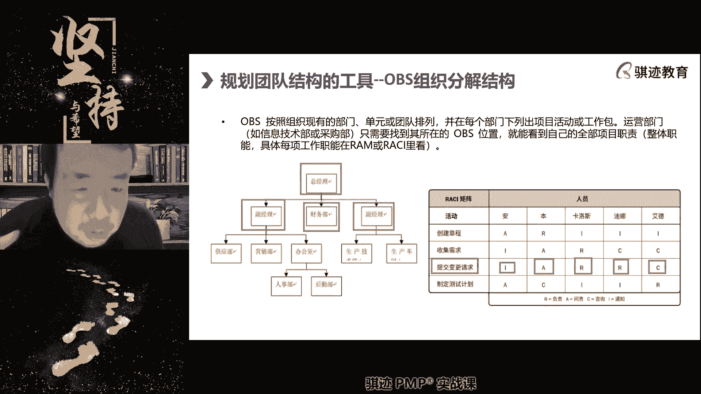

不一定领导不存在领导不领导，只是这件事情我要找谁作为责任人啊，A就是责任人啊，就是干活人啊，你可以这么理解，按照中国人的表达方法，A就是责任人啊，就是干活人，A能不能载I不能问能在A不能问能在I。

咨询也不行，咨询也不行，干活的人不用承担责任。

对这个这个是我接下来要讲的，还没有讲完啊，那么在ICI的矩阵当中，可不可以，一个角色不是既是A也是A是可以的啊。

A和A可以是同一个人。

也可以分开啊，干活都不用背锅。

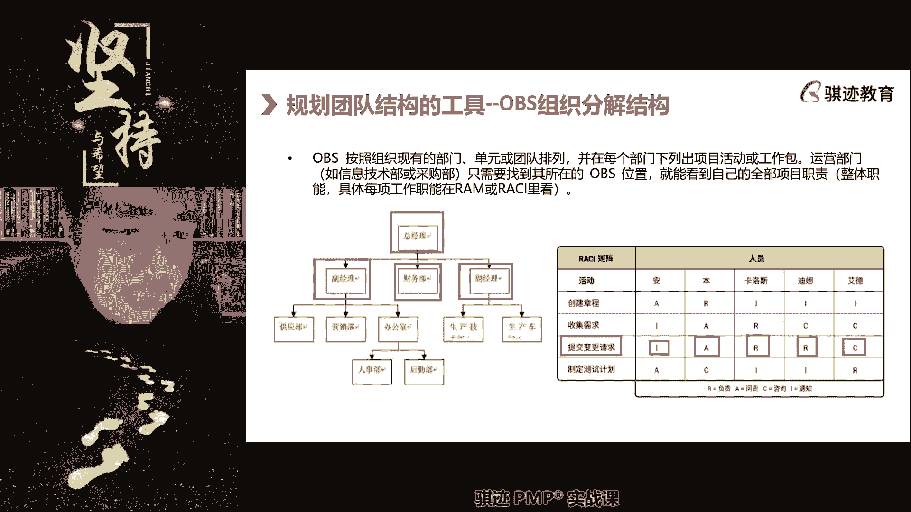

太好了，注意背锅的就是唐僧对吧啊，所以西游记中唐僧屡屡背锅对吧。

但是具体干活的那是孙悟空。

A不是说不能指挥别人，A是可以指挥哎，当然这个东西具体取决于项目啊，没有那么死板，但是普一般而言A是可以指挥R的。

A不能指挥C和A。

C呢，会道义上或者是项目管理上会提供支持和帮助。

I是其实不参与具体过程，但是有任何情况要通知他。

是这样一个意思，为什么没有弹幕了，明白了吧啊。

好A和R可以是同一个人。

但是一件活工作当中，具体的一个活动当中，有没有可能有两个A，答案是不可以，只有唯一的一个A，为什么如果有两个以上A就变成什么啊，我也承担责任，你也承担啊，我也承担问责，你也承担问责，那么到底问责谁对吧。

最后就变成演变成像日本人一样啊，出了事情，我们集体鞠个躬。

道个歉就了事啊，这个不利于工作职责的落实啊。

所以A在一项活动当中只能有一个R，尽量只有一个。

但是有一些工作必须得有两个人以上，配合完成的时候呢，我们也不得补什么啊，啊有两个或者三个以上啊。

不应该切腹自尽吧，你想多了啊，C和I是不限的啊。

数量不限，可以重复，数量不限，那么ICEI最关键的是解决什么问题啊，解决一个两个字的问题，工作中我们最常见，最常遇到的最头痛的事情叫什么，扯皮。

具体工作的职责不清会产生扯皮，扯皮会产生效率下降。

所以在特别是在什么特别是在预测性，乃至在呃情况较为复杂的敏捷性当中，我们都可以使用RACIH阵，这个工具不仅仅限于预测性，敏捷性也可以用啊，我们可以使用ICI矩阵。

来对团队的职责进行具体的定位。

分分工作落实到人，这样就能把事情理清楚。

责任落实好，避免扯皮。

咨询师的团队输出什么，提供意见，提供帮助，提供知识都行啊，这个东西都可以都可以，叫咨询consult啊，就是你能出点意见就出点意见啊，但不参与具体执行，能出点意见，出点意见，就是这个意思。

需求跟踪矩阵的目的也是避免的，注意啊，需求跟踪矩阵啊，有同学说需求跟踪矩阵当中会连接。

也使用类似sci这种方式是可以的。

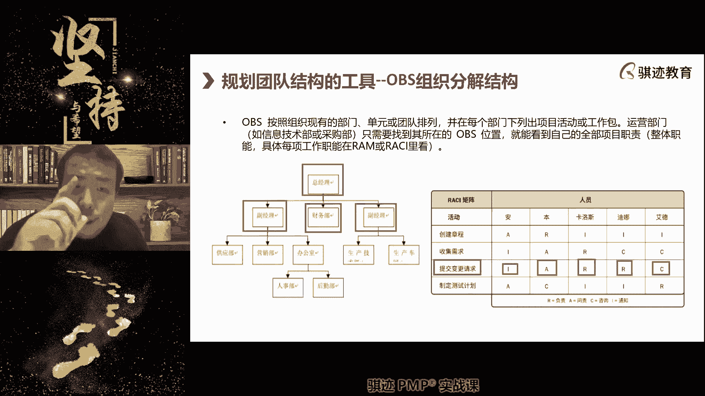

但是需求跟踪矩阵的主要目的，不是为了避免车扯皮，或者不是避免团队内部扯皮，是为了能够需求可被跟踪是最多，你能你应该是这么说比较好，避免我们和客户用户发生扯皮，就是我们理清楚这个需求到底应不应该做。

如果应该做的话，应该做到什么样子，当前是什么程度，用来自证跟踪是它的主要目的，扯皮呢也能解决一些扯皮，但这不是它的主要目的啊，听明白，你在需求跟踪矩阵当中可以连接这样一个需求，你可以说针对这个需求。

谁是A谁是A谁是Z也是可以。

这是可以的，谁能把RC4个英文单词发一下啊。

啊对谁打一下，accountable AC c我来打一下吧。

啊大家要慢一点啊，accountable是A，然后是respond c，responsible是这个是只是我们的缩写，常用的还考英文吗，有中英双语考试是中英双语，不用担心啊，但是英文好的肯定会有优势啊。

这个是肯定的，但是你英文半个字不认识也是可以考的啊，啊，C是consult，等会啊看看。

I是informed。

OK啊这是这个是ISS4个字。

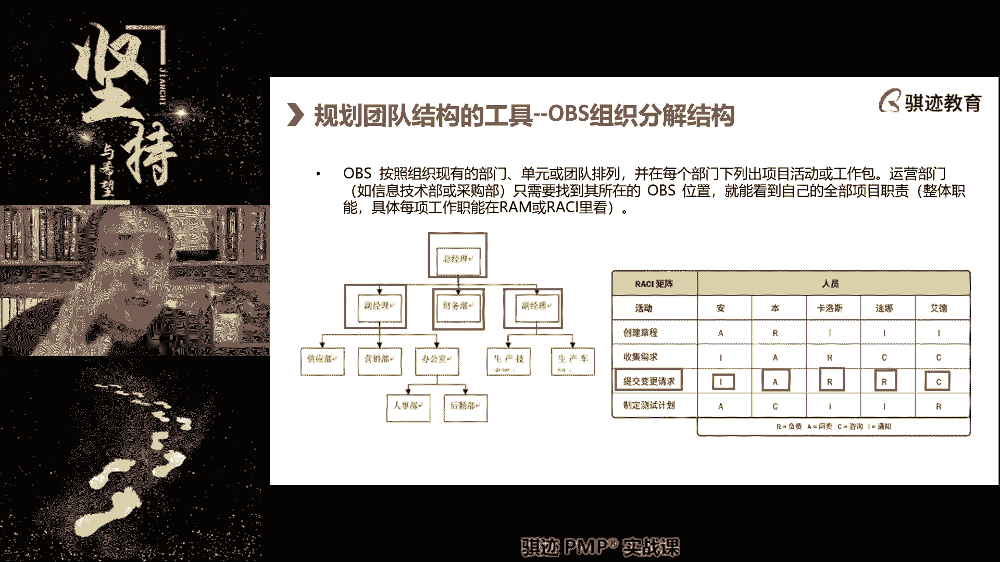

这个功夫，这个工具我们项目经理在日常工作中经常使用，可以防止扯皮，项目中扯皮，会浪费我们大量的人力资源，这甚至造成延误和各种错误，是我们在项目中要极力避免的，所以使用ICI会很好的避免症状。

那么什么是什么时机去宣布ICI了。

当我们的规划做完了。

我们要开一个非常重要的会，我们之前讲过叫什么叫做kick off meeting，还记得吧。

开机会就或者叫开，或者以前叫开工会。

或者以前叫启动会，现在就开工会，我们在开工会上会因为道德人最齐嘛。

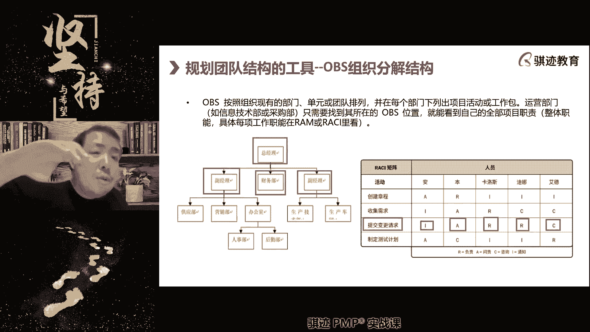

大家要达成一致啊，昨天有弹幕的，今天怎么没了，我看不见弹幕了，不好意思啊，那么这个时候呢我们会什么啊，我们我们会就是说在这个场合。

我们会统一宣布一下项目的整体的RACI。

然后让所有人确认啊，这个工作委派给你有问题吧。

这个工作你来执行有问题吧，啊等等等，这样的场合大家能达成一致。

所以在开工会上去进行宣布，ICI是非常好的一个一个做法啊，这是我们的ICI和IM啊。

当然IM呢可以不仅仅表现在啊，ICI这种形式。

它也可以是文本式啊，但是这个现在不太好啊，好我们继续。

那么创建完了OBS之后。

我们在规划的时候呢，我们这里就会看到什么啊，那么我们以这个结构举例啊，我们前面组织了什么项目经理，比如说我们规划的一个人力结构啊，我们。

规划了一个人体的资源结构，那么再加上我们所需要的材料，物品和设备，那么就构成了资源的四大门类，那么这个呢是更高一层的啊。

这个是我们放在这里统一讲，因为就不单独开始讲，那么在资源管理这个层面。

我们还会做一个BS叫obvious阿，B是从资源的门类和分类角度去做一个细分。

那么这个中间的大头自然是人大头之外呢。

还有材料设备和用品合在起来。

记请记住这一点啊，资源的四大类，这个要记住人才设用。

人力材料，设备用品，人力材料大家都知道材料是生产所需的原材料，设备是生产所需的，这些设备用品是什么，消耗品，易易耗品，比如说我们上班啊，要什么要啊，安全生产要戴头盔对吧，要有手套对吧，要有防毒面具。

这些都是什么使用品，它不是具体生产产品结构的组成部分，但是它生产所必需的用品啊，i am叫做responsible，就是那个啊就是那个A叫matrix，就是刚才那个的A和那个A的matrix。

masks啊，大家知道吧，举证这个责任分配举证嘛对吧好。

那么根据刚才所制定的OBS。

我们接下去就可以分解出什么东西啊，我们人力资源当中。

我们刚才分解的啊，分解说啊，我们需要一个项目经理，三个团队主管。

所以我们的管理者是一类啊，我们分析说我们需要测试工程师是另外一类人，开发工程师是另外一类人，然后呢提供意见的专家是一类人，所以我们的人力资源又会分为什么开发专啊，开发工程师，测试工程师，管理和专家。

当然这是一种分类啊，根据不同的项目分类到不同的，就是可能有不同的人力资源分类分类进行再分，比如开发工程师分为高级工程师，中级工程师和助理工程师，那么这些分类资源的分类有什么用。

我们为什么要制定RBS的资源分类有什么用，因为我们现在是在规划分类完成之后，我们会根据我们之前讲过一个什么东西啊，进度里是我们进度里是不是讲过，资源会决定活动的时间长短，和整个项目的时间长短，对不对。

我们做出了需要资源的类型，然后再结合进度和成本来估算的资源总量，然后根据资源分解结构，再分解到资源不同类型和细分类型的资源数量，那么资源分解结构就被细更加细化了。

我们需要三个管理者，两个测试工程师。

十个开发工程师，其中十个方程师，高级工程师是两个，中级工程师。

有六个助理工程师是两个，还需要三个业务专家来构成项目管理。

项目的整个的团队，这就是团队的人力资源。

那么这种资源是你的需求，对不对，这个需求接下去就会帮助你什么。

我们要去寻找有没有这些资源，同时我们反过来要扔给评估啊。

我们估计高级工程师，开发工程师一个月工资2万。

中级工程师呢一个工资在1万，助理工程师呢一个工资可能7000对吧，我们算一下啊，然后项目经理工资多少呢啊等等等等等，主管多少钱，然后这些人的工资全算进来，你就知道人力资源的开销多少，就会返回给成本对吧。

然后这些就会产生裁剪对吧，又回到前面我们讲的裁剪，我们要进行协调统一裁剪对吧，我们觉得成本太高了，我们可以砍掉一些人头对吧，然后呢最终确定起一个进度，能接受成本，能接受资源这边呢能够获得的一个方案。

然后我们去获得资源，那然后具体按照具体所获得的资源，然后再去进行匹配。

到我们前面讲的啊，我们的OBS里面，就是我们前面这个画的OBS里面。

我们一个萝卜一个坑啊，我们把萝卜填到坑里去，完成团队的组建。

明白了吧，所以一个项目当中的团队组建。

就是按照这样一个先画出OBS啊。

如果他不是敏捷项目，那么先画出OBS，然后呢根据这个OBS呢。

然后呢，我们可以适当的先画一个粗线条的ICI啊，谁最后谁做是最重的吧。

然后根据谁做什么，谁做什么，这些要求呢，我们会再根据我们的设备材料。

这个估算呢我们可以画出一个obvious，然后再根据进度和成本的要求呢。

可以得到这个IBS当中的每一类资源的。

大致是需求量，然后我们去获取资源，获取完整资源之后呢。

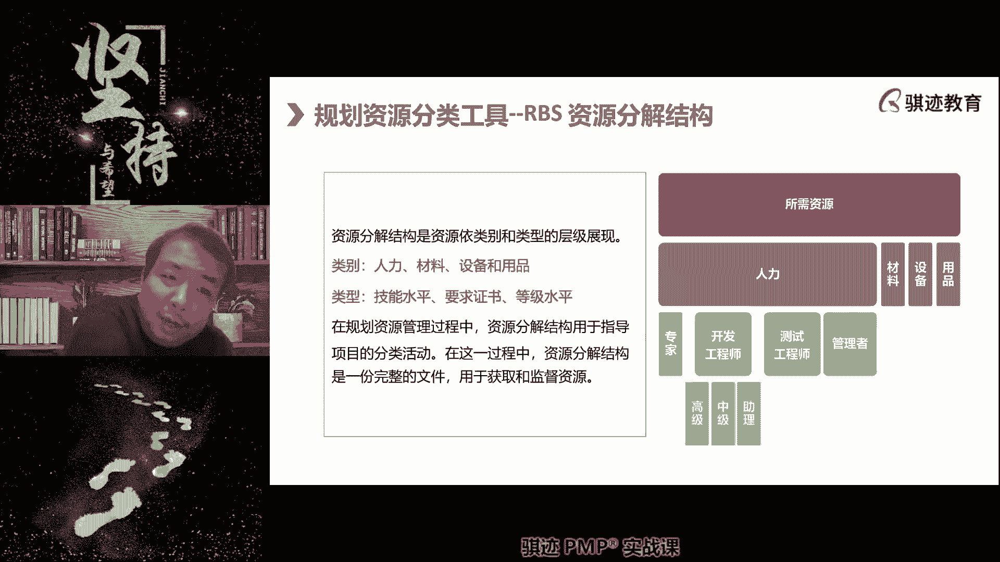

回填到我们的OBS里面，我们就有了什么整个组织架构的人员和体系啊。

然后我们可以把IECE呢继续细化，因为有了人了嘛。

就可以继续工作，细化落实每个人落实若干项工作，然后工作就落实到人。

知道吧，我们经常外面听到一个词叫工作要落实到人。

怎么落实，就是这样一个一个一个的过程。

好那么到了这一步，我们的资源需求就定好了啊。

资源需求挺好，但是资源需求的确定，可能会经历一系列的反复的波折和裁剪。

因为我们总是想项目当中人总是越多越好对吧，我们的资源丰富，干活容易干对吧，但实际上呢可能会面临成本啊，获得资源的困难啊啊等等一系列问题，可能并不尽如我们。

所以啊一定是先有OBS，再有RB3。

一般都是一般都是啊，那么有些时候呢也会有反过来，但反过来就很怪异啊，我先有三个团队主管。

所以我决定建立三个团队啊，然后再建立这个OBS，你是不是觉得这个东西是不是本末倒置，所以一般都是先有OBS。

再有IBS，对不对好。

那么接下去，我们接下去就根据刚才所啊制定的这个呃，obvious以及它的细分的数量。

接下去获取资源了，那么获取资源我们要遵循的思路是什么，考试要遵循的思路是什么，优先考虑内部获取。

内部无法满足的情况下，再考虑外部获取，就是买或者雇佣啊。

买和雇佣啊，那么这个时候呢，我们会用到一个一个很常见的组建团队的工具，叫做谈判negotiation，谈判啊，对内呢我们会去谈判，那么我们会对内会去跟谁谈啊，请注意一点注意啊。

考试的时候经常会问你这个低级的问题，只要你概念正确就能拿分，资源本身具有自己干什么活的决定权吗，一名工程师有权利决定他为谁干活吗，请告诉我，所以如果我们想让这名工程师为我们干活，我们应该找谁去谈。

资源往往不是绝对，往往只能有些同学说大拿可以对吧。

我是很牛叉的人，我愿意怎么干怎么干对吧，你少了不行对吧。

这种是极少数，绝大部分的职场当中的人，都是不能决定自己为谁干活，干什么活的，都是由他的上级职能经理来决定的。

所以资源谈判的首要对象是谁啊。

是职能经理向职能经理去咬人。

除非你的项目，我们前面讲组织类型是什么，是项目型，你项目内自己自己有全套班子。

你可以从市面上或者组织内部自己直接招募，跟职能经理没关系。

也没有职能部门，那是可以的，大部分情况下你得找职能经理去获取啊。

那么有些时候呢，我们需要什么，从其他项目获取，这种人往往是什么稀缺资源或者特殊资源。

因为只有稀缺的人才会被别人争抢啊，普通的人呢啊总是随处可得。

就这个活，张三也能干，李四也能干，我只要找到张三，李四王五，随便哪个人都给我干就行对吧。

但是能力强，能够做独特事情的人。

往往是别人抢着要的，那么他很有可能已经在为别的项目工作了，那么你可能需要找别的项目经理去协商，唉呀张经理呀。

我需要你们团队的小王给我干几天活对吧。

你一天啊，你一个礼拜用他三天给我两天时间，行不行不行啊，哎呀给我个面子嘛，一个礼拜状况，他们给我干一天活，就一天行不行，哎呀呀，卖个面子面子啊，我可是我啊，谢谢谢谢，下次请你喝奶茶啊对吧。

就可以通过协商来获取的，那么来张经理为什么要卖你面子。

嘿嘿嘿，这是个问题啊。

很少有人可能问这个问题，张经理为什么认错，因为大家都是在职场里混的，这一次是我求你，说不定下次就是你求我。

你能保证下次你不求我吗，对不对啊，与人方便就是与己方便懂吗啊。

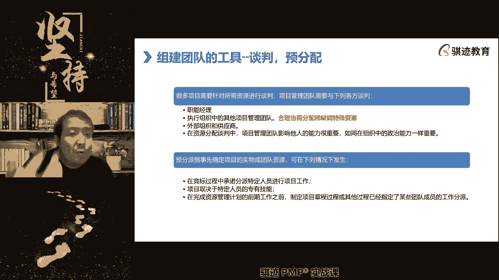

所以职场当中有时候呢不要碍于面子，什么东西哎，对下次可能要相互帮助，相互扶持对吧，大家搞好关系，所以呢跟别的项目经理搞好关系。

可以获取稀缺的正在为其他项目占用的资源，当内部没有办。

资源被用完了，实在是挤不出来了啊，也没办法获取了，那么我们才会转为考虑从外部获取，那么外部获取的时候，我们先要有个什么东西啊，如果我们想要从外部获取，首先要做一个什么东西。

那之前采购讲过的一个什么东西。

采购的两个需要什么东西，不是预算在预算之前要有个什么东西。

招标要求也不是还要早来，忘记了吧，采购收购的就忘记吧。

自制外购分析，为什么我们不能从外部内部获取，要对外采购，需要做这个分析，这是我们采购的依据，你为什么外面买自制外购分析，请记住啊，外面买之前是要自购，因为我们自己内部没有资源，用尽了，项目又急缺。

所以要花钱，我买买买，或者说我们自己内部内部的资源太贵了，外面买反而更便宜，所以不买没买，明白了，自制外做分析好嗯，拿过来好，那么在资源的分配当中呢。

项目团队影响他人啊，就说面子影响力。

人际关系，对于你项目经理能不能获得足够的资源。

有效的资源很重要，还有什么政治能力。

就是啊啊办公室政治，你也懂得这种能力啊，所以这条告诉我们是吧，我们这条讲完啊休息，所以这条告诉我们什么。

项目经理要想在项目帮助项目获取成功。

很重要的一条什么，你要在组织内吃得开，能够获取最佳资源。

这里我举个例子，我以前举过，以前上课举过这个例子啊，就是说为什么啊，就是我们讲中国的啊，中中国的那个叫什么啊，为什么能取得如此多的成功，除了先烈们的能力出众和时代潮流推进之外。

个人的能力影响力也很重要对吧。

大家知道吧。

走到哪个地方，有哥老会的一一声嗓子，一声吼就能带起一支队伍，所以才能让红军迅速壮大。

然后还是啊武术，然后人脉极广，这些都是人格魅力能，而是人格魅力和什么我们的影响能力，这些东西都能帮助革命团队迅速壮大，所以如果你在组织内部具有很好的人脉影响力，那么你那也能够什么迅速的啊。

有效的去组建你的团队，所以项目经理平时做人要不要紧要紧。

人的影响力要紧要紧，口碑要不要紧要紧啊，所以很多的时候，项目的成败往往是在你项目之外会受到影响，你平时如果做人人缘不好啊，做事那不受人待见，那么对不起，你在获取资源这方面就会吃大亏，明白了吗。

影响力很重要啊，然后在特定的场景下，我们会使用另外一种获取资源形式。

叫做预分配，预分配。

什么叫预分配，在项目，如果我们是个乙方参与甲方的招投标。

那么我经常啊这是我实践工作，实践当中就经常会有的啊。

我们在项目的过呃过程当中啊，啊比如说我作为甲方一个乙方过来投标啊，大家可能知道很多的招投标当中。

都会有什么路演，就是我们派出收钱工程师专家给，那么就是给甲方去啊。

说我们的产品多好多好，你们买我们的产品对吧，做演示，在招投标之前去做演示。

这个叫路演对吧，那么这个时候呢可能我作为甲方就会说诶，给我做路演的那位水平很不错，一看就是有干货的对吧，作为内行人的吧，一听看门道，看这个人是懂了诶。

我说可以，这个项目我支持你们来招投标，但是如果你们要是中了我们这个标。

对不起，刚才做路演，那位那位那位那位人士要给我们项目要干活。

然后呢，你作为乙方，是不是你想拿到这个单子啊，你好，只要我们项目最后能我们能中到标，我们答应给你做路演的那位售前工程师啊，我们资深的小张啊，我们就让他拍到项目上来给你们干活，这种就是什么预分配承诺啊。

乙方为了拿到这个标承诺给甲方啊，这些人这些人这些人，这我给大家举个场景例子啊。

比如比方说我们承诺，他安排经验最丰富的谁谁谁。

那么实践当中呢往往是怎么样操作呢，我跟你说，乙方经常就是这么骚操作。

一开始他确实会把小张派过来，一个礼拜，派过来五天给我们干，然后渐渐的一个礼拜只来四天，三天两天一天，到最后到中后期呢一天都不出现。

但是往往有时候甲方也能接受，为什么，因为项目一开始的时候不确定性比较高。

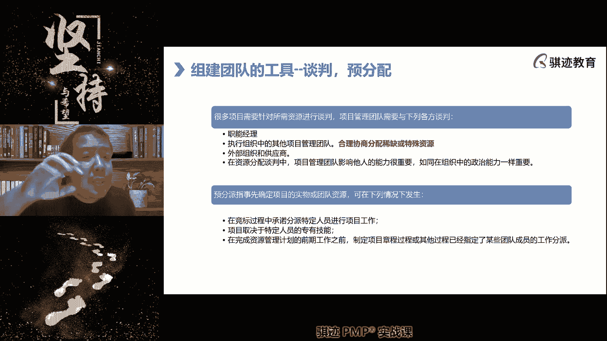

风险比较大，小张这边作证呢确实把很多的问题解决了。

帮助甲方顺利的实施这个乙方的项目，到了中后期，一切都落定之后呢。

小张把东西都安排好了，就可以交给经验，不如他的丰富的一些啊。

乙方的其他的工程师去干活，他可以跑到其他项目上啊。

为什么对于乙方来说，小张这种能够到甲方面前去讲标。

能够去路演的人，绝对是乙方当中最优秀的人之一。

这个人如果只用在一个项目上，不符合乙方的利益最大化啊，所以你们记住乙方来给你们吹牛的人，往往是乙方当中最牛叉的人，如果你不让他，你干活，如果乙方中了，不要太实际，但是如果乙方连吹牛的人连牛都吹不好。

那么这个乙方的人可能更堪忧啊，就是如果你们从甲方角度，你就明白这个道理的。

明白吗，所以我做甲方，我有时候很喜欢这什么啊，谁到我这来吹牛。

可以，我接受你这个牛，但是如果你中了标，吹牛的人先给我过来干一段时间。

把事情搞定了啊，这个就叫做预分配啊。

你们以后记住，如果一个以防过来吹牛的，连牛都吹不下，它是不可信。

好第二种情况呢是什么，项目取决于特定人群的专有技能，比如说我们公司就那么一个人会讲p mp，他叫查老师，所以这个项目呢是什么，给我们的甲方去讲偏僻课，那么没办法。

只有查老师出马，其他人吹牛啊，讲故事不如查老师啊，或者根本讲不了PP的故事。

那么只能查老师说这也是一种预分配，他因为是专有技能。

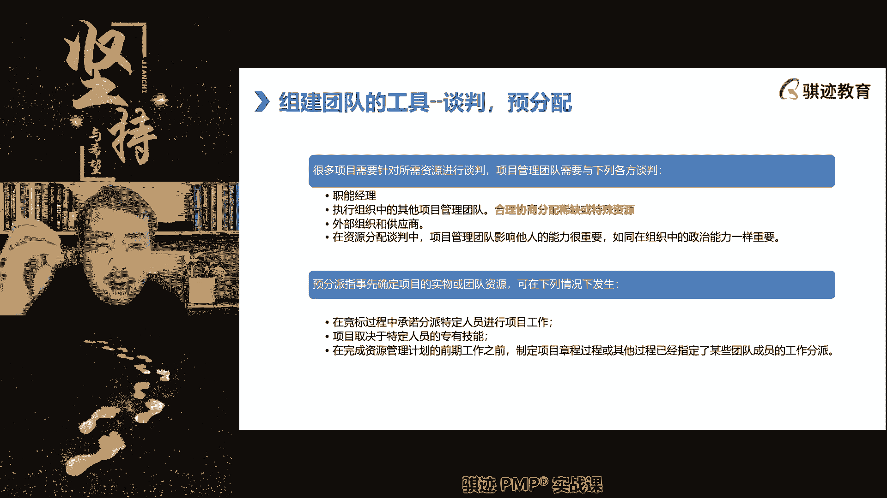

然后还有一些是什么。

项目经理在制定章程的时候，他认识到这个项目只有特定人员参与，才能保证成功率，让发起人保证能够让他获取到的。

我们可以将这些人写在项目章程当中，因为项目章程是不是发起人要签字的，发起人签字，他承诺了，他一定会用应用发起人的权利，保证这个人能够被派到项目上来。

最大程度地保证项目的成功啊，这种也是个预分配，但是它是乙方内部预分配。

明白了吧，好这就是我们组建团队当中常用的两个工具。

我们后面还会讲到一个组建团队常用的工具，叫做虚拟团队，那么我们在讲虚拟当中间先休息一下啊，先休息一下，我们现在是21。03分。

我们休息到21。18分，继续。

敏捷的话可以自己决定做什么，敏捷啊，我们休息啊，开始休息，我们回答一下这个尾号317的敏捷。

是可以自己决定做什么。

但是一般来说我们在敏捷团队组成的前期。

我们项目经理还是会指定你的角色。

你的主要角色比如说是开发工程师，但是你你可以什么在做的时候。

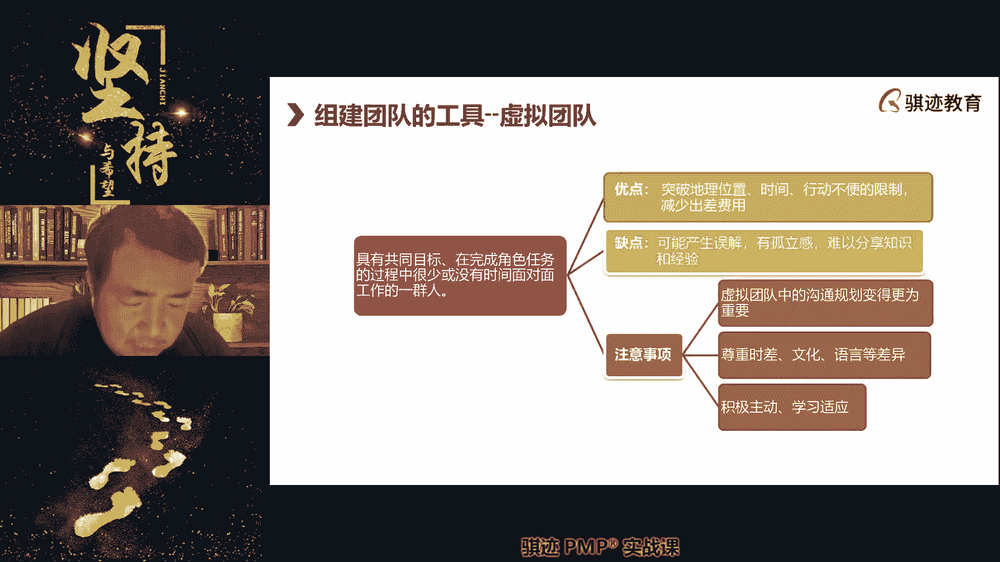

你可以自己觉得我测试能力不错，你可以做一部分测试工程师也是可以的啊。

但是他会主要还是会设定你的角色。

虽然不会设定你的抬头是什么，但是设定你的主要责任，决策还是由项目经理来设定，所以这个还是这个不用和职能经理沟通。

但是要和项目经理沟通，明白了，休息，等会我说可以打，可以慢慢的打字啊啊11：18分继续好。

