# PMP认证考试课程最新完整免费课程零基础一次通过项目管理PMP考试 - P7：PMBOK第六版 第四章项目整合管理-8 - 骐迹PMP - BV1Sb4y1f7Yt

好，那么然后呢，我们会就输出一个我们重要的项目当中，第一个最重要的文件叫做项目章程，项目章程，项目章程里面有什么东西啊，下面这些东西都把不拉不拉不拉不拉不拉，将我们的目标成功标准，不拉不拉。

那么这些东西记得现在是不是挺烦的，记住不用背出来，只要记住一点啊，就可以，他有所有我们项目所需要的信息，注意啊，考试的时候你只要记住这一点，他有我们项目里面所有需要的信息，但是都是高层次的粗略的信息。

high level的，那么not detail的啊，信息明白了啊，啊这是这是我们的项目章程特点，所以在考试当中，如果你在选项当中确实需需要某一方面的啊，内容信息，但是呢其他的选项确实没有。

那么你退而求机子就可以就可以选项目章程，因为它里面所有的信息都有，但是都是高层次，有人问老师，项目战这里有没有资源，有真的有，它叫预分配对吧，然后项目经理项目这个项目上设定有没有风险。

有它是高层次风险对吧，项目章程里面有没有我们的供应商，有它叫合格供应商啊，就是我们今天群里面讨论的叫合格供应商，那么我们这里正好就聊一下，什么叫合格供应商啊，预先批准的财务资源。

或者预先批准了我们的采购资源，什么叫合格供应商，就是这个供应商，经过已经经过公司的合规部门的审核，有资格和你们做生意，这是第一点，第二他和你合作过，信誉良好，能力符合我们的用工资要求，那么在这种情况下。

大部分的企业会要求，首先在没有特殊要求的情况，首先从合格供应商当中选取我们的供应商啊，优先选取者或者优先合作者，只有当你的诉求不能在合格供应商当中，选择到的时候，我们才会去在其他的供应商名录当中取得。

这就是我们预批准的供应商的名单，叫合格供应商名单和批准的供应商名单的区别，所谓的批准供应商，就是针仅仅针对本次采购批准的供应商，比如说你会为了本次采购，我们找了几家供应商，然后呢那交给合规部门先去审。

我们找了三家啊，35000家供应商审，然后合规部门呢，最后省下来三家是符合我们的要求的，那么这三家去竞标啊，我们一般竞标都要要求什么三方比价对吧，大家都听说过啊，三方比价这个呢叫做经过批准啊。

供应商名单，但是这三家当中呢，可能有两家是我们预先批准的供应商，在在此之列，他们两家呢不需要审核资质，自然就入围了，只要达到一定的，我们的项目自身特定的一些要求就入围了，还有一家呢是我们实在找不到。

因为要三家去比对嘛，我们还是找不到，所以从外面带路找，这一家呢是经过我们部门审核的，是公司的啊，合规部门啊，什么部门审核过去之后可以的，那么这家是可以入围呀，就构成了总共三家的比价的。

被批准的我们的供应商名单，ok，所以这之间批准的供应商名单，和预批准的供应商名单，他们关系明白了吧，好不明白，没有关系，课程讲完回看啊，多听几遍就行好，那么我们回来讲项目章程。

项目章程里面含有所有高层次的信息，并且当一让他被批准了之后，我们经常会看到有个词叫拟任啊，我们叫啊，大家不知道买基金没有啊，很多基金公司会有一个什么，你认某某基金拟任项目经理，那么为什么叫你认啊。

是因为他这个基金正在发行，那么也就是说这个基金呢，可能并不一定发行成功，那么他可能他的项目章程里规定啊，我的项目，这个基金呢一定要募集到1亿以上的资金，什么基金才能正常运作，所以这个时候呢。

项目经理叫拟任的基金经理对吧，然后他的基金如果发了五个亿，那么他的达到了最低限度了，那么这个基金成立了，资助我们干活了，那么签字是有代价的，签字是签字的人要为项目获取资金和提供资源。

所以这个人呢往往是发起人啊，但是我们讲在实践工作当中，如果你这个项目章程，能够找到更高层次的人去签字是有好处的，因为只要在这项目账身上签过字的，那么他就承诺为你项目的提供支持。

所以比如说你的发展是一个比如说公司总监，那么说如果你能把公司的什么c什么oc，什么也拉过来一起签个字，那么是不是你的项目的层次就高了对吧，获取资源就好了，出了什么问题，你可以拿这东西来向上汇报啊。

总结你会商量像什么o什么o啊，汇报一下，你看你当初支持我们的，多给我们点资源，都给我们点钱对吧，那就好说话啊，这是一个实践技巧啊，项目章程当中签字的人级别越高，意味着组织对他越重视，一般是这样。

啊你们说什么啊，签字的人是啊，那个门卫张大啊，忙门卫张大爷啊，啊ok啊ok好吧，你们赢了好，大家看这是项目章程一样张啊，大家可以看一下，它有不同的形式啊，这个呢我就不准备多讲，因为偏僻不会考形式对吧。

p p里面会考我们的项目章程的定义，咱们不用考形式，大家出去看看，如果大家以后呢要自己签订项目章程呢，可以用注意项目章程里面的东西不用面面俱到，不用面面俱到，所以项目章程一般是比较啊。

粗略了一些一些一些描述啊，粗略了一些描述，不用很详细，那么随着项目章程一起输出的东西，有一个东西呢叫做假设日志，假设日志是项目启动之前的编程完成的，战略和运营假设，一些高层次的假设条件和职业因素。

假设条件资源，它最终会被归入到项目文档当中去，低层次的一些假设条件呢，会随着我们的活动展开而产生啊，或者产生这个东西呢，是在以后，我们在低层次的活动当中产生了之后呢，纳入到假设日志啊。

也要记录到假设日志啊，假高无论是高层次和低层次呢都是做假设，是指但是在初始状态下，假设置里边只有来自于商业论证的高层次的，一些假设条件啊，这要注意，只要知道这个就行了。

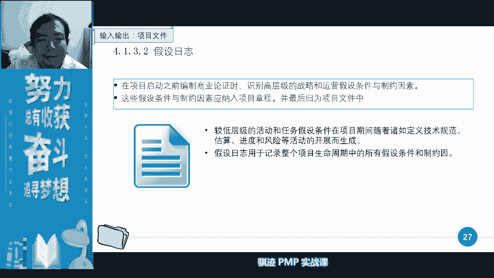

嗯那么制定完了项目章程，我们接下来就开始干什么了，制定项目管理计划了，项目管理计划是一个什么东西啊，将项目的工作规矩化，规则化这个东西，所以他定的最主要这个东西是什么东西啊，是规矩啊，注意。

所以很长很很经常我们见到一个时间啊，你要找具体的数据，项目计划管理计划里并不定有，但是你要找做事情的方法，项目管理教育必然会有，所以项目管理计划是一个项目的规矩，人无规矩则不能什么成大器对吧。

要有规矩啊，那么干项目一定要有以规矩为基础，那么它会有很多方方面面的规矩，所以就来自于十大知识领域的各个方面的规矩，汇集起来，变成项目管理计划，这个总规矩对吧，规矩总体他确定了。

所以这里写确定了项目的方法论，用于考核项目基准，用于考核项目基准，所以然后呢，但是会有一个经常会有一个一个东西是什么，就是在我们讲问项目管理计划当中，比如说我们的资源管理教当中，有没有描写资源啊。

啊没有描写，他只是描写我们就怎么去获取资源，我们需要哪一类资源，哪哪一类资源的大致的获取量大致是多少，会有这样的信息啊，这个要注意，那么项目管理计划呢会生成一些综合文件。

用于确定所有工作的依据和执行方法，它还会制定一些什么东西啊，大家记得吧，我们之前学过的内容里面，还有哪些东西就会确定的，我们的生命项目周期，其呃生命周期的方式对吧，我们项目用几个阶段做完对吧。

每个阶段生命周期怎么样的，我们的项目是怎么样的举证架构，对吧啊这些东西呢也会在项目管理，项目管理计划当中呢啊去定义，但是他肯定不会在项目章程，项目章程只是一个授权的东西，问题对吧，他不会去框死你。

项目经理该怎么做，一般不会，一般不会好，但是项目管理计划就必须明确了啊，我们用敏捷的方式分五个阶段做对吧，然后每个阶段应该怎么做，每个阶段和每个阶段之间，应该用什么方进行交接是吧，这都会定义。

然后呢要形成一个基准，那么什么叫做基准，基准的英文叫贝斯，就是一条基线，那么我们讲如果你脑袋当中想象一下啊，这个我就没有画图，如果你脑袋中想象一下，我们如果仅仅有一个数字的目标，它是不是个点啊。

假设如果我们每一天都有一个目标，把这些点连起来，它是不是就是一根线，那么这根线就叫做基线，当我们每天都达到每一天的小目标的时候，是不是我们每一天都是能够达到目标的，最后我们肯定能实现最终的总目标对吧。

所以基线就是一个随时随地衡量，我们项目是不是处于啊正常，或者我们目想要达到那个状态的水平，的一个衡量尺杆标杆，所以你们可以去想象，我们把每一天或者每一分每一秒的项目的目标，用一个一个一个点把它连起来。

连成一个线，这条线就叫做基线，只要比机械做得好的，那么我们项目呢就处于ok的状态，如果项目呢比极限低的呢，并不一定项目就不ok，而是说可能会存在各种因素对吧，就比如说我们现在项目进度落后，落后于机械。

落后于项目进度基准，那是为什么，今天最近天气寒冷，不适合开工，那它是肾化原因素导致，不是我管理不善对吧，所以这个东西一样，但是我们比机械好肯定是什么好的对吧，这要注意，所以我们在制定项目管理计划的时候。

也是随着项目章程制定而制定出来了啊，先制定项目章程，它项目章程是项目管理计划最主要的输入，然后制定出各个管理计划，但是注意，项目章程一般在一个项目当中只做一次啊。

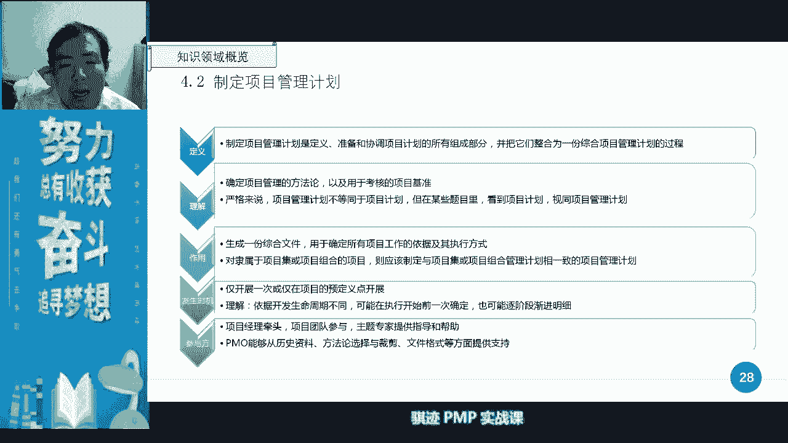

项目当成只有一次，那么我如果没有强调，我们大家都强调一下啊，一个项目章程一般只在项目开展中只做一次，很只有在很特殊的情况下，比如我们项目的大目标改了项目的效益，目标就巨大，修改了我们才会改章程。

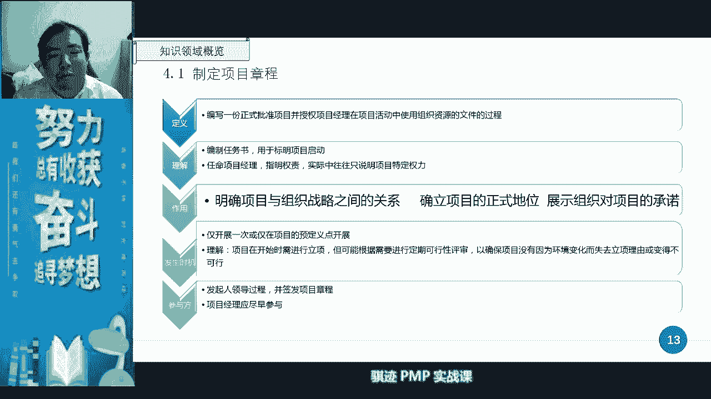

否则它一般是不会变的啊，那么项目管理计划呢就不一定了啊。

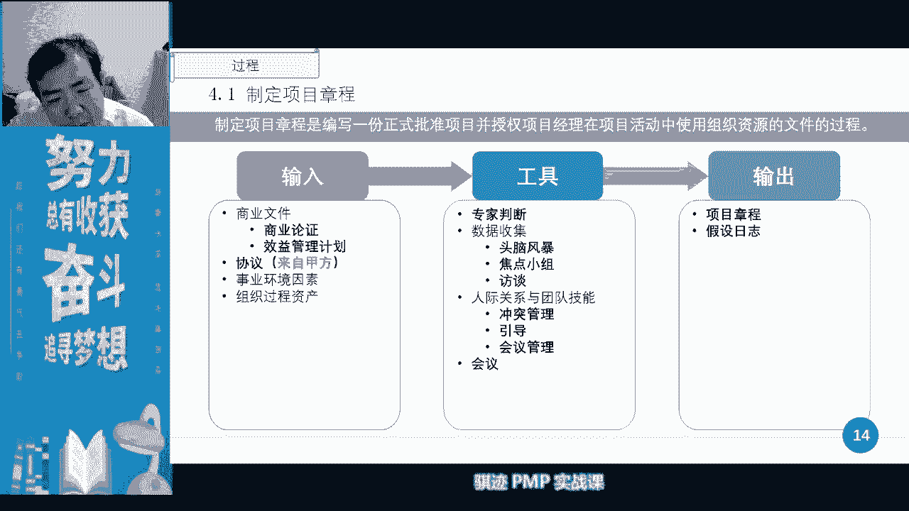

项目管理计划呢在项目一开始呢就会做，一开始就会做，但是呢他在做的过程当中，并不是一次把所有的东西都定义好了，所以它会用到这个原则，叫做渐逐阶段的渐进明细，大家可以看到啊，这下面有个词叫逐阶段的渐进明细。

当我们使用渐进运营方式就意味着什么呢，我们的项目管理计划也是逐步逐步的完善，可能他的方法论是一次形成了，但它中间定义的东西呢是逐步逐步定义的，越来越清晰的啊，要有这样的概念好ok啊。

那么这是项目管理计划的一个特性特点啊。

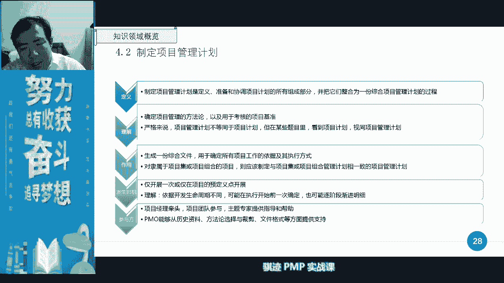

以及它的定义，那么我们看一下，那么我们接下来看一下，项目管理计划里边的一些啊输入输出啊，输入输出输入当中当然很很正常，最主要的是什么，是项目章程，以其他过程的输出啊，是事业环境因素和组织过程中。

大家看到在绝大部分的输出这边都存在啊，这是个万万金油式的存在啊，万金油式的存在，所以这个东西呢有人说老师是i t t，要不要记输入输出工具技术要不要记，可以记，但是你不用全记，你只要记住关键点。

那么关键点在哪里啊，k老师会帮你圈出来，或者上课会重点讲，我给你上课重点讲的那些输入输出和工具记录，就是关键点，明白了吧啊当然你能全背下来最好自然是最好，为什么不呢，啊ok好。

那么我们在制定项目管理计划当中呢。

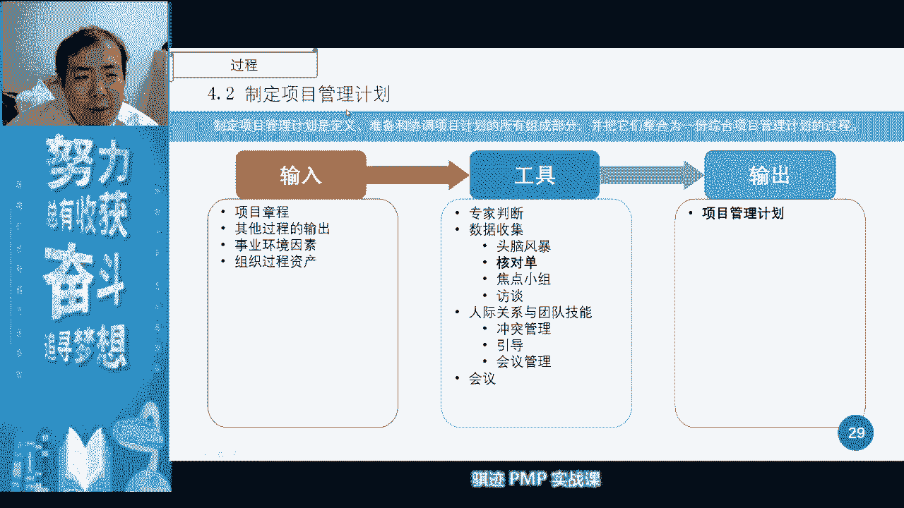

我们会使用到一个工具啊，这个工具叫做会议，我们前面在制定项目章程里用，但是在制定项目管理计划当中，会有一个很重要很特别的这个会议，这个会议呢每个项目都应该开，都也都会开。

叫做kick off meeting，叫开工会，也叫做开题会，因为叫开机会，他注意啊，这个考试定义是经常会考定义啊，它意味着什么东西看啊，规划结束执行开始，规划结束执行开始啊，注意啊。

这个我就不再重复了啊，那就意味着我们规划阶段结束，后面开始具体干活了，所以它不是一个什么会啊，规划会注意，也不是一个启动会，但是在pp的早期的版本和早期的项目管理，的翻译当中，因为英文中文的差异。

kick off meeting曾经被翻译成为启动会啊，启动会要注意辨析，现在你就看pmbok第六版，已经没有启动会这个词了，只有一个叫做开工会，叫kick off meeting，要开工会注意啊。

概念一点清晰，它是我们启动早就过了，规划呢结束执行的开始用于传达项目目标，获得承诺，所以在开启动会之前，我们肯定已经干什么，有件事情怎么了，大家已经对这个项目有所了解，有所认知，并且已经消除矛盾。

所以注意实际操作中，启动会不是用来跟你吵架了，和相互之间解决矛盾的，不是这样的啊，启动会之前，你项目经理作为一个管理人员，项目管理人员已经把这些东西解决掉了，启动要干什么事情。

在这个会上最后一次明确大家的职责啊，明确各自的工作职责，明确一下大家的分工，明确一下工作的项目的日程安排，明确一些东西，让大家再一次明确无意义，然后开始这是启动会的工作啊，所以启动会很重要。

让大家告诉大家，我们正式开始干了，所以启动会应该由谁来参加顾客啊，顾客甲方爸爸啊，我们乙方的代表项目团队人员对吧，然后职能部门发现等等等等，相关方的召集在开会啊。

所以这是kick off meeting啊，有没，所以这个会一定要明白它的意义啊，规划结束执行开始规划质，那么这里就要辨析了我所以我就写了，有真的有的会叫启动会，叫initial meeting。

这个会是什么，我们要启动一个项目，真正的是在启动阶段，启动项目会开一个叫启动会，叫initial meeting，这个货是用来告诉大家我们准备干这件事情了，但是大家对这个事情理解可能根本一无所知。

可能根本理解不深，没关系，但是先告诉大家通知一下大家的啊，这叫启动位啊，那么这个时候呢这个启动非常一般，会请啊越大的boss越好来做启动的动员啊，我们一定要做到什么。

什么东西一定要怎么样怎么样怎么怎么样啊，但是这个时候我们有没有项目的，项目的项目管理计划，没有，可能会有项目章程或者项目章程都没有，但是我们已经准备做，肯定要做这个事情，然后会随机开会啊。

一般是没有项目管理计划的，那么还有一个会叫icebreak meeting，叫破冰会，这个会是什么东西呢，这两个会当然p m p的，我们的书上是没有，但是考试万一考到的解决认识啊，叫破冰会。

后面会大家可能啊没有那么水，但是大家肯定知道有个东西叫破冰活动，破冰训练对吧，这实际上这是一个团队内部的，一个会用来干什么，相互之间打破隔阂啊，增进互动，增进协作的这样一个会啊，会有这样一个会。

有些公司会就开叫icebreak meeting，叫破冰会啊，你们在管理项目当中也可以在团队内部开，然后适当邀请发起人啊来参加，所以这是会议当中，在之后的各个知识领域当中，特别强调。

因为考试很喜欢考好几个朋友好，ok都明白了吧，没有明白的可以在课后问我，然后或者是在有空的时候，继续回看我们的视频啊，我们就不继续多讲了啊。

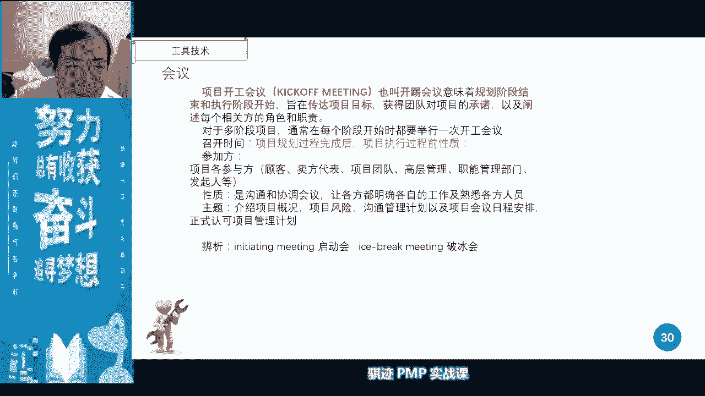

不浪费时间好，那么我们讲在制定项目管理计划当中，我们是不是有零零这种大量的计划，所以为了把这些计划呢全都整理好，并且不遗漏，所以我们会用用一个工具叫做checklist核对单。

那么check list有时候啊check list什么东西啊，就有这个有有没有，所以当check list就可以看到什么，比如大家有没有找到饭店去吃过饭，那肯定有的对吧对吧，揭不开锅对吧。

连饭店吃饭的时候，小饭店也是饭店对吧，路路边苍蝇馆子铺子也是饭店对吧，那我饭店吃饭是不是有个菜单啊，当你打开菜单勾啊，这个菜要吃的这个菜要吃的啊，来啊来两份什么牛百叶，来两份什么黄喉对吧。

来来一斤什么啊，再来个半斤啊，先切牛肉对吧，我们吃火锅对吧，你在这里一个一个打勾的时候，它就是一个checklist，只不过不同的是，饭店里的checklist呢是选选购的。

而我们项目管理计划当中管理各个项目管理，子计划管理和项目文件，它是必购的，我们要一个一个把它收集起，直到所有的勾都打上了，说明所有的文件都有了，这就叫我们项目管理计划当中来核对单，核对起到提醒作用。

不要漏掉东西，在后面很多的很多的一些的子工程子过程当中，或者是知识点要当中，我们也会用到核对单或者核查表之类的东西啊，都是用来防止漏啊，然后看看有没有做过的起提醒作用，ok这很容易理解啊。

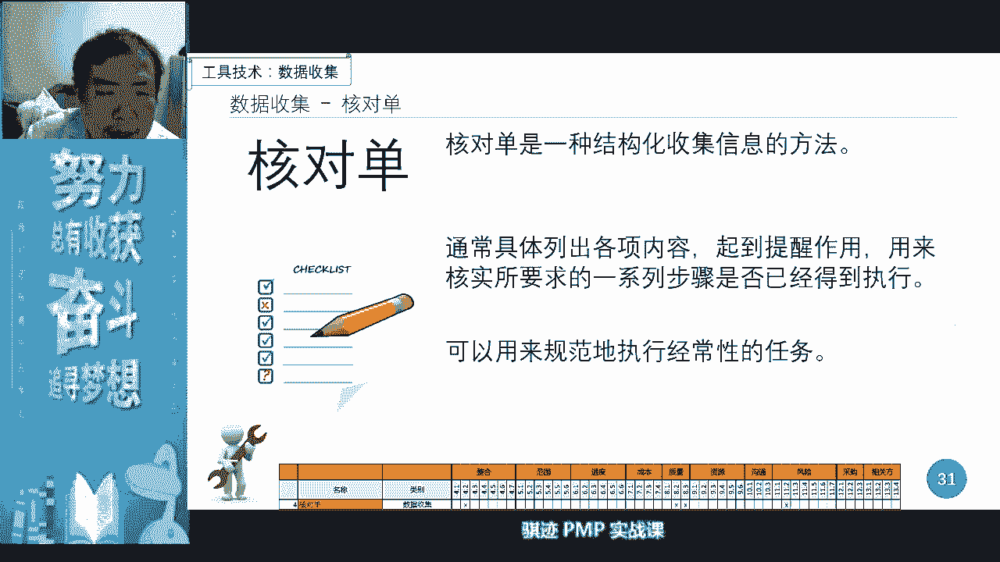

很容易理解好，这是一张从pm博客当中剪下来的，我们的项目管理计划和项目文件，ok我希望大家今天啊啊上完课，然后下周二上完课，下周二上完课之后呢，把这些东西呢都一个手指对应一个手指，在第五也一样。

在第13章上完之后，第13章上完之后，就最后一段车上完之后，这里面的所有文件和计划你不一定要背出来，但是你看到任何一个文件和计划，都应该知道它的定义和其他的区别啊，这个是我们要做到的，注意啊。

这样做到了，比如说我举个例子，什么是风险登记册啊，举个例子啊，在风险领域，风险登记册是用登记风险，风险应对措施，风险责任人的，他会被更新三次，每次更新更新都会从潜在风险责任，潜在风险的措施到风险。

正视责任人，正是措施和风险优先级对吧，风险的量化评估，定性评估这些东西啊，巴拉巴拉巴，像我要要像我一样，把这个里面的性质定义全都说出来，ok那你的考试就有保证了，要像我这样啊，举个例子，刚才加风险。

这样你要把这个东西全说出来，ok你的考试就保证明白了吗，明白了啊，好那么在上完我们所有的课程，所有的课程之后，这里边所有这任意一项计划或者任意一个文件，你要说出它的作用，它的定义，它的区别啊。

甚至会有太阳能，有几个阶段的特定，当然不用担心这些东西，我在上课当中会逐一和大家进行分解啊。

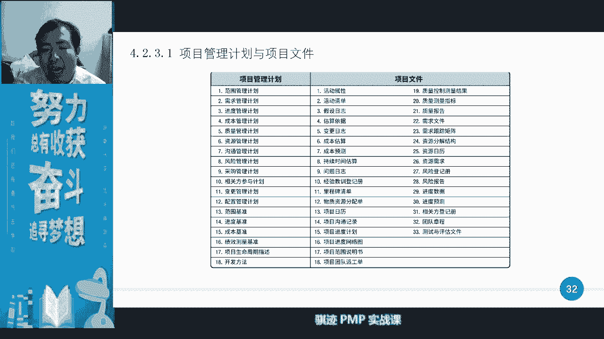

不要急啊，不要担心好。

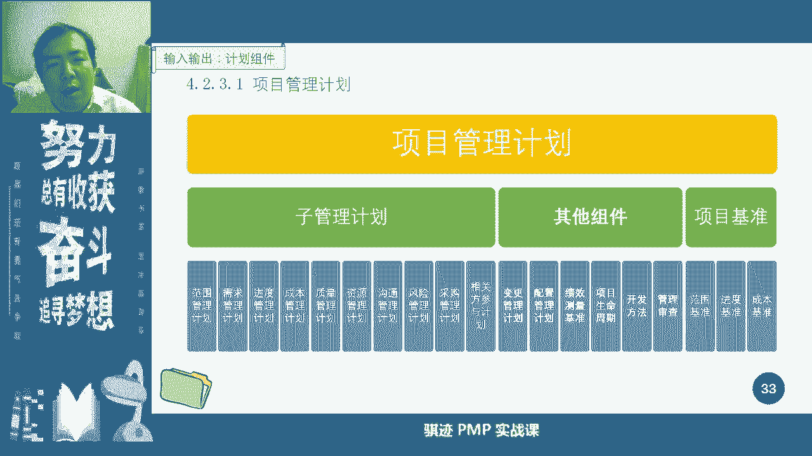

我们接着看，因为那张这张图呢是我们篇博客上有的，你翻书就有了啊，我就不特地在讲了啊。

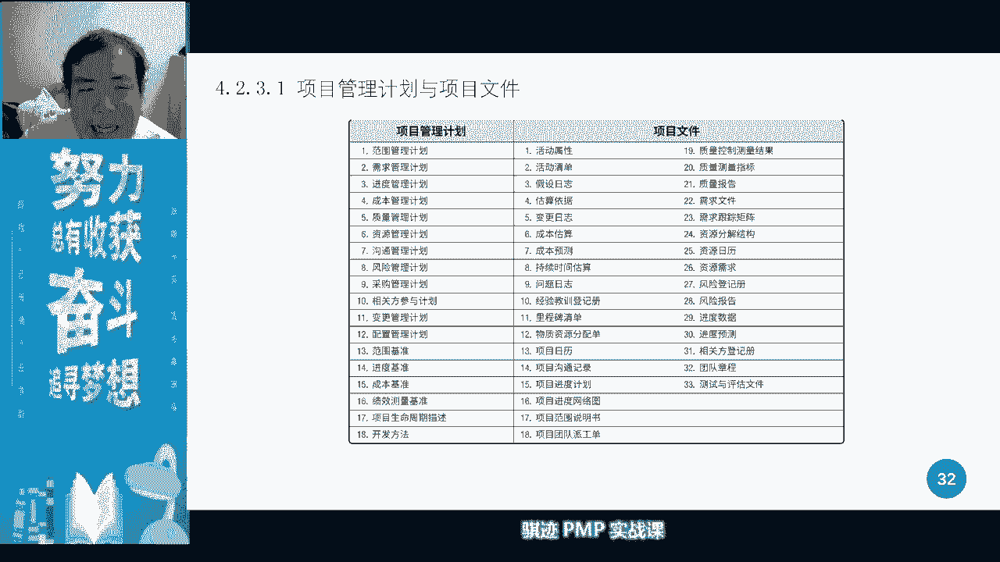

书上就有，那么我们讲项目叫管理计划呢，就是什么，由他的子计划，其他的组件和项目基本组成，项目基准我们说是说四个，但是主要呢我们运用的是范进程啊，范进程这个三个计划范围进度成本啊。

这是项目的最最主要的三角对吧，以及其他组件所组成啊，这是我们项目管理计划的最主要的组成，这是一个输出，那么做完了项目管理计划，就意味着我们的整个规划工作结束了。

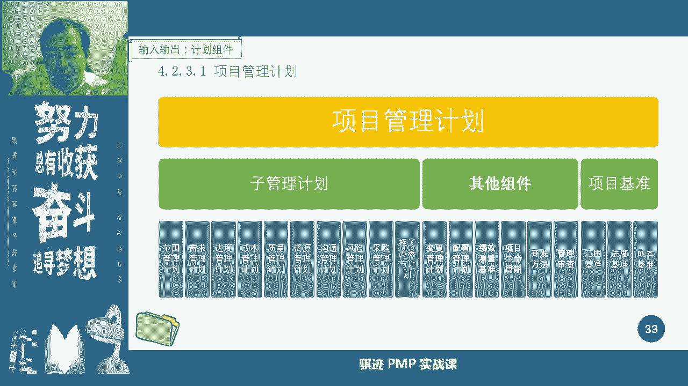

规划结束，那么接下来要做什么啊，这动作接下来就要做指导管理项目工作啊，当然项目管理计划结束之前呢，我们还会有一些其他的组件，这些组件呢刚才没有特别提到，但是我们要提一下你有哪些组件啊，变更管理计划啊。

变更管理计划不是通过某一个知识领域做出来，而是一个整体做出来，所以变更管理计划是谁来定的，是项目经理参照或者遵照组织的变更流程，制定的本项目如何管理变更的一个管理计划，这个当中会写得比较明确。

是项目经理有权批准等级变更，项目经理一般在一般的项目中，有权批准不改变项目基准的一些微小变更，但是呢它同时又定义的，如果是一个比较大的修改基准的变更，那么它应该通过怎么样一个流程去完成变更。

那么这个流程呢带有普遍性，我们在变更整体变更控制当中呢会加啊，所以这个管理计划是项目经理根据组织过程，资产，根据组织的相关规定，组织的管理框架，o p m框架等等，根据pm的指导所做出来的啊。

po的指导啊做出来，那么第二个管理情况呢叫做配置管理计划，所以讲我们怎么管理配置啊，看到配置呢很多同学来讲，哎呀这不是i t的东西啊，不是啊，配置是一切啊，不用于描述我们可交付成果的一切属性。

和它的关联性和它的特性的一种描述方式啊，叫做配置啊，只不过it领域来用的更多啊，i t领域用的更多，那么它是用于描述我们可交付成果的特性，和它的关联的，那么配置管理的话，就是怎么记录和更新这些信息。

那么因为任何对于可交付成果的变更和改变，都会涉及到配置的改变，所以怎么样改配置是一个可啊可交不成果的，我们管理的一个数额方位领域，也是跟变更相关的，所以也是要我们要知道和了解的啊，他们管理的是配置项啊。

configuration ite，第三个呢是绩效测量基准，就是讲我们整个项目过程当中呢，怎么样去测量它的绩效绩效啊，绩效测量绩效呢，我们后面在成本那一章会讲到，有个测量绩效方法。

就是一vn arm value management啊，正职管理是一种计量测量的一种标准方式啊，ok啊这个我们就不多赘述了，后面会再继续提到，然后呢我们也我们讲前面讲了项目的生命周期。

我们是使用的怎么样一些周期，我们分几个阶段，每个阶段用怎么样的周期类型对吧，敏捷适应增量迭代对吧，然后呢管理审查我们怎么样进行定期的审查，项目经理应该规定和有关方，我们要定期进行审查，那么有人说啊。

老师为什么你作死人家不要审查，你非要拖人家审查，注意适当的让相关方审查项目，有助于证明啊，一项目和项目团队呢是认真干活的，第二有助于项目经理呢，像尤其像甲方爸妈讨钱啊，所以作为一个乙方项目经理。

适当的顺手审查，设置审查点，并把审查点和甲方爸爸的付钱点结合起来，是有必要的啊，这就简单了，实际工作了啊，就是实际工作，然后看看是不是符合绩效，那么甲方妈妈，你符合你说我们符符合介绍。

符合符合符合符合介绍，是不是前端复一下哦，这怎么回事，注意啊，你闷头干，甲方又不知道你干成什么样子，他怎么付你钱，这是用来证明我们干活是符合要求的，明白吧。

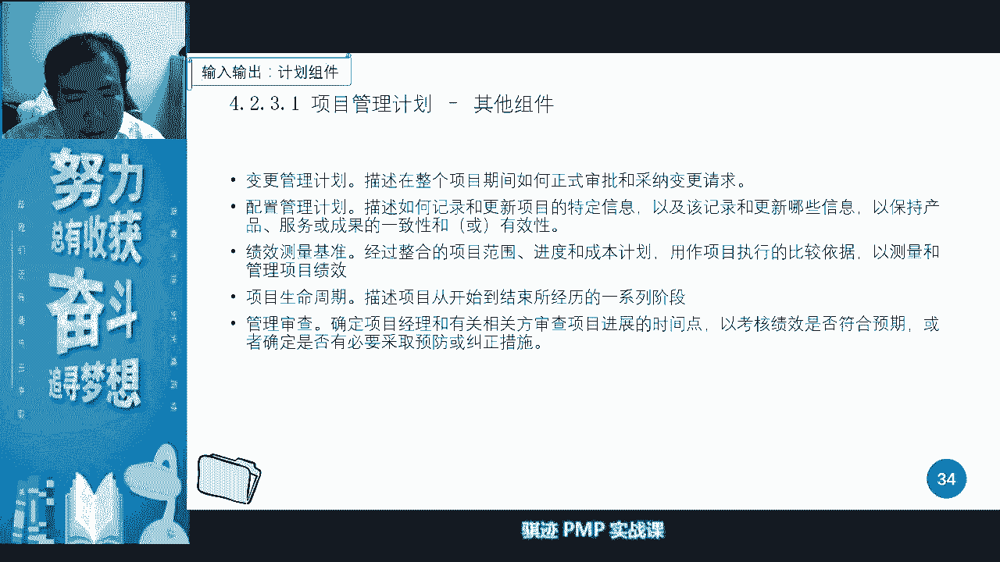

好那么前面讲的是项目管理计划的一些啊内容，我们接下来就开始讲什么相关内容，制定完了就该干什么，干活了啊，不要问就是干对吧，干就完事，然后就是接下来进入了我们的执行过程，组的整合管理，整合管理当中。

在呃在整合管理这个层次，执行过程中干的是什么，并不直接去干具体活，而是指导各个知识啊，各各个我们的知识领域，各个呃我们的子过程去协同工作，让他们协调，就具体的线上协调工作啊，就比如说如果你是一个。

如果你是一个建筑工地的建筑，建筑项目的项目经理，那么指导管理员工就什么，你们项目开工地开工了，你每天到工地去指挥啊，这个人干什么活，这个人到哪里去，这这个活怎么干，这个工具先干那个情况先干。

这就是指导管理项目工作对吧。

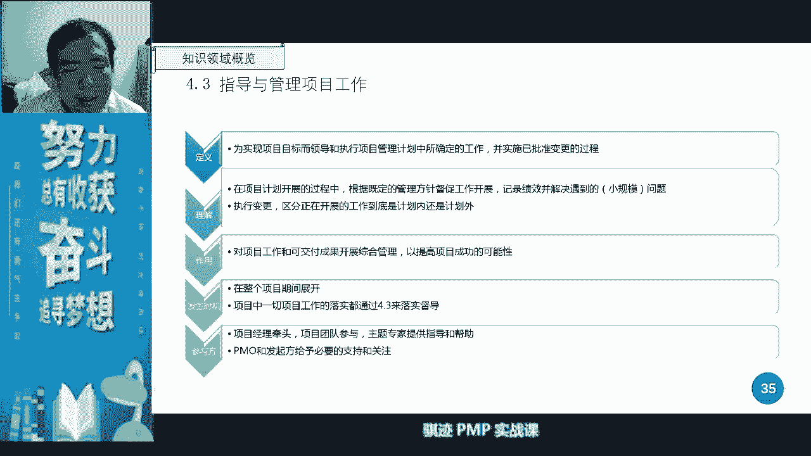

但是明白意思就行啊，那么这个过程呢其实没有什么，我觉得没有什么太多的讲的啊，虽然看输入输出挺多，其实没有太多的重点啊，重点我已经标啊成啊，嗯加粗不粗啊，加深了，你看他重点的几个就是项目管理。

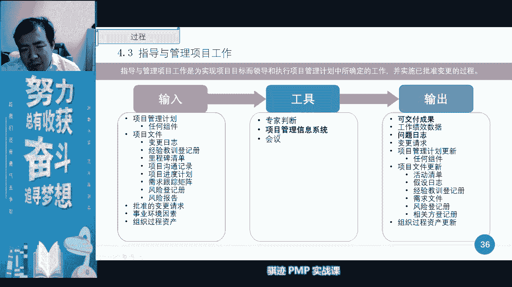

信息系统和问题日志和可交付成果啊，我们一个来看，那么在这个过程当中。

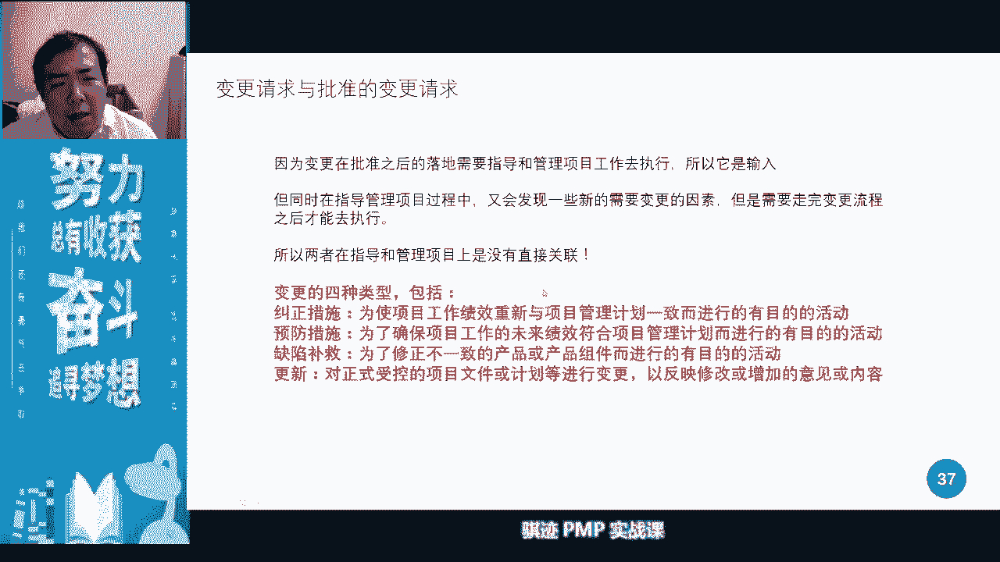

我们要做一个辨析啊，做一个辨析辨析，我们看指导和管理项目当中，我们看会有一个东西叫做批准的变更请求，批准的变更请求啊，在我们的输出当中呢，有一个变更请求是不是有点懵逼，我问你们是不是有点懵逼啊。

那么为什么输入的是批准的，输出的确是没有经过批准，老师你这不是扯淡嘛，就是输出变得有问题，我觉得是编的有问题，是不是啊，我也觉得偏的问题，ok啊，怎么变收回变得有问题啊对吧，你肯定是你的理解有问题啊。

那么为什么会这么做，因为这两个东西根本不是一回事情，那么什么意思呢，你就是说你在项目中去执行变更的时候。

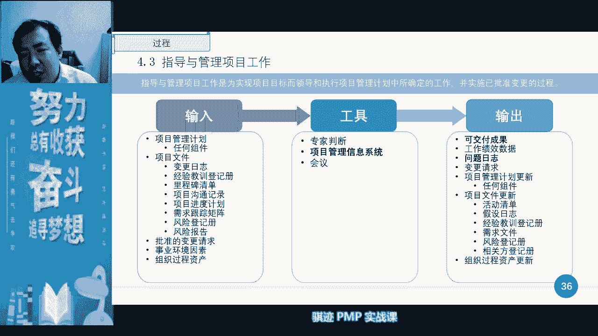

执行的肯定是什么东西啊，项目中的执行者肯定是执行的，已经经过批准后的变更，这种变更呢它经过批准，他要去落地，就要去执行，所以需要指导和管理项目中去执行，注意不是整体变更控制啊。

整体变更过程只是保证这个变更经过了流程，经过流程结束之后呢，交给指导和管理项目工作，去具体执行变更的落地，所以它是一种什么输入，但同时呢我们在现场管理过程中，发现有新的需要变更的因素。

所以要走变更流程上去执行，比如说你是一个建筑工地的项目经理，你到工地上发现诶，这个东西怎么没有啊，我误伤漫步，来来来来来，赶快给我去啊，这是不是有变更啊，是对吧，明白我意思啊。

所以这个执行过程当中就需要什么，就需要有变更请求啊，所以它会有一个变更请求发生，那么讲到这里，大家已经明白，这两个变更在上面是没有直接联系的，那么讲到这里，我们也发现了变更会有各种各样的类型。

所以我们在这里先给大家罗列一遍，变更的四种类型啊，但是很注意，我们这里这里讲一遍呢是非常仔细的，后面呢在变更整体运用控制还会讲仔细，但之后的我们的变更就不会这么仔细讲了啊，那么首先变更有四种类型。

叫做纠正措施，预防措施，曲线补救和更新变更啊，那么这个四种变更各有什么意义呢，又有什么意义呢，那么纠正措施是为了我们的工作绩效呢和计划，达到一致，所以纠正措施我们可以认为是什么，是为了提高绩效。

你可以记记为纠正措施是提高绩效，预防措施，大家可以看到什么，是为了确保那未来的绩效符合我们的啊，就是说预防措施主要是为什么，是为了预防未来的情况有变，或者是预防未来的风险，或者未来风险。

有些风险会影响极限的一些风险，所以预防这更多是为了预防风险，预防问题啊，预防风险和问题做下去措施，预防问题的发生对吧，就是预防风险，所以这是预防措施，是预防风险，第三个叫缺陷补救，为了纠正不一致的产品。

产品组件进行了有效活动，那么很显然这跟质量有关，那么缺陷补救很简单，就是补救质量，所以缺陷补救主要是为了补救治，最后一类变更呢是对正式收购文件就变更一反，应修改增加意见，那么最后的变更很简单。

就是增加功能，最后一种变更类型就更新叫增加功能，或者叫更新文件，增加功能这些东，这些是我们变更最主要的四种类型，最主要的四种类型啊，那么这四种类型当中，项目经理可以提出哪种类型啊，四种类型都可以提出。

但是主要是前三种类型，因为最主要种最后一种类型呢项目经理不变，直接直接提出，因为它会涉及到我们后面会讲的内容，会讲到什么内容呢。

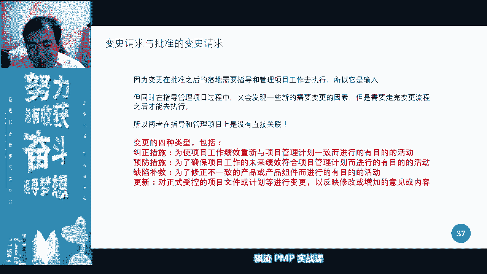

我们后面再看啊，好我们看我们在我们讲项目管理，我们的指导管理项目当中，我们会运用到一个工具，这个工具叫做pm project management information system啊。

这个东西现在已经很多了啊，比如说我们office组件里面有个东西叫做project，大家用过没有project啊，那就是p m s呀，它是用来干什么规划工具分配资源对吧，然后呢我们现在很多敏捷的工具啊。

比如说是那个啊ja对吧，杰软还有条件啊，国内很多项目管理软件，像什么禅道对吧，这些都是项目管理软件，这些软件都起到什么作用啊，第一啊直接看啊，工业化进度，第二呢工作授权，第三呢配置管理，第四收集信息。

第二呢进行自动化的界面，然后呢还可以统计kpi啊，可可可能是k pi，它有诸多这些工具啊，所以我们这个归纳一下项目管理信息，这种p m s它有哪些工具，第一规划进度，第二工作授权，第三配置管理。

第四信息收集发布和沟通，第六呢我们是有kpi绩效考核，还有哪个功能来了，我们听你们听了半天来了，还有哪个功能，我们之前曾经讲过，请给我打在公屏上，如果打出来的同学能够答对，说明你们的上课是非常人听的啊。

p m s还这里有哪一个功能是提到过，但是我们没有打在这里了，是之前的我们讲内容提到过的，请大家公屏上，哎有没有啊，反应明显就慢了啊，还有哪个功能，委托项目经理啊，同学你这个脑洞有点大啊。

授权项目经理工作绩效数据收集，数据收集不，这里不是信息收集和发布管理吗，哎这已经有了啊，ok啊这里有这个不算啊，想一想我们之前课讲过，我们讲过课不多啊，难道说我没有特地强调吗，我觉得不会啊啊不会啊。

ok啊，w bs风险啊，有些同学往后面跳w bs的范围里面内容啊，管理风险那个也是后面我们讲之前讲过的，不是之后要讲的啊，ok啊总算有一位同学记住，你看不容易啊，那位同学叫古文海的同学啊。

好当众表扬一下，非常好，它可以用来管理组织过程资产啊，组织过程资产记得吧，我当时讲的带到过一句，这些文档可以被保存在pmi当中啊，我记得我应该讲过一句，所以pm可以用来保存组织过程资产。

保存本项目的组织过程资产是不是，ok i你们呢你们呢你们上课倒是ok啊，那个叫k啊，不是ok i啊，ok啊，ok啊，r s t u p的那个r啊，缺陷跟进啊，ok啊，那么记住了。

那么p m s有这些功能，记住啊，除了我们这一页p p电容所罗列的功能，还有一个功能是保存组织过程资产啊，本项目的组织过程资产，ok啊，那么p m p m s在这里呢。

我们会提到有一个功能可以进行工作授权，什么叫工作授权呢，只让我们指定啊，本意良好，但是结果不好了，他会防止这个东西叫做镀金，什么叫做镀金呢，我这里给你写，已经写好定义了啊，什么叫镀金，乙方主动讨好甲方。

为甲方干活，主动注意就是你主动跪舔甲方法吧，但是呢你没有走流程，如果你走了流程可不可以啊，可以啊，那就不叫镀金，那叫乙方对甲方的什么东西啊啊一种服务啊，回馈啊，那都可以这么高大上。

但是只要没有走变更流程，没有授权批准，这个就叫做镀金，额外的多干活，那么甲方爸爸，你想看你镀金呢，他会多给你钱吗，当然是不会的，你这个又没有经过授权，又没有批准，有没有改合同，我为什么不给你钱。

所以他是不会增加价值啊，平白多干活，所以这种讨好行为是没有意义，而且会造成恶性竞争，这种恶性竞争叫做内卷啊，这个词很时髦很fashion，叫做内卷啊，那么第二种东西叫做范围蔓延，什么叫范围蔓延呢。

就反过来了，甲方爸爸主动要求你干活，但是他不走变更流程，他就是在干什么耍流氓，那么他对你耍流，他主动对你耍流氓，这就叫范围蔓延，如果你主动去勾引人家哈，柔柔主动去献身，那么就叫什么叫做镀金啊。

这个两个态度和方向是不一样的，明白了吧啊，ok那么我们在项目管理的管理当中，既要防范镀金，也要防范范围蔓延，如果甲方要求你多干活怎么办，要求他走变更流程，左边的主楼层只要ccdp啊。

ok那一切都好说对吧，反正项目管经理，项目经理不管又不管挣钱对吧，你批啊少挣钱啊，活干多了少挣钱，那你们要同意我们ok没有问题对吧，ok明白了，ok啊，这个概念一定要明确啊，一个叫镀金，又叫范围半径。

一个乙方主动讨好甲方多干活，一个是甲方要求乙方多干活对吧，不一样啊，但是都有的特征不走变更流程，没有走正式的变更控制流程啊，好这是p我们前面讲的是p m p m i啊，p m s啊，它有这些功能啊。

这些这些功能记住啊，好那么我们在直到管理项目过程中，就会有一个什么东西呢，可交付成果啊，这里又来一个可交付成果的阶梯对吧，ok啊交付成果啊，那么这个东西已经学过了，可交付成果呢是某一个阶段过程中。

必然会产生独特的可核实的产品成果啊，ok概念指导一下啊，这个阶梯我们已经学过了对吧好。

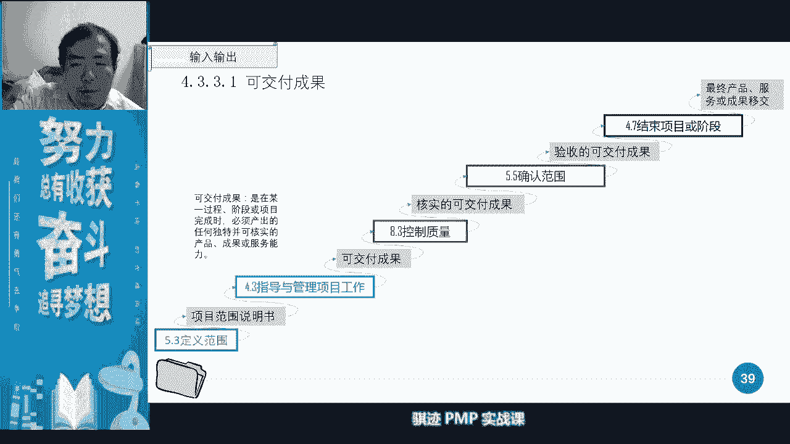

我们就不再追寻，抓紧时间，课程内容很多，但是分两节课啊，整合分两节课就有道理，那么还会产生一个什么什么东西呢，当我们项目当中发生了任何风险，发生了任何错误的时候，我们就会记录一样东西叫问题日志啊。

问题日志它会记录在problem log当中啊，power log当中，power log当中记录我们产生问题的原因，试图找到原因并加以进行什么，进行跟进纠正管理，消除它的影响啊。

会有个东西叫问题日志啊，所以一个项目经理当中，你知道管理项目当中是不可能不出错的，出错不可怕啊，但是你把出错的问题呢记录下来，然后呢进行改进就可以。

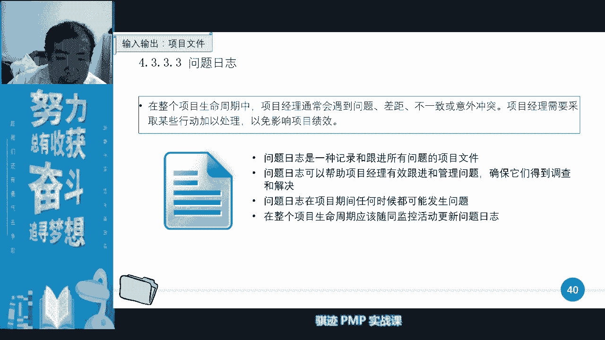

好那么接下来一个知识领域，我们要讲的是管理项目知识啊，管理项目知识啊。

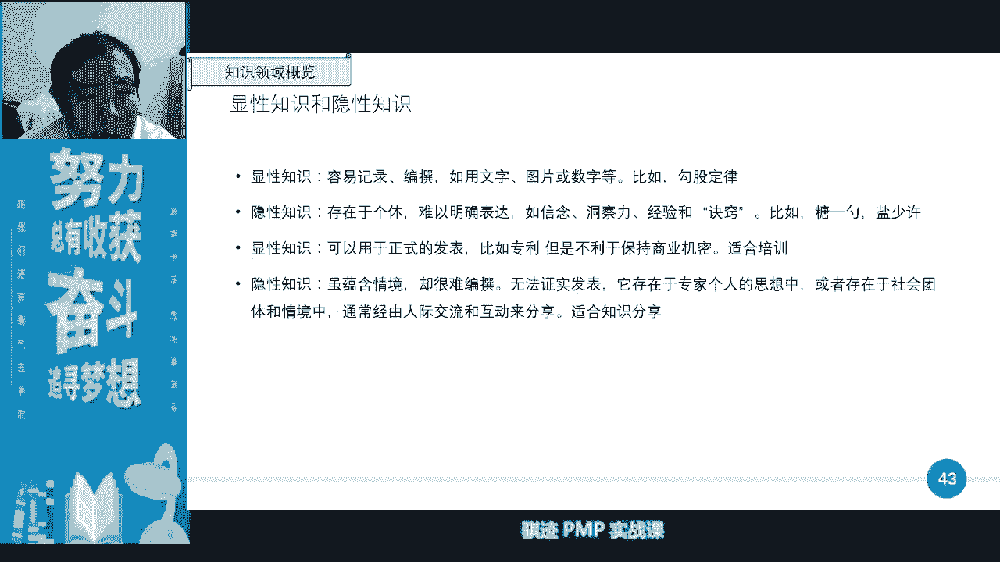

稍等啊，管理项目知识的话，我们先讲监控吧，我们把监控剪掉，管理项目知识和后面的我们后面再讲，后面再讲。

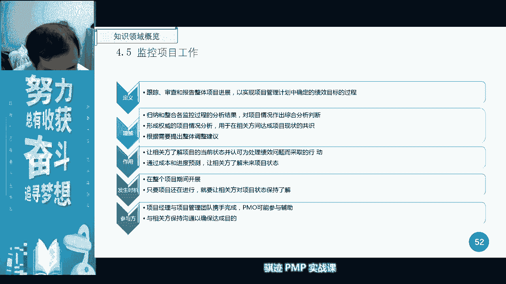

我们跳一跳，哦算了，我们先讲管理知识吧，算了吧，我还是有时候我喜欢想跳啊，我们今天讲课讲的管理项目知识啊，后面那几个洞，后面的监控和监控收尾和我们的整体变更，控制呢是下节课再讲，下节课再讲啊。

好我们先讲管理项目知识，那么管理项目知识呢是使用现在已有的知识，生成新知识，我们已经有一个人，有一个在实践过程中得出知识，或者他已经有了知识，我们要把这些知识从一个人变成所有人，或者一群人进行推广。

知识的推广，有助于提高我们的生产效率，提高我们的认知水平能力等等这些东西啊，然后呢，我们通过可以通过实践环节和相互的非正式的，知识传授环节去进行知识的管理和扩散，同时呢项目经理要促进促进知识流转。

所以一个组织当中你要管理好知识，你应该怎么做啊，首先在一个项目团队组织当中，我们要管理好知识，就要建立一个东西叫做知识库或者知识文档，项目呢有些项目呢可能项目不大，你可能很难建立知识库。

那你就要建立一个知识文档，将各方面的知识呢归结起来啊，我们现在有很多工具，比如说我们可以用share point，对吧啊，conference啊等等，很多工具都是用来可以管理知识。

那么光有不知识归档什么有用，就是知识关键在于很好的分享，所以在管理制项目知识这个过程中，项目经理要起个带头作用，带领大家鼓励大家主动的去分享知识啊，我带的一些很以前的一些呃项目当中。

我就很鼓励大家呢把自己遇到的任何问题，任何的我们看到的任何问题的，我们最后的解决办法，甚至我们发现了某些现象呢，都放到特定的知识分享的文档和目录，甚至是啊知识库当中去进行分享。

这种分享呢可以帮助他所有人提高，然后呢我会在团队的文化当中呢，对这种行为来予以鼓励以鼓励啊，就像我刚才我们有位同学啊，主动说出py里面有我们的组织过程，资产的归档的功能啊，我们要予以鼓励表扬啊。

那位同学学得很好，那么你知识管理也一样，项目的这个项目的知识管理也一样，我们要管理好项目当中的知识，并且鼓励大家进行知识分享，然后项目经理呢要把这些知识呢进行整理，整理完之后呢，以恰当的形式。

让这些知识在各个我们的项目，团队人员之间来进行流动，从而达到一个地方发现好的，然后呢全局进行推广啊，全局点中，所以经验教训啊也要办，然后我们的知识分享也罢，这些东西收集经验教训，然后收集知识。

这些东西我们都会在整个项目当中贯穿于始终，那么我们讲如果最后项目结束了，那么应该怎么办，将我们的项目中所归纳的知识，变成我们的经验教训的啊归档，然后呢归到组织过程资产当中去啊，进行归档。

当然项目经理肯定这里有一份，可以有利于组织的，以后其他的项目和项目经理以后，自己带的其他项目啊，做得更好，做得更好。

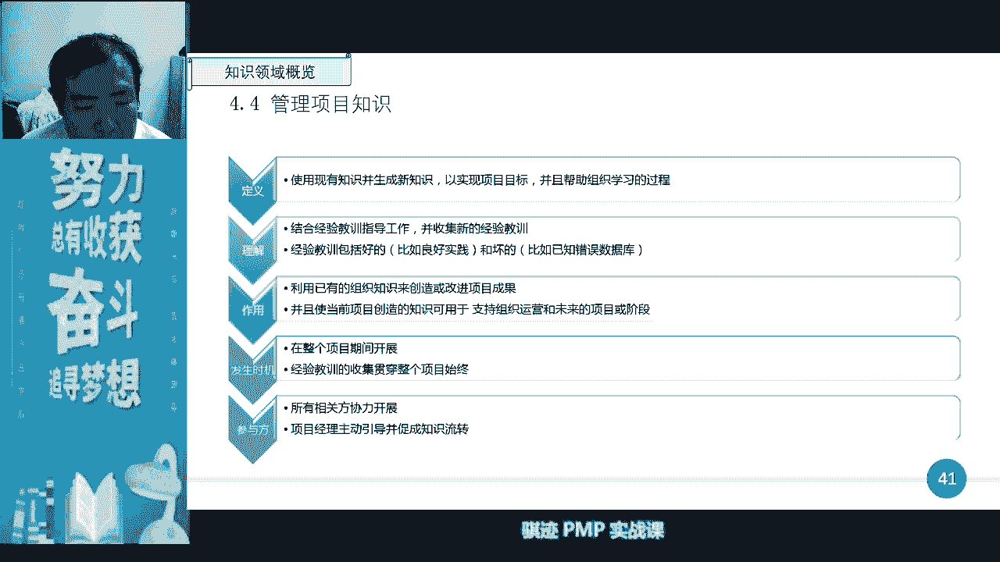

好这是我们管理项目知识的一个总的概念，那么管理项目知识当中，我们很重要的一个输入工具，什么经验教训登记册，那么就叫listen learn啊，listen learn。

listen learn list啊，那么我们在管理项目知识当中，肯定会有很多经验和教训，然后我们就会把这个东西登记起来，但是呢登记经验教登记经验教训呢，那么很多人呢就是有些人可能呃。

当然管理知识有个特征前提啊，大家呃首先要打破大家一个固有观念，一个项目，一个很粗鄙的，没有什么文化，他也会有经验，他只是不善于把这个经验归纳出，它，在实践过程中也也会有经验对吧。

比如说你在工地和一个农民工啊，收集项目的资金也会收集啊，比如说农民告诉啊，像这种天气，我们半回啊，水泥黄沙水应该怎么到，黄山应该怎么办，就这水泥会办得好，这个是不是一个经验，是不是一个经验总结。

当然是啊，这是以前他的类似教训当中所总结出来，当然是有用的啊，那么你是不是可以把它收集起来，然后你然后你去做实验验证啊，确实有用，你是不是以后应该，在整个比如说工地的项目团队当中，让所有的农民工。

变成一种我们的项目的标准，是不是有助于我们所有人把事情做得更好啊，这是一个概念，所以经验教训登记就是这种方式，不谁都可以登记，只要这个东西你最后验证出来有帮助就可以啊，并不是说一定要工程师啊，技术人员。

项目经理才做的东西，不是啊，所有有意义的东西就是都可以被收集下，无论层次高层次低，但是它的登记过程呢可能登记上去，收集上去的时候呢，他表达可能会比较直观不客观，难以难以这呃系统化的进行归纳。

那么那需要项目经理进行有效的归纳之后呢，进行推广啊。

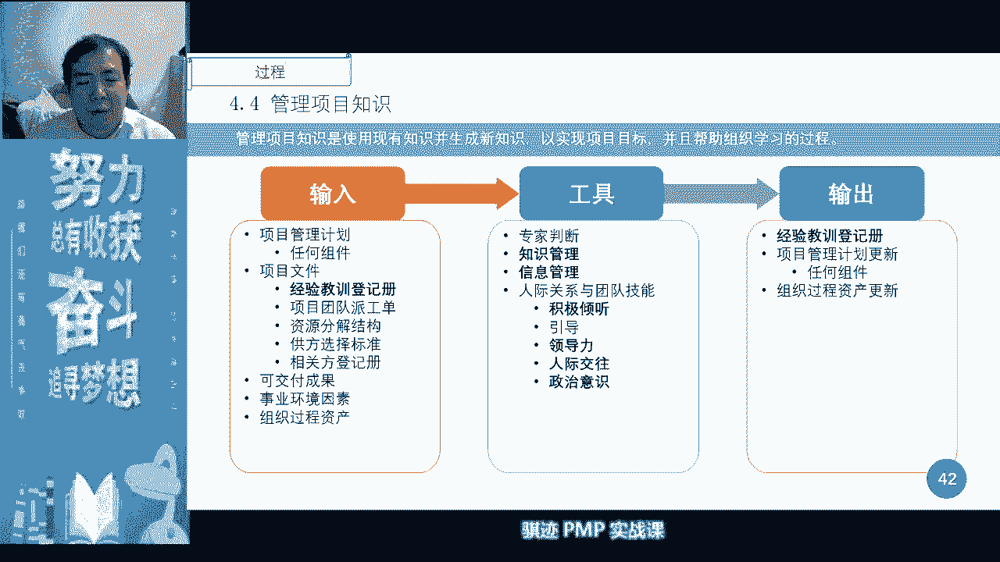

这是经验教训登记啊，经验教训登记册的一个特征。

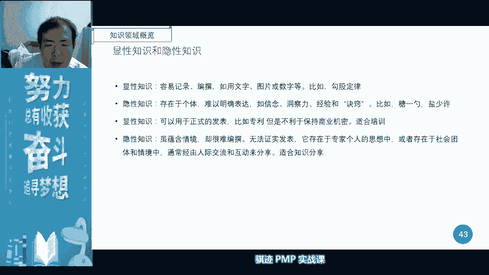

那么我们在工具当中，知识当中，我们会有一个东西叫什么，叫做分享的东西的知识。

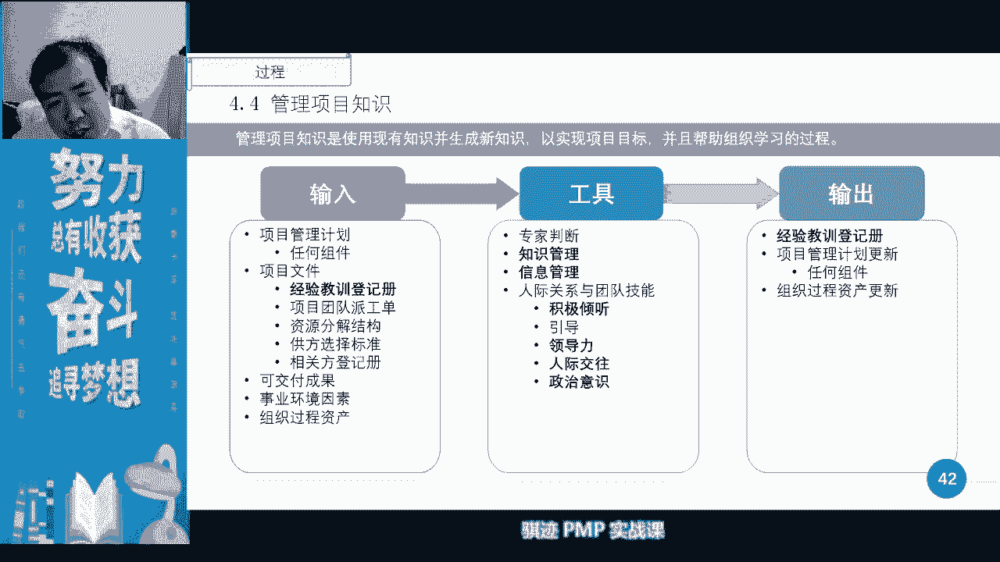

有个东西叫显性知识，有个东西叫引进知识，那么什么叫做显性知识呢，就是说容易被记录的，能够用编撰了，能够用文字，图片，数字所记录下的东西啊，所以这里我给大家哦，我对大家的p p t上加了一个东西。

比如说勾股定律，就是一个显性知识对吧，为什么勾三股四玄五，中国人老外啊，无论哪个豆浆哪个地方啊，哪怕是地球人，哪怕是外星人，都知道，勾三股四玄武是一个三角形的三边构成的，一个经典的，啊定律啊，对吧。

勾股定律对吧，然后啊，直角直角三角形两两边的平方，等于第三边的平方和对吧啊，这是勾股定律对吧，这些东西都是我们啊容易用文字表达，容易用数字表达，就是说而且是很精确的东西。

而隐性知识呢存在于个体难以表达应用意念，经验决下来，比如说中国人最常见的烹饪技巧就是隐性知识，一勺盐少许，那我问你一勺怎么少啊，这么大的勺子有没有有这么大的勺子，有没有有都是一勺，那么什么叫一勺对吧。

什么叫做少许，那就更头疼了，所以中国人的烹饪菜谱，为什么老外不用，因为他们根本没办法用，他们只认血经知识，对他们来说，糖少许，他们懵逼的啊，盐少许懵逼的啊，啥叫少许，你到底跟我说放几克。

所以老外的厨房里最多是什么厨房秤，还有什么标准量少，他们做的东西都是非常要求非常标准，中国人更讲究什么一种感觉，厨艺感觉，所以厨艺感觉也是一种什么隐性知识，隐性知识明白了吧啊，这很意思。

所以你通过这个例子，你就明白什么叫隐形指明显性指示，显性知识呢还有一个特征可以表达给正式发表，比如说专利，专利就是一个显性知识，但是呢它不利于商业机密保存啊，所以如果一个东西能够被正式的写下来。

描述下它是不是很容易传播啊，所以它不容易保存商业机密，所以很多的商业机密如果保存下来就要注意，真正的商业机密是不会去申请专利的，知道申请专利的，就是我发现了这个东西，我怕别人也很快发现这个东西。

所以我要去申请专利，防止别人呃，防止别人跟我一样，能够利用这个专利的知识去获取利益，我先把它抢注掉，那么别人用的话就要给我付专利费对吧，就是这个意思，所以真正的我不怕别人发现了某些秘密。

我是不会去申请专利啊，这一点你们要注意啊，对吧，所以人家说啊什么云南白药的，云南白药的药方对吧，是商业机密，他有专利吧，没有专利啊，啊其实可能也有专利，他专利里面绝不会写具体配方内容啊。

他只只会用一些很模糊的词汇去描述我，这东西怎么样怎么样啊，但是呢显性知识有什么好处啊，适合培训，因为他的表达正式，所以他适合进行正式的化的知识管理，知识交流叫做培训啊，那么为什么要提到这个词呢。

因为后面会讲到在资源管理当中，我们在建设团队当中要提高团队成员能力，大家记得吧，提高能力要靠什么，要靠培训，其实提高能力也可以靠什么东西啊，也可以靠知识的分享，但主要是靠培训。

培训能够不能提高团队能力啊，短期内不能长期呢啊记得吧，就是记得吧，所以团队的能力是不是一种，我们讲的就是一种事业环境因素啊，但是它是一种短期的事业环境因素，记不记得啊，我们是不是把知识都串起来了。

如果你能把知识结合起来，它会比较容易记住好，那是隐性的知识呢就很难编撰，所以呢它很难与什么用正式方式去传授，所以它通常适合什么人与人交流，人与人交流适合知识分享，好，我们这里看个例子啊，什么是知识分享。

他能够分享隐性知识，隐性知识，那么区别于培训，他是非正式的，大家看啊，考试当中大家注意什么时候是知识管理的，知识分享，什么时候是培训，关键看他是不是正式，正式和非正式人际交流对吧，兴趣小组会议啊。

工作跟踪，知识分享论坛，故事会研讨会，交互式培训，这些都是知识培训啊，老师说啊，交互式培训为什么不是培训啊，你要看啊，我们在偏僻当中，一般认为啊一般认为啊交互式培训，如果他当然这个定义是。

一般是认为都是在内部大家相互交叉的培训，这叫交互式培训，是也有一种交互，培训呢是互动的那种培训，但这种培训方式呢，一般来说不是正式传授理论的，所以正式的培训机构，就像我们奇迹这样给你大家上。

像我这样给大家上拼批课的，这种叫做培训啊，比如说我手把手教大家怎么写，比如说我在你站在你旁边，手把手教你怎么写啊，怎么写项目章程，怎么做，项目管理计划对吧，这种叫什么叫做知识管理，知识分享，明白了吧。

而培训呢是一般是请外面的老师的啊，所以培训叫做外来的和尚好念经。

所以培训呢一般是请外面的老师通过正式形式，由专业人士培训的，而知识分享呢一般是什么内部的。

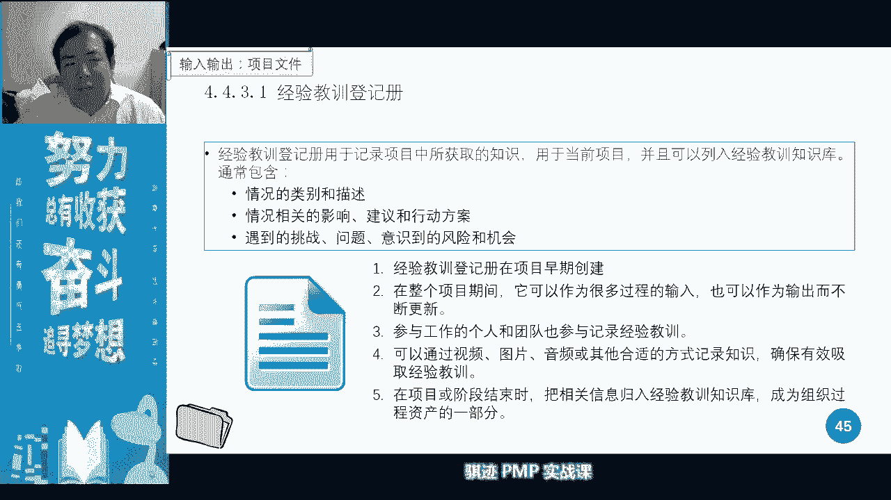

我们通过相互彼此进行交流的方式，来进行了非正式的，所以通常呢我们会用面对面的方式来进行，知识分享，有助于建立了信任关系，是这样，可以用虚拟互动的方式进行啊。

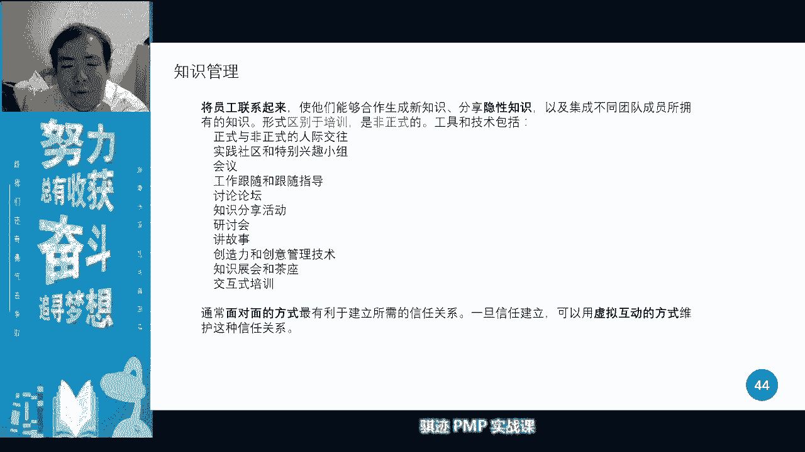

好那么我们在输入输出文件当中呢，还会有个东西，经验教训登记册，我们前面已经讲了对吧，它应该有个特征叫早期建立，定期更新，只要有经验教训，就应该把它更新一下，然后但是呢到项目结束或者项目阶段结束呢。

我们就要进行归档了，看到归入可能要归档，归档之后，他就成为什么东西啊，经验教训知识库成为组织国产的一部分，存在哪里呀，请大家打在公屏上，经验教训登记册，当它被归纳成我们的经验知识库。

成为组织过程组成过程资产一部分之后，他应该被归档在哪里啊，请打在公屏上，或者说他应该被归档在哪里，由谁来管理，好这边现在都记住了对吧，ok啊现在记住了，记住就好，什么样技术其实不重要啊。

怎么样技术不重要啊，比老师挖坑技术其实更好，我觉得啊你们的记忆会更深刻，我觉得啊对b被po所管理对吧，因为它已经是组织的过程资产的一部分了，所以他已经可以被pmo管理，然后可以分享到其他的项目当中去了。

对吧啊，非常好好。

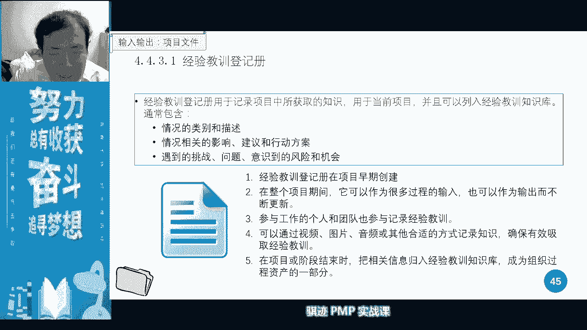

那么知识管理呢它取决于什么项目的性质，创新的程度，复杂度和团队的多元化程度啊，多元化程度会是这样一个有这样一个特性。

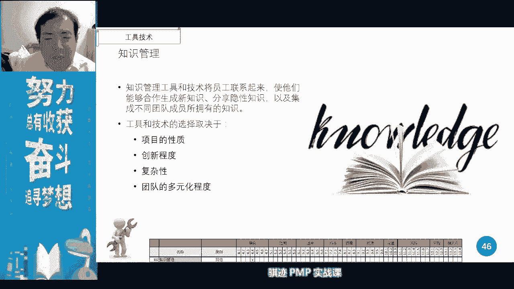

那么与知识管理相对应的有一个叫信息管理，信息管理更多的是什么，利用信息技术的方式来，它更有效利用于什么显性知识啊分享，所以信息管理可以什么，我们用pm进行信息管理，我们前面已经学了对吧。

然后呢可以进行信息收集，可以进行什么图书馆服务，当然也可以进行进行调用登记啊，所以信息管理呢更适用于显性知识，但是一般来说考试没有考分那么细什么，这是知识管理还是信息管理啊。

如果他讲到知识管理更多的是什么，分享隐性知识，不过他信息管理呢更多的分享显性知识，那么隐性值得分享，我不会说什么什么互动会故事会吹牛沙龙对吧，吹逼会对吧，所以这些东西都可以信息给管理呢。

它就比较严谨一点是吧，图书馆信息收集p m s，那么我们讲在性知识管理当中有一个注意什么，要有一个沟通技巧叫七夕听听啊，我们稍稍事聊聊聊一下啊，那么您要去获取知识，一定要会倾听，一定要会倾听。

积极的倾听呢可以告知以收到纯净信息，理解防碍信息啊，有助于我们减少工啊误解，正常沟通，所以倾听是一个知识分享很好的一个技巧，那么怎么样才是积极的倾听方式，比如说你们现在听我上课。

什么样是一个积极倾听方式啊，就是在公屏上给我打上666对吧，表明你们在上课，所以我我怎么样知道你们在积极听闻呢，我就经常在上课的时候会问你们一些问题，那么如果我们在面对面进行沟通的时候。

我怎么我只怎么知道对方，或者怎么样给对方表达啊，你的记忆清零呢，那么我就你们看着今天看着我的脸啊，我就会跟他对话啊，听着我就嗯啊是的啊，你说啊是的啊，对像这样一种方式，其实你用这种短语。

其实你表达的并不是他说他真的是对的，只是你用这种短语就当对方说什么，我正在听你说话，你继续说，这种亲亲态度呢会让大家会让对方觉得很舒服，所以你可以换位思考一下，如果有人在听你说东西的时候啊。

过一段时间过一段时间呢会给的啊，给对方一个反馈，很简短的反馈，像这种时候你就觉得对方一直在听我说东西啊，因为我觉得我的表达很有意义嘛，所以你就觉得被对方尊重啊，这是一个很好的沟通技巧，在沟通管理里面。

我们在沟通管理里面，我们会很很提倡这种方式，再配合语言和肢体和动作啊，比如说你们看我的眼神对吧，很真诚的眼神啊，注意看注意屏幕的你们的左上角啊，很真诚眼神看着嗯，是的啊，你说的对啊，继续啊，还有呢啊。

是不是是不是就显得你们很愿意告诉我对吧，很愿意告诉我，你们昨天晚上吃的是康师傅红烧牛肉，面对吧，哈哈开个玩笑，开个玩笑，是不是我们上课上到是不是有点累啊，ok但是这是一种技巧，这是不仅仅是在我们考试啊。

考试上可能用不着，但是在我们实际工作当中，其实是一个很好的技巧，我希望大家也能够学在通过我们的课程，不仅能通过考试，也能在工作上会有一些精进啊，那么我们讲在知识管理当中。

我们也很需要人际关系当中也需要领导力对吧，领导力我们讲过什么类型，我们就不多讲了啊，也需要什么有人际交往啊，交往，人际交往，有助于项目经理和进行非正式的解决问题。

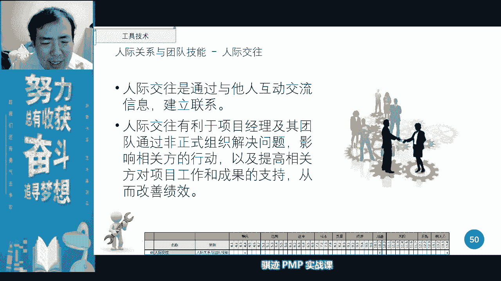

然后呢影响相关方工作，改善绩效对吧，我们要理解我们组织当前的环境对吧啊，组织当前的内部的政治环境对吧，我们要跟着组织啊，跟着组织方向走对吧好，那么以上这些内容呢，就是今天讲的我们项目管理当中。

整合管理的四部分，我们下节课呢讲三部分，然后讲一些辨析啊，下节课就讲辨析，因为这节课因为课程内容的关系，我讲了一半关系，但是我们在下节课讲完的时候呢，那么希望大家今天回去之后呢，在复看一下啊。

尤其是因为我们已经开，通过i t t o输入输出工具技术，这种方式去理解我们每一个子过程，以及它的作用，在工作中的作用，这种方式啊，脑子的理解，而不是像前三那种前三章那种阿姨啊，叙述描述。

以我说的为主啊，你们要懂脑中开始要有一种概念啊，这个过程是做什么的，他输入什么，输出什么，起到什么作用，用什么工具方法去实现，我们看到每一个子过程都是这样的话，那么你的思维方式就已经适应了p np了。

可以，所以回去之后呢，大家把所有的子过程哦，今天教授的四个子过程都看一看，尤其是我重点讲过的那些子过程和他的知识点，大家记住啊，这些都是历届很喜欢考的一些点，好吧好，那么今天的课程到这里正好是十点了。

差不多十点，回去之后，那么我们下周再见，这一周我们会继续讲我们的监控过程组，我们的结束项目阶段以及最后我们的变更啊，变更非常重要，我们会详细的讲，好吧好，那么今天到这里，我们要么下节课再见，拜拜啊。

有些同学上次说啊，我没有问你们，我们今天补一下。

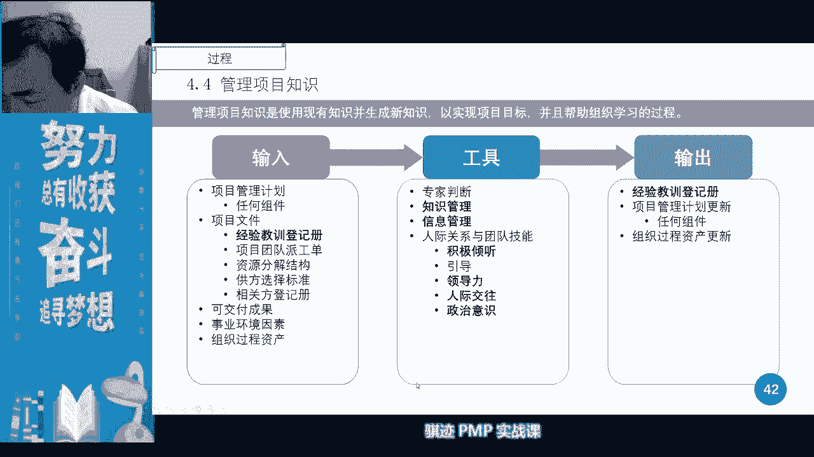