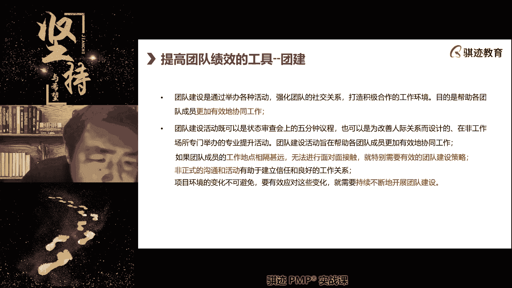
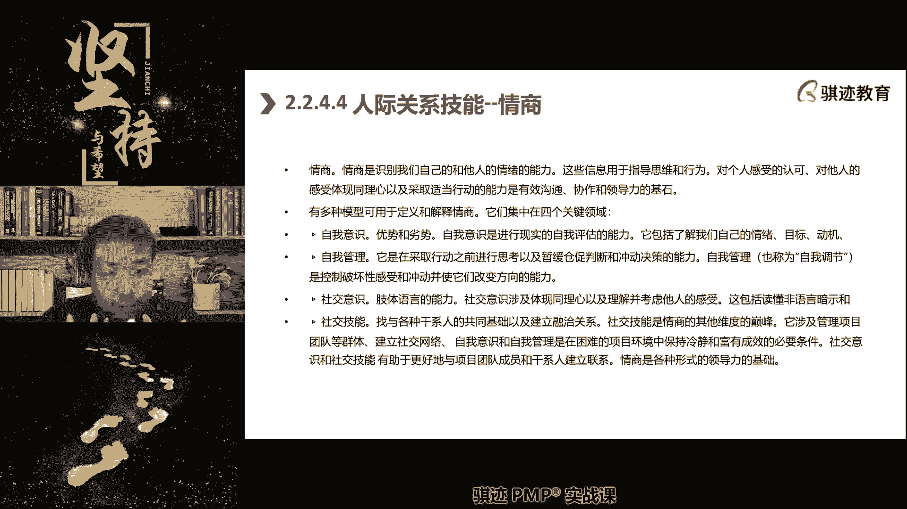
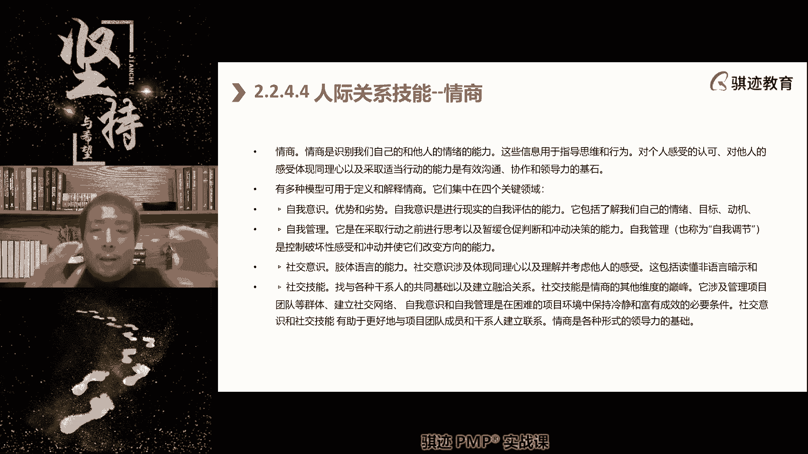
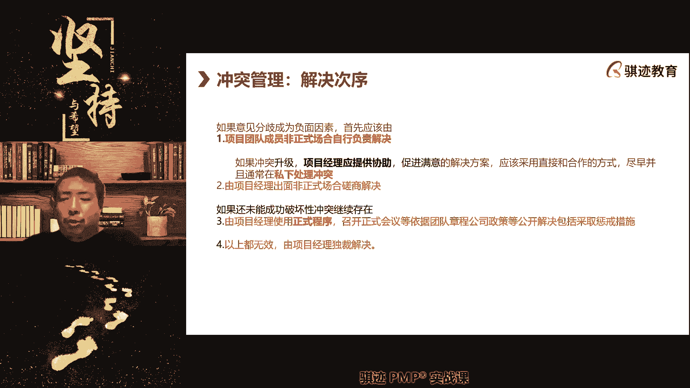

# PMP认证考试课程最新完整免费课程零基础一次通过项目管理PMP考试 - P71：PMBOK第七版 第十六章 团队绩效域下-2 - 骐迹PMP - BV1Sb4y1f7Yt

好所以这就是马斯洛层次理论，所以我们针对不同的项目中的人，要运用不同的机体层次理论，比如说题目说项目中小王是一名工程师，那么小王呢呃他想要什么更自己提升一步，他相信说从一名普通工程师变成一名管理者。

那么小王当前属于什么，他属于骨干层到管理层的这个过渡阶段，那么小王当前怎么样激励他，最好给予他体内的稳定，是不是管理层的机理，也给予他骨干成什么良好的工作氛围，和我们的啊专业培训对吧。

比如说给予啊小王来听叉老师PP培训班的啊，培训报销啊，我们我们其实就很多同学来听徐帆，是是是是单位里啊奖励啊，有学费报销的来听有很多的啊，那么这些呢都是什么，都是用恰当的方式来激励员工做出良好业绩。

这就是马斯洛层次理论啊，只是举例，那么所以在考马斯洛相关的题目的时候，要注意什么，分辨当前被激励者处于何种呃企业内的阶层，他是临时工还是正式工，还是骨干层，还是管理层还是决策，你要觉得找准他的定位。

这就是马斯洛的层次激励理论，那么第三啊，这不是第三个递减12345，第五还是第六个，我们的模型啊，团队的里面的模型特别多，因为它和人力资源相关啊，那么这个就是我们要特别注意的啊，考试考的也很多的。

赫兹伯格双因素啊，赫兹伯格双因素是什么，人的激励除了层次以外，还要有内外有内心的精神层面的激励，也有外在的物质层面的激励，那么什么叫内心，内心内在激励因素就是我们的激励。

人内在激励因素就叫啊inspiration，Inspiration fact，保健因素呢叫做healthy fe，那么激励是什么，我们想要的工作一定是什么，对于我们来说，做完这个工作啊。

或者做完一阶段工作是会带有成就感，工作的成就感往往会被人忽视，同学们真的就是如果你做一件事情，这个事情可以给你带来金钱，但是不能给你带来社会的肯定，或者你给给自己带来肯定，人往往会什么会厌弃这个工作。

导致没有工作动，知道吧，所以这就是很多东西，有一个我的这两年特别特别明显的啊，就是很多人呢拼了命的千军万马过独木桥，去考公，当公务员，真的当了公务员之后，很多人呢用每年的什么辞职下海，不当公务员。

那么那些好不容易考了考上工当公务员的，为什么要辞职下来，因为他们的本能的公务员工作是枯燥的平凡，他们自己认为那个岗位，对他们来说是没有任何成就感，比如说某个人考了个公务员，公务员是个窗口岗位。

每天要接待人民群众来办事要求啊，那么然后呢还会受到群众的批评，做的不好呢，还会叫到叫到群众的，那个那个那个那个各种各样的啊指责啊，所以在这种时候呢，这种时候呢他就会觉得很没有成就感，很明申请我坐在上面。

虽然我的工作很稳定，收入也不算高，也不算低，大部分公务员也就是不算高不算低，但是工作超级稳定对吧，没事没有人能找到我对吧，但是我做的这什么原因，我从这里开始做，一直做到老，做到退休。

未来可见的生活是可以预见的，这种生活有对很多人，尤其是年轻人来说是很难接受的，tedious枯燥无聊，没有成就感，就会导致他失去前进动力，最终他会选择放弃啊，那么今年呢就业形势不太好，可能会少一点。

往年在经济形势好的时候，尤其是这种很大的因素，就是工作没有成就感，而导致大家放弃公务员啊，背锅侠啊对啊，这个明白吗，这就是激励因素，所以很多人就说就像围城啊，很多人看很多人啊。

有很多人看那些辞职下海的公务员的，前公园动物，好好的一盆铁饭碗，为什么不干，工资又不算少，福利待遇又好对吧，工作又稳定，为什么不干，这个就是说他没有看透那个缺乏的激励因素啊。

有些人呢啊像差有点像查老师一样啊，啊自自编一下，就说我喜欢做一些有挑战性的工作，就是有点难度，不要什么东西，就是很不动脑子也能做完的事情，我觉得这种事情我不愿意做，我很无聊，做有挑战性的事情啊。

有些人做东西就是为什么呢，喜欢要改变环境或者怎么样，或者做绝对做不下去，就是因为做的事情没有挑战性啊，以及被人认可，能够提升自我责任和感到有责任和进步啊，注意啊，感到责任和承担责任也是激励人啊。

适当的给予团队成员一定的责任，也是一种激励啊，你们知道为什么学校里有些啊，有以前我以前读书也有，比如有些同学呢可能现在学习水平一般，但是老师为了激励他呢，让他当当一个什么课代表，当一个什么小队长对吧。

然后呢这就他就有有一个责任感对吧，课代表要负责收收，那么什么叫语文作业或数学作业，化学作业对吧，他就有责任感，他就愿意去学好，责任也是一种激励，这些激励都是内心的满足于内心诉求的机会啊，给予啊。

你可以说这中间是有交叉的啊，给予责任也是认可的方式，也就是有交叉的，保健因素就是外在的薪水，技术支持，工作环境条件，福利公理，这些都是保健因素啊，这个大家都比较理解，那么我经常会举个例子啊。

我也可以问大家一下啊，要抓紧时间，就是如果有一项工作，他只能给你很高的薪水，比你当前的薪水高很多，但是也给你很不错的工作条件，但是不能给你任何成就感呃，工作很乏味，毫无挑战性啊，毫无挑战性。

不会被人认可，也没有任何提高的空间，请问你做不做，稳不稳定稳定就做阶段性的做一段时间，做一段时间的同学是不是手头有点紧啊，同学们啊，我说的这个东西，那我们我不是说伤害大家感情啊，你们知道吧。

中国现在很多人在失业，但是中国现在有很多的行业，很多的岗位薪水其实是不低的，但是没有人愿意做，比如说我们中肯定来讲工地去做农民工，你们不要笑话啊，家里去做装修工，去做农民工。

做义工都要能够达到400块钱左右，甚至到500块钱，虽然很辛苦很辛苦啊，很辛苦很辛苦，你一一只呃，一个月做25km以上，25天工作日对吧，你就算不加班，做25个工作日就有多少钱净收入啊。

就是1万到手就是1万，我相信我们这里有很多的同学，每个月到手的收入绝对没有意外，但是大家众所周知，农民工很辛苦，不被社会认可，没有发展前途对吧，没有成就感，没有挑战性，那么这个工作你愿意去做吗，没有。

所以中国当前的现实就是很多工地上的农民工，很多家装装修工等等这些苦干苦力出，那就也少量技术加大量体力的工作，收入的回报是相当可观的，但是没有人愿意做，50多岁的人，成为了这个群体的中坚力量。

同学们50多岁的人都大部分都是在呃，就是说这个农民工的很多的主体，都是在40岁以上，甚至50多岁，农民工哪来挑战性啊，农民工每天就是出卖自己的体力，累得汗流浃背，和种地一样，但是与重点不同的是。

为什么农民工，农民工是农民工，没有工人工，是因为他们在地里汗流浃背的种地干活，所挣的钱要比工地少很多，所以他们觉得到工地上干活，比地里去干活挣钱多了，我为什么要去种地，所以才会民工进城，明白了。

有些同学说我以为给多少钱，对我承认，有一部分同学，收入可能比一个月挣1万多块钱要高得多啊，但是我相信我们直播间里和我们的奇迹，我们这个8月份，这个班级里很多的同学，一个月到手不一定有1万。

一个月到手不一定有意外对吧，但是你们我相信你们绝大部分人是不，或者是95%，99以上的人是不会去做农民工的，为什么只能部分满足赫兹伯格当中的保健因素，但它无法满足你的激励因素，因为没有前途。

没有社会认可，没有成就感对吧，只能给你带来一份薪水，其他什么东西都没有，有同学说农民工太累了，啊啊我明白，所以你明白合资不够伤心，所以我们回来啊，我们还是讲合资不够。

所以什么时候人的工作积极性和效能是最高的，激励和保健因素同时满足一个工作，既有相当好的薪水，又有什么相应的福利和工作支持，工龄又具有挑战性，责任感，又又有成就感，又被社会认可，那么他就什么啊。

具备了激励因素和保险，在这种工作环境下，人最容易做出工作业绩，明白了吧，所以这就是赫兹伯格双因素。

所以赫兹伯克酸并不是说优先激励因素，优先保健因素，它指的是只要同时满足激励因素和保健因素，才能最好的去激励一个人啊。

就是这个意思，内外因素，有同学说去了就去当农民工了，就听不到我的课了，你可以怎么听不到文科农民工，你晚上不要加班的话，农民工一般五六点钟就放啊，就下班了呀，五六点钟下班了以后，你洗洗吃个晚饭。

然后晚上来听我的课，不是正好当农民工起床比较早，干活比较早，可能早上四五点钟就起来干活了，听我的课听到个九呃，听到个十点再复习一下，11点睡觉，第二天早上五点多起来干活，生活很健康，啊K。

好那那这是我们讲的赫兹伯格的双因素，这个明白了吧，所以赫兹伯格加马斯洛加塔克曼啊，再加一些其前面几代的什么啊啊，麦克利兰的麦克利兰啊，艾克麦克格里格尔等等这些因素，这些理论大家有些我们强调的啊。

要说就像赫兹伯格，马斯洛和塔克曼是一定要知道的，考试很容易就考到或者是必考的，那么麦克利兰呢，和XY和麦克格雷格尔的那些理论呢，要知稍微知道一下，万一考到能够拿到分，这些都是版本之子团队绩效率的。

要找必然要抓到的分数啊，农民工都是X型的，那那你就错了，新时代的很多的农民工还真不一定，人家也是有诉求的，好吧啊，不要扯对吧，农民工我可以当农民工，我先当农民工，我以后可以当工头了。

当工头就相当于一个小项目经理对吧，你们是不是要学项目管理知识，改变命运，同学们。

好接下来这个稍微了解一下啊，就是人会有内在动机和外在动机，这跟马斯洛有点接近啊，相似，daniel pink这出版了几个过于激励人呢，他说人的识别的三种内在动机是自主，专精和目的啊。

内在动力啊是人的内在动力，是自主钻进和动力，那么自主指的是自己能引导自己生活啊，自主是自己能决定自己的生活，目的呢是指产生影响的需要，这是人做好一件事情的内内在动力，内在动力。

所以daniel pink的理论啊，这个呢也是知道一下，他认为什么外在的奖励只要到位了，主要驱动人呢，还是内在激励因素效果时常更好啊。

啊这是我们讲的激励因素。

大家都明白了吧，好那么接下来我们讲团建，团建是我们激励之外。

另外一个能够使团队提升生产力。

提升效能那个工具，那么团建的目的是什么。

首先要记住，团建的目的就是为了能够使大家进行协调。

从一盘散沙变成一个整体，这是团建的目的，所以我们在选择团建形式的时候呢，主要选择是能够促进大家协作的团建内容，所以团建不一定都是吃饭。

那么知道为什么啊。

啊P我到时候可以放在群里面给你啊。

因为有节PPT可能我们在最初初稿的时候，可能是我们要放进去啊，后面不给你们也可以。

没关系，就几页PPT啊，OK那事后可以再问我啊，或者群里问我，那么团建的形式未必是吃饭，但是在中国人的呃原来的传统印象里。

团结就是为了吃饭是吧，那么团建和吃饭是什么关系啊，就是在中国啊，在中国团建为什么会变成呃吃饭的代名词，主要是因为中国人地广物博啊，人人的文化多样化比较厉害，那么只有吃。

是几乎所有中国人都认可的一种共同行为，认可啊，这是一种文化，所以在中国中国人很认同吃啊，所以团结就是吃饭到外国去就不是啊啊。

所以以前接触过一些啊，像德国人就很有意思，他老是觉得你们中国人为什么没吃进去，就吃吃吃，我们德国人只是认为吃是为了活着，你们中国人认为活着是为了吃。

啊明白了，所以团建是要符合那个文化，让让他大家一起共鸣啊，我我一直以前开玩笑，如果你们的团建要选择吃，那么吃什么是最好的，是，啊我也我以前跟大家开玩笑，团建选择吃小龙虾，那么为什么呢。

因为团建吃小龙虾要用两只手剥，而且团建吃小龙虾，因为用两只手，所以呢不能玩手机，而且小龙虾会产生大量的壳，要经常去清理壳，还有喝酒啊，喝饮料对吧，这个过程中避免不了，人与人之间会产生大量的互动协作。

那么可以很好的进行什么感情和行为上的交流，来促进大家的和谐提高，当然我是不吃小龙虾了，不好意思，我这人讨厌吃小龙虾啊，我这个人比较特别，我不吃小龙虾啊，但是我觉得小龙虾是一种很好的团结性。

如果一定要吃的啊，所以啊那么我们在工作中反正记住啊，团建的主要目的是增加协同效应啊，那么除了这个还有什么团建，现在很流行，这种团建其实也挺不错的，比如说去玩剧本杀对吧，比如说需要剧本杀或者包一个。

比如说包一个别墅啊，包一个别墅搞什么啊，别墅轰趴对吧啊等等，这些都可以很好的就什么呃，开展团队的协作，让大家呢彼此之间消除隔阂，消除距离感，增进关系，增进友谊啊，好那么最后一句呢也是偏颇和书上有的啊。

屏幕和第六版书上有的送给大家啊，以后大家团结就有了项目环境不断变化，要有效应对变化，就持续不断的开展团建。

而且记住如果可以的话，团建最好选择干什么，不要在周末团建，周末团建会导致大家反感，从而提升离职率，这大家都知道了对吧，所以网上知乎上有个话题，为什么一团一搞团建就有人离职好。

所以这是提升团队效率的工具，是团建啊，那么我们在项目的团队处于震荡阶段的时候，尤其注重要运用团建对吧好。

那么接下去我们讲啊，接下去是认可与奖励，这是一种事后的，我们今天讲与激励相对应，它是一种事后的认可奖励，那么任何一奖励要注重什么，一旦发生良好行为就要及时奖励，而非要及时奖励，而非在结束的时候奖励。

因为什么时候发生良好行为，什么时候奖励，就可以使得这种良好行为，能够最有希望被持续下去，对吧，你做得好了，马上表扬，就像父母对待小孩子一样，就是你们你们如果有些，如果做父母或者还没做父母，你们学习一下。

就是小孩子有一种特性，就是如果当他做得好了，你去表扬他，他以后就会一直做得好，如果你当面不表扬他，不给予他肯定，他可能过段时间的行为就会发生退化，他就不会做得好啊，所以每当他做得好的时候。

就要及时给予表扬和肯定，认可与奖励，可以更好的把优秀的良好的行为给固定下来啊，这就是认可奖励和目的，那么认可奖励呢应该是以有形价值为呀，有形奖励为辅，无形奖励为主，因为有形奖励会有上瘾性和副作用啊。

这个呢我以前讲的比较多，现在可能讲的少，大家可能可能理解你在作为一个管理者的时候，你要记住一点，如果你单纯使用金钱去刺激，刺激的多了就不利用，就像一样啊，我一直喜欢讲这个例子，同学们，你们吸过毒没。

我也没有吸过，但是据说一开始吸很少很少就会啊好爽，但是吸的多了之后呢，如果你吸同样的特点，人就会麻木一点，没有刺激性，要多吸剂量会越吸越大，越吸越大，然后就导致什么，然后就倒回去会上瘾。

就是金钱奖励刺激是什么，就和就和那个叫什么吸一样，它会对剂量产生麻木，你要提高剂量，然后它的副作用就会越来越大啊，所以金钱刺激会提高阈值，有些人对对就会提高阈值，所以呢我们应该使用什么。

结合有形奖励和无形奖两者相结合，去刺激团队做数量行情，而且我们要进行有限量电池和这种奖励的标准，我们讲讲要事先定好标准，公平公开公正，这样才能鼓励所有人都做出良好行为啊，比如说张三干活干得好。

你不给他奖励，李四男的做了好一次，你给他200块钱奖励，奖励的标准就变成你的标准，那么大家就会心里想啊，你肯定是跟张三关系好啊，张三关系好，跟李四关系好，所以你故意多奖励李四对吧，人不患呃。

多寡患不均对吧，就是这个意思明白了，好那么认可与奖励呢，我们事先也会在呃在预测性当中，也会在项目的资源管理计划当中予以设定，予以设定，对你有哪些是我们的这个无形奖励啊，通报表扬对吧啊啊叫什么啊。

张贴什么优秀员工榜单对吧啊啊，然后呢什么给给予啊，给予特别的待遇，就说啊给他什么独立办公室对吧啊啊，给他优先的就说是便利对吧，然后允许他可以早退下班对吧，允许你上班迟到对吧等等。

这些都是可以相当于无形价，讲真这说啊对对对对，也可以给他多放假都可以，这都。

好然后团队建设当中还有一个工具，可能大家是啊比较不注意，就是培训注意对有形无形要结合。

有形无形结合，其实就符合了我们前面讲的什么东西啊。

赫兹伯格呀对吧，有心奖励其实就是什么保健因素，无形奖励呢就是什么激励因素。

当你同时给予友情和无性奖励，就满足了内心，也满足了物质，这种奖励是最好对吧，就像马云讲的是吧，活干的舒心。

钱给的到位啊，虽然我不太喜欢马云，但是马云这句话说的是很有道理。

人为什么会跳槽离职啊，就是前面给到位，干活干得不舒心对吧，很有道理，wait在资源管理中设置啊，这个就是认可又讲的要事先制定标准。

这个标准是人力资源管理计划的一部分，所以会在资源管理计划当中设置啊，你们只要知道一些地方好。

当然这个现在考这个考的比较少，比较少，只是提一提，因为这是第六版之难考点好，那么接下来我们讲培训，培训也是团队建设的一个工具，它的主要目的是什么，一也是促进大家协作，因为培训需要大家一起参与到。

能力提高的过程当中，可以促进大家协作和形成共同意识，第二培训可以提高员工的能力，我们前面讲过，虽然员工的能力在短期内是呃内部环境因素啊，内部的缓企业环境因素，但是它从长期来看是可以逐步提高的。

培训可以确保这个过程，或者促促进推动这个过程啊，所以我们这里讲的培训是什么，是指的是正式的系统性理论性的培训啊，就像我给你们上课就是一种培训，而我们前面其实讲过知知识管理知识分享，那个是什么。

那个叫非正式培训，它不系统不规范，但是呢也同样可以提高生产力，但是有效的系统性的持续提高生产力，还是得依靠培训，明白了吧，所以培训当中呢有一个东西啊，是我给大家写的啊。

这个注意考试当中有时候时不时会考到，项目经理，应该按照项目资源管理计划当中安排的是谁啊，我们做哪些培训，事先也会安放在资源管理计划内，然后根据项目团队的观察，然后呢进行有必要会进行额外培训。

我们有时候觉得大家缺什么，我们在过程当中发现大家缺什么，我们可以额外组织培训也是可以的，注意培训是要列支在项目预算成本当中，那么培训的成本是什么成分，知道吧，我们之前讲过什么成分，知道吧。

想想有没有同学能回答出来，我们成本那一章讲过了，培训的成本属于成本构成的，成本有四块东西构成，对吧啊，我们培训有什么有资源，有质量，有采购，有风险，是属于什么一致性成本，对培训既是资源成本。

也是一致性成本，一致性成本当做什么预防成本，这两个都是有的啊，好那么培训的技能注意，如果你培训的是项目所需技能，注意啊，由项目负责培训，如果你需要的培训是通用技能，整个公司当中组织当中都通用了。

由职能部门负责培训，这句话理解了吧，我再说一遍，如果技能是项目中需要的，职能部门不需要的，那么有项目培训，如果这个技能呢是通用的，大家都需要的啊，不仅仅是项目中需要，非项目中也会用的。

那么是由人力资源部门啊，职能部门去进行培训啊，大家有分别啊，培训可以有内部培训，是外部培训进行，像我就是你们的外部培训师，因为我们和你我和你们不是一个公司的。

对吧好，那么在给团队建设当中呢。

我们会运用到情商啊一个东西，情商我之前其实讲过了。

我们再稍微提一下啊，情商就是自我情绪控制。

感知别人的情绪，甚至于影响别人情绪的一种能力啊。

所以情商关键在于什么，自我意识，自我管理。

社交意识，社交技能，这就讲了什么，从自己的控制到对外控制这个过程。

那么社会意识叫我怎么样影响你的情绪，你看这里有一句。

你看这里有一句肢体语言行为，你看我给你们上课，不是啊，不是像呃，不是像有一些其他讲师啊，就光东西就这么讲。

我会做，我会尽可能用的手段，所以说所商量给你们去做动作，做动作其实是一种增加感染力。

来调动你们情绪的行为，可能很可惜，我们在座的绝大部分同学，可能也没有机会听我线下课，其实我线下课会更加丰富，我会下课会给你们进行眼神交流，会有语言动作，肢体表情的交流。

这种交流会更加调动起大家的学习积极性啊，可惜我们在线课程就没有办法了。

这就是一种情场。

好那么请让大家都了解啊，我们在我们在，团队建设和团队管理当中还有一个东西，有一个人际关系技能叫做决策，决策是什么，我们决定这个事情怎么做，但是决定事情怎么做的，决定方式和决定过程和决定行为。

会影响到团队的效能啊，那么决策到底是项目经理做还是团队做，团队以什么样的方式决定去做，是我们要进行管理和直接会影响到我们绩效啊，如果决策主要是由项目经理和管理团队去做的，那么这个往往是什么预测性。

如果角色都是由团队自己去做的，那么这个是什么适应性或者是混合型啊，所以如何决策，其实也就代表了他的项目的开发类型，的这个这个这个计分的一种方法，所以我们这里也提到了。

项目团队的角色通常遵循发散和汇聚原则啊，什么叫发散啊，就是一个人决定，然后呢大家去执行，这叫发散，嗯或者什么什么或者什么，有同学问或者什么，我问你讲的再详细一点啊，啊我突然突然我愣住了。

有什么什么或者什么，好我们继续讲啊啊，决策当中呢我们其实讲过什么，我们，啊或者两个什么啊，啊，或者是就是呃，我们讲如果是项目经理和项目团队决定了，它是预测性，如果它是由团队自己决定的。

所以他就是适应性或者是混合型，混合型，就是预测和敏捷混在适应混在一起的混合型，它也是由项目团队自己做出来啊，不是由项目经理做出决策，OK就是这个或者，好团队的呃，我们讲团呃，刚才讲到哪里啊。

团队当中还有另外一种是汇聚是什么，就是当我们把决策权向放，就是类似于预测，就是适应性的时候呢，是每个人提出意见，然后大家群策群力进行汇聚，民族汇聚的，那么这个呢也是一种决策的类型啊，那么呃决策的方式呢。

我们前面我刚才重要讲的是决策的方式是什么，有一致同意，大多数同意啊，相对多数同意啊，那么预测型大部分都是什么啊，那么呃适应型或者是什么混合型呢，它大多数是什么啊，一致同意或者相对多数同意啊。

当我们不一致同意和大多数同理，当我们有两个以上可以选的时候呢，我们可以选择相对多数同意啊，好那么这个是我们讲的决策形式啊，那么决策形式大家其实都比较理解了。

我也就不深入讲啊，时间关系，因为后面会有很重要的东西，我们开始讲冲突啊，冲突是团队管理这一章当中，非常重要的一个知识点，我们留在今天，最后讲这个东西会讲到今天会超时一点点啊。

因为今天练习题做的时间久一点好，那么就不废话，这个冲突记住冲突管理在偏僻考试当中必考，必然会必考，因为冲突管理是项目的团队管理当中，或者是干线管理，它还可以冲突管理的一些理念，也可以用于干线管理啊。

必然会遇到的项目中充满了冲突，但是请记住第一点，冲突并非都是负面的啊，请记住这个重点，通常人们希望避免冲突，但冲突并用，我们讲矛盾都是负面的，但是冲突并没什么矛盾，是人和人之间的冲突呢是事情和事情之间。

事情和事件之间有冲突是很正常的，我们去解决它反而会带来好处，但是人和人之间有矛盾，就是我看不顺眼你，你看不顺眼我这种事情必然是不好的，这个能理解吧，好那么当我们有冲突的时候呢。

我们基本会遵循的原则是什么，开诚布公的沟通对吧，遵循我们呢我们前面讲，如果是内部冲突呢，遵循冲突解决的流程和原则对吧，然后针对事不对人啊，这里都写了对事不对人，着眼于未来而不纠结于过去啊，就是面向未来。

不纠结过去，过去的就过去了啊，发生了就已经发生了，改变不了啊，这个这个请注意啊，就是说在偏僻考试当中，很多时候回答题目的时候注意啊，比如说你发生了一些问题，那么你在面对这些问题的最好的方法是什么。

不是解决，不是解释，最好的方法，不是解释这个问题，而是如何解决这个问题，而是这个解释讲这个讲就是面对未来，不要纠结于过去和，冲突当中呢，我们还应该用多种方法和层次拒绝冲突，而不是一根筋的，对于内部冲突。

我们最好让团队遵循我们的团队章程好，那么接下来我们讲两块东西呢，依然是我们冲突解决当中的最重要的两个东西。

一个叫做冲突解决次序啊，冲突解决有四层。

就是当一个冲突升级的时候，他应该一层一层的升级来恰当的解决冲突。

当发生冲突的时候，我们优先考虑，冲突的各方有时候冲突是两方以上，可能三方四方五方都有可能，冲突的各方先在私下里自行磋商解决，我们鼓励冲突各方在非正式场合自行解决，这是记住啊，都是先鼓励自行解决啊。

先问问，如果自己解决不掉啊，那么这就好比什么没有什么矛盾，不是一顿烧烤解决不了的，如果有的话，就是两顿烧烤对吧，如果这个冲突不能够自己解决，你们自己协就协同不了了，就应该由项目经理出面私下解决啊。

当大家都不愿意出烧烤前的时候，就有项目经理出面出烧烤前来解决冲突，我虽然有点虽然有点开玩笑，但是大家的门面一起玩，项目经理出面，但是仍然是私下理解，因为很多时候冲突容易演变成矛盾。

这个时候呢人都是要面子的啊，不论中国人，外国人都是要面子，所以当发生冲突的时候，我们在私下里非政治场合有更多的回旋余地，仍能更有面子啊，能不能更容易放下啊，颜面一些东西去具体讨论怎么去解决冲突。

他会更宽松啊，而不要拘泥于规则，但是如果项目经理出面仍然不能够私下解决，那么产生了，那么这些结果就会产生的吧，更严重的破坏性的冲突了啊，一般来说这种时候就会产生破坏性，影响我们的生产，那么这个时候呢。

应该由项目经理使用正式程序公开解决，这个正式用报告什么，我们依据项目章程啊，我们项目上面说啊，背叛组织的人应该干掉对吧，我们项目当中说什么，要把自己人当兄弟，不把自己人当兄弟的人要干掉他对吧。

这些都是什么，正式程序是人生程序理解，那么如果在真实程序解决上仍然有问题，谁有最终裁决权，其实第四部一般不存在，但是我要让你明白一个事情，当一切都无效的时候，项目经理实际上拥有最终裁决的权利。

而且请记住这个最终裁决权利，无论是预测性还是适应性，都是项目结，因为本质上对一个项目负最终责任的是发起人，但对一个项啊不不承担最终后果的事，发现负最终责任的是项目经理，无论他是敏捷的项目还是预测角。

这点能明白吗，所以当实在没有办法的时候，项目经理最重要下去啊，但是我们一般不希望走到这一步，所以解决冲突的四个次序，层次次序啊，都明白了没有，首先明白，因为我后面讲这个啊。

有同学问有有没的毒才解决不了的，独在他们里面，项目经理拥有项目中的最高权，也同学们，所以有什么他不能参加，大不了把你开机密，不会啊，项目经理对项目内的冲突具有对，只有什么东西会有啊。

啊小严同学问只有什么情况，就说，就说当你发生内外冲突或者是外部冲突的时候，项目经理没有权限的时候，可能会去找发起人，可能就会有可能的啊，但是这种情况非常少，我们一般都是优先啊，考题基本上也没怎么出过。

考题，一般都是出到什么项目经理去什么出面解决啊，会比较多，因为这符合PMI的出题逻辑，不会把这个东西出的特别极端，出的特别极端，好吧好，那么冲突的解决次序都明白了，没有明白了，公屏里扣个一好了。

扣一个学费啊，因为接下来我要讲冲突的解决方法，这个无论是理论上还是实践当中都非常重要。

好接下来我们讲的是冲突的模型，重做模型就是冲突有六种解决方法，注意啊，在PMBOK第六版的是五种解决模型啊，解决冲突模型的解决方法，五种解决办法应该是PMBOK，第七版呢变成了六种解决方法，它分为什么。

面对和的面对解决问题，合作妥协，缓解包容，强迫撤退，回避啊，这几天就看到了最大的输出其实就是什么，将合作解决问题拆分为面对，解决问题和合作两种机制的啊，那么我们看看区别在哪里。

区别在于第一面对和解决问题是什么，基于相互信任，注重维护友好关系，有充足的解决手段，那么这种冲突其实是什么，纯粹是因为事情发生了矛盾，但是呢解决方案和人际关系都是没有问题。

那么我们会选择这种叫面对解决问题，第二种叫做合作，当出现合作呢，其实我们也没有出现利益冲突，但是呢还合作是应该基于什么，他和面对解决问题不同时，他还没有建立起相互信任，所以我们不急于达成一致。

先搞广泛采纳各方意见，然后再做决定，打回到家总结好了，所以如果考试当中选择我们的冲突，解放选合作，那么它一定是什么，我们还相互之间没有信任，没有合作过，那么我们要先建立起信任。

基于信任的基础上相互交换意见，然后去解决这个冲突，这个就好比什么东西啊，就好比说，就好比说什么啊，你谈了个男朋友，女朋友，然后呢突然之间有一次呢，你们家喝豆浆啊，典型的喝豆浆问题啊，你说要喝甜豆浆。

你的男朋友呢要说喝咸豆浆，那么什么是面对解决问题啊，那么面对解决问题是你和你的男朋友呢都是啊，南方人都是南方人，那么南方人呢喝好像是喝甜豆浆比较多，对吧啊，那么他们都是南方人。

只是只不过有呃有一方呢突然想喝咸的，有方都是咸的，那么我们相互信任，那我们沟通了一下，他觉得什么啊，我们沟通的觉得什么，我们先这次先喝甜豆浆，下次再喝咸豆浆对吧，那么什么是合作呢。

你和你刚刚认识的男朋友和女朋友呢啊，对象呢啊要喝豆浆，然后呢他说要喝甜的，你说要喝咸的，但是呢彼此还了解不深，你既担心什么对方嫌弃你，你也担心什么被对方误解，所以双方没有什么相互信任。

那么这个时候怎么办呢，我们先沟通一下啊，你会告诉对方什么诶，我喝甜豆浆是因为我一直就想习惯，就是这样，但是我对于你喝甜豆浆呢啊，我喝甜豆浆是因为我希望一直喝甜豆浆，我对你喝咸豆浆呢没有任何意见啊。

没有任何口味的，偏偏执啊，那么对方呢也跟你说啊，我呢甜的咸的都想喝啊，但是在上一次我们喝过甜的，所以这次想喝咸的，那么我们可以磋商一下我们要的决定，因为我上次喝过了，然后呢你呢呃也没有什么偏执的么。

要么这次你迁就我一下，可不可以，双方在呃建立相互信任之后达成一致，广泛交换意见，和自己内心想法达成一致，这种叫做合作啊，这本东西呢这讲的细了，所以你可以简单认为什么面对解决问题呢，是双双方已经掉线了。

没有掉线吗，不要吓我啊，不要讲完我讲半天，你说掉线没有掉线，同学们有点像啊，那么啊注意啊，不要打扰啊，面对解决问题是吧，双方既有相互信任啊，也有解决方案手段，然后去寻找最佳的解决方案合作。

那是双方有充分的解决方案手段，但是呢信任还未建立，不是双方不信任，是信任还没有建立起来，需要一个先建立信任再去解决方案啊，是这样一个是这样一个特点，所以这两个呢分开了。

原来PBOX的第五版质量是合起来啊，好，那么这两种方法都是我们首选的冲突解决方案，请记住啊，这两种方法都是我们首选的冲突点来，所以在考试当中，如果考题讲选择什么样的解决方案。

面对面对解决问题和合作都是首选，那么如果同时出现这两个，先就看什么，他们冲突的双方或者各方之间，有没有初步的信任啊，如果没有初步的信任，先选合作，如果有初步信任选择面对解决问题是最好的，只有当无法实现。

面对解决问题和合作这两个选项的时候，才会考虑下面的四个选项，明白了吧，我讲的比较慢啊，所以这个地方比较重要，因为这个东西是必考的，必考好，那么接下来，如果我们没办法达成一个全面的一致，怎么办。

没有办法达成全面意志，我就是要我就是想要和田的，你就是想要和弦的，那么怎么能那么怎么办呢，我们往往会采取的方案，接下去就是妥协所compromise，所谓的妥协就是什么双方地位平等，你退一步我退一步。

那么我们在妥协的情况下会有什么东西啊，折中我们喝一碗加了糖的甜豆，加了糖的咸豆浆啊，啊这就叫做妥协对吧，我们想吃甜味的，有甜味，想吃咸味的，有咸味，这叫妥协，但是妥协也会得出一个结果啊，他会得出结果。

后面有些解决方案是不会得出结果的啊，妥协那是双方各退一步啊，双方的目的都得到了一定满足，但没有满足，但是比产生矛盾，持续的产生矛盾冲突而来的好，这就叫做妥协，妥协的原则，项目经理在项目中最常用的方法。

俗称获悉尼啊和稀泥，大家知道吧啊，原味豆浆啊，对既不他加糖也不加盐，也可以也可以对，或者既加糖也加一起啊，也也可以对吧啊，这叫妥协，那么妥协呢双方地位平等，所以呢双方都是各自退让一步啊。

所以我们就直接讲到对吧，最近啊中国和美，中国和美国现在最近的外交交往很多对吧啊，一轮刚刚来到中国，刚刚走掉对吧，所以在中美的交往当中，现在越来越看到的都是什么妥协，中国让美国一，美国让中国。

这就是妥协嘛，外交当中妥协也是占主流的东西啊，另外双方地位平等，好明白了，那么接下去一个就不是了啊，接下去一个什么是缓和包容，注意缓和包容是什么，一方单方面的向另一方什么让步来换取解决。

那么这个呢不一定是地位不平等，他们也有可能是地位平等，甚至有可能反过来地位不平等，就是强势一方向弱势一方啊让步来获取解决，也是有可能，比如说什么我女儿啊，比如说我女儿要吃零食啊。

我明我是绝对可以有权利不给他吃零食，但是出于老父亲啊，溺爱女儿的心里作痛对吧，我最后妥协了啊，我不是妥协，我想缓和包容了啊，我向他让步，让他他要吃啊，比如说两个糖果，我只给他吃一个糖果啊。

或者我就给他吃了两个糖果，但是我刚才说一定要听话对吧，向他让步啊，一方单方面的向另一方让步，来换取关系或者冲突的解决，这个就叫做缓和，包容，是单方面让步，但是它跟地位没有关系啊，但是这种单方面让步呢。

说说穿了，大部分情况下都是弱，大部分都是弱势，向强势一方让步，啊就像某些啊不是老师啊，就像某些人对吧啊，晚上出去混，然后呢回家晚了，进了家门之后，老婆站在那里啊，木啊眼睛一瞪啊，老公就在那边跪下来了。

然后说老婆我下次再也不敢了啊，这种是什么啊，这种是从家庭矛盾冲突是什么缓和包容对吧，老公单方面的向老婆让步啊，说以后再也不晚上不出去鬼混了，来换取换取家庭关系的解决问题的解决对吧，这个也是缓和暴露啊。

一方向另一方面单方面让步啊，那么如果大家是各自让步呢，就是妥协啊，好那么在接下如果双方是不地位，是不平等的，利用权力或者强势一方强迫对方接受方案，这个叫做强迫啊，那么我们接下项目，就比如什么。

比如说我啊，我女儿啊，我女儿说啊，我要看电视啊，我要看电视，爸爸我要看电视，我说不可以看了，我女儿说我就要看电视，那么我是属于强势方，然后呢我就什么，我利用我的强势地位，直接把我们家的啊。

我女儿看了投影仪电视机咔嚓关掉啊，我女儿大哭，但是没有办法，因为我是家长对吧，我可以说了算，所以啊我可以把他的投影仪电视机给关掉，这就是强迫强迫我女儿接受，今天晚上不能再看电视动画片的这一个方法。

这就要强迫啊，一般是这个这个不是一般这个肯定是什么，拥有权力的一方，地位高的一方，强势的一方利用自己的地位高和强势地位，迫使对方接受自己的方案，就是不准再看电视啊，这种方案呢可以解决冲突。

但是会损害双方关系，好以上这些都是可以在无法达成合作，无法达成，面对解决问题的情况下是可选的，根据场景可选，最后一种撤退回避，我们称之为最无奈的，最无奈的哎呀，我的女儿又开始那面皮了哈，不好意思。

大家有点吵啊，我女儿把那个她的弹珠放在我的桌上了啊，最无奈的解决方案，撤退回避，为什么最无奈，他不能够解决双方之间的关系问题，也不能解决这个事情的冲突啊，既不能解决矛盾，也不能解决冲突。

他只能做到什么一点啊，双方的矛盾冲突不再继续发酵呃，就像有同学说的一样，先让事情冻结冷静下来，不要再继续升级的，先冷静等待以后有条件的时候再解决，这是一种最无奈，但是也是最后的一个方案。

如果我们没有任何可能去解决这个问题，双方也不存在，我能强迫你能强迫我，我也不愿意让你退，你让你退步，你也不愿意向我退步，我们也不愿意各自退让一部分对吧，那么怎么办呢，我们就选择撤退回标啊。

我们现今天先不谈了啊，先不谈了，大家冷静冷静，过过一天，明天再聊这个话题，可能会得大家愿意达成一致，这个就叫做撤退回避，明白吗，这几种冲突的模型，解决方法的模型方式是一定要掌握的。

然后考试根据场景去选择，那么这六种方法的特征，特性和应用场景都讲完了，对于我刚才讲的那些内容，大家还有什么问题吗，有没有什么问题，这个是一定得掌握的啊，有什么问题，有什么没有明白的，面对和合作。

再举个例子啊，OK非常好可以，那么什么是面对啊，我们再举个例子啊，嗯让我让我想一想啊，好我们就举个例子，还是我举我女儿啊，就好比说什么啊，我和我女儿出去玩，然后呢，我希望我的女儿从啊。

这就是游乐场的这个这块木头上，跳到那个木头上啊，锻炼它的胆量，大，加上有些游乐场什么会有什么这个有些木头，那个嗯那个墩子，然后一个一个跳过去，对吧啊，我希望女儿从一个木墩呢，她是我女儿胆子比较小。

那么我采取面对和解决问题是什么，我告诉你啊，爸爸会保护你的，如果摔下来，爸爸会接住，你，不会掉下来的，你勇敢的往前跳啊，那么我的我们的冲突在于我女儿不敢跳，但是我我想让她去从木头桩子之间跳过去。

锻炼他的胆量，然后我的女儿充分相信他的爸爸会保护她，他的爸爸呢也充分相信了女儿会听他的话，所以最后呢我们达成了一个什么解决问题，方案是什么，我在保护他的情况下，他一格一格地在木头桩子上往前跳啊。

来锻炼小朋友的胆量，这个就是面对解决问题啊，双方有解决方案，双方彼此信任，基于彼此信任解决方案，然后往前走啊，然后呢什么是合作呢，啊啊什么是什么是合作呢，就是双方建的先建立相互信任，不急于达成一致。

就好比说什么啊，合作要选，啊合作也不是说不认不是不认识啊，就是没有前人性的，就比如说什么啊啊啊，比如说有一家企业要请张老师去讲pp的课，给咱们企业里面去讲pp的内部培训。

然后呢哦我和这个企业呢第一次接触，双方肯定没有信任，对不对，然后呢企业希望查老师呢先上课后福气啊，先讲一段试听一下啊，听了好了之后呢，啊在在情况上课，那么超老师觉得什么我们的行业是没有这个规。

企业培训是没有这个规矩对吧啊，我们都是什么先上课，上完了课之后呢，然后再去什么结账了啊，都是基于信任去这么做，那么双方那就什么没有信任，那么这种情况下呢，我们先广泛交流意见，那么我会了解向对方了解什么。

为什么你的公司先要什么东西啊，给他们上一堂课，然后再是不是决定请张老师给他们讲项目管理，是因为这个企业可能以前他们上课培训呢，请到老师的水平不够，然后呢起到的培训效果不好。

他们呢觉得以前的培训费花的不值，所以呢这次呢想要什么先尝试一下，然后有一个安全感啊，让他们有一个确定这个老师有水平，那么超老师的意见是什么，我超老师是一直给大家去上项目，像我们班里课的。

我们有丰富的经验对吧，我们还在啊B站上这边有视频对吧，我们呃可以什么啊，用充分的理由证明我们是有能力上的，所以我们不会先去什么，先去试讲，讲完之后再去上课，这种方式我们是不接受。

因为会浪费讲师和学校大量的时间去做，这个准备，没有意义，对吧啊，所以我们的最后我们跟对方合，比如说我们如果要跟企业培训的合同是吧，如果对方对查老师的能力有怀疑的吗，马老师啊。

你可以到B站上去播放查老师的视频，去看一下超老师是怎么讲课的对吧，来消除对方的疑虑，然后呢我们超老师可以给的，给对方举很多例子啊，我以前跟很多很多企业500强单企业啊，都讲过世界500强的企业。

都讲过项目管理课程啊，一些企业的it管理课程等等等等啊，来打消对方的疑虑，双方建立起相互的信任，我通过自己的专业能力和证据来证明，我是一个有能力的假设，不忽悠对方，我们讲的都是实在的内容。

对方呢啊也通过向我证明他的诚意啊，最后呢我们达成协议合作，这种呢就是和双方的合作，那么第一次我们可以使用合作方式，第二次呢可能是什么，比如说我还跟这个企业进行第二次培训，那么在第二次培训当中呢。

可能第一次培训之后呢，企业觉得什么，它还有一些更深层次的管理问题想要解决，但是基于第一次跟超老师给他们上课，上得非常好，所以他们觉得什么，蔡老师这个人的能力是没有问题，所以我们想要探究的什么。

怎么样在下一次培训课程当中，能够针对企业当前的问题去进行解决，然后呢我们谈继续坦诚的进行深入交流，比如说企业讲我们当前面临什么样的管理问题，我们的什么什么东西管的不太好。

然后造成企业的损失或者竞争力下降，所以希望查老师在上课的当中呢，然后能够帮助我们什么啊，改进的东西多提意见啊，对这个就是关键词，就是信任，明白了吧，所以我刚才举的例子，就是我和我和很多就是企业。

给他们企业做培训的时候，遇到这个例子，在第一次接触的时候，很多的企业和合作的时候，或者和我们奇迹合作的时候，都会有这样的顾虑对吧，然后呢合作了一次以后呢，相互有信任之后呢，我们就可以进行更深入的合作。

去解决更复杂的问题啊，所以这就是合作和面对解决问题，相互之间的细小区别啊，但是他们这两个东，这两个冲突解决方案都是什么，都是我们首选的啊，解决冲突的模型方法，OK能明白了吧，好下面的这几个还需要举例吧。

有同学问妥协和回避的冲突模型，都是双方利益权利益激下进行的通啊啊，不是撤退回避，也可以是双方权利不一致啊，有句话不是叫惹不起我还躲不起吗，惹不起我还躲不起，其实就隐含了什么，躲的那一方是弱势一方。

他面对冲突的时候，采取的是撤退回避的方法，所以撤退回避可以是在双方地位不平等，权利不一致的情况下，也是可以使用，往往更多的是弱势一方使用啊，而妥协呢一般都是什么，双方地位大致相等，你让我一尺。

我敬你一炸，就这么回事，强迫也算撤退回不算呀，注意强迫社会得失，我们讲区别是什么啊，有同学就搞混了啊，强迫是强势一方，迫使弱势一方接受强势一方的安排和决定，他会出一个结果。

这个结果是按照强势一方的意愿来的，但会达到一个结果，无论这个结果对弱势一方有好有坏，反正这个就出结果就这么定，但是它会损害两者之间的关系，这就叫强迫，但是撤退回避并不会出结果，我惹不起，我还躲不起嘛。

我不和你商量怎么做，我不跟你接触，那就没有解决方案，那么矛盾不会继续发酵下去，但是也不会出解决方案，但是如果强迫我，就必须按照这种解决方案给我去解决，那么这个就是什么会出解决方案。

但是关系可能会变得更加，对强迫强迫是一定会有强势弱势的，但是缓和包容不一定啊，明白了吧，这几个东西的细腻差别我都给大家讲过了啊，考试的时候就要这针对它的特征和心理差别，其实同学们讲起来。

可能会有一些略微的搞和复杂，其实你们在工作生活当中，这些方法策略你们或多或少都用过，比如说对待你的上级，当他你和他的意见不一致的时候呢，你会尝试什么，先尝试和他面对解决，而和他合作。

如果你和你的上级关系很好，你会跟他合作，如果你和你的上级关系一般，你可能会选择什么妥协，如果你和你的上级关系不咋地，他可能会强迫你怎么样，当然对于你来说，如果你的你和你的上级存在冲突，你又不愿意接受它。

你可能会选择什么撤退回避啊，我我不睬你，我做我的对吧，当然有些时候有些人被职场PUA了，所以他就可能会采取缓和包容的策略去面对，对吧，领导要求我996，我就996，没办法对吧，因为我有房贷，车贷。

只能缓和包容，用向另一方让步来取得解决对吧，妥协和包容怎么区分诶，妥协是我让你一步，我我让你一尺，你敬我一丈，缓和包装是我让你一尺，你什么都不让，妥协是双方相互让步，缓和包容是一方让步，而另一方不让。

明白了吧，啊我们讲一个有意思的啊，爱情好比是两人之间隔了100步，什么是妥协，男生向女生走99步，希望女生向前走一步，那么就会有爱情，什么是缓和包容，男生为了爱情，面对一个不愿意选择他的女生。

向前走了200步，100步走到他身边，另外百步绕在他身边，绕着走100步，最终赢得了这个他喜欢的人，这个叫做缓和包容，在感情上，什么叫缓和包容，当一个人充分的爱一个人的时候，才会去缓和包容的舔狗。

哎呦哈哈哈哈哈哈哈嗯好吧好吧好吧，今天上课上的有点晚啊，就像我们内容比较多，而且比较重要啊，团队就是版本之子，有同学说强迫和缓和包容不对，强迫是强势一方，对弱势一方的行为缓和包容时往往是什么。

你不一定有强势，弱势是一方对另外一方的主动让步，他不一定是别人强迫你，你才让步的，也可你是自愿让步的，有同学老师妥协的，双方地位相对平等，缓和包容和被缓和，包容方是略强势，略有缓和的，差不多吧。

差不多差不多啊，缓和包容不一定的，但是缓和包容不一定要强势弱势，但是肯定是一方单方面向另一方让步了对吧，一个主动一个被动哎，对这个表达也很好，5428，同样这个表达好意思，一直叫，我也愣住了，听好了。

好那么我们讲完今天的所有内容课程啊，今天会讲的时间比较长一点啊，这个是版本之子，所以得讲的细一点点的，得细一点啊，好那么最后我们会讲一讲，就是说我们在不同的项目团队的绩效管理当中。

要用用不同的领导力风格，就作为裁剪领导的风格啊，那么这个总的原则是什么啊，越是创新的需要人发挥主动能呃，能动性的领导力风格应该更趋向于什么，仆人式的，管家式的，放任式的，服务型的，越是需要什么。

因为面对大量困难，需要攻坚克难的，需要有人带领的啊，需要有遵循，一般就是说我们的客观规律的，或者是强制规则的，需要合规的项目，那么他的领导力风格应该更趋向于什么，家长式的，更趋向于什么啊。

领导型的创新性的这种领导力风格，所以不同的领导力风格，适用于不同的项目环境啊，OK这个就知道了，注意有一点，对于那些小型的，但是需要快速做出结果的，需要有强大执行力的。

不需要任何或者几乎不需要什么创新的，和个人主观能动性，但是容错度很低的项目，所以领导的风格没有绝对的好和坏，是取决于场景啊，这点请注意稍微讲讲地平的思。

好那么团队团队绩效率的，最终的我们的啊检查结果是，如果我们能管理好啊，团队做出了绩效的话，那么他的成果就是什么，我们在团队中能够共享责任，责任共担，每个人承担起啊，大家的责任，彼此不分你我的去承担责任。

叫共享责任，共同责任，高的工作绩效啊，我们有团队，有韧劲，有干劲，有呃有赋能。

有认可啊，有激励，所有的团队都展现出相关的领导经验。

就是说高效能的团队一定是什么，每个人都有一定的领导能力，能够在特定领域带领大家往前走，而不是靠一个人推动，每个人都是推动者啊，好，那么这就是我们今天讲的，团队绩效率的所有内容啊，所以这个为什么上两节课。

就是因为版本之子考试内容大幅增加，所以我们今天上课内容，包括上周四的上课内容都非常丰富，所以我们上完之后，希望大家明天今天比较晚了，明天下了班之后，有空的时候好好的再复习一下啊。

掌握其他东西没有理解的同学请啊啊，群里问我，或者消化吸收一下，也可以在群里问我，好吧好，我们在课后练习，我们周四的时候给出大家在做课后练习，好吧啊，今天上课有点晚了，晚了35分钟，哈哈晚了35分钟啊。

所以内容比较多啊，所以请大家谅解啊，我的课就是这样讲到重点的东西，我们是一定得想清楚对吧，而且我是希望既掌握考试内容，又掌握一些实践和考试时间理解，因为偏僻考试现在越接近，越来越接近实践了对吧。

大家懂了，好不多说了，那么我们今天的课就今天晚上就上到这里好吧，那么大家辛苦了，我们下次再见，拜拜，啊早点休息吧啊，但是呃讲的呃我们说的内容，希望大家明天下了班之后最好再复习一下。

