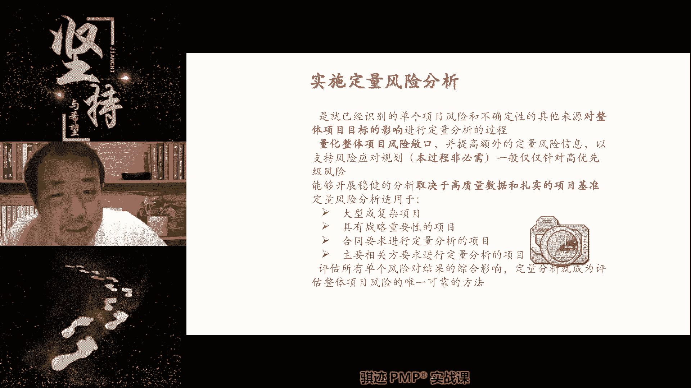
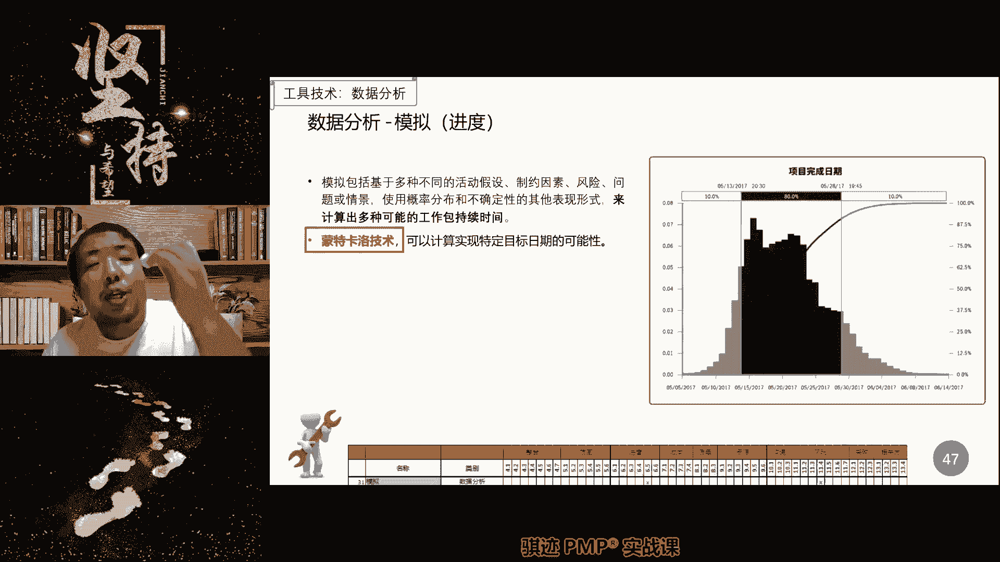
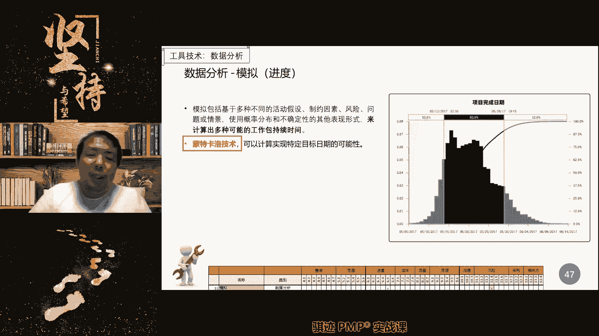
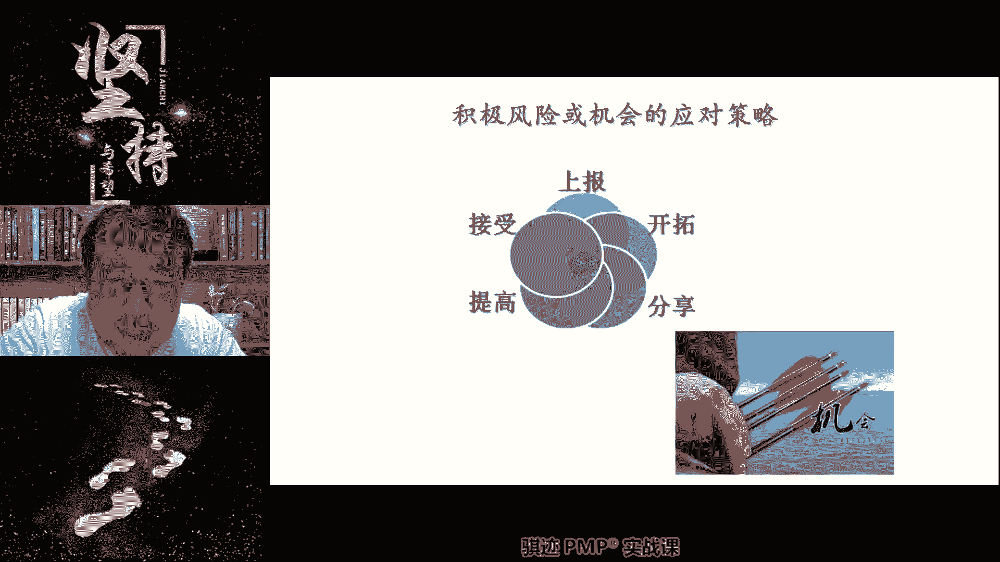
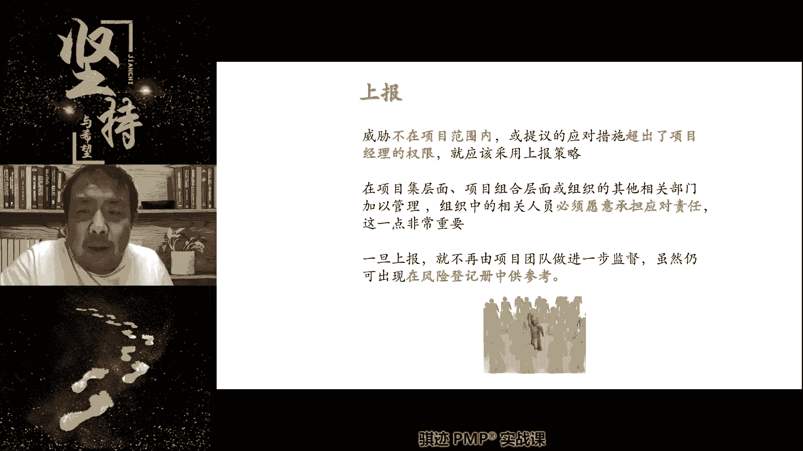
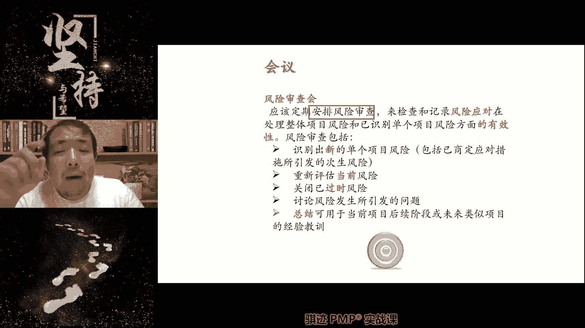
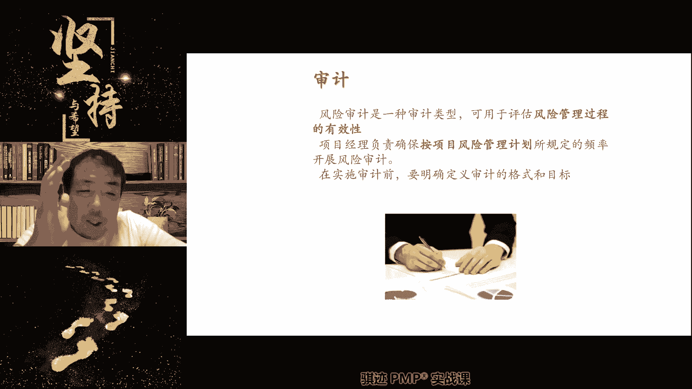

# PMP认证考试课程最新完整免费课程零基础一次通过项目管理PMP考试 - P79：PMBOK第七版 第二十章 裁减基本概念-2 - 骐迹PMP - BV1Sb4y1f7Yt

好同学们，Hello，同学们都回来了吗，好同学们都回来了吗，好回来了，扣个一啊，老规矩还是要扣个一，好群里发一下啊，继续上课啦，好那么我们继续啊，前面我们讲的定性分析，接下来我们讲定量分析。

定量分析呢不必须啊。

那么它要求什么大型复杂项目，要求合同要求的，然后分析不清楚的，那我们可能是什么，进行定量分析，不必须啊。

那么定量分析当中会有一些工具，可能稍微了解一下，那么定量分析的最最最大的表现性是什么，利用概率数理统计的方式进行分析啊，所以你考试当中看到什么，利用什么正态分布，利用三角分布对吧，利用公式。

利用模型进行分析，什么都是定量分析啊，那么我们利用S曲线进行分析呢，也是定量分析啊，S曲线也是一个定量分析的工具，它的学名叫做累积概率分布曲线，S曲线啊，这五好我们知道一下就行啊。

我们考试的时候知道一下就行，那么这个呢呃现在考的也少。

那么定量分析当中，我们会使用一个工具叫做蒙特卡洛分析，或者叫蒙特卡洛技术，这也是定量分析，什么叫蒙特卡洛啊，就是我呃，大家那个那个那个那个那个那个那个复制，这个什么什么什么联盟复联是复联吗。

那个就是那个那个呃那个那个那个是谁啊。

是神器模式啊，谁啊，就是事情重复重复重复不停的重复，然后看这个事情发生的概率对吧，它可以时间倒转啊，或者是啊重复不定，它各种各样的概率，就是我们将一个事情根据不同的情况，不停的进行重复重复重复重复重。

或者反复反复去进行模拟进行，然后看他的各种可能性，奇异博士是吧，我不看复联啊，我只知道这个事情就是重复100万次啊，那那么奇异博士对齐博士来说，他好像是说他重复了100万次。

才找到一次击败灭霸的方法对吧，那么他通过的这种方法就是蒙特卡洛。

然后他找到了1/1000000的概率，能够击败灭霸啊，对模拟各种概率，它模拟各种事情，这就是模拟啊，那么模拟可以达到什么效果啊，就是我们只会发生一次实践过程当中，工作当中只会发生一次。

但是我们可以用各种各样的技术，让它在模拟的环境当中发生，1000字，1万字，100万字，然后看可能性是多大，概率是多大，有可能的分布区间是什么，对吧，我们做这件事情，平均时间是10分钟，最快的是5分钟。

最慢的15分钟，这是什么，这是三角分布对吧，但是我们对它进行模拟，我们不用，我们不用啊，三角计算，因为三角计算是什么，它是一个根据事物均匀分布的一种推算，我们让这个事情，在模拟的环境当中进行100万次。

然后看他的真实平均时间是多少，然后算下来，他的真实平均时间差不多是7分钟啊。

那么我们可以通过蒙特卡罗得出，这个事情最有可能完成的时间是7分钟啊。

好，那么定量分析当中还有个工具叫做龙卷风图啊，龙卷风图是什么意思呢，就是我们将每一个风险，它的最大正面影响和最大负面影响合在一起，画在一个图上啊，我们用格子来画啊，用格子来画，用一个定量的格子来画。

然后从从高到低，把所有的风险从高到低排序，那么它在图上看上去就像一个龙卷风，龙卷风是不是上面大下面小啊，然后通过这样一个相对位置的排序，来判断哪些风险对项目有最大的潜在影响，这个就叫做龙卷风图啊。

那么如果你们不理解也没关系，你们记住，风险定量分析当中有一种工具叫做敏感性分析，那么它只有唯一一个工具图叫做龙卷风图，用于分析风险的最大潜在影响，和它的相对位置就可以了，好吧这个不多讲啊。

我那么风险分析当中还可以用决策树分析啊，那么这个分析讲多了，同学就晕了，尤其是决策树分析，决策树分析求是什么，概率累积和纯粹使用概率和它的影响，概率乘以影响，是不是其实就是风险敞口啊，对吧。

我前面讲过概率乘以影响就是风险敞口，根据不同路径的风险敞口，来判断哪一个路是最赚钱的，就选哪一个啊，这个就叫做决策树分析，那么就举个给你们举个例子好吧，我们投资A项目50%的概率呢赚100万。

50%的概率呢赔100万，我们投资B项目20%的概率呢赚1000万，80%的概率呢赔诶100万，那么问你们，我们应该投A项目还是应该投B项目，对吧，这就决策树分析，那么你算下来A项目它的概率累积和是零。

也就是说应该是不亏不赚，B项目20%的概率是赚1000万，那么它的概率的结合就是200，80%的概率是亏100万，100万乘以80%就是亏80万，合起来是多少，120万，所以应该选择B项啊。

但是现在因为不考计算题，你们就不用啊，你们反正就知道用这种方式来决定，到底选择哪种方案啊，选择哪种方案，这就是决策树分析，因为不同的决策的分析会决定了什么啊，我们项目的风险是真实风险水平啊。

你看上去好像A项A方A项目风险更低对吧，一半一半吧，风险更低对吧，但是其实B项目的风险反而更啊，风险反而更低，收益反而更高，为什么B项目虽然80%要亏钱，但是他一旦赚钱赚的更多，没有听懂这个例子啊。

再说一遍，这个其实很简单，A项目50%概率赚100万，50%概率亏100万，B项目20%概率赚1000万，80%概率亏100万，请问你选择哪个项目，只能选一个项目，你会选哪个项目。

是不是算一下B项目的赚钱，综合赚钱概率要比A项目高，对吧，这个就是决策树分析概率类集合是吧，OK啊，那么因为现在不考计算题了，这个以前会讲一讲，稍微再多讲一讲，因为这个会考计算，现在不考计算就算啊。

pass好，那么我们定量分析之后呢，就会形成风险报告的更新啊，我们会也会形成风险登记册的更新啊，但是他不一定不一定。

因为风险的定量分析不一定做啊，那么接下来就到了什么。

我们风险的第三步规划规划。

风险应对，就是有风险责任人来制定风险的应对计划。

那么风险的应对计划其实说穿了什么，趋利避害，如果害避不开，怎么办，两害相权取其轻。

两利相权取其中。

不确定性的表现形式就是概率啊。

概率啊，什么叫做不确定性，就是说它有多少概率是这样，有多少概念，那么当概率呈现出一个分布，它就是概率分布啊，手上的就是数学分布嘛，数学分布很多东西，有些东西不一定学过啊，像什么正态分布。

对数正态分布被那贝塔分布，泊松分布R分布，伽马分布啊，我以前读书的时候被折磨过啊，这个东西很烦，算起来很烦啊，还有高斯分布离散，高斯分布均匀分布啊，其实就是分布啊，可那么概率呢就是怎么样呢。

就是说不是概率，就是风险应对呢就是什么两还是强调句，就是说它的基本原则是什么，两害相权啊，就说趋利避害，如果害避不开怎么办，两害相权取其精，那么同样的一句话，两利相权取其重对吧，有转不转是猪头对吧。

差不多就是这样一个主导思想啊，那么风险的应对过程当中呢，应该是什么，越优先级高的风险管理应该越细，投入的资金也越多啊，重点管理重点投入基本上是这样一个原则啊，而且要什么切实可行切实可行好。

那么注意啊，接下来的这个东西就比较难了，我们规划风险应对，整个风险应对计划是怎么组成的，这个在篇博客上一直写的不太清晰，那么我在这里给你们讲一遍啊，这里讲一遍书上，这是来自于书上拼搏和第六版的书上。

我先给你们讲一遍，整个项目在规划风险应对之后，我们对于每一个风险会有一个风险应对计划好，打在公屏上会有一个风险应对的总计划，这个总计划当中会有一个主要，应对方案，主要应对方案指的是什么。

当这个风险发生的时候，我们默认会采取的应对方案，那么比如说我们所处的地区长时间干旱，突然有一天啊。

我们觉得干了够久了，你看下雨了，突然有一天老天开眼哗下雨了，那么你的应对方案是什么，应对方案是什么，突然一天下雨了，你的应对方案是什么，水库南水库打伞接收，唉不要这么死板，我们就是论实践，我们的应对方。

我们先不讲策略，你你们讲的什么接受啊，什么答案呢，这是应对策略，我们讲应对方案，方案当然是渴了这么久了，家里早就没有水，大家快渴死，当然是拿出家里所有能盛水的缸啊，碗啊，瓢啊，盆啊。

全部拿到露天去接水啊，好不容易下一场水啊，你不知道下一场水什么时候在下，可能杠杆还会持续，中间就什么拿所有能接水的东西去接水，把家里所有能囤的水给它涂满对吧，这就是风险当发生，但这是个正面风险。

因为总算下雨了，这是个正面风险，当然是应该什么用接水，那么如果来了啊，那么如果在这个方案当中啊，注意如果在这个方案当中，如果出现了一些差意外，比如说你想把家里的钢水缸拿出来去接水啊。

搬到外面去发觉什么东西啊，你原来想的很好。

把水缸，马上把水缸挪到室外与最大的地方去接水，发觉这个水缸太重啊，我们家里人呢缺水，缺了很长时间，大家都没力气，可嘴嘴巴都很干了，搬不动那个水缸，那么怎么办，请问当我们的主要方案就是。

拿家里所有能接水的工具去接水的时候，发现水最主要的储水设备，水缸搬不动，挪不到室外，接不了水怎么办，抬头喝水啊，用人气出水是吧啊也行，但这个不是呃可以，这是一种这种方案呢，就是当主方案不行的时候。

有一个被方案，这种叫做弹回计划，那么应该制作方法是什么，称在雨下的时候，马上马拿家里的碗去接水，当碗装满的时候，拿碗把碗里的水倒进水缸里，再去接水，来回接，直到把水缸装满，然后再把碗装满。

或者把锅子装满，有个同学挖一个坑，挖坑，下面不都是泥吗，雨一停，是不是水都流光了是吧，哎挖大坑挖大坑，这个不现实啊，你临时挖这个不太现实啊，一般来说不太现实啊，对吧明白吧，所以虽然用碗去接水。

因为雨随时可能会停，看了很久，雨虽然是很很随时可能会停，但是你用小碗去接，然后再倒到水缸里，总比什么都没有好对吧，这个就叫做弹回计划，明白了吧，就是比主方案呢肯定是不如的，但是比什么都不做呢要好。

当主方案行不通的时候，水缸搬不动，那怎么办，我们就用晚间对吧，那么什么叫做硬应急计划。

注意啊，前面这个讲的叫做弹回计划，也叫做备选计划，备用计划对，就是这个意思吧，对plan b就是这个意思，plan b我们在应对风险的时候，肯定要plan a和plan b对吧，那么来了。

什么叫做应急计划，应急计划指的是什么，我们发觉马上要下雨了，当有充分的预警信号，下雨的预警信号什么，天上乌云密布，乌云密布，但是没有下雨，你不知道会不会下雨，但是天上乌云密布，很有可能会下雨。

这个时候应该怎么办，马上就把家里所有能接水的碗，瓢盆锅和缸全都搬到室外来。

准备好，第一时间把所有的水接下来，有必要的话再把嘴张开啊对吧，所以应急计划指的是当风险还没有发生，但是有明确的预警信号即将发生的时候，我们就直接采取行动，不等它就直接发生了，等运动。

或许我们这里干旱了很久了，或许这场雨只下半个小时就停了，如果你没有使用应急计划，等到你把锅碗瓢盆都拿出来，雨停了，你又没有接到多少税。

你要在雨下之前就把锅碗瓢盆放在外面，雨一下就可以第一时间储存，尽可能多的水储存下来，因为你不知道下一场雨什么时候下对吧，所以当有预警信号，而风险并未实际发生的时候，我们就采取行动的这样一个计划。

叫做应急计划啊，应急计划这个英文应该叫CONTAGIPAD，应急计划更多的是用于什么，当有威胁出现的时候，我们防患于未然，啊就比如说什么外面我们讲正常情况，外面乌云密布，马上要下雨了，那么你要出门。

但是你要出门，那你怎么办，换上胶鞋就是一个应急计划，虽然外面还没有下雨，但是你可以提前把胶鞋换上，万一下雨了，你的脚就不会被弄湿，对不对，穿上胶鞋就是一句话，那么你的应对主计划是什么，应对主计划是十。

是随身带一把雨伞，万一下雨了，雨伞直接打开对吧，为什么有没有人很傻的，什么雨没有下就直接打把伞出去啊，没有，除了妹子什么她是防晒的紫外线伞以外，普通人没有什么外面不下雨就打完伞了，没有这种对吧。

除了妹子要防晒啊，所以伞打开一般都是什么，打开伞一般什么是主计划，因为外面下雨了，要防雨，把伞打开对吧，那么伞上如果有个漏洞怎么办啊，就要执行弹回计划，那他会叫什么，我先不走了，找一个屋檐。

找一个商店先躲雨，等到雨过去了再走，虽然我不能前进了，但是我也不具备淋湿，这个就是下雨的弹回计划啊，好有同学总结很好，应急计划就是风险行业发生即将发生的时候，怎么谈，会计划就是已经发生。

但是主计划失效的时候，对这个东西的非常好啊，所以你明白了吧，这些所谓的谈回计划，应急计划和主计划，都是风险应对计划的组成部分，所以现在知道规划风险的。

风险应对计划是怎么样的吧，就是怎么规划啊，他应该包含主计划，弹回计划，如果呃如果有预警信号和征兆的，还应该规划应急计划，如果没有，就算有些事情是没有征兆的对吧，晚上你们的前辈们还在看啥成绩啊，紧张死好。

那么再讲两个概念，是两种类型的风险，注意啊，有一种风险叫做次生风险，有一种风险叫做残余风险，这个要注意啊，什么叫做刺身风险，不是那个海鲜的刺身啊，刺身风险指的是什么，因为我应对风险而产生的另外一种风险。

我给你们以前同学总结什么，因为应对A而产生的一个B风险，比如说为了应对感冒的这样一种风险发生，我们最近是不是天热了对吧，大家吹空调，空调吹多容易感冒吧，感冒了就要吃感冒药，吃感冒药是不是一种风险。

应对计划，应对措施啊，是的，但是吃感冒药有什么次生风险，是干嘛，有什么词性模型，对药物过敏嗜睡瞌睡，这都是什么，应对一个风险而产生的另外一个风险，因为不一定会过敏，也不一定一定会嗜睡。

但是会有这样的可能性，这就叫做次性风险，如果不应对，就不会发生，不吃感冒药就不会瞌睡，也不会有什么药物共鸣，明白了吧啊，副作用对副作用其实就是一种次生风险啊，副作用都是一种次生风险。

因为你不吃药就不会用啊，那么什么叫做残余风险，为了应对一个风险，而不是一味的应对啊，应对完一个风险之后，他仍然有可能下次再发生这个风险，但一般来说再次发生概率降低啊，影响减小，这个就叫做残余风险啊。

残余风险。

就像老师的手不小心肌腱断裂了对吧，然后做了手术吃了苦头对吧，那么这个就是风险应对对吧，发生了一些未预料的事情啊，进行风险应对了，那么应对完成之后，下次有没有可能再发生啊。

有这个这个下次再发生的概率和影响，就是残余风险，还是有可能会再次受伤，但是我们有了这一次的教训，下一次再发生的可能性就降低了啊，老师以后会很小心保护双手啊。

这个就是什么残余风险，明白了风险当中我们会有两两种衍生的风险，一个叫次生风险，一个叫做残余风险啊，你就考试的时候，有可能有可能会考到这个概念啊，好，这是我们风险应对的，什么计划当中的一些专业词语啊。

那么接下来我们就会开始讲什么。

风险的应对策略，它分为积极的和消极的啊，首先先讲消极的，消极的风险应对策略分为五种，一种是第一种是上报啊。

这是拼搏和第六版，新增的第六啊，第六版新增的第七版仍然有什么叫做上报。

上报指的是风险不在受项目经，而不是项目经理能管得了的，或者项目经理的权限和能力，超出了这个事情的控制程度，超出了项目经理的范围，或者把不属于本项目，但是可能是项目经理偶然发现了，别的项目有风险。

这个时候你就应该使用上报，上报的英文叫escalate，就是告诉上级，我有这样一个负面的可能性存在，但是呢这个事情我管不了，hold不住了，哎有同学说的其实也有道理。

很多时候项目中当你真的hold不住了，但是又很重要的时候呢，你要上报项目经理，商报一般上报给谁啊，发起人和公司高层上报了之后呢，由发起人和公司高层来决定，这个事情怎么处理啊。

对有时候上报也会上报给项目及项目组合啊，这个取决于商贸关系管理关系啊，凡是大家，但是请记住，一旦上报了项目经理和项目内就不再管了啊，就不再管了，不管了啊，问题上交啊，但是呢一般来说。

我们不会轻易选择问题上交对吧，中国人一句话对吧，矛盾不上交对吧，自己尽可能消化解决，但是这句话其实是错的，因为有些时候自己解决，付出的代价和成本要比上报之后去解决要高啊。

我们是我们之前讲过哪些情况是不能上报的，你项目经理自己搞不定资源，你项目经理自己搞不定项目的各种计划，规划设定，这种时候是不能上报，项目经理拿不到足够的资源对吧，这个不能上报，因为这是你的职责，对不对。

项目经理什么时候应该上报，我们之前讲什么时候应该上报给发钱啊，项目干不下去了，项目没钱了，项目遇到一个生死存亡的问题，这个时候上报被罚钱对吧，这就是上报。

第二种就是规避。

什么叫做规避，规避很简单，就是概率降到零啊，概率降到零，那么请记住规避的概率降到零，注意不考试的时候不要杠精接近于零，或者很接近零就可以了，不是说要绝对等于零啊，比如说我们考试什么实用性。

比如说我们的考试，就比如说这么表述，使用新的技术来改善我们的项目工艺，提高项目的质量，这个是啊，这个不是这个不是规避哈哈，另外一个就是开拓啊，规避什么，使用新技术来降低，比如说项目的质量缺陷概率啊。

那么这个时候呢就是规避了啊，但是我有同学说老师新技术一定绝对能，新技术比原来肯定能够降低，它是一个大概率的事件，并不是说一定是，但是是大概率的事件，那么你会是极大概率的事件，所以你就认为它是规避啊。

那么它是从根本上去消除威胁的来源了，概率比较降低的概率程度比较大，接近于发生接近于零，那么我们举个例子啊，规避我们举个例子啊，怎么规避偏偏考试不通过的可能性，pp考试不通过这种威胁，怎么样规避掉。

怎么规避pp考试不通过。

嗯啊王某同学啊。

说是刷题加上课不，你这个不是规避，你这个是开拓啊，我们后面会讲，这是正面积极的，负面的是规避，怎么样，你们说的这些都是正面积极的，规避呢，是在消极的条件下，怎么样把概率降到零，不去考试。

不报名考试就不会考试，不过嘿嘿嘿嘿，退的退的，这次不考，下次考，哈哈哈哈哈哈对了，明白这个意思吧，我们举个举个比较欢快的例子啊，就像就像比如说什么，有些男生叫胆小，不敢怕，不敢和女生表白，怕被拒绝。

怎么规避表白被拒绝的这样一件事情呢，那么很简单，你就不表白，玩暧昧就不会被人拒绝对吧，但是2500已经交完了，直接变成不成分，这是另外一回事情啊，啊开个玩笑，开个玩笑啊，那么我们常见的规避是什么，是啊。

延长进度计划，改变项目策略，缩小范围都可以啊，缩小范围是一种比较不好的规避策略，但是也能规避，比如说我们这个事情做不好怎么办，不做了，不做就不会错，所以这个是这个方法不太好，但是这是这是闺蜜啊。

明白了啊，这个大家可以查看啊。

第二种没办法降低概率，但是我们要采取应对怎么办，可以第二种方法，就像我们日常经常遇到是这样的啊，规避是消极的态度，积极对的啊，没问题，就是我们自己想想，如果这个事情注定要发生，不要发生在我身上就行。

我们身上就行，这种正所谓所列哇啊，死道友不死贫道对吧，有句话叫死道友不死贫道，这个就是转移，如果渡劫一定要有人被雷劈的话，请不要劈我劈旁边那位道友，这个就叫做转移。

就是将受到负面影响的后果由别人来承担啊。

那么这个时候呢。

通常要向别人呢支付一定的费用或者代价，比如说我们一起渡劫对吧，为了防止为了不让我被批，虽然我也会会有很大概率我也会被劈雷，那么怎么办呢，我们给旁边一起渡劫的道友，买一身全身的金属盔甲。

脑袋上弄一个高高的针对吧，然后那个雷劈下来的时候就有很大的概率呢，什么劈到隔壁到有被雷劈，仍然是什么会有这个概率发生的，但是呢劈不到我脑袋上就行了，P隔壁去对吧，这个就是转移啊。

我们还有什么常用的转移方法啊，买保险啊，请这种买保险是转移啊，为什么是转移啊，你买了保险就不会不出意外了吗，就不会不生病了吗，不是的，客观的概率仍然是一样，但是一旦发生这种不幸，这种苦痛的时候。

你的金钱损失可以由你承担，变为保险公司承担，所以保险尤其是什么社保，社会保险，社会工作保险啊，意外人身保险，这些保险都是帮你承担负面的金钱损失。

下一个是换一个。

OK这个是取决于能否降低概率，有很多的场景没有办法降低概率或者降低概率，非常不划算，那么我们就把这个责任转移给别人啊，还有什么可以外包外包也是一种转移，比如说我们干这个事情很有风险，那么我们自己不干。

外包给别人干，别人干也一样有风险，但是如果出了问题呢，别人承担啊，我们就不用承担责风险对吧，但是呢我们活给别人干，肯定要给别人赚钱，所以要付出相应的相当于对价，就是别人的利润，就是我们的风险对价。

所以某种程度上外包的利润就是一种风险对价，使用担保书，使用保证啊，这些都是风险转移概率不变，承受风险影响的主体从内部，注意我的描述啊，承担风险向的主体从内部转移到外部去，这是转移。

如果在外部和外部之间转呢。

这个不是转移，这个是减轻啊，后面会讲到。

哎我女儿又来了，不好意思啊，她又进镜头了呢，他又拿了一个，她又拿了一个小球球啊，不好意思，第三种是什么，我们没办法转移，也没有办法规避，我们只可能尽量降低，这个就是减减轻啊，这个就是减轻，洗澡了。

我在床上累满了，我给你啊，那么减轻我们通常是采用什么，那减轻需求，我们之前讲过减轻需求不明确，我们可以使用的方法就是原型开发，使用原型来减轻需求不明确，那么减轻什么错误率。

我们可以使用什么进行更多的测试，来减轻故障的交付率，不能减轻故障的发生率，但是可以减轻故障的什么交付率也是减轻对吧，然后减轻啊我们的什么我们的呃，错误的概率是什么，也可以使用复杂程度较低的流程对吧。

如果我们一个承包商做的不好，我们让另外一个承包商做也是一种风险减轻，但是如果选的不好，可能会越选越糟糕，这反而是风险上升啊，我们生活中有哪些例子是风险减轻的啊，风险减轻的啊，大家想看啊，还是养身体啊。

你觉得鼻子有点塞，鼻子有点痒，呼吸到有点不舒服，这是什么风险的前兆，感冒感冒的前兆对吧，那么感冒能不能规避掉很难，其实感冒很难被规避掉啊，这个病毒很厉害，交通方式，那么感对感冒这样一个负面风险。

我们怎么减轻啊，如果你觉得身体不舒服啊，然后呢鼻子比较塞啊，又有点头晕眼花，那么可能是赶忙着干嘛了吧，马上洗个热水澡，吃点感冒药，躲在被子里捂一身汗，不一定能够不感冒，但是可以把感冒的症状就是降低。

感冒的症状，就是它的影响，或者是感冒时期发生概率可以下降不少，所以当你要感冒的时候，当你要感冒的时候减轻，一般是在呃什么是发生了或者发生之前，或者是发生了，如果是发生之前呢，就是降低它的概率。

像我讲不讲啊，你觉得你要感冒了，还没有感冒，但是觉得人不舒服了，马上洗热水澡，然后喝热水，然后再让自己出汗，吃感冒药，这是降低概率，那么如果你真的是感冒了，已经流鼻涕，流眼泪咳嗽，感冒了不咳嗽了。

那么其之所找吃感冒药什么可以降低它的影响，虽然不能完全消除，但是可以帮助你们降低感冒对你们的啊，人的感受的影响，但是我所说的什么洗啊，洗热水澡武汉，然后是吃感冒药，并不能绝对保证你们不感冒。

或者感冒之后毫无感觉是没有办法保证对吧，但这个大家都知道吧，所以这些措施都是我们生活中的负面的，感冒风险的减轻措施，理解了吧，有些时候是没有办法的，为什么选择减，因为有些时候是没有办法转移。

也没有办法规避的，就像感冒这件事情，感冒这件事情能转移吧，没办法转移的，无论你是亿万富翁还是穷屌丝，当你要感冒的时候，你让让别人感冒，然后自己不感冒，有啊没有这种技术的，人类也没有这种技术的，对不对。

所以没有办法转移的，那能能不能规避啊，也没有办法规避的，人要感冒的时候，无论如何他都会感冒啊，再说一个冷知识，感冒药都是只能减轻症状，但是不能够什么不能够啊，消除病毒啊，感冒这个病毒这个东西呢。

无论细菌性的还是和和病毒性的病毒性，其实细菌性会更厉害，都是什么，感冒这个东西都是都是什么，都是靠人的，主要靠人的免疫力去消除的，所以你只能减轻症状，减轻概率而已，如果在优先可以选择和减轻的情况下。

对优先选择转呃呃这要看情况，因为转移还要付出代价，对项目管理来说，转移是要付出代价的，所以也不一定有人转移，比如说转移出去可能要付出代价更高，减轻呢可以让我们的损失啊没有那么大，可以接受。

那取决于你怎么权衡，OK啊，这就是不一定的啊，取决于项目的风险管理的取向，OK明白了。

好那么所以啊所以在负面风险的时候。

如果能选的情况下，我们肯定选择规避，但是选择转移还是减轻，取决于具体情况，一般来说都是属于具体用啊，题目会给你场景和设定的，题目会给你场景和设定，最后一种是接受接受呢，我们可以主动接受或者是被动接受。

什么叫做主动介绍，我有措施，但我不采取，什么是被动介绍，我没有任何措施，我只能不接受也得接受啊，不接受也得接受，对吧好，我们来分别举个例子啊，怎么接受，什么叫什么叫什么叫做接受啊。

比如说你是一个很有钱的人，那么对你来说啊，对你来说啊，啊你走在路上不小心掉了100块钱，比如说你是个亿万富翁，你不小心走在路上掉100块钱，是不是一种风险，负面风险也是，那么对于这个风险来说。

对你来说需要防范，不需要你需不需要花很多精力的，每天都要注意啊，钱都放放好，不要钱落在外面，钱掉下来，很可惜，对于你是亿万富翁来说，100块钱算个屁对吧，掉了就掉了，无所谓啊，就是一个矛，我有措施。

我也不惨重采取，因为什么对我来说毫无意义和价值，我关心的东西根本不在这个100块钱上面对吧。

另外一种叫做被动接受，什么叫做被动接受，你没有任何措施可以采取，你只能接受这个风险的发生啊，接受这个风险的发生，然后呢啊承受它的后果啊，那么就比如说嘛我一直说什么啊。

我一直说人这个这个这个动啊进化是不够彻底，人这个动物身上有很多东西和很多器官和功能，到了一定时间是一定会坏掉的，比如有个什么东西啊，眼睛每一个成年人到达一定年龄之后，一定会发生白内障。

但是什么时候发生发生的程度，每个人不一样啊，你们记住一点，成年人在70岁之后一定会发生白内障，这是人的眼睛构造的一个极限，眼的眼眼球的晶体啊，在用了70年之后，他一定会出现一定程度的浑浊啊。

就称之为啊白内障啊，那么现代医学已经很简单，会有措施可以去怎么开手术做，但是如果我们说如果啊在你生活在古代，你有办法去应对白内障吗，没有对不起，你只能接受这个现实，因为在古代没有换眼球晶体的手术情况下。

人是没有任何办法去对付这个白内障这个事情，所以你只能被动地接受，你在70岁之后，眼睛看得没有那么清楚，这样一个风险什么时候发生，不知道有些人可能60岁之后，60岁就开始有白内障。

甚至50几岁就有白内障都有，有些人可能到80几岁的白内障，这个是个风险，不确定什么时候发生，但是肯定会发生啊，你们记住这一点，但是现代医学就比较发达了，人有了白内障之后呢，可以去做手术。

把眼球晶体呢换一下就可以了啊，古代近视了怎么办，你就近视了，古代近视了还可以用镜片，这古代人真的是呃，尤其是比较近代一点的啊。

它可以引用玻璃镜片，就是现在像类似于现在眼镜的出现，可以用镜片看东西是可以的。

但是白内障是没有办法解决的，谁跟你说，古人活不到70岁啊，古人的平均市后命很低，为什么古人古代人的最大挑战是什么，小孩子在三岁之前的夭折率很高，将平均寿命拉低了，但是人一旦成年之后。

它的寿命比现代人短不了太多，所以70岁并不是一个什么人。

到60古来袭，并不是像那个说的这么稀罕。

古人70岁还是很多的啊，你们看。

古人到70岁以上还是很多的，古代一般不解释，所以这个就是接受，知道吧，一种是有措施，但不值得采取，一种是没有措施，只能来了这些事对吧。

好我们刚才讲的是什么消极的风险。

OK都明白了，接下去我们讲积极的风险，积极的风险当中也是有一个上报。

可像那个相对应的有机会，但是项目经理无权去把握。

或者不在本项目内出现机会，那么上报啊一样，另外一个开拓和就是规避相对应。

规避是负面降到零。

开拓是什么，出现几率升至100%。

那么这个时候就像前面我们很多同学讲的一样，是吧，通过PMP考试的概率上升到100%，他的方法是什么。

认真听课，好好刷题，掌握做题思路。

它的概率就会提升到非常接近于100%，它就是开头啊，当然也有一种方法的，开头是什么，找考查老师代考，但是这个是这个是违反职业道德。

好OK啊，开个玩笑啊，当然大家知道这也是一种开拓，明白了啊，开个玩笑而已。

那么我们讲到机会开拓的时候，它取决于什么东西啊，我们刚才讲的。

其实有些同学已经感受到了，我们讲威胁的时候，机会和威胁的时候，威胁都是负面语境。

开拓所代表的什么机会，都是什么正面语境，所以当这道题问的是风险应对策略的时候，你看他的语境语境是正面的，用机会的应对策略。

语境是负面的，用威胁应对策略，记住了吧，我再说一遍啊，语境是负面的，用威胁应对策略，语境是正面的，用机会应对策略，明白了吧，语境是负面的，用什么规避减轻转移啊，接受上报，语境是正面的呢，用开拓啊。

提高对吧啊，分享和接受对啊。

好那么开拓时将机会提升到100%对吧，那么比如说把组织内最有能力的人分配给项目，来缩短完工时间。

这个为什么是开团，因为最有能力的人，哪怕他缩短一天，他也是缩短，最有能力的人缩短一天，应该还是很有可能的吧。

所以这个开拓是极大概率的人，这个可能性是极大概率。

所以我们认为是开拓对吧，第二种是分享，分享是什么，和别人合作去获取收益，那么大家什么啊，五五开27K38开，对吧啊，讲到这里，我每次讲到那个那个那个让子弹飞申遗的，让子弹飞是吧，让乡绅先捐。

百姓就会跟着捐，乡绅捐的如数奉还，百姓捐的三七分账，这个就是分享啊，这个就是分享，那么这个分享是谁和谁分享啊，当官的和乡绅分享骗百姓的手艺，将应对机会的责任转嫁给第三方享有的机会。

使其相应的机会所带来的部分收益啊。

那么我们只要支付一定的风险费用啊，要把好处跟别人分享。

怎么才七成啊，什么七成三成乡绅拿七成，我们才拿三成啊，甚，那么分享包括什么，建立合伙关系，合作团队啊，建立特殊伙伴公司啊等等，这就不说了啊。

主播和榜一大哥哎呦，套路套路啊，好那么还有接下来是什么是提高，什么是提高啊，就和减轻是一样，提升发生的概率，但是不能保证一定保证或者提升效用，但是不能保证什么一定会出现，或者一定会做到最好啊。

所以什么是提高啊，考前三天突击刷题是能提高的啊，有同学问我老师，我考试考试之前实在太忙了，没空复习，只有考前三天，我明天请了假，能复习一下，我考试能通过吗，我说我不能保证你通过，但是你如果认真去刷题。

然后呢能够举一反三，学习能力比较强还是有可能的啊，这个叫做提高啊，那么还有什么叫提高啊，哎我跟你们说，老师有时候有时候老师明天就考试了。

我今天什么都没有复习过，怎么提高，明天就要考试了。

我今天什么都没有复习过问题了，沐浴更衣啊，求神拜佛，然后安心考，进入考场，为什么给自己一个良好的心理暗示，也能稍许提高通过的概率，不去考试，不去考试是不提高，不去考试直接放弃啊。

他不去考试就不会有好事情发生对吧，不去考就不会有好事发生，最后一个是接受。

接受呢也分为主动和被动，主动就是觉得什么这个事情太小了啊，我不值得我去做，就比如说我们还是一个有钱人，比如说你是个亿万富翁，地上掉了十块钱，你会去捡吗，我也去捡，你太有钱了，去捡十块钱。

这个功夫你可以赚更多的钱对吧，那么什么是被动接受啊，啊我们有一个很著名。

有一个很著名的成语叫什么守株待兔，守株待兔就是典型的被动接受机会对吧，因为兔子什么时候撞撞树上，你根本不知道，你只能在那边等待，这个你完全不能控制的机会出现对吧，这个是被动接受机会好。

那么这就是我们风险当中的，正面风险和负面风险的应对策略。

这些大家都学会了吗，来来我们停一下，学会的同学来公平，你要学会没有学会的同学，哪里没有清楚的，可以来马上来问我，分享有同学来问，分享是不是已经发生还是未发生，分享一般都是未发生，因为已经发生的事情。

你再去分享好像意义不大啊，当然这个具体看情况，这个可能没怎么没怎么往这个方向去考过啊，有问题可以问啊，有没有问题，好就没有问题的话，我们继续讲啊，那么今天时间关系我们风险应对策略。

这就不讲了啊，那么事后课后呢把这个PPT分享给大家。

这就不讲了，那么你自己去看一下啊，理解一下。

好，那么风险呢还会有一个很啰嗦的，整体风险应对策略，就是把正面和负面的合在一起，但是注意一点，大家发现什么东西没有了，没有上报风险的整体应对策略，为什么没有上报，因为对于风险的整体管理。

是项目经理不能推脱的职责，他不能给上报给上级管理，对于整体而言，项目经理要负最终责任，要自己来控制，个别风险是可能不在项目经理的管理范畴内的，但是整体风险一定是你自己把控的，所以不能上报，明白了吗。

要你自己去管理解决，所以整体风险应对策略没有上报。

除此之外跟我们前面讲的没啥大区别，大区别好。

那么我们这个就不讲了啊，那么我们之前在PBOX的第七版前面，我们的PPT其实也前面，在我们的跳过了那个之前的第七版的PPT。

其实也讲过风险的那个相关的那些概念对吧，风险应对贡献策略啊。

威胁也是规划上报转移接呃呃呃规避上报转移。

接受对吧，机会也是开拓上报分享，提高接受啊，可以啊，这些都是以第六版和第七版都是一样的啊。

那个只是描述顺序不同，但是其实内容是一样的啊，篇幅和第六版和第七表示一样。

这这部分概念是没有区别，那么风风险的规划和应对和应对的策略，在考试中也经常会考到啊。

我觉得应该是一定会考到，所以大家也明白，那么我们规划了风险，我们按照一呃特定风险的特定的应对策略，按照我们的我们前面讲的风险的什么主计划，弹回计划，应急计划，对吧啊，识别这个计划当中的残余风险。

次生风险等等，制定了风险的整个应对计划之后，我们就形成了风险登记册的第二次更新。

它里边就更新了风险的发生条件，征兆预警信号，我们应对的具体行动有哪些，是可以在有征兆的时候去启动的应急方案，应急计划有哪些是什么啊，我们在主方案执行不力的情况下，可以使用的弹回计划就是plan b。

有哪些可能是在执行当中，那执行之后呢产生的衍生风险，就是自身风险有哪些，可能在执行过程中仍然会存在的，原来的风险叫做参与风险，这些都会在风险登记自动更新。

这些概念我们前面都讲过了对吧。

好那么接下来就到了啊，最后第二个就是复议实施风险应对应对。

这个东西呢没什么好讲，但是我还是要讲一下，他前面点题就是什么，风险应对和问题解决应该走哪条路。

考试经常会考到这个这个方面啊，还是让我们思路讲。

如果有风险识别，有风险，我们前面已经讲过了，有风险应对措施，那么走风险应对的这条路，实施风险太大，如果没有识别或者有识别，但是没有规划风险应对措施的，走问题解决那条路。

听明白了吧，有同学公屏里给我总结一下吧，我再说一遍啊。

当有风险识别，有规划风险应对的时候。

我们走风险应对这条路，当没有风险识别或者是有风险识别，但是无风险应对措施的规划的时候，我们走问题解决这条路，清楚了吧，有同学PPT，到时候我会分享啊，这是我额外再加起来，我到时候在群里面分享一下啊。

明白，那么这个思路可以帮助大家在考试当中，区分选用哪条路，所以你考试的时候，如果看到有解决问题，首先看什么，它是不是已经是一个已经识别的风险，他有没有可能是有应对措施的，主要看这个能知道，然后选择这样。

因为如果走风险应对，那么就走风险的整个流程应对的措施啊，怎么应急计划应对就谈下去了，如果没有的话，那么走问题解决要干什么，要识别问题，分析问题根本原因，找出若干个解决方案，寻找最佳的解决方案。

然后去应对，在识别问题的时候还要干什么，识别这个问题的影响程度和影响范围对吧，我们前面讲突出细化一点啊，然后实施了我们认为最佳的风险应对方案，之后呢，还要去验证应对方案的有效性，这是问题解。

你觉得那条思路跟风险应对。

这条路可能就不一样对吧。

哎有同学总结的非常好啊，考试的时候记住这一点就不会错啊，那么这个点呢基本上也是必然会考到的，或多或少都必然会考到了。

提一提大家分数拿到手可能不错啊。

其他就没有什么好强调了啊，最后是监督风险。

监督风险里边呃，提到了一个什么东西啊，我们会对定期对风险进行审查。

在审查定期审查风险的时候。

我们会将一些已经不可能发生的，或者发生过不再会发生的风险，把它剔除出风险登记资，同时根据这一段时间的工作，我们零星偶然的，或者是不系统的去识别到的那些风险。

我们会登记到风险登记册，第三我们会对根据当前情况调整风险的优先级。

所以在风险审定期审查的时候，我们会识别新风险，风险定期审查的时候，我们会识别新风险。

调整风险优先级，关闭风险，关闭过时风险，这些都会去做，OK明白了好，这个就是什么风险的日常监管和审查啊，这是我们自己做的啊。

那么外我们前面讲了，外部对我们的风险管理要求就会体现在什么，对我们进行风险审计啊，根据企业的风险管理的规章制度啊，有很多企业里面会有什么啊，风险管理流程，风控风控，风险控制，管理流程。

那么审计就会根据行业规范。

企业规范，对我们的企业经营，和对我们的项目进行什么风险审计，看看是我们我们是不是遵循的规范啊。

好那么这是这是最后啊。

今天上课最后啊，还有两个东西啊，之前给大家一个这一页的总结啊。

这里大家可以截个屏看一下啊，这是一个小节，大家可以截个屏看一下。

好那么讲完了风险的识别啊，呃得得，分析啊识别分析啊，规划实施了之后，我们最后再回来讲不确定性，绩效就是对于风险管理的这个意义作用，风险管理我们最后讲一讲啊，在我们回到考试之上的更高的时间呢。

风险管理是除了范围进度成本之外，最为体验项目经理能力思路的一个领域啊，他的管理会与其他的绩效与和支持相呼应，包括什么测量，包括绩效，包括交付啊，所以风险管理的思路应用不同的项目管理形式。

预测性和敏捷性就不一样对吧，因不同的绩效益方面而有所变化，但是都是由项目经理负责，整体管理责任不可推脱的好，有同学还没说，来不及，来来来拍个拍个拍个照片。

来来拍个照片看看啊，我等会给你们继续讲吧。

等下再继续混啊，PPT我会相应的PPT会放出来。

是，啊OK明白了。

所以风险管理的好坏是什么，或者是他的他的工作内容是什么，了解我们的环境探索和确定应对不确不确定性，了解相互之间关联关系是吧，复杂性对吧，然后能够预测风险并解决后果，这句话第四条。

这句话很大程度上是先体现在项目经理，对于整体项目风险的把控能力和感知能力，这个要依靠经验，要依靠方法，要依靠工作态度去实施啊，是很体现你能力，所以我们一直讲一个优秀的项目经理。

他管理项目总是什么有各种意外情况。

但是项目总能平稳的做下来。

这是能力的体现，可能情况很复杂，波兰可能会很大，但是总能最终平稳的落地，这个背后看似有时候是巧合，是运气，是狗屎，但是它的背后一定是项目经理的能力体系，那么风险管理的最终结果一定是什么。

项目最终成功地交付了价值，没有受到各种风险的影响，交付了尽可能高的价值啊，同时利用机会进行改进啊，进行改进啊，能够降本增效，因为风险的管理当中，本身就含有一定的成本因素啊，风险就肯定要花费成本去应对。

当你风险管理良好。

风险的不确定就是不确定，绩效益的管理，良好结果之一是什么风险都被有效地应对完了，或者就根本没有发生，而你的储备使用是低于原来的计划，说明你管的实际管得好，这就是不确定性，绩效率的绩效体现点价值。

能交付的高风险，花费的能少啊。

影响尽可能低，或者没有，OK明白了好，这就是风险啊，就是不确定性绩效率的所有的相应的内容啊，相应的内容好，那么今天上课，不知不觉我们就来到了10。17分，那么我们今天就先讲到这里。

我们会有一些客户的不确定教育呃，绩效率的练习题，我们等到下节课上课再做，下节课上课，我们讲裁剪的绩效育的相应的啊内容好吧，我们这节课呢虽然我们讲要讲裁剪基本概念，但是我们还是先把风险相应的东西要讲。

讲细节讲实，那这部分东西对于大家考试还是建议好吧，所以我把内容历史改了一下，那么这节课的内容和标题呢，我会跟教务，明天我会跟教授讲，我把教务改一改，标题改为啊不确定性绩效率的二啊，下米米乘个七，好吧好。

那么这就是我们今天上课的所有内容，那么我们后天再见好吧，就是27号继续上课，好吧好，我们今天上课就上到这里吧，有点晚了，大家辛苦了。

拜拜。

老师每日一次的难度考试相比难度如何啊，基本差不多基本差不多，有些题目可能略微难一点，略微难一点。

