# PMP认证考试课程最新完整免费课程零基础一次通过项目管理PMP考试 - P8：PMBOK第六版 第四章项目整合管理-9 - 骐迹PMP - BV1Sb4y1f7Yt

啊你们是不是觉得胃部不适不适了，然后就觉得整个人都精神了，对吧啊啊我们开始上课啊，好我们第四章回顾一下第四章讲了哪些内容啊，第四章讲的是整合，那么整合当中我们讲的是哪些东西呢，整个讲的是项目经理。

关于整个项目在整体上进行统一协调，管理和进行运作的这样一个层次啊，所以整合讲的是项目经理说，和项目管理团队所工作的那个层次啊，他他是把具体的工作去粘合起来这样一个过程。

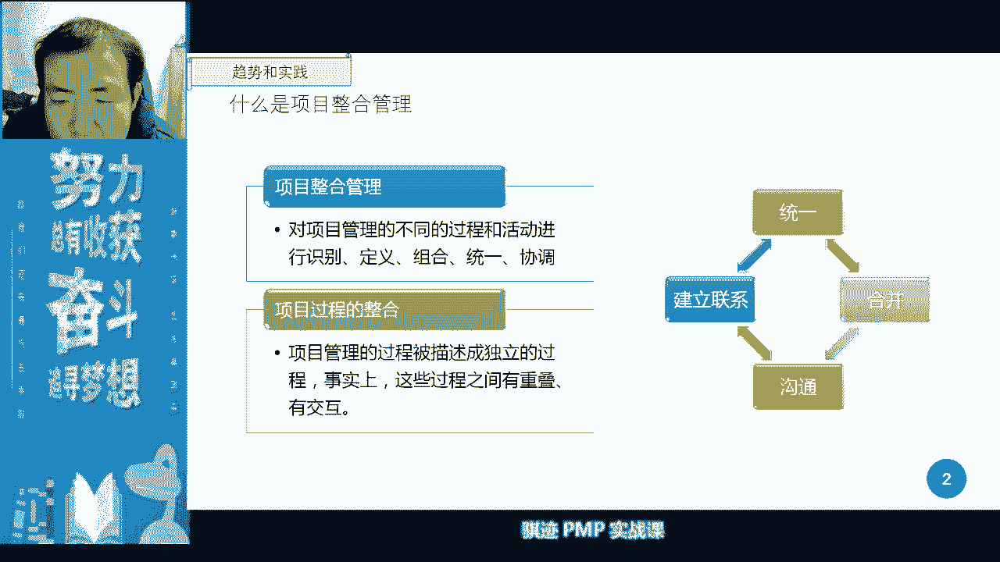

所以叫整合，那么我们将整合当整合当中呢，有一个很重要的原则，就是说整合的责任是由项目经理负责的，如果一个项目各个细分工作做的很好，但是不能捏在一起呢，项目经理是有责任的，而且这个责任呢不能被转移啊。

这时候我们回忆一下，啊这是整合当中的一些各个服区方法。

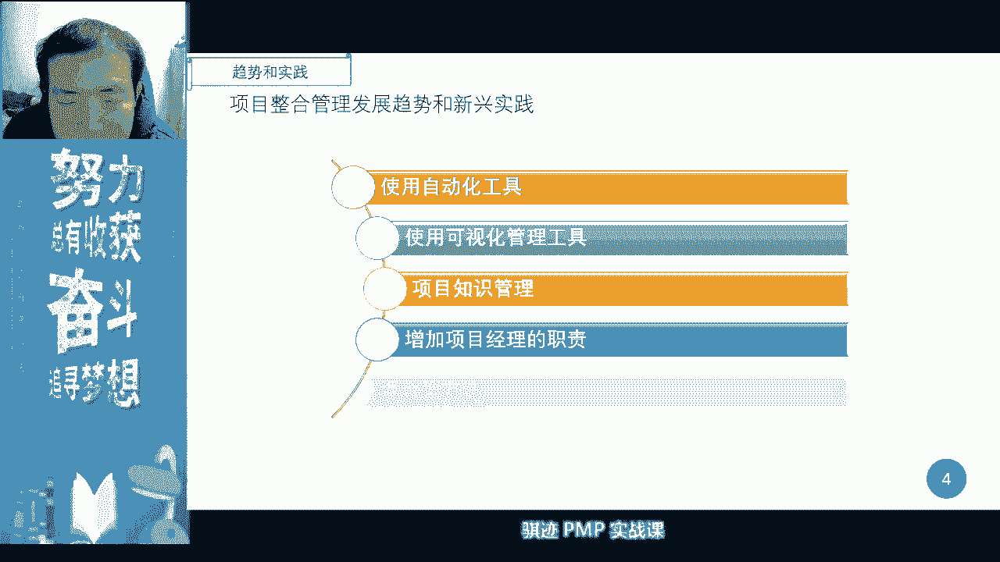

整合需要考虑哪些因素啊，一资源分配对吧，在整体上考虑资源分配，这是第一个，第二个考虑各种竞争性需求，所谓竞争性需求就是项目当中，各个地方都会有我们的各种竞争对吧，啊方法的竞争啊。

甚至人的观点的竞争啊等等这些东西啊，这些东西呢都需要项目经理去平衡啊，一般来说核心你是比较好的方案对吧，当然有各种各样的方法，然后呢项目经理要考虑各种备选方案对吧，就是拍a plan b对吧。

要有要有后手做项目，一定要有很多关系，尤其是关键的地方要有后手，没有后手的话很容易翻车啊，很容易翻车，第四个呢要为实现项目目标要裁剪，那么就是项目当中做什么不重什么的，最终目的是什么。

为了项目目标能够成功啊，这是我们的最大目的，第五个呢是管理各个相互之间的依赖关系，对吧，我们讲了啊，做不同的事情会有依赖关系，有些呢会相互之间进行配合，有些人会相互之间产生抵触。

所以我们要整理好他们的关系，让项目呢能够以最有效的形式开展啊，那么这是我们讲的这开开场的内容，然后我们讲了一个可交付成果的阶梯，在整个可交付成果的生命周期当中呢，它会有先从范围，先从需求。

其实开始需求呢会变成范围，我们说定义范围啊，这里注意大家看到吧，范围是怎么被定义的，大家看到了，范围的定义是在定义范围，这个我们范围管理当中去定义的啊，项目章程当中在后面看到。

从来没有说是定在项目章程当中，定义方他只是描写了高层次的描写，描述了高层次的范围啊，可能范围内容高层次的，而且是描述，所以项目章程当中是什么是description。

而在定义范围当中呢是什么definition啊，所以这两个词要搞清楚这个定义范围，pmp考试有个特点，就是它的考试当中的词的用法，其实是有精确讲究的，我们来自于英文，英语和中文，中文不一样的地方。

区别之一就是英语在这个地方呢，它有很多用词的地方呢，会有很多很精确的用法啊，当然虽然英文和法文相比，英文的多义词稍微多一点，但是西方语系的特点就是用词相对比较精确，学得比较精确，讲究精确表达啊。

所以先我们再回到这个可交付成果的这个话题，那么所以先有定义范围，有了范围说明书，项目范围说明书并不是项目最详细的范围定义，对吧，知道我们后面学了会，就知道最详细的范围定义呢是w bs。

是w b s形成的项目基准，然后呢有了，但是呢有了范围之后呢，啊注意这里其实并没有直接有，应该有了w bs之后才会去执行啊，这个ppt其实有点小瑕疵，但没关系，大家都知道的意思。

所以这个画的前面其实是画的，前面其实是有点多余，但没关系，但是我们从我们的我们的知识领域来看的话，指导和管理项目工作会生成可交付成果，可交付成果呢是我们各个知识领域捏在一起，或者结果，对吧啊。

我们上课讲，然后呢又通过什么两道关卡，第一道关卡呢叫做内部验收，就控制质量，控制量是自己按照我们的质量标准，验收标准呢进行内部核实，自己核实，核实完之后呢，就叫核实的可交付成果，然后呢再经过确认范围。

确认范围呢叫做外部验收，也叫客户验收，那么跟客户一起验，只要客户签字画押了，那么这个东西就成功的通过了，客户能够接受的啊标准啊，然后呢我们最终把这个东西呢移交给用户，把它放到用户的生产现场。

和他说的是呃，我们的各公共消费的现场等等一些啊生活现场，然后让他最终为用户产生价值，那么项目呢就结束了，这是可交付成果的一个阶梯过程，ok不知道大家我快速的一个回忆，大家都跟上了啊。

这个内容其实应该已经大家已经学会了啊，我只是帮帮助大家进行回忆啊。

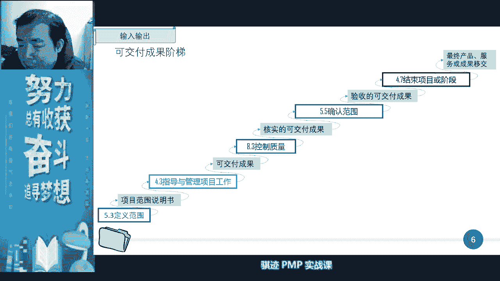

那么我们后面又学了一个叫工作绩效管理，和工作绩效的报告线对吧，那么什么叫做数据，就是单纯的客观的数字对吧，绩效信息呢就是有数据整理的是数据的集合，它中间会有整理和对比，什么叫计算绩效报告呢。

就是不仅用整理对比，还有分析，尤其是分析它的趋势，现在的趋势偏好偏坏和我们目标之间的差距，过去是怎么样的，现在是怎么样的，未来会怎么样和这些分析，所以这是工作绩效的，工作绩效的一些内容。

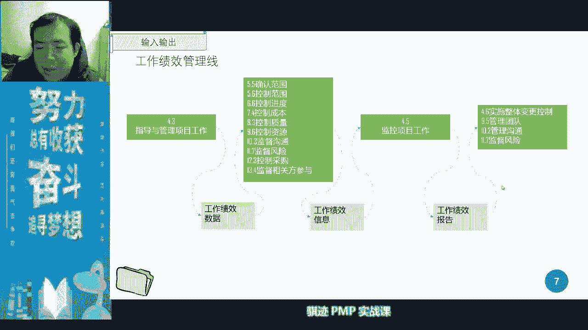

工作内容，对啊，然后变更变更我们今天会讲啊，变更我们今天就这里先图示消失看一下啊，我会后面给大家讲的比较详细。

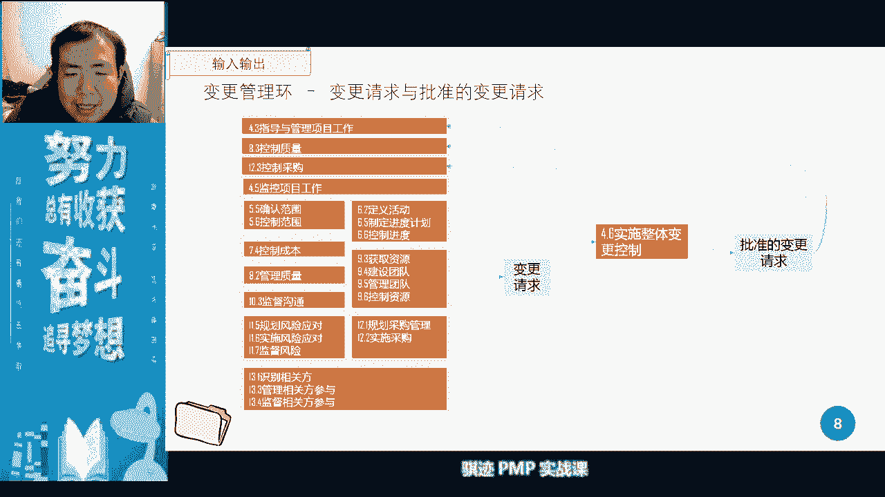

这就不讲了啊，这是篇博客当中的所有的过我们的过程啊。

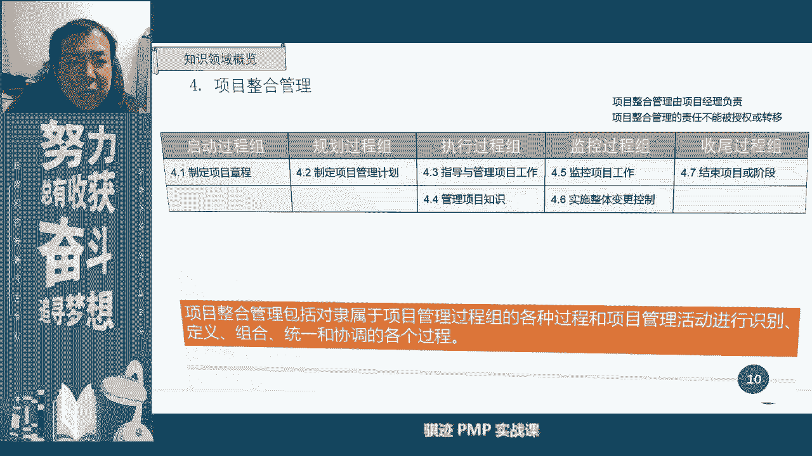

我们所有的过程，这些过程我们讲这些过程要求大家在啊，不是第五次课，就是最后一节课，最后一节课结束，这时候应该已经能够背出来，或者通过自己的推导，能够一个一个知识领域。

把十个知识领域的子过程全都推导出来对吧。

ok那么我们接下来就开始讲整合了，整合一共有七个子过程，七个子过程分别代表了项目经理，管理我们的五大过程组，以及管理项目知识和管理项目的整体变更啊。

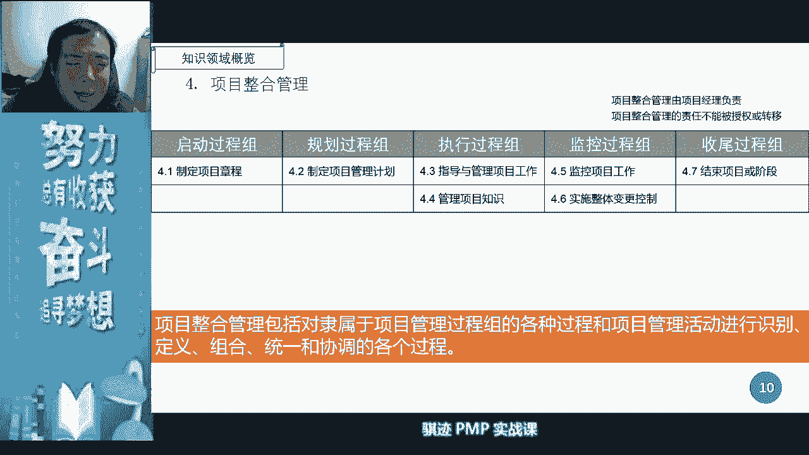

那么第一部分我们讲的是，第一部分讲的是什么呢，我们呢讲的是我们的这个就跳过了。

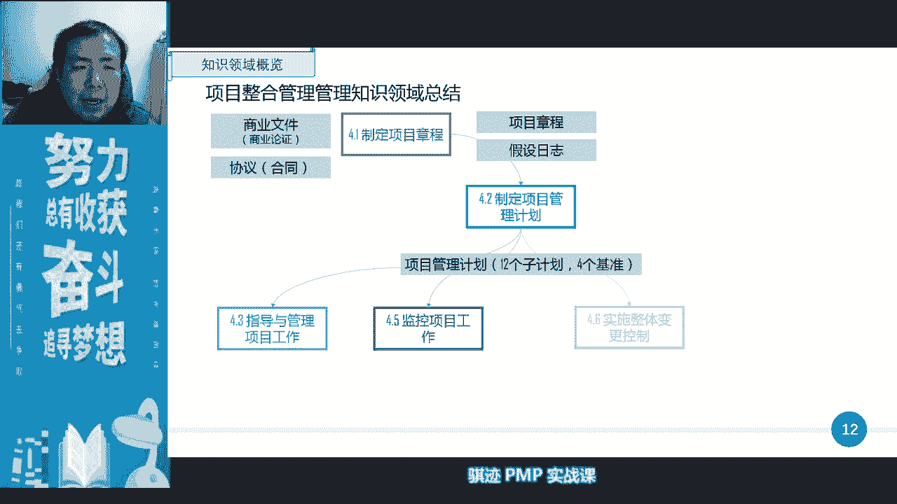

第一部分讲的是我们的项目章程。

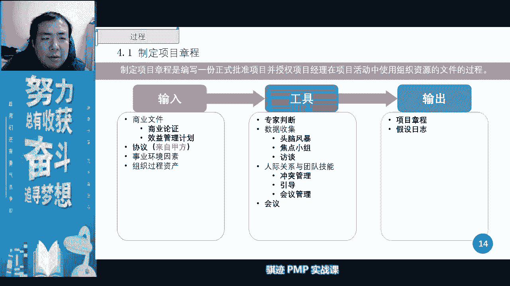

项目章程首先我们讲它有几个作用，第一个作用啊，我们回顾一下第一个作用，授权项目经理，第二呢正式确立项目的正式地位啊，第三呢，然后是授权项目经理开展，利用组织资源开展项目项目。

这项目章程呢是由商业论证之后所引入的啊。

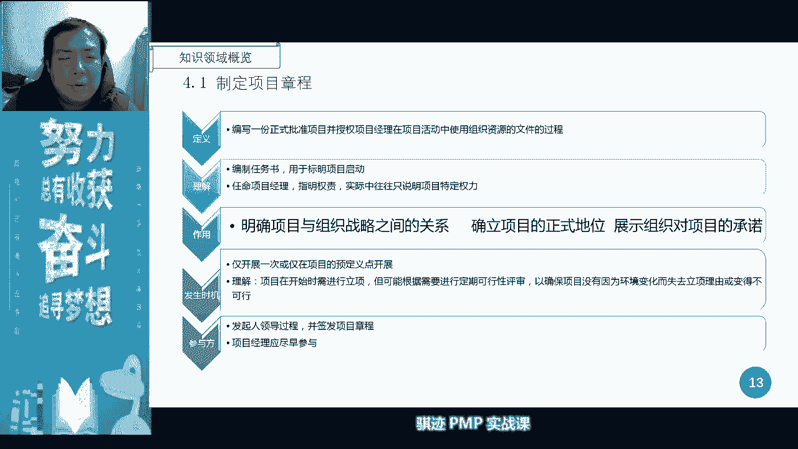

所引入的，那么我们建议啊项目经理呢，然后呃早期的去参与商业论证，至少参与一下项目章程，对我们了解项目呢是有好处的啊，这个项目当中当中呢，我们还会有一个特别的计划，叫效益管理计划。

所以效益管理计划有个特点，我们还记得吧，项目经理是无权制定和无权修改的啊，这个一定要注意，考试的时候，项目经理有权可以去改任何项目管理计划，可以去改，没有问题，有权利去改，但是啊当然要走变更流程。

但是项目经理一般无权去修改，不可以去修改效益管理计划，除非啊除非我们后面会讲到啊，出现了一些岔子，然后呢需要使用，比如说是我们的管理储备去解决了，有可能会使用的啊，修改这方面东西。

ok扫这个我们在后面再讲。

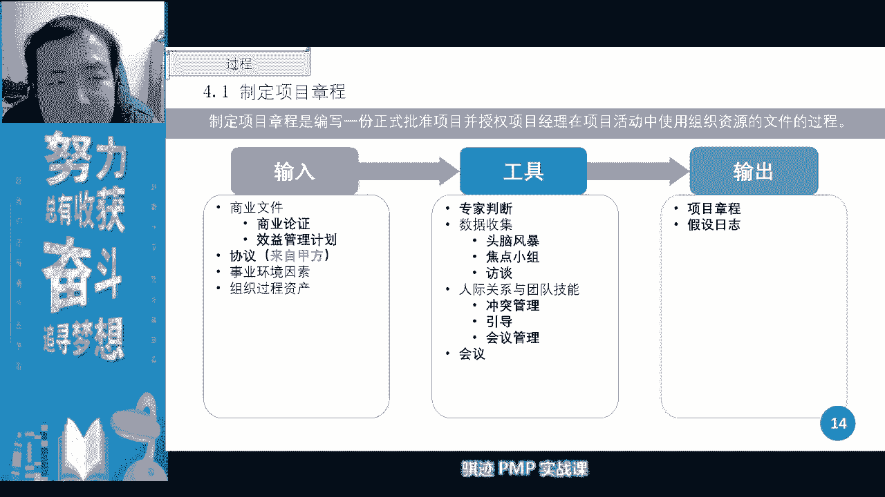

所以这是制定项目章程的一些输入，输出和工具啊，那么制定项目当中的工具呢，我们输入呢可以看到是商业文件，商业论证啊，我们将会用一些商业分析数据计算m p b i r。

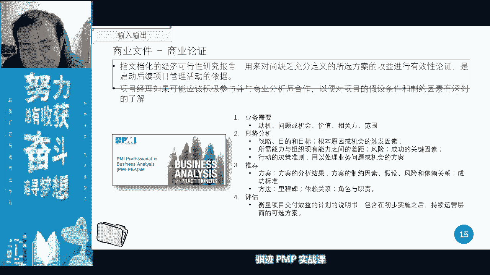

我们都已经学过了，对吧啊，快速回忆一下，快速回忆一下。

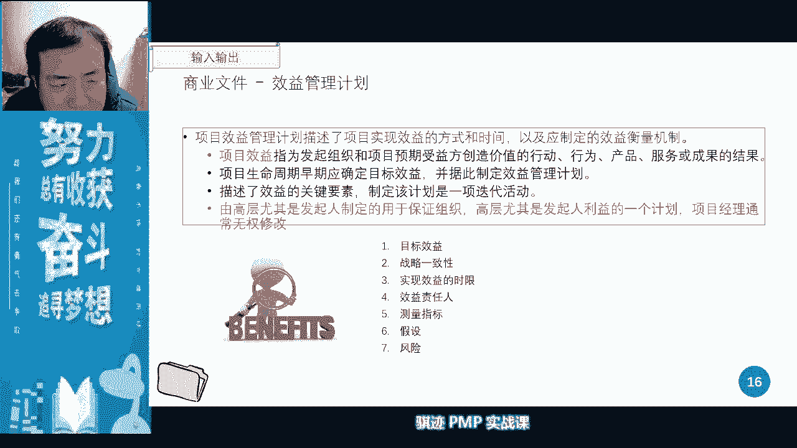

换做我一下，然后呢我们在数据收集当中呢。

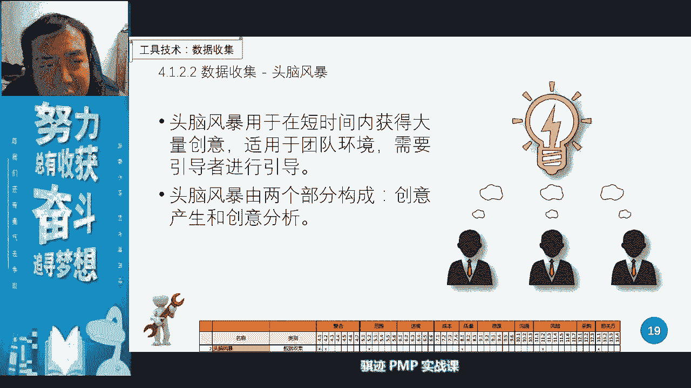

会使用头脑风暴对吧，bring storming就开脑洞对吧，开脑洞，然后呢会使用焦点小组给他举个例子，只要记记住，为什么里面打个鸡蛋呢，就来自于教练小组的啊，研究得出的结论啊，这是一个非常经典的例子。

然后访谈对吧，一对一啊，记住特征是一对一啊，考试当中只要看到是一对一的，这个工具就肯定是访谈，人际关系技能我们会在啊，我们会在管人资源管理当中当中的，管理团队会讲啊，这里就不讲了，引导技术啊。

这些就不得不讲，然后我们再看一下项目章程的定义啊，项目章程的定义当中可以看到啊，项目章程定义当中有什么东西啊，高层次需求的一种描述，看到吧，高层次需求的描述，但它肯定是描述，而不是一个定义啊。

它会定义不是定义啊，它会定义什么呢，项目的边界在哪里啊，什么做什么不做它的边界呢，但他不会去定义项目的具体范围，注意，所以考试，所以我们群里有一道题目问啊，这个东西它能不能定义是不能定义的啊。

不能定义范围的啊，这个要注意，那么项目章程里有什么什么都有，大家看看有什么没有了，理论上来说，项目教程里面什么都有，什么都有，但是呢什么东西都是高层次的啊，是高层次的，所以我们如果要查到具体信息。

我们更可以从各个项目文件和项目管理，交往里查，但是如果没有这种选项，没有类似的选项，那我们只能退而求其次，去其他项目章程啊，虽然它不够精确，啊有些同学啊纠结什么预先批准的供应商名单。

预先批准的财务资源这些东西啊，我们上次课也讲了啊，什么叫预先批准的呢，这叫这叫我们的合格供应商名单，白名单我们一般合作，我们在一个企业里面，一般和一个啊公司合作。

一般会优先看他是不是我们的白名单里的人啊，是我们的啊，长期合作伙伴，可信赖，合作伙伴，没有的话，我们才是外面供应商去选择，因为外面供应商选择没有打过交道，会有更多风险，所以这叫预先批准的和批准的区别啊。

就差一个玉字，注意就差一个玉字。

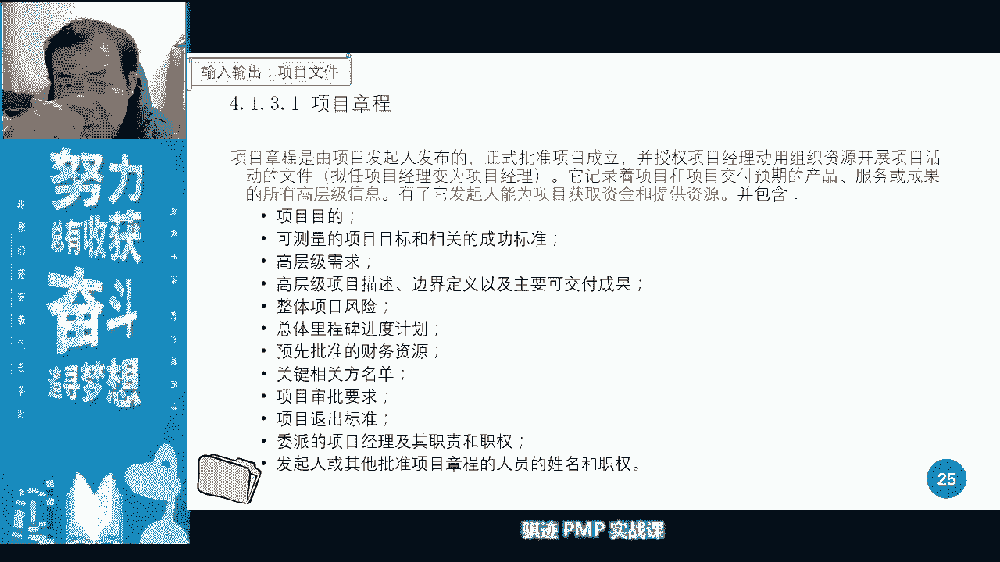

好这是项目章程的主要内容啊，啊这项目当中的样式，那么假设日志只要记住一点，它来自于商业文件，记录了我们的假设条件和制约因素就可以了。

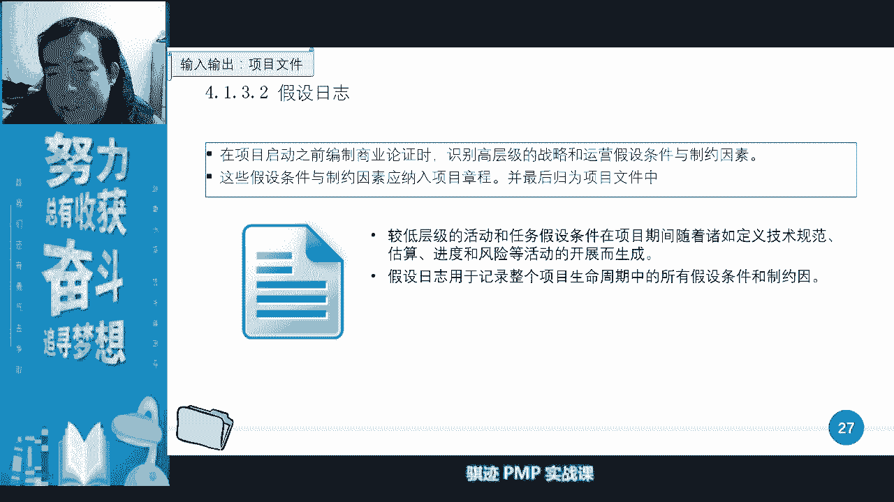

那么接下来制定管理计划，项目管理计划呢，一般来说啊有一道题目，同学们啊，然后同学有个同学说项目管理计划当中，是不是如果我们讲项目管理计划，是不是仅仅指那13个计划和三个基准啊，其实不是啊。

就是说考试当中注意一点啊，这个是现在还没有来东西，现在只连了200多个同学，有1万人没来啊，所以这1万人就听不到了啊，除非他回看，那么考试当中如果没有特别说明的话，一般我们认为项目管理计划的整套文件。

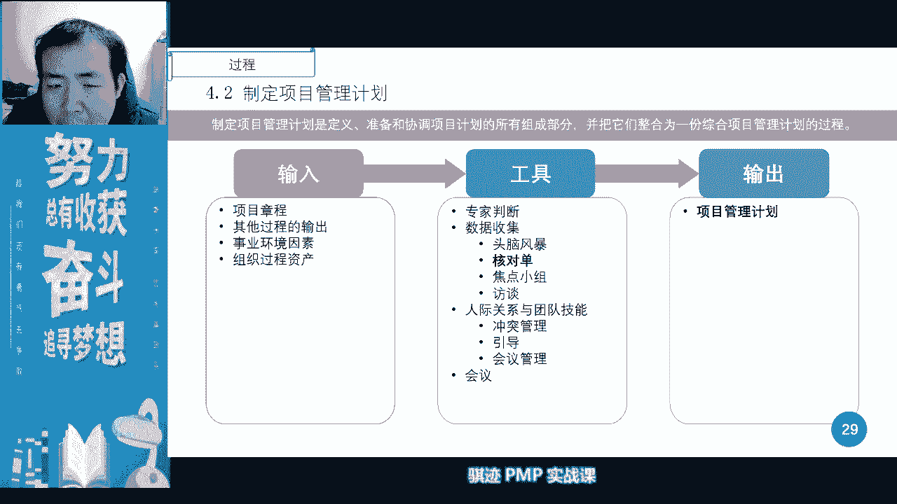

我给大家说一下啊，我们一般来说在我们讲项目管理计划的时候，我们如果想引用项目管理没有特别说明的话，如果出现右边这些项目文件，我们也认为它是整套项目管理计划，里面的一个组成部分，考试的话不用太过抠资源啊。

你说项目管理计划，但是他确实分文件和计划，那左边呢是方法论，主要左边主要是方法论和一些标准，右边那是具体的一些记录和一些工具啊，和工具结果诸如此类，所以呢考试的时候呢不要太过抠细节，这两方面要注意啊。

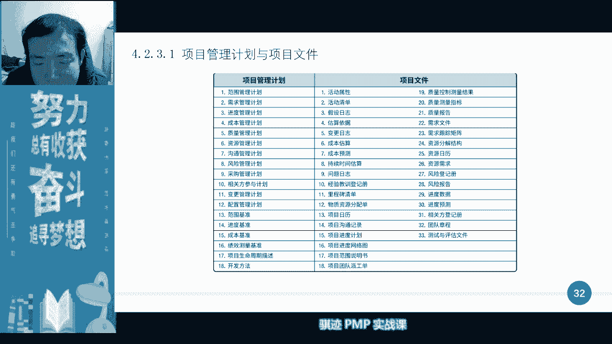

好那么我们在制定项目管理计划当中，就是把很多的东西呢工作都细化了，把所有东西都规划好了啊，都规划好，但是呢我们所说的规划好，也是要遵循一个原则啊，叫近期详细，远期粗略的叫渐进明细原则对吧。

所以也有可能是什么呢。

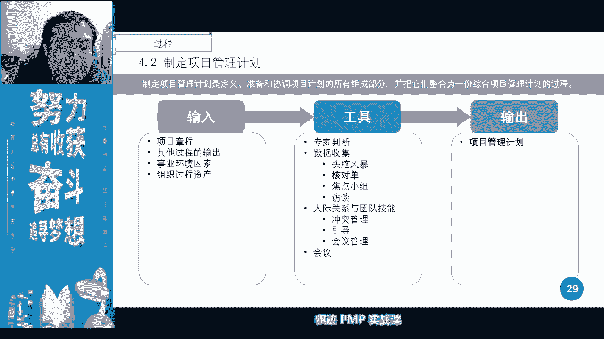

我们有项目管理计划，我们有这样一个管理计划，但是我们的项目文件当中的一些信息呢，可能并不那么的精确，它要通过未来慢慢去定一下啊。

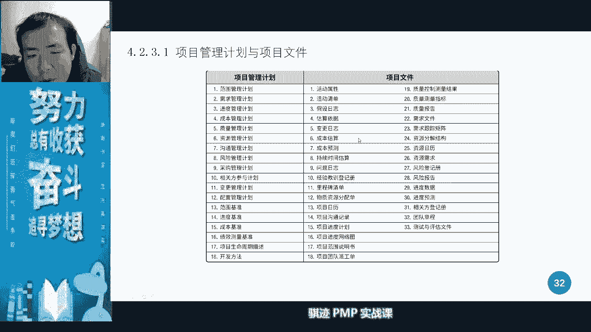

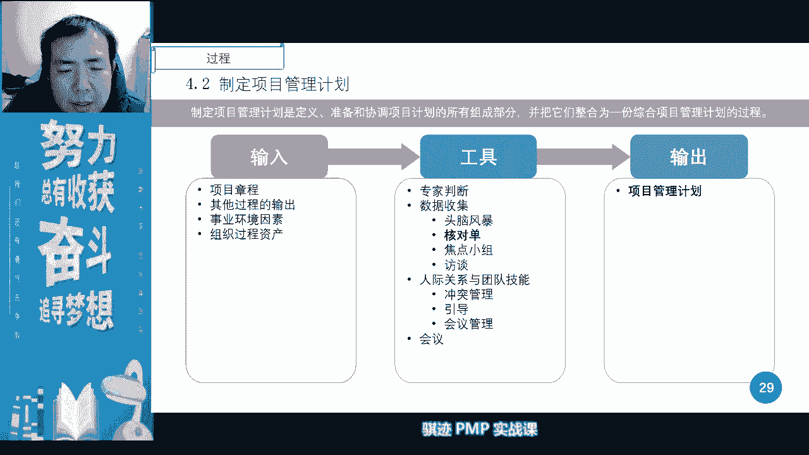

好这个注意啊，那么我们接下来要一个有一个回忆的，要记得是什么，我们的项目当中有个开工会，kick off meeting，这是在p m p书里面写的啊，有些里面也叫做开机会，我们实践的开机会啊。

要注意区别，kick off meeting，initial meeting，icebreak meeting，它的区别啊，initial meeting叫启动会，当年早年翻译的时候。

篇博客翻译的时候把qq of meeting翻译成启动会啊，这是不精确的，我们应该现在正正规的我们的正规军啊，我们的pm box的最新版把它翻译成开工会，他是在哪里做的呢，规划结束执行开始的时候做的啊。

这个特别要注意，规划结束，执行开始，所以如果我们考试当中遇到哪一个，是我们标志着我们的规划工作结束了啊，执行开始了呢，就是项目开一个kick off meeting啊。

所以也是很多项目准备开始正式动手了，他会召集kick off meeting，让大家坐下来熟悉一下啊，所以这个配置呢大家要slide呢。

不要忘记考试呢经常也会考这些东西，好我们继续快速回啊。

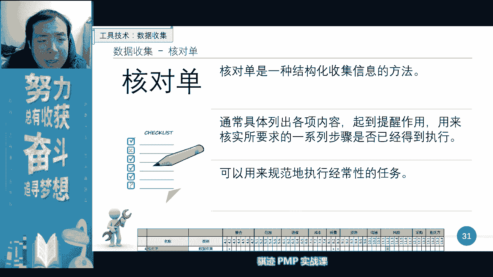

这是快速回忆，所以我就不会讲的很细了，明白了吧啊，顺便等一等那些啊，等一等那些啊，还没有上线呢，对吧啊。

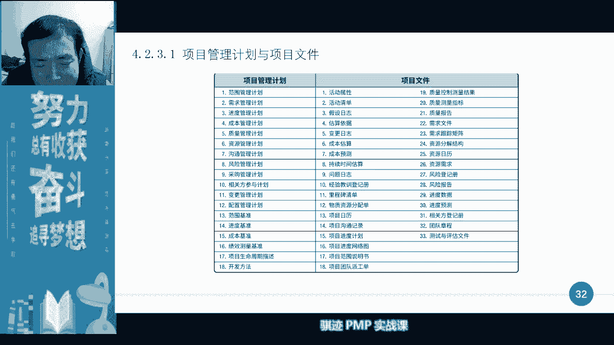

谢老师，您慢一点的，等一等你的，等一等你的学生对吧。

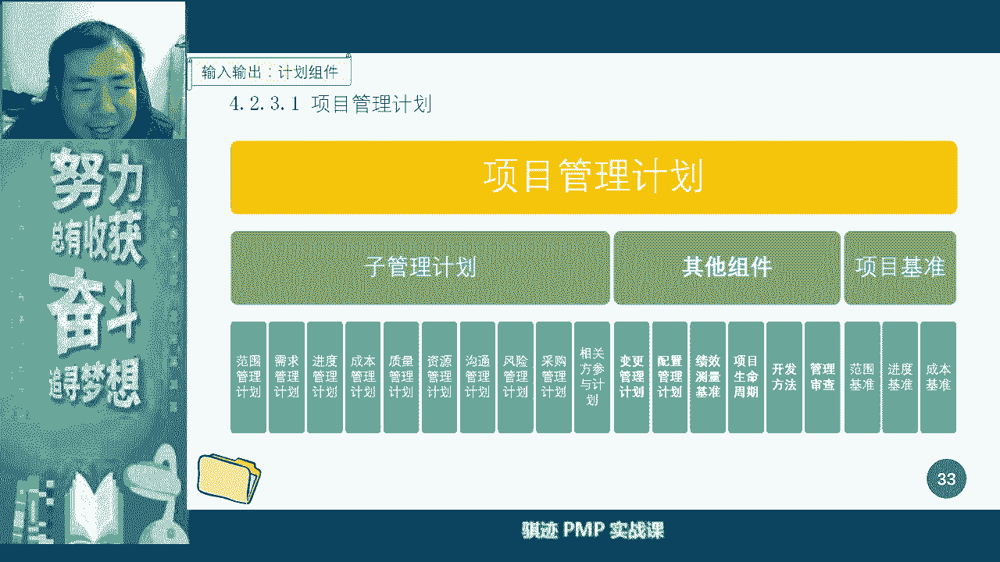

好，那么项目管理计划呢，里边呢还有其他组件变更管理计划。

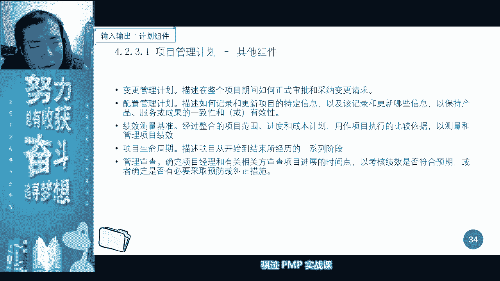

配置管理计划，绩效测量基准，项目征周期管理审查啊，会有一些这样的东西，那么我们计划做完了就开始吧，开始执行了对吧，执行当中有些同学们老师，我们执行当中为什么没有pmi啊。

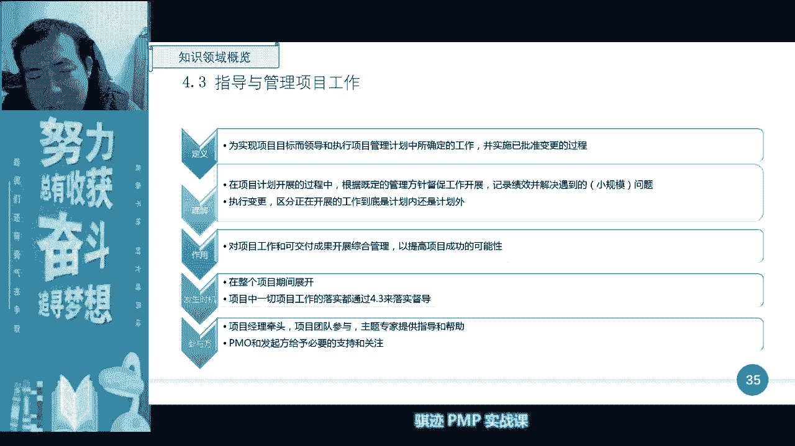

没有项目管理信息系统的工具呢，ok啊我们指导管理项目当中是有的啊，项目管理信息系统是有这个工具的啊，有的，但是其实还有很多其他的工具注意啊，所以篇博客有个特点，就是说它有时候并不会把所有的工具啊。

说说说啊，都罗列出来啊，都罗列出来，他有时候呢又会逗留啊，这是拼搏，不是有一个小问题，因为很多时候在实践当中，他确实不知道到底要多少东西，因为不同的项目千差万别太大，所以这个方面呢不用太过抠字眼。

但是凡是在我们的课上提到的那些工具，输入输出都是重点啊，我这里讲的很慢，所以你明白这是这是要注意的地方，凡是在我的课上提到过的，工具和输入输出都是重点，尤其是标我们着重黑色加深的对吧。

然后我上课里面标红的这些都是重点好，我们指导管理项目当中呢，我们就具体指导干活了，但指导干活，不同的项目指导干活差别太大了，对不对啊，可能是可以说，如果你把不同的项目放在一起说，如果去指导管理项目。

可能鸡同鸭讲，不同行业的项目经理，可能他都没有办法进行高额，在指导管理项目当中进行沟通交流，没办法，它只有一些通用的工具啊，通用的方法说说说是可以大家通用的，有共同语言的。

但是其他一些具体执行落地的环节，是没有共同语言的，没办法有共同语言啊，这要明白啊。

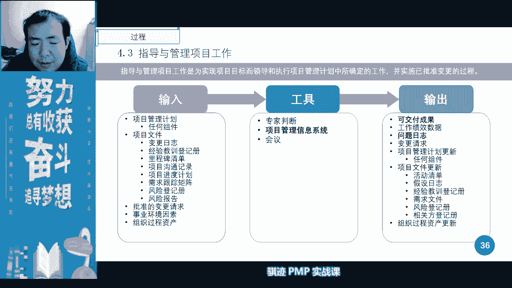

那么我们继续看回复啊，快速的回复，那么这个当中我们就讲了变更的四种类型啊，这个当中是非常重要的，一定要记住变更的哪四种类型，以及它们的定义，第一种叫纠正措施，我们是为了什么纠正偏差，提高绩效。

预防措施呢是为了预防风险啊，预防质量问题，缺陷补救呢是为了擦出现质量缺陷之后呢，进行补救，让它能够保持一致，最后的更新措施呢，一般反映我们新的需求或者需求的更改啊。

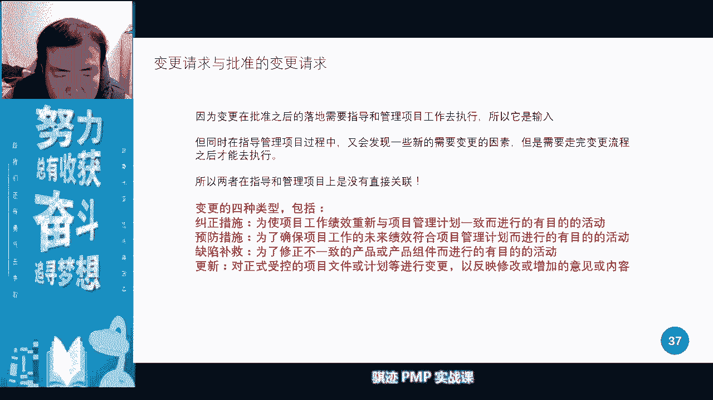

它适用于不同的环境，适应不同的环境啊，那么我们在pm里面有讲到，p m4 有哪几个功能啊，比如说提供我们的进度计划的管理，提供授权，提供配置管理，提供信息收集和发布，我们沟通也会讲到信息数据发布。

就是这种沟通对吧，沟通也会讲到p m s啊，我们会想到p m4 是一种什么沟通方式啊，拉式沟通自己去主动去取的啊，以及进入其他在线系统的界面啊，是我们一个登录界面，那么pm还有一个什么功能啊。

啊自动收集和汇报kpi，那么p m s还有一个什么功能呢，它不仅仅在项目管理战争，还在我们的项目治理当中，会用的就是po会使用到的组织过程，资产的归档和整理对吧，记得啊，那么提到这里呢。

因为就提到了镀金，提到镀金呢，我们就讲工作授权可以预防镀金，那么镀金和范围蔓延，也是项目管理p m p当中常考的知识点，虽然他考的不多，而且考出的都是送分题，但是送分千万不要变成送命啊。

那么记住镀金就是乙方主动讨好甲方，范围蔓延呢是甲方压榨乙方，他们的共同点是都没有走过正式的变更流程，也就是都没有正式的授权，但是不同的是一个主动位移乙方为甲方做，一个是甲方压迫乙方做啊，这是梁。

这是两个不同的方式方向啊，ok所以明白了，我这样一解释明白啊，考试千万一不要把镀金和范围蔓延搞起来，第2000万不要不知道什么意思，这一分就送给你了啊，就别送问题。

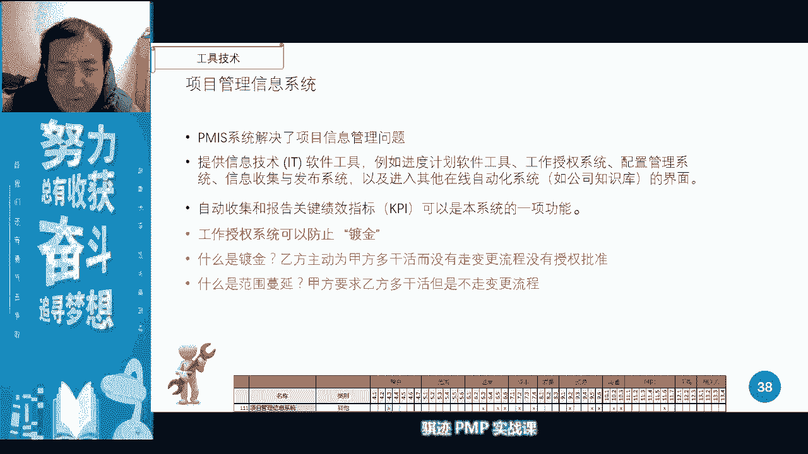

而不是送命题啊，好这里尤娜重复了一下，可交付成功，你们讲过就不再赘婿了啊，那么我们在项目的执行过程当中，会遇到各种各样的问题，就会进入到问题日志啊，如果发生了风险，也会进入到什么问题日志啊。

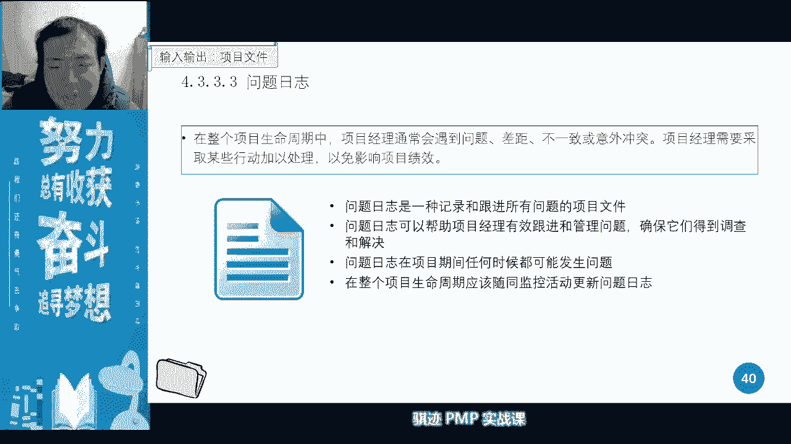

好接下来我们讲的是管理项目知识啊，回忆我们回忆一下管理项目知识，在管理管理项目知识当中，大家还记得吗。

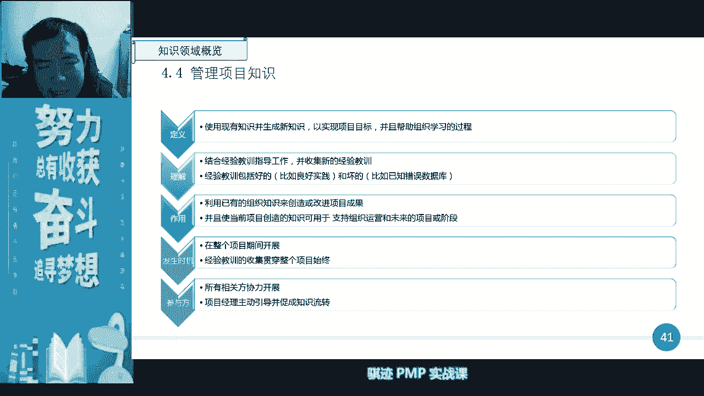

有哪些要点有你的要点啊，第一个要点是什么，考试经常喜欢考的是管理项目知识和培训，有什么区别。

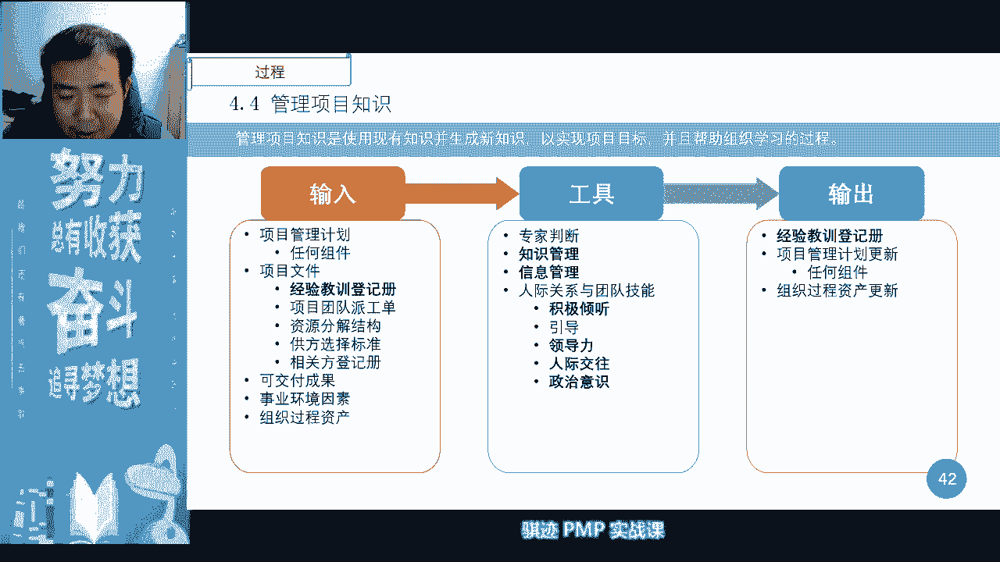

有区别啊，这是我帮大家大家强调的，管理项目知识是一种非正式的一种知识传授，它适合传授呢不能成文的那些东西，引进知识为主，所以它的形式在什么兴趣小组啊，开会啊，讨论啊，论坛啊啊互动式交流啊，座谈会啊。

沙龙这些东西都是非正式的啊，那么它一般是相互自我培训啊，相互自我培训，但是都是非正式而正式的培训呢，就像今天你们坐在电脑前对吧，脚翘在茶几上，然后拿了一个紫砂茶壶里面泡了一条好茶，非唾沫，然后来上课。

这叫正式培训啊，另外我是一个正式的啊，训练有素的讲师，所以我是正式培训给你们洗脑上pp明白了吧，好再强调一遍啊，考试这一道又是送分题，不要送分变送命啊，ok啊，那么正式培训呢它有一个正式社会过程。

希望我们先去上课对吧，所以讲第一节第一节课，第二节第三节课啊，是我们的天时地利，人和红门开始讲什么十大知识领域对吧，我们的知识分享呢它是没有套路的啊，有什么说什么，有时候他的表达会非常的粗浅粗鄙。

对吧啊，这也是项目经理需要管理和控制啊，好我们要知道什么是显性知识。

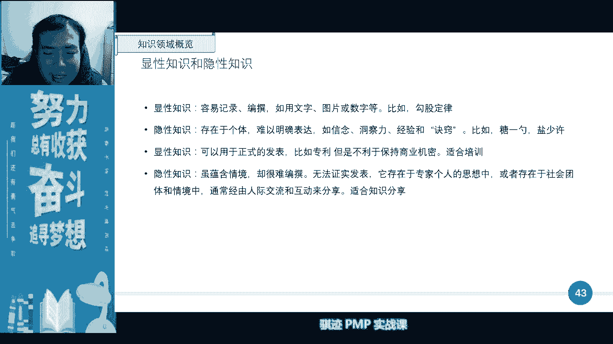

显性知识啊，当然这个考的不多，大家要知道，那么还有一个还有一个是什么呢。

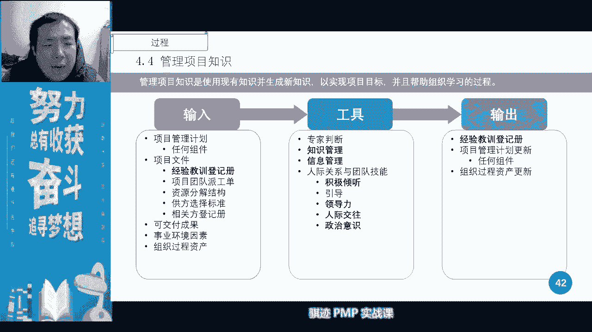

我们在管理项目知识当中呢，我们会运用到一个常用的工具叫做经验。

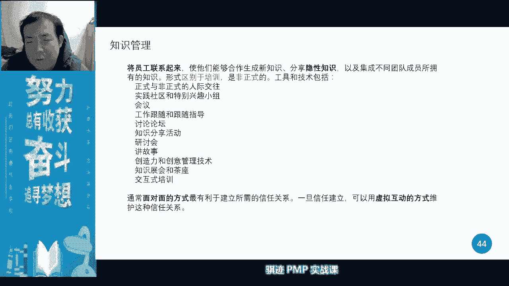

教学登记册，就是发生了任何可以总结的东西的，可以listen learn的东西的，我们都会把它记入到经验教训登记册啊，登记了之后呢，我们可以定期呢呢把它进行归档，归入我们的组织过程。

资产成为组织过程资产的一部分啊，这是很重要的，这个呢有时候也会考啊。

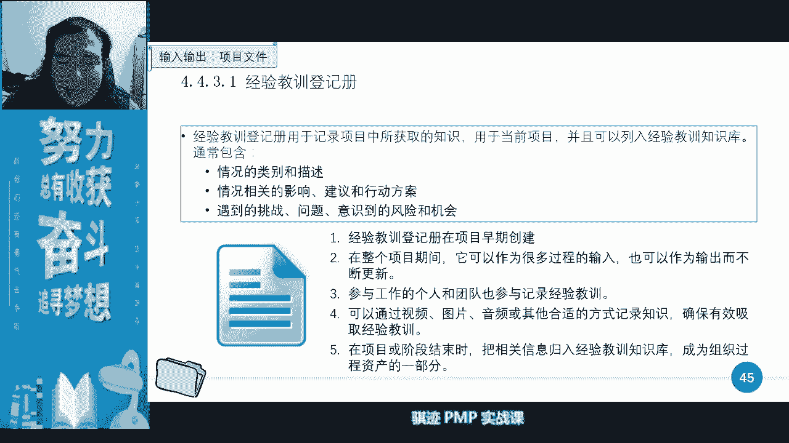

今天教训政策，这是我们知识管理的一些我们的要点要点。

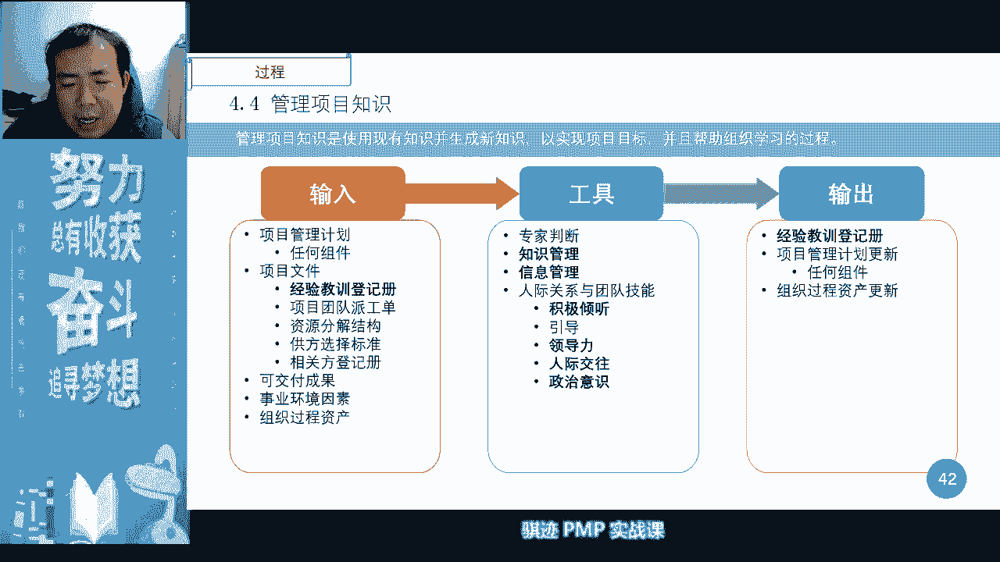

ok好，那么讲到知识管理这些要点之后呢，然后呢我们上节课讲到这里的课程就结束了，那么接下来我们就要开始讲今天的内容了啊，我不知道大家现在跟上了没有，现在直播是已经300个人了啊。

然后后面进来的100多个人，以及后面还要进来的啊，300个人啊，就失去了晚上现场live版的啊，我们的温故知新啊，那么我为什么要在这温故知，因为人的遗忘曲线是两周70%，是科学家说不是我说的啊。

两周遗忘70%，所以我帮你们温度一下，就可以把这个曲线永久的提高，所以经常会温故快速温故一下前面的知识点，有助于我们提高，当我们在课时有富裕的时候啊，好我们废话不多说，进入今天的内容。

我们讲今天讲的是第四个，我们讲的五大过程组的管理，五大过程组的第四个叫做监控项目工作，我们前面已经讲过几个过程组了，启动启动只做一件事情，做什么，项目章程规划规划只做一件事情是什么。

项目管理计划执行做很多事情，但是没办法描述，对吧啊，五大过程组当中，我们的监控和我们的收尾，是比较能够用一个方法论去描述出来，因为这是有一套啊理论方法体系的啊，一定方法体系，所以这方面呢是偏pmbok。

pmbok体系当中呢想描述的相对完整，因为有些东西确实像目千差万别，你没办法描述对吧，那么监控项目的意义干什么，跟踪审查报告我们项目的整体情况，以实现绩效过程，所以在监控过程当中。

监控项目工作这个过程当中，我们主要的是跟踪控制，跟踪和控制，并且对我们收集的信息予以正确的反馈啊，然后呢我们要理解归纳各个分析过，监控过程的结果做出一些综合性分析，提出一些调整意见。

然后呢还要让相关方知道啊，所以监控过程组的很多输出其实会交给什么啊，相关方管理啊，和沟通管理去做，让相关方知道，有时候呢别想问工作最重要的一个东西，就是从我们监控项目工作而出来的，项目绩效报告。

就是说随便你怎么管，只要你挣到钱，随便你买，有些企业就是这么管的啊，项目经理只要你保证这个项目挣钱的，或者保证这个项目按我们的计划完成的，达到多少利润率的，接下来随便你管啊，只要客户不投诉也啊。

这也是可以的，报告来技校报告看一下，有些组织呢更关心过程，可看清你是不是按照规矩去做事情啊，那不同组织不一样，但无论怎么样的组织，它都要依靠我们项目经理的监控项目工作，去获取项目的具体进展和情况。

这就是它的作用，让组织的相关方，外部的相关方，内部的相关方，都了解我们项目的未来的状态和当前的状态，以及它的偏差，那么那么在监控项目当中呢，我们会在整个项目过程当中开展，所以监控过程组。

尤其是项目经理的监控项目工作，这个是在整个项目周期开始的，是从我们项目项目章程的签署之后就开始，一直到项目团队解散，项目移交完成解散之后呢，然后才结束的啊，这一点要特别注意。

所以我们在管理项目当中监控是始终的啊，始终要保持一只眼去监视监视，那么这个过程中随时参与啊，项目经理和项目管理团队去参与pm呢，po呢会辅助辅助屏幕，怎么辅助啊。

他会给你项目经理各种各样的模板和监控方法，对吧，进行指导啊，这种pmo是什么类型啊对吧，支持性支持性，但是要求项目经理定期上报项目绩效报告，和项目的各种审计报告，那么这个pm是什么类型啊。

请在公屏上告诉我，这种要求项目经理必须定期上报，项目的绩效报告和项目的治理情况的报告的，这种pm是什么样的，pm，请在公屏上告诉我，好有些同学看到了三天不学啊啊上房揭瓦对吧，很好啊。

有些东西已经忘记了啊，指令型很好，非常好嗯，有些东西叫控制性嗯，非常好，有没有混合型啊，有没有说混合型的，好好注意啊，这种po是什么，是我们的控制型啊，指令性是直接下达的指令了啊，要项目怎么做了啊。

他这种篇目当中呢不想打指令，但是要求你呢始终符合项目的治理要求对吧，然后汇报状态，这种就是这种po呢是控制性，注意，还有说指定型的，当当当当，大量同学基础概念没问题，基本款啊，就像买车盖中盖版的啊。

基础款是什么，是我们的支持型干什么，提供各种样本，提供资源的来源，方向指引，提供经验教训，组织过程，资产提供这些一系列模板，这些东西是提供这些东西的，只是专程提供帮助的，这种cpm叫什么叫做支持型啊。

要求项目提供我们的报告，然后要求项目呢通过审计这样一些类型pmo呢，他的项目一定干涉的，不直接控制管理结果的呢叫控制型对吧啊，最后一个是什么指令行，指令型是直接下达指令，不要说啊啊前方小王啊。

这里这里不允许你站着，这就叫指令性对吧啊，直接下达耗时令叫指令性啊，我们刚才描述的那种情况，没有下次直接下达，号称只是向你提供报告来reporter to cc对吧，所以这是什么，这是控制型啊。

大家都忘记了对吧，服务型啊，天猫有服务性吗，没有啊，注意啊，有些东西已经迷糊了，对吧啊，服务型是领导力领导风格类型，有一个叫服务型啊，你们上课上火了啊，你记的知识点是很好的，你记错了啊，牛头不对马嘴。

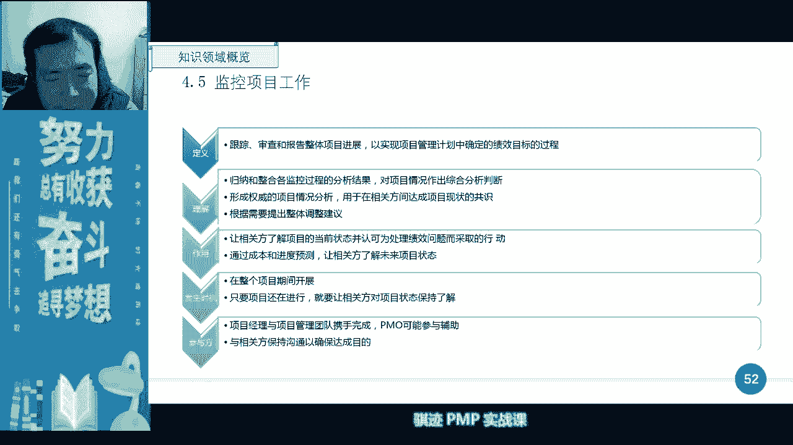

ok好，所以我上课的特点是什么呢，然后上到哪里呢，发现有关的知识呢，那么监控当中大家可以看到输入输出非常多，工具也非常多，要不要害怕，不用害怕，因为左边的you don't give some啊。

什么什么特对吧，s s叉叉t对吧啊，因为左边的东西就是所有的东西都罗列对吧，他唯一要值得注意的是什么东西啊，工作绩效信息啊，它会有一个逻辑链是什么，工作绩效信息，作为我们整体项目监控工作的一个输入。

被加工项目经理加工成工作绩效报告啊，那么在工作中，我们是不是把工作绩效信息加工作报告，所以项目的绩效报告谁写啊，项目经理写啊，当然有些项目经理居然要项目团队写啊，甚至有些叫工程师写。

这是一个比较不负责任的对吧啊，这是不对的啊，好我们等会会讲工作绩效报告的啊。

几种写法啊，这种写法，那么监控项目工作呢，就是指跟踪审查调整项目的进展，所以他有干涉动作，干涉动作确定绩效是我们的最重要的活动之一，我们要根据绩效来决定如何去跟踪，如何去调查，如果你分析趋势啊。

是这样的，以推动项目的持续改进和发展，啊有个同学说怕怕什么，不要怕啊，好好跟我学对吧，说错没有关系啊，同学们啊，这一点要注意，说错没有关系，你说了被纠正过来了，考试对了，那你就赚到了，你现在不说。

以为觉得自己对考试做错了对啊，要勇于的说，勇于的错，然后考试要正确的对就行。

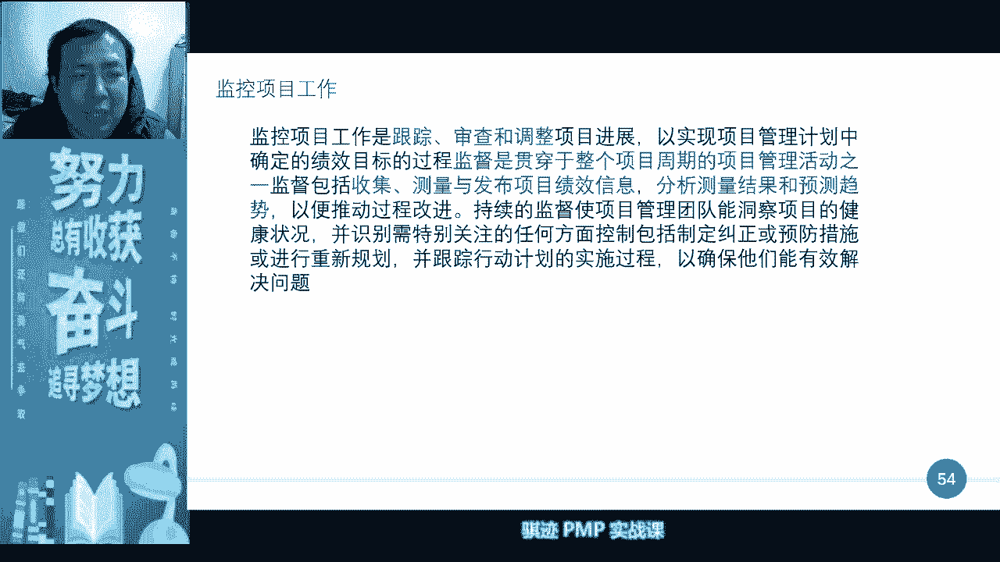

那么我们在监控项目工作当中呢，我们会使用哪些工具呢，备选方案分析对吧，然后分析哪种职业因素啊，这是我们常见的啊，我们可以有什么放a plane play b的，诸如此类啊。

自制外购决定也是一种备选方案对吧，然后成本效益分析啊，也是成本效益分析呢，就是说把我们可能的成本和预期收益放在，看看哪个成本效应呢，最高啊，能赚最多的钱啊，怎么赚能赚最多的钱。

政治分析我们会在成本的一张奖啊，这是一个非常大的内容，在正值我们稍微提一下，在成本那章成本那那堂课啊，大第二次课的上课之前，我会要求大家帮政治分析里面所有的中文，英文和中文简写啊，英文简写全部被甩啊。

全部被删，ok好，那么这里大家就知道所谓的政治分析，我给大家一个概念啊，那就先知道有个感性认识，所谓的政治分析，就是把工作中的一切用钱来进行估量，因为钱是最客观的对吧，也是最能度量的。

是用看看用钱来比较出一切东西，比如我们的进度如何，我们的啊成本如何啊，那么进度如何怎么比呢，我们要按照原来的，我们预计的工作量和实际完成工作量，是不是就知道进度了对吧。

挣了多少钱就相当于挣了多少公分对吧，我就知道一共有100公分，我们挣了30多公分，那么就意味着进度是已经完成了，30%了啊，就是这样一个意思啊，政治分析我们回到成本当中详细讲，这里就不详细说了啊。

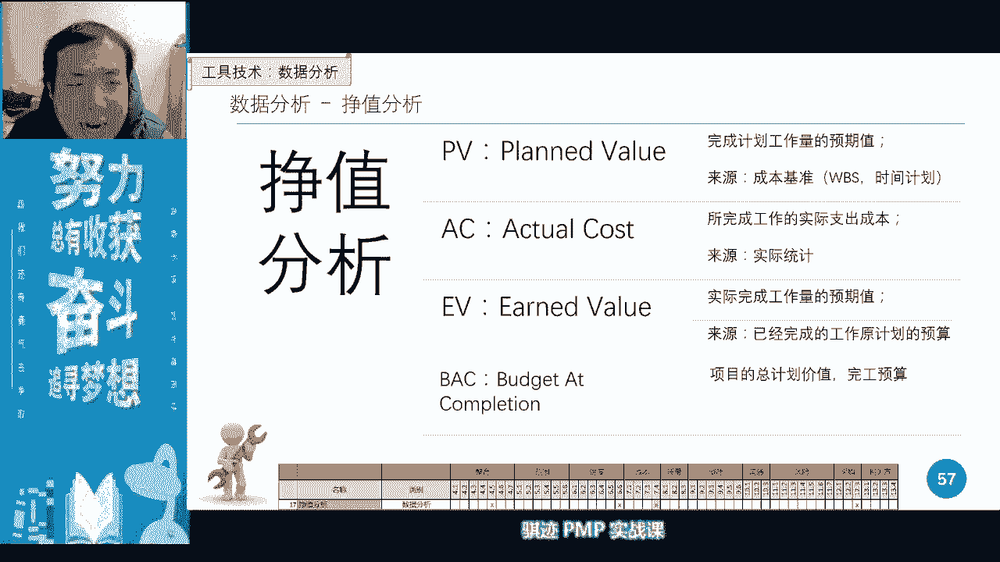

根本原因分析，根本原因分析一下，这个我们也其实也讲过，那么根本原因分析呢就查找一项和多项问题啊，风险啊之类的，它的根本的起因是什么东西，根本起因啊，这个呢我们在质量和风险当中呢还会提到。

还会提到根本原因分析呢，会有一个什么根本原因分析的报告啊，叫啊r c a r c a很多同学可能做这一行，尤其是做乙方比较苦逼对吧，写过很多r c a报告啊，分为三大块，一大块叫时间线。

这个事情是怎么经过第二大块呢，根本原因是什么，第三大块呢怎么样去杜绝这个东西再次发生啊，所以我们讲根本原因分析是一个消除，所以根本原因以杜绝再次发生了一样东西啊，啊当然实际操作中就不是这样了。

就变味儿对吧啊，所以根本原因分析实际操作中我们会讲什么，是为了讨个说法的一种一种分析方式。

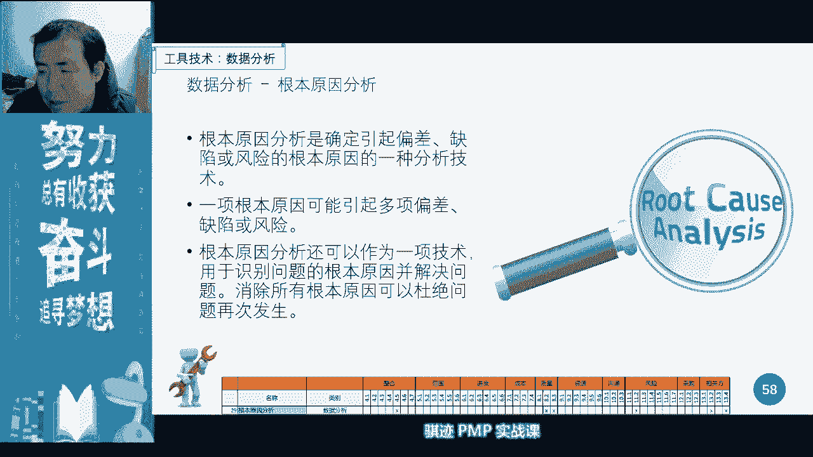

那么还有趋势分析，所谓的趋势分析呢和偏差分析上放了一些讲，但是很多同学呢会有误解啊，趋势分析我们常用，它就趋势在变换，如果在往好的方向，就是它的趋势在变好，那么它叫趋势不变，趋势不变啊不变。

那么趋势分析和偏差分析不一样的地方呢，是因为偏差分析更注重什么东西啊，你当前的状态像我当前的某个某个状态，和我们计划中的某个状态相比，差距在哪里啊，这叫差啊，这叫我们叫叫差异分析啊，或者叫差距分析。

那么趋势分析和差异分析呢可以是两两组合的，比如说如果我们的差异分析是好的，当前领先趋势又是好的，说明好上加好，不但事情做得好，未来会做得更好，这是最理想的对吧，那么接下来有可能是什么呢。

我们当前的我们当前的差异呢是好的啊，现在已经领先做的好，但是呢趋势正在慢慢变化，我们的效率在慢慢降低，这个时候呢我们要采取措施，当前的进度呢或者成本呢是没有问题的啊，绩效是没有问题的。

但是未来有可能会出问题，这是要及早干预，这是第二种，第三种呢是什么，是差意义是好的，但是去呃，但是是tai是坏的，但趋势是好什么，一开始呢可能有段时间呢，我们没有达到我们的目标和基准。

然后呢我们通过什么呢，我们通过我们的啊趋势分析分析呢，虽然我们一开始没有达到标准，但是我们正在努力改善，或者外部环境改善了，趋势动态背面渐渐向好对吧，稳中向好啊，我们举个例子来说。

就像就像我们现在啊中国的这个疫情一样，虽然2020年即将过去对吧，在2020年的开头的时候，我们疫情啊，让整个中国的经济和我们的生活呢产生了一个，这极大的和我们预期产生一个极大的差异对吧。

一下子跌的很低，但通过我们全国全中国人民的努力，每人都有份，人人有份对吧，我们的趋势正在逐渐变好，甚至已经快回到我们的基准线了对吧，明年可能还会超过基准线，稳中向好，这叫做趋势分析，差异分析。

第三种第四种是最惨的，我们又和目标呢又有差异，那么这个时候呢，必须果断采取立即性的措施去遏制它对吧，就好比说什么呢啊就好比说吧，比如你领导跟你说啊，你领导今天下班前给你说啊。

小王啊啊今天啊我们看了一下啊，你今由于你的绩效考核不佳，我们决定把你的工资呢，从每个月5000块砍到每个月4000块对吧，然后呢就和你原来的工资差距呢，机械呢差了1000块，然后回到将来。

你老婆跟你说啊，我们家里的最近因为这两这两个礼拜啊，我们的天气比较冷，空调开得多，这两礼拜我们的空调开的多，所以电费呢涨了很多啊，涨了很多，然后你看开支又上升了，虚开支的趋势更像又坏了啊。

这就是收入没有达到基准趋势，更像坏了，那么就是两个双换啊，那么这个时候应该果断采取什么措施啊，跳槽学完pp拿到证书，跳槽找一个薪水更高的工作，把这一切都解决掉，那么怎么样解决趋势呢，刚才差异解决的对吧。

跳槽从5000块的工资涨到什么1万块钱的工资，那么趋势怎么办呢啊跟老婆说啊，开什么空调，浪不浪费钱来冲个时代不就解决了吗对吧，就把钱省下来，就把趋势的恶化花钱，趋势的恶化呢也扭转过来，ok好吧。

是不是这个很有意思啊，老师有点夸张啊。

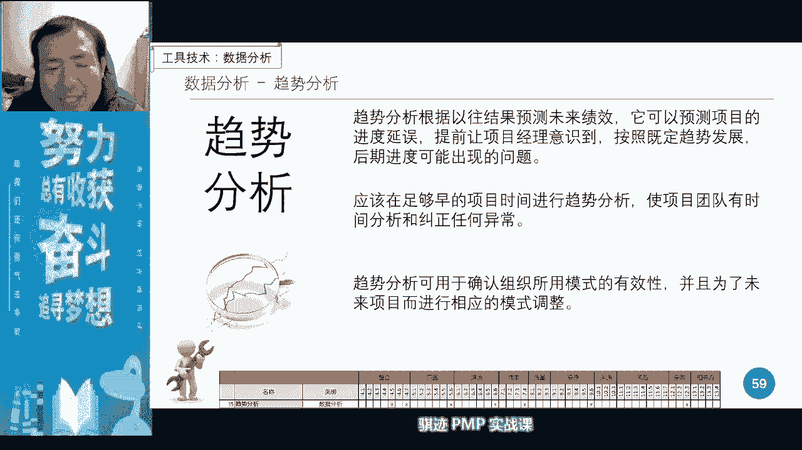

这个太葛朗台了对吧，太格朗台好，这是趋势判定的偏差分析啊，趋势分析和偏差分析，ok这个里中间的c p i s s v s spi和cv呢，就是我们政治管理当中的几个，我们的表达偏差的一个。

我们的一个指数和一个偏差值好，那么我们会这个值呢，我们这里暂且不讨论，我们会在正职管理那一节当中会讨论啊，所以成本那一章的课程会比较紧哈，非常累啊，ok大家一定要跟上，现在没有到，所以这里暂且不讲。

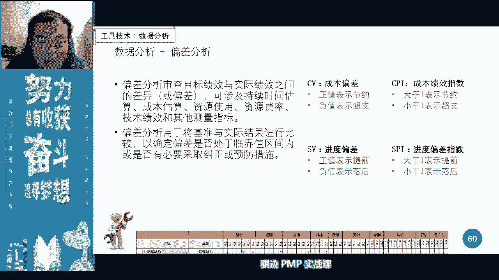

因为不像让大家脑子变得很浑好，那么我们在我们在监控当中呢，我们会用到决策啊，决策我们会有这样几种决策啊，大家注意我们常用的决策，只要知道它的意思就可以，决策会用在很多的领域上，第一种决策呢叫做一致同意。

一致同意有什么特点啊，一致同意的特点是啊，要做所有人同意，但大家都满意，那么这种情况下往往是什么呢，啊在这个角色落，就是说落实之后呢，决策落地了之后呢，很容易被执行，因为大家都同意了吗。

确定什么决策速度特别慢，很难做到一种，尤其是人越多越难一条心对吧，众口难调，所以一致同意，那是个没有效率的方式，只在人很少的时候，我们会采取这样的方式，以完全消除分歧，第二种方式呢叫做大多数同意。

只要超过50%就可以了，那么这种决策方式呢效率高，但是呢也有它的缺点和优秀的缺点，那么缺点是什么呢，它的缺点就是可能会损害少部分的利益啊，这叫多数人暴政啊，多数人暴政啊，我们有这样一个词叫多数人暴政。

少部分人对多数少主流群体对啊，就是对他们的一种啊不公平啊不公平，所以会有这种情况，第三种情况呢并不是针对于第二种情况的啊，里面相对多数，不是就当我们的意见不是非此即彼的时候，而是有多重意见的时候。

比如说啊比如说晚饭，我们讲吃晚饭，你们全家决定要吃晚饭，我们是吃人均100的还是吃人均50的，还是吃吃人均十块的，还是吃土，我们做决策这个决策的时候，我们总会选取一个投票投的最多的一个结果。

这个结果往往会不不一定能够超过多少多半数，但是呢是选取人相对较多的啊，这样的话是可以帮助我们在多个选项的决策，当中呢迅速做出决定啊，缺点也一样，未必能获得大部分人的支持啊，只能用规则。

强行让所有人接受这样一个相对多数结果，那么那我来问你，你们今天晚上吃的什么，是吃人均100的，100以上的对吧，100的50的，十块的还是吃土啊，你们可以在公屏上打给我啊，我们是啊，稍微开个玩笑。

啊这是四种决策方式，那么我在这啊，三种决策方式我们在这里讲过了，还有一种决策方式不用讲，一个人决定就可以了啊，这是我们主要使用的四种决策方式，后面就不再讲了啊，讲决策这方面就不再讲了。

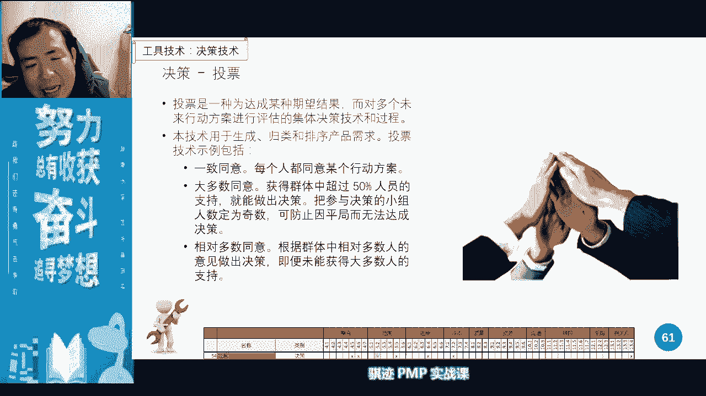

ok明白了好，这是一种决策方式，然后呢，我们输入输出当中最主要的一个输出，就是我们讲的是工作绩效报告，泡面吃剩饭吃土，你们混得惨不惨，都到年底了啊，对吧啊，有些人到年底了都要被人讨债的啊。

有道理理解理解吃土了，那位同学啊，理解理解可以理解啊，ok啊好，那么我们讲监控项目，最主要的一个输出是什么呢，工作绩效报告，注意作为一名项目经理，当你把项目的绩效甩出去的时候。

必然要甩出去的是一个工作绩效报告，而不是其他的，注意是报告，只有是报告，是甩出去啊，信息和数据甩出去，那说明你是不成熟的啊，是一种不成熟的哈，不够专业的项目经理的一种表现啊。

但是工作绩效报告和工作绩效报告呢又有差别，那我们举个例子举个例子啊，举个例子，假设你不是一个项目经理，假设你是一名会计，那么来了，你们知道会计应该怎么样写的，会计报告和会计账目吗，啊来了。

如果你这个会计项目报告呢是给银行看的，那么老板就会问直接哎什么好看，挑什么说什么数字漂亮，挑什么说啊，为什么你的财务数据好，银行才肯借给你钱啊，你财务数据不好，银行咋哪肯借你钱对吧。

所以工作绩效报告当提供给我们的甲方爸爸，提供最关键的外部相关方提供了这些人的时候，我们为了获取他们的支持，如果没有特定的应用了，我们一般会美化这个工作，基本啊，这是实践工作啊，考试不会考啊，没有化。

相对美化我们的工作，绩效报告或者补偿，实在是做得太烂，不要把它写得太烂就行，明白吧，这是第一种，第二种是给谁看的，故意写的烂的是给谁看的，比如说你是财务，你写给谁了，写给税务局，看来为什么少交税啊。

如果你是个财务，你出财务报告，那你肯定想办法交给税务局的那个版本里面呢，能够把企业写到多惨多惨，就差没倒闭了，所以税务局爸爸能不能少交点税对吧，税务局说当然不行了对吧。

然后但是你可以把赚钱呢写成不赚钱了，然后呢，不赚钱的企业呢就有各种各样的政策补贴对吧，首先增值税就不用交了对吧，营业税呢稍微交一点，现在两税合一了啊，总有办法呢可以少交点税啊，所以聪明的企业的啊。

会计的会把我们的需要交税时候的财务报，本来写得比较惨，阿尔玛需要贷款时候的报表呢写的特别好，那么还有一种报告呢就是客观真实的写，是给谁看呢，当然是给老板看的，所以一个企业的会计。

在以前的意义上要会写三本章，一个是给银行干的，一个是给税务干的，一个是老板自己看，那么一个项目经理也应该写不同的工作报告，一个工作就把我给谁看的，甲方爸爸看的对吧，我们做的非常好，威力威力good。

只给贾方爸爸看，还有一种给谁看呢，给老板看看，写的最真实啊，那么还要有什么干要技巧写的差的吗，应该是没有吧，除非除非友商要看，然后你故意隐藏实力对吧，有可能啊，所以项目管理办法加盟公司交报告当中。

可能财务报告当然不一样，我们不用故意一些对吧，但是不同的相关方，他拿到报告应该是有区别啊，引出这一点，那么同时我们在相关方面管理，和我们的控沟通管理会讲，不同的人应该看到不同的绩效报告。

作为你的顶头上司，作为项目当中顶多是发起人，看到报告是不是应该最详细的，但是最直观最简明扼要，告诉我他项目状态怎么样，那么甲方爸爸呢，工作绩效报告呢应该不用很详细，要能够尽可能地表现出我们的业绩对吧。

才能获得我们的甲方爸爸支持对吧，所以不同的工作绩效报告要写给不同人看，详细程度啊，美化程度啊，偏正面的那个程度应该是不一样的，所以这是实践工作当中的一个一个总结啊，所以很多人在工作当中呢。

但他不会针对不同的人写不同的工作绩效报告，当你有这样复杂环境当中，一定要注意啊，写给自己人看的工作计划报告，和写给甲方爸爸看的计划报告，应该是有区别的啊，有区别，ok这几天你们学到了吗，如果学到了。

请把学到了三个字打在公屏上，是不是觉得人生都是套路，对pmp里面充满了套路，实践当中也充满了套路，充满了all kinds of套路，对吧啊，好那么我们讲供，那么我们稍微回复一下啊。

回复到我们的理论当中来啊，我们在工作指导项目管理，项目工作当中呢收集各样的数据对吧，然后呢交给监控过程组，对各个子过程去收集，变成我们的工作就要信息，然后回到项目经理当中，把这些信息呢全都捏在一起。

你看5678 90 11 12 13，这些都是工作绩效信息的来源对吧，把它全部捏在一起，捏成一对吧，工作绩效报告有什么过去，现在将来，然后给谁啊，给沟通用，给监督风险用，给时实施整体变更。

控制用给管理团队用，就是沟通用，见人说人话，见鬼说鬼话啊，这位同学，你讲的道理是对的啊，话糙理不糙对吧，但是不用这么直白对吧，请给老师一点薄面啊，谢谢啊，毕竟我是把你们当人看对吧。

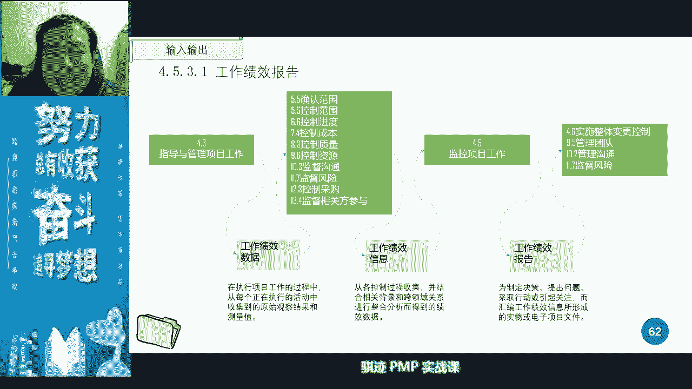

好我们继续讲，那么讲完了工作计划报告呢，我们就开始讲变更控制啊，变更控制变更控制是实施整体变更控制，使我们pp管管理当中，一个最最重要的单个知识点的足啊，足就是聚集点聚集点啊，辩证是考试最喜欢考的。

而且因此一场pp考试当中，变更的题目至少在20道以上到30道以上啊，能呃就当然跟变更和另外变更的题目，还和我们的具体的，我们的项目呢管理的各个知识领域相关啊，所以变更呢是考的最多的东西啊。

所以这个东西一定要学到概念精确啊，概念精确，那么首先变更是对我们所有的变更请求，进行审查批准管理啊，这个过程呢我们后面我会给大家写出来，不用急啊，其它的定义啊，那么变更当中，我们讲。

并不是所有的变更都要经过整体变更控制啊，变更请求并不在本过程中进行那批准控制，变更部分功能展开，注意区分遵循建立民营控制啊，那么我们讲有哪一类变更，不用通过整体变更控制，一预先已经被授权了。

项目经理可以自己决定的那些变更，以往往那些变更呢是不会改变基准的啊，注意啊，我的用词往往是不会改变基准的，不会影响项目的各个啊基准和管理，管理计划当中的约定的那些小的变更，一般可以由项目经理直接定夺。

一般直接定夺啊，但是只要涉及到这些方面呢，必须走正体变更流程啊，注意要遵循啊，遵循，那么第二变更当中一定要注意啊，各个环节是不能跳过去的，注意变更是不能跳过任何环节，注意啊，这个很重要。

变更不能跳过任何环节，考试当中如果啊注意，但是不要死脑筋，如果他说首先应该怎么样，那么你就应该往变更的最开始去思索，哪一步没有做，那么要首先做哪一步，如果他说应该接下来做哪一步难。

你要考虑我们当前您做到变更哪一步，然后紧接着会做哪一步，但是变更中间是不会跳，跳过相应的步骤啊，这是我们要注意的一些注意点，后面会继续讲啊，好那么我们继续回来，那变更的作用是什么呢。

对我们项目的各种配置来进行改变对吧，但是改变往往就意味着什么东西啊，可能会有风险，好像会有风险，所以做变更往往也伴随着什么风险管理啊，以及其他的一些管理的一些变化，那么变更什么时候可以实施时间。

什么时候整个项目周期内都可以实施，只要项目还没有最终交付，都是可以做变更，但是我们讲变更也是有代价，不是无原则无代价的变更，什么时候做成本最低，风险最小啊，啊请打在公屏上变更。

什么时候哪个项目的哪个阶段做，或者是哪个生命周期哪一块做是风险最小的，风险最小也是成本最低的，好很好啊，有位同学说项目启动很好啊，有位同学在微信群里写项目开始，ok啊，你的表述很好，但是不精确。

今后我们的表述都要用pp的pm博客的标准术语，来描述，项目启动阶段做变更是成本最低，同时也是风险最低的对吧，项目什么时候做变更是成本最高，也是风险最大的，就是项目的收尾啊。

这个公民资也就是项目的收尾的时候，这风险最大的项目和项目阶段的收尾啊，所以一定要注意这个我们项目是会有偏好，那么如果我们使用预测性，那么对我们来说，项目会尽量尽可能在项目初期完成所有的变更。

而在项目的收尾阶段呢，会将变更呢，尽可能的控制在一定的范围和层，次和级别之下啊，一以避免对这个项目造成不可估量的风险，和有何影响，那么我们讲辩证过程当中，项目经理是一个监督者，那么项目经理来问题完。

项目经理有没有权利去批准变更，项目经理有没有权利去启动啊，批准变更没有啊，有些同学说没有很好啊，有没有去啊，请问你们有没有项目经理有没有权利去ok啊，有人说有，有的说没有，ok这当然ok啊。

我前面刚刚说过，记得没有，对于那些不影响基准的变更，项目经理可以在授权范围内去批准变更，直接做对吧，但是只要影响到了基准，对项目管理计划做重大的修改，甚至要改造项目章程，要花额外的钱呢。

都需要进行实施整体变更控制的流程，注意啊，这一点项目经理有权的，但是权限有限，但是项目经理一定会负责一个什么事情啊，整个过程的监督者管理者是他，但是他没有权利去批，所以项目经理理论上应该对所有的啊。

需要走整体变更控制的这些变更做，进行跟踪和管理，当然他可以授权项目管理团队一起跟他做啊，所以这点要明白，项目经理是所有需要实施整体变更的，控制了那些变更他的管理者，但是他无权做决策。

但是如果不用整体变更控制那些是细小的变更，不用走我们的整体变更控制这个流程的，那么项目经理有可能会在授权范围内，可以直接批准，明白了吧啊这一点一定要清楚啊，那么绝大部分情况下是需肯定是变更。

是需要走流程的，所以注意接下来我的表达，如果没有特殊说明，项目的变更都是要走整体变更控制这个流程的，注意啊，没有特别说明，默认是要走流程的对吧，除非特别说明不改基准，项目经理已经被授权。

那是可以不用走流程，明白了吧啊，考试当中你默认这个东西是要走的就行，明白了，但是知道项目经理也可以有权限，去批这个演员事情，ok啊，就是这个上课当中一定要注意，你们注意记住的一个东西。

那么谁在一个项目当中去审批片根呢，大家可以看到屏幕下面最好分词当中，有三个字母跟我一起念c cb啊，change control board，是不是可以做变更啊，项目经理呢是没有权利去批的。

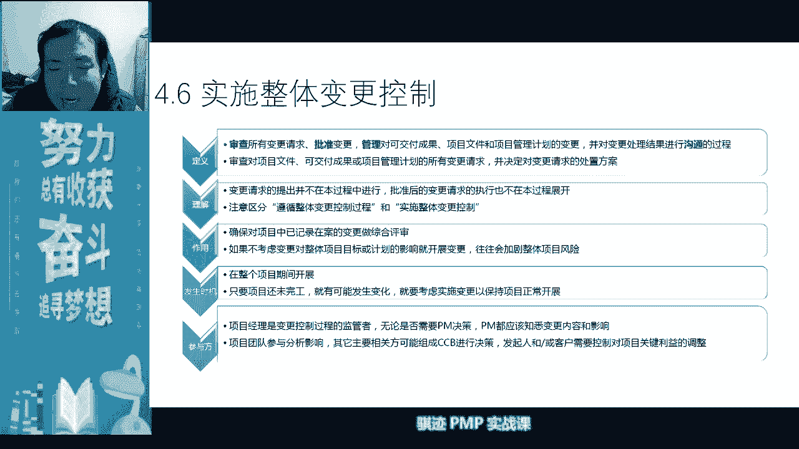

当涉及到基准，涉及到重大的变化的时候，那么具体怎么去p呢，我们后面会看啊，整个流程我们看比较急，但是大家大家的整个概念要清楚了啊，那么实质的平衡控制我们的输入当中，其他一些都是巴拉巴拉巴拉巴拉。

废话只有一个东西是什么变更请求，注意输入当中的变更请求，他是一个什么样的请求啊，是一个正式的变更请求，要走整体变更控制流程，必须有一个正式的变更请求作为开始啊，什么叫做正式的变更请求。

以书面形式以标准表格递交给项目经理的，叫做正式的变更请求，以口头形式或者是以邮件形式，注意啊，邮件形式也算的啊，非书面形式或者没有按照标准表格，标准表达方式去递交的变更请求，不算作标准变更请求啊。

那么有些人说老师，客户用邮件发了一个pdf算正式变更请求吧，呃那就算因为pdf是纸质扫描档的对吧，大家知道啊，这个就算，但是他肯定有纸质啊，注意一定要有纸质啊，默认啊默认，但是考试呢一般不会很纠结。

你是邮件发，但是指头发在一秒发的不会啊，但你只知道凡是按照口头说的，打电话说的啊，这些都不是正式的，都不作数都不作数，那么在变更过程当中呢，我们会用哪些工具呢，比如多标准决策分析对吧，变更控制工具。

这是我们后面要讲的，最后输出的是变更的请求和变更的日志啊。

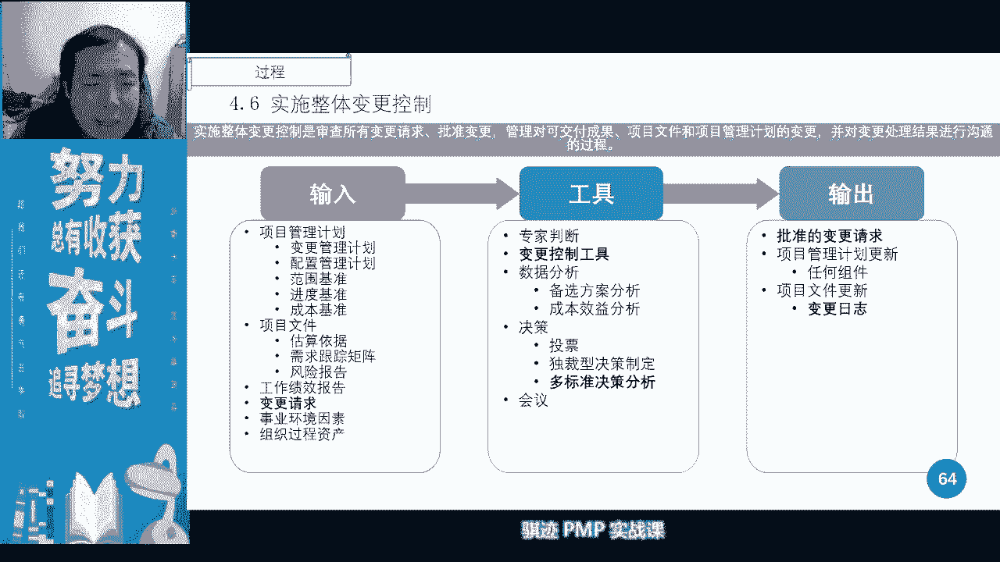

ok好下面就来讲了啊，变更控制流程，第一个是变更的皮肤，评估之后呢，变更在进行上会，然后呢进行文档更新，ok啊这是一个我们特定写的，那么我们会在后面当中的详细讲，那么我们现在先看一下啊。

着重看一下什么呢，变更呢是要进行书面提出的，要纳入到变更管理和配置管理当中的，对吧啊，这是我们前面反复强调了啊，我为什么要像老太婆一样，巴拉巴拉巴拉巴拉巴拉再说一遍，因为这些东西我后面不想再说。

但是考试必然会考到文，hundred percent设啊，会考到书面，注意书面记录啊，那么第二个在批准变更之前，一定要对变更做一些影响方面的评估，因为评估是我们上会，去上cc b那个会的一个基础。

否则c c b那里面人很多人又不是专家，他们怎么知道这个变更是什么什么性质对吧，变更会有什么结果，你只能先帮他们评判好，由他们决定是否做啊，由他们决策，但是你要把准备工作做好啊。

那些老爷们儿要把他让他慢慢准备工作做好，如果变更可能影响任何基准，所以要这就需要很正式的变更控制流程啊，那么接下来变更批准过程呢，需要有一个负责人进行负责批准啊，这个人通常是项目方检。

项目经理和cc b对吧，ok啊，那么这些人里面呢还有可能是要客户，还会用客户，那么注意这些人都可以批什么样的变更，首先无论什么样的变更，都首先要通过有个概念啊，这个概念注意，无论什么样的变更。

只要他走到了整体变更控制流程，他一定要先被cc b p人通过，其次才开始细分了啊，specification了啊，suspication，其次如果这个变更的动力当中，发起人的利益，发起人的钱的时候。

还同时需要发起人的批准，除非发起人已经是ccd的成员之一，对吧啊，自己p两遍，那个是傻叉对吧，不用浪费浪费资源了啊，但是呢它的变更动议里面呢，那么必然还是要组织的发起人代表，发现自己本身，注意啊。

这个是需要的，知道了吧，考试有可能会问到的啊，有可能会问到的，那么如果如果这个项目呢是变更呢，会涉及到客户，比如说客户原来答应客户做一个功能的，我们现在把这个功能取消掉，要不时间来不及赶工期。

我们把这个功能给取消掉，那么这个时候我们的变更是还需要是吧，有客户进行批准，为什么特别提到客户或者发钱品质呢，是因为一般来说你如果作为一个乙方的，乙方的c c b的开会当中，知道吧。

哦乙方开会为什么要甲方开会决定变更，为什么要甲方参加，一般都不会，但是你涉及到了客户的利益，所以你必须和客户进行沟通，让他也批准额外批到才能说通过编程工程啊，这是特定。

所以特定的人会有特定权限去批这个事情，明白了吧啊，这是一个特定的注意啊，一定要注意，这就讲的比较细的啊，考试当中讲的比较细，那么变更得到批准之后呢，我们要更新一系列的文档。

这一系列文档是可能是我们项目管理计划，和他的项目文件的一部分，还要更新什么东西啊。

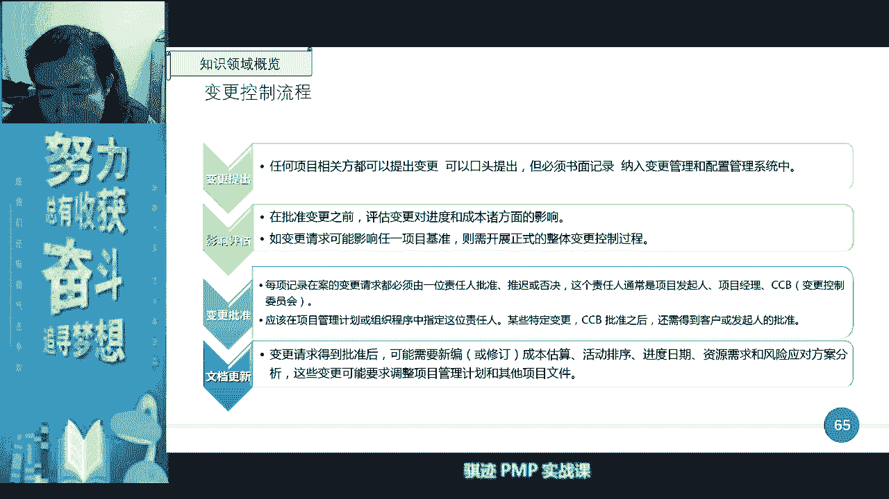

一个最重要的东西，最主要的东西是我们的变更日志啊，变更日志好，那么讲到这里的话，我们就开始有一个正式的变更流程的，一个方式了，我们先看详细文字啊，再看口诀，第一任何人都会利用体术变更。

但是呢项目经理呢会向变更的提出来啊，询问细节，影响受影响区域等等一些东西，然后呢项目经理在相关人员的分析啊，协助下来对变更进行分析，分析完了之后呢，要出一个变更的动力。

reporter交给我们的c c b，c c b来从各个方向去分析，那么c c b的人是怎么样去分析的呢，啊ok啊，这个呢偏博客呢没有特别假，那么c c b的构成往往是乙方组织里面。

代表各个方面的啊负责人的一个混合，比如它可以代表业务方面的，代表技术方面的，代表后勤方面的，代表财务方面的等等等等，经验取证结合在一起去审核这个东西，那么他他们怎么审核呢，他们仅仅从自己专业的角度。

然后去看这件事情，从公司整体和他们这个局部来说有没有益处，或者是收益大于风险，收益大于成本，有没有这样的事情，如果有的就通过，如果没有的呢就否决啊，是这样，当然c c b有时候会有一种特殊情况。

就是说c c b通过变更，但是它是有条件通过啊，他说一定要满足什么样的条件，保证不出错才让你做，只要只要有可能速度不让你做，这叫有条件变更对吧，项目经理就把脑袋搁在啊，如果出道脑袋给你对吧。

因为有些某些重大的变更当中，祖师是承受不起失败的，但是呢cpu觉得这个有必要做，但是失败代价很大，那么怎么办呢，他就会提出一个有条件通过的一个结论啊，有钱就可能结论，啊注意我们在这一部分当中。

你们p站上去，有时发起人和项目经理呢会执行此步骤啊，注意默认情况下，项目经理执行ccb的变更评估pass，我们讲只有一种情况，就是那个什么不改变基准，非常危险的那些变更，在项目经理的预授权范围内的。

可以做其他的，请你忽略啊，请你忽略这个点非常重要好那么我们继续讲，无论是通过还是不通过的时候，他都要继续在什么变更日志当中做更新，更新什么cc笔记的决议内容和理由，如果他通过了。

那么通过了当然不需要理由的啊，可就准备去做了，那么你要记住，并且要把这个理由告诉谁，谁提出变更能高出c啊，我经过努力的，我们提出方案了，你赶紧看啊，如果这是客户提出的呢，或者让客户变换一个方式。

变换一个方式，所以很多时候很多时候，比如说你要拒绝一个来自客户的理由啊，但是这就是比较有点厚黑啊，你要有拒绝一个客户看上去比较合理的理由，那你怎么拒绝呢，如果你做一个项目经理。

直接从自身的职务出发去拒绝，那么你可能就把客户给得罪了，那么怎么办呢，你说啊这个这个东西是一个比较重大变更，然后公司里面去审批，我没有权限去审，帮你把这个事情挡掉，如果客户还是要求呢。

你就不用做什么背锅下嗯，明白了啊，所以不该你决定的事情，作为一个项目经理，当你不该你决定的时候，千万不要瞎去做，别，尤其是当客户提出一个要求的时候，如果你擅自答应了客户，这叫做什么，请在公屏上回答。

如果客户提出了一个要求，这叫做什么，月泉我靠啊啊，请用规范用语啊，请用规范要用，请用规范要一范围蔓延，那么到底是镀金还是范围蔓延啊，ok啊越全肯定是不对的啊，谁提出越权的啊，没有好好看啊。

那么到底是范围没芽是镀金，想一想我们讲范围，我们现在有两种答案对吧，必然有一部分是错的对吧，范围蔓延和镀金的主要区别是什么，谁主动提出做这件事情，那么这种情况下，我刚才说的这种cting情况下。

谁主动提出，客户主动提出的呀，那么所以他不是一个镀金呀，只有你猪客户不要你硬塞给客户，那个叫什么镀金，客户提出了，你不走流程，擅自给他做了，这个叫范围蔓延，当然了，比更典型的是什么呢，客户提出了。

并且要求你不走流程，直接给他做的，还不给你钱，对吧啊，不给钱就怎么样，算违法对吧，算犯法啊，你懂了，好那么这种情况下，什么样的表述是镀金呢，作为一个项目经理，觉得客户高大上，想抱别人的大腿。

然后主动给我提出哦，我给你这里加点东西，不多收你钱，然后是不是更好啊，客户说好的呀，送给你钱的，送给你的东西不收钱，这时候就叫做镀金，明白了吗，所以范围蔓延和镀金一定要搞清楚啊，这个也是必然会考。

因为项目管理过程当中很重要的一块，对范围的管理就是防止范围蔓延和镀金，那么如果如果客户提出了一个无法拒绝的要求，但是项目经理觉得如果接受这个要求，这个项目我铁定要搞砸，项目经理接下来应该怎么做，请回答。

我在公屏上回答我，客户提出了一个你无法拒绝的要求对吧，大家教父看过吧啊，教父提出了一个你无法拒绝的要求，但是项目经理觉得如果接下这个要求，项目铁定砸，那么项目经理接下来应该怎么做，ok啊。

有些同学提出变更很好，同学啊，你这个已经月抛带出对吧哦，成语学得少，中文学得少，请不要欺负啊，这个你就错了啊，ok啊，我们ppt上白纸黑字写的应该干什么，就算用户啊，就算客户提出了一个一无法拒绝的要求。

对吧啊，你该干什么，向变更的提出人询问细节，并要求他正式的提出变更请求对吧，然后进行分析是接下来一步要做的事情，注意啊，ok你看我一问就问倒了啊，escalate，还上报啊，上报什么上报给谁啊。

那些超出范围的工作不是一都有客户提出来吗，ok啊这位同学啊，这位同学啊，注意超出范围的工作，并不一定总是从客户那里说，哎，很多做项目的会主动的去讨好客户，主动的为客户做一些事，情，为了讨好客户啊。

这种叫做镀金，注意啊，这种叫做镀金，客户要求超出范围做事情，也不一定是范围蔓延，为什么，如果客户要求超出范围做事情，但是他经过了整体变更控制流程，并且被批准了，因竟他们因为他就没批准了。

已经默认默许他了啊，承受他接受他了，这个时候就不是范围蔓延注意，所以镀金和范围蔓延当中，很重要的一点就是都没有走过，或者我完全通过我们的整体变更控制流程，注意了啊，这个要再三强调方向性定义啊。

因为变更是最喜欢搞脑子的啊，但是搞清楚了是最容易捞分的，早c g b对ok同学说啊，就是不给钱不一定啊，有时候不是钱的问题对吧，有时不是钱的问题，而是没钱对吧哈啊我可以开个玩笑，但是注意啊，不要把呃。

过多的把生活当中有很多东西，观点拿拿到我们的项目管理上来啊，有些事情真不是钱的问题，在管理项目上，有些事情你做不到，你做不到，再花再多的钱也是做不到对吧，这不是钱的事情，这是没钱对吧，ok啊。

不开玩笑不开玩笑啊，明白了啊，所以从笼统上讲，如果我们要做我客户提出个要求，我们应该是什么，要他正式提出，然后上会对吧，把锅甩给cg p，但是具体要看这个提示讲，我们当前的变更处于哪个阶段啊。

我为什么要花这么多呃，那口舌笔墨在这块东西，就是因为这块东西考试特别喜欢考，如果变更一次，p m p考试里面变更不考十几到20几刀，那么呃我谢老师的谢字，倒过来写，倒过来写，ok那明白了好。

那么我们前面讲了这么多东西啊，那么我最后再总结一遍啊，最后再总结一遍啊，变更应该怎么走呢，第一任何人都可以提出变更请求，但是注意，项目经理如果提出关于更新功能和需求的变更，它很容易是什么。

被人误会成什么镀金对吧，所以一般项目内部不会提出需求性的变更，但是它可以提出非功能性需求变更啊，至于什么叫非功能性需求变更，我们在范围管理里面再讲啊，ok那么第二步，项目经理收到了这些变更请求之后呢。

进行分析和论证，并且要求提出方提出正式的变更请求，然后进行分析和论证，得出变更方案上会评估，接下来呢通过cc编审核，即上交cc比去审核cc b得出一个结论，那么无论结论是过还是不过。

都要把它记录在更新日当中啊，啊当然这个东西有一个东西，如果项目经理正式接受了，我们的相关方提出的变更请求，他也先要在变更日志当中写个开头，某年某月某日，张三提出了一个变更请求。

目前变更正处于方案分析阶段，然后他去上会，上完会之后呢，他会怎么样啊，啊张三的上会动议被否决了，此变更不做，大家结束啊，这就这这条事情就过了，如果pvp通过啊，张三的变更请求已经被通过，通过了。

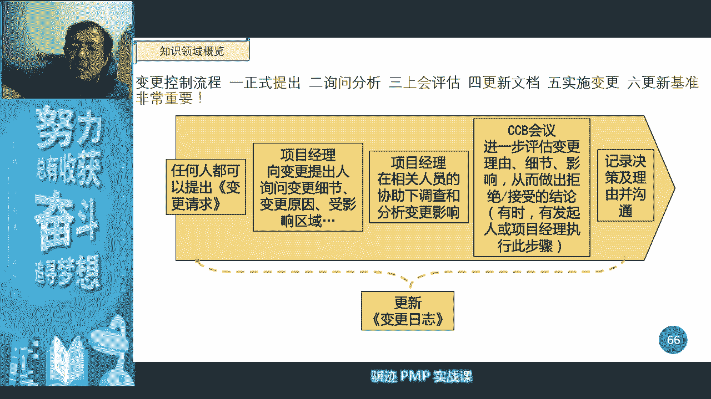

一条意见是无条件通过。