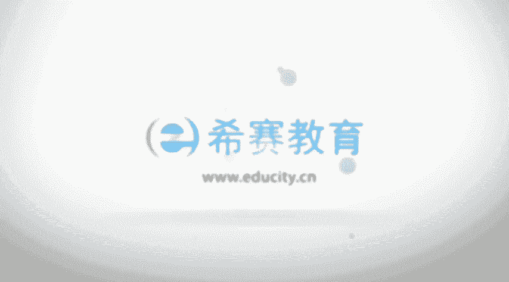

# PMP认证考试零基础精讲视频3.1.3目经理影响力（下） - P1：3.1项目经理及影响-2023-2-2 15：32：38 - 冬x溪 - BV1V24y1B7A2

好我们再看到下一个呃那个项目经理的影响力，说行业的层面啊，这样的话可能很多人就觉得摇头了，我跟他有什么关系对吧，他是这样说的，项目经理呢，应该要时刻去关注行业最新发展趋势，因为这个最新的发展趋势。

有可能会跟你的项目息息相关对吧，通过发展趋势来去获得并思考，这些信息对你当前的项目是否有影响，有可能会因为一些新的信息，让你这个项目啊去啊，可以突飞猛进的去发展对吧。

也有可能会说结果让你项目就会给pass掉了，有这种情况对吧，经常你会听到一些人说啊，他们那个什么做的那个东西做了个项目，其实我们在10年前就已经做过了，但是为什么你没做成，然后别人已经做的很大了。

并且现在已经是啊又融资啊，又要三思啊什么之类的对吧，其实很多时候会有很多很多因素在那，我们有的时候就说可能只是时间刚好没到而已，那你要关注当下最新的动态，最新的发展趋势，整个行业的趋势的话。

你是会对你可能会有更多的帮助，也会成长啊，一个是产品和技术的开发，最新的产品开发，最新的技术开发以及市场的空间，因为你不管前路的话，最后还是要说到那个盈利，对不对，这盈利市场空间也有关系。

以及当下的一些标准，比如说项目管理的标准呢，质量管理的标准呢，安全管理的标准，尤其是比如说项目管理标准，现在是pm，指，很多，很多的人都会去关注这样一个最新版本的啊，信息，看有哪些变动。

还有一些什么技术工具，以及影响当前项目的一些什么经济力量，影响项目管理的学科的这样一些影响力，以及过程改进和可持续发展的战略，其实也就是说我们还是从更大的方向来考虑，或者是关注这样一些事情以后。

能够去促进我们的项目有改进，能够变得更好，对不对，然后在一个层面到了专业学科的层面，那么在这个专业学科的话，他是这样说的啊，对项目经理来讲，持续的知识的传递和整合，是非常重要的一件事情。

而项目管理的专业，和项目经理所担任的这些主题专家，对这样一些各个领域，他都会有去持续的推进，相关的这样一些专业的发展，也就是说我们去传播一些讯息，其实也许让某些东西会有更大的一个发展。

你不要小看你的这样一个能量，最近好像有一首诗特别红，叫胎是清朝一个诗人写的，叫什么，白日不到处，青春恰自来嗯，开花如米，小也学牡丹开，但事实上我们不要去小看自己，对这个专专业学者。

这样一个层面的这样一个影响，包括我之前有一个同事，他当时做开发，然后他就对某一块，某一些底层开发会特别有兴趣，然后一直持续去做，结果后来做到那个领域里面小有名气，或者变得大有名气啊。

现在是已经在那个领域里面，是有一定的影响力的这样一个人，ok所以我们其实是可以去关注这些信息，我们去更多的去分享传递这样一些讯息的话，还是会产生一些正向的一些影响啊，啊他说知识传递和整合，包括说在当地。

在全国，在全球的层面，来向其他专业人员去分享，专业知识和专业的技能，所以有的时候我听过一句话叫做越分享越拥有，所以当我们多分享这些信息的时候，你会对这个东西更熟悉，以及另外一种发生的事，继续参与培训。

继续教育等等，参与培训和继续教育，然后最后一个叫跨领域的层面，他说项目经理对于组织的价值，可以选择指导和教育其他专业人员，项目管理的方法，也许我们要把我们项目管理的方法，要分享到其他的领域里面。

让其他人也能够去使用上啊，包括现在的话，其实我在教的学员中，我会发现有一些学生物的呀，嗯学各个不同的行业的对吧，我之前有人说学什么全船舶制造呀，呃这种都是很很少见的，但是他会不断的去慢慢发展。

不同不同的行业，人也会去关注这样一些项目管理的知识，项目经理还要担任非正式的宣传大使，去推广这些东西，让组织去了解这些项目管理，它在及时性啊，质量啊，创新啊，以及资源管理等方面的优势。

也就是说通过这种方式，能够让他有更好的一个推广，当然推广其实是因为它有用，对不对，因为它有用，所以才推广，然后因为推广，所以它会变得更加的有价值，这是项目经的影响力，所以我们再回顾一下。

这边总共收到了五大影响力，首先一个呢是在那个项目的层面，在项目的层面的话呢，我们需要去关注的是说，实现项目的目标，和一些相关的相关方的一些希望，然后在组织层面的，要去跟其他的项目经理有互动。

跟其他人员有互动，包括跟这样一个发起人有互动，这是组织层面，然后呢是在这样一个行业的层面，我们要去关注最新的动态，最新的行业的发展趋势，以及在项目的科学，专业学科的层面。

我们要去传递这样一些比较有这样的信息，去分享一些有这样的信息，当然了，还有说在整个的这样一个跨领域的，这样一个层面，我们也要去分享，要去传播，要去宣传这样一些东西。

