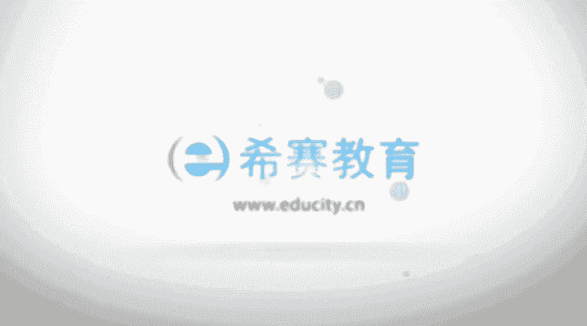

# PMP认证考试零基础精讲视频3.3.4项目经理的能力延展、执行整合-执行整合 - P1：3.3项目经理的能力延展、执行整合.-2023-2-13 16：21：35 - 冬x溪 - BV1io4y1v7Ky

接下来我们一起看到的是执行整合，那整合呢事实上是项目经理的一个重要的技能，你要去啊，你要去整合不同的人和工具材料事项，然后能够去推进这样一个项目对吧，然后整合在树上面，给到这样三个层面的整合。

就是我们作为项目经理啊，一个是过程层面整合，什么叫过程层面呢，就是我们会说整个项目会分为五大过程组，十大知识领域，49个过程对吧，那么在这样的一些过程和过程之间，项目经理你应该要起到一个作用。

就是说能够去把一些过程，他们之间的这样一些内容做一些整合，然后能够让团队成员更好的去执行，这样一些过程，或者说是更好的去而完成这样一个过程，所要所要去完成这样一些目标呃，事实上我们也知道。

虽然说我们会把过程分得很明显，就是呃包括说整合管理中会包含了几个过程啊，然后后面的范围管理中包含了几个过程啊，但是事实上真实的情形下，项目的执行它往往是多个过程混在一起，甚至有些过程还是会被裁剪掉。

有些是这个过程和另外一个知识领域的过程，他们之间也是混在一起来进行的，所以这就是一个整合的概念，就是站在一个项目经理，他要站在一个过程的这一个层面，去对整个项目的过程之间来做一个整合。

如果你在过程层面不能够很好的去整合的话，那么这个项目往往是很难去推进下去，然后另外一个呢，他说是在认知的层面要做一些整合，就是我们项目管理的方法有很多，但是具体到底用什么样一种方式去管理。

会根据项目的规模呀，组织的规模呀，项目本身的复杂性啊等等，以及一些组织文化的不同，而选择有所不一样，而项目经理的通常应该要去掌握这样一些知识，领域，以后，还要去掌握一些更多的内容。

这样的话才能够比较好的去管理这样一个项目，就包括说我们有更多的一些什么领导力啊，技术呀，商业管理呀，就是我们有一个那个什么项目能力三角形，对不对，就是把这些前前后后跟他边边角角相关的东西。

我们如果都清楚一些的话，我们去整个对我们的认知层面，有一个认识和提高的话，那么管理起来会更加有帮助，能够更好的去把这些东西运用到项目管理中，还有一个呢是背景层面的整合。

那么背景层面整合他说是新技术不断的涌现啊，包括什么社交网络呀，多元文化呀，虚拟团队呀，新的这样一些价值观啊等等，那么这些都是会有一些新的产生产生，都是我们项目经理会需要去面对的，这样一些情形。

那么整合会涉及到多个组织的大规模的跨职能，项目实施中的这样一些知识和人员，也就是说我们需要知道方方面面，各个方面的内容，这样的话才能够更好的去让我们项目有推进，所以项目经理他是一个整合者。

就是从小的细部的这样一个具体的过程的方面，到我们对于整个这样一些呃，项目的前期的一些商业的论证啊，可行性分析啊，然后说这样一个效益的分析啊，价值啊等等的这样一个认知认知，包括说后面那些其他跟他有相关的。

这样一些领域啊，或者说使用场景啊，这不就各个维度都需要去整合，但考试并不会可能不会让你去记这些内容，但是你大家心里面都知道，项目经理他就是一个整合者，整合其他所需要知道的一个很重要的技能。

