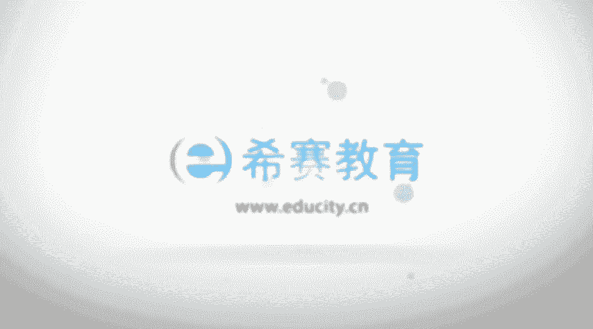

# PMP认证考试零基础精讲视频4.1.2整合管理核心概念（中） - P1 - 冬x溪 - BV15X4y1Q7YM

再往下面来看到的是它的这样一个发展趋势和，新兴实践，首先项目管理的，项目整合管理的这样一个知识领域，他说要求整合所有其他知识领域的过程，那么这边的那个趋势，它是包括，一个是使用一些自动化的工具来去管理。

事实上这样一些机器啊，设备啊，这样一些自动化的工具啊，真的是能够给我们的工作带来很多很多的便利，他说可以使用一些啊自动化的一些工具来去，收集分析以及使用一些信息啊，包括说在很多公司都会有什么oa系统呢。

e r p系统呢，呃类似这样的一些东西，对不对，都会能够让你的工作变得更加的方便一些，使用一些可视化的管理工具，ok有界面的操作对吧，包括咱们现在用的这样一个电脑，都是用的windows的操作系统。

然后这样的话有信息可以一个可视化的操作，界面的话，操作起来就会非常的简单，就不说完全需要那么专业技能的人，才能够操作这样一些信息，有的时候是哪怕是稍微受过，接受过一些培训和训练，都可以去使用。

关注的是项目知识的管理，因为整个知识的话它的积累积累知识，并且传递给受众，这个的话能够让他没有白费，就这样一个过程中的所有的经验教训呢，都应该被收集下来，能够去传递给后面。

能够去为后面的更多的项目来做服务，这也是啊一个趋势，那事实上包括说他这样一个趋势，我之前有一个朋友，他在他们那个公司，当时那是3年以前，34年以前，算是呃叫什么，具体名称。

不记得什么信息收集或嗯就是信息整理，类似这样的一个嗯，就是配置整理相关的这样一个工作人员，他还有个团队，有四个人的这样一个团队，他们专门做的事情就是整合一些知识，管理一些知识，就是他们是做很多这种呃。

给很多单位来做这种oa系统相关的，做类似的这样一些系统，那么他们每年都会做很多很多系统，而在这样一个过程，事实上有很多东西都是可以去拉过来呃，重复利用或者说是借鉴使用的，所以在这一过程中的话。

把一些知识如果没有很好的去管理起来，那么下一次会浪费更多的时间和精力啊，如果说能够比较好的去管理这样一些知识的话，能够把它积累下来，管理起来的话，后续会省掉很多的麻烦，增加项目经理的这样一些职责。

这个的话其实很有意思，我们已经看过第三章，大概也清楚，对不对，看过第三层，大家也知道项目经理的那个职责是非常的多，当然的要求也特别的高，那么在这边说到项目经理他要介入启动和结束，也是在最前面的时候。

你要参与进来，在最后面的时候你也要去参与进来啊，它是包括比如说呃那个项目的商业论证，你说值不值得存在相应相应的管理啊，这样一个项目怎么样一种方式，才能够让这样一个嗯回本对吧，然后以及盈利项目经理。

也需要去更全面的去识别相关相关方，我们只要去识别到各路的相关方，不会遗漏的话，不会遗漏，尤其是重要的相关方的话，才不会导致于说啊突然有一个相关方说啊，这个项目要停掉对吧，这种情形就是会比较尴尬。

所以如果说我们尽可能多的去识别相关方，也同时能够去识别到更多的风险，然后也能够去了解到大家的这样一些需求，或是诉求，这样的话能够更好的去管理这样一个项目，引导他们去参与到项目中来。

这是整个项目参与相关方管理中会去关注的，当是首先得识别到它，才能够去呃，邀请他来参与到项目的一个部分来对吧，还有一个叫混合型的方法，他说的是什么呢，他说嗯通常会有很多很多一些新的方法进来。

我们不要去拘泥说啊，完全是热力去追逐一种最新的方法，那样的话未必就是最好的，但是呢也不要说我只能我就用，我现在这一套已经非常ok，他说的是我们要可以去，他说采用一些经过实践检验的一些新的做法。

可能会能够让我们的项目管理的这种方法，有所提升啊，包括一些敏捷的方法啊，迭代的方法，现在敏捷也是越来越被大家所接受，对不对，他说以及说开展需求管理，采用一些什么商业需求分析的技术呀，然后分析一些复杂性。

采用一些什么相关的工具呀，就是我们可以去不是局限在某一种情形，当然也不是说完全只是去追逐一些新的东西，我们是要用实用的原则，实用的这样一个情形下，然后去参考使用不同的东西。

