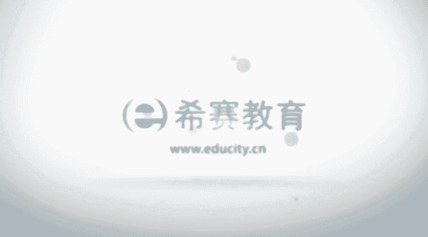

# PMP认证考试零基础精讲视频4.2.2整合管理介绍-整合管理的概念和活动 - P1：4.2整合管理介绍  -2023-3-9 15：04：18 - 冬x溪 - BV1gT411a73M

项目整合管理的概念，项目整合管理呢，他说包含对隶属项目管理过程组的各个过程，和项目管理活动来进行这些识别呀，定义呀，组合呀，统一啊协调，也就是说我们要去识别到各个活动和那个过程。

我们要去定义这样一个活动和过程，我们要去整合这些过程，我们要去协调这样一些过程和活动，ok在项目整合管理中，整合，它兼具有统一合并沟通以及建立联系的性质，并且呢他应该是要贯穿于始终。

所以我们也知道在项目整合管理，它是从启动规划，执行监控和收尾，这样的五大过程组中都有整合东西呃，整合管理它可能是全生命周期的管理，全局性的管理以及综合性的管理呃，这个的话是简单来讲。

他说全生命周期就是从开始到结束，对不对，生命周期我们从最开始到最结束，我们都需要去管理，从启动一直到收尾，第二个是全局性的管理，他说整个在项目整合管理的过程中，要去负责整体的包含一些管理的工作呀。

技术的工作呀，商务的工作你都需要去关注，你都需要去关注啊，不是说每一件事情你都亲力亲为，但是你至少得懂，同时你能够去把他安排给相对应的人员去处理，对吧，但是最新的版本中。

他其实说我们对技术的工作也要知道一些，然后对商务的工作也要知道一些，这样的话呢才更好的去有利于我们去管理，这样一个项目，还有一个综合性的管理，他说会关注到需求范围，进度成本。

人力资源沟通风险采购等等这样一些维度，所以这个整合本身是一个很大的一个东西，它就像一个大熔炉一样的，把所有东西都弄进来哈，项目整合管理，它包括选择资源分配的方案，平衡竞争性的需求。

然后去研究各种备选的方法，然后去为了实现目标去裁剪过程，管理各个项目管理的知识，领域之间的这些相互关系，所以他是把过程呢啊，然后那些个知识领域啊都会穿插在一起，都会交织在一起，就是项目整合管理的概念。

而整个在项目整合管理中，它的这样一些活动呢，我们可以看一下，首先是去啊关于这个项目范围，首先要明确项目有哪些范围，去确定这样一个项目的范围，然后呢我们还要去审查，并且去分析它的项目范围。

就说包含了一些什么东西，哪些是该做，哪些事不该做，这也是我们需要去关注的，以及它的这样一些啊做的准则，或者说是呃最后成功的这样一个标准，以及一些什么假设条件，制约因素，假设条件呢。

它是指我们假设它为真的这样一些条件，通常情况下做一个项目，它所以需要有大量的假设条件，我们只有有了假设，也就是有了一些默认的这些，我觉得默认可能就是这样一种情形诶，有了这样一种情形才能够往下面去推进啊。

还有一个是制约因素，那么制约因素的话，比如说在进度的方面，你必须在什么时候做完，在成本方面，你可能只能是在500万之内去完成，这样一个项目，类似这样的，这都算是你的一些制约因素对吧。

以及一些其他的一些因素，这都是整合你需要去考虑的事情，他说要去使用结构化的方法，去收集一些项目的信息，然后转换成项目管理计划，那么收集的信息可能就包含很多了，首先包含你的范围的内容对吧，从需求到范围。

然后呢你肯定会有一个时间的维度，有质量的维度，然后有那个成本的维度，或者叫做预算，或者是这种呃这这些对吧，然后以及关于资源的维度啊，风险的维度啊，沟通的维度等等，你都需要去了解到。

然后呢去做这样一个计划，开展活动来生产可交付成果，这说的是嘛，其实说的就是执行，对不对，就是我们要去执行，以及使用现有的知识去生产生产新的知识诶，这是管理知识对吧，管理项目知识。

通过这样一些知识呢能够去实现项目的目标，并且去帮助组织学习，这个学习什么，就是组织变得能够有更强大，以后有类似的项目的话，我们可以去使用这些知识，能够把项目管理的更好对吧。

测量和监督各方面的这样一些进展的情况，然后当然不只是进展啊，就是各个维度的这样一些进展，然后拿来去采取措施，这就是监督和控制项目工作对吧，然后开展各种活动来管理这样一个项目文件。

确保所有东西都跟计划的东西诶是保持一致的，这也是监控要做的事情，包括说可能会是这里面控制要做的事情，那么整个整合管理，它其实就是从最开始到最后全部都要去操心。

