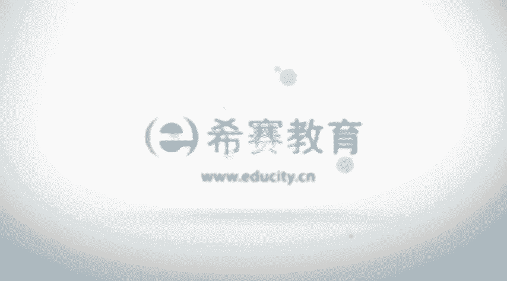

# PMP认证考试零基础精讲视频4.1.3整合管理核心概念（下） - P1：4.1整合管理核心概念-2023-3-7 14：25：16 - 冬x溪 - BV1gj411376h

啊然后再下来看到的是关于裁剪，那么整个项目整合管理，这样一个知识领域中的内容，我们如果说去管理项目，管理一个小项目，然后可能需要裁剪一部分，怎么样去裁剪啊，这个裁剪的话。

不一定说是非得把那个过程给拿掉啊，他有可能是要把这样一个过程给裁掉，当然也有可能是把过程中的一些，工具和技术给裁掉，只是选啊这个财，或者换一句话来说，我们要选择吧。

就是只选择你所需要的这样一些工具和技术，只选择你所需要的这样一些过程，那么关于项目整合管理，它的那个裁剪，我们看一下，他说关注首先一个是项目的生命周期，你这个项目的话，适合用一种什么样的一个生命周期。

那么应该是要包含哪些阶段，比如说通常可能会有一些概念阶段呢，开发阶段呢，然后那个后面的那个维护的阶段呢，然后是最后是笑完的阶段呢，这但是看你的这种项目，它可能有特定的一些因素，特定的一些状况。

然后它需要采用一些什么样的生命周期啊，这边还讲了一个叫项目的开发生命周期这个词，我们看一下啊，对于特定的产品服务或成果而言，什么是合适的，开发生命周期和开发的方法，是用这种预测型的，还是用这种适应型。

预测型，什么意思呢，预测型就是老夫掐指一算，我知道未来是什么样的，这叫预测型，对不对，他说的是说，我未来的东西都已经，就是我要做的这样一些事情，其实都已经比较明确，信息比较明确，当我比较明确的时候。

我能够去知道呃，下一步该怎么做，再下一步是什么时候做，以及做什么，再下一步什么样的，这些很明确，我就用一种叫预测型，包括在项目开发的时候，有一种叫瀑布型的这样一个开发模型啊，然后适应型的。

它指的是说可能有很多的变动或变更，那么呢就不断的去迎合这样一些新的变更，不断去做调整，我不断调整，不断的迎迎合这样一个单行的一些，一些一些变更的形式啊，他说还有如果说是采用这种适应性的话。

是用一种增量的方式，还是用迭代的方式，那么增量的方式呢，它指的是比如说我们当下已经做好一个版本，然后呢，下一个版本呢只是说会加一些新的东西进来，这个版本是已经完完整整，是可以去使用，那用呢应该说还很好。

对这样一个版本，然后再加一些新的进来，然后再下一个再下一个生命周期，再下一个迭代周期里面呢，我又加了一些新的东西进来，不断的做一个增量的方式，而迭代呢它更多的是可能是第一轮，就是一个粗略的一个东西。

然后下一轮就是会精细一些，再下一轮就更加精细或准确，或者是更加的完善，或是那个融创能力更强等等，当然也包括功能可能更丰富之类的，他的他的这种处理的方式呃，管理方法，考虑到组织文化和项目的这样一个复杂性。

用哪一种管理过程会最为有效嗯，以及知识管理在项目管理过程中，如何去管理知识，都说的是我们在项目管理过程中，可能会要涉及到这样一些方方面面，这样的话才能够去知道啊，用什么一种方式去处理。

我们之前其实也有说过，那个企业的文化对于一个组织呃，来管理项目是有很大的影响，不同的企业文化下的管理方式，真的是差别千差万别对吧，所以你要去裁剪，你要去选择的话，你肯定是要需要去考虑这样的因素。

这边还有一个叫关于考虑到变更，就是如果如果说中间发生变更以后，我们要如何去管理，如何去管理变更啊，正常的这个是官方推荐的这种方式，但是有变更走流程是先去提出这些变更请求，然后呢去评估一下。

看这样一个变更体就行还是不行，最后呢就是决定是批准或否决，这样一个变更请求，那如果被批准的话呢，我们就会去实施，要实施这样一些被批准的变更请求，以及后面要去跟踪，要去监督对吧。

但是也有可能会有它的一些特定的一些状况，在不同的这样一些行业，不同的情形下，可能有特殊的情况，你是需要去考虑的，以及关于治理，治理这个词的话，我们前面也说过，其实你可以简单来理解为。

就是我要如何去做这样一件事，情，如何去安排一些人或者是物件来去分配，这做相对应的一些事情，这边说到治理也是我们需要去考虑的一个信息，还有一个是经验教训，这个就不用说了，有经验教训的话。

能够帮我们省掉一些事情，少走一些弯路，对不对，那么在裁剪的时候，也是需要去考虑到这些经验教训，可能会对未来有帮助，还包括效益，他说应该在何时，以何种方式来报告我们的这些效益，在结束的时候。

还是每次迭代的时候啊，这些都是我们需要去考虑的。