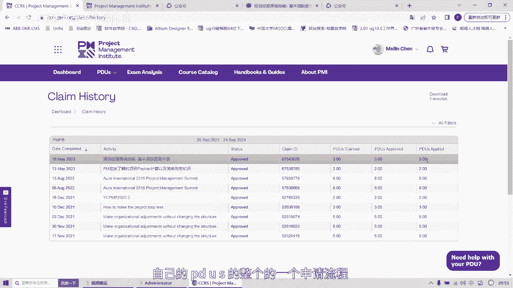

# PMP证书快到期，个人如何挣PDU？小白上手视频教学！！ - P1 - 李桃学英语 - BV1Hg4y1d7SJ

各位粉丝下午晚上好，今天up主将带领你们在获得PMP证书之后，怎样通过自己的努力，去在PMI官方网站去获得自己的PDU好，接下来我将带领大家来实际进行操作，首先我们要登录自己的品牌官方网站。

首先先登录进来的第一步，此页面已经展示好了，登录进来的这个页面，第二步点到这个三角形dashboard这一个菜单栏，这个网站的网速是比较慢的，好的，现在已经打开，这里是我们要求的PDU。

这里可以看到我们的一个，获得PMP证书的一个时间，然后这是需要重新去更新，或者去续签我们的PMP证书，可以看到我们有效稀释3年，所以在这3年里面，我们需要完成要求的PDU，总共有这里是35个。

都是自己去自学的一个人一个模块，第二个是pm，其实也更建议我们获得PMP证书之后，能够在这个网站去写，去分享自己的一些知识，所以这个模块是giving back，这里的话总共需要25个PDU，好的。

这两个模块一个是education，另外一个是giving back，今天可以看到，其实我这个账号的话，education已经完成了35个pd u s，那我今天这个视频主要是介绍giving back。

怎么去证giving back这25个PDU，接下来点这个report pdu，我们会来到另外一个界面，这个运行速度是比较慢的，大家耐心的等待一下就OK了，好的来到这一页，其实这里也是分为了两个板块。

得单独再出一期视频，来去证这个education的一个pd u s，然后今天来到这个give me back in back的话，其实这里也是分为12345，大家没事的话。

可以登录这个网站来自己去研究一下嗯，今天主要是回到这个，create content这块主要是authoring books or articles，Creating vigors。

这一块就是你在网上写的文章，或者发表了相关的呃，项目管理相关的文章或心得，其实这一块的话，这里也可以去去申请到对应的学分的，今天我们就点这个点开，这里点开在这里的话，我们会最好是自己提前已经在网络。

或自己的博客或者是微信公众号，或者是另外的一些媒体网站上去，发表了一些相关的一些文章，今天我这里是我们自己有个自己的公众号，平时自己也会写写文章来放这里，这家项目管理交流会，大家感兴趣的话也可以去搜索。

会把它放在这里，也会有文字版的，怎么证PDU的整个的一个流程，一个指引都放在这个公众号里面，大家感兴趣可以去搜索，然后去关注这个公众微信号，OK今天我们就选一个文章之前，我这里分享自己写了一个项目经理。

高级技能之国际贸易术语，首先点开这个位置，点开这个文章好，这里的话这里中文和英文都是可以写的，这里我这里的话就会写呃，微信公众号，OK然后这个文章的话就直接就写这个名称，把这个文章title直接放这里。

然后简单的描述，这里描述的话呃我就随便描述一点哈，分享，作为项目经理应该在，跨国项目中了解到的西北贸易术语，OK现在就把这个网址复制在这里，虽然可以看到这里是optional。

其实的话这个网址也是对于去，你把网址放在这里之后，其实申请到这个PDU的这个概率就会，成功率会比较高，然后这个时间就回到这篇文章的时间，我们是5月18号发布的，所以这里就写到直接对应的一个时间。

5月18号啊，开始时间，这里是完成的时间，5月18号，OK然后的话这里你要去申请多少的一个积分，这里是大概的一个一个参考吧，这里0。25pd u s大概是15分钟，0。5310分钟，0。

754105分钟，所以之前我写这篇文章的话，来来回回准备了比较多的一些知识，其实这里的话应该也是有个两个小时吧，两个小时，可以看一个小时是一分，两个小时就按照两分吧，其实远远不止两个小时。

那我这里就申请三分来试一下，OK点击好，那这里就直接提交submit，提交马上就会回到另外一个页面，好的这里页面终于弹出来了，然后弹出来之后，我们可以看到这里已经显示提交状态对吧，然后虽然这里写了一个。

这个需要五个工作日的时间来去获得，来去审批完最多五个工作日，实际上的话我们可能马上就能收到的，接下来我们就回到自己的dashboard这个仪表盘，去看自己的一个申请状态如何，这就回到了我们这一仪表盘。

这里刷新是比较慢的，OK可以看到这里，我们现在已经从之前的两个，现在获得了加三个之后就变成了五个，当然有时候我们会失效的，失效的时候就可以点这里view clean history。

可以看到我们所有的申请都在这里了，这里p d u s applied，这意味着PY还承认了，这篇文章可以给你给到你三个pd u s好，今天的分享就这么多，希望大家能够学会自己在PMI网站去完成自己的。

PTUS的整个的一个申请流程。

