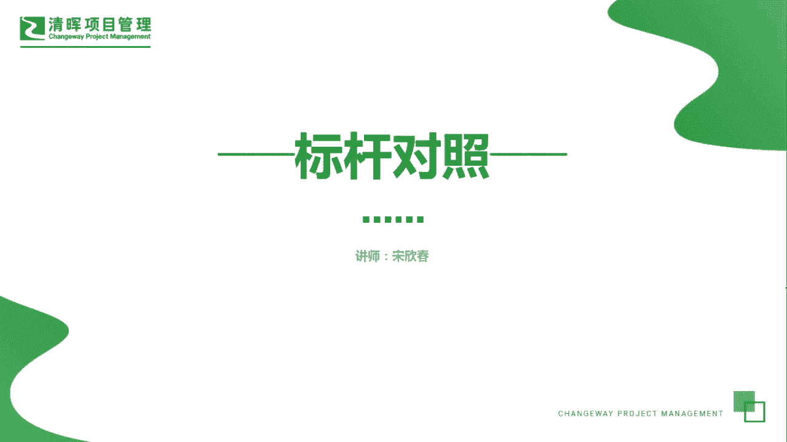
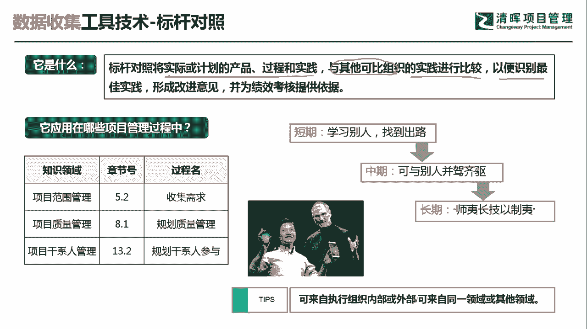

# PMP超干货！超全！项目管理实战工具！ PMBOK工具课知识点讲解！ - P1：标杆对照 - 清晖在线学堂Kimi老师 - BV1Qv4y167PH

大家好，我是宋老师。

今天我们来看标杆对照这个工具，标杆对照，它是将实际或者计划的产品过程和实践，与其他可比组织的实践进行比较，他是学别人啊，或者是从这个内部都可以去学习，学习什么呢，以便识别最佳的实践，形成改进的意见。

并为绩效考核提供一个依据，所以呢他是学习的是内外部的一种最佳实践，标杆，对照，它在范围管理的收集需求过程中会经常用到，这也是pp考试的一个重点，另外在质量管理的规划，质量管理过程中。

我们要考虑到质量的一个标杆，那也会用到标杆对照，另外在干线人管理的规划，干系人参与的过程中，你要去学习优秀的干型人，参与管理的一些这个策略，那也是可以去用标杆对照，我们在生活当中有经常遇到标杆对照。

这样的例子，就是经常看到的这个小米手机呢，他一开始其实它的研发，包括它的营销策略都是学习的，是乔布斯的苹果手机，短期内呢它是用互联网营销的这种方式，学习别人找到出路，那一开始出现了这个手机型号是s1 。

那现在呢他的这个手机呢已经达到了，可以与苹果并驾齐驱的这样一个高度，它的长期发展呢就是适宜长技以制夷，能够超越别人，并且呢能够这个不断的去完善自我，这个呢标杆对照。

第一个就是执行组织内部或者外部的这种标杆，都可以去学习，也可以是来自同一领域或者其他领域的标杆，那其他领域呢这个有时候就是跨行业的学习啊，比如说大家都在学习稻盛和夫，那他的经营理念，他的个人哲学。

这都是可以形成一种标杆，我们来看具体的一道题，一家公司启动一个项目，只在下一季度结束前能提高客户的满意度，项目经理应该如何确定最佳实践，这道题目呢比较明显，你看到最佳实践。

基本上就要知道我们可以用什么工具呢，应该如何确定，大部分考的也是工具啊，a选项使用标杆对照，它是可以对照这个对最佳实践的，b选项呢组织焦点小组会议，焦点小组会议的主要特点呢。

它是了解这个干系人的一些期望和态度啊，有一个主持人去引导这样的这个会议，安排一次尹老师研讨会，尹老师研讨会呢，和教练小组同样也需要一个主持人，但是呢引导师研讨会，更多的是引导大家达成目标的一致。

所以呢它有它专门的适用情景，d选项，创建一份清河图，清河图呢是在我们头脑风暴之后，对于头脑风暴的结果进行归纳总结，进行分组，那它是归纳总结分组的，因此呢我们这道题目呢，应该是站在标杆对照的角度啊。

学习最佳实践，形成改进意见，并为绩效考核提供一个依据啊，这题选a选项，今天呢主要和大家分享的是标杆对照这个工具，我们下次再见。

