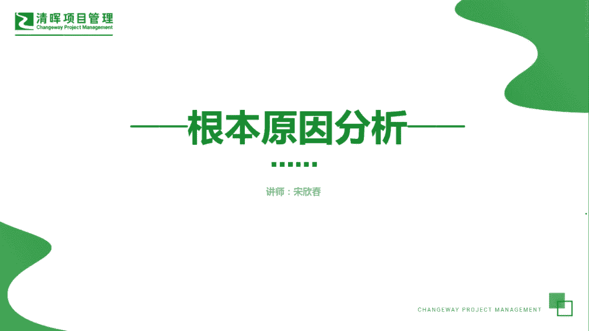
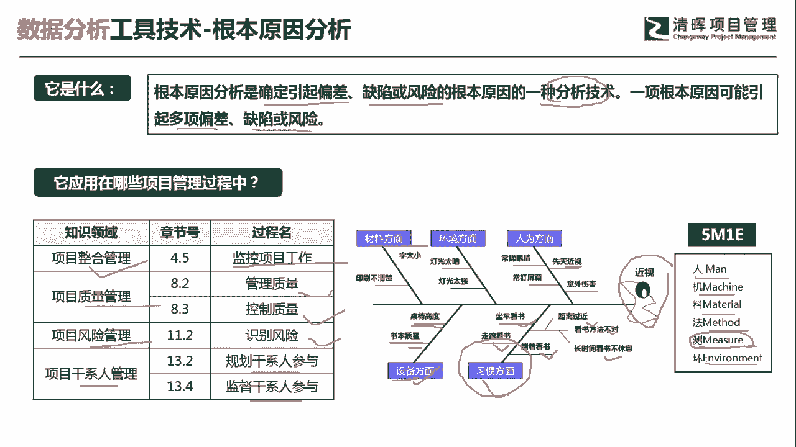
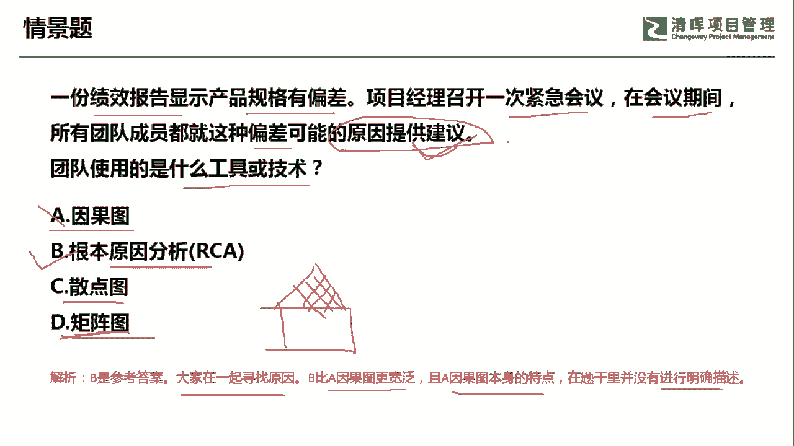

# PMP超干货！超全！项目管理实战工具！ PMBOK工具课知识点讲解！ - P10：根本原因分析 - 清晖在线学堂Kimi老师 - BV1Qv4y167PH

各位同学大家好，我是宋老师。

今天我们来看根本原因分析这个工具，根本原因分析呢，它是确定引起偏差，缺陷或风险的根本原因的一种分析技术，一项根本原因可能会引起多项的偏差，缺陷或者风险，根本原因分析呢一般是抓一个点。

它跟这个大多数原因主要原因不太一样，主要原因呢它主要是把很多的原因拿出来之后，抓住个别的，比如说两三个，这个叫主要原因，所以它和根本原因还是有很大的不同的，那根本原因呢。

这个工具它会在整个管理的监控项目工作当中，使用，在质量管理的管理质量和控制当中使用，那风险管理的识别风险的时候，也会识别根本原因，在肝线人管理的过程当中呢，比如说规划干系人的参与，监督干线的参与啊。

你要发现某些偏差，他为什么这个非常不支持这些项目，你要去找根本原因好，我们来举个例子，来了解一下这个根本原因的一些使用方法，根本原因分析呢它是一个数据的分析工具，在根本原因分析的过程当中呢。

我们会用到一个鱼骨图这种形式，来展现根本原因分析的一个过程啊，比如说我们右边的这个图呢，就是一个鱼骨图的形式，鱼骨图呢有时候也叫做因果图，或者叫做石川图，因为石川的石川他是一个日本石川新的。

他是一个日本人的名字，那他发明的这个鱼骨图啊，也叫做石川图，还有呢就是叫做yy to y呢，就是为什么为什么多问几个，为什么你就能发现根本原因了，鱼骨图这个地方呢，它是站在不同的维度去寻找它的。

这个引起近视的这个根本原因，比如说材料的方面，这个字是不是太小了，印刷还是不清楚的问题，然后环境方面呢有可能是灯光比较暗，或者灯光太强了，都对眼睛会有影响，在人为的方面呢，经常是不是揉眼睛。

或者经常盯着屏幕不眨一眨啊，或者它本身有先天的近视或者受到意外的伤害，这是站在人为的方面，但另外站在一些设备的方面呢，比如说这个桌椅的高度，会不会影响到他的这个看书的，这个这个这个效果。

还有呢书本的质量，比如说我们现在书本的这个纸，都有这种防静式的啊，优质的这种纸的质量好，还有习惯方面，比如说这个人他是不是习惯于坐车看书，坐车看书呢有可能车厢经常抖动，眼睛呢非常容易疲劳。

走路是不是容易看书，还有躺着看书啊，距离过近啊，看书的方法不对，或者长时间看书之后没有休息导致的近视，这些呢都可能会引起近视，那哪一个方面是引起近视的根本原因呢，你在这个当中就会去判定了啊。

这个只不过是给大家一个参考，其实呢这个是我们在制造行业当中，经常要用到的这个鱼骨图，它主要是从人的方面，机器的方面，这个里面就是指设备的方面，材料的方面，这个是这个我们自这个是不是太小啊。

印刷不清楚方法的方面，测试的方面，还有环境的方面，人机料法环，那我们这个地方呢增加了一个测试，就是你的测试方法是不是有问题，总之呢你通过这个鱼骨图因果图的这种方式呢，你可以发现根本原因在哪里。

你这样比如说你找出啊，这个是因为他习惯的问题，就是导致了它的近视了，这是一个根本原因，然后你再去针对这个根本原因呢去进行改善好，这个呢就是根本原因的分析的一种方法。

我们从这道情景题来理解根本原因，一份绩效报告显示产品规格有偏差，项目经理呢召开一次紧急会议，在会议期间，所有的团队成员都就这种偏差，可能的原因提供一些建议啊，大家发现偏差之后都提出了建议。

请问团队使用的是什么工具或者技术，他现在是提供了建议，他其实是在进行分析，所以呢因果图它是一个图形展示，也就是说我们通过根本原因分析之后，会得出因果图或者鱼骨图，但是呢我们这个时候呢情景当中。

他提出的是建议，他其实是在进行分析过程中，所以呢我们不能选因果图，可以选择的是根本原因，分析散点图，它主要强调的是两个因素之间的关联性，比如说学生的这个呃，休息时间和他的这个身高之间是不是有关联性。

那这个可以用散点图，散点图呢一般是代表两个因素之间的关联，矩阵图不太一样，矩阵图呢是代表引起一个因素的变化，有哪些因素所引起啊，就是引起因素变化的结果，和哪些因素之间有关系，所以呢它是一个结果。

和多个影响因素之间的关联性，所以呢这个叫矩阵图，比如说我们经常用到的这个这个，质量当中有一个叫做质量屋，它就是把客户的一些需求呢，转化成我们的这个关键质量点，然后你去寻找这个关键质量点。

和哪些客户的需求之间有关联性啊，这个是矩阵图经常用到的，所以呢我们这道题目呢从前景来看，应该是选择根本原因分析，因为是大家一起在寻找原因，而且呢根本原因分析呢，它这个比因果图呢更加宽泛。

因果图它也有本身的一个特点，这个我们在题干当中是没有进行描述的，如果这道题我把它改成，我们现在呢提供建议之后，大家展示了这个建议的一些图形啊，或者说我们通过一些图形去发现这个，引起偏差的根本原因。

那这个时候呢我们就可以用作因果图了，好今天呢主要和大家分享的是根本原因，分析这个工具，我们下次再见。

