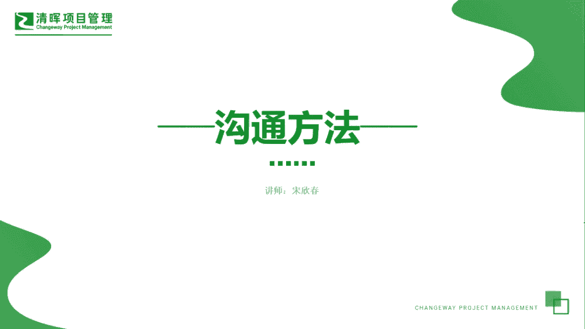

# PMP超干货！超全！项目管理实战工具！ PMBOK工具课知识点讲解！ - P11：沟通方法 - 清晖在线学堂Kimi老师 - BV1Qv4y167PH

各位同学大家好，我是宋老师。

今天我们来看沟通方法，这个工具沟通方法呢，它主要是在项目的相关方之间传递信息的，系统化的一些程序技术或者过程沟通方法，它主要是在沟通管理的规划，沟通管理和管理沟通过程中所使用，在其中呢。

我们有三种经常所遇到的这种沟通方法，分别是互动式沟通，推式沟通和拉式沟通，第一个互动式沟通呢，其实有时候也翻译成交互式沟通，它的主要特点是在两方或者多方之间，进行实时多项的信息交换。

注意它的关键信息呢在于实时多项信息交换，比如说我们的这种开会，它的特点就是实时的多项信息交换，及时的有反馈，有什么情况当面就能谈清楚，所以呢互动时沟通它的效果往往是最好。

它往往也适用于一些关键的这种信息的沟通，或者和一些关键人物的沟通，推迟沟通呢，它的主要特点是向需要接收信息的，特定的接收方发送这个发布信息，这种方法呢可以确保信息的发送，但是呢不能确保信息送达目标受众。

或者被目标受众所理解，这是什么意思呢，比如说我们发邮件，邮件是发送给特定的接收方，但是呢对方是不是设定了这个垃圾过滤器，那你的邮件有可能就被过滤了，他收不到，还有一种情况呢，就是你把信息发送给对方。

但是呢对方不一定能够理解，你想要所表达的意思啊，这是推迟沟通的特点，第三种沟通方法呢叫做拉式沟通，拉式沟通呢它是适用于大量复杂的信息，或者呢大量信息受众的情况，也就是接收方会比较多。

他要求接收方在遵守有关安全规定的前提之下，自行访问相关的内容，因为它信息量比较大，它的受众也比较广泛，所以他不可能一一的进行互动式的这种沟通，或者推迟的沟通，他需要你自己去查看，比如说我们的这个百度。

你自己可以去查看，或者公司内部呢有一些网盘或者公共盘，那我们呃来了新员工之后，你可能跟他这么说，就是说我们有一些这个过去的一些项目经验，你可以在这个网盘上自己去查看，好这个呢就是拉式沟通的特点。

所以呢三种沟通方法，它分别有它三种适用的场景，这个是我们每一次考试当中，经常会让你做出判断的。

我们来看这样一道题，一家大型全球性公司的员工，分布在七个不同的国家啊，说明他是一个虚拟团队，为了确保项目成功，每个人无论其物理位置，必须能够方便地通过安全的内部网站访问培训，好这使用的是哪种沟通方法。

这道题目呢，它的关键情景呢在于他的员工呢分布比较广，泛，在七个不同的国家，然后呢需要你通过安全的内部网站访问培训，那说明呢需要你自己去操作啊，这个呢其实就是很典型的拉式沟通的特点。

交互式沟通也叫这个互动式沟通啊，刚才我们说了，它适用于就是说信息量不是很多，但是信息也比较重要，然后需要实时的双方的这种互动式的这种形式，来及时的反馈，没有编码式沟通这个词，这是一个陌生词汇。

我们首先要把它排除掉，推迟沟通呢，它的特点是把信息推送给特定的接收方，但是呢它不能保证信息被送达，或者被这个目标受众所能理解，因此呢也不符合我们的情境的含义，这道题目呢我们应该选择c选项，拉式沟通。

它是适用于大量复杂的信息，或者大量信息受众的情况，我们这个里面呢七个不同的国家，符合信息受众比较广泛，他要求接收方在遵守有关安全规定的前提下，自行访问相关内容，自行的去访问培训，包括门户网站公司内网。

电子在线课程经验，教学数据库或者知识库，好，今天呢主要和大家分享的是沟通方法，这个工具我们下次再见。

