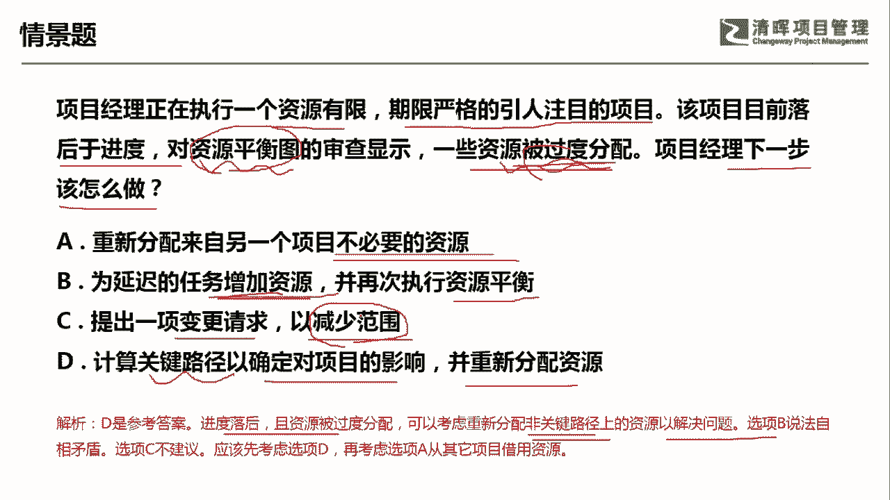

# PMP超干货！超全！项目管理实战工具！ PMBOK工具课知识点讲解！ - P12：关键路径法 - 清晖在线学堂Kimi老师 - BV1Qv4y167PH

各位同学大家好，我是宋老师。

今天我们来看关键路径法这个工具，关键路径法它主要是在项目进度模型中，估算项目最短的工期，确定逻辑网络路径进度灵活性大小的一种方法，这句话想表达什么意思呢，就是说这个关键路径呢。

一般指的是这个整个项目工期当中，用时最长的这条路径，它其实决定了你项目的最短工期啊，这个是代表你如果有一个船队的话，那么决定你这个船队的跑得最快的速度的，往往是走的，其中走得最慢的那条船，关键路径法。

它基本上主要是在进度管理过程中会使用，比如说我们在制定进度计划的时候，在控制进度的时候都会用到关键路径法，每一条关键路径呢，其实都是由若干个活动所组成，像我们右边的这个图形呢就是代表的一个活动。

某一个活动它有最早开始时间，也有呢最晚开始时间，同样他也有最早结束的时间，还有最晚的结束时间，其中这个当中最早结束减去最早开始，就代表这个活动的工期，时差是什么意思呢，比如说我们最晚开始减去最早开始。

它这个当中的差值呢，就代表时差，或者由最晚结束减去最早结束，它得出的也是时差，一般的关键路径上的这个活动呢，它的总浮动时间是零，总浮动时间是零，那么每一个活动呢它的这个呃时差呢也是零，也是零。

就是说他基本上最早开始跟最晚开始都是，其实是没有什么这个中间的时差的啊，这个呢是代表他的这个总浮动时间是零，这样的话可以代表我们项目的最短空期，可以控制在最短时间，总浮动时间是什么概念呢。

在任何一个网络路径上，进度活动可以从最早开始，日期推迟或者延迟的时间，而不至于延误项目完工工期，或者违反进度制约因素，这就是进度灵活性被称为总浮动时间，也就是说他的这个活动呢，可以从最早开始时间推迟啊。

比如说推迟到什么时候，他不会去延误你整个项目的完工日期，这个呢就是总浮动时间，所以呢总浮动时间可以是政治，也就是说打个比方，我最晚开始，比如说是第二天，我最早开始是第一天，那这个当中的时差呢就是一天。

这条路径呢你不能说它是关键路径，但是也是一条路径，所以呢这个由无数个活动所组成的这个路径，它有可能这个总浮动时间就不是零，他是一个政治啊，也有可能是总负重时间是零，刚才我们所说了这个关键路径。

它一般总浮动时间就是零，那它的时差都是零，都是零，都是零，这样加起来总浮动时间是零，赋值呢是代表这个这个项目呢已经被延误了啊，被延误了，关键路径呢可以有多条，但是如果一个项目里有多条关键路径。

这个大家可以想一想会带来什么后果啊，自由浮动时间呢，自由浮动时间是指不会延误任何紧扣活动，它的最早开始日期，或者不违反进度制约因素的前提下，某个进度活动可以推迟的时间量不延误，任何紧扣活动最早开始实践。

这是什么意思呢，比如说我们后面还有一个活动，好好后面还有一个活动，这是a活动啊，后面的这个是叫b活动，紧扣活动，b活动，我a活动的这个时间安排呢，它不影响后面的这个活动的最早开始，不影响它的最早开始。

那这个时间的安排呢，进度的活动呢，延迟的时间量呢就叫做这个呃浮动时间啊，自由浮动时间好。

我们具体来看这样一道题，项目经理正在执行一个资源有限期限，严格的引人注目的项目，该项目目前落后于进度，对资源平衡图的审查，显示一些资源被过度分配了，项目经理下一步应该怎么做，资源平衡。

它是属于我们资源优化技术的当中的一个技术，资源平衡呢往往会导致关键路径的延长啊，而且呢它也是在资源受限，或者被资源被过度分配的情况下，经常用的一个工具，它往往会导致关键路径延长。

但是问的是项目经理下一步该怎么做，你既然是发现资源被过度分配，那你就要看一下你的怎么样，你的关键路径是否被延长了啊，a选项，它是重新分配来自另一个项目不必要的资源，这个其实呢用的是资源平衡。

但是你用资源平滑之前呢，你先要去看一下你的关键路径，看一下它是不是被延长了，或者有被延长的延长的这种趋势，b选项为延迟的任务，增加资源并再次执行资源平衡，资源已经被过度分配了。

所以呢一般情况下是不会去增加资源的，c选项提出一项变更请求，以减少范围，我们一般偏僻当中很少选这个减少范围的，这个是属于一种风险的规避策略，规避策略这个呢只是一种措施之一，不是绝对要去做的。

d选项计算关键路径，你确定对项目的影响并重新分配资源啊，这个里面重新分配资源，有可能会采用一些资源平滑的方式，所以呢先要去检查一下，计算一下关键路径，然后呢再去考虑一些其他的方法。

因此呢我们这一题呢应该是考虑d选项，因为它进度落后，资源被过度分配，可以考考虑呢重新分配非关键路径上的资源，以解决问题，这个呢就是用的一个资源平滑的方式好，c呢是不建议减少范围的。

我们先考虑就是关键路径对项目的一个影响，再考虑这个从其他项目上去借用一些资源好，今天呢主要和大家分享的是关键路径法，这个工具，我们下次再见。

