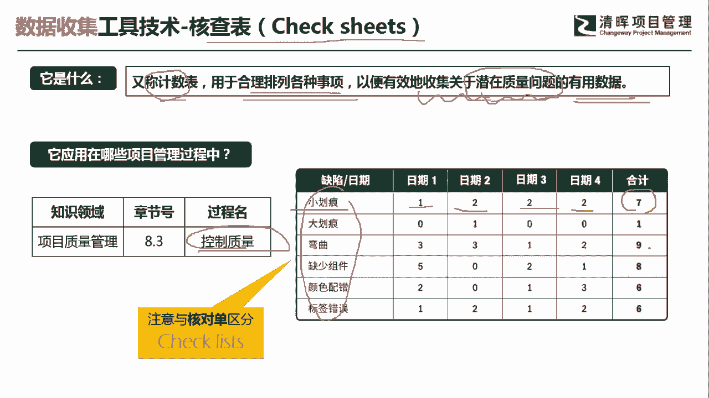

# PMP超干货！超全！项目管理实战工具！ PMBOK工具课知识点讲解！ - P14：核查表 - 清晖在线学堂Kimi老师 - BV1Qv4y167PH

各位同学大家好，我是宋老师。

今天我们来看核查表，这个工具核查表呢它的英文叫chicken，它是又称为技术表，主要是用于合理的排列各种事项，以便有效地搜集关于潜在质量问题的有用数据，它主要是搜集潜在质量问题的一个表格。

所以呢这个核查表，它会在质量管理的控制质量过程中使用，但是我们要注意的，它和checklist有什么样的区别，check list其实呢主要是起到一个提醒作用，主要就是问你该做的事情有没有做。

有没有打勾，这个叫核对单，核查表呢更多的是看你做的结果怎么样，比如说我们右边的这张图，这就是一个核查表的概念，它可以去发现各个缺陷出现的这个日期，比如说小划痕，我们在日期一这一天出现了几次。

出现几次出现几次，然后最后呢得到了一个汇总，这个呢就是核查表，看你做的好不好呀，有没有出现一些缺陷，会把它记录下来。

我们来看这样一道题，质量审计识别到关键路径上，多个可交付成果的不一致之处，在完成纠正措施之后，项目经理需要将结果报告给变更控制委员会，c c b，若要核实一致性，核实一致性，项目经理应该怎么做。

应该怎么做，他要核实一致性，就是看你有没有出现这个不一致之处，也就是说有没有出现缺陷，a选项完成质量核查表啊，正好我们可以用上去检查一下，他有没有跟我们的可交互成果有没有不一致，b选项叫做检查变更。

检查变更主要是检查变更的流程啊，以及它的这个流程的结果，但是呢我们这一题呢，很显然他已经完成了这个纠正措施，他已经走完了这个变更流程，他不需要去检查变更流程本身了，因此我们不需要去检查变更。

同样一般呢我们也不会有这种选项出现，就是什么意思呢，检查一般是检查的可交付成果，不会去检查变更，只会去检查什么，去审查一下变更日志啊，c选项更新变更日志，这个变更日志呢。

它确实是要在这个纠正措施之后去进行更新，但是呢我们这个时候目标是要核实一致性，何时一致性，他不是要查这个变更日志表了，它不是输出的，不是变更日志表了，所以我们应该是考虑核查表去何时一致性，完成统计抽样。

统计抽样的使用，它一般是我们需要通过小样本来推算出，某总体的一个情况，同样我们这道题目当中，也没有出现这个样本的一种描述，因此呢我们这一题呢应该选择a选项，完成质量核查表收集数据的核对清单。

在开展检查识别缺陷时，用核查表收集属性数据就特别方便好，这里面会留一道题给到大家去思考，就是我们用完这个核查表之后，接下来会用什么表格去展现，这个核查表的一个结果。

好今天呢主要和大家讲的是核查表这个工具，我们下次再见。

谢谢大家。