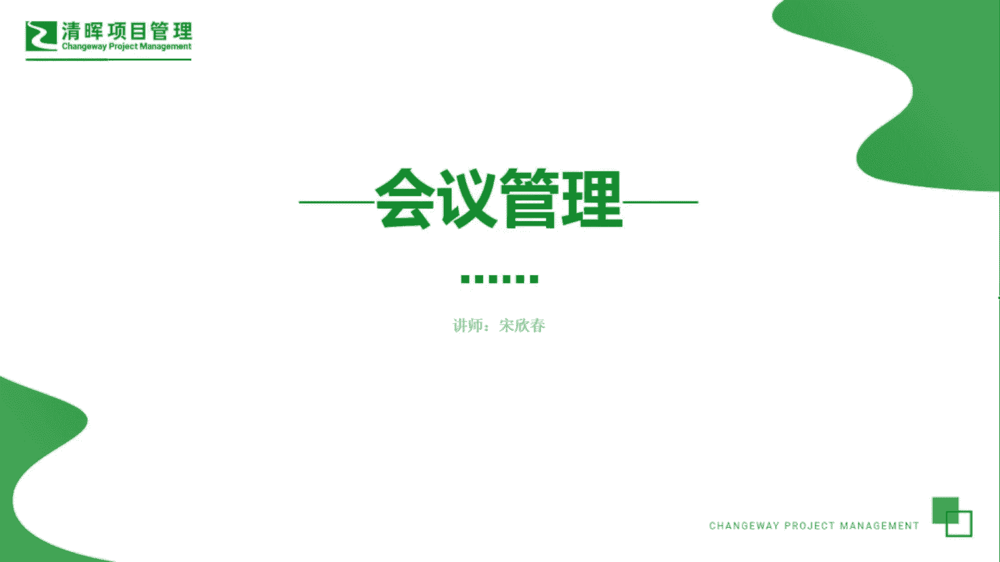
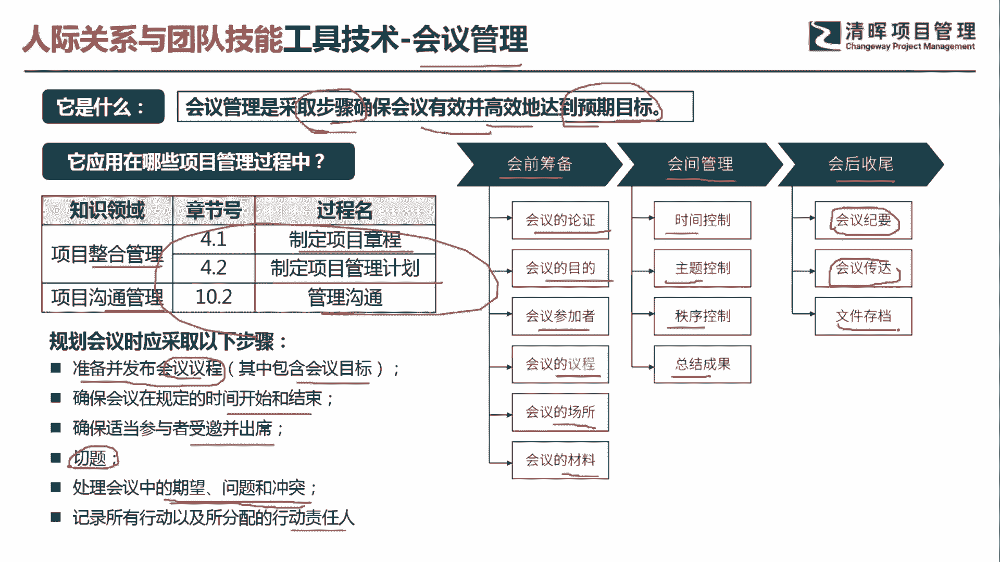
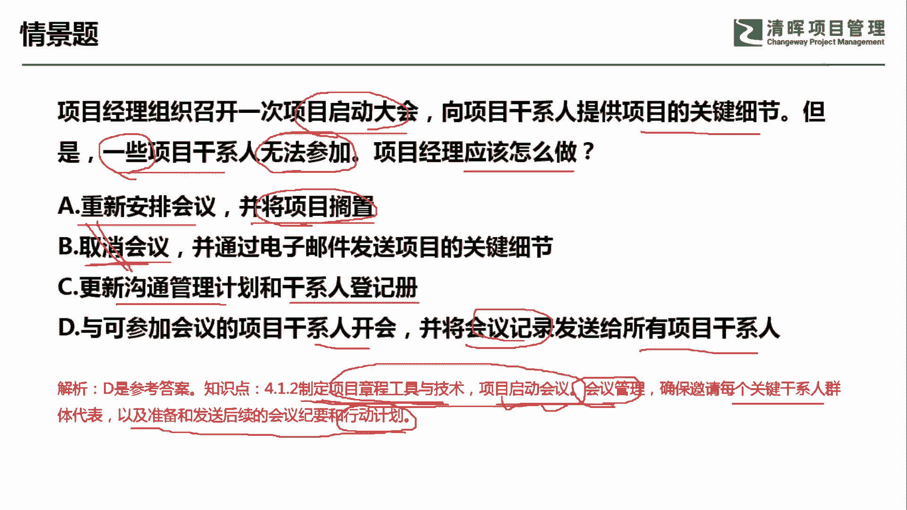

# PMP超干货！超全！项目管理实战工具！ PMBOK工具课知识点讲解！ - P17：会议管理 - 清晖在线学堂Kimi老师 - BV1Qv4y167PH

各位同学大家好，我是宋老师。

今天我们来看会议管理这个工具，会议管理呢它是采取步骤，确保会有效并且高效地达到预期的目标，所以呢它是会采取一系列步骤，来达到他的预期目标的，那会议管理这个工具呢主要是在整合管理的。

制定项目章程和制定项目管理计划，过程中会使用到，以及在沟通管理的管理，沟通的过程中也会用到，但是我们在会议管理的时候有一些步骤，比如说我们在这个规划会议的时候，要注意哪些步骤呢。

第一个你一定是要准备并且发布会议的议程的，也就是说你告诉别人，这个会议呢大概会有几个，这个环节会包含会议的目标，另外呢我们会确保会在规定的时间开始和结束，这个简单的讲就是要做好控场啊。

不要这个延时拖延啊，也不要提前结束，确保呢适当的参与者受邀并且出席，就是邀请正确的人，在正确的时间参加正确的会议，要保持切题，就是不要走题，处理会议中的一些期望问题和冲突。

这个呢就会采取一些冲突处理的方式啊，去处理记录所有行动，以及这个所分配的行动责任人，这个相当于就是说我们在会议上达成了一些啊，行动目标之后呢，我们一定要有这个相关的这个，干系人去跟进去处理。

所以呢这个会议管理呢它就会分为会前筹备，会监管理和会后的收尾的这样三个基本的阶段，那么会议前筹备呢，主要就是会议为什么要去开展他的目标，他的参加者，他的议程，他的这个场所，以及他所要准备的一些材料。

会间的管理呢主要是时间上的控制，主题的控制，要切题，秩序的控制，不要产生一些冲突，然后要避免一些不必要的这种冲突出现，总结成果形成会议纪要，那么会后呢就是把会议纪要整理好。

会议的精神的传达和文件的相关的这个存档啊，这个就是会以管理的他的一些这个节奏。

我们具体来看这样一道题，项目经理组织召开一次项目启动大会，向项目干系人提供项目的关键细节，但是呢一些干洗人无法参加，问项目经理应该怎么做，a选项重新安排回忆并将项目搁置。

首先呢我们这个会议呢因为是启动大会，所以呢我们一般不会去重新安排，然后搁置这个项目，这种呢叫做消极选项，项目经理遇到一系列问题，一定是积极主动的去处理的，他不会去搁置，b选项，那错的更加离谱。

他说取消会议，不能因为一些干型的才无法参加，你就直接取消会议，这个呢更是这个绝对选项了，c选项更新沟通管理计划和干线登一侧，这个呢是我们想到了一些方法，把这个无法参加的干弦这个问题解决掉之后，然后呢。

再去更新一系列的沟通管理计划和干线登一次，这个相当于属于一个输出了，d选项与可参加会议的干系人开会，并且将会议记录，也就是会叫发送给所有的项目干系人，这个呢是可以的，为什么呢，因为他所说的一些肝弦呢。

它并不是说这些干弦是非常关键的，那如果我们遇到的是一些关键的感情，无法参加这个启动大会的话，那我们在这个时候呢，一般是要去这个等待这个重新安排的，因为你这个时候，如果不让关键的干弦去参加会议。

他往往在后期会产生一些不必要的风险啊，我们这道题目呢应该是选择d选项，也就是说我们通过制定项目章程，这个启动会议呢去进行会议管理，确保每个关键的干系人全体代表，以及准备和发送。

后续的会议纪要和行动的计划啊，这个呢其中会议它是项目章程当中的，制定项目章程的一个工具，让我们通过这个会议管理，去把这个相应的会议纪要呢，发送给这些无法参加的干线好。

今天呢主要和大家分享的是这个会议管理工具。

我们下次再见，谢谢大家。

