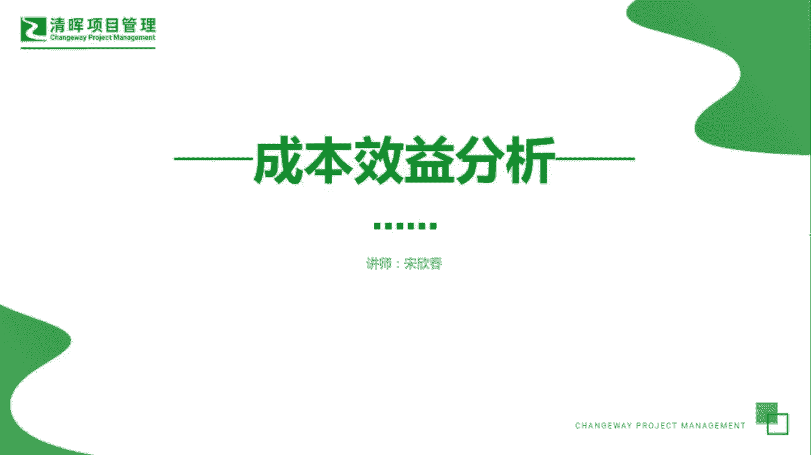
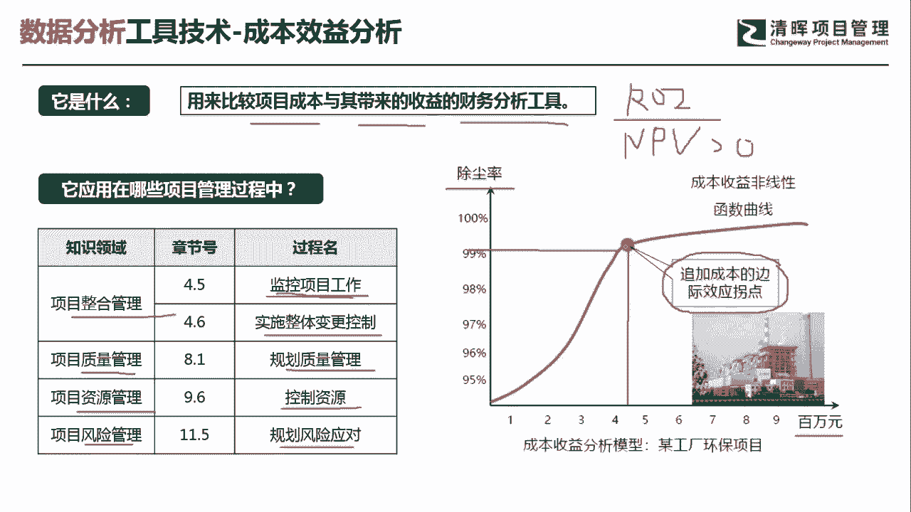
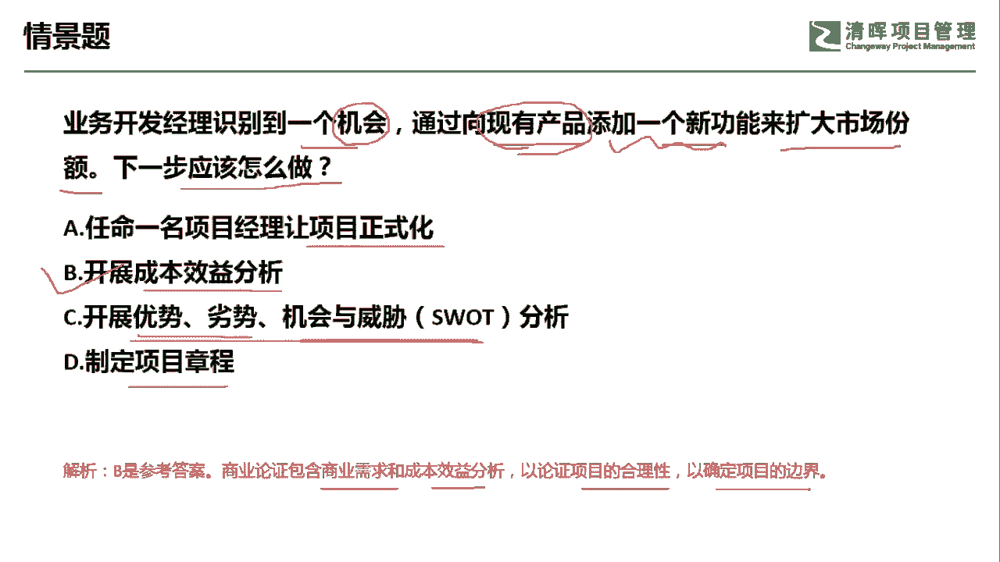

# PMP超干货！超全！项目管理实战工具！ PMBOK工具课知识点讲解！ - P3：成本效益分析 - 清晖在线学堂Kimi老师 - BV1Qv4y167PH

我是宋老师。

今天我们来看成本效益分析这个工具，成本效益分析呢主要是用来比较项目成本，与其带来的收益的一种财务分析工具，比如说我们之前提到的这个r o y，这个呢，其实就是通过成本效益分析得出的一个指标值。

ioi呢代表投资回报率，投资回报率呢一般是大于一个百分比的情况下，我们这个项目呢才是有利可图的，才是值得去启动的，还有呢n p p n p p呢它是代表净现值，净现值呢。

主要是考虑到它的这个时间价值的影响，那比如说3年之后的这个，这个我们的这个收益的净现值，是不是大于这个投入的境界值，如果是大于零的话，我们是也是值得去启动这个项目的好，另外还有一些其他的指标。

其他指标比如说回收期是不是越短越好，它应用在哪些项目管理过程中呢，成本效益分析，它在整个管理的监控项目过程，以及实施整体变更控制过程当中会采用，比如说我们在监控项目过程中，发现一些新的价值增增加点。

我们采用一些新的技术，但是呢我们要考虑的一点是，这个新技术它值不值得去采用，它的成本是不是过高，那这个呢也会采用到成本效益分析，另外就是在实施整体变更控制的过程当中，我们要考虑变更。

你是不是要考虑这个变更带来的影响，那如果他的影响非常大，他得不偿失，那我们也是不会去采用这种变更的，在质量管理的知识领域当中，我们在规划质量管理的时候呢，要考虑到质量的一个平衡点，什么叫质量的平衡点呢。

就是比如说我们要考虑到采用一些这个，评估技术啊，或者说预防技术的时候，那是要花成本的，值不值得去花，那我们要考虑一个这个成本效益分析，在资源管理的知识领域当中，我们在控制资源的时候。

你也要考虑这个资源的这个性价比啊，也就是要考虑到它的成本效益，在风险管理的过程当中，我们要规划风险应对，风险应对呢，我们有这个机会的十种措施，以及威胁的十种措施，那么这些措施呢他也是需要花一定的成本的。

他值不值得去规划啊，值不值得去采用这些技术，那也是要通过成本效益分析啊，比如说我们右边的这张图，它是代表一个这个工厂的环保项目，它进行了一个成本收益的模型分析，纵向呢是代表它的出生率。

右边呢是代表我们的这个投入的一个投资啊，投资投入在这种情况下，除尘率呢，如果我们比如说接近到500万元的时候呢，它的这个出生率已经达到了99%啊，甚至还超过，那要不要再去追加呢，如果你再去追加的话。

对于它的储存率的提高，其实呢已经不是很明显了，所以呢我们一定要求到一个追加成本的一个，边际效益拐点，边际效益拐点，也就是说你过了这个拐点之后，你再去投入的话，其实它并不是特别值得啊。

这个就是成本效益分析的一个核心所在。

我们来看这样一道题，业务开发经理识别到一个机会，通过向现有产品添加一个新功能，来扩大市场份额，问下一步应该怎么做好，通过这个情境呢，我们可以发现呢，它是要向现有产品添加一个新功能。

说明呢它是在监控这个项目过程中，或者说在这个项目的过程中，发现一个新的这种利润增长点，但是呢他不知道这个值不值得去做，值不值得去添加这个新功能，因此我们应该怎么做，a选项，让项目正式化。

这个呢是你决定要让这个项目上马的情况下，b选项开展成本效益分析，你要考虑一下这个新功能呢，是不是who会扩大我们的市场份额，是不是值得去做，那这个呢是要开展一个成本效益分析的，c选项开展优势劣势。

机会和威胁的分析，这其实是在识别风险，在识别风险啊，我们在这种情况下呢，它已经去识别到一个机会了，所以说明这是一个机会，风险已经识别到了，所以不需要再去开展一个识别风险的，这个过程了。

d选项制定项目章程，制定项目章程呢是默认这个项目已经启动了，那在第一个过程，我们当然是要制定项目章程了，但是呢我们这个功能要不要去做，还没有考虑好，所以呢先要去开展成本效益分析。

然后再去考虑这个项目的上马问题好，所以这一题呢我们应该站在b的这个角度，它其实呢是在重新进行一个商业论证，包含了商业需求和成本效益分析，以论证项目的合理性，已确定项目的边界，好。

今天呢主要和大家讨论的是成本效益分析。

这个工具，我们下次再见，谢谢大家。