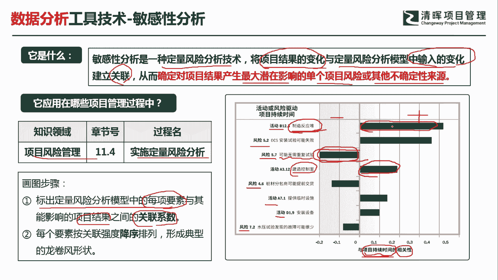
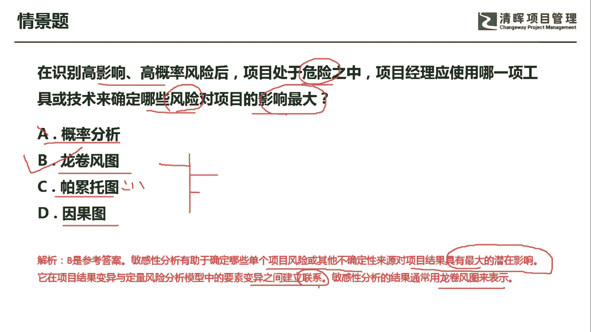

# PMP超干货！超全！项目管理实战工具！ PMBOK工具课知识点讲解！ - P31：敏感性分析 - 清晖在线学堂Kimi老师 - BV1Qv4y167PH

各位同学大家好，我是宋老师。

今天我们来看敏感性分析这个工具，敏感性分析呢是一种定量风险分析技术，它主要是将项目结果的变化，与定量风险分析模型中的输入的变化，建立一个关联，所以这个里面有两个这个变量的关联，一个呢是项目结果的变化。

还有一个呢是这个模型当中输入的变化，从而确定对项目结果产生最大潜在影响的，单个项目风险或其他不确定性来源，这个敏感性分析也是在风险管理的实施，定量风险分析过程中所使用，那我们怎么去用这个敏感性分析呢。

它有一个比较特殊的图形叫做龙卷风图，龙卷风图，那我们首先会标出定量，风险分析模型中的每项要素，与其能影响项目结果之间的一个关联系数，那我们右边的这张图呢，其实就是一个典型的龙卷风图。

你看它的从形状上来看，这个用一个这个叫做条形图的形式，显示出从大到小的一个关联系数，这个图呢它是把活动或者风险的这个驱动，项目的持续时间建立一个关联，比如说左边呢都是一些活动或者风险啊，有活动有风险。

那它和什么进行关联呢，它和项目的持续时间进行了一个关联，这个其实就是它的相关系数了，所以它有正相关，有负相关，负相关呢我们一般放在左边，正相关呢我们一般放在右边，那比如说活动b 12。3。

这个叫做制造反应堆，这个活动，它和项目持续时间的关联性呢是最强的，那我们我们可以发现，它的关联系数已经达到了这个0。5以上，也就是说制造反应堆，它主要的花费时间是比较长的，它和项目的持续时间之间的。

关联性是比较密切的，同样呢我们来看风险风险5。7，比如说他说可能无需重复实验，无需重复实验，那说明呢它和这个项目持续时间的关联性呢，它是负相关的，越不需要重复实践，那我们越花费的时间就越少对吧。

它也是有关联性的，它是负相关负相关，那其次呢我们呢再来看，比如说活动a3。12叫做建造控制室，建造控制室呢他这个时候是要花费时间的，所以呢它和项目持续时间之间也是一个正相关。

所以呢这个就叫做敏感性分析当中的龙卷风图，从这张龙卷风图当中我们可以发现什么呢，对这个项目结果产生最大潜在影响的，那就是制造反应堆啊，这是最大的正向的潜在影响，那最大的负这个比如说负相关的潜在影响呢。

那就是可能无需重复实验，所以通过这张图我们就可以发现，它有这样的特点啊，那每个要素呢它是按照关联的强度呢，进行了一个降序排列，越在上面的它的关联系数的绝对值是越大，形成一个典型的龙卷风的这种形状。

我们来看这样一道题，在识别高影响，高概率的风险之后，项目处于危险之中，项目这里应该使用哪一项工作，哪一项工具或者技术，来确定哪些风险对项目的影响最大啊，他要确定影响最大的风险，a选项叫做概率分析。

概率分析这个没有这个单独的工具，我们一般叫做概率概率矩阵，概率矩阵，这个是属于定性风险分析的一个工具，所以没有a这个工具，龙卷风图，它是这个敏感型分析当中的表现形式。

它可以分析出哪些风险对项目的影响最大啊，用一个这个从上而下的这种形状，那可以表示出来，帕列托图主要是用于质量管理方面，那我们主要是用帕列图图来发现，引起大多数缺陷的少量原因啊，这个呢是二八法则。

二八法则因果图，也叫石川图鱼骨图，它主要是用来发现根本原因的，引起缺陷的根本原因的，我们这个题目呢主要是谈的是风险啊，对项目影响最大的风险，我们可以用定量风险分析当中的龙卷风图来发，现，敏感性分析。

有助于确定哪些单个项目风险，或其他不确定性来源，对项目结果具有最大的潜在影响，它在项目结果变异与定量风险分析模型中的，这个要素变异之间建立一个联系，其实就是关联性，敏感性分析结果通常用龙卷风图来表示。

那因此呢我们这道题应该是选择龙卷风图好，今天呢主要和大家分享的是敏感性分析。

这个工具，我们下次再见，谢谢大家。

