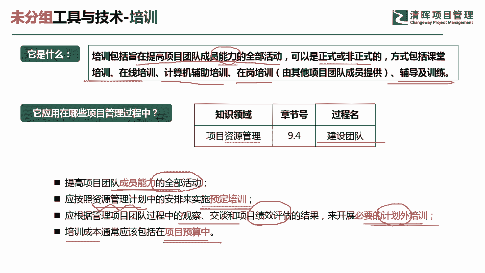
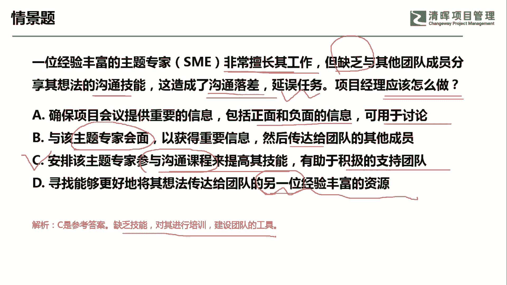

# PMP超干货！超全！项目管理实战工具！ PMBOK工具课知识点讲解！ - P33：培训 - 清晖在线学堂Kimi老师 - BV1Qv4y167PH

大家好，我是宋老师，今天我们来看培训这个工具。

培训呢主要是包括，旨在提高团队成员能力的全部活动，所以它是针对于能力的一种培训，可以是真实的或者非正式的方法呢，包含课堂的培训，在线的培训，计算机辅助培训，在岗培训，辅导以及训练。

这种呢都是全部活动当中的表现形式，所以它主要是针对于团队成员能力的，因此呢他在资源管理当中的建设团队过程中，他会经常用到培训这个工具，因为我们建设团队本身的目标，就是要打造一支高绩效的团队。

因此呢往往是对于员工能力是经常进行培训的，它有哪些具体的表现形式呢，第一个是提高团队成员能力的全部活动，都属于培训的这种范畴，好我们看到在线培训啊，计算机辅助培训，在岗培训辅导及训练。

包括我们的教练技术，都属于培训的一种表现，第二个呢是应该按照资源管理计划中的安排，来实施预定的培训，如果我们安排培训，如果有这个资源管理计划是首先要去做参考的，这是一个有计划的培训。

另外呢我们应该根据管理项目，团队中的一些观察，交谈和绩效评估的一些结果，来开展必要的计划外的培训，这个是说明了，有可能我们需要一些额外的培训，来提升或者弥补，我们绩效评估当中发现的一些问题。

第四个呢是培训的成本，通常应该包括在项目的预算中，这个是什么意思呢，我们前面讲过这个质量成本，质量成本当中包含一致性成本和非一致性成本，其中呢在一致性成本当中呢，我们有考虑到培训的成本。

这个基本上就属于他的预防的质量成本，因为我们培训呢往往是为了，预防质量出现问题的，所以培训成本也是要包括在项目的预算当中。

我们来看这样一道题，一位经验丰富的主题专家，非常擅长及工作，但缺乏与其他团队成员分享其想法的沟通技能，他缺乏这个沟通的技能，造成了沟通的落差，延误了任务，因此项目经理应该怎么做，这个里面情境告诉我们。

他是缺乏沟通技能，导致了沟通落差，延误任务，因此你应该有针对性地对这个技能采取一些措，施，a选项，确保项目会议提供重要的内容，包括正面和负面的信息，可以用于讨论，这个呢没有针对于我们的沟通技能进行提升。

他还是没有解决到根本问题，b选项与该主题专家会面，已获得重要信息，然后传达给团队的其他成员，这个是什么意思呢，相当于就是说，项目经理在当中扮演了一个传话筒的角色，但是呢这个不是一个最好的方法。

我们应该让他去直接去进行沟通，这样效果会更好，而且本应该是这样去做，不应该让项目经理在中间传话啊，不能传达c选项，安排该主题专家参与沟通课程来提高其技能，有助于积极的支持团队。

这个呢参与沟通课程其实就是一种培训的方式，就是用培训的这个工具，可以提升你的沟通技能，避免以后再出现延误任务这种现象，d选项，寻找能够更好地将其想法传达给团队的另一位，经验丰富的资源。

就相当于替换了这个专家，这个呢一般我们是不要去选他的项目经理，遇到问题呢，首先去解决这个问题，实在不行再去找替换，但是这种人往往也不建议去选，因此我们这道题目呢应该是选择c选项。

实际上采取的是沟通技能的培训，缺乏技能对其进行培训，这是建设团队的工具，好今天的主要和大家分享的是培训这个工具。

我们下次再见。

