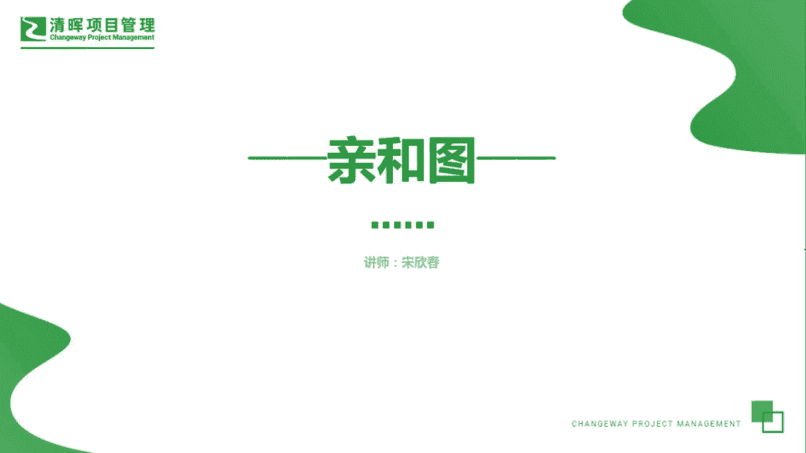
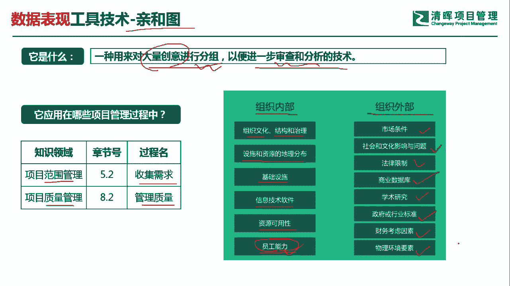
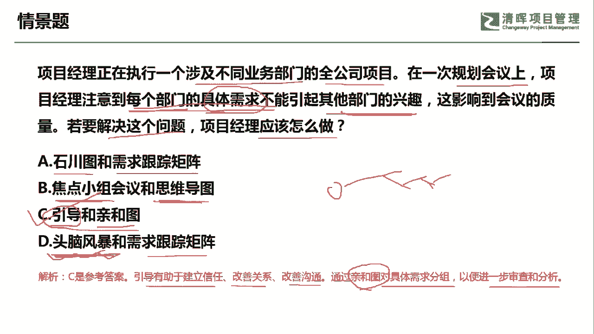
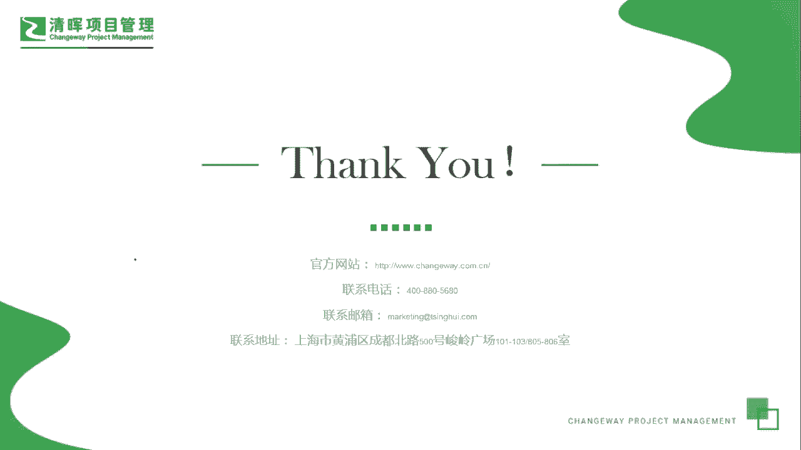

# PMP超干货！超全！项目管理实战工具！ PMBOK工具课知识点讲解！ - P34：亲和图 - 清晖在线学堂Kimi老师 - BV1Qv4y167PH

各位同学大家好，我是宋老师。

今天我们来看清河图这个工具，清河图是一种用来对大量创意进行分组，以便进一步审查和分析的技术，那么这个大量创意从哪里而来呢，大量的创意一般是从头脑风暴得出，然后呢我们清河图对这个头脑风暴的结果呢。

进行了这个分组，然后审查和分析，所以呢清河图它是一种归纳的这种技术，它和思维导图正好相反，思维导图呢它正好是演绎的，它通过激发新的创意啊，这个清河图，它在范围管理的搜集需求过程中会使用。

比如说我们搜集需求的时候，先用头脑风暴，然后呢对于头脑风暴的结果进行一个归纳总结，这个时候就会用到清河图了，在质量管理的管理质量过程中，如果我们发现有大量的质量的缺陷，那要对于缺陷进行分析的话。

我们就会用到氢和图对它进行分组分类，右边的这个事业环境因素，我们也是通过清河图对它进行了分组，比如说我们会把事业环境因素分为，组织内部的和组织外部的两类，这个事业环境因素。

组织内部呢有这个组织文化结构和治理，还有设施和资源的地理位置分布，包括设施的这个基础设施，哪些基础设施会影响到我们的项目的这个进展，信息技术，软件资源的可用性，还有员工的能力，像这些呢都属于组织内部的。

比如说这个员工能力在什么情况下会有提升呢，我们在建设团队，管理团队和这个监督资源的时候，这些员工能力的都会得到进一步的更新，比如说通过培养培训，我们打造了员工的新的能力。

那这个时候你会发现现环境因素也会更新，组织外部的事业环境因素呢向市场条件，社会文化影响问题，法律的限制，商业数据库，学术的研究，政府或行业标准，财务考虑因素，物理环境要素，这些都属于组织外部的。

这个对于项目会产生一些制约因素。

影响的这个事业环境因素好，我们具体来看这样一道题，项目经理正在执行一个涉及不同行业部门的，全公司项目，再一次规划会议上，项目经理注意到每个部门的具体需求，不能引起其他部门的兴趣，这影响到会议的质量。

若要解决这个问题，项目经理应该怎么做，每个部门的具体需求不能引起其他部门的兴趣，那这个时候呢我们就要去进行谈判，协商好，怎么去解决呢，a选项实穿图和需求跟踪矩阵。

石川图一般用于我们发现引起缺陷的根本原因，需求跟踪矩阵呢，我们一般是对于需求的一个追溯文件，大家对于需求有争议的时候，我们可以用需求跟踪矩阵来做一堆参考资料，b选项焦点小组会议和思维导图。

焦点小组呢主要是了解双方或者多个干洗，对于某个具体需求的一些期望和态度，但是呢我是不是能解决他们的这些这个差异呢，这个焦点小组呢一般是解决不了的，它只能是发现问题。

思维导图它主要是这个演绎出新的一些创意啊，思维导图呢一般是从一个主题出发，然后呢分支再往下去设想好，它是主要是演绎激发新的创意，引导和清河图引导技术，它和焦点小组有相似的地方。

就在于他们都需要一个主持人来控场，那么引导小引导这个会议呢，它更多的是了解双方的或者多个干系人的，这个不同的观点之后啊，为什么比如说他们不能引起其他部门的兴趣，然后呢进行协调，进行协商，进行谈判。

最后呢能够达成一致啊，形成落地的方案，清河图刚才我们说过了，他主要是对于这些这个需求啊，或者说缺陷啊，进行进一步的分组归类，所以呢我们遇到每个部门的具体需求，不能引起其他部门的兴趣。

那我们就要去对于这些具体需求，来进行一个归纳总结，d选项，头脑风暴和需求跟踪矩阵，头脑风暴主要是初步的激发新的创意，激发新的创这个初步的这个了解我们的需求好，因此呢这道题目呢。

如果是要解决这个大家对于具体需求，不能引起其他部门兴趣的这个问题，那我们要通过引导和亲和土来去解决，因为引导呢它是有助于建立信任，改善关系，改善沟通的，接下来会通过清河图对于具体的需求进行分组。

以便进一步的审查和分析好，因此呢我们这道题目呢是选c选项，今天主要和大家分享的是清河组这个工具。

我们下次再见。

