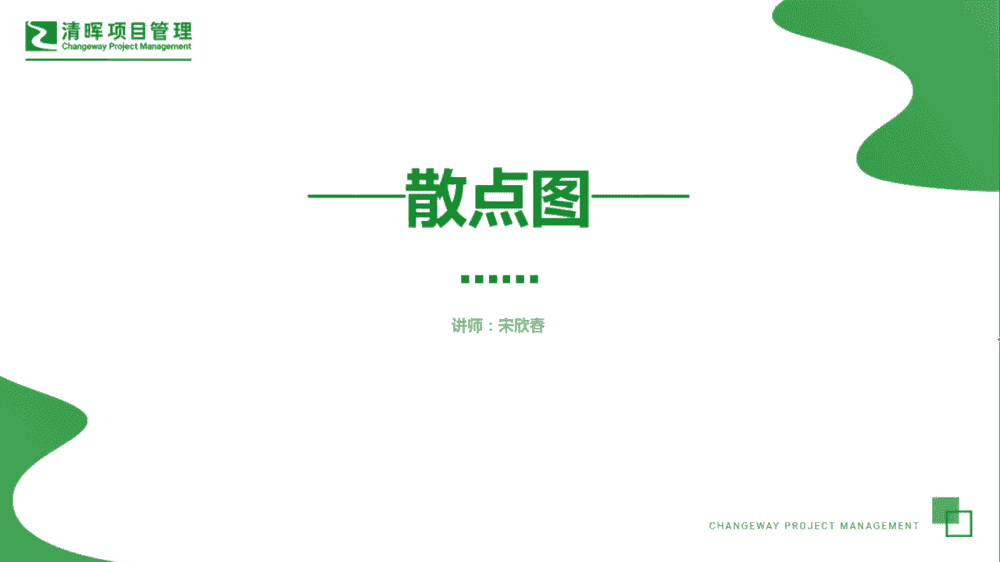

# PMP超干货！超全！项目管理实战工具！ PMBOK工具课知识点讲解！ - P36：散点图 - 清晖在线学堂Kimi老师 - BV1Qv4y167PH

大家好，我是宋老师，今天我们来看散点图这个工具。

散点图呢它有时候也叫做关联图，它是一种展示两个变量之间的关系的图形，所以呢这个里面只有两个变量，三点图，它一般在质量管理的管理，质量和控制质量过程中所使用，我们经常所说的一元回归，像这种y等于x加b呢。

就是一个最简单的一个散点图的表现形式，那我们可以表现出哪几种形式呢，一个呢是强的正相关，什么叫强的正相关呢，强是代表他们紧密，这个点呢比较密集，正相关呢是代表随着比如说x的增大，y呢也是逐渐的增大的。

它是一种向右上角这个行径的一条直线趋势，弱的正相关呢，它呢首先也是正相关，但是呢它的这个紧密程度啊，不如强相关那么紧密啊，关系不如他们那么强，所以呢一般这个这个相关系数呢，可能是更加小一点啊。

相关系数我们一般用r来表示强的负相关呢，这个是和强的正相关正好相反的，随着x的增大，y呢是逐渐的减小的，弱的负相关，它是关系更加弱一些，呈现这种负的表现形式，零相关x和y之间没有任何的这种趋势展现。

他们没有什么关联，非线性相关呢，这是代表一种曲线形式，生活当中其实这种图形也是蛮多的，散点图，它是不是以这种直线形式呈现的，但是呢也是有关联性好。

我们来看这样一道题，在执行质量控制的项目经理，希望了解一个变量，是否会对另一个变量产生影响，项目经理应该使用什么基本的质量工具，来确定这个问题，基本的质量工具他问的比较明确，就是质量工具。

我们右边的这个左边的这个散点图控制图，帕列多图流程图，都是属于这个我们的基本的质量工具，三点图呢我们刚才所说的，它是代表两个变量之间的关联性，所以呢我们可以去了解这个一个变量。

是否会对另一个变量产生影响，这个是可以考虑的，控制图呢主要是他是了解你质量过程是否稳定，还可以去预测你未来的质量的绩效，发现你质量是否失控，它是代表质量过程稳定性的，我们这道题我没有提到质量稳定性。

帕雷多图呢它也叫做特殊的直方图，它其实呢是对于直方图呢进行了一个啊排序，进行了一个排序，同时呢它有累积的频率，累积的频率，它主要是发现引起大多数缺陷的少量原因啊，少量原因，少量云引起的大多数缺陷。

比如说有这个两个前面两个这个缺陷的，导致他80%的缺陷，那两个原因是什么原因呢，你就可以非常直观的去看出来流程图呢，它是代表你要去寻找哪一个流程节点，出现的质量问题的时候会去使用。

或者说他要去规划你的质量管理的时候，也会用这个流程图来先梳理它们之间的关系，好我们发现各个点当中是否有质量问题的时候，按图索骥的时候，你就可以用流程图了，我们这道题目呢并没有提到，我们要寻找质量问题点。

因此呢我们可以考虑散点图，因为它是展示两个变量之间关系的一个图形，好今天的主要和大家分享的是散点图这个工具，我们下次再见。

