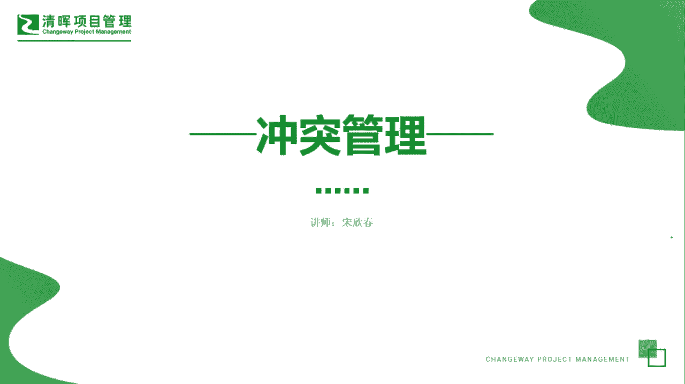
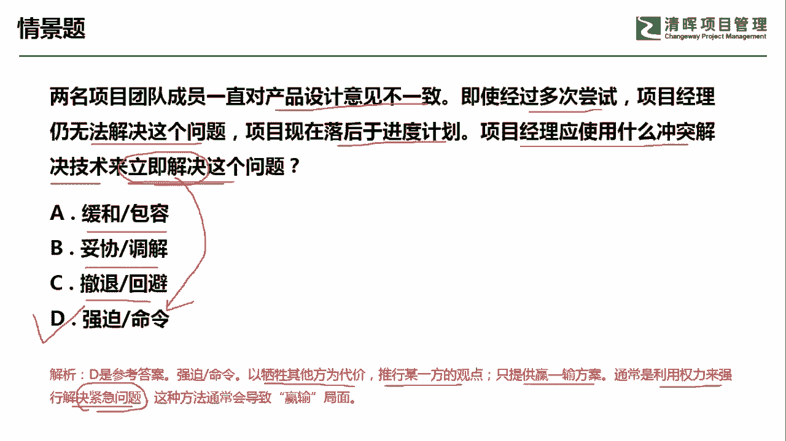

# PMP超干货！超全！项目管理实战工具！ PMBOK工具课知识点讲解！ - P4：冲突管理 - 清晖在线学堂Kimi老师 - BV1Qv4y167PH

今天我们来看冲突管理这个工具。

冲突管理呢首先在项目的环境中，我们冲突是不可避免的，有时候呢冲突还会提升我们的团队绩效，那冲突的来源呢包括资源的稀缺，比如说这个双方都需要某些重要的工程师，那这个呢也是一种冲突进度优先级的安排。

比如说我们的活动，有些活动是不是应该放在前，有些活动是不是应该放在后，那双方也会产生一些不同的意见，还有就是个人的工作风格会产生一些差异，那有的人性格比较急，有的人性格呢是比较比较温和。

那工作的风格也会形成一种冲突，但是呢我们可以采用团队的一些基本规则，还有团队的一些规范，成熟的项目管理实践来去减少冲突的一些数量，那冲突管理呢它在哪些知识领域会用到呢，第一个在整合管理的知识领域。

比如说我们在制定项目章程的时候，有时候也会遇到一些不同的意见，在制定项目管理计划的时候也会产生一些冲突，另外在资源管理的知识领域当中，涉及到建设团队，管理团队，那这个里面呢涉及到人的因素。

冲突有时候会更加多一点，沟通管理呢同样也会在管理，沟通的过程中遇到冲突，管理在干系人管理的知识领域当中呢，管理干系人的参与，比如说降低一些干弦的抵制，提升一些干弦的知识，这本身就是一种冲突管理。

但是呢在我们pp当中呢，冲突管理它会怎么考呢，第一种考法就是考他的这个冲突。

管理的应对流程，比如说我们遇到冲突的时候，首先应该由谁来去处理，当然是由当事人私下去面对面好，通过谈判，比如说通过谈一下，我们开个会议啊，或者吃一顿饭，我们私下来去谈判，去把这个问题先解决掉。

但是呢也有一种可能就是说谈判解决不了，怎么办，谈判解决不了，那这个时候呢再让pm去介入，这个时候呢就需要pm去接入了，但是有时候呢pm介入也处理不了，那这个时候呢只能由他的直属上级。

一般我们讲的都是由他的直属职能，部门的上级去处理，或者由公司的内部政策去处理啊，这个是站在冲突处理的流程角度，另外还有一个维度呢，就是站在冲突管理的五个处理方法的角度，比如说有这样几个方法。

第一个叫做撤退回避，遇到冲突的时候，我们可不可以去退出呢，可以就是从实际或潜在冲突中先退出，让双方先冷静一下，我们等到问题，这个条件准备充分的时候再去处理，或者呢我们索性就将这个问题呢。

推给其他人员去解决，交给第三方去解决，也是一种冲突处理的方式，第二种方式呢叫做缓和包容，缓和包容呢它一般是站在人际关系的维护角度，那我们强调一致而非差异，维持和谐的人际关系而退让一步。

一般就是求同存异好，第三种处理的方法呢叫做妥协调解，妥协调解呢它是为了暂时或者部分的解决冲突，寻找能让各方都在一定程度上满意的方案，但是这种方法呢有时候会导致双输的局面，这是什么意思呢。

他其实是站在双方各退50%的角度，所以呢其实双方心里面都是没有完全的，达到他的目标的，所以它是一种双输的这种局面，但是要注意它和缓和包容的区别啊，缓和包容呢是维持和谐关系，求同存异的妥协。

调解呢它是暂时的或部分的解决冲突，双方各自满足了一部分，第四种处理方式呢叫做强迫命令，强迫命令呢，它是以牺牲其他方为代价而推行一方的观点，只提供赢或输的方案，这是什么意思呢，我只听取一方的观点。

那一方就是站在上风，一方呢肯定是站在下风，这种处理方式呢有它的特定的使用情景，就是遇到紧急情况，我们只能用权利来强行解决紧急的问题，比如说一些遇到一些紧急的这个呃冲刺阶段，或者呢风险马上即将来临。

这个时候呢我没有时间去协商，没有时间去回避，那只能是强迫命令，第五种处理方式呢叫做合作解决，合作解决呢，这个方式呢它是综合考虑了不同的观点和意见，采用合作的态度和开放式的对话，引导各方达成共识和承诺。

这种方法可以带来双赢的局面，但是这种方法呢也是比较耗费精力的，所以遇到紧急情况呢，我们一般不适用于用合作解决的方式，而直接用强迫命令，但是如果这道题目呢，他没有提到这个时间上。

或者说一些资源上的一些这个限制，那我们当然是采取合作解决的方式啊，这种呢是最好的一种冲突处理的方法，好我们来看这样一道题，两名团队成员一直对产品的设计意见不一致，即使经过多次的尝试。

项目经理仍无法解决这个问题，项目现在落后于进度计划，项目经理应该使用什么冲突解决技术，来立即解决这个问题，看了吧，这个冲突呢，这个冲突呢它其实是告诉我们要立即去解决的。

而且他之前呢是采用了多次的这种尝试，所以我们要抓住关键词立即解决，那基本上你就可以知道，我们用什么样的方式去进行冲突处理了，a选项缓和包容，这个是这个缓和人际关系，大家求同存异，妥协调解呢。

双方各退一步，各自满足50%，但是是双输的撤退回避，它是等到条件成熟的时候再去处理，或者交给第三方，其他相关方去处理，但是呢我们这一题呢很显然立即解决，是符合强迫命令这样的特点的，我们这一题呢是选择d。

以期称其他方为代价推行某一方的观点，只提供赢或输的方案，通常是利用权利来强行解决紧急问题，通常是解决紧急问题，也就是我们立即要解决这个问题，因此呢我们是选择d选项好，今天呢主要是和大家分享的是冲突管理。

这个工具。

我们下次再见。