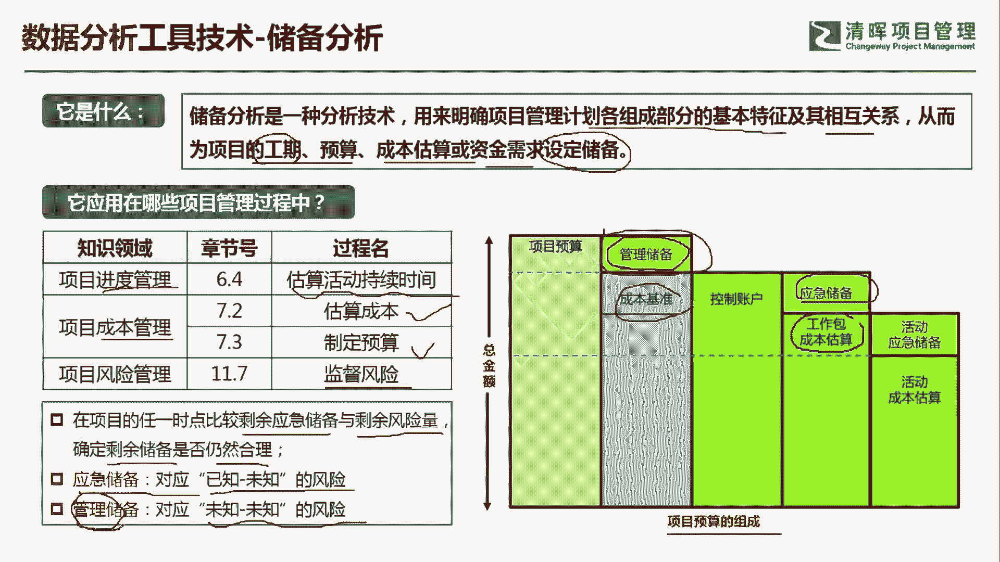
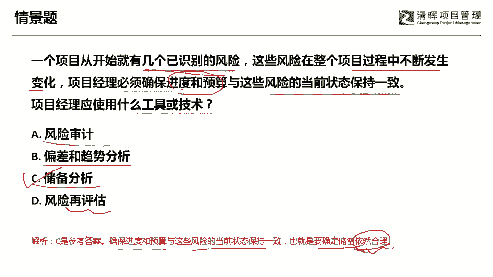

# PMP超干货！超全！项目管理实战工具！ PMBOK工具课知识点讲解！ - P5：储备分析 - 清晖在线学堂Kimi老师 - BV1Qv4y167PH

各位同学大家好，我是宋老师。

今天我们来看储备分析这个工具，储备分析呢它是一种分析技术，主要是用来明确项目管理计划，各个组成部分的基本特征及其相互关系，从而为项目的工期预算，成本估算或资金需求设定储备。

储备分析主要是在进度管理的估算活动，持续时间，也就是说我们经常所说的这种工期考虑的时候，会用到储备分析，以及在成本管理的估算成本，制定预算的过程中所使用，比如说我们看到这个右边的这张图。

我们是来制定项目的预算，但项目的预算呢包含这样几个部分，一个呢是管理储备，一个呢是成本基准，但是呢我们如果考虑到成本基准的话，设定成本基准的话，我们一般是不会把这个管理储备包含在内的，成本基准。

它只会包含这个应急储备和工作包，的一些成本估算，但是如果我们考虑整个项目的预算的时候，从上至下，那你应该把这个管理储备考虑在内，它其实也是我们这个项目整体的一个资金需求，好。

另外呢在风险管理的监督风险的过程中，也会用到储备分析，因为在这个时候呢，我们是在项目的任何一个时点，会去比较你的剩余的应急储备与剩余的风险量，看看你的这个储备能不能应对，以后的这个剩下的这些风险。

所以呢我们会确定剩余的储备是否仍然合理，因为我们的这个风险呢它本身有两种风险，一种呢就是我们所说的叫已知的未知风险，这种风险呢我们知道它存在，但是并不知道它在什么情况下会发生。

所以呢我们用的是应急储备来应对，另外还有一种风险叫做未知的未知风险，超出了我们当前的认知，我们并没有只知道这个风险会存在，也不知道这个风险呢在什么情况下会出现，所以呢我们只能用管理储备来应对它。

这个时候呢，我们申请管理储备是需要走变更流程的，这个地方大家一定要注意，就是应急储备的使用不需要走变更，项目经理直接这个可以控制，那但是你要用到管理储备的话，这个时候呢是需要提交变更的。

因为它本身不是我们的成本基准的一部分。

好我们具体来看这样一道题，一个项目从开始就有几个已知的这个，已识别的风险，这些风险在整个项目过程中不断发生变化，项目经理呢必须确保进度和预算啊，进度和预算与这些风险的当前状态保持一致。

也就是说你无论风险怎么样，我的进度不会变，我的预算也不会变，项目经理应该使用什么工具或技术，a选项，风险审计，风险审计呢主要是审查风险的管理流程，是否合规啊，你的风险管理计划是否有效。

但是我们这道题目呢是要确保这个进度和预算，与风险的当前状态保持一致，这个时候呢你就要考虑进度，考虑预算，这个里面都含有这个储备，看它是不是能够合理，这个时候呢，其实应该是考虑到储备分析的偏差和趋势。

分析呢主要是发现你的这个进度啊，成本啊，范围是否有偏差，以及他未来的一些发展趋势，我们在这个时候呢，这题呢其实主要是考察的是监督风险，监督风险，监督风险呢，我们并不是说这个风险它导致了什么，这个范围啊。

进度啊，成本有偏差，而是说我要看你的这个进度和预算，能不能应对这个将来出现的这些风险，够不够用好，因此呢我们应该是考虑储备分析风险在评估，其实有时候也叫做风险review，就是风险审查。

它主要是考虑你的风险应对措施是否有效，以及呢有没有出现一些新的风险，关闭已经发生过的一些风险，总结一些经验教训好，我们这个情境当中也没有提到这一块，你的风险应对措施是否有效。

因此呢我们这一题呢是考虑到储备分析，它是要确保进度和预算，与这些风险的当前状态保持一致，也就是要确定储备是否依然合理，依然合理好，今天呢主要和大家分享的是储备分析这个工具，我们下次再见。

