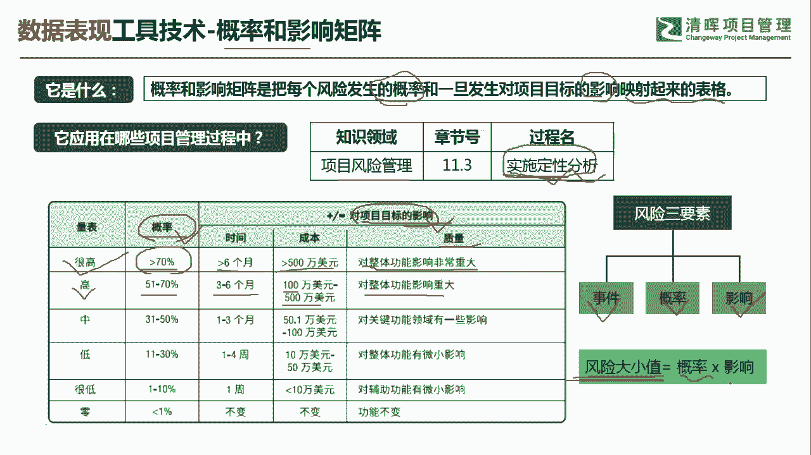
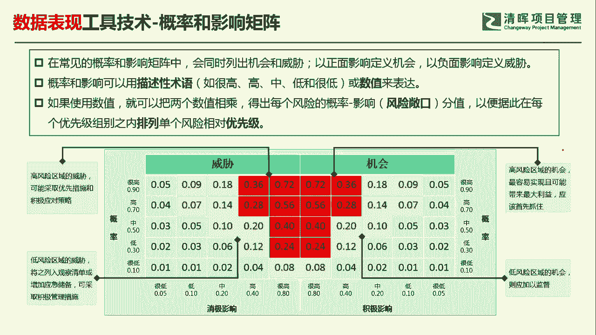
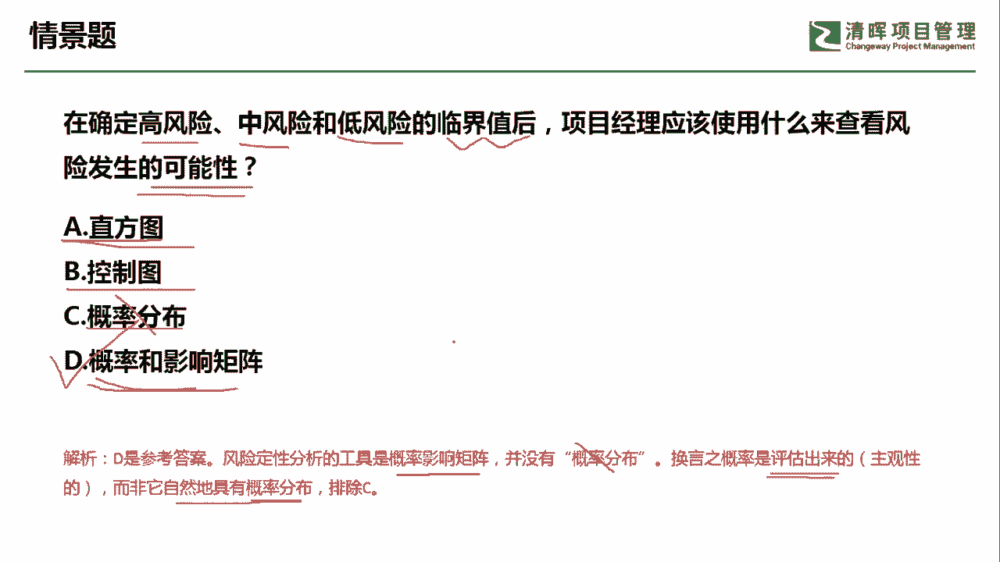

# PMP超干货！超全！项目管理实战工具！ PMBOK工具课知识点讲解！ - P7：概率和影响矩阵 - 清晖在线学堂Kimi老师 - BV1Qv4y167PH

呜各位同学大家好，我是宋老师。

今天我们来看概率和影响矩阵这个工具，概率和影响矩阵呢，主要是把每个风险发生的概率和一旦发生，对项目标的影响能够映射起来的一个表格，所以它是一个矩阵形式，概率和影响矩阵，它是在风险管理的实施。

定性风险分析过程中所使用，所以它是一个定性分析工具，不是一个定量分析工具，不要看到概率好像就想到是一个定量，不是这个意思，定性风险分析呢它的主要目的呢，它其实就是为了识别风险的这个优先级啊。

能够抓住高优先级的风险，那么这个概率和影响是怎么界定的呢，概率和影响呢其实它是主观来界定的，比如说他认为呢这个概率大于70%，在时间进度上大于六个月，比如说他拖延六个月，或者呢成本是在大于500万以上。

或者呢质量呢，它是描述成对整体功能影响非常重大，像这种描述呢，就是代表对项目目标的影响非常大，概率呢一般在70%以上，我们认为的就是一个高概率事件，由概率和影响两个因素来判定。

在我们的这个风险的这个优先级上，我是把它列为很高啊，这种呢是把它列为很高的，如果你发现这个概率呢，它在百分之这个51~70%之间，那么有可能它的进度呢，或者时间呢是在拖延了3~6个月。

或者呢它的这个成本是大于了100万，在50万 500万之间，或者呢你发现它的质量描述呢，是对整体功能影响重大的，那这类的这个风险呢，它其实在风险的优先级上就显示成是高的好，以此类推，这样的话。

我们就可以去判断一下这个风险的大小值啊，所以我们风险的有三个要素，一个呢是概率和它的影响，风险的大小值呢等于概率乘以它的影响。

我们书上呢其实有一张这个，概率和影响矩阵的表格，我们可以具体来看一下，在常见的概率和影响矩阵中，我们一般会同时列出这个机会。

风险和威胁的风险，因为他们两个都可以是风险，以正面影响定义机会，以负面影响的定义威胁，这都是可以带来这个收益或者损失的风险，概率和影响呢可以描述，可以用一些描述性的术语，比如说这个很高啊，高啊。

中低很低来描述，也可以用呢一些数值来表达啊，一些数值来表达，那我们怎么来看这个值呢，像这个里面如果使用数值的话，就可以把两个数值相乘，这两个数值呢是指影响的数值，和概率的数值相乘，它们下面都有数值。

比如说你认为呢它是一个很高，那我们可以界定为十，影响的是0。8，那如果概率是很高的，我们可以界定为0。9，刚才我们所说的这些值呢，是你主观把它定义出来的，而不是你测量出来的，你测量出来的。

其实呢就是概率和影响了相乘的值，它代表了风险敞口，风险敞口就是它的这个值的大小，那我们通过这个值呢，就可以分辨出这些风险的相对优先级，比如说我们来看威胁，威胁当中有一个这个0。18，0。

18怎么得出来的，它其实是概率的0。9乘以，这个消极影响了0。2，这样得出来0。8，0。36等于概率的0。9乘以呢，这个影响的消极，影响的这个很高的影响了0。4，那这个等于0。36很低呢。

这个地方有一个0。01，0。01，怎么得出来，其实是0。1x0。05，那算出来是0。005，但是呢我们四舍五入等于0。01，好我们得出了这些具体的风险敞口的值之后呢，你就可以抓住一些高优先级的风险。

比如说我们抓住0。36，0。28等等，这边红色区域的全部都是高优先级的风险，当然包括威胁，当然也包括机会，那具体说它这个为什么是划分为红色区域，为什么划分为黄色区域，这个呢是事先我们界定的。

在某个区间内我们就认为是高风险，在某个区间内认为是中风险或者低风险，所以呢这个就是概率和影响矩阵的一些用法，这样你就可以从容的去抓住这个单个风险的，这些优先级了，相对优先级了，我们具体来看这样一道题。

在确定高风险中风险和低风险的临界值之后，项目经理应该使用什么，来查看风险发生的可能性，查看风险发生的可能性，那这个呢其实呢是风险发生的可能性，这个呢属于定性的概念，不是一个定量的概念。

直方图直方图呢它主要是一个质量工具，主要是发现这个引起缺陷的主要原因，它和帕列托图一样，帕里图图呢它是特殊的这个直方图，它是有排序的，那我们单独的讲直方图，它一般是没有排序的。

控制图呢也是一个控制质量的工具，它主要展示你的质量过程是否稳定，然后预测未来的质量绩效概率分布，没有这个工具，这是一个陌生词汇，我们可以考虑概率和影响矩阵啊，这个呢是对应你的风险发生的可能性的大小。

风险定性分析的工具有这个概率和影响矩阵，没有概率分布，所以刚才我们所说陌生词汇的是首先排除掉，换言之呢，概率是评估出来的，什么评估出来的，它其实是主观界定的，而非它是自然具有的概率分布。

所以我们这一题是选d选项，通过概率和影响矩阵，来判断你的风险发生的可能性的大小，好，今天呢主要和大家分享的是概率和影响矩阵，这个工具，我们下次再见。

