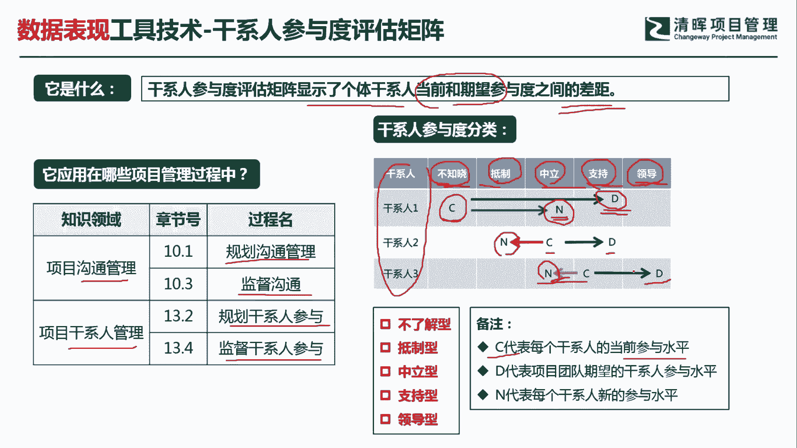
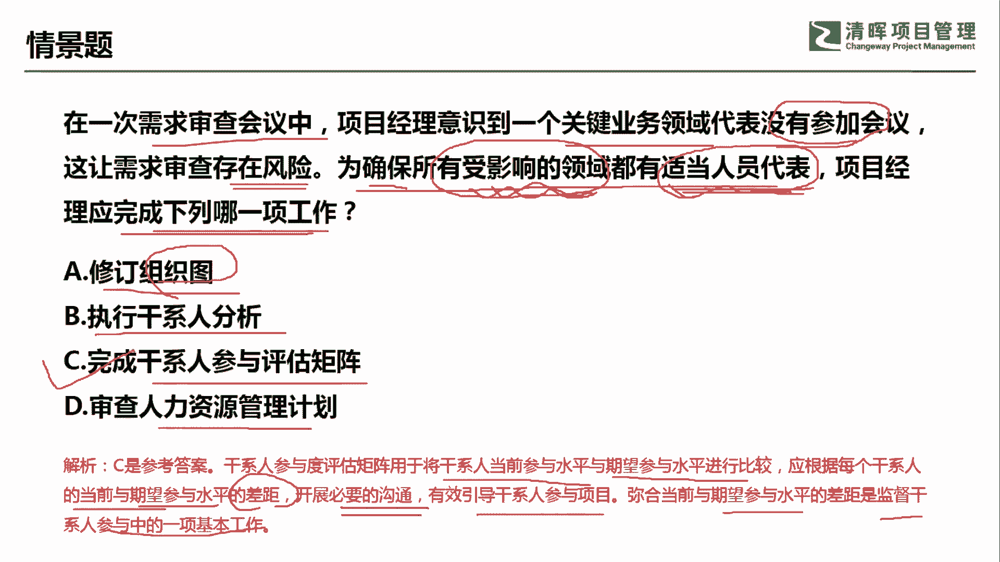

# PMP超干货！超全！项目管理实战工具！ PMBOK工具课知识点讲解！ - P8：干系人参与评估和矩阵 - 清晖在线学堂Kimi老师 - BV1Qv4y167PH

各位同学大家好，我是宋老师。

今天我们来看干系人参与度评估矩阵这个工具，干系人参与度评估基站，它主要是显示了个体干系人，当前和期望参与度之间的一个差距，所以这个矩阵主要是代表一些差距方面的问题。

干系人参与评估矩阵主要是在沟通管理的规划，沟通管理以及监督，沟通和干系人管理当中的规划，干系人参与和监督干系人参与当中会使用，那这个矩阵怎么使用呢，首先我们对于干系人的这个参与度呢，我们会有五种分类。

分别是不知晓抵制中立支持和领导，那么不知晓呢，往往是代表他压根就不知道这个项目的存在，或者说这个项目的影响，抵制呢是代表他是反对这个项目的啊，它是制肘，或者说它是这个给项目带来一些麻烦的。

这样的一个参与度，中立呢它是不置可否，我也不支持，我也不抵制，那么支持呢是代表我们的参与度呢是非常的高，而且呢它是这个积极的去推动支持，最后一种参与度呢叫做领导型，领导型的这个参与度呢。

它其实是自带驱动力的啊，我们书上有这句话，就是说要保证项目的成功，我们的干涉呢必须要到达零领导型，这个参与程度才行啊，这个地方我们要注意一下好，纵向的这个矩阵当中的纵向呢，一般是代表干线的名称。

横向的这几个字母呢是代表c，是代表它的当前参与水平，current啊，我们的期望，design in呢是代表new它的新的这个参与水平状态，比如说干线一，我们在一开始规划的时候呢。

希望他从这个当前的这个不知晓，到达这个知识的参与度，但是呢他新的参与程度呢变成中立了，说明没有达到我们的这个期望，说明一定是有问题的，我们要进行沟通啊，去监督同样干线二，我们从一开始的这个中立。

期望它到达支持，但实际上他现在的参与度反而是抵制了，说明问题更大啊，更要去重点关注感弦三的，我们期望他从支持到达领导，但是他也是往回走了，到达中立了，那说明也是有问题的，这个时候呢。

我们就必须去这个监督沟通和监督干线的参与。

我们来看这样一道题，在一次需求审查会议中，项目经理意识到，一个关键业务代表没有参加会议，这让需求审查存在风险，为了确保所有受影响的领域，都有适当的人员代表，项目经理应该完成下列哪一项工作。

他要确保所有受影响的领域，都有适当的人员代表，那就说明有适当的人员参与a选项修订，组织图，组织图呢，它本身是属于资源管理计划当中的一个内容，它不是一个这个呃工具啊，不是一个工具，执行干弦分析。

执行干弦分析呢，我们是可以去了解他为什么没有参与这个会议，但是呢你是不能确保有影响的领域，都有适当的代表参加的啊，这个呢其实就是你分析它，但是你不能这个知道某些人。

他应该在什么情况下去这个代表受影响的领域，c选项完成干弦参与度评估矩阵，完成干弦参与评估矩阵，我们就可以在这个矩阵图上知道跟每个干弦，他这个当前的参与，以及这个我们所期望的参与。

还有中间所出现的一些偏差，所以这样的话我们就可以确保呢，所有受影响的领域呢，都有适当的人员去做代表啊，都有人参加，d选项，审查人力资源管理计划，首先不是资源缺失啊，不是资源的异动。

所以呢不需要去审查人力资源管理计划，因此呢我们这一题呢应该是选择c选项，干型人参与的评估矩阵，用于将干系当前参与水平与期望水平进行比较，应根据每个干系人当前的参与水平。

这个与期望水平的这个差距开展必要的沟通，所以呢他没有参加会议，就说明了他的参与是有问题的，开展必要的沟通，有效地引导干事人参与项目，弥合当前与期望水平，期望参与水平的差距。

也是监督干协参与中的一项基本工作，所以呢我们这道题呢，其实一个是考的是监督沟通，一个呢是考的是这个监督干事的参与好，要让他去做适当的代表，因此呢这一题呢我们应该选c选项好，今天呢主要和大家分享的是。

干线参与度评估矩阵这个工具。

我们下次再见，谢谢大家。

