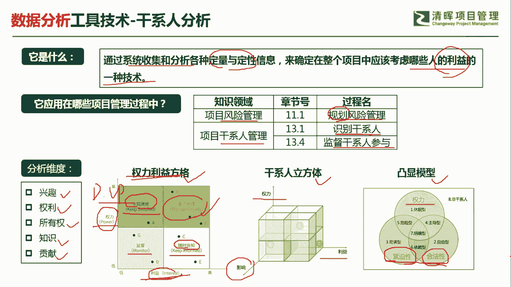
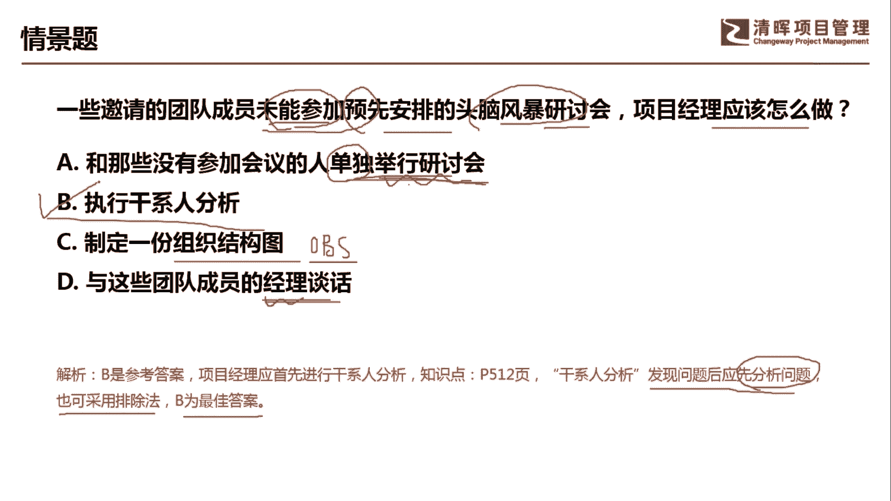

# PMP超干货！超全！项目管理实战工具！ PMBOK工具课知识点讲解！ - P9：干系人分析 - 清晖在线学堂Kimi老师 - BV1Qv4y167PH

各位同学大家好，我是宋老师。

今天我们来看肝细分析这个工具，干系人分析呢主要是通过系统搜集和分析，各种定量和定性的信息，来确定在整个项目中，应该考虑哪些人的利益的一种技术，他其实呢关注的还是利益会比较多一点，干线分析这个工具。

它是在风险管理的规划，风险管理过程中，以及干线管理的识别，干系人和监督干事参与过程中所使用，那为什么在风险管理的危化，风险过程中会考虑这个干线分析呢，因为大家要知道，不是所有的干线它都会支持你的项目。

有时候呢它会带来一些阻碍，所以呢它是一种风险，你要考虑到这个因素存在，另外识别干线的时候，当然理所当然要进行肝弦分析，这样的话你才知道这个干弦它是处于什么地位，他的影响力或者说他的兴趣在哪里。

监督干事参与的时候，为什么也要用干性分析呢，因为我们在这个识别干线的时候呢，会考虑一个干系人的参与度评估矩阵，比如说这个干系人他原来是这个支持的，但是到最后呢他为什么反对了。

那这个时候呢我们就要进一步的进行干事分析，了解原因所在，一般的干弦分析的维度呢有这样几个，一个呢就是兴趣点，还有他的权利，所有权，他的知识，他的贡献，他的影响等等，最常见的这个干线分析的表现形式呢。

有这样几个，一个是权利利益方格，一个呢是干弦立方体，还有一个呢是凸显模型，那么最经常出现的这个情景题，是考的是这个权利利益方格会比较多一点，它是从权利维度以及利益维度来，把我们的干系人呢划分为四个象限。

分别是权利比较高，利益相关度也比较高的这种群体呢，我们是要重点管理它，那manage closely，重点管理这样的干系人，什么叫权利比较高呢，一般我们说这个director或者呢vp这些级别呢。

我们相对来说是权力比较高的，所以我们情景题当中如果出现这样的这个人物，那默认它是权力比较高的，接下来你就看它的这个前提，描述这一类的这个干洗，他对于项目呢是否比较关注，如果是非常关注。

那说明它的利益相关是比较高的，因此要重点管理，还有一种呢就是说他权利比较高，但是呢这个项目跟他的利益关联度不是特别高，那我们呢要keeps satisfied，也就是令其满意，令其满意是什么意思呢。

就是让他觉得还是比较受到重视的啊，你还是把他放在眼里的，这个人让他感觉到还是比较舒服的啊，虽然他对于这个项目来说没有什么利益关注点，但是呢你要令其满意，不然的话也会产生一些问题，还有一种是权力不高。

但是利益相关的也比较高啊，比如说我们的这个团队成员，那我们要keep informed，随时告知，随时保持这种沟通，最后一种呢是这个monitor，也就是我们要监督好它，它权力不高，利益相关度也不高。

比如说嗯你要去拜访你的甲方客户，那门口的保安算不算一个干系人，当然也算，因为这样的这个干系人呢，有可能会给你带来一些意想不到的这个麻烦啊，他比如说他不让你进啊，或者说告诉你一些错误信息啊，啊。

所以这个权利力方格呢，经常会这个从权利和利益的角度，来给我们出一些情景题，让你判断应该用什么样的方式来管理你的干系，人，干性的立方体，它是在两个维度的基础上加了一个维度啊，权利利益再加上一个影响。

这个呢考的比较少，但是大家知道一下即可凸显模型，也就是说我们在这个分析维度方面呢，我们重点关注哪一些这个凸显的这个维度点，比如说关注他的权利，来关注他的合法性，它是否跟这个项目紧密的关联。

这个项目呢是否对他来说是有些紧迫性啊，这些呢就是特别关注的某一个维度点，那这个呢就是用凸显模型。

我们具体来看这样一道题，一些邀请的团队成员，未能参加预先安排的头脑风暴研讨会，项目经理应该怎么做，未能参加，我们看到这样的题目，你首先头脑当中有这样一个反应，他为什么没有人参加对吧。

为什么没有人参加a选项，和那些没有参加会议的人，单独举行研讨会，单独举行研讨会，这个地方是未能预先安排的头脑风暴研讨会，就是未能参加预先安排的头脑风暴研讨会，他是没有参加，你这个时候是单独举行研讨会。

其实呢这只是措施之一，最根本的应该是怎么样了解它的原因，也就是说我们要执行一个干事人分析，感谢分析，了解他为什么当时没有能参加这个预先安排的，这种会议，d选项，制定一份组织结构图，组织结构图呢。

它是属于我们规划资源管理的一个工具，叫做o b s o b s organizational breakdown structure，它主要是规划资源管理的工具，主要是代表一些这个部门的一些角色职责啊。

这个起不到干先分析的这个效果，d选项与这些团队成员的经理谈话，其实就上升到和他的直属上级进行沟通了，我们遇到问题，首先第一步应该与当事人进行沟通，了解他的原因对吧，我们不行的话，再去项目经理介入。

再不行，找他的这个经理，因此呢我们这道题目呢首先要去找原因，进行干弦的分析，干线分析它是发现问题后先分析问题啊，我们也可以用排除法b呢是最佳的答案，好，今天呢主要和大家分享的是干弦分析这个工具。

我们下次再见。

