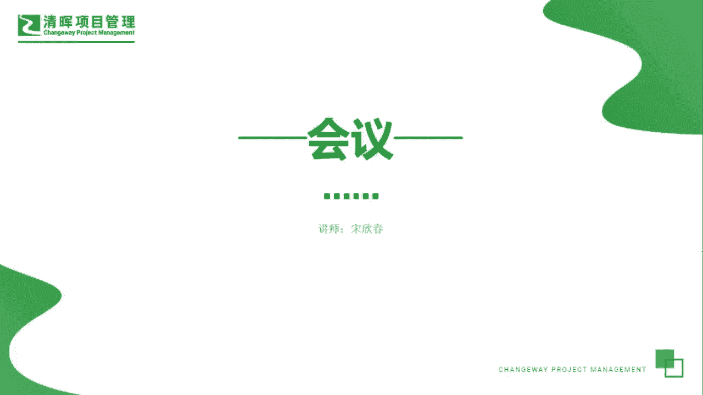
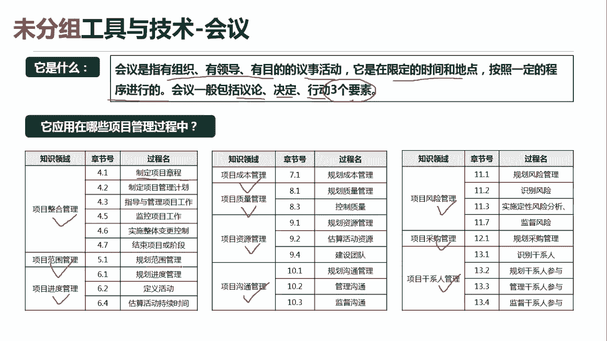
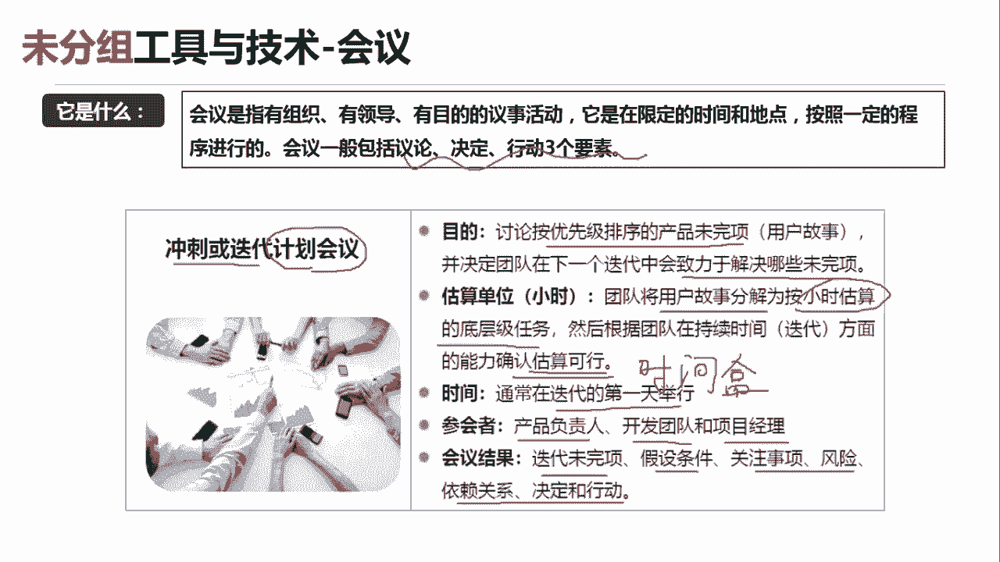
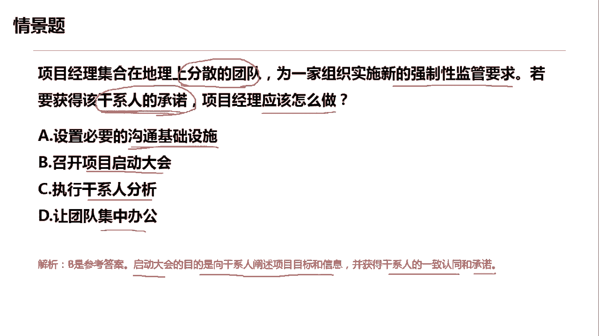
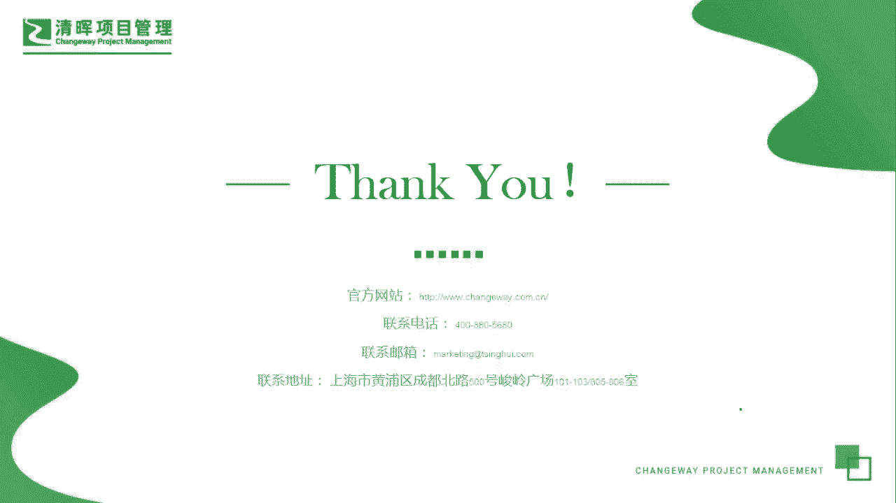

# PMP超干货！超全！项目管理实战工具！ PMBOK工具课知识点讲解！ - P16：会议 - 清晖在线学堂Kimi老师 - BV1Qv4y167PH

各位同学大家好，我是宋老师。

今天我们来看会议这个工具，会议它是指有组织，有领导，有目的的一个意识活动，它是在限定的时间和地点，按照一定的程序进行的，会议一般会包括议论，决定行动三个要素，那么这三个要素是会议的这个普遍的形式。

会议这个工具呢，它普遍地应用于我们的十大知识领域当中，比如说整个管理范围管理，进度管理，成本管理，质量管理，资源管理，沟通管理，风险管理，采购管理和干线管理，所以呢它是在十大知识领域当中。

都会出现的一个工具，但是呢虽然形式一样，但是每一个知识领域，他的会议的内容它是不一样的，比如说在整合管理的制定项目章程的过程中，我们需要去制定项目章程啊，有可能呢我们就需要开展这个制定项目章程的。

会议内容，在范围管理当中呢，我们在规划范围管理的时候，也要进行讨论，怎么去规划你的范围管理，这就是范围管理的会议，所以呢在不同的知识领域，它的会议内容是不一样的，形式是一样的啊。

这个是我们要注意的一个这个点，我们来举个例子啊，这个冲刺或迭代它是在敏捷当中的一个概念，冲刺和迭代呢也有一些计划或者叫做规划会议，他的目的，比如说会讨论按照优先级排序的产品未完成项。

并决定团队在下一个迭代中，会致力于解决哪些这个优先级的未完成像啊，这是冲刺或迭代计划会议的一个主要的目的，它的估算单位呢，一般是团队将这个用户故事分解为，按照小时来估算的底层级的任务。

然后根据团队在持续时间方面的能力，确认估算可行，那一般呢它估算出来之后呢，会有一个这个叫做时间和的概念，时间和就是time box，时间和时间和呢，主要的就是说我们在每一个时间段内去完成呃。

哪些用户故事，那你这个时间和内用户故事没有完成的话，我们只能放到下一个时间和当中去完成，他的时间呢，开奖时间呢，一般是通常在这个迭代的第一天去举行，参会者可以由产品负责人，开发团队和项目经理去参加。

会议的结果就是迭代未完成项假设条件，关注的事项，风险依赖关系决定和行动，那这个呢就是在冲刺或迭代的时候，他的一个计划会议计划规划会议，所以呢它的内容是不一样的，但是都会有他的议论决定行动，这些要素好。

我们具体来看一道题，项目经理集合在地理位置上分散的团队，为一家组织实施新的强制性监管要求，若要获得该肝心人的承诺，像目经理应该怎么做好，这道题目呢，我们从情景上来看，它是地理位置上分散的团队。

说明说它是一个虚拟团队，然后呢需要得到干系人的承诺，说明要有这种承诺，达成某种约定，在这种情况下，项目这里应该怎么做好，如果要获得承诺的话，交流方式去达成承诺，这样是比较正式的而且严谨的。

a选项设置必要的沟通基础设施，这是从沟通的基础设施上来看，这个呢只是一种沟通渠道的这个建设，它不是一个这个互动式的这种方式，b选项召开项目启动大会，这个呢就是kiko meeting。

ko meeting呢它的主要目的呢，它主要就是为了达成大家对于项目管理，计划或者目标的统一认知，并且呢彼此之间形成一种承诺，那为了我们下一步执行这个计划做好准备，因此呢b选项是可以考虑的。

c选项执行干线分析，什么时候执行肝细分析呢，如果我们发现该情人有一些反对，有一些特殊的期望，那我们要寻找原因的话，我们就要执行干线分析，那我们这道题目呢主要是获得承诺，那所以和干性分析没有直接的关联。

d选项，让团队集中办公，集中办公呢只是我们管理团队的一种方式，那一般在我们接近某一个关键里程碑的时候，我们可以采用集中办公，因为它的工作效率，相对于这个虚拟团队来说会更高一点，好这道题目呢。

我们综上所述呢，应该选的是b选项，项目启动大会，他的目的就是向干系人阐述项目的目标和信息，并获得干系人的一致认同和承诺，好今天呢我们给大家讲的是会议这个工具。

先讲到这里，谢谢大家。

