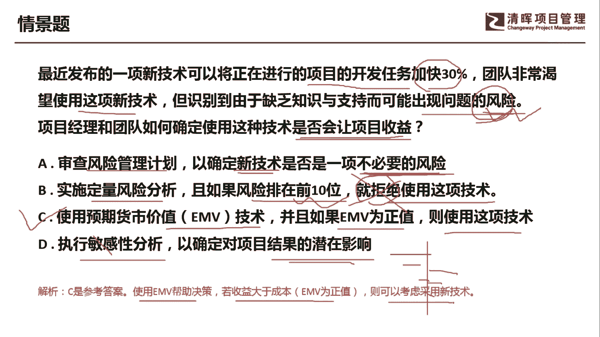

# PMP超干货！超全！项目管理实战工具！ PMBOK工具课知识点讲解！ - P26：决策树分析 - 清晖在线学堂Kimi老师 - BV1Qv4y167PH

各位同学大家好，我是宋老师。

今天我们来看决策树分析这个工具，决策树分析呢它是一种图形和计算技术，主要是用来评估与一个决策相关的多个可选方，案，在不确定性情况下的一些可能后果，所以呢这里面有几个关键信息，一个呢它是用来评估一。

一个与决策相关的多个可选方案，然后呢在不确定性情况下的一些可能后果，所以它也是一个风险分期的工具，那它是在风险管理的定量，风险分析过程中所使用，它不是定性，风险分析是定量，为什么是定量呢。

因为当我们在做一些决策的时候是非常谨慎的，他一定是要非常理性，所以呢我们是要通过这个详细的计算，然后得出一些结论之后再去做决策，所以如果我们在情景题当中发现，这是一个这个财务方面的一些两难选择的时候。

往往呢我们就选择决策树分析这个工具，那么决策树分析呢有一个非常重要的代表工具，叫做e ma e mv呢，它叫做这个预期货币价值分析，注意啊，不是e v m，e v m呢叫做政治管理。

这个呢叫做e mv呃，expected monetary value analysis，这个是e mv的缩写，那e mv呢它主要是分析，当某些情况在未来可能发生或不发生的时候。

我们计算平均结果的一种统计方式，机会的emv呢它通常表示政治，为什么机会因为可以带来一些正的收益，而威胁的这个e mv呢则表示为负值，为什么呢，威胁的e v往往是会带来一些损失，所以它是负值。

那e mv呢它是建立在风险中立的假设基础上的，它既不避险也不冒险，他只是把一些客观结果呈现出来，然后呢做决策是由高层来做决策，我们可以把每个可能的结果的数值呢，与其发生的概率相乘。

这个里面的概率呢其实它就是情景概率，比如说在某些情况下，这个情景它可能发生的概率是多少，那我们就把这个可能的结果与这个概率相乘，就可以了，然后再把所有乘积相加，就是所有的结果把它相加起来。

这样我们就可以得出这个项目的emma了，所以呢这个技术通常在决策树分析当中使用，因为你这样可以得出一个理性的结果，这个就是定量风险分析，我们来看右边的这个决策，它是新建或者扩建一个厂房。

那有两条主要的这个路径，选择一个呢是建设新厂，他投资呢先投资1。2亿美元，还有一种呢是扩建旧厂，他会投资0。5亿美元，但是呢我们发现它是会带来一个机会的，它有个机会节点说明了我们。

无论是这个建新厂还是扩建旧厂呢，它其实呢都可以会带来一些收益，都可以带来一些收益，但是至于说你怎么去做决策，那你就要看你的收益的大小，这种题目呢它一般有两种考法。

一种考法呢就是让你得出预期货币价值是多少，还有一种考法呢是考你的进度性价值，什么叫进度性价值呢，我们这个地方呢呃有两条路径，一个是建设新厂，一个是扩建旧厂，两条路径，那么每一条路径它的进路径价值呢。

其实就等于每条路径的这个收益减去成本，相当于就是得出了一个这个纯收益啊，纯收益，你这样可以看出，像我们建设新厂呢，有强需求情况下的一个这个收益，和弱需求下的一个收益，那我们得出它的这个纯收益呢。

进度性价值呢，就是比如说强需求它是2亿美元的，这个收益减去1。2亿，你投资这个建新厂，它有一些成本，那你得出8000万，这个是你的进度性价值，注意啊，这个地方的进度性价值，它是没有乘以你的情景概率的啊。

如果乘以情景概率呢，我们这个地方强需求的情景概率，是60%的概率，你如果乘以它呢，就得出强需求的这个预期货币价值了，同样如果需求的货币预期货币价值呢，它等于你这个地方呢，因为是收益是9000万。

那你减去你的投资是1。2亿，得出来是负的3000万，这个是你的弱需求的进度性价值，这样你就得出这个机会节点下的，这个预期货币价值呢，就是负的30000000乘以零40%的概率。

那我们乘以这个40%之后呢，你要得出整个的建设新厂的，他的决策节点的这个预期货币价值呢，就是把强需求的e m v加上弱需求的e m v，也就是0。6x8000 8000万，加上0。4乘以负的3000万。

这样你就可以得出，建设新厂的这个总体的e mv呢是3600万啊，3600万的这个纯收益，同样扩建旧长呢，我们可以得出来，他的这个呃纯收益呢是4600万，4600万，然后我们做出一个最后的这个决策决策。

建新厂还是扩建，那么在这种情况下，你可以发现呢，我们扩建旧长呢，它的这个收益呢是更大，所以优先选择这个扩建救场这个决策，所以决策树分析的基本上就是这个用法啊，它可以拆开来考，刚才我说了。

第一个呢他直接考某条路径的进度性价值，那你就用收益减去成本就可以了，还有一种呢就是靠他这个某条路径的这个呃，预期货币价值，预期货币价值，这样的话你要考虑里面的情景概率，情景概率乘以它啊。

用你的情景概率乘以了你的进度性价值，这样把每条路径的进度性价值加起来，就得出每一条路径的这个mv了。

好我们具体来看这样一道题，最近发布的一项新技术，可以将正在进行的项目的开发任务加快，20%，团队非常渴望使用这项新技术，但是识别到由于缺乏知识和支持，而可能出现问题的风险啊。

这个这个新技术呢可以带来一些好处，但是呢也会带来一些风险，项目经理和团队如何确定使用这种技术，是否会让项目收益呢，这个其实就是一个两难选择，a选项审查风险管理计划，已确定新技术是否是一项不必要的风险。

这个呢不是i d to，不是i d to，我们审查风险管理计划，主要是应对怎么样去管理好这个风险的存在啊，所以不会去确定这个新技术，是否是一项不必要的风险，这个呢其实是一个嗯干扰项，其实是一个干扰项。

我们一般呢会做一个什么样的分析呢，这个其实呢这一题呢是一个风险题，他已经告诉你，它可能会出现一些风险了，那我们就按照风险题的i t t我去选择b选项，实施定量风险分析，如果风险排位在前十位。

就拒绝使用这项技术，这是一个主观的想法啊，没有说排多少位，我们就直接拒绝的，没有这种说法，你排一位，排前三位，难道就应该接受吗，啊没有这个判定，c选项使用预期货币价值ev技术，并且如果ev为正值。

则使用这项技术，说明呢e a为正值，说明可以带来一些收益，d选项是执行敏感性分析，以确定对项目结果的潜在影响，对项目结果的潜在影响呢，它一般是用的是这个敏感性分析，当中的龙卷风图。

那他会把所有对项目结果的潜在影响呢，用龙卷风图的形式把它排列出来排列出来，这样你选择对他影响最大的因素，但是我们这道题目呢没有列出来，所有的这个对项目结果，这个所有影响的因素，所以你不可能用敏感性分析。

那敏感性分析呢，也是属于定量风险分析的一个工具，因此呢我们这道题目呢如果做两难选择，然后你发现e mv有正值，我们可以使用这个风险技术，因此呢是选择c选项，使用ea帮助决策，若收益大于成本。

也就是emm为正值的时候，就可以考虑采用这个新技术了，好，今天呢主要和大家分享的是这个预期，货币价值分析，也就是我们的决策树分析，我们今天先分享到这里。

