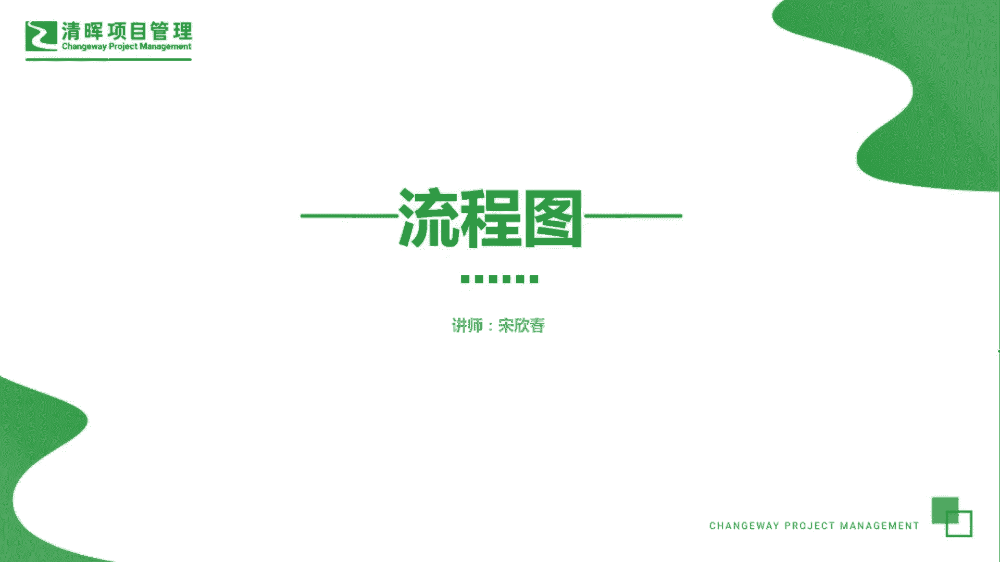
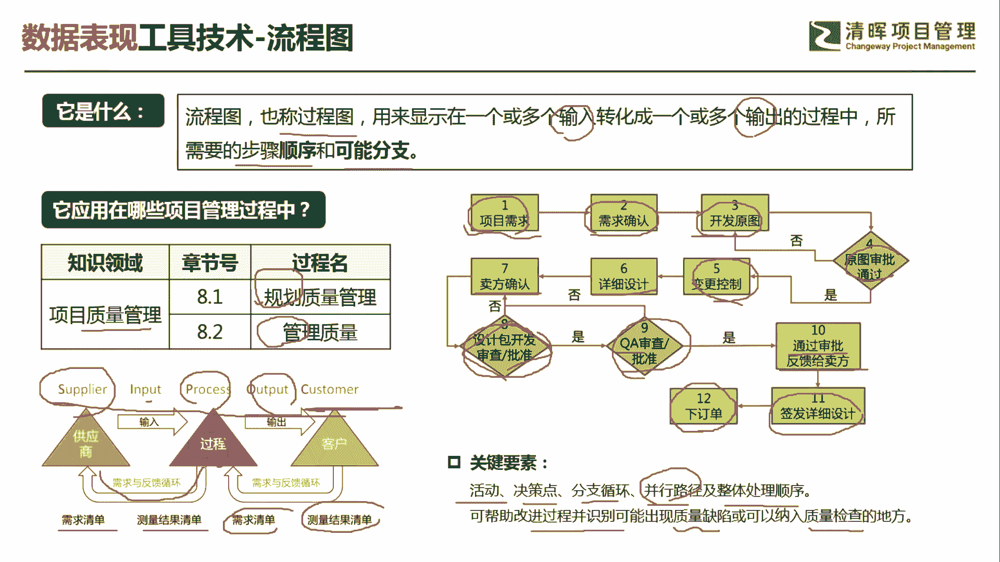
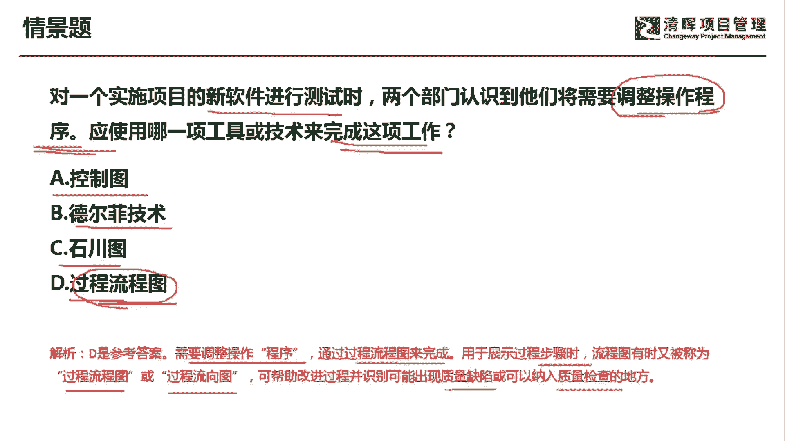
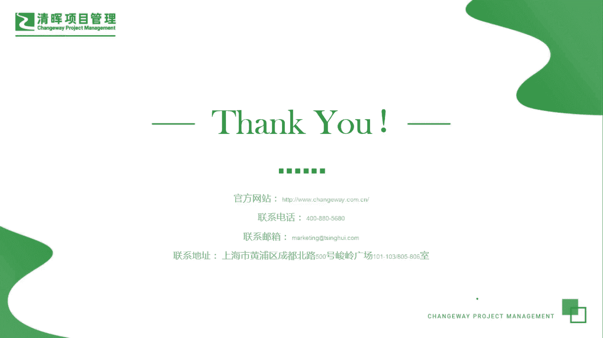

# PMP超干货！超全！项目管理实战工具！ PMBOK工具课知识点讲解！ - P29：流程图 - 清晖在线学堂Kimi老师 - BV1Qv4y167PH

各位同学大家好，我是宋老师。

今天我们来看流程图，这个工具，流程图也称为过程图，它是用来显示一个或多个输入，转化成一个或多个输出的过程中，所需要的步骤顺序和可能的分支流程图，这个工具主要是在质量管理的规划。

质量管理以及管理质量过程中所使用，比如说我们经常所说的s i p o c流程图，它是从供应商输入，然后呢有一个过程得到输出给到谁，给到客户，给到客户，他都是从需求清单。

作为一个这个供应商的一个这个输入之后呢，会得到一个测量结果，清单，测量结果清单呢是从这个过程中得到的反馈啊，包括我们给到客户也同样有一个需求清单，然后由客户来得到一个反馈，得到测量结果的清单。

这个是代名发明的一个这个s i p u c流程图，我们书上呢还有一个流程图也是比较通用的，比如说项目的需求开始搜集，得到需求的确认，开发原图，也就是我们开发的原型，再去确认一下原图，审批通过之后呢。

我们就形成基准，进入到变更控制流程，详细的设计，卖方确认确认之后，比如说确认之后，我们要设计包，要开发审批批准批准之后呢，q a就是我们的quality assurance，就质量保证部门再进行审批。

这样部门审批之后进入到卖方这个流程中啊，卖方的签发详细的设计，然后呢下订单，这个呢也是一个流程图的表现形式，所以呢流程图它有一些关键要素，就是有活动，有决策点，像这个菱形表示的就是它的一个决策点。

有适合，否则这种判定分支的循环并行路径，以及整体处理顺序并行路径，有的路径呢它是并行开展的啊，并行开展的，所以呢这个是它的一个关键要素之一，可以帮助的是改进过程，并且识别可能出现质量缺陷。

或者可以纳入到质量检查的地方，好在每一个这个流程活动当中呢，我们都可以设计一些这个检查的环节，然后发现它是否产生了一些缺陷，好这个主要设置流程图的一些关键要素，以及我们如何去使用这个流程图。

其实他也是给到我们一个按图索骥的，一个这样的一个一个抓手。

一个工具，我们就可以知道哪些环节出现了一些问题，来看这样一道题，对一个实施项目的新软件进行测试时，两个部门认识到他们将需要调整操作程序，应该使用哪一项工具或者技术来完成这项工作，这里面提到调整操作程序。

这个呢其实也是要通过流程来进行调整，a选项控制图，控制图呢主要是发现我们质量过程是否稳定，它其实是控制质量的一个工具，也可以预测我们未来的质量绩效，德尔菲技术呢主要是避免数据的偏移。

它主要是采取专家匿名的方式，进行多轮次的这种搜集数据，那最后呢达成相对比较合理的一种判定，石川图主要是发现根本原因的，那时传图也叫做鱼骨图或者yy图啊，我主要是为什么为什么多发现几个。

为什么这个两个部门认识到，将需要调整操作程序，那我们如何完成这项工作呢，操作程序其实就是流程，我们可以通过这个流程图的方式去进行解决啊，d选项他说的是叫过程流程图，这个呢也不错啊，也不错。

因为流程图它有几种说法，过程图，流程图，过程流程图都可以，好意思呢，我们这道题目呢应该选择的是d选项，需要调整的是操作程序，也就是我们通过过程流程图来完成，用于展示过程步骤时，流程图有时候也被称为过程。

流程图或者过程流向图，可以帮助改进过程，并且识别可能出现质量缺陷，或者可以纳入到质量检查的方面，好今天的主要和大家分享的是流程图这个工具。

我们下次再见。

