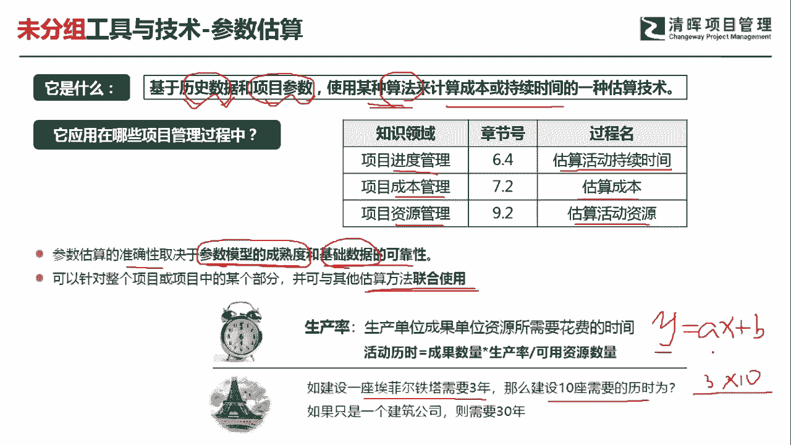
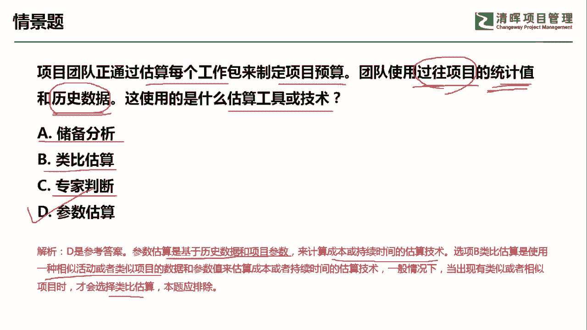

# PMP超干货！超全！项目管理实战工具！ PMBOK工具课知识点讲解！ - P2：参数估算 - 清晖在线学堂Kimi老师 - BV1Qv4y167PH

各位同学大家好，我是宋老师。

今天我们来看参数估算这个工具，什么是参数估算呢，它主要是基于历史数据和项目的参数，来使用某种算法，来计算成本或者持续时间的一种估算技术，所以呢它有几个因素，一个呢它是有历史数据和项目的一些参数。

然后用某种算法参数估算这个工具，它在进度管理的估算活动，持续时间以及成本管理的估算，成本和资源管理的估算活动，资源过程中都会用到参数估算，所以呢有时候我们看到这个。

如果有一些历史数据或者有一些统计模型的话，那基本上都是用参数估算，但是呢参数估算它的准确性呢，它是取决于你参数模型的成熟度，那什么是要参数模型的成熟度呢，也就是说你的参数模型，它是不是经过时间的考验。

它的这个这个准确度大概能达到多少，比如说99%的拟合程度，那我就认为这个参数模型相对就比较成熟了，还有就是我们搜集的这些基础数据，它的这个可靠性好，可靠性，这是什么意思呢，如果你的模型它再成熟。

但是呢你搜集或者说输入的数据，它的可靠性是有问题的，不太准确的，那你的参数模型其实就没有使用价值了，我们可以针对整个项目或者，项目中的某些部分呢，可以与其他的估算方法进行联合使用。

比如说我们还可以有紫霞上的估算，或者呢就是由这个贝塔分布啊，三角分布啊，这些都可以联合进行一个估算，好比如说我们这个埃菲尔铁塔，那如果建设一座埃菲尔铁塔需要3年的话，那么建设十座需要它的历史时间。

那这个呢其实就是啊3x10，这种呢也算是一个参数模型啊，我们经常说学的一些函数，比如说y等于ax加b那这些都属于参数模型。

好我们具体来看这样一道题，项目团队正在通过估算每个工作包，来制定项目的预算，团队使用过往项目的统计值和历史数据啊，他问的是这使用的是什么估算工具和技术，这道题目当中呢，我们发现它使用了过往项目的统计值。

那说明了过往项目呢是有一些经验教训的好，还有一些历史数据，所以在这种情况下，最好的方式呢就是应该用参数估算储备，分析呢，主要是分析你的这个应急储备和管理储备，它是否可以应对当下的一些风险。

或者说当下的一些进度的情况，类比估算呢，它也有专门的适用情景，一般呢是参考到一些这个相似的一些项目啊，相似的一些项目，或者呢一些行业内的一些标杆来进行对照学习，但是它是比较粗略的，专家判断呢。

可以认为是一种自上而下的一种估算，它呢相对比较粗略一些，他也不会用到这个具体的统计值啊，这个呢我们是专门适用在这个参数固件当中的，所以呢我们这道题目呢应该是选择参数估算，它是基于历史数据和项目的参数。

来计算成本或持续时间的一种估算技术，这个选项当中呢这个类比估算呢，它是使用一种相似的活动或者类似项目的，数据和参数值，来估算成本或者持续时间的一种估算技术，一般的情况下，我们当有类似或者相似的项目时。

我们才会选择这个类比估算，所以我们这一题呢应该是选择参数估算好，今天呢主要和大家分享的是参数估算这个工具，我们下次再见。

