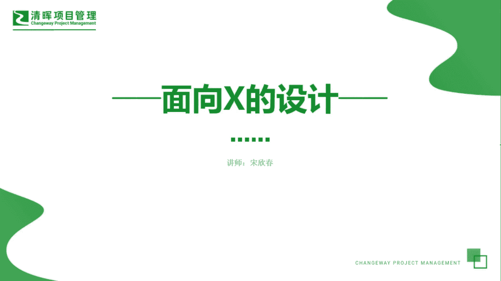
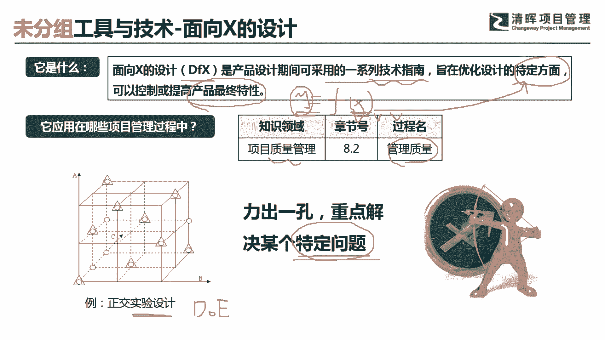
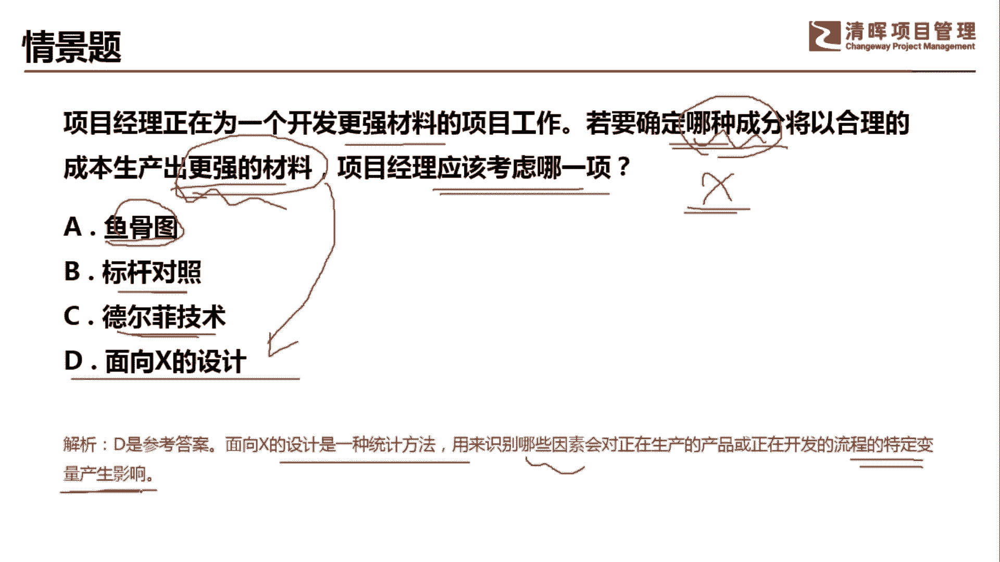

# PMP超干货！超全！项目管理实战工具！ PMBOK工具课知识点讲解！ - P30：面向X的设计 - 清晖在线学堂Kimi老师 - BV1Qv4y167PH

各位同学大家好，我是宋老师。

今天我们来看面向x的设计这个工具，面向x的设计呢，它是design for x，它是产品设计期间可以采用的一系列技术指南，只在优化设计的特定方面，可以控制或者提高产品的最终特性。

产品的最终特性呢其实就是面向x的设计的，最后的一个结果，也就是像我们学的这个函数y等于fx啊，这个最终特性呢其实就是y它是因变量，自变量呢就是xx呢其实就是产品的特定方面，我们要去优化它。

面向x设计这个工具呢，它是在质量管理的管理质量过程中所使用，也就是在执行过程会用到它面向x设计，以前在第五版的书当中也叫这个实验设计，实验设计我们经常有一些这个课程叫d o e啊。

d o e它其实呢就是实验设计，实验设计呢，那我们生活当中的一些例子来举例呢，比如说我们炒一盘菜，你要求得它的口感最好，这个y呢其实就是口感最好，那我们需要对它的食材呀，诶他的这个刀法呀。

啊他的这个火候啊，我们都要对这些特定方面进行调整和设计，这样你求得比如说它的火候，我需要大火中火小火，还是它的食材新鲜度要达到什么样的新鲜度，然后呢我们的这个方法啊，怎么样去调配它。

其实呢这就是一种实验设计，也就是我们今天所讲的面向x设计的一个核心，利出一孔，重点解决某个特定的问题，那这个特定问题呢，其实就是他要求的一个产品的最终特性。

我们来看这样一道题，项目经理正在为一个开发更强材料的项目工作，若要确定哪种成本，将以合理的成本生产出更强的材料，问项目经理应该考虑哪一项，这个里面呢更强的材料，其实是要我们达到了一个目标。

要解决的一个问题达到最优，那哪种成分，这个材料的成分其实就是什么，就是x我们需要面向它进行不断的去实验，不断的去进行调整，因此呢我们应该考虑的是什么，面向x的设计鱼骨图，它重点是找到根本原因。

引起缺陷的根本原因，它也叫做石川图或者叫做因果图，它是根本原因分析的一个表现形式，标杆对照呢，它主要是我们在这个比如说收集需求啊，这个时候我们需要去对照内外部的一些这个，最佳实践。

这个时候可以用标杆对照德尔菲技术呢，它主要是防止一些数据的偏移，比如说我们在收集需求的时候，有一些意见领袖参加，那我们有可能会听取他的一些建议，受到他的一些影响，德尔菲设德尔菲技术。

它的一个特点就是专家采取这个背靠背，匿名的方式进行这种投票，那通过多轮次的这个这个投票呢，我们最终达成一个比较相对比较合理的，一种选择啊，这个就是德尔菲技术，我们这道题目呢，他如果是要确定哪种成分。

哪种成分，然后怎么去设计它的成本，生产出更强的材料，还是比较符合我们面向x的设计这个工具的，它呢也是一种统计方法，用来识别哪些因素，会对正在生产的产品或正在开发的流程，的特定变量产生一个影响。

达到最优好，今天呢主要和大家分享的是面向x设计，这个工具，我们下次再见，谢谢大家。

