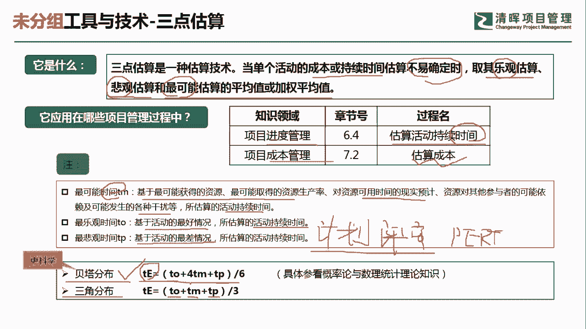
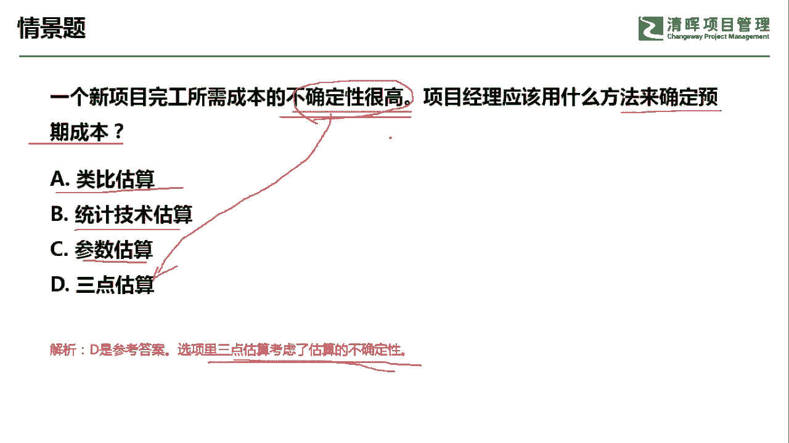

# PMP超干货！超全！项目管理实战工具！ PMBOK工具课知识点讲解！ - P35：三点估算 - 清晖在线学堂Kimi老师 - BV1Qv4y167PH

各位同学大家好，我是宋老师。

今天我们来看三点估算这个工具，三点估算呢它是一种估算技术，当单个的活动成本或者持续时间的估算，不易确定的时候，或者说它处于一种比较模糊的情况，有风险存在的时候，我们就取其乐观的估计，悲观的估计。

或者说这个可最可能的估算的平均值，或者加权平均值，那它是有三个值，乐观的估计，悲观的估计，还有最可能的这种估计，它一般是在有风险的情况下，有不确定的情况下，我们经常会用到三点估算来作为一个估算技术。

那他估算的是什么呢，一般是在进度管理的估算活动持续时间的时候，会用到三点估算，在项目的成本管理的时候，我们在估算成本的时候会用到这个三点估算，那这个里面的这个乐观估算，其实呢。

这个就是基于活动的最好情况下的一种估算，当然了，我们这里面举的例子呢是它的持续时间的，活动持续时间的一个呃估算，那这个里面最悲观的估算呢，是基于活动的最差情况所估算的一个值，好。

最可能的估算呢是基于最可能获得的资源，最可能取得的一些啊资源的生产率啊，或者对资源的可用时间的一个限时，预计资源对其他参与者的可能的依赖，和最可能发生的各种干扰等的情况下，所估算的一个活动的持续时间啊。

这个是用从时间的角度，进度的角度进行估算的，当然它也可以从成本的角度进行估算，三点估算呢也叫做计划评审技术，它是从美国的这个军事项目当中，所衍生出来的啊，计划评审，所以你看到计划评审技术呢。

你要想到他用的其实就是三点估算啊，英文呢简称叫p r t技术，p e r t技术好三点估算，它有两个分布，一个呢叫做贝塔分布，一个叫三角分布，那贝塔分布呢，它的估算值呢等于1/6倍的最乐观。

加上四倍的最可能情况，再加上一倍的最悲观情况的一个加权平均值，那至于说这个公式怎么得来的，它是用这个概率论和数理统计啊，推论出来，我们只要记住它是最后公式结果就可以了，三角分布呢相对简单一点。

但是它也更加粗略一些，它的估算值呢等于1/3倍的最乐观，加上一倍的最可能情况，再加上一倍的最悲观情况下啊，得出了一个加权平均值，那么我们实际上遇到考试的时候，遇到这种三点估算呢。

它一般情景当中会告诉你有两个极端的值，要么就是最乐观，要么就是最微观啊，其中呢再加上一个最可能的，这个相对这个比较平均的一个值，那这种情况下就就可以直接用这个三点估算。

那至于说用贝塔分布来算还是三角分布来算呢，我们默认的都是用贝塔分布来算，如果你发现a b c d选项当中，你贝塔分布算出来对不上啊，那你这个时候再用三角分布来算。

基本上就得出了好，我们来看这样一道题，一个新项目完工所需的成本的不确定性很高，说明了它可能会带来一些模糊和风险，项目经理应该用什么方法来确定预期的成本，好预期的成本它是在进行成本的估算，a选项类比估算。

类比估算呢它有它的适用前景，一般是有这个类似项目，或者说有一些历史的数据，那我们这个时候才可以用类比估算，那它用时短，但是呢它相对比较粗略一些，统计技术估算没有这个词啊，没有这个词，这是一个陌生词汇。

我们只有什么参数估算啊，参数估算参数估算呢，它是也是会用到一些历史数据，形成的一些统计关系，得到一个参数值，但是呢参数模型是否成熟，或者说输入的数据是否准确，这个是适用于这个参数估算的时候。

要考虑的因素，那我们这道题目呢，它因为有成本的不确定性很高，那我们可以考虑三点估算，这个主要就是考虑到估算的不确定性了，好，或者呢这种题目呢有可能还会告诉你，有一些这个估算值出来，最可能的，最悲观的。

还有最乐观的一些估算，那这个也是告诉我们暗示应该用三点估算好，今天的主要和大家讲的是三点估算这个工具，我们下次再见。

