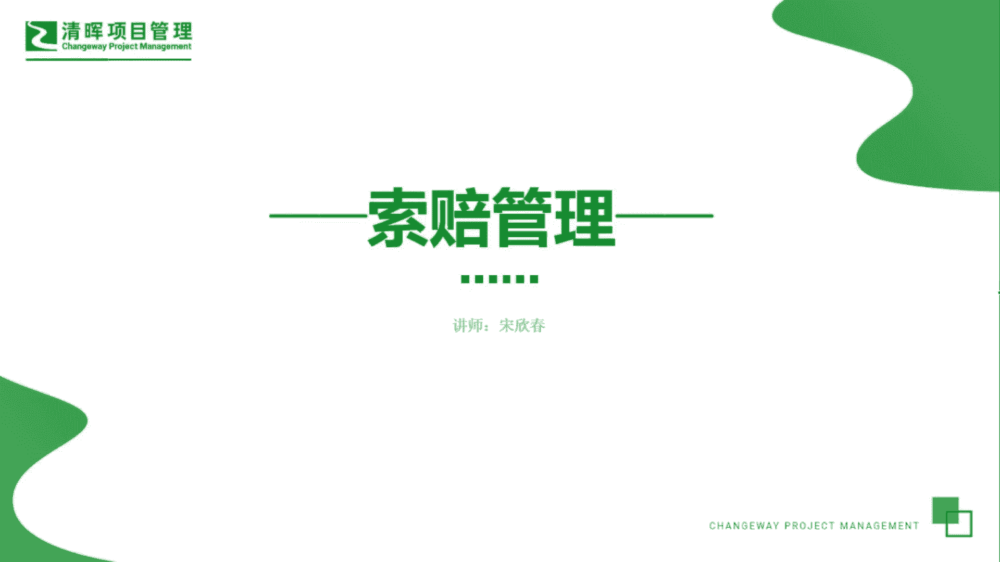
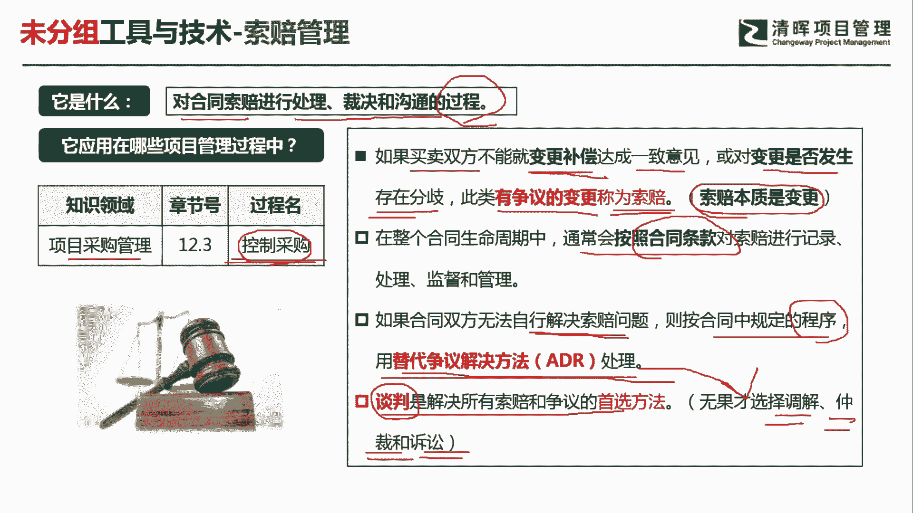
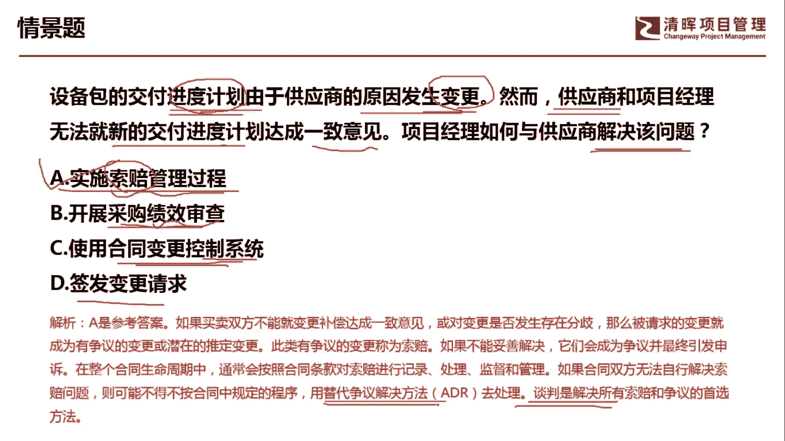

# PMP超干货！超全！项目管理实战工具！ PMBOK工具课知识点讲解！ - P37：索赔管理 - 清晖在线学堂Kimi老师 - BV1Qv4y167PH

呜大家好，我是宋老师。

今天我们来看所谓管理这个工具，索赔管理呢它是对合同索赔进行处理，裁决和沟通的一个过程，这个索赔管理呢也是在采购管理的控制，采购过程中所使用，因为我们涉及到索赔的话，基本上都是甲乙双方有一些争议。

然后呢要进行这个索赔管理，所以它是在控制采购的过程中会使用这个工具，也只有在控制采购过程中所使用，什么情况下我们会进行索赔管理呢，如果我们买卖双方或者叫甲乙双方，不能就变更的补偿达成一致的意见。

或者对变更是否发生存在一些分歧，比如说你发现它的工期延长了嗯，或者供应商说我这个成本要增加，那这个呢其实就是变更补偿，要达成一致意见的问题，不能达成一致意见，那就属于这个索赔有争议的变更，就是称为索赔。

索赔的本质就是变更有不同的意见，甲乙双方之间有不同的意见，这其实就是一个索赔的范畴，在整个的合同的生命周期中，我们通常会按照合同的条款，对索赔进行记录处理，监督和管理，所以遇到任何的甲乙双方的这种争议。

我说的是甲乙双方的争议啊，你第一步要做的就是看合同，而不是说一上来就是要走变更流程，这个和我们前面的这种变更流程的做法，是有些不同的，因为这个里面涉及到我们前面签署的合同，是否遵守的问题。

如果合同双方无法自行解决索赔的问题，我们就会按照合同当中规定的一些程序，用替代交易解决方法去处理，什么叫替代争议解决方法呢，也就是说我们谈判如果首选谈判解决不了，那我们再去用替代争议解决方法。

有什么样的替代争议争议解决方法呢，比如说采取调解，采取仲裁，采取这个诉讼的方式，这些方式呢都属于替代争议解决方法，这个谈判呢是所有解决这个索赔和争议的，首选方法，其实它也是我们解决所有冲突的首选方法。

谈判无效占用替代证据解决方法。

我们来看这样一道题，设备包的交付进度由于供应商的原因发生变更，然而供应商和项目经理，无法就新的交付进度计划达成一致意见，问项目经理如何与供应商解决该问题，这个问题是什么问题，就是设备包的交付进度。

计划呢由于供应商的原因而发生变更，这个时候项目经理不答应新的交付计划，这个时候大家对于这个变更的，产生了一定的冲突，所以呢我们应该怎么办，a选项实施索赔管理过程，这个应该牵扯到供应商甲乙双方。

那这个时候呢，我们可以通过索赔管理流程来处理这个呃，进度计划不一致的问题，b选项开展采购绩效审查，什么时候开展采购绩效审查，唉，如果我们对于这个供应商，他的这个绩效有一些疑虑，或者有一些担忧的时候。

我们就可以采购绩效审查啊，我们这道题目情境，重点不是在于采购绩效的审查，c选项使用合同变更控制系统，合同的变更它是在我们达成一致之后，再去走这个合同，变更这个控制系统，所以呢先去进行索赔管理。

达成一致了，再去进行变更，d选项同样也是，我们不应该一下子就签发变更请求，你最起码先要看一下合同的这个要求对吧，然后再去走变更流程好，所以我们这道题目的重点是在于，这个甲乙双方呢对于这个进度计划。

新的交付进度计划没有达成一致意见，因此呢我们应该通过索赔管理过程去处理，索赔管理过程去处理，首先呢当然是要去谈判，如果谈判解决不了，我们就用替代争议解决方法去处理好。

今天呢主要和大家讲的是索赔管理这个工具。

我们下次再见。

