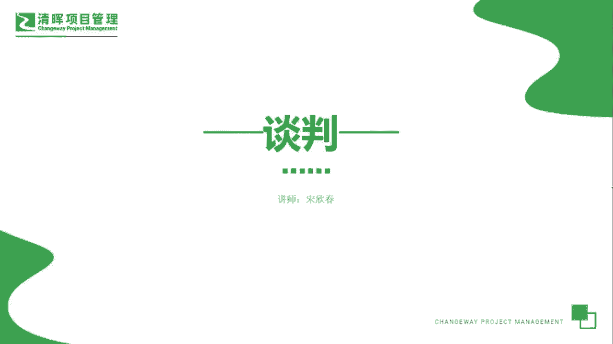
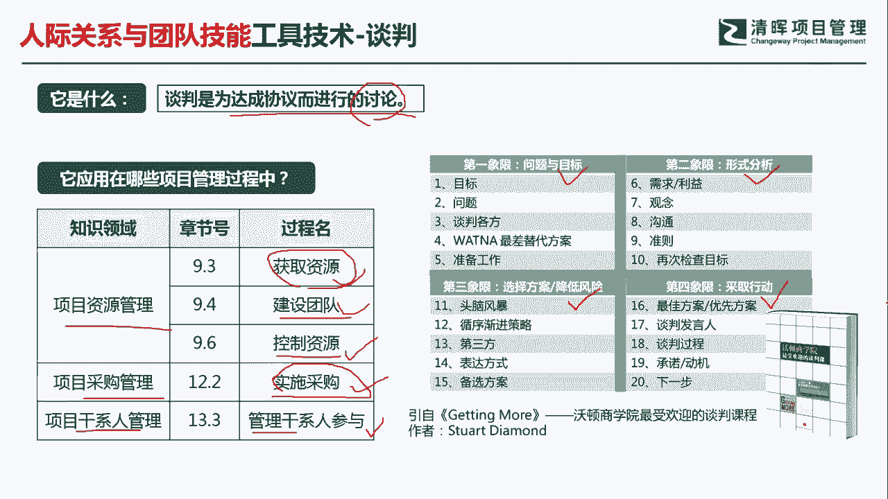
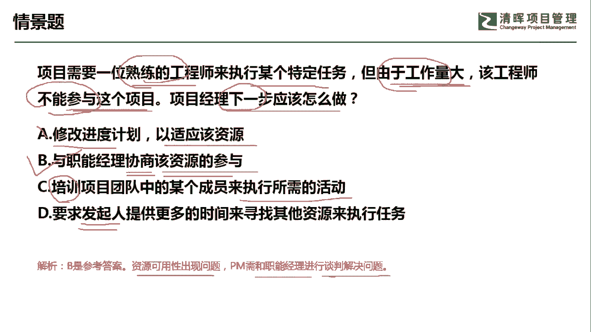

# PMP超干货！超全！项目管理实战工具！ PMBOK工具课知识点讲解！ - P38：谈判 - 清晖在线学堂Kimi老师 - BV1Qv4y167PH

各位同学大家好，我是宋老师。

今天我们来看谈判这个工具，谈判呢是为达成协议而进行了讨，论，它呢其实是人际关系与团队技能当中的软技能，这个工具呢主要是在资源管理的获取资源，建设团队控制资源的过程中所使用，另外在采购管理的实施。

采购过程也会使用到谈判，该协管理呢我们会在管理干事参与的过程中，应用到谈判这个工具，我们一一的来看一下，获取资源的时候，为什么会用到谈判呢，因为获取资源呢，它本身就是需要你主动去争取的。

你需要去和相关的干系人进行谈判，获取你的人或者物的资源，比如说找发起人，在启动过程的时候，我们可以找发起人获取资源，在项目的过程中，我们可以找项目组合负责人去寻找资资源，因为它是对于战略呃。

进行这个项目的优先级排序的，他负责这个项目的这个优先级，然后呢资源肯定是有所这个偏重的，另外在建设团队的过程中，为什么也要用到谈判呢，有时候我们在建设团队过程中。

你要考虑到这个人员的这个优优先的这种配置，那这个时候呢我们会考虑到谈判，还有遇到冲突的时候，也会考虑到谈判，比如说先一对一的进行处理，如果不行的话，由项目经理介入，再不行的话，由他的直属上级来介入。

控制资源的时候，如果发现资源失控了，不够用了，或者说这个出现了什么问题，也需要第一时间进行谈判，在采购管理的实施，采购过程中呢，我们有时有时候是需要进行合同的签订的，进行签订合同的时候。

我们需要建立良好的商务关系，或者呢我们要这个对双方来说，都要取得一个都满意的一个合同，那这个时候呢也是需要进行谈判，在干系人管理的管理干协参与过程中，管理干系人参与呢，其实主要是要降低某些干系人的抵制。

提升他们的支持，这个时候呢当然要发挥你的这个谈判的软技能，去说服去影响你的干系，这个谈判这个工具，其实有时候也是可以把它作为一门课，程去学习啊，沃顿商学院也有专门的这个谈判课程，这个大家有兴趣的话。

可以自己去看一下这方面的资料啊，他是比较有详细的一些方法论的啊，比如说他会选择问题和目标，然后用形式进行分析，选择相应的方案，如何去降低风险，采取行动都是有一定的这个套路和方式的。

我们具体来看这样一道题，项目需要一位熟练的工程师，来执行某个特定的任务，但是由于工作量大，该工程师不能参与这个项目，问项目经理下一步应该怎么做好，你需要的是熟练的工程师，但是呢工作量大。

这个工程师呢他不能参与到这个项目中，那我问你下一步应该怎么做呢，这个其实属于什么，这个其实呢就属于我们在这个需要资源的时候，发现资源出现了一些问题，这样那样的问题，我们要去解决这样的问题。

a选项修改进度计划，以适应该资源，首先呢我们应该积极主动的去争取资源，而不是立刻就去修改你的进度计划，这个里面其实就是修改你的进度基准了，所以呢这个问题反过来了，我们应该是先争取资源。

实在不行再去修改你的相应的一些基准，所以a呢不合适，b选项与职能经理协商该资源的参与好，这个地方呢，我们默认的一般资源的都是在职能部门，我们项目经理呢一般的都是对于他有支配权啊，对他有支配权。

支配权呢就是你支配权大小而已，如果小一点的话，那就是弱矩阵，强一点的话，那就是强矩阵，但是呢职能经理对他是所有权，我们可以对它进行协商，唉协商其实就是谈判啊，这是有时候是翻译的问题啊。

协商这个资源的参与，这个呢是可以作为考虑的，c选项，培训项目团队中的某个成员来执行所需的活动，他用了培训这个工具，什么时候我们用了培训呢，如果我们情境当中是缺乏某些技能，那这个时候呢我们优先选择培训。

但是呢培训往往是需要一定的时间和资金的，但是我们这道题呢优先我们先要去谈判好，d选项，要求发起人提供更多的时间来寻找其他资源，来执行任务，在项目的过程中，基本上我们不需要去再去上报。

或者要求发起什么内容了，唉因为这个时候呢，发起人呢，他把所有的权限全部下放给项目经理来执行，什么时候去汇报发钱，我刚才说了，在启动过程的时候，如果你发现资源有不足，那你可以去找你的发钱，遇到任何的问题。

你在这个时候是可以找他的，但是在以后的过程中就不要再去找他了，好我们这一题呢应该是考虑b选项，资源的可用性出现问题，项目经理呢需要和职能经理进行谈判，来解决问题，这题我们选b选项。

今天呢主要和大家分享的是这个谈判这个工具，我们下次再见。

