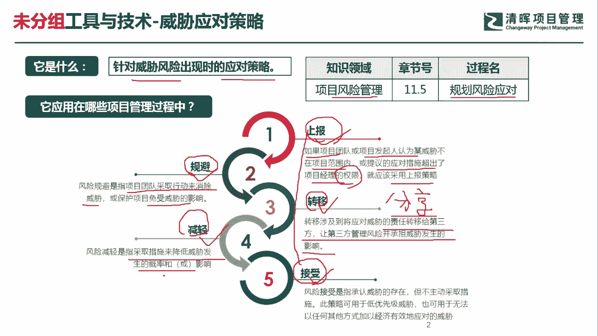
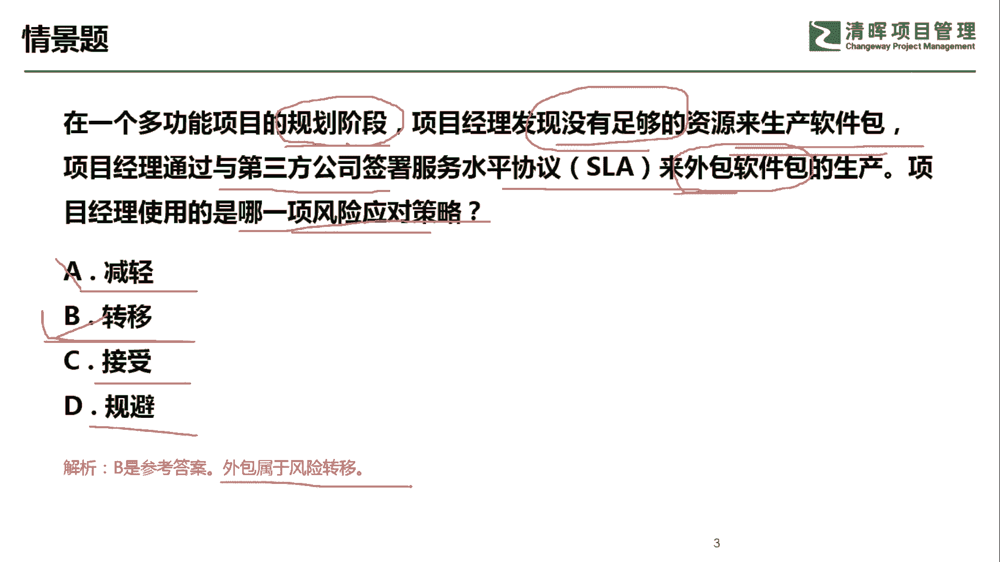

# PMP超干货！超全！项目管理实战工具！ PMBOK工具课知识点讲解！ - P42：威胁应对策略 - 清晖在线学堂Kimi老师 - BV1Qv4y167PH

各位同学大家好，我是宋老师。

今天我们来看威胁应对策略，威胁应对策略呢，它主要是针对于威胁风险出现时的应对策略，这个工具也是在风险管理的规划，风险应对过程中所使用，因为我们在规划风险应对，所以要考虑各种各样的应对策略。

所以这个时候呢也会考虑到威胁的应对策略，威胁应对测量呢也分为五种，一个呢是上报，一个是规避，一个是转移，一个是减轻，一个是接受，其中上报策略和接收策略，它和机会应对策略当中的上报和接收，其实是一样的。

只不过一个是应对机会，一个是我们现在应对威胁而已，同样上报是在，如果项目团队或者项目发起人，认为某威胁不在项目范围内，或者提议的应对措施超出了项目经理的权限，那这个时候呢我们就可以采取上报策略。

如果上报了，那我们就不需要再去跟进，或者监督这个威胁风险了，但是接收策略不一样，接收策略呢它分为两种，一个叫主动接收，一个叫被动接收，也就是说如果主动接收的话，我们是采取一些应急储备。

或者呢缓冲时间来应对这个威胁风险，但是如果被动接收的话，我们就是要去监督这个风险的存在，监督它不再去扩大，不再去发生严重的影响，所以它和上报还是有点区别的啊，这个地方我们可以做一个对照记忆。

其中规避策略呢，它主要是指项目团队采取行动来消除威胁，或保护项目免受威胁的影响，我们采取了最极端的规避策略呢，往往是取消这个项目或者中断这个项目，或者呢是什么，或者我们缩小范围，这些都属于规避策略。

那其中呢规避策略可以和机会应对，策略当中的有一个叫做开拓，做一个对照，开拓策略呢，它主要是百分之百抓住这样的机会，威胁到当中的，这个规避呢是百分之百的消除它的影响。

所以他们可以也可以做一个对照记忆转移策略，转移策略呢主要是涉及到，将应对威胁的责任转移给第三方，让第三方管理风险，并承担威胁发生的影响，我们可以和这个机会当中，机会应对策略当中的有一个叫做分享。

做一个对照记忆，因为分享呢它主要是把机会分享给第三方，和第三方一起共享收益，但是转移不一样，转移呢是把这个危险的赶紧甩给第三方，然后由他们来承担，一般是采取找一个保险公司这个来去承担，他去买一个保险。

但是你要付一个保险费啊，这个就是找第三方来转移风险，减轻策略，减轻焦点呢，是指采取一些措施来降低威胁发生的概率，会影响它往往采取一些具体的什么措施呢，会采取一些原型法啊，原型法大家还记得吧。

主要是这个在需求不太明确的时候，这个时候做一个这个需求的原型，然后呢给到客户，或者给到其他的第三方相关干系人，做一个这个反馈，这样的话你可以避免他后面拒收的这种风险，另外减轻还可以采取多次的测试嗯。

多次的这个检查来避免未来出现的风险，所以这个是减轻应对策略的一个特点，减轻呢它还可以和我们机会应对策略当中的，这个增加啊，增强增强做一个对照，因为增强呢，它主要是这个提升这个机会发生的概率。

我们减轻了主要是降低威胁发生的概率，好，这个呢就是威胁应对策略当中的五种应对措施。

我们具体来看这样一道题，在一个多功能项目的规划阶段啊，这个是在规划阶段，项目经理发现没有足够的资源来生产软件包，所以呢他一定是个危险，它不是一个机会，这个时候我们通过与第三方公司来签署一个协，议。

来外包软件包的生产，找到一个第三方来承担这个生产，项目经理使用的是哪一项风险应对策略呢，很显然，因为这是一个威胁，他找了第三方，所以呢属于转移专一减轻，刚才我们说了，减轻呢主要是这个减轻威胁发生的概率。

比如说这个叫永源刑法，比如说用这个多次的测试，或者呢它可以用一个备用啊，备用这个冗余的部件，但是呢我们这个节目情景当中没有出现，接收策略，主动接受和被动接收，我们清理当中也没有出现规避，规避呢。

它是这个规避威胁这个带来的一些不良的影响，它一般是缩小范围啊，或者直接关闭这个项目，很显然我们这个题目当中也没有提到，因此我们这一题是选择转移策略，它这个外包属于风险的转移，好。

今天呢主要和大家分享的是，这个我们的危险应对措施。

今天就和大家分享到这里。

