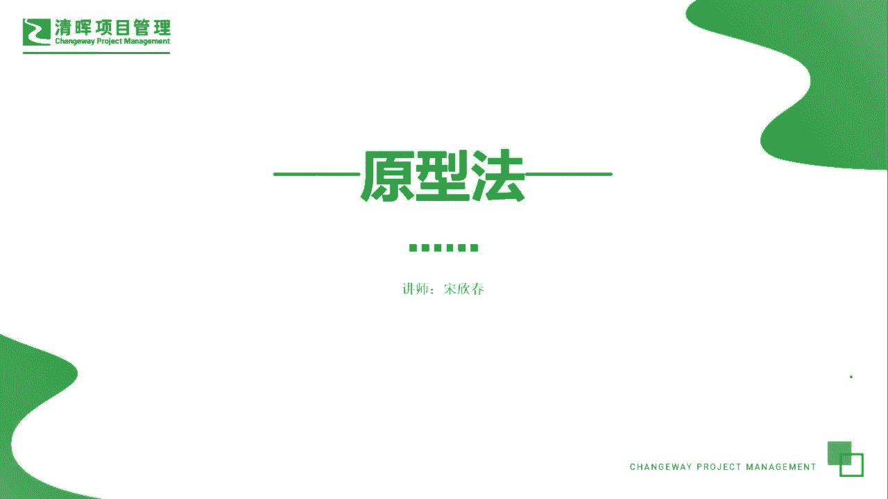
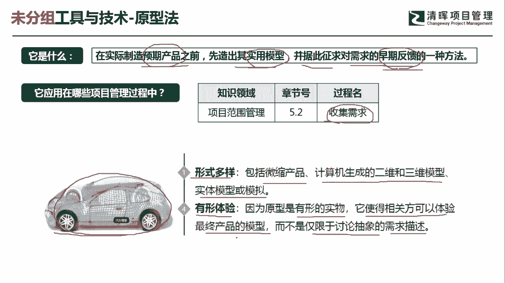
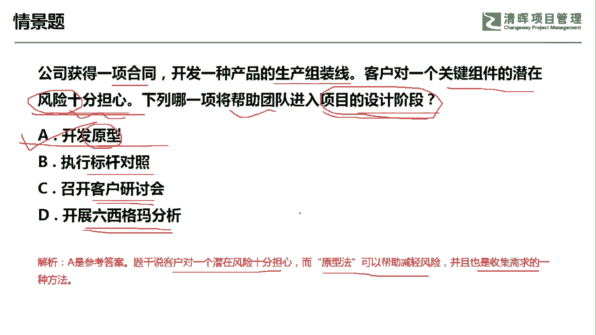

# PMP超干货！超全！项目管理实战工具！ PMBOK工具课知识点讲解！ - P43：原型法 - 清晖在线学堂Kimi老师 - BV1Qv4y167PH

各位同学大家好，我是宋老师。

今天我们来看圆形法这个工具，原型法是在实际制造预期产品之前，先造出其使用的模型，并据此征求对需求的早期反馈的一种方法，所以在这句话当中，我们有这样几个关键信息，一个呢就是说这个产品呢还没有造出来。

是在预期产品之前啊，预期产品之前造出一个什么使用模型，给他看一下，然后呢征求对于需求的一个早期反馈，其实呢，远景法最主要的作用，就是能够寻求一个早期的反馈，所以圆形法这个工具呢。

它在范围管理的收集需求过程中，会使用，有时候呢一些客户他自己对于某些需求，他也没有明确的概念，这个时候呢我们就可以先造出一个原型，摆到他的面前，由他看一下是不是他需要的这种需求啊。

他看到之后呢会给予一定的反馈，这样的话，我们就可能进入到下一步的这个开发当中，所以呢原型法它一般是形式多样的，包括微缩的产品啊，计算机来生成二维或者三维的模型，实体模型或者模拟。

有时候呢我们哪怕是用一张白纸，在上面画一张草图，这些呢都属于圆形法，只不过呢这一类的圆形法呢，它属于一种低保真原型，就不像我们这个这个真实的这个产品，那如果是真实的产品呢，那这种呢叫做高保真原型。

也就是说我们今后量产出来的，就是它所给予我们看到的这个原型，这个圆形法呢还可以给予我们一些有形的体验，因为原型呢它是有形的一些食物啊，这个呢是可以给到相关方体验的，最终产品的一些模型。

而不是仅局限于讨论抽象的一个需求的描述，当然了，这种圆形呢有可能它只是一个比较粗糙的，粗糙的这种这种食物，那你看上去之后呢，所以他会寻求不断的这种反馈，那原型法这个工具呢，其实在敏捷开发过程当中。

是非常普遍的一个一个方法，因为敏捷开发呢它本身就是在一种不确定性，模糊性，易变性，复杂性的环境当中进行开发，所以圆形法呢可以给予我们不断的去调整，不断的去寻求这个增量的这个迭代。

好，我们来看具体这样一道题，公司获得一项合同，开发一种产品的生产线，客户对于一个关键组件的潜在风险十分担心，下列哪一项将帮助团队进入到项目的设计阶段，现在客户的问题呢是对于观念组件。

它存在一个潜在风险十分担心，但是呢我们现在要帮助团队，就进入到项目的设计阶段，进入到设计阶段呢，它其实就是小步快跑，进入到下一个阶段，在这种环境下有风险的这种环境下，我们可以不断地去寻求反馈。

这样的话可也可以打消客户的一些担忧，所以呢我们可以考虑用开发原型的方式，b选项叫做执行标杆对照，什么情况下我们用标杆对照呢，标杆对照，它主要是学习组织内部，或者外部的一些最佳实践啊。

如果我们这个题目当中，需要去这个学习最佳实践的话，那我们可以用标杆对照c选项，召开客户研讨会，召开客户研讨会，你先要有一些东西才能去召开，不能去进行抽象的去召开，所以呢我们优先选择开发原型之后。

然后呢再去召开客户的研讨会，得到客户的一个反馈，d选项开展六西格玛分析，这个呢不是一个确切的工具，六西格玛呢，它其实是管理质量当中的一个质量改进工具啊，这个呢不能作为一个这个进入。

项目设计阶段的一个工具啊，我们可以用圆形作为一个不断的反馈工具，这题呢我们是选a选项，因为题干当中他说了，客户是对潜在的风险十分担心，原型法是可以帮助他减轻这种风险的担忧的。

而且呢它也是收集需求的一种方法，好我们这一题选a选项，今天呢主要和大家分享的是原型法这个工具。

我们下次再见。