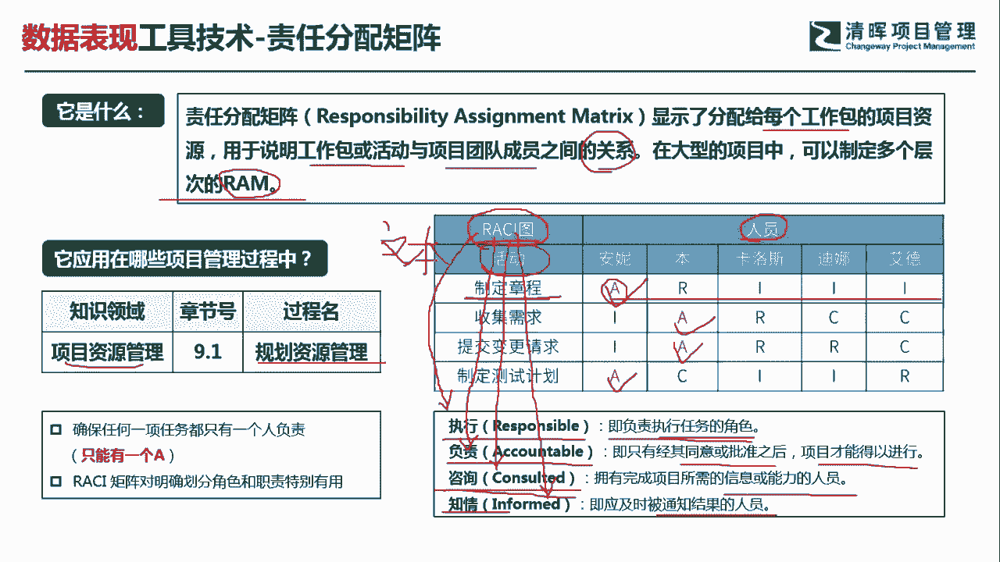

# PMP超干货！超全！项目管理实战工具！ PMBOK工具课知识点讲解！ - P44：责任分配矩阵 - 清晖在线学堂Kimi老师 - BV1Qv4y167PH

各位同学大家好，我是宋老师。

今天我们来看责任分配矩阵这个工具，责任分配矩阵呢，它主要是显示了分配给每个工作包的项目资源，用于说明工作包或者活动，与团队成员之间的一个关系，这个关系呢主要是指的责任分配的关系，在大型的项目中。

我们也可以制定多个层次的责任分配矩阵，它简称叫做r a m责任分配矩阵，主要是在资源管理的规划，资源管理过程中所使用，因为这个里面的资源，我们主要指的是人和物的资源，那么责任分配矩阵呢。

更多的倾向于对于人员的一个职责分配，所以他在规划的时候要考虑谁负责，什么事情要把它说清楚，我们在右边看到有一张图叫做r c i图，i c i图呢其实就是叫做i c i矩阵，有时候也翻译成i c r矩阵。

这个里面四个字母分别代表什么意思呢，二呢是代表responsible，这个呢是执行的意思，它这个里面执行的主要是负责执行任务，就是直接干活的人，a呢是代表accountable。

他是负责accountable，这个里面的负责呢主要是一个审批的角色，说明这个人的全权限是比较大的，只有经过其同意或者批准之后呢，项目才能得以进行，它主要是拥有完成项目所需信息能力的，或者能力的人员。

他其实是一些专家角色，我们要咨询他，i呢是代表什么呢，i是代表知情，informed，就是我们应该及时被告知结果的一些人员，所以呢从右边这个i c i矩阵图当中，我们可以发现。

纵向呢一般是代表着活动或者工作包，横向的一般是代表人员，这样的话我们就可以看到，每一个活动或者工作包呢，有哪些人员一起配合去完成，但是我们从这张图当中，可以发现一个特点是什么呢。

就是每一个活动它只有一个a，就是每个活动呢只有一个同意或者审批，拿主意的人，其他的这些角色呢可以是一个或者多个人，这个都是没问题的，所以有时候r c r矩阵怎么考，大家呢他有可能会安排正好四个活动。

他就问你哪一个活动是安排比较合理的，那你就看好这个活动呢只有一个a，那这个呢肯定就是合理的角色啊，这个就是它的一个关键点，但是呢责任分配矩阵还有比他更详细的工作分，配，那个呢就叫做文本图，文本图。

如果我们发现有一个题目情境是说，我们要具体了解个人的一些工作职责的话，那你就要用文本型了啊。

也可以叫做文本图来表示好，我们具体来看这样一道题，并竭力将离开项目，为了向新团队成员说明项目的角色，项目经理应该准备或者更新什么文件，准备或者更新什么文件，a选项，人员配备管理计划，人员配备管理计划呢。

它其实是这个资源管理计划当中的一个子计划，它主要是人员的分配，怎么样去安排他好，我们现在的问题呢，是要向新团队成员说明项目的角色，说明项目的角色，你就要告诉别人，这个项目的角色起到什么样的一个作用。

组织图呢也叫做ob s图，o b s，它更多的是展示的是这个部门的角色职责，部门的决策职责，他颗粒度相对于这个责任分配矩阵来说，还更大一点，项目章程主要是展示一些关键决策，关键人物的一些职责。

所以呢我们这道题目呢，因为它不是一个新项目，所以呢我们不需要去看这个项目章程，d选项，责任分配矩阵，责任分配矩阵，它就是表明我们在这个活动或者工作包当中，我们每个人的角色职责。

因此呢我们可以去更新这样的一个文件，向新团队成员说明项目的角色，因此呢我们这一题呢是选择d选项，但是项目各资源在各个工作包的任务的分配，说明工作包或者活动，与团队成员之间的一些关系，好。

今天呢主要和大家分享的是责任分配矩阵，这个工具，我们下次再见。

