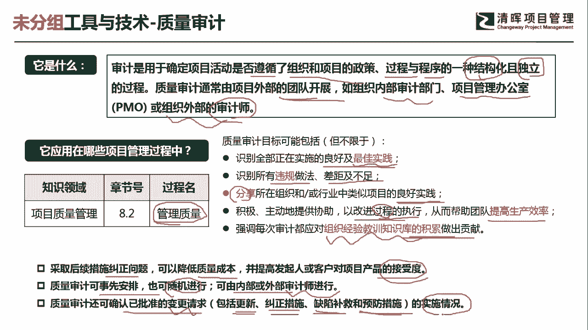
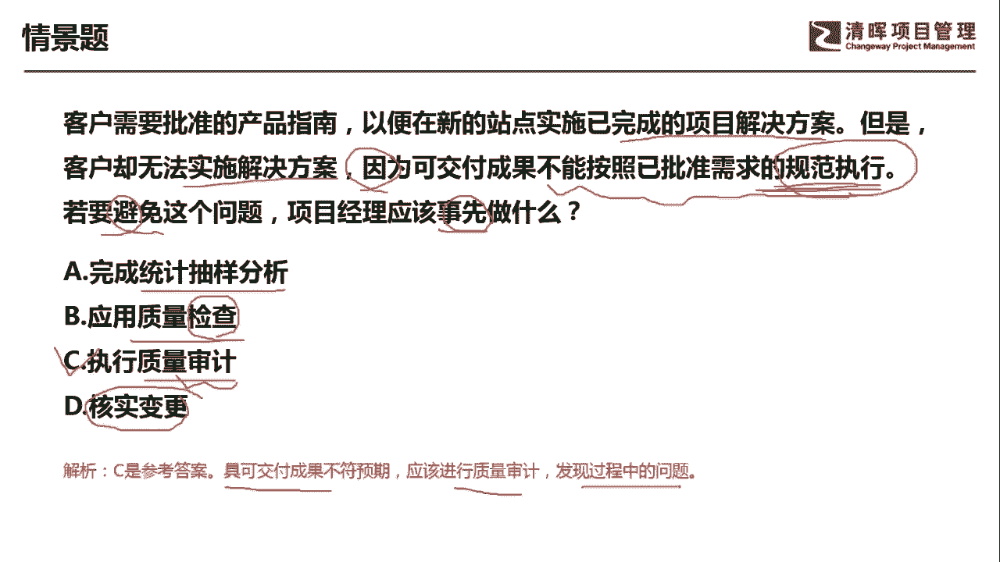

# PMP超干货！超全！项目管理实战工具！ PMBOK工具课知识点讲解！ - P48：质量审计 - 清晖在线学堂Kimi老师 - BV1Qv4y167PH

同学大家好，我是宋老师。

今天我们来看质量审计这个工具，尽量审计呢，主要是用于确定项目活动是否遵循了，组织和项目的政策，过程和程序的这样一种结构化，而且独立的过程，质量审计呢通常是由项目外部的团队开展，为什么呢。

因为他不可能自己既当球员又当裁判，所以他由项目外部的团队开展，比如说组织内部的审计部门，项目管理办公室po或者组织外部的这个审计师，内审员，外审员，这样都可以，质量审计呢主要是在质量管理的管理。

质量过程中使用，这个是在执行过程，那质量审计的目标有哪些呢，一个呢它是识别全部，正在实施的良好及最佳实践，就是包括外部的，包括内部的都可以，还要去识别这些良好的最佳实践。

然后呢他还需要去识别所有违规的做法，差距以及不足，他还会去分享所在组织或者行业中，类似项目的良好实践，这个呢就是良好实践的分享，然后识别最佳实践，积极主动地提供协助，以改善过程的执行。

从而帮助团队提高生产效率，注意它是帮助帮助团队提高生产效率，改进过程的执行，我们前面讲过一个过程分析，过程分析呢，它其实主要是发现一些非增值的活动，为了下一步进行改善做准备，所以它和过程分析还不太一样。

强调每次审计都应该对组织经验教训，知识库的积累累积作出贡献，他也是要去做经验教训总结的，那这个审计呢还有哪些特征呢，一个呢是采取后续的措施，比如说采取纠正措施，可以降低质量成本。

并且提高发起人或者客户对项目产品的接受度，所以呢质量审计也是有必要的，它其实可以预防一些这个风险，也可以去纠正一些问题，质量审计呢可以事先安排，也可以去随机进行，可以由内部或者外部的审计师进行。

我们有的同学或者说有的公司呢，他是做这个内审员的啊，组织一些内审，那这个时候呢我们就需要去进行这个补，一些流程当中缺失的一些材料，所以那时候呢大家可能会感觉到工作特别繁忙。

那就说明之前呢我们的工作流程当中，有一些这个必要的一些表格啊，或者说一些必要的记录，那这个时候呢就要赶紧去补上，这样审计呢还可以确认已经批准的变更请求，比如说我们前面讲的变更请求有四种情境。

一个呢是更新措施，一个呢是纠正措施，还有缺陷，补救措施以及预防措施的实施情况，它会根据你的实施情况。

看看你做得怎么样，我们具体来看这样一道题，客户需要批准的产品指南，以便在新的站点实施已经完成的项目解决方案，但是呢客户却无法实施解决方案，因为可交付成果不能按照已经批准的规范执行，若要避免这个问题。

项目经理应该事先做什么，它的结果告诉你，就是说可交付成果，不能按照已批准的这个需求的规范执行，所以客户无法实施解决方案，那你要避免这个问题应该事先做什么，就是你过去应该把什么事情做好。

你才能避免当下出现的问题，a选项完成统计抽样分析，统计统计抽样分析呢有它的适用场景，一般呢我们是通过一些这个样本，去推算出更大群体的一种质量情况，它也是一个这个控制质量的工具，应用质量检查检查。

这个工具呢，往往也是放在这个我们控制质量的时候所采用，它主要是检查你的缺陷，检查你的缺陷好，这个呢是不可以去避免问题的，它其实呢是一个检查，当下他不会去这个避免问题，事先做执行质量审计。

质量审计呢它是对于过程政策流程的一个审查，所以呢我们这个题目当中说，你没有按照已经批准的规范执行，那这个地方我们如果你经常去进行审查的话，看看他有没有按照规范执行，那你就可以避免后期的这个客户无法实施。

解决方案的问题，因此呢c是可以符合我们的情境描述的，d选项何时变更何时变更呢，其实它只是质量审计过程当中的一个特点，一个需要去做的事项，所以呢c包含了d选项，我们这道题目呢具有可交付成果，不符合预期。

那我们应该进行质量审计，发现过程中的问题好，今天呢主要和大家分享的是质量审计这个工具，我们下次再见。

谢谢大家。