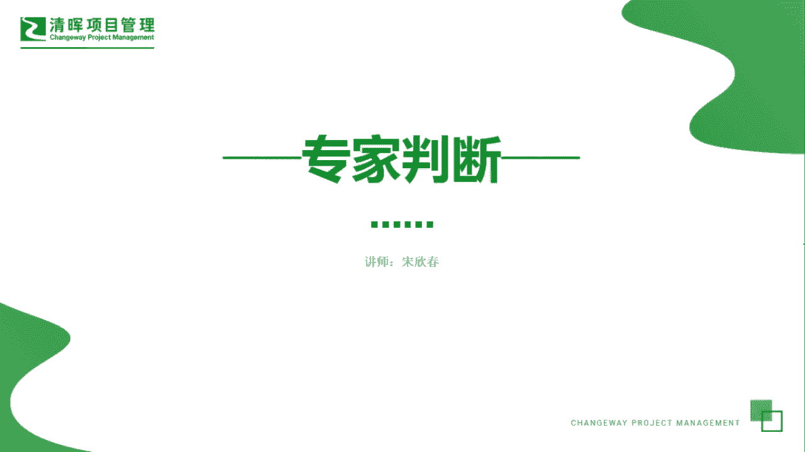
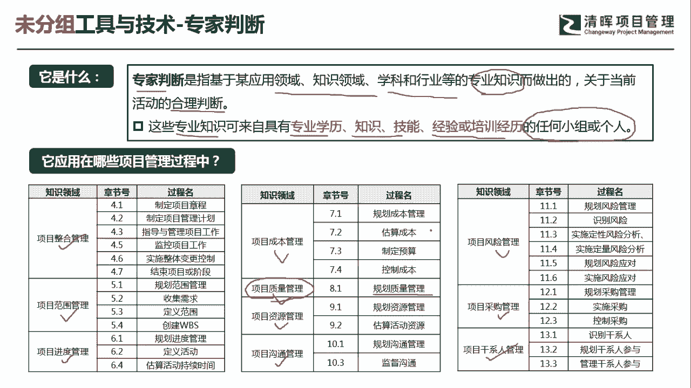
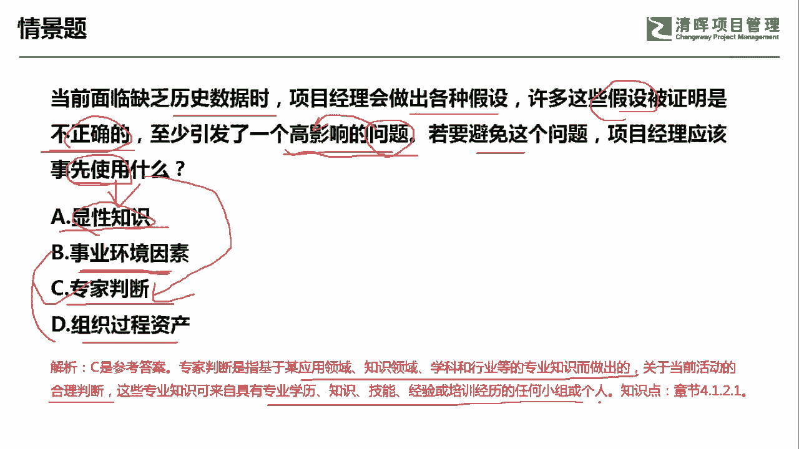

# PMP超干货！超全！项目管理实战工具！ PMBOK工具课知识点讲解！ - P49：专家判断 - 清晖在线学堂Kimi老师 - BV1Qv4y167PH

各位同学大家好，我是宋老师。

今天我们来看专家判断这个工具，专家判断呢它是指基于某些应用领域，知识，领域，学科和行业等专业知识而做出的，关于当前活动的一个合理判断，所以呢它是一个动名词啊，合理的判断。

但是这个合理的判断呢是基于专家来做出的，这些专业知识呢可以来自于专业的学历知识，技能经验或者培训经历的任何个人或者小组啊，都可以具备专家的这些这个专业知识，也就是说有一些人呢。

他如果参加了一些这个专业的培训，那么培训合格之后呢，我们也可以把它列为这个专家的这个群体角色，专家判断这个工具呢，它在我们的十大知识领域当中都会应用到，比如说整个管理范围管理，进度管理，成本管理。

质量管理，资源管理，沟通管理，风险管理，采购管理和这个干线管理当中，都会遇到专家判断这个工具，但是我们要特别要注意的是什么呢，就是专家判断这个工具呢，一般我们是作为一个备选，为什么叫备选呢。

就是在我们偏僻的考题当中，很少有考直接考专家判断这个工具的，除非你这个a abcd 4个选项当中呢，你发现这些工具呢，他这个都没有适用的这种场景，那你可以选择一个这个比较通用的这个工具，那就是专家判断。

所以呢它是作为一个备选，还有就是说专家判断，在质量管理的知识领域当中呢，它只会在一个过程当中使用，就只会在规划质量管理的时候，他会去听取专家的一些意见，但是在这个管理质量和控制质量的过程当中呢。

我们是由专门的专业团队去进行的，比如说有质量保证团队，比如说有质量的控制团队，所以也是由专业的人来做专业的事情，好我们重点来看这样一道题。

当前面临缺乏历史数据时，项目经理会做出各种假设，许多这些假设被证明是不正确的，至少引发了一个高影响的问题，若要避免这个问题，项目经理应该事先使用什么啊，也就是说你过去应该把什么事情做好。

从这个情境来看呢，他发现有一个假设啊，这些假设被证明是不正确的，说明呢这个假设被推翻了，假设我们前面讲过假设条件，假设条件呢它是一开始我们认为的是，可以认为它是这个成立的，不需要去证明的。

但是呢假设它是会发生一些变化的，会带来一些风险，好我们这道题目呢，其实就是说这个假设被证明是不正确的，它出现了风险，出现了什么风险，引发了一个高影响的问题，高影响的问题，问题它不是风险。

但是问题呢会带来一些风险，它会带来一些高影响，一些不确定性，我们要避免这个问题应该怎么做，a选项，显性知识，显性知识呢它和隐性知识是相对应的，也就是说我们可以通过一定的这个书面啊。

或者这个文字的方式把它记录下来，但是呢显性知识和隐性知识有哪些不同呢，隐性知识它主要是不可以去直接去记录的，它往往是通过经验的这种教训，通过分享去获得的，但是这个很显然不是一个工具。

我们题目的问题是使用了什么，一般首先考虑这个工具好，事业环境因素，环境因素呢和这个假设没有直接的关联，它其实是站在另一个维度，我们假设呢是事先被证明是可以去成立的，但是事业环境因素不需要去证明。

但是它也不是个工具，它一般是作为一个参考，输入好专家判断可不可以诶，专家判断是可以的，他其实是这个可以去识别风险的，我们这一题呢其实考的是，你事先应该去把它识别出来。

那你后面的就可以少引发或者不引发这个，高影响的问题了，组织过程资产同样的和世界环境因素一样，它是作为一个参考输入，那这道题目如何改成，如何避免这个问题，我项目经理应该事先参考什么样的内容。

那你参考什么样的内容，那肯定是考的是输入了，那就不是考这个工具了，工具一般他会问你使用了什么，所以这一题呢，我们应该站在专家判断的角度去识别它的风险，好这个题目呢我们是选择这个c选项，c选项。

专家判断它是基于某些应用领域，知识领域，学科和行业等相关专业知识做出的，关于当前活动的合理判断，这些专业知识可以来自于具有专业知识，技能经验或培训的认可小组和个人好。

今天呢主要和大家分享的是专家判断这个工具。

我们下次再见。

