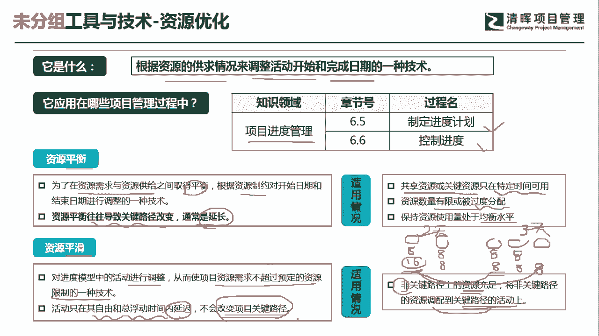
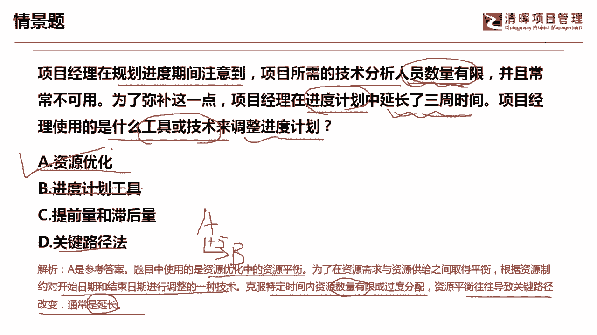

# PMP超干货！超全！项目管理实战工具！ PMBOK工具课知识点讲解！ - P50：资源优化 - 清晖在线学堂Kimi老师 - BV1Qv4y167PH

各位同学大家好，我是宋老师。

今天我们来看一下资源优化这个工具，资源优化它是根据资源的供求情况，来调整活动开始和完成日期的一种技术，所以呢这个工具它只会在项目的进度管理，知识领域当中使用，分别在制定进度计划的过程中。

以及控制进度过程中使用，资源优化分为资源平衡和资源平滑，其中的资源平衡，它主要是为了在资源需求和资源供给之间，取得一个平衡，根据资源制约，对开始日期和结束日期进行调整的一种技术。

但是呢资源平衡它有个特点，就是说它往往会导致关键路径改变，通常是延长，它有一定的适用情景，就是说什么情况下我们用资源平衡呢，共享资源或者关键资源只在特定的时间可用，这是一种情况。

还有呢就是资源的数量有限或者被过度分配，过度分配，比如说这个人他的工作时长太长了，这个也叫做过度分配，要保持资源使用量处于均衡水平啊，这个里面呢我举个例子，比如说张三和李四，他们的工作两天时间。

但是呢张三他工作八个小时，李四呢他一天要工作16个小时，到了第二天呢，张三也是工作八个小时，李四呢也是工作八个小时，那在这个情况下，我们就发现李四呢，他在第一天他其实是被过度分配了。

他的工作量太时长太长了，那在这种情况下，保持资源的使用量处于均衡的水平，那在这个时候呢，我可能第一天张三是八小时，李四呢哎原来16个小时我变成八个小时了，第二天呢张三也是八个小时，李四也是八个小时。

但是呢因为前面这个李四呢，第一天他工作了这个八个小时，他原本是工作16个小时，那我现在呢把这个16呢放到第三天啊，这个当中再去分配八个小时，也就是说我增加了一天，增加一天呢。

这个时候呢李四呢工作八个小时啊，所以呢它整个的关键路径是变成了三天，它是不是延长了，原来呢我们使用了两天时间，但是两天时间当中呢，这个李四的工作量是比较大的，所以我们把它进行了这个均衡处理。

所以这个呢就是叫资源平衡，资源平衡，第二个叫做资源平滑，资源平滑呢它是对进度模型中的活动进行调整，从而使得项目资源需求不超过预定的资源限制，的一种技术活动，只在其自由和总浮动时间内延迟。

不会改变关键路径，它的适用情况就是，非关键路径上的资源比较充足，那将非关键路径上的资源调配到关键度，这个路径的活动上，这个是什么意思呢，比如说我们现在呢呃张三和李四，这个呢是两个人工作。

但是呢我们发现这个张三呢他工作量不够，他只有八个小时，我们想增加，但是呢在这个时候呢，我们其实资源呢只有张三和李四两个人，那怎么办，那在这种情况下呢，我只能把非关键路径上的资源，调到关键路径上使用。

比如说我把李四调到这个关键路径上去使用，那这个时候呢，其实就是把这个工作量进行了一些这个分配啊，也就是说会把那些工作量不太饱和的人，拉到这个需要工作量饱和的这种路径上啊，这种路径呢往往就是关键路径。

所以呢它其实是资源的削峰填谷，把那种就是闲有很多闲暇实践的人员，把它工作量饱和起来啊，这个呢就叫做资源平滑，但是呢资源平滑和资源平衡最大的区别在于，资源平衡呢它是会延长关键路径。

但是资源平滑呢一般不会改变关键路径。

好我们来看这样一道题，项目经理在规划进度期间，注意到项目所需的技术分析人员数量有限啊，说明人员数量有限，其实就是资源有限，并且常常不可用，为了弥补这一点，项目经理在进度计划中延长了三周时间。

好项目经理使用的是什么工具或者技术，来调整进度计划，他问的是工具和技术，a选项，资源优化延长了三周时间，这个呢其实就是资源优化技术，资源优化技术他呢有可能是用了资源平衡，那它延长了这个周期。

延长了这个进度计划，进度计划工具没有这个工具，这个呢是说的太笼统了啊，c选项提前量和滞后量，提前量和滞后量呢，它是排列我们活动的一个工具，排列活动的一个工具啊，排列排列活动顺序。

排列活动顺序呢它其实是在我们基准之前的啊，有基准之前的，所以呢我们这道题目呢，它其实是进度计划中延长了三周时间，说明他把进度基准进行了调整，在这个时候呢，我们其实提前量和滞后量，这个它主要是排活动的啊。

比如说a活动和b活动，它的这个逻辑关系a在前，b在后，那b呢它可能是在a完成之后，比如说15天再去开工啊，这个就叫做滞后量，所以呢它不属于对基准的一个变化，它其实是前面在排列活动顺序的一个一个。

提前量或者滞后量，关键路径法，关键路径法呢，它不会体现出我们进度计划延长这个表现，它只是我们在这个制定进度计划的时候，一个重要的工具啊，因此呢我们这道题目呢应该选的是a选项。

他用的是资源优化技术当中的资源平衡，为了在资源需求和资源供给之间取得平衡，根据资源制约，开始对开始时间和结束时间进行调整的一种技，术，客服特定时间内资源数量有限或者过度分配，像我们这一题呢。

就是资源数量有限，资源平衡往往会导致关键路径改变，通常是延长而延长了三周时间，这题我们选a选项好，今天呢主要和大家分享的是资源优化这个工具，我们下次再见。

