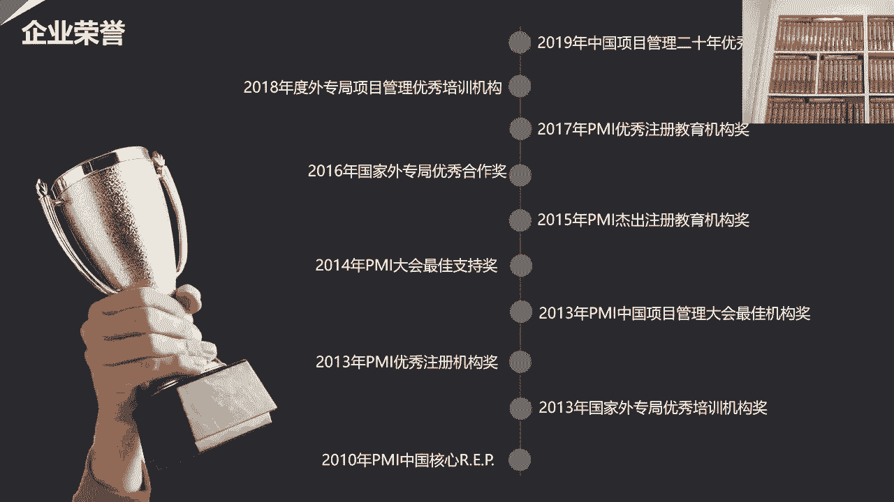
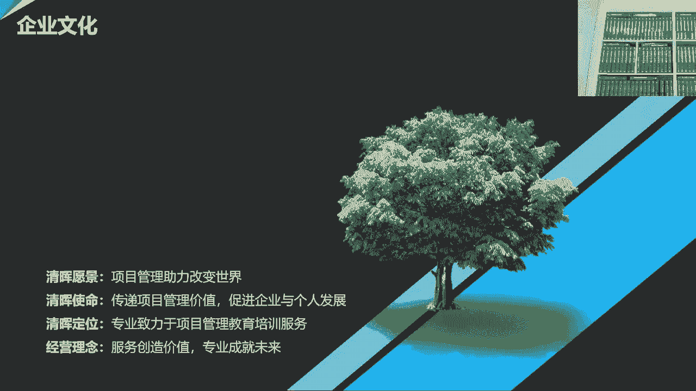
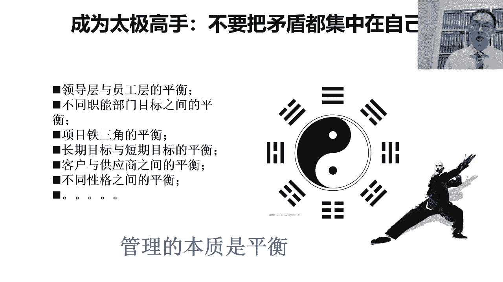

# PMP超干货！超全！项目管理实战工具！ PMBOK工具课知识点讲解！ - P52：“拍马屁”是对 “PMP”最深刻的注解 - 清晖在线学堂Kimi老师 - BV1Qv4y167PH

哈哈哈哈啊啊啊。

啊啊啊啊。

啊。

啊哈哈啊啊啊啊啊。

啊啊啊。

啊啊啊。

啊。

啊啊。

我们观察到，我的位置先看看我看不见的屏幕，下面有个巫王啊，这个像往这边一点对对，我能看见那屏幕吗，让我看见你那个对，有点偏，啊可以我觉得上啊，像这样嗯可以，各位小伙伴们，大家晚上好，很开心。

能够再次和大家在直播间相遇，那今天呢就是我们的系列讲座的第二课，今天我们的主题是拍马屁，是对pmp最深刻的注解，那接下来呢我们就要有请向阳老师来进行分享，在讲座的结束呢，我们设置了互动答疑环节。

所以各位学员在听课的过程当中，可以将问题发在我们的问题区，然后肖老师呢会抽取部分的问题进行回答，接下来让我们一起来期待肖老师的分享，好好谢谢嗯，嗯各位嘉宾会选，大家晚上好。

今天呢是我们系列讲座的第二次课，然后呢很高兴呢，这个我们的嘉宾和学员们，可以跟我们共同的把这个系列的课程啊，我们一起听全了，然后我们看一看，是说呢我们从不同的角度来尝试去这个解读，我们的项目管理。

那希望能对大家带来一些与众不同的视角，今天呢我们要讲的这个课呢，是这个项目团队管理和领导力，那在这里边呢其实当时设计这个主题，其实是希望能够帮助大家呢，其实去理解一下这个项目管理在落地的时候啊。

他其实对很多软技能，包括了这个做人的思考，相关方的管理，包括跟人打交道的时候换位思考，那其实希望在这方面呢，它其实是需要一些提高的，这个呢其实恰好是很多做技术出身的，项目经理的一个短板。

就是大家知道项目管理吧，它很有趣，项目管理呢它在企业里面，它其实既不属于技术序列啊，它也不属于管理序列，换句话说呢，既不属于技术通道，那也不属于管理通道，它其实恰好是属于一个，介于技术跟管理中间的通道。

那这也意味着是说呢，其实啊做项目经理的人，他其实一直要在游走在技术跟管理中间，那在既既要懂技术，也要懂管理，而且呢在这两者之间呢要去找一个平衡点，所以呢这个想当好项目经理挺不容易的，那既要做对事啊。

然后呢又知道和人如何去打交道，那在这里边呢，当然我们有一个比较深刻的体会啊，就说呢其实早年学项目管理游戏，学p mp的时候，那总觉得这是一个工具，那是一个方法，然后呢，但是后来呢。

我们说这个随着做项目经理的这个年头，越来越多，经验越来越丰富，做的项目越来越大，我们会发现这个跟人打交道变得越来越重要了，而且呢更重要的是说呢，我们要以场景为导向，项目管理呢我们在系统化学习的时候。

学习的是知识，但是呢当我们要去落地实践的时候，我们需要面对的是各种多样化的场景，那在这些多样化的场景中呢，它其实我们会遇到不同的人不同的事儿，然后里边呢会有各种复杂的关系，那这个时候呢我们的项目管理呢。

他不会再向我们学习p mp或项目管理，知识体系和方法的时候那样理想化，通常当我们学习知识的时候呢，它是理想化的，因为呢它具有通用性，所以呢它要去除掉所有跟这个不同的特殊场景，相关的东西，这时候他好理解。

但是落地的时候呢，我们的世界是非常复杂的，场景是多样的啊，人际关系对吧，背后有各种不同的诉求，那这个时候呢我们如何能够把项目管理落下去，那其实取决于我们把这种工具，方法和场景之间的一种结合的能力啊。

这个过程中呢我们说啊这个拍马屁很重要，拍马屁是一个通俗的说法，那其实呢可能嗯更重要的一点是说，其实我们想表述的是说，其实我们在跟人打交道的过程中呢，我们要学会换位思考，然后呢我们要学会赞美别的人。

很多的时候呢，我们会认为是说，其实赞美是一个非常强大的力量，尤其是当我们的项目里面有很多专家型的人啊，有很多领导，那我们跟他们打交道的时候，不能太理直气壮对吧，然后因为我们不可能威胁到他们。

所以很多的时候呢，我们要尝试用他们能接受的方式，去跟他们打交道，所以这时候呢就会用到我们后面所提到的，项目管理，更多的偏向于普人式领导对吧，很多时候呢当你去搞定一个人的时候，所以很多的时候呢我们要尝试。

首先要能够去跟他建立信任关系对吧，获得他的认可，让他觉得我们可能跟他是他的知己，能够理解他，那这个时候呢，很多时候其实可能我们要去在一定程度上对吧，我们去认可他的行为，是赞美他的一些观点。

这个过程呢虽然听起来有点像拍马屁，但其实过程其实是为了加强人与人的沟通，建立信任，那这样的话其实我们才能够真正的啊，我们才能真正的搞定不同的相关方，然后呢那相关方可能既是我们的团队，有可能是我们的客户。

当我们能够去获得所有人的认同，才有机会把大家组织起来，统一目标，统一思想对吧，形成合力，才有可能真正的去完成有挑战性的项目，所以呢不管怎么样，其实项目管理落地的前提是首先能够搞定人啊。

所以呢这个项目团队管理和领导力呢，一定是项目经理的一个必修的一课，这次呢我们主题的分享呢，我把它分成了几个方面啊，那第一个呢首先分享一下，就是我们要反思一下，为什么很多考过了p m p的。

这个所谓的项目管理专家啊，或者项目管理的专业人士，但是在企业中，其实并没有展现出能够把项目做成功的优势，反而很多没有学过项目管理课程对吧，也没有资质证书的人，他其实反而能搞定很多非常牛的项目。

那这种其实是在写中非常常见的一种现象对吧，我们要去反思一下是为什么对吧，而且反思这个很重要，因为很多时候我们在企业里经常会被质疑啊，为什么考过p m p的人，这项目反而做的不好对吧。

那为什么很多其实没有考过p m p的人对吧，也没有学过的，都是土办法，野路子，但反而呢其实在这个做项目的实战能力很强，很多别人搞费用项目才能搞定，所以这个过程中呢，我们一会儿要一起去反思。

第二呢就是说什么样的项目经理对吧，才是真正的高手，项目经理财这种工作环境是一定要一一，一定要借助权力吗，还是说其实项目经理这种工作方式，它本来其实就是在有责无权的环境下开展的啊。

第三呢我们要去思考一下这个仆人式领导，这点呢其实跟敏捷项目管理的这个路数，是一样的，就是其实呢我们会发现呢，真正的项目经理呢，他其实呢也是一种仆人式领导，因为项目的环境呢，项目经理其实所管的这些人啊。

或者代理的这些人，或者可以说是张罗的这些人，那这些人呢不是专家，就是领导对吧，要不然就是客户，或者呢甚至有可能是各种强势的供应商，在这种情况下呢，项目经理想把这些人组织在一起，形成合力。

然后他们之间又有着各种矛盾啊，然后那我们如何能在他们之间对吧，化解矛盾啊，建立信任统一思想，那其实这是一种真正的领导力，那这种事呢他其实要靠花很多心思的对吧，那在花心思的过程中。

展现出一种仆人式领导的姿态，那这个过程中其实也是项目经理的嗯，他一定要好好去锻炼自己的，第四点呢，我们谈的是决策，就是主要谈的是项目经理的权利，到底是从哪儿来的，那一会儿我们会详细解读这个问题。

就是国内的这点比较明显，在外资公司呢，很多时候因为组织及的项目管理制度它很健全，所以呢项目经理呢他不用操很多心，是因为呢他只要是按照公司制度，那带着大家做事情，只要具备解读公司项目管理制度的能力。

那就能找到合理的依据来约束大家的行为，但是国内的很多的企业呢，因为这个组织级的项目管理机制并不成熟，那不成熟的时候呢，那只能拼项目经理个人能力，那单靠项目经理的个人的这种影响力呢。

可能他又没有办法去约束所有人的时候，那项目经理不得不啊，想办法需要借助项目的集体决策机制，就是我们通常说的项目管理委员会，然后去帮助项目经理啊，建立项目中的秩序，所以呢这个呢其实一会我们再去谈这个问题。

就是其实我们上次讲座的时候也有提过一句话，就是真正优秀的项目经理啊，他能他得学会建立秩序啊，然后要学会自己给自己授权，这样的话呢整个项目才能受控，第五点呢，其实我们想解决的问题是什么呢。

这个向上管理的问题，因为呢这个项目经理呢，他其实必须要掌握借力的能力，那借力的能力有时候可能我们要借领导的利益，有时候可能要借客户的力，有时候可能要借专家的力，这里边的领导其实是一个非常重要的。

那被借力的一拨人，那任何一个优秀的项目经理，他一定要善于借领导的力量对吧，去影响领导，认同自己的观点，让领导愿意支持自己，而且在这个过程中呢，他还要用合适的方式去说服和影像领导。

那这个其实是我们所说的向上管理，第六点呢主要谈的是呢，其实是管项目成员对吧，那很多的时候呢项目经理管项目成员，他其实也是借助领导力的，尤其是越大的项目，越复杂的项目，越挑战的项目，那项目经理呢。

他必须要能够让项目成员，发自内心的去认同自己的观点啊，愿意发自内心的呢去帮助自己，去实现我们认为正确的目标，所以这时候呢我们倾向于呢对吧，我们倾向于呢，要从精神文化层面去影响我们的项目成员。

把它变成我们的追随者，第七点呢其实主要谈的是什么呢，在项目过程中，其实项目经理呢，他一直以来都是要一个能够去很好的，很微妙的去建立平衡的这样的一个角色，所以呢这个一定切记，不要把矛盾集中在自己身上。

很多做技术出身的项目经理呢，往往会犯一个错误，我们会发现所有的矛盾都集中在自己身上对吧，客户那在整天跟自己去争取客户的利益，供应商是吧，跟项目经理之间很多的博弈，项目成员。

那跟项目经理之间也形成很多的博弈对吧，领导也在跟项目经理博弈，那这时候项目经理成了所有矛盾的焦点，但其实实际上我们大家去想一想，其实项目中的矛盾不是来源于项目经理的，项目中的矛盾，是来源于客户的需求。

跟供应商的能力之间的矛盾对吧，那如果是市场类的项目，那市场的需求和研发之间的矛盾，那也有可能这是说领导的期望对吧，跟实际项目成员的交付能力之间的矛盾，那总之其实所有的矛盾都是在项目中，不同相关方之间的。

项目经理的存在，其实是为了帮助大家化解矛盾，建立平衡啊，而不是靠项目经理自己去抵制所有的矛盾，所以在这一点中呢，项目经理如何能找到自己的一个合适的定位，其实也是项目经理的，这个一定要去想清楚和做到的。

最后一点呢，我们说这个以德服人呐，项目经理呢要锻炼自己的内心对吧，很多的时候呢其实我们要对吧，给人展现出一种公平，然后同时呢目标感要强，然后呢我们要能够对吧，摆事实讲道理。

用别人能够接受的方式去说服别人，那做我们认为正确的事情，这个过程呢它非常符合我们的国学的思想对吧，就是道德对吧，光有道还不行，还有德，那德呢更多的其实是要令别人口服心服，那发自内心的认同。

那其实项目经理的最高境界呢，他其实还是做人，那今天的晚上呢，我希望能借助这个时间，我们一起去分享这八个不同的主题，那希望呢能够在一定层面上，那给大家一些启发，帮助大家去思考，那项目经理这个角色。

他到底是一个什么样的角色，那在我们的工作中啊，到底我们怎么样才能够获得大家的认可对吧，让获得相关方的支持，然后把我们的项目管理工具和方法啊用进去，所以呢这是我们今天晚上的一个主要的目的。

首先呢我们分享这第一个主题啊，第一个主题呢其实我们要谈的话题呢，就是说也是一个非常常见的现象啊，我们会发现在国内呢其实这个考过pmp资质，包括考过其他的项目管理资质啊，什么p m p i p m p啊。

不错，考过各种的项目管理资质的人非常多对吧，但是呢却有很多的学员呢，其实考过了项目管理的资质，也能非常熟练的背诵各种项目管理的理，论和方法，甚至呢也掌握了各种不同的项目管理的工具啊，但是呢在企业中呢。

其实并没有能够很好地把它运用下去，很多的时候呢被选中很多实战的人啊，呃有可能是领导，有的可能是项目成员，那其实可能会被大家认为其实是纸上谈兵对吧，然后呢知行不合一，那其实呢这样的一种状况并不好，为什么。

因为这样的一种状况，他其实会导致是说大家，其实他不仅仅是为这个人有问题，而且呢他甚至会去怀疑项目管理是不是真的，对企业来说是有价值的，那我说为什么会出现这样一种情况呢，就我自己的理解啊，他是这样。

这个知行合一呢其实是一个非常难的事情，很多的时候呢自己实践出来的东西，它自然落地就容易，但是呢每个人的经历和经验是有限的，那我们没有办法呢，就是在自己的有限的时间之内呢。

这个能够把所有的经验都靠实践去解决，所以很多时候我们要去学习啊，学习是一种非常智慧的方式，他的智慧之处在于的，是说我们把别人花好长时间精力对吧，通过实践或所获得的这些经验，然后呢他把它提炼出来了。

形成了一些知识和方法，然后我们在很短的时间之内去获取人家的，这些知识提炼的方法，然后呢，再把它转化成为我们自己的日常工作的这种方，式上来指导我们自己工作的时候，等于其实我们获取了人家的经验。

所以呢其实学习呢是一种，可以帮助我们在最短的时间之内，获取大量经验的一种方式，但是这个过程呢其实并不容易，那他不容易的主要体现在什么位置上呢，就是我们会发现知识呢，尤其是比如说项目管理知识。

那比如说我们说pp背后的pinbox，项目管理知识体系，项目管理知识体系呢，它叫知识对吧，那知识是什么呢，知识其实是在各种的大量的项目管理的，这个最佳实践过程中，他把它进行了提炼和结构化。

然后呢它去除掉了各种不同的行业的因素，各种特殊性，把所有共性的东西那剥离出来，共性的是什么呢，共性的是里面被称称之为叫项目管理的东西，然后那被剥离掉的是什么呢，剥离掉的是各种的业务场景和业务属性。

我们想其实这些知识是怎么被提炼出来的呢，它其实是从一个又一个的实战的，项目中提炼出来的，但是在项目里边对吧，在项目中他其实除了项目管理，它其实里边还有业务场景，那这个项目管理方法。

它正是因为在业务场景中发挥出了，非常重要的作用，所以呢我们才认为是说，这种项目管理方法是有用的，但是呢这个py的工作呢，它其实是把各种业务场景中的，被称为叫项目管理的要素提炼出来，把业务场景剥离掉。

那这样的话，其实我们看到的就是纯粹的项目管理，那如果我们想把这些项目管理的知识，应用到我们自己的业务场景中的时候，那我们必须要具备一种能力，就是我们要能把我们的业务场景跟项目管理，再次的去融合起来对吧。

因为这项目管理知识在被提炼的时候，它其实是从项目中把业务场景剥离掉了，剩下的项目管理的东西，但是如果我们要落地的话，我们拿纯粹的项目管理的东西，是不是落不了地的，因为项目管理的它是一种组织保障形式。

它是用来保障呢实现业务的过程的，而且针对于不同的业务类型，不同的业务的这个目标啊，不同的产品，不同的人群啊，这种的业务场景它是千变万化的，那同样的一种项目管理方法，落地到不同的业务场景上。

它会展现出不同的形态啊，然后呢他管的要点是不一样的，甚至叫法是不一样的，那如果我们想落地，我们就要把业务场景再结合回去，那我们说为什么很多项目管理专家，他没有办法落地呢，是因为其实他并没有真正的去消化。

所学的项目管理知识，很多的人呢他只是把它记住了，为什么是记住了呢，是因为我们会看到，其实当我们在学习项目管理知识的时候，其实我们是纯粹的站在项目管理的角度去看，项目管理，换句话说。

从项目管理专业的角度去看项目管理对吧，当然我不是从学习的角度，这个没有错，因为当我们很理想化的去看项目管理的时候，这个理解起来最容易，第二呢传播起来也容易，但是落地起来却很难，但是呢它的优势是在于。

我们可以在很短的时间之内对吧，我们去掌握大量的项目管理的专业方法和知识，这就是项目管理知识体系，就是p m p最大的贡献，就是他把这个世界上所有被称之为叫项目管理，相关的东西，它都汇总起来了对吧。

他从各种不同的企业，不同的行业，不同的项目类型，不同的项目工作中，把跟项目管理相关的东西提炼出来，那整合形成的结构化，那这时候当我们把这个p p考过了之后，其实理论上我们的脑子里面已经装进了。

所有跟项目管理相关的专业性的东西对吧，这边有知识，有方法，有工具，有技术，有角色的职责，但是当我们再回到我们的企业里的时候，如果我们想象不出来当时对吧，我们说当时提炼这种项目管理方法。

是它背后的场景是什么的时候，那我们在我们这里落地就很困难，那如果我们只是单纯的去站在项目管理，专业的角度去看项目管理的时候，那就会在别人看起来不接地气对吧，我说什么叫不接地气，就纸上谈兵。

纸上谈兵的概念是说，脱离了实际的业务场景对吧，然后脱离了实际的业务场景，然后去理想化的谈方法，谈理念的时候，那这个时候呢他被我们称之为叫形而上学对吧，它是一种形而上的状态，形而上的状态更多。

其实是在思想层面去思考对吧，但是这时候呢他其实在落地的时候，他很有可能其实落地的时候，落地的东西其实跟想出来的东西，它完全是不一样的，但是它背后逻辑有可能是一样的，那为了去解决这个问题，我们怎么办呢。

我们只能去实践，换句话说呢，实践过的项目管理专家，都没实践过的项目管理专家，其实大家都是能一眼看得出来的，再换句话说就干过跟没干过是不一样的，那项目管理要落地的时候呢。

他首先我们学习了体系化的系统的知识，然后呢之后呢我们要落地，那落地呢我们有两种落地的类型，一方面的是说自己当项目经理，自己去尝试用项目管理的工具对吧，比如说w bs的分解啊，然后我们自己去制定计划。

然后我们自己去识别风险，分析风险，那这时候我们是自己干对吧，首先我们要锻炼自己的能力，第二呢作为项目经理，我们还要带着大家干，带着项目成员干，带着相关方去干，那其实往往呢我们要先能自己干。

自己能干出来了，干明白了，我们才能带着大家干对吧，否则的话带着大家干都没办法辅导大家对吧，组织大家的时候能有理由说服大家，所以对于项目经理来说呢，我们其实知识体系的东西学完了之后，我们如果要落地啊。

然后我们要先从里面挑出来一些具体的工具，技术对吧，比如说像w b s分解结构，那政治管理对吧，做计划的方法，包括项目的这个这个里边一些具体的小的工具，小技术，那我们要首先要自己练，自己练熟了。

然后才能带着大家干，但其实自己练也挺不容易的，因为当我们一旦套到业务的场景时，我们就会发现，其实里面好多的因素都是需要去考虑的对吧，在这一点呢其实我自己也很有体会。

当时呢我觉得我最大的体会呢是说以前的时候，那我最早的时候其实是在外企，那最开始呢刚学习项目管理的时候，是在以前的摩托拉半导体事业部，就是菲斯卡尔半导体，那其实我们在那里边的这个菲斯卡尔半导体。

就是前摩托化半导体，它的这个项目管理体系是非常成熟，也非常健全的，所以当时的时候我们其实在那种场景下，我们其实学习项目管理，它并不难不难的原因是因为什么呢，就是其实我可能是为数不多的。

在没有考p mp之前，就先按照非常规范化的项目管理，在当项目经理，是因为我们当时的公司就是菲斯卡尔半导体，它的p o，它本身是具有非常成熟的组织及项目，管理体系的，然后有各种成熟的项目管理工具。

是因为这些东西是从美国传过来的，因为在美国他们已经用了很多年，然后那在中国的时候呢，那其实我们作为新任的项目经理，我们只要向他们学习，按照这个资深的国外的项目经理去学习，然后呢他们告诉我们怎么做啊。

师傅带徒弟的，我们就照着去做，所以这时候呢对我们来说，只是遵循了公司的流程和要求，但实际上其实我们做到了，项目管理的很多的要素和要点，只是当初最开始我们在刚开始去按照，规范化的项目管理做项目的时候。

其实我们自己也不知道，我们做的事的背后，其实是有很多项目管理的道理的，那直到后来我们按照公司的要求去去考偏僻，零几年的时候，当我们考考pmp，学习pmp的时候，最大的感受就是突然明白了。

是说我们自己日常工作过程中，我们的那些操作，对不同的这种工作方法对吧，什么建立组织结构啦，进行阶段评审了，制定项目计划的做w b s分解了，进行风险识别，突然明白了哦，原来我们当时做的这些工作的背后。

是有这么多项目管理的要求的，而且突然而且呢在学习的时候就明白了，我们为什么会这样去干，这时候就能更好的指导我看着工作，所以这时候呢他知行合一就会比较容易，是因为我们是先买一个规范化的项目管理方式。

先干工作，干项目，然后呢之后一学习，然后就明白了哦，我当时为什么那么干，但是在国内呢，你其实大多数人他不是这样的，大多数人是先学习了项目管理的知识和方法，规范化的，但是在企业里边找不到一个对应的场景。

那企业中的实际的场景啊，跟我们其实项目管理中所描绘的这个场景，那有巨大的差距，那这种差距呢它导致了一个结果，就是我们没有办法系统化的，去给项目管理方法落地，那我们只能从这个项目管理的方法和体系中。

挑一些我们能够落地的点啊，然后跟我们自己实际工作的场景去找结合点，然后呢如果能找到结合点，那我们要尝试自己1。一点一点的去往下落地，然后这个过程中呢可能还要去影响别人，其实每个点的落地都很难，坦诚地讲。

项目管理在中国的企业里面落地真的不容易，尤其是这个企业的管理生活度越低的企业，项目管理的方法落地越难，如果企业本身管理成熟度很高，我说的不仅仅是项目管理成熟度，而说企业的管理成熟度高。

那这个时候其实落地就会相对容易，是为了他这个项目管理的落地，其实是有些基础的，它的基础会包括我们说，其实企业他之前要能做到规范化管理，要更好的话，应该要做到标准化管理，标准化管理。

如果再往上应该能做到体系化管理，然后如果能做到精益化管理和流程化管理，他其实再往这个基础上去干项目管理的时候，就会容易很多，但是如果我们是在一个非常人质的企业，很多的时候基础的规范性大家还都没有了。

而且很多的时候呢专业分工又没有分析，然后如果是职能化管理还很强，就是科层制的项目管理风格很重的时候，那这时候呢对于项目经理来说，他想去拿一套这个对大家完全不能够理解的，这种项目管理协同式的工作方法。

那在自己的企业中，想说服大家去配合自己做调整，或者一块去找看怎么落地的时候就会非常困难，所以呢就会变成了是说，其实项目管理呢在中国的血中落地呢，是挺费心的一件事，但是可以的，首先我们讲这个的目的。

不是说不可以，他确实是可以的，只是可能需要花费很多的心思啊，我们不能简单的去埋怨，是说我们企业里面的员工，同事们，他们不配合，因为他们没办法配合，没有学过对吧，我们拿到这个。

我们为什么这个要大量的去推行，项目管理的培训，让我们鼓励更多的人去考p m p，因为如果有更多的人经过了系统化的学习，理解了项目管理知识之后，那这个时候呢，我们说想推行专业化和规范化的项目管理的人，才。

能在企业中找到更多的同盟，找到更多的知己，找到更多的盟友，所以之前呢我们一直有一个经验，就是我们会发现的，如果我们到一个企业内去推行，规范化的项目管理或体系建设，我们要先去看这个企业中。

到底有多少拿了p m p证书的，有多少进行过这种系统化的项目管理培训的，因为每当当我们在推行规范化的项目，管理体系的时候对吧，最先能够去站出来支持我们的，一定是那些考过了p m p证书的人对吧。

然而然而那些没有考过pmp证书的人，他其实往往会对我们的工作方式有大量的质疑，那甚至抗拒，所以呢就会变成了说一家企业，如果他真的是想把这个项目管理做好的话，他必须得有一定数量级的或者一定比例的人。

对他进行过系统化的项目管理学习，并且考取了相关资质，这样的话才能形成一种对项目管理认同的文化，那这个时候呢在在企业中进行落地的时候，也相对会更容易，但是即使是在这基础之上的，那我们仍然对吧。

我们要要要亲力亲为，而且呢再有一点呢，就是嗯也是一个体会跟大家去分享，就是即使呢其实像我这样的，非常资深的这个项目管理的专家，那当我们在企业中，我们也很难完全靠给别人讲课和讲道理，去说服公司的高层。

跟所有的人呢去认同项目管理，和愿意冒风险去改变企业原有的工作方式，去尝试项目管理，那很多时候在企业里，我说的是在甲方，在企业内部的大招，有的时候站在外部的专家的角度来说，这个挑一些企业的毛病对吧。

这个指出一些企业领导做的不对的地方，然后告诉大家应该怎么做，是对的，站在外部比较容易，但是一旦当我们回到了企业的内部的时候对吧，我们作为企业内部的人，他是不能轻易挑领导的毛病的，也不能轻易指责的同事。

很多时候如果我们想证明一个方式是对的，比如我们想证明项目管理的工具方法是对的，那我们最好的方式不是去给别人讲，告这个东西是对的，然后更不是说去说服别人，让人家去，是一个我们认为对，但是自己都没干出来。

但是却想让别人干出来，其实这很困难的，那我们最好的方式就是自己先干，甚至有可能先不告诉别人，自己先照项目管理的方式先去干，然后我们把它干出来，干出来之后，别人发现哎呀，这个你到底用了什么样的方式。

能干出来一个我们干不出来的成绩，那这个时候我们再去推广，我们说其实我们是用项目管理的方法干的，他才比较容易获得大家的认同，所以呢这个这几年吧，嗯其实我在甲方的血里面时间还蛮多的，体会很多的时候呢。

这个跟当老师当顾问不一样，有的时候乙方干久了呢，他会比较容易呢，这个站着说话不腰疼，换句话说呢，这个我们能讲出来项目管理有很多优点啊，然后呢也能讲出来企业管理，项目管理做会造成很多问题。

但是呢这个只有真正在企业里面去实践的时候，我们才能知道，其实所有的我们看起来简中不合理的地方，它背后都有合理之处，很多的项目管理的方法落地的过程很难，但大家知道这个挑挑毛病很容易，挑问题很容易。

但是真正能去解决问题是很难的，我们说提出一个解决方案容易，但是能落地一个解决方案很难，所以如果我们想在企业中呢，能够真正的把项目管理的方法推下去，获得大家的认同，很多的时候呢，我们要首先尝试自己做。

我们学习了项目管理的方法工具，我们硬着头皮在企业里边先自己去尝试落地，我们自己带项目对吧，我们说证明项目管理方法，最好的方式是我自己带一个项目，然后我用项目管理的方法。

把这个项目的结果做的比别人的都好对吧，当我们能够去获得领导对项目的认可，能够获得领导对我个人的认可的时候，我才有资格去给大家分享我的经验对吧，那时候我们才敢去分享，是说我成功的经验。

我跟别人的差异之处是在于，我采用了专业的项目管理方法，把它运用到我们的业务和项目上，然后所以才能够做出比别人更过人的成绩对吧，所以这时候其实我们要告诉别人的事，说不是因为我比别人聪明对吧。

也不是因为我比别人勤奋，只是因为我借助了一个最佳实践，这个最佳实验叫项目管理，在这个过程中呢，我是怎么去用的，然后为什么导致了我的这个项目做得比别人好，当我们能够在企业中用自己亲身的行为对吧。

去实践出这样一个结果，然后达到了一个有资格跟别人分享的时候，那这个时候才能真正的让其他人去信服，说项目管理的方法有用，然后才有可能带动更多的人对吧，向我们学习，愿意去用项目管理的原因。

是因为对我们个人的认可，而不是对方法的认可，所以呢有一点大家一定要记得，在很大多数的企业里面，如果我们希望让一种方法获得别人的认可，得首先我们得让那个用这个方法的人，获得大家的认可对吧。

因为如果一旦人得到了认可，那他的工作的方式才会更多的被大家认同，然后这时候大家才会去学他的方法，这个方法才有可能在企业里面落地啊，这是我们说这个落地的一个过程，在我们在去落地的时候呢。

其实刚刚我们也反复的提到，这是实践的重要性啊，那谈到实践呢，这个不得不去提一本书，这个账号是前几周的，我们在自己的公司里面组织培训，但是其实我之前也没有看过，但这次呢因为通过培训的时候呢。

所以在培训过程中仔细听了一下，学习了一下，然后发现有很多的体会，那这些体会呢，刚好其实跟我在企业中去实践项目管理的时候，那很多的这种心得体会它就匹配上了，他其实背后也是有一个场景的。

那个场景呢其实会发现呢，我们会发现呢大家会经常犯两类错误，那一类被我们称为叫经验主义，那一类叫教条主义，那为了避免经验主义和教条主义，其目的是希望大家能够用更务实，更接地气的方式对吧，去搞我们的建设。

那我们说什么是经验主义呢，经验主义，其实他背后说的是说，很多的人呢他只相信自己的经验，然后呢是因为在过往的，在过去的几十年里啊对吧，10年是几十年，年龄大了可能有几十年的经验啊，自己有很多成功的经验。

但是呢这些经验在过去是成功的，但它并不一定等于在未来还会成功对吧，因为我们的世界在改变，尤其今年特别明显，我会发现这个2020年啊，真的是一个大的变化的年巨大变数，那在这种变化的过程中呢。

我们很多其实过去的成功经验都开始被颠覆了，就是未来的成功经验，我们能够看到跟过去的成功经验，一定不是一类经验，那也就是说，如果我们仍仍然非得坚持过去的成功经验，去开展工作。

那我们其实很有可能其实未来会败得很惨，这原因不是因为那个经验错了，而是场景变化对吧，就是我们未来的工作场景，跟过去式工作场景不一样了，以前的时候是经济快速发展的对吧，只要这个胆大勤奋敢干。

都是可以成功的对吧，所以勇于试错，但是在未来的场景下，我们会发现其实竞争越来越激烈，对我们说很多的行业面临很大的挑战对吧，经济在在不断的往下走，因为我们开始进入到一个经济的低谷期。

然后这时候呢想干一个赚钱的事越来越难了，那这时候呢我们就光勇敢，光勤奋是不够的，他需要在一定程度上要智慧，我们要去思考我们到底做什么事才能赚钱对吧，然后这个我不能说什么事都去做。

因为很有可能开始做了好多都不赚钱，赔钱利润没有对吧，我们现在各个行业都呈现出一种状态，是不缺需求，但是利润极低，那如果这个事干的不好，可能是干的越多，赔的越多对吧，最后把家底都赔进去，干不下去了。

现金流就断了，所以我们必须要有选择的去接需求，我们要去思考是说，我们如何能够把一个不赚钱的事干的赚钱对吧，把没有利润的事干成有利润的，那这个过程中他需要很多的思考和智慧，要想明白再干，而不能说没想明白。

先干一边干一边去看，很有可能没等你想明白，你最后这就已经把自己给干死了，所以呢这个时候呢，其实这就是我们经验主义的错误，那其实项目管理是用来应对经验主义错误的，我们说项目管理之所以被发明出来的。

主要原因就是因为其实我们会发现，项目管理的逻辑不是说把错靠试试出来，而是说最好是靠对吧，我们当做一件事之前，我们经过充分的思考，充分的论证，然后呢我们这样才能少走弯路，少犯错误对吧，我们说这是项目管理。

我们项目组合管理，我们关心的是什么，我们有很多可以干的事，但是我们必须要先挑出来，我们到底哪些事是最值得干的，我们不能说什么都干对吧，什么都干，这里面有很多可能是赔钱的事儿，可能越干越赔，不如不干对吧。

然而且甚至有可能是，因为我们干了很多其实并不值得干的事，结果把我们的资源都浪费在那些事上了，反而忽略了很多赚钱的事，没有机会去看，所以这个过程的背后呢，其实我会发现每个人都需要去调整。

不能单纯依赖于过往的经验，项目经理也需要升级对吧，企业要升级，项目经理也需要升级，技术型的项目经理要逐渐的成长为对吧，能够去经营型的项目经理，那技术型的项目经理他是以目标为导向的。

我说经营型的项目经理对吧，他要以客户市场为导向，要以收益为导向对吧，要花更多的时间去思考未来做什么事情对吧，能够带来预期的收益，怎么样做，收益能够更大，而不仅仅的去思考诶，我要按时完成交班的任务对吧。

交付一个产品，其实我们会发现，项目经理的这个转型其实也是必须的，所以呢不能仅依赖于经验，第二呢其实我们会发现，实践论的背后呢是说我们不能依赖，不能太教条，经验呢更多的其实是依靠的是自己的生活阅历。

教条呢就是怕生搬硬套外面的东西，我说其实不管是美国的项目管理也好，英国的项目管理也好，或者欧洲的项目管理也好，或者各个流派的项目管理也好啊，甚至是一些大的企业的最佳实践也好，在我们看来。

这都是人家的成功经验，人家的方法他不是我们自己家的对吧，就像很多时候我们看别人家过得好，但是我们很难把人家家过得好的最佳时间，复制到我们家上，为什么呢，因为人跟人不一样对吧，大家的理念文化不一样。

大家走到一起的原因不一样，大家的短期中期长期的目标不一样，所以在这种情况下，我们就不能教条的搬方法，那其实在我们现在很多的企业中，我们都会看到一个误区，这个误区是什么呢。

很多的企业为了让自己的企业变得更敏捷，但是却因为教条的去照搬了别人，一些很系统化或者很流程化的方法，结果导致了自己被束缚的更紧对吧，其实我们本来的目的是为了变得更敏捷对吧，更灵活。

更更有能力去适应未来的这种多变的场景，去应对各种变化，但是因为照搬了对吧，因因为照搬了人家的东西，其实发现自己上并不适合，但是又没有进行足够的这种灵活性的调整对吧，和定制化剪裁。

结果导致的是说自己开展工作变得更加困难，这就是我们说的教条主义对吧，不能盲目崇拜其他人对吧，我们我们这个老祖宗讲叫师夷长技以制夷对吧，取其精华，去其糟粕，我学习的目的其实是为了自己吸收，学习的目的。

不是为了照搬，照搬的东西一定是用不了的，但我说不学习又不行，所以在学习的时候，我们一定要想明白我们学的是什么对吧，我们学的是人家思考的逻辑对吧，我们学习的是人家工作的理念对吧。

我们不能只照搬了形式而忽略了内涵，现在很多企业最大的问题是说只去学形式，不去思考内涵，其实真正要学的是人家的内涵，人家的框架对吧，然后我们真正要把我们的成功经验，我们的业务流程对吧，我们的产品。

我们的技术去跟人家的系统性的框架，和人家开展工作的内涵进行一次整合，整合完了之后，他才能变成自己的东西，这时候才叫不教条，所以呢我们怕的是什么呢，照搬人家的框架，照搬人家的工具，照搬人家的操作规范。

然后说我们就必须按照他这个去做，这个其实一定是有问题的，而且很多的时候呢这种纯粹照搬的方式呢，可能对一些企业来说呢，在当前的这种经济形势下，他可能失败不起，就这种试错的教训是惨痛的。

所以呢我们当我们去学习别人的方法的时候，不管是学习py的知识体系也好，对吧，我们系统化的学习完了之后，落地的时候一定要分步落地，一个点一个点一个点落地吧，落地点多了，连成线现多了，连城面。

我们最怕的是把一个体系夸，直接扣到我们的企业上，然后这时候可能我们整个大家的工作方式，就全都会被固化下来，那这时候其实企业对吧，想生存下去会变得更加困难，我们说了实践论的背后，它其实是希望的。

我们要去避免这两种错误对吧，避免沉浸在过去的成功经验，而忽略了未来的场景已经变化，第二单纯的去盲目崇拜对吧，来自于西方，或者是说国内的一些成功企业的最佳实践，而忽略自身的特色和特点，完全去照搬。

这时候也容易造成很多的问题，那我们说到底对吧，我们说既要去借鉴经验对吧，这样的这个依赖于自己以前的成功经验，又要借鉴外面的方法，到你这个度怎么掌握，这就是我们说的实践，实践是简真理的唯一标准。

我们所有拿来的东西，我们在企业里要先试一试，但是试的时候呢，一定我个人的习惯是说的系统化的思考，然后丰富的落地走小步快跑的方式，那其目的是什么呢，其目的是说一点点事对吧，然后能用就用，不能用就不用。

是成功了，就是自己的啊，是不成功了，有可能是不适用，所以呢在这个过程中呢，实践是一个非常重要的过程，学习项目管理也一样，p m p的知识体系中，给我们讲了130 40种不同的工具技术对吧。

讲了各种系统性的思考，那这些东西在企业中落地的时候对吧，它是要逐条落地的，它不能系统性的照搬，那这个落地的过程中呢，过程很痛苦，因为可能别人不支持，别人不理解，然后会发现书上讲的东西。

跟我们实际工作场景差异太大，但是呢我们仍然要想办法去找到切入点对吧，这样的话才能帮助我们的去真正的通过，在实践的过程中去明白，项目管理背后究竟讲的是什么，它的本质是什么。

那这个过程其实还是一个挺不容易的过程，但是呢这其实也是每个项目经理要提升自己，一定要去做到的，所以呢这个再次返回到，就说我们从提升项目经理的能力角度去看，我们说其实这个每个人的成长它需要一个过程。

我们一般认为呢刚开始学项目管理的时候，我们更多的是首先要死记硬背，把很多西方的项目管理知识，名词方法记住，那学会站在项目管理的角度看项目管理对吧，站在专业的角度去看专业的项目管理。

但是当我们想再往下一个层面提升的时候，我们要开始走向了由专业的管理到走向场景化，场景化的概念，就是我们要把项目管理中，各种东西套用到我们实际工作中不同的场景，然后我们去做一个对应对吧。

看一下这个项目管理提到这个东西对吧，比如说项目管理提到了一个叫商业论证，那这个商业论证在我们的企业里它叫什么名字，是叫可行性分析吗，还是叫项目评审对吧，然后那在这里边我们要去做一个对应。

当我们能对应的时候呢，说明我们这个有理论联系，时间又近了一步之后呢，我们要去思考的是说我们实际工作中对吧，这事干这么多年了，他也不能都是错的，他肯定有很多成功的经验。

那这些成功的经验呢对应到我们的项目管理，所学的商业论证中，它跟里面的什么样的工具是对应的对吧，跟里边什么样的要求是对应的，那这个时候其实我们再进一步的去对应对吧，但我们这个完了之后。

我们要去做一次匹配对吧，我们看系统化的商业论证，跟我们企业内部做的项目论证对吧，这之间什么就是一样的，什么就是不一样的对吧，里面是不是我们企业中在做的时候，有些东西我们没有做到，或者我们忽略了一些环节。

但是在项目管理的方法中，其实他把他讲了，那这样的话其实如果我们能结合起来的话，那这时候这个时候，其实我们就在开始走向实践了，如果我们能把这个在项目管理中，提到了一些步骤。

但是我们在企业中却缺失的部分能把它补进来，那这时候其实我们就在帮助我们的企业对吧，去完善一个这个工作的方法，那如果是说优化完了之后，我们发现确实对我们实际的项目对吧，对我们的论证的结果起到了帮助对吧。

能够帮助项目少走的弯路，对或者规避了损失，那这种其实就说明其实我们在实践中对吧，去证明了自己的一些想法，那这时候其实对商业论证本身的理解对吧，跟我们没有实践过的时候就完全是不一样。

所以呢我们说这个初期的项目经理呢，先靠死记硬背，把系统性的知识记住，但是走向下一个阶段的时候，要通过在不同的场景中实践，加强自己对项目管理的理解，实践成功了，自己的理解就又加深了一课对吧。

实践即使不成功，肯定也比那没实践过的，他更明白一些，所以呢要在不同的场景下去实践，当然了，我说这个实践吧跟实践也不一样，能在一种的业务场景下实践成功对吧，这是一种成就。

但你如果能在各种不同的场景下都能实践成功，那就更加厉害了对吧，我们说比如说商业论证，我们能够在自己的企业，比如说我们能在对吧，我们能在i t的这个立项的时候，能把实验证做好，那比如说下次我们换到了。

比如说我们在一个服务行业对吧，或者在一个制造业啊，或者在一个市场的这个环境下，是不是我们还能把这件事做好，对我们在普通项目上把上一分钟做好，那我们在战略项目上能不能做好对吧。

当我们尝试在各种不同的场景下，都去尝试同一种工具方法，那通过实践都能够去把它做成功的时候，那我们对这个工具方法本身的理解，其实就又上了一个不同的层面，所以呢实践重要，如果呢我们大家呢不希望呢。

在别人看起来是一个纸上谈兵的专家对吧，然后而希望在别人看起来是一个，知行合一的高手，那我们就要勇于去实践对吧，而且这种实践呢是基于系统化学习的实践，系统化的学习完了，然后我们再勇于去实践。

在实践中去提升自己对这件事的认知，然后我们再通过分享的方式去教给别人。

那这时候才能帮助我们不断的提升和成长，在我们的这个进行系统化的项目管理，实践的过程中呢，他一定会遇到一个问题，就是关于项目经理的角色定位的问题对吧，第二个项目经理的这个中国的项目经理。

跟国外的项目经理是不一样，那这一点呢其实也是这个项目管理方法呢，在中国企业里面落地是最难的一点，就刚刚我们有提到啊，那在西方的项目管理呢，它的这种项目经理和项目管理的环境。

其实比这个国内的项目经理的环境，要好太多太多，对这一点呢这个之前的时候，因为早年在外资公司的时候特别有体会，尤其是当从管理成熟的外企那，跳到了这个管理不成熟的中国的企业的时候，我们会有一个巨大的落差。

这种落差呢就突然发现，我原来在企业中能够去建立的，这些制度流程都没有了，大家对我的默契的配合突然都消失了，变成各种不理解，各种不配合，那这种环境的落差呢其实恰好是中国，现在其实大多数企业它的项目管理。

组织体的项目管理成熟度其实是很不成熟的，它的组织体的项目管理成熟度是很成熟的对吧，我说企业组织级的项目管理成熟度越高，当项目经理越容易，为什么呢，因为大家知道组织级项目管理体系建设的目的。

其实就是为了降低项目经理，个人开展项目工作的难度系数对吧，把很多原来需要靠项目经理苦口婆心，说服大家达成共识的事，变成一个既有的项目的制度和规则对吧，而且呢通过所有的人在企业中前期的学习，对吧和训练。

让这些人其实就已经知道对吧，按照项目管理的要求做事情其实是理所应当的，那这个时候，其实项目经理开展项目工作就会变得很容易，或者即使项目经理自己不太懂项目管理，但是因为整个的项目管理的环境已经具备。

大家的配合度很高，那把项目做砸也不太容易，但是我们国家现在大多数企业的现状是什么呢，其实是组织级项目管理程度很差，那这时候项目的成功对吧，他不是靠组织的能力成功的，他都是靠项目经理的个人能力成功。

所以这时候呢对项目经理个人的要求就很高，所以呢我一直都有一个体会啊，就是说其实外资公司，尤其是外资成熟企业的项目经理，他其实个人能力比国内这些非常不成熟的人质，企业的项目经理的能力水平。

其实是要差很多的对吧，因为呢这个从项目组织级项目管理角度来去看，这个西方的成熟的企业，他的这种项目管理的环境，就像一个温室一样对吧，因为各种制度体系很健全，项目经理能轻易的找到各种不同的制度，来去对吧。

来去这个影响和管理不同的相关方，而且大家会很配合，因为大家其实不是为了配合项目经理，只是为了遵守公司制度要求，而避免被惩罚而获取激励，但在国内的企业中，很多企业中，项目经理的这个项目管理的考核不健全。

激励不健全，项目经理的角色职责也不清楚，然后项目团队成员，大多数都是在科层制的管理之下对吧，更擅长只听自己的直线领导，而不听别人插手自己的工作，在这种长期的被这种文化的训练的过程中是吧。

我们项目经理要还想能够跨职能的，甚至跨企业的把一帮人组织在一块，形成合力，把有挑战性的项目做成功，尤其是这个用着别人的人，干着自个儿的事儿对吧，然后而且还用的很顺手。

这样的项目经理对我们来说都是神一样的，项目经理是真正的高手，换句话说具有卓越的领导力，完全靠自己个人卓越的领导力，打通了跨职能的障碍对吧，然后把人整合到了一起，这就是我们所说的领导力。

如果这样的项目对吧，再增加上几个条件，时间紧对吧，一般人完不成点任务重对吧，任务重活还巨多，很复杂，很有挑战，可能好多事还都没干过，第三基础差对吧，我说这个项目的人员能力水平比较低对吧，高手不多。

然后大家水平一般，但是我们的任务却很这要求却很高，换句话说作为一个优秀的项目经理对吧，我们得能带着一群平凡的人，干出不平凡的事来对吧，这时候我说对项目经理要求就更高了，再有一点呢，关键这帮人还不太配合。

为什么，因为这帮人之前在长期的时间里面，都是只听自己那个直线领导的，换句话说谁给自己发工资，自己听谁的对吧，而且在自己的职能部门中都被管的服服帖帖，大家轻易不敢不听自己领导的，我们说在这种情况下对吧。

组织级项目管理机制没有对吧，建立的制度要求没有，然后我们又从大领导那领了一个对吧，时间距紧，任务巨复杂，然后呢人员基础巨差，而且人家还不爱听你的，在这种情况下，我们还能够把这个项目做成功。

我们说这是项目管理真正的高手，但其实这也是我们说项目经理努力的目标，那在中国，如果我们希望成为一个优秀的项目经理，其实我们要做到这一点，换句话说没有权利对吧，但是我们要责任，没有权利。

有责任也能把事干成话说呢，为什么需要有责任啊，大家知道这个项目经理他如果连责任也没有，对我们说没有责任，没有权利，那项目经理根本就没有干这件事的理由，有责任，至少项目经理再去张罗别人。

配合自己工作的时候，他至少有理由，这个理由是我有有责任干这件事对吧，因为什么，因为大领导把这事派给我大招，有时候没有权利的时候吧，就得多干那狐假虎威的事，狐假虎威的事呢，就说其实我现在组织大家干的事。

它不是我的事，他是大领导派给我的事对吧，所以很多时候，项目经理，他必须得知道自己的项目的发起方是谁，因为通常这个项目的发起方，他一定是个大领导对吧，我们有时候打着大领导的旗号去做事对吧。

我们很多时候说这事不是我想找你做，对，不是领导要求我找你做，这时候力度不一样了啊，所以很多时候呢说这个事的目标，都不是我定的对吧，这是大领导分派下来定的对吧，即使我不愿意，也没有用。

因为我们还得服从领导安排，所以很多的时候呢这个责任很重要，责任是什么呢，是大领导派给自己的啊，自己拿着大领导派给自己的责任去张罗，一些人做事情比自己没有责任，张罗起来更容易，因为至少自己还有个名分对吧。

至少靠着名分也能去组织大家，而且很多的时候呢，我们还要靠着这个名分给自己争取权利对吧，我们说话连责任都没有，就更没有争取权利的理由了，所以呢这个在中国呢这种环境下，绝大多数企业真的是绝大绝大多数企业。

大部分项目经理开始项目的时候，都是有有责无权开始的对吧，因为有了责任，所以得干这个活，得张罗大家对吧，因为没有权利，所以要多动脑筋，多锻炼能力，那我自己一直认为，那是说其实吧权力越大吧。

人越容易变得无脑是一吧，他可以简单粗暴的靠权力去推动事，就不用动太多的脑筋了，但是呢越是有责无权的环境对吧，责任大还没权利，还不得不把这事干成，那这时候呢其实越锻炼项目经理的能力，因为逼得我们对吧。

要去想出来各种不同的方法把这件事干出来，而不能简单粗暴地依赖于权利对吧，去强迫别人做事情，所以这时候呢因为有责无权的环境呢，它其实往往能够使我们的项目经理变得更智慧，对能把项目经理的领导力锻炼出来。

什么是领导力呢，我说如果靠考核激励，简单的去去要求别人做事，那不叫领导力，那叫管理，领导力是什么呢，领导力的概念是说我们即使不用考核激励对吧，我们靠个人魅力，让别人发自内心的去认同自己的追求想法。

和自己这种做事的方式，然后通过这样的方式去带领大家，去干一个谁都不太熟悉的事，这个谁才是领导力，我说借助公司的原有的管理机制对吧，然后去管着大家，那时候不是大家怕怕这个领导。

大家其实怕的是违反公司错误受惩罚，是因为大家想在这个组织继续待下去，这时候锻炼的不是领导能力，是管理能力，他这种维护秩序的能力，但是优秀的项目经理要锻炼的是领导能力。

领导能力的概念就是说在没有秩序的地对吧，我们能够建立秩序，能够建立秩序的原因是什么呢，是因为大家信任我们对吧，愿意跟我们共同的去建立一个约束大家的秩序，那在这种情况下，他其实才是练的是一种领导力。

这种领导力是首先基于要有责任心对吧，所以要有责对吧，然后呢因为我们要靠领导力，所以就不能给权利对吧，给了权利，大家领导力可能练不出来了，简单粗暴的靠权力推动事情，那万一再推动错了，就把自己搭进去了。

所以有的时候吧有责无权也不一定是坏事，因为有责无权吧，想犯大错不太容易，大家知道这个最怕的是什么呢，权力很大，权力越大，风险越大，犯大错的机会越多，所以对于项目经理来说呢。

我倒是觉得有责无权其实是一种保护，可以让项目经理呢既有成长的动力，但同时呢又减少了犯大错的风险，呃唯一的缺点呢就是比较内心，这个一直以来在中国呢，你想干好项目经理这事是一个比较费心的活儿，操心对吧。

因为没办法简单粗暴的靠权力解决问题，然后组织机制呢又不给力，然后呢这个事不好干，所以呢那只能靠锻炼我们的内心对吧，然后呢靠我们的智慧去解决。

那别人解决不了问题，所以呢其实中国这种有责无权的场景吧，那如果我们想在这种环境下想把这个事干好，那其实首先对吧，我们刚刚讲的是说，首先我们要认得这个有责无权的环境，而且呢我们要明白是说呢。

在这个有责无权的环境之下呢，我们其实可以通过实践去，把我们的项目管理方法，其实逐步的去落地的对吧，避免纸上谈兵，然后呢避免纸上谈兵，认同我们有责无权的环境，那接下来呢当我们要想当好项目经理的时候呢。

对吧，我们要接受的另外一点，就是我们要去做仆人式领导，本人市领导这个词儿呢也是来源于美国的对吧，不是领导这个词的来源于美国的一个管理学家，对，就这个罗伯特k格林里夫啊，那他呢其实当时提出了一个观点。

就是说呢有一类的领导呢，我们可以把它称之为叫仆人式领导对吧，然后呢这一类的领导呢，它具备通过服务的方式，那在这个过程中呢，我们会发现了这个仆人式领导呢，他不一定有正式领导职位，然后呢他也不一定有权利。

准确的说应该没有权利，但是呢他可以通过呢这个就把姿态放低啊，通过服务别人，然后呢在服务别人的过程中呢，去影响别人的思维和判断对吧，然后让别人认同自己的观点，然后那通过这样的方式呢对吧，建立信任。

换位思考，然后呢影响很多对吧，专家型的人比我们职级高的领导对吧，愿意去支持我们的想法，帮我们做事情对吧，把他们的资源和权力用在我们想做的事上，那这个时候呢其实才能真正的做到普人士领导。

所以呢如果想做到普人士领导呢，他首先得有一点，就是说我们也能学会放低姿态，这个呢其实对很多的嗯，技术出身的项目经理来说，其实还挺有难度的，因为吧这个很多的时候呢，这个一个是做技术出身的项目经理。

再一个就是专家型的人才，他很多的时候呢嗯往往不容易放下面子，就是说呢自尊心呢比较强啊，自尊心强呢，其实我一般会认为啊，他其实说明了内心还不够强大，按照这个通俗的讲，有的时候其实脸皮厚啊。

也是一种内心强大的体现，很多的呢这个技术出身的项目经理和专家呢，就是因为脸皮不够厚，所以很多的时候呢很多低姿态的事吧做不出来，但是低姿态的事做不出来呢，他有时候就跟别人之间他总会有一个隔阂对吧。

就他这个关系没有办法拉近，这样信任建立不起来，那这个呢我们说的在这种情况下，他其实做技术专家没问题，大家都做一个工程师和一个技术专家对吧，自己干自己的事，他不需要跟别人打交道。

当然不用放低姿态之类这些事，但是如果我们干的是一个项目经理啊，尤其是一个仆人式领导师的项目经理，那我们需要主动跟别人拉近关系，跟建立信任对吧，那就不能太自我，不能说哎我自己干自己的。

我不关心别人的事对吧，我练好自己的专业，练好自己的技能对吧，别人不管怎么看我都无所谓，这显然不适合当项目经理，为什么呢，因为项目经理是要把不同的人整合到一起对吧，然后呢你要能获得别人发自内心的认同。

那这时候呢我得首先换位思考，能理解别人，然后这样人家才能理解我，然后双方还有结合点，心里才能建立起来，那很多的时候项目经理呢，你为了去主动建立新人对吧，他要首先放弃资产，我一上来就趾高气昂的去了。

那这时候别人的，他肯定一开始内心就不容易接受嘛，他懒得理你嘛，所以这个时候其实就不容易建立信任关系，所以呢能够放低姿态啊，这个把脸皮变得稍微厚一点，按照这个我这些年的体会，就是说吧。

其实这个其实可能也许话不应该这么讲，但实际上呢其实脸皮厚并不是一个丢人的事情，放低姿态也不丢人对吧，很多时候我们其实是为了组织大家，做一个对大家都有好处的事情啊，我们去为了实现一个有挑战性的目标。

很多的时候，首先放低姿态的人往往是那些内心强大的人，哪知道大招这个敢于放低姿态，说明我们的内心足够的强大，我们不会轻易的内心受到伤害，在这种情况下呢，我们敢于示弱对吧，大招。

很多的技术型的项目经理或者专家型的人才，因为做不到敢于示弱，所以呢就很难获得别人的认同和支持，那项目经理呢一定要学会是说通过示弱对吧，然后能够去获取别人的信任，获取别人的同情，获取别人的支持对吧。

这样的话我们才有机会呢对吧，把不同的有专业能力的专家对吧，有权利和资源的领导，那把他们能够去整合起来，去实现我们共同的目标，所以呢这个简单的讲的就是，项目经理一定要学会示弱对吧，敢于称赞别人。

敢于承认自己的不足对吧，大家一定要知道，如果一个非常完美的项目经理，他是不需要借助别人的力量去做项目的，我们最怕的就是什么呢，有些项目经理呢总要在自己的项目中，那证明自己比所有人都厉害都强。

那这样的项目经理他不需要别人的支持啊，那站在项目成员的角度来说，你这么厉害，还需要我们做什么呀，对吧，那就那你自己做吧，那我们都等着看看你能做成一个什么样子，那这样的话其实我们说它就不是团队管理了。

它变成了唱独角戏了，但其实我们说优秀的项目经理的工作，并不是证明自己比所有的项目成员强对吧，优秀的项目经理是要证明，是说所有的项目成员你们都很厉害，我们的项目得靠着你才能把这件事做成功。

而不是全靠项目经理，对项目经理是干什么的，项目经理在项目是打杂的，项目的成员跟领导们，他们才是真正有价值的人对吧，所以呢这个项目经理要保持这个心态是什么呢，就是我们一定要给别人展现出来的一个心态。

是说一个项目做成功，功劳都是领导们的对吧，领导们的英明决策对吧，领导们的方向正确，然后领导们提供了资源，给予了足够多的支持，所以功劳是领导的，第二呢，我们说苦劳全是项目成员们的呀，是因为大家加班加点。

额外的付出，额外的精力，才让我们的项目呢对吧，由原来的不可能变成了可能，所以呢功劳是领导的，苦劳是大家的，那项目经理是干什么的，我们不过是打打杂对吧，我们不过是说呢对吧，我们这个因为我们的能力不足够强。

所以我把大家组织在一起，把事干成了对吧，我们更多的是来服务大家的，给大家打杂的，我说这样的项目经理呢，他更容易获得大家的认可，大家才爱跟他做项目，大家最怕的是什么呢，大家辛辛苦苦做完一个项目之后。

功劳全让项目经理自个儿领走了，那这以后就没人跟你一块做项目了对吧，我说如果项目经理在项目团队里面，整天老惦着指高气昂的对吧，这个数了这个数了，那个觉得你们都不如我强，那这时候呢大家就都等着看呗。

那你自个儿去做吧对吧，我们看你到底有多强，能不能一个人把大伙的事都干了对吧，再不行的话，我们还能给你对吧，我们还能给你使使绊对吧，给你制造点障碍，比方你那么成功的证明力比我们都强。

所以呢这个要想当好项目经理呢，大家首先要学会当好仆人式领导对吧，要尊重项目中的每一个人，要认可每一个人在项目中的价值，而且要把自己的对大家的认可传递给大家，这样的话其他的人呢对吧。

他才能很有激情的在项目中工作，然后一定不要自己去抢项目成员的风头，也不要去抢领导的风头，这样的话呢，其实才是真正的一种项目经理的心态，除了这个项目经理的这个心态之外呢，我们说仆人式领导姿态呢。

还有一点呢，其实我们在项目过程中，项目经理也是必须要去锻炼的，就是关于这个如何在项目中啊，借助集体的力量来建立项目秩序的这件事，按照这个项目管理呢来源于西方对吧，来源于美国，那项目管理的这种工作方式呢。

它跟职能管理是用来互补的，他俩最大的区别就是在于呢，其实这个职能管理科层制啊，他是领导负责制，团队领导负责制就是团队成员的错都算领导的，所以呢领导有权利，他有责任，责权是被等的。

但是项目管理和它其实跟职能管理的方式吧，它不一样，所以他才能互补，项目管理的方式是什么呢，项目管理的方式，真正的决策不是在项目经理身上，项目经理不负责决策，项目中的决策，它其实是集体的，为什么呢。

它跟这个事儿有关系，项目管理呢跟传统的工作，运营类的工作最大的区别，就是说传统的运营类的工作，干的是大家熟悉的工作，那熟悉的工作呢他一定就有经验的人，那通常的企业会把最有经验的人呢变成领导。

然后让他看着大家，然后去带着大家，然后这时候呢大家不容易犯错，因为最有经验的那个人，他负责看着大家谁如果犯错，他会制止，而且他会教大家如何不犯错，所以呢往往就是有经验的，但没有经验的，所以在这种情况下。

有经验的对没有经验的负责，这样他才能够让有经验的人去不断的培养，没有经验的人，但这是传统的常规性的管理，项目管理的刚好是反着的，项目是创新的载体，项目上所承载的工作呢，其实往往都是大家不熟悉和不擅长的。

就是我们说的创新类的工作，当我们其实组织一群人去干一个，创新类的工作的时候，坦诚地讲，没有任何一个人有绝对的把握对吧，可以去决策项目中的每一个点都是对的，但是而且还有一点呢，这个带队的人吧。

如果自己做了一个决策，一旦犯错了，大伙就不信你了，因为本来这件事可能将来到底怎么干，是对的，都不知道对吧，大家开始首先将信将疑的跟着你去做事情，就后来发现你带头做了几次决策都错了。

那这时候就没有人信你了，那这时候这个团队就会散的，但是很多时候创新型的工作他不可能不错呀，对吧，我们有句古话叫失败是成功之母，没有失败过怎么能成功呢对吧，就算是说第一次做可能就成功了。

但是因为并不是没有对比，我们就不知道什么叫成功，可能还得再失败两次再想，哎呦，发现哦，原来第一次是成功的，所以呢这也意味着什么呢，做一个创新型的工作，他一定会经历失败，然后取得成功。

那如果是说前几次失败，责任都算在带队的人身上，那这时候那很有可能还没有等到成功的时候，大家就不跟这个带队的人一块干了，所以大家觉得你这净给我往沟里带，没有人信了，所以呢为了避免这种问题的出现呢。

在这个开展创新型的这种工作，进行这种团队组建的时候呢，那往往呢我们把犯错误的机会留给谁呢，留给了集体，换句话说呢，这种创新型的组织啊，承载这种创新工作的这种组织就是我们的项目，真正的决策来源于集体决策。

什么叫集体决策呢，就是项目中所有的相关方共同的决策，再换句话说呢，要错大家一块儿错，算大伙的对吧，大家的错就不叫错，大家的错叫在那个状态下能做出来的，最好的一种选择，但是如果是个人做决策。

个人做的决策往往有可能是错的，可能即使是对的，也有可能会被大家认为是错的，所以干创新型的工作的时候呢，这边这里面会有一个会有一个经验对吧，集体的错不叫错，叫对，个人的对不一定要对，可能也叫错，为什么呢。

大招，因为管理没有绝对的对和错，即使是在当前的时间上，我们看起来可能是一个非常正确的事，很有可能再过一段时间我们再返回来去看，可能我们能想出一个更好的方式，那这时候当初的对可能就变成了错。

所以呢这个为了避免对吧，个人领导啊因为犯错而失去大家的信任，所以我们会把这个决策这件事呢给到了集体，集体是代表大家对吧，就像我们国家一样，国家的最高决策是什么，它其实都是代表我们全体人民的。

他是全体人民的这种决策，那这时候呢算大家共同决策的，大家共同决策的，大家都要认嘛对吧，即使错了，也是大家一块儿错了，项目也是一样，在项目在这个项目的这种建组织建设过程中，那在我们的项目中。

我们叫项目管理委员会，项目管理委员会呢是代表项目中，所有相关方的集体决策机制，他呢是拥有权唯一拥有权利的一个角色，所以项目管理委员会呢在这个项目组织中，他是个角色对吧，像项目经理是个角色。

项目成员是个角色对吧，项目总监是个角色，项目管理委员会也是一个角色，而且项目管理委员会这个角色他负责做决策，那项目经理是干什么的呢，项目经理呢，他其实首先第一他得组建项目管理委员会。

因为并不是所有的项目，一上来都有项目管理委员会的，很多的公司他可能没有专门的项目管理委员会，他可能都没有空去老管你这个项目的事，他是对整个公司经营负责，他不能只对你这个项目的结果负责。

那这时候如果只有项目经理，而没有项目管理委员会的时候，那这时候这个项目成败责任自然就落项目经理，脑袋差了，那这时候项目经理就会被巨大的压力对吧，可能还要自己拍板儿，或者自己不拍板呢，那就要经过层层审批。

既负责拍板，但同时又不用对这个项目的最后的成败，负责的时候，那这时候他这个拍板就不一定会，非常符合项目的形状，所以为了避免这种问题呢对吧，避免这种项目经理对吧，既有责任对吧，又没有权利。

可能还老被项目背锅，那为了避免这种现象呢，其实项目经理应该按照一个正确的开展，项目管理的工作方式来做，那正确的方式是什么呢，一定要去组建项目管委会，所以呢项目经理一定要学会张罗，项目管理委员会对吧。

我们要去张罗项目中所有相关方的领导对吧，那因为有可能是甲乙方的，可能还得张罗客户方的领导，可能还得张罗供应商的领导，对我们把不同相关方的领导张罗在一块儿，形成一个集体决策机制。

然后呢我们把项目中所有需要决策的事儿对吧，都是这帮领导们共同决策，这帮领导们一旦达成共识对吧，项目经常锻炼的是，如何推动这些领导能达成共识的能力，如果这些不同相关方的领导都达成了共识。

那意味着这就是集体的意志，集体的意志就是大伙的意志，那集体的意志一旦形成，那项目经理代表集体啊去给其他的人，传达集体的角色和要求的时候，这时候没有人会去违背这个的，因为他如果违背这个要求。

证明他违背了整个集体的秩序，他会被集体所抛弃的，一般没有人敢干这种事，但是如果没有项目管理委员会，项目管理推行的任何的要求，可能别人都会认为这是项目经理自己想出来的，这时候大家可能就会逆反对吧。

跟项目经理关系好的，我就帮你做了，是因为这个对吧，因为咱俩关系好，那对项目经理本身不信任的，那就欣赏你，凭什么命令我要求我做事情，所以呢项目经理呢在真正的项目管理中，很多的时候不是代表自己。

他必须要代表项目管理委员会对吧，然后项目经理对别人提的要求，不是项目经理提的，而是传达了委员会的要求，那如果项目经理想让项目中的某一个人做事情，他理论上的方式应该是。

先给项目管理委员会递交一个方案或一个建议，那如果说服了项目管理委员会，认同了自己的方案和建议，那这个时候这个方案和建议，就不再是项目经理的方案和建议，而是项目管理委员会的一个决议或一个决策。

那项目经理就可以理直气壮地，代表项目管理委员会，把项目管理委员会的决议，去传达给那个负责落实的人对吧，然后这时候那个人其实不是执行，项目经理的要求，而是执行了代表集体的项目管理委员会的要求，对吧。

那这个时候其实那个人负责执行的人，多半不会去拒绝，因为他不能拒绝所有的领导以及集体的要求，所以呢项目经理呢再返回了，项目经理呢，要学会的是说学会借助集体的力量对吧，帮助我们去建立让项目受控的秩序。

可以去约束项目中不同人的行为，去推动不同的人，去向着我们所需要的方向和目标而努力，但这个的前提是，项目经理要能，首先啊能够去张罗项目管理委员会，当我们在张罗项目管理委员会的时候呢，我们要举着谁的大旗呢。

我们要举着项目发起人的大旗对吧，他一定是有一些高层的领导，他发起了一个项目，赋予了项目经理的责任，去张罗其他的这些领导，相关方的领导，形成一个给项目做决策的集体决策机制，就是我们说的项目管理委员会。

然后项目经理呢，通过给这个项目管理委员会做汇报对吧，做建议，提供各种方案，去影响项目管理委员会，对项目它本身的认知和决策对吧，然后如果项目管理委员会做出的是项目经理，就认同了项目管理。

项目经理递交的方案，而把它变成了项目管理委员会的一个决议的话，那这时候项目经理就可以顺理成章的，借着项目管理委员会的这个决议，去推动项目中所有的相关方对吧，然后呢按照项目管理委员会的要求去做事情。

通过这样的方式呢，项目经理才有可能真正的为这个项目去，建立起来一个秩序，这个秩序是所有的项目成员，服从项目管理委会要求的秩序对吧，这个秩序是项目经理，可以通过影响项目管理委员会的决议，来去组织大家对吧。

遵循项目中的秩序，以及朝项目的目标努力的这样的一个状态，所以呢项目经理呢，一定要擅长组建项目管理委员会，给项目管理员会做汇报，通过汇报的方式对吧，然后来去名正言顺的去影响项目中，不同的相关方的行为。

所以呢就像我们这上写的这样，多汇报，这是项目经理最大的权利对吧，项目经理最大的权利，不是替项目管理委员会去拍板，项目经理这个角色往往是不拍板的，我们要把拍板的这个重任留给集体，因为集体错不叫错。

个人做个人做错了一定是错，有时候个人做对了可能还都是错对吧，所以项目经理呢多通过汇报的方式，影响项目管理委会的决策啊，然后用借助委员会的力量推动项目的进度，同时确保项目过程受控。

所以呢项目集体决策机制很重要，然后呢，当我们再去想办法影响这个项目中的项目，管理委员会跟各种领导的时候啊，我们要去学会向上管理的方式对吧，这种向上管理的方式呢，这时候就是说向上管理沟通。

那就是说用仆人式领导的方式做沟通，那沟通的时候呢，我们可能要去做到几点，那首先呢我们首先要做到几点之前，我们要首先讲一定要避免的误区是什么呢，避免的误区是只讲自己关心的事情，大家知道沟通这件事啊。

如果想影响别人对吧，他同样遵循孙子兵法的一个说法，叫知己知彼，百战不殆对吧，我说我们能用我们的观点去影响到别人，认同我们的观点，他其实也是在精神层面的一次胜利，那这种精神层面的胜利。

他得首先取决于我们得理解对方对吧，我明白他是怎么想的，明白他的意图，然后我们才有可能用我们的观点，去获得了他的认同，所以呢在这个跟领导沟通的时候也是这样的，不光是跟领导跟客户对吧。

跟供应商我们最怕的是对抗，大家知道项目管理重载的是联合对吧，形成合力，形成同盟，那项目管理怕的一点是什么呢，我们跟别人形成了各种对抗和竞争关系，这是不对的，项目管理从一开始就是为了整合资源。

整合人而形成的管理方式，而不是为了去击败所有的人对吧，所以呢这这一点的这个做项目管理啊，他一定要特别的注意，而且呢这个同样引用孙子兵法中的一句话，按照这个很多的时候啊，这个我们在过程中啊。

其实我们会很多的时候，大家会产生的这种真正的这种博弈对吧，那在这个过程中呢，他就像行军打仗一样，在项目管理的过程中，我们要去影响不同的相关方啊，客户也好，供应商也好对吧，那其实我们的目的不是为了战胜。

按照孙子兵法讲，叫用兵之道对吧，这个首先用兵之术在于战胜，用兵之道在于西征对吧，西征的概念就是平息战争，平息争端，所以呢其实战胜是一个低层次的项目管理，要练的这种领导力。

其目的在于西周平息大家之间的冲突和矛盾，对吧，把一群人变变成一个人对吧，把一群敌人变成一个同盟，在这个过程中呢，其实我们要采用的方式得首先能各个击破，就是首先能够跟每一个相关方达成共识。

然后再在他们之间找平衡点，统一大家共同的目标和思想，这样的话才有可能形成一个真正的，在这个过程中呢，首先我们要征服的是领导对吧，我们说这个项目经理要很擅长通过影响领导，来影响领导的下属对吧。

那领导的下属很有可能就是我们的项目成员，那得首先得能影响领导才行，我说影响不了领导，老影响人家的下属，人家领导肯定不愿意，他肯定得阻止你，就是这时候呢，这个人家派过来的项目成员也难受对吧。

到底是听自己领导的，还是听项目经理的，所以项目经理未能让项目成员活得简单点，为了让人家能够对吧，干活的时候开心点，能够发力的时候对吧，能更专注一点，得首先解决了跟项目成员的领导问，能建立同盟和共识关系。

这样的话人家底下的人才好干活嘛，所以把这个影响领导很重要，不光自己的领导，包括项目成员的领导对吧，各方的领导，所以项目经理一定要善于跟领导打交道，跟领导打交道的时候呢，我们说这叫沟通对吧。

或者应该叫汇报，我们说一般向上吧，咱都叫汇报，所以呢项目经理一定要很擅长干汇报的事，对吧，我们说评级才叫沟通对吧，向下叫传达，向上要汇报对吧，所以见到所有的领导第一汇报姿态放低嘛，不是领导要汇报。

汇报的时候呢，其实我们在汇报我们的观点之前，汇报我们想做事情的时候，我们要首先想明白对吧，领导爱听什么，人家关心什么，人家对这个项目中的利益诉求和动机是什么，对吧，我们说如果两个人想沟通好。

我们得首先谈人家关心的事对吧，就那知己知彼，先谈领导关心的事情，从领导关心的事情，因为我们先谈领导关心的事情，这时候领导才觉得哦他才有兴趣，是因为你谈的是人家的事，我们最怕的是很多技术出身的项目经理。

讲了一个小时，讲的全都是自己那个活怎么干，其实这事跟人家领导一点关系没有对吧，领导一般关心的是什么，这个项目收益是什么，这个项目的价值是什么对吧，这个项目对我的工作跟我的考核，我的目标的影响是什么对吧。

我们先谈人家的领导关心的事，再从人家领导关心的事的这个事情上，引到自己在做的事情上，那其实最后我们要达到的一个结果是什么呢，我们要去证明，其实领导您关心的事跟我在干的事，这是一个事儿对吧。

如果我的事干成了，他就能够帮助让您关心的事儿变得更好，换句话说只要我的活干好了对吧，您关心的问题也解决了，所以呢其实咱俩关心的事应该是一个事儿啊，您要是支持了我等于支持您自己，那这样的话。

其实我们是在干了一件什么事呢，其实我们把双方的利益诉求点给整合了对吧，把双方变成了一个同盟，大家有了共同配合的契机，这时候才有可能获得领导的支持，所以这是我的第一条对吧。

首先呢我们得首先搞清楚领导关心什么对，不管谁家的领导，自己的领导也好，客户的领导，供应商的领导也好，项目成员的领导好，我们再去跟人家沟通，之前先做准备工作，先去搞清楚人家关心什么对吧。

然后我们从人家关心的事谈起，从人家关心的事引到我们关心的事，最后证明这两个事是一个事儿对吧，在这个过程中呢，我们需要特别注意的一点是说呢，有的时候我们一谈了人家关心的事，领导关心的事。

那领导高度都比较高对吧，他可能一下把高度拉上去了，可能有一些要求跟领导的期望值会很高，不容易落地对吧，但是你又不能直接批评人家，也不说领导这个不切实际，这一定不能这么说对吧，我们其实很多时候要很委婉的。

用令人家能接受的方式去降低人家的期望值，什么时候用人家能接受的方式呢，我们要举事实对吧，这个举事实讲道理，什么叫举事实呢，我们不能说我们主观上认为领导说的不对，你不可能对吧，他不可能比我们水平低啊。

我们不拿观点去否定人家，但是我们可以尝试去解释，可能在其他的一些企业或类似的项目，人家干完的过程中，他确实干不出你说的这么高的结果来对吧，首先呢第一我们要表现出，我们一定要勇于承担对吧。

有挑战的任务对吧，领导既然提了要求，第一首先要接态度，必须得好对吧，首先第一我们要勇于承担，态度好肯定干，第二呢我们又可以去解释一下，说其实我们可能见了很多其他的人对吧。

其他的企业一些非常比我们还牛的企业，结果他干出来的结果，都跟我们这个要求相差甚远对吧，那所以这时候其实我们是什么呢，我们很委婉的证明是说，如果很多比我们很牛的企业，他都干不出来对吧，对我们这事。

那挑战稍微有点大，所以其实呢我们是在尝试着去把这个领导，期望值稍微降低一点，第二呢有些话呢我们不好降低，我们可以请别人来讲啊，我们可以请外部的专家对吧，我们说这个外部专家最大的好处，就是他可以说很多。

我们自己人不方便讲的话对吧，所以叫外嘴嘛对吧，我们可以请专家来去讲，对说这要求可能太高了对吧，然后不行，我们可以把领导送出去培训上课对吧，然后让其他的学员，其他的老师去影响他调整他的期望值对吧。

所以呢总之呢不能自己，不能自己去直接否定了领导的期望，而是呢要尝试借助其他的方式对吧，去帮助领导明白，那正确的期望应该放在什么位置上，这样的话我们才能更容易的去把它落地落下去，在沟通的过程中呢对吧。

我们要善于推演，推演的概念是说呢，我们要顺着领导的一些观点和想法，那帮助他去推演，对你这个想法如果要落地的话，会变成什么样子对吧，会带来什么结果，那比如说如果我们想做的事情。

如果领导你用你的资源和权利支持了我们，我们大概会做成什么样子对吧，然后呢会交付什么样的产品，然后呢会改变哪些人，这种改变对那些人对吧，对领导本身会带来什么样的好处，对公司会带来什么样的价值对吧。

什么样的社会什么价值，所以呢这个对我们来说叫变化，大家知道一个项目最后做成没做成啊，其实主要最后是看所带来的结果，就是我们说的成果，成果描绘的是什么呢，成果其实描绘的是项目的产出或产品，落了地之后。

给用户所带来的一种改变的，这种改变之后的状态就是状态发生了变化，什么叫状态发生变化，比如说我们在公司内部上了个业务系统对吧，那什么叫成果，什么叫变化呢，上了系统本来的目的，其实是为了改变员工的行为。

换句话说员工以前是这样干活的，我们希望通过上系统的变成那样工作，是因为我们认为他那样工作，比他原来那个工作能对公司带来更大的收益，对吧，可能提升了效率，降低了成本，提升了透明度，加强了受控性对吧。

那所以我们最后看这项目成功没成功，我不是看那系统上没上线，而是我们要去看是不是真的员工，改变了他的行为和工作方式，而且他这种改变真的是效率提升了，或者成本降低了对吧，或者是说呢受控性变好了，风险减少了。

如果是说一个系统上线，而没有看到大家的行为有改变，说明这个项目是一个失败的项目对吧，因为呢其实所有的人最后会从改变之后的结果，来去判断项目本身是成功了还是没有成功，所以呢作为这个优秀的项目经理呢。

他要擅长的对吧，帮助领导去推演对我们想做的事儿，我们想做的目标对吧，如果我们按照我们的要求去做了，会带来一系列什么样的改变，那这个过程是被我们称为一个推演的过程，这个推演的过程呢。

可以帮助一个领导或一群领导对吧，更容易的去理解，那未来所发生的变化是什么，以决定他要不要支持我们去带来这种改变，所以呢这种说得得解释未来的变化，第二呢在第五条呢。

就是说当我们再去给领导做汇报的时候呢对吧，我们尽量不要抛问题，我们尽量呢其实是要去汇报，解决方案和自己的建议，换句话说大家知道这个其实大家知道，初解决方案是一个特别费心费脑的事儿，谁都不爱干这个事儿。

那我说如果领导的时间非常宝贵的情况下，而且我们又需要领导更多是决策上的支持，那最好我们自己把这前期准备工作都做好了，对吧，我们想出来各种解决方案，然后呢最好方案还是带选项的对吧，选项一选项二，选项三。

然后呢我们让这些领导的对吧，去做选择题对吧，看他们到底是喜喜欢选项一还是喜欢选项二，还是喜欢选项三对吧，其目的是什么呢，把领导决策的过程变简单，所以这时候呢多汇报方案和建议，能让领导们用最短的时间之内。

最不费脑筋，最不费心的方式能做出一个正确的决策，这时候领导们他其实是愿意拍这个班的，当然很多的领导一直不拍板的原因，是因为信息不足对啊，因为信息不足，所以导致了说决策有风险，决策有风险呢。

那就不敢决策对吧，或者是说呢发现这个没给方案，那不能自己去替对吧，项目项目经理或项目成员去想方案吗，那不成了自己在给项目经理打工了吗，所以呢在这种情况下呢，项目经理如果希望更容易获得领导的支持。

更快的获得领导的支持，就要想办法把自己的建议对吧，做成一个方案，做成选择题，让领导比较容易的能够去做得出选择，这样的时候才能最短的时间的力去支持自己，所以在给领导们做汇报的时候呢。

汇报方案第二呢要能讲出合理的逻辑对吧，用了这个用事实的依据，用管理的方法，用合理的逻辑去证明自己的观点，在这个过程中呢对吧，我们证明的逻辑越合理，越容易获得领导们的支持。

这样的话呢才更容易去获得资源对吧，然后呢还有一点需要特别注意的，就是说呢要经常汇报，那当然如果我们有了项目管理委员会，那我们其实呢需要让我们的项目团队，包括项目经理对领导们看起来是透明的。

这样的话人家才能信任对吧，那人家信任了呢，人家才能给予更多的支持，不管是资源上的还是权力上的，我们最怕的是什么呢，领导觉得项目经理觉得不透明对吧，而领导们觉得被冷落了，从来不来找自己汇报对吧。

那你想是不是躲着自己，是不是瞒着自己对吧，是不是干了很多不该干的事，怕我们知道，那这时候呢可能他逐渐就会产生隔阂和不信任，一旦产生了隔阂和不信任呢，想获得领导的支持呢就会比较困难。

所以项目经理呢那如果不想走到这个状态呢，就要多汇报对吧，早请示，晚汇报，这样的话呢才能更多的获得领导的信任，人家才敢给你支持对吧，我们说站在领导的岗位上，最怕的就是支持一个人，支持错了对吧。

支持了一个人，他捅了娄子，然后结果责任还得算自己身上，那这时候对任何领导来说，这都是一个得不偿失的事情，所以呢为了能更多的获得领导的支持呢，大家呢要经常汇报啊，然后呢要对领导透明。

让领导了解呢这个项目的整个的过程，然后呢，这时候呢人家才能够更容易更放心的，去给予资源和权利上的支持，在这个过程中呢，我们说我们要把姿态放低对吧，那仆人的姿态啊，要尊重领导啊，替领导着想。

然后讲领导关心的事情，然后用合适的方式，领导容易接受的方式对吧，去影响领导，去认同我们认为合理的期望值，和我们的观点对吧，给领导们提供选择题充分的信息对吧，而且是提炼之后的信息。

不要给领导们海量的信息对吧，我们说为什么现在很多大数据决策，各种智慧受到欢迎，所以每个人都希望能够很简单的，不费心的去做出一些非常复杂和有挑战的决策，这个过程需要有人去帮助他们，把海量的信息收集到。

而且把它去加工提炼对吧，变成一个很容易做出判断的选项，那其实我们说作为项目经理，我们给项目管理委员会，他也要做到这一点对吧，让领导们能够最容易的，最不费心的去做出一个英明的决策，这样的话。

这样的项目经理才是更容易获得领导的支持，对我们最怕的项目经理，就是每次给领导做汇报时一看，每次来了对吧，第一讲的时间又长，说话有没有重点，还没有逻辑啊，广汇报问题，然后还没有解决方式和建议对吧。

然后最后你也不知道想让领导支持你什么，然后又耽误了领导很多的时间，而且平常对领导还不透明，也不知道你干什么，然后突然有一天来了，汇报了一大堆问题，而且讲的过程又臭又长，没有重点，没有逻辑。

那这样的话他一定很难获得领导的支持对吧，所以呢我们要想获得领导，我们的支持，需要懂得正确的获得领导支持的方式，领导也是人对吧，领导也不是神对吧，各位的领导，你要想获得他们的支持对吧。

也得把它当做一个人去看对吧，能让他活得容易点，简单点的，不要让领导活得太累对吧，如果老给人添麻烦，人家就会躲着你对吧，老躲着你，你就会发现其实你就获得不了资源和支持，所以呢当项目经理呢对吧。

要学会站在领导的角度思考问题，帮领导过得更简单一点，不要让给领导添麻烦，再有呢我们说对项目成员对吧，这个作为项目经理呢，当我们对项目成员的时候吧，我们得能让项目成员发自内心的去认同我们。

大家想这个项目成员也是人对吧，我们说这项目成员跟着项目经理在项目中干活，它有好处对吧，它它的好处呢跟公司的好处，这是两件事，项目做成了公司有好处，但关键项目经理，项目经理有可能有好处，也有可能没好处。

就算项目经理呢没好处也干对吧，我们说我们这个企业责任感对吧，这个无私的精神，但关键项目成员总得图点什么吧，那项目成员他图的东西呢对吧，我们说要么有实实在在的好处对吧，可能有项目奖金。

要不然呢在过程中才能学点东西，能提升能力对吧，有利于日后的职业发展，然后要不然呢是说在过程中呢，虽然也没学什么特别多的东西，可能也没有实实在在的这个这个财务上的奖励，但是呢跟大家一块干活，很高兴对吧。

换句话说呢满足了精神层面的需求啊，这也可以，所以呢作为一个优秀的项目经理呢，我总得给大家创造点，在项目中激情工作的理由对吧，有的是寻求的是心理的愉悦，有的寻求的是物质上的财富对吧。

有的寻求的是能力上的成长，有的可能是寻求的是说被自己领导，这种这种这种认可的对吧，这种认可的机会，所以呢不同的项目成员吧，他可能在项目中，其实他的这个利益诉求点还不一样，那作为项目经理来说呢。

他要去了解每个项目成员，我们要去思考用什么样的方式对吧，能让这些项目成员呢在项目中干得很有激情，而且让他觉得在项目中没有浪费时间对吧，然后这样的话，他才有可能真正的去发挥出自己最大的力量。

又返回到了之前，其实提过一句话，我说任何一个优秀的管理者或领导者，那他所需要做到的是说呢，能让平凡的人在自己的项目上，做出不平凡的事对吧，所以优秀的项目经理的目标呢，一定是让平庸的项目成员。

因为在自己的项目舞台上，能干出一个不平凡的事儿，所以呢项目经理呢，他得善于给每个不同的项目成员，他会画饼对吧，我们希望一个项目成员努力工作，我们得跟人家谈心对吧。

你要给人家讲为什么要来我的项目上工作对吧，来我的项目上工作，你有什么好处对吧，你是个人能力成长了，你还是说奖金增加了，还是你的领导会因此而认可你的对吧，或者还是说在过程中呢。

你一来我们这项目吧过得很开心，发现跟我们大家在一块对吧，这个不是吃饭，就是娱乐，要跟大家一块聊天也很开心，或者大家一块工作，一群志同道合的人在一起干得很有激情对吧。

总之要给人家描绘出一个人家所希望的场景，而且在我们开展项目工作的过程中呢对吧，我们要不断的去为每个项目成员去创造，让他有成就感，让他开心的这样的一个场景和状态，我们怕的是什么呢，项目成员在项目中对吧。

第一本来就没图什么对吧，来了也没什么好处，结果呢还老挨训，好不容易干了点活呢，功劳还全都让项目经理自个儿占走了对吧，然后回去之后呢，其实这个自己的团队领导也不愿意对吧，为什么呢，因为给项目中干活多了。

结果自己工作直接领导派的活儿好都没干，那这时候直接领导肯定得想办法得治自己，那在这个过程中，我们会发现他项目成员他就不爱干了呀，在项目上图什么呢对吧，辛苦受累还不落好，所以呢对于项目经理来说呢。

如果我们希望在项目成员做得好，能够让项目成员干得很有激情，我们就要做到刚才我们所说的那些东西，关心人家的个人，关心人家的诉求对吧，最好能搞定人家的领导，人家的领导呢支持他在我的项目中工作。

然后在我们项目工作呢，这项目成员自己还得有好处对吧，不能说大家都是为企业无私做奉献了，大家都对企业无私做奉献，这个事呢他说着容易对吧，那我们的文化，但是中庸的文化对吧，大家都挺务实的，入职的背后呢。

我们最希望干的是一个，对企业跟个人都有好处的事对吧，谁也不能长期广干这个对企业，只有对企业有好处，对个人没有好处的事，这样的话长期干谁也受不了，尤其很多基层的员工对吧，这又不是公司的领导。

犯不着替企业去操那个企业领导操的心对吧，咱就干点对自己有好处的事，所以呢项目经理呢就得把对人家，个人有好处的事给你讲清楚，这样的话有好处人家就来了对吧，没好处人家就不来。

所以呢项目经理呢一定要善于给每个人，讲好一个他向往的故事，这样的话呢人家才有可能的对吧，真正的来到我们项目中对吧，发自内心的想去做点事情的目的，其实也是为了对人家自己对吧，对自己也有一个交代。

所以呢我们要关心项目成员，替人家想在项目中的好处对吧，减少人家在项目中开展工作的阻碍，特别是来自于人家本来职能领导的，这样的话才是一个好的项目经理，才是一个好的领导者。

再有一点呢就是我们之前其实有提到过，这个项目经理，他其实挺锻炼这种平衡的能力，因为呢在我们的项目中呢会爆发出各种矛盾，其实我一直认为呢，嗯其实项目它本身就是一个冲突的载体，项目呢因为有冲突啊。

因为有相关方的矛盾，所以才有了创造出令人瞩目的价值的机会，大家知道这一片平和呀，他是出不来创新，出不来有创新的这种价值的结果的，那很多的时候正是因为项目中有跨界的矛盾啊，不同的相关方对吧。

比如说这个领导，领导的期望是来源于对未来的这种战略期望，跟员工的实际能力之间的差距，或者跟员工现在正干的活之间的差距，不同的部门对吧，我说研发的部门，市场的部门，对供应链的部门，服务的部门。

i t的部门，不同部门的人，他关心的目标不一样，导致他们其实在一起协同的时候，关注点不同，项目中呢有铁三角对吧，时间范围成本中间老是有矛盾的对吧，那我们说在项目中，我们一直要找的是一个时间范围。

成本的最佳结合点，那他也需要平衡，项目中呢有的收益是长期的，有的收益是短期的对吧，比如说像技术研发类的项目，往往产生一个未来的新的技术的对吧，一一种先打造一种先进的技术。

那这个技术到底能不能给公司带来收益，它是好多年之后的事了，因为一个新的技术出来，它要变成一个产品对吧，一个产品还得能够去工业化或者商业化，或者规模化，规模化了之后，还得通过很多年的时间去卖给客户再回款。

这中间需要一个非常漫长的过程，这属于长期目标，很多时候呢这个项目中要做长期的目标，也就因为我们得打到企业的未来，同时呢又要去做短期目标对吧，现在经济形势这么差，眼前的钱如果不赚。

可能企业活不到明年都死掉了，所以这时候呢对吧，要兼顾长期和短期目标，短期的目标往往都是客户当前的诉求对吧，市场的急需能马上回款和赚钱的，长期的目标是企业内在的需求对吧，是长期在我们的生态体系中建立。

我们核心竞争力的需求，是短期做投入，那可能多少年之后才带来回报的需求都重要，但是要做好平衡，看企业当时的状态，看项目当时的状态，对我们项目的目标是为了长期的目标，还是为了短期的目标对吧。

当前的形势允许不允许我们只做长期的事，不做短期的事，或者如果我们只做短期事，不做长期的事，未来怎么办，这个过程中需要项目经理对吧，基于项目管理委会的要求去做平衡，对我们的客户和供应商之间一定是有矛盾的。

客户当然希望是说对吧，所有的项目团队多干活，少给钱对吧，时间越短越好，那么说站在供应商，外包商或者承包商承建商的角度来说，那最好就是你给多少钱，我干多少钱的活对吧，或者呢你多给钱，我少干活。

这个东西之间他一定是有矛盾的，这个过程中需要项目经理去做平衡啊，我说不同的人，不同的性格的人凑在一块儿，互相看着不顺眼对吧，他其实并不是因为人有问题，而是因为大家的背景阅历不同，大家的这个认知不同。

追求不同，这些人凑在一起之后，我们也得让他去合作呀对吧，因为项目中很多的时候，项目的成功就是来源于不同性格，不同文化，不同背景的人凑在一块去讨论一个相同的事，当大家终于能达成共识的时候。

往往一个非常有价值的创新的产品出现了，所以呢其实项目管理呢，它其实就是要去搭建一个跨界冲突的舞台，然后在这个跨界冲突的舞台上，我们把各种原来大家认为有冲突的事，在这个过程中进行碰撞和磨合对吧。

然后呢希望能够去建立平衡，那一旦这种平衡建立起来，我们就会出现一个非常优秀和卓越的产品对吧，所以在这个过程中呢，嗯项目经理呢他逐渐的要学会要圆滑一点，我们说一个优秀的项目经理。

一定是一个外圆内方的项目经理对吧，处理问题的方式要灵活，要圆滑，不要把矛盾都集中在自己身上，因为一旦自己成了矛盾的焦点，他就很难去帮助别人去平衡对吧，因为大家知道很多的时候，建立平衡是一个劝架的。

我们不能直接变成了，跟里面所有的方区打架去了，他首先得把自己从这个矛盾中拉出来，一种旁观者的角度在参与进去，这时候才能更好的帮助大家去建立平衡，所以呢首先呢大家要能够尝试着，不要把矛盾集中在自己身上。

外援要灵活的去处理，不要轻易的跟别人发生冲突，那方我们的目标对吧，我们是坚定的，我们的原则，包括我们自己的一些内心中坚定的东西，要坚持下去，这个叫内方对吧，我们要坚持我们认为对的。

对的东西和对的目标和对的行为，然后呢，我们所采用的处理问题的方式是圆滑和灵活的，这样的话呢我们才能够去解决各种问题，我们最怕的是什么呢，有些项目经理的特质是外方内圆，表面显得很强势对吧。

然后甚至有些不近人情对吧，然后非很要面子，不敢放低姿态，但实际内心又很脆弱，很容易受到别人的影响对吧，容易内心摇摆对吧，虽然表面显得很坚强，但是别人说着说着跟着别人跑了，所以这就不符合当项目经理的要求。

真正的项目经理是外圆内方，灵活的处理，在不同的相关方之间，用最短的时间之内找到共同的利益诉求点，建立平衡，帮助大家建立合力对吧，通过帮助项目管理委员会，提供各种有效的数据和方案，帮助他们在长期目标。

短期目标之间做出决策，帮助他们在时间范围，成本中找到一个合适的结合点，帮助不同的客户供应商，不同的人对吧，找到他们的共同之处，帮助他们建立统一战线，然后呢帮助他们变成组织，形成一个团队。

这个才是项目经理真正的价值，这也是项目管理作为一种对吧创新的载体，作为一种实现创新型产品或业务，的组织保障形式，这才是他真正的核心价值所在，所以呢项目经理一定要善于搭台子。

让不同的相关放在我们的台子上对吧，进行良性的碰撞和冲突，以实现创新对吧，然后过程中呢帮助他们尽快的统一目标对吧，我们可以有不同的观点对，但是我们也一定要目标是一致的，这种做法呢被我们称为叫和谐。

项目经理，要在项目中创造一个大家和谐开展项目的气氛，但往往呢其实项目是从冲突开始的，项目经理要帮助项目由冲突迅速的变和谐对吧，什么叫和谐呢，而不同对吧，他才能做到鞋对吧，鞋其实就是行为。

大家一致和其实我们的背后是，虽然大家的工作背景方式方法不同对吧，但是我们大家努力的目标是一样的，我们有共同的志向，项目尽量帮助大家去建立共同的志向，然后才有可能形成协作。

所以项目经理要帮助项目打造和谐的气氛，但是这种和谐对吧，是基于大家仍然为了目标而努力的和谐。

而不是大家谁都不关心项目目标的事，所以真正的核心，那为了达到这一点呢，项目经理要修炼自己内心的境界，就像之前的时候呢，我讲课的时候经常会举这个西游记的例子，西游记呢是典型的中国式的项目。

对我说取经本身就是一个很有挑战的，很独特的对吧，前无古人，后无来者的项目，在这样的一个项目团队中对吧，我们说唐僧是我们的项目经理，唐僧很符合东方的项目经理的状态。

所以这点呢其实一直是美国人不太理解的对吧，我们如果站在美国人的角度想，那得是最有能力的那孙悟空啊对吧，但是我们实际上会发现孙悟空不是项目经理，唐僧才是项目经理，唐僧当项目经理。

不是因为他有这个常常规意义上的能力对吧，既不能打妖怪，也不能腾云驾雾对吧，但是他有强大的内心，能够做到以德服人，目标很坚定，有大局观，替天下苍生思考，而且对待这几个徒弟对吧。

这几个犯了大错的妖怪的徒弟对吧，没有任何的偏见，那更多的其实对吧，努力的去感化他们，通过取经的过程，原先一群犯了大错的妖怪对吧，纷纷的成了佛，成了使者，完成了这种内心的历练对吧，完成了对他们内心的净化。

这是一种非常高尚的品德，对我们说在这个取经的过程中，历经了九九八十一难，克服了自己的内心的各种的这种缺点，然后去完成自己过程的修炼，而且还度化了别人，那其实这个呢它其实都是一种以德服人的，非常高的境界。

这个过程中呢我们说呢他离不开对吧，我说作为一个唐僧，所有道高僧离不开他的学识，学识是什么，就是我们学习ping报和项目管理知识体系，我们学了一大堆的东西对吧，我们要学识系统化的。

学习的目的是为了提升我们的眼界，然后是为了帮助我们去树立更正确的人格，但是我们还要在我们实践的场景中对吧，去把我们所学到的东西真正的运用下去，在实践的过程中去体会，作为一个优秀的项目经理。

如何能够去带领一个项目的团队，去克服重重的困难对吧，未知的挑战嗯，相关方的冲突去实现最终有挑战性的目标，所以呢项目经理呢要有强大的内心，要有包容性对吧。

然后要有感化别人，带动别人共同实现目标的这种觉悟啊，这才是我们真正优秀的项目经理，那其实我们的讲座呢，其实讲到这儿基本上就讲完了啊，要讲的这些东西呢，其实我们可以再稍微的回顾一下，我们会看到呢。

其实如果想成为一个优秀的项目经理，那从我们的内心，从软技能上，我们也需要去做很多的锻炼，我们不是仅仅的学会工具技术就够了，我们还要去学会内心上的这种强大，那在这个过程中呢，我们再去回顾一下。

那我们前面其实有提到的几个东西，我们一起去看一下，我主要想成为一个优秀的项目经理，经为优秀的团队领导者对吧，然后呢我们首先要明白的是说，光有理论知识是不够的，我们要勇于去实践，在实践的过程中呢。

我们要能够去接受有责无权的这种环境跟现状，有则有权能搞定项目的，不是优秀的项目经理，有责无权还能够搞定，才是高手对吧，我们要接受这种现状，然后呢在这个过程中呢，我们要知道放低姿态，项目经理对吧。

它是一种服务型的，不认识的领导，姿态要放低对吧，然后呢脸皮要变厚，然后我们要懂得借助集体决策的力量，帮助我们去在项目中建立秩序啊，去推动大家，因为大家愿意执行项目中的事情，不是因为怕项目经理。

而是遵从了集体的决策，在这个过程中呢，我们要懂得对吧，用用什么样的方式去跟领导沟通，要懂得做换位思考，要去想领导关心的事儿，然后再想自己关心的事儿，把领导关心的事。

跟自己关心的事之间的共同的力速九点找到，这样的话才有可能对吧，获得领导的支持对吧，尽量的让领导活得轻松些，不要主要给领导添麻烦，跟项目成员在一起呢，要懂得为项目成员创造福利，让项目成员觉得跟随自己。

它有价值对吧，能人家自己也能有收益和好处，然后让人家能有成就感，在我们的项目平台，让平凡的人能干出不平凡的事，在这个过程中呢对吧，我们不要把矛盾都集中在自己身上，我们要在不同的需求。

不同的相关方之间建立平衡，打造一种和谐的气氛，这个过程中呢我们要做以德服人，要强大的内心，要大局观，要包容性，要帮助其他人成长，这些呢其实才是一个真正的优秀的项目经理呢，他其实所需要去做到这个。

其实也是我们每一个做走项目管理这条路的人，其实我们要修炼的过程啊，所以呢这个呢其实是我在这个过程中，一些心得体会，那希望把这些东西分享出来呢，其实是希望能够帮助更多的像我一样。

在项目管理的道路上前行的同僚们，能够呢更正确的去对待，项目经理这样的一个角色啊，然后呢能够少走一些弯路，早日成为一个神一样的项目经理，那我今天的这个分享的就分享到这儿，那后面呢这个还有一些时间。

然后帮助大家回答一些问题，那看一看吧，嗯我先看第一个问题啊，我们呢有嘉宾问，是说这个经营型的项目经理，是不是可以理解成产品经理啊，呃他其实不不不完全一样，首先这个问题是一个很好的问题啊。

这个经营型的项目经理呢，其实是从几年前开始呢，之前非常强势的技术型项目经理，需要他们有一次成长，那在这个成长的过程中呢，当然我们知道这种成长呢，其实现在咱们国家还是需要的，因为我每天都会面临大量的企业。

大量的企业的高层最发愁的一件事，就是说我们很多的项目经理，都是技术型思维对吧，然后呢不考虑项目的这个收益和价值，然后如果不考虑项目收益跟价值，很有可能项目经理们努力干的事，这个干的结果之后。

最后发现这事对公司没好处，那这时候呢可能干的越多，赔的越多，那其实不管是在美国还是在中国，这都是目前企业中面临的一个问题，在这个问题的过程中呢，我说为什么经营项目经理呢，他跟这个产品经理他不太一样。

产品经理呢它更多的其实呢是要去解决啊，如何去关心这个外部的客户的需求对吧，客户的痛点，然后呢去定义产品，但其实通常我们说这个规模化的企业里边，往往并不要求呢，产品经理具备整合资源交付的能力。

产品经理跟项目经理的分工呢，他应该是产品经理对吧，他更多的偏向于商业和市场，他呢要准确的去捕获这个，准确的去捕获呢外部的需求和痛点，然后去定义产品，项目经理呢要在最短的时间之内整合资源，去实现产品。

所以这是他俩的分工，就是项目经理负责整合资源，实现产品，而产品经理的负责捕获需求痛点去定义产品，那如果他俩能很好的配合在一起的时候，那这时候呢他就能构成一个很好的商业模式，那经营型的项目经理的概念呢。

它其实它的定位仍然是偏向于项目经理，那更多的其实是希望项目经理能更多的呢，想点产品经理的事，这样的话它跟产品经理配合起来更容易，而且呢帮助产品经理呢去提供各种信息跟素材。

这样的话呢能够帮助产品经理更好的去判断，这个项目的收益和价值对吧，因为很多时候产品经理的，他更多的是从外部看到的这种收益和价值，但其实他并不知道我们的能力，他也没办法去测算我们可能投入的成本有多少。

到底我们到底有能力干什么活，或没有能力干什么活，他不知道的，那项目经理呢，可能这对我们的能力有正确的判断，但是呢因为没学过财务，没有财务分析的意识，然后呢对收益跟价值不敏感。

所以这时候呢只知道我们的能力是什么，但是却没有办法根据我们的能力对吧，去预测未来的收益和价值，到到底跟我们的头匹配不匹配，所以呢我们的期望是什么呢，其实经营性的项目经理呢，也要去想点产品经理的事对吧。

我说优秀的产品经理呢，他最好也干过项目经理，所以一直以来呢，其实我们认为最好的一个方式呢是说对吧，优秀的研发人员或者专业人员，然后有机会走向管理，变成了优秀的项目经理，能够整合资源交付。

跨职能整合资源交付，优秀的项目经理呢发展到一定阶段的，要多关心客户，多关心市场，然后呢是要多关心财务收益，关心呢公司认为的价值，这样的话呢，一部分的项目经理会成长为大项目经理，然后呢由项目集训经理。

他逐渐的变成了业务负责人，那这时候就越来越像产品经理和产品线经理了，然后这时候他逐渐的其实成为了一个企业家，对吧，那在这种情况下呢，他其实完成了项目经理的由技术到走向管理，由管理走向领导。

由领导走向经营的这样一个转变，其实描绘的这样的一个过程，所以呢其实这个他俩不完全一样，但是他俩有关联关系，我们这个嘉宾问这个问题，非常可爱的一个问题啊，这个这个请问老师，项目经理都要放低姿态。

那么做项目经理的意义和动力是什么呢，按照这个我们国家的文化，这个讲究的是说呢坐的位置越高啊，姿态越低对吧，我说谦逊，为什么我们的老祖宗总是去讲究我们要谦逊呢，因为骄兵必败对吧。

很多时候我们大家都知道这个姿态放低啊，这时候更容易获得别人的认可和支持，趾高气昂，只会招致别人的反感和抵触，那我们作为项目经理，我们其实很多时候需要去借助别人的力量对吧。

我们说项目经理跟职能经理最大的区别是，职能经理是用自己的人，自己的资源干自己想干的事，项目经理的特点是说，我用别人的人，别人的资源干我想干的事儿，他是借力的，如果我们想用别人的人，别人的资源干我们的事。

等于咱得求人，求人的时候，难道不应该把姿态放低一点吗，对吧，我们的目的是为了把事做成，如果我们只能把事做成，我们为什么不可以通过降低姿态，去获得别人的帮助呢，对吧，我们说如果不放低姿态。

那你就要自己的力量非常强大才可以，但是其实在项目管理的这个领域里边，项目管理的运转逻辑，不是因为项目经理能力最强，拥有所有的资源，才让他去干项目经理，选拔项目经理的目的。

是为了找到那个最能够去整合别人的资源，跟借助用别人的力量，去促成这种大家团队成功的人来当项目经理，那如果想当好这样的项目经理，当然就要把姿态放低了对吧，因为我们放低姿态，人家才愿意帮助你。

然后才愿意去配合你对吧，大家一定要记住，骄兵必败，大家知道放低姿态并不可耻，我们会发现其实做的级别越高的人对吧，在咱们国家，包括很多政府层面，我们说做的越高层的领导，你会发现它其实越随和越温和对吧。

礼贤下士，然后我们说整天看起来趾高气昂的人很多，其实并不一定是高层的领导，他其实很多趾高气昂的人，往往是层级很低的人，因为怕别人瞧不起自己，所以呢显得自己很强势，最大钊内心越强大的人，姿态越低的人。

其实往往可能是实力更强的人，职位更高的人，越受人尊重的人，表面越强的人，其实往往其实可能并不一定是真的强，只是因为心虚，看下面一个问题啊，呃项目经理在做项目调研的时候，怎么和相关方沟通获得支持啊。

哎这个问题也挺好的，因为这个因为我也之前有很长的咨询的经验，这个在做咨询项目的时候啊，包括那个不管是内部的项目，还是外部的咨询的时候，大家其实都要做很多调研，我一直都特别重视调研这件事。

因为我一直认为呢，调研不是一个获取需求的过程，嗯很多的项目经理会有一个误区，认为调研呢其实就是单项获取需求，把都记录下来，那我自己的习惯呢一直是借助调研的过程呢，去影响别人，就是传递我的观点。

首先听别人的观点，然后去表达我的观点，然后在双方的观点过程中呢去达成共识，那这样的话呢，其实我们就把一个调研的过程，变成了一个建立相关方共识的过程，就是调研的目的不仅仅是为了收集需求。

而是为了跟相关方建立共同的目标和志向，这样的话呢在后续开展工作的过程中，才能够去容易获得人家的知识对吧，但是为了去获得人家支持呢，就像我们其实刚才我们的p p t里讲的一样，对吧。

我们要去谈人家关心的事，我们要能够去准确的去捕获人家的痛点对吧，然后我们要去思考人家的收益，我们要替人家着想对吧，我们要想我们其实做一个项目，跟相关方在一起的目的，不是仅仅为了把我们的事做成。

而是我们要把一个对既能对人家有好处，也能对我们有好处的事做成，当我们能去找到这样一个双赢的策略的时候，那这时候我们才建立了，能形成同盟跟共识的基础，所以呢获得人家获得相关方支持的根本是在于。

我们要找到跟不同相关方的对吧，双赢的策略，能找到双赢的策略的前提是，我们要知道人家的痛点，我们要知道人家的收益，然后我们才有可能找到双赢的策略，再下面一个问题啊，我们有嘉宾的问是说。

如果项目管理委员会也没有办法达成共识，怎么办对吧，他是这样的，如果项目首先呢能否促成项目管理委会，达成共识，是一种能力，就是说的换句话说呢，如果项目管理委员会达不成共识。

说明项目经理促成共识的能力还不够对吧，因为项目管理委员会能达成共识的原因，往往是因为项目经理抛出了一些选项，掏出了一些台阶，对吧，项目经理抛出的这些选项，相关方案恰好是所有的相关方，他发现对吧。

大家退让一步，可能还能够形成平衡的这样的一种选项，所以项目经理往往是通过去抛一个，双赢或多赢的方案来帮助相关方达成共识的，那如果相关方还没有达成共识的时候，可能说明项目经理的方案还不足够好。

或者可能说明，项目经理在这个组织委员会开会之前的时候，没有线下跟每个相关方去做充分的沟通，并没有了解人家真正的意图和人家的担忧，并没有把自己的方案跟人家提前去做沟通，没有让人家去充分的理解自己的方案。

以及提出他的建议，所以呢这个如果现在想在委员会上，能够达到充分的共识啊，项目经理需要在上会之前跟每一个相关方，尽量争取一对一的单独的沟通对吧，先呢跟这个相关方呢去救自己的这个方案呢，先达成初步的公式。

当当我们在上位之前，就所有的项目经理的这个方案都达成了差不多，初步共识的时候呢，其实我们才有可能对吧，在抛到会上的时候获得大家的支持，所以呢这个上会之前的一对一线下沟通很重要，线下的功夫做得越多对吧。

上会达成共识的可能性才越大，下面一个问题呢是说这个，如何消除领导之前对我们的隔阂和不信任啊，那这件事呢，如果想消除领导之间对我们的隔阂和不信任的，就是多汇报对吧，早请示，晚汇报，在领导面前态度比较好。

执行力好，就是领导不论派什么，首先表现出坚决执行的态度对吧，然后然后呢第二呢多汇报自己的状态，多请求领导的帮助对吧，然后这样的话才有可能的，跟领导去建立信任对吧，这跟家人是一样的，就换句话说呢。

就即使是家里人，如果老婆在一起老不沟通，大家也会产生隔阂和不信任啊，跟领导也是一样，要想建立哥和信任的话，那不就得多汇报，多沟通吗，对领导就得多主动汇报，主动沟通嘛对吧，老不去汇报。

老不沟通的自然就有隔阂和不信任了，就多沟通就是了嘛，还有一个问题呢，就是怎么去解决相互推诿的问题啊，都怕承担责任，很多的时候呢这个相互推诿承担责任的，所以项目呢他推行集体决策的概念。

就是把那个大家都不愿意单独决策的，是拿到会上变成集体决策，那这样的话责任就变成集体的了，那错了变成大伙的，那这样的话大家其实就都没责任了，所以所以很多的时候呢，但凡每个人不愿意单独拍板的事。

我们就把它变成集体拍板的事，这样的话才能不推诿，对吧，一起错一起错就不叫错，叫对好吧，因为这个时间的关系呢，我今天的问题就先回答到这，可能还有一些嘉宾的问题呢没有来得及回答，这个表示抱歉。

但是因为咱们的时间有限，所以呢这个嗯，我们这个取下次下次讲座的时候呢，我们优先回答这次可能还没有回答完的问题，那我们今天的这个讲座呢，我的部分呢就讲到这儿，然后呢也已经挺满的了。

那希望呢这个大家通过这次讲座能有所收获，然后呢，希望对大家日常工作都能起到一些帮助啊，谢谢大家的倾听，好谢谢，好的非常感谢我们肖老师的精彩分享，那么今天晚上呢有一些学员因为加班的原因，可能没有看到直播。

那么我们的直播间原链接呢，五分钟之后就可以收看回放，我们下一次的课程时间呢是两周之后。

